**RoadMap**
---
- [逻辑斯蒂回归](#逻辑斯蒂回归)
- [支持向量机](#支持向量机)
- [决策树](#决策树)
- [AdaBoost 算法](#adaboost-算法)
  - [梯度提升决策树 GBDT](#梯度提升决策树-gbdt)
- [机器学习实践](#机器学习实践)

**Index**
---
<!-- TOC -->

- [符号说明](#符号说明)
- [信息论](#信息论)
- [逻辑斯蒂回归](#逻辑斯蒂回归)
    - [逻辑斯蒂回归模型定义](#逻辑斯蒂回归模型定义)
    - [逻辑斯蒂回归推导](#逻辑斯蒂回归推导)
    - [多分类逻辑斯蒂回归模型 TODO](#多分类逻辑斯蒂回归模型-todo)
- [支持向量机](#支持向量机)
    - [支持向量机简述](#支持向量机简述)
        - [什么是支持向量](#什么是支持向量)
        - [支持向量机的分类](#支持向量机的分类)
        - [核函数与核技巧](#核函数与核技巧)
        - [最大间隔超平面背后的原理](#最大间隔超平面背后的原理)
    - [支持向量机推导](#支持向量机推导)
        - [线性可分支持向量机推导](#线性可分支持向量机推导)
- [决策树](#决策树)
    - [信息增益与信息增益比 TODO](#信息增益与信息增益比-todo)
    - [分类树 - ID3 决策树与 C4.5 决策树 TODO](#分类树---id3-决策树与-c45-决策树-todo)
    - [决策树如何避免过拟合 TODO](#决策树如何避免过拟合-todo)
    - [回归树 - CART 决策树](#回归树---cart-决策树)
        - [CART 回归树算法推导](#cart-回归树算法推导)
        - [示例: 选择切分变量与切分点](#示例-选择切分变量与切分点)
- [集成学习](#集成学习)
    - [集成学习的基本策略(3)](#集成学习的基本策略3)
        - [1. Boosting](#1-boosting)
            - [Boosting 策略要解决的两个基本问题](#boosting-策略要解决的两个基本问题)
        - [2. Bagging](#2-bagging)
        - [3. Stacking](#3-stacking)
    - [AdaBoost 算法](#adaboost-算法)
        - [AdaBoost 算法描述](#adaboost-算法描述)
        - [AdaBoost 算法要点说明](#adaboost-算法要点说明)
    - [前向分步算法](#前向分步算法)
        - [加法模型](#加法模型)
        - [前向分步算法描述](#前向分步算法描述)
        - [前向分步算法与 AdaBoost](#前向分步算法与-adaboost)
- [梯度提升决策树 GBDT](#梯度提升决策树-gbdt)
    - [提升树 Boosting Tree](#提升树-boosting-tree)
        - [提升树算法描述](#提升树算法描述)
    - [梯度提升(GB)算法](#梯度提升gb算法)
    - [GBDT 算法描述](#gbdt-算法描述)
    - [XGBoost 算法](#xgboost-算法)
        - [XGBoost 与 GB 的主要区别](#xgboost-与-gb-的主要区别)
        - [XGBoost 的一些内部优化](#xgboost-的一些内部优化)
- [随机森林](#随机森林)
- [机器学习实践](#机器学习实践)
    - [Box–Muller 变换](#boxmuller-变换)
- [降维](#降维)
    - [SVD](#svd)
    - [PCA](#pca)
    - [t-SNE](#t-sne)
    - [Reference](#reference)

<!-- /TOC -->

<!-- # 什么是推导
- 给出一个问题或模型的定义，然后求其最优解的过程 -->
# 符号说明
- 基本遵从《统计学习方法》一书中的符号表示。
- 除特别说明，默认`w`为行向量，`x`为列向量，以避免在`wx`中使用转置符号；但有些公式为了更清晰区分向量与标量，依然会使用`^T`的上标，注意区分。

    输入实例`x`的特征向量记为：

    
<a href="http://www.codecogs.com/eqnedit.php?latex=x=(x^{(1)},x^{(2)},\cdots,x^{(n)})^T">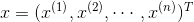</a>

    注意：`x_i` 和 `x^(i)` 含义不同，前者表示训练集中第 i 个实例，后者表示特征向量中的第 i 个分量；因此，通常记训练集为：

    

    > 特征向量用小`n`表示维数，训练集用大`N`表示个数

- **公式说明**

    所有公式都可以**点击**跳转至编辑页面，但是部分公式符号会与超链接中的转义冲突；如果编辑页面的公式与本页面中的不同，可以打开源文件，通过原链接打开。

# 信息论
> 《深度学习》 3.13 信息论
- 信息论的基本想法是：一件不太可能的事发生，要比一件非常可能的事发生，提供更多的信息。
- 该想法可描述为以下性质：
    1. 非常可能发生的事件信息量要比较少，并且极端情况下，一定能够发生的事件应该没有信息量。
    2. 比较不可能发生的事件具有更大的信息量。
    3. 独立事件应具有增量的信息。例如，投掷的硬币两次正面朝上传递的信息量，应该是投掷一次硬币正面朝上的信息量的两倍。

<h3>信息熵 与 自信息</h3>

- **自信息**（self-information）是一种量化以上性质的函数，定义一个事件`x`的自信息为：

    

    > 当该对数的底数为自然对数 e 时，单位为奈特（nats）；当以 2 为底数时，单位为比特（bit）或香农（shannons）

- 自信息只处理单个的输出。
- **信息熵**（Information-entropy）用于对整个概率分布中的**不确定性总量**进行量化：

    

    > 信息论中，记 `0log0 = 0`

<h3>交叉熵 与 相对熵/KL散度</h3>

- 定义 **P 对 Q** 的 **KL 散度**（Kullback-Leibler divergence）：

    

**KL 散度在信息论中度量的是哪个直观量？**
- 在离散型变量的情况下， KL 散度衡量的是：当我们使用一种被设计成能够使得概率分布 Q 产生的消息的长度最小的编码，发送包含由概率分布 P 产生的符号的消息时，所需要的额外信息量。

**KL散度的性质**：
- 非负；KL 散度为 0 当且仅当P 和 Q 在离散型变量的情况下是相同的分布，或者在连续型变量的情况下是“几乎处处”相同的
- 不对称；D_p(q) != D_q(p)

**交叉熵**（cross-entropy）：

> [信息量，信息熵，交叉熵，KL散度和互信息（信息增益）](https://blog.csdn.net/haolexiao/article/details/70142571) - CSDN博客

**交叉熵 与 KL 散度的关系**
- **针对 Q 最小化交叉熵等价于最小化 P 对 Q 的 KL 散度**，因为 Q 并不参与被省略的那一项。

    

- 最大似然估计中，最小化 KL 散度其实就是在最小化分布之间的交叉熵。
    > 《深度学习》 ch5.5 - 最大似然估计

# 逻辑斯蒂回归

## 逻辑斯蒂回归模型定义
<!-- TODO: 符号修改，匹配神经网络中的符号表示 -->
- **二项**逻辑斯蒂回归模型即如下的**条件概率分布**

  <!-- =\frac{\exp(z)}{1&plus;\exp(z)}=\frac{1}{1&plus;\exp(-z)}) -->
  =\frac{\exp(wx)}{1&plus;\exp(wx)}=\frac{1}{1&plus;\exp(-wx)})

  =1-P(Y=1|x))
  > 简洁起见，省略了偏置 `b`；也可以看做将偏置扩充到了权重中

  **其中** 
    
  <!-- [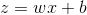](http://www.codecogs.com/eqnedit.php?latex=P(Y=0|x)=1-P(Y=1|x)) -->
  
  

- 通常会将以上两个分布记作：

  ={\color{Blue}&space;\sigma(x)}\\&space;&P(Y=0|x)={\color{Blue}&space;1-\sigma(x)}&space;\end{aligned})

> 《统计学习方法》 6.1 逻辑斯蒂回归模型
>> 原书中记作 `π(x)` 和 `1-π(x)`，这里为了跟神经网络中统一，使用 `σ`
  
## 逻辑斯蒂回归推导
> [逻辑回归推导](https://www.cnblogs.com/daguankele/p/6549891.html) - 罐装可乐 - 博客园 
- 推导的关键点 (3)
  1. 逻辑斯蒂回归的定义
  1. 损失函数（极大似然）
  1. 参数优化（梯度下降）

- 给定训练集 `T={(x1,y1),..,(xN,yN)}`，其中 `x ∈ R^n, y ∈ {0, 1}`
1. **逻辑斯蒂回归**的定义：

    [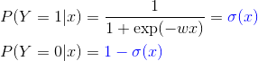](http://www.codecogs.com/eqnedit.php?latex=\begin{aligned}&space;&P(Y=1|x)={\color{Blue}&space;\sigma(x)}\\&space;&P(Y=0|x)={\color{Blue}&space;1-\sigma(x)}&space;\end{aligned})
2. **负对数函数**作为损失函数：

    &=-\log\left&space;(&space;\prod_{i=1}^N&space;[{\color{Red}&space;\sigma(x_i)}]^{{\color{Blue}&space;y_i}}&space;[{\color{Red}&space;1-&space;\sigma(x_i)}]^{{\color{Blue}&space;1-y_i}}&space;\right&space;)\\&space;&=-\sum_{i=1}^N&space;\left&space;[&space;y_i\log\sigma(x_i)&plus;(1-y_i)\log(1-\sigma(x_i))&space;\right&space;]\\&space;&=-\sum_{i=1}^N&space;\left&space;[&space;y_i\log\frac{\sigma(x_i)}{1-\sigma(x_i)}&plus;\log(1-\sigma(x_i))&space;\right&space;]&space;\end{aligned})

    进一步代入 `σ(x)` 有：

    &=-\sum_{i=1}^N&space;\left&space;[&space;{\color{Blue}&space;y_i}(w{\color{Red}&space;x_i})-\log(1&plus;\exp(w{\color{Red}&space;x_i}))&space;\right&space;]&space;\end{aligned})
3. **求梯度**
    
    }{\partial&space;w}&=-\sum_{i=1}^N&space;\left&space;[&space;y_ix_i-\frac{\exp(wx_i)}{1&plus;\exp(wx_i)}x_i&space;\right&space;]\\&space;&=\sum_{i=1}^N&space;[\sigma&space;(x_i)-y_i]x_i&space;\end{aligned})
4. 使用**梯度下降法**求解参数
    > 深度学习/[梯度下降法](../深度学习/README.md#梯度下降法)

## 多分类逻辑斯蒂回归模型 TODO
- 设 `Y ∈ {1,2,..K}`，则多项式逻辑斯蒂回归模型为：

    &=\frac{\exp(w_kx)}{1&plus;\sum_{k=1}^{K-1}&space;\exp(w_kx)}&space;\quad&space;k=1,2,..,K-1&space;\\&space;P(Y=K|x)&=\frac{1}{1&plus;\sum_{k=1}^{K-1}\exp(w_kx)}&space;\end{aligned})
- 类似 `Softmax`

# 支持向量机

## 支持向量机简述
- 支持向量机（Support Vector Machines, SVM）是一种二分类模型。它的**基本模型**是定义在特征空间上的**间隔最大**的线性分类器，间隔最大使它有别于感知机；支持向量机还包括**核技巧**，这使其成为实质上的非线性分类器。
- **SVM 的学习策略就是间隔最大化**，可形式化为一个求解**凸二次规划**的问题，也等价于正则化的**合页损失函数**的最小化问题。
- SVM 的最优化算法是求解凸二次规划的最优化算法。

### 什么是支持向量
- 训练数据集中与分离超平面距离最近的样本点的实例称为支持向量
- 更通俗的解释：
  - 数据集种的某些点，位置比较特殊。比如 `x+y-2=0` 这条直线，假设出现在直线上方的样本记为 A 类，下方的记为 B 类。
  - 在寻找找这条直线的时候，一般只需看两类数据，它们各自最靠近划分直线的那些点，而其他的点起不了决定作用。
  - 这些点就是所谓的“支持点”，在数学中，这些点称为**向量**，所以更正式的名称为“**支持向量**”。
  > [SVM中支持向量的通俗解释](https://blog.csdn.net/AerisIceBear/article/details/79588583) - CSDN博客 

### 支持向量机的分类
- 线性可分支持向量机
  - 当训练数据**线性可分**时，通过**硬间隔最大化**，学习一个线性分类器，即线性可分支持向量机，又称**硬间隔支持向量机**。
- 线性支持向量机
  - 当训练数据**接近线性可分**时，通过**软间隔最大化**，学习一个线性分类器，即线性支持向量机，又称**软间隔支持向量机**。
- 非线性支持向量机
  - 当训练数据**线性不可分**时，通过使用**核技巧**及软间隔最大化，学习非线性支持向量机。

### 核函数与核技巧
- **核函数**表示将输入从输入空间映射到特征空间后得到的特征向量之间的内积

### 最大间隔超平面背后的原理
> 机器学习技法 (1-5) - 林轩田
- 相当于在**最小化权重**时对训练误差进行了约束——对比 L2 范数正则化，则是在最小化训练误差时，对权重进行约束

  
  > 与 L2 正则化的区别
- 相当于**限制了模型复杂度**——在一定程度上防止过拟合，具有更强的泛化能力

## 支持向量机推导
- SVM 由简至繁包括：**线性可分支持向量机**、**线性支持向量机**以及**非线性支持向量机**
  
### 线性可分支持向量机推导
> 《统计学习方法》 & [支持向量机SVM推导及求解过程](https://blog.csdn.net/american199062/article/details/51322852#commentBox) - CSDN博客
- 当训练数据**线性可分**时，通过**硬间隔最大化**，学习一个线性分类器，即线性可分支持向量机，又称**硬间隔支持向量机**。
- 线性 SVM 的推导分为两部分
  1. 如何根据**间隔最大化**的目标导出 SVM 的**标准问题**；
  1. 拉格朗日乘子法对偶问题的求解过程.

**符号定义**：
---
- 训练集 `T`

  ,(x_2,y_2),\cdots,(x_N,y_N)&space;\right&space;\})

- **分离超平面** `(w,b)`

  

  如果使用映射函数，那么分离超平面为

  &plus;b^*=0)
  > 映射函数 `Φ(x)` 定义了从输入空间到特征空间的变换，特征空间通常是更高维的，甚至无穷维；方便起见，这里假设 `Φ(x)` 做的是恒等变换。
  
- 分类决策函数 `f(x)`

  =\mathrm{sign}(w^*\cdot&space;x&plus;b^*))

**SVM 标准问题的推导**(2)
---
1. **从“函数间隔”到“几何间隔”**

    给定训练集`T`和超平面`(w,b)`，定义**函数间隔`γ^`**：

    &space;\\&space;&=\underset{i=1,\cdots,N}{\min}\,\hat{\gamma}_i\end{aligned})

    对 `w` 作规范化，使函数间隔成为**几何间隔`γ`**

    \\&space;&=\underset{i=1,\cdots,N}{\min}\,\frac{\gamma_i}{{\color{Red}&space;\left&space;\|&space;w&space;\right&space;\|}}&space;\end{aligned})

1. **最大化几何间隔**

    [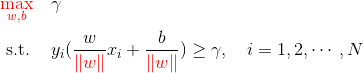](http://www.codecogs.com/eqnedit.php?latex=\begin{aligned}&space;&{\color{Red}&space;\underset{w,b}{\max}}&space;\quad\gamma&space;\\&space;&\&space;\mathrm{s.t.}\quad\,&space;y_i(\frac{w}{{\color{Red}&space;\left&space;\|&space;w&space;\right&space;\|}}x_i&plus;\frac{b}{{\color{Red}&space;\left&space;\|&space;w&space;\right&space;\|}})&space;\geq&space;\gamma,\quad&space;i=1,2,\cdots,N&space;\end{aligned})

    由函数间隔与几何间隔的关系，等价于

    &space;\geq&space;{\color{Red}&space;\hat{\gamma}},\quad&space;i=1,2,\cdots,N&space;\end{aligned})
    
    函数间隔`γ^`的取值不会影响最终的超平面`(w,b)`：取`γ^=1`；又最大化 `1/||w||` 等价于最小化`1/2*||w||^2`，于是有

    &space;\geq&space;\hat{\gamma}_i,\quad&space;i=1,2,\cdots,N&space;\end{aligned})
    > 为什么令`γ^=1`？——比例改变`(ω,b)`，超平面不会改变，但函数间隔`γ^`会成比例改变，因此可以通过等比例改变`(ω,b)`使函数间隔`γ^=1`
    
- 该约束最优化问题即为**线性支持向量机**的标准问题——这是一个**凸二次优化**问题，可以使用商业 QP 代码完成。

  理论上，线性 SVM 的问题已经解决了；但在高等数学中，**带约束的最优化问题**还可以用另一种方法求解——**拉格朗日乘子法**。该方法的优点一是更容易求解，而是自然引入**核函数**，进而推广到非线性的情况。

**SVM 对偶算法的推导**(5)
---
1. 构建**拉格朗日函数**

    [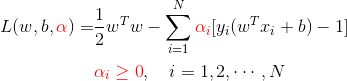](http://www.codecogs.com/eqnedit.php?latex=\begin{aligned}&space;L(w,b,{\color{Red}&space;\alpha})=&\frac{1}{2}w^Tw-\sum_{i=1}^N{\color{Red}&space;\alpha_i}[y_i(w^Tx_i&plus;b)-1]\\&space;&{\color{Red}&space;\alpha_i&space;\geq&space;0},\quad&space;i=1,2,\cdots,N&space;\end{aligned})
    
1. 标准问题是求极小极大问题：

    &space;\end{aligned})

    其对偶问题为：

    &space;\end{aligned})
    
1. 求 `L` 对 `(w,b)` 的极小

    [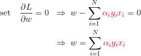](http://www.codecogs.com/eqnedit.php?latex=\begin{aligned}&space;\mathrm{set}\quad&space;\frac{\partial&space;L}{\partial&space;w}=0&space;\;\;&\Rightarrow\;&space;w-\sum_{i=1}^N&space;{\color{Red}&space;\alpha_i&space;y_i&space;x_i}=0\\&space;&\Rightarrow\;&space;w=\sum_{i=1}^N&space;{\color{Red}&space;\alpha_i&space;y_i&space;x_i}&space;\end{aligned})

    

    结果代入`L`，有：

    &space;&=\frac{1}{2}w^Tw-\sum_{i=1}^N{\color{Red}&space;\alpha_i}[y_i(w^Tx_i&plus;b)-1]\\&space;&=\frac{1}{2}w^Tw-w^T\sum_{i=1}^N&space;\alpha_iy_ix_i-b\sum_{i=1}^N&space;\alpha_iy_i&plus;\sum_{i=1}^N&space;\alpha_i\\&space;&=\frac{1}{2}w^Tw-w^Tw&plus;\sum_{i=1}^N&space;\alpha_i\\&space;&=-\frac{1}{2}w^Tw&plus;\sum_{i=1}^N&space;\alpha_i\\&space;&=-\frac{1}{2}\sum_{i=1}^N\sum_{j=1}^N&space;\alpha_i\alpha_j\cdot&space;y_iy_j\cdot&space;{\color{Red}&space;x_i^Tx_j}&plus;\sum_{i=1}^N&space;\alpha_i&space;\end{aligned})

    即

    &space;&=\frac{1}{2}w^Tw-\sum_{i=1}^N{\color{Red}&space;\alpha_i}[y_i(w^Tx_i&plus;b)-1]\\&space;&=\frac{1}{2}w^Tw-w^T\sum_{i=1}^N&space;\alpha_iy_ix_i-b\sum_{i=1}^N&space;\alpha_iy_i&plus;\sum_{i=1}^N&space;\alpha_i\\&space;&=\frac{1}{2}w^Tw-w^Tw&plus;\sum_{i=1}^N&space;\alpha_i\\&space;&=-\frac{1}{2}w^Tw&plus;\sum_{i=1}^N&space;\alpha_i\\&space;&=-\frac{1}{2}\sum_{i=1}^N\sum_{j=1}^N&space;\alpha_i\alpha_j\cdot&space;y_iy_j\cdot&space;{\color{Red}&space;x_i^Tx_j}&plus;\sum_{i=1}^N&space;\alpha_i&space;\end{aligned})
    
1. 求 `L` 对 `α` 的极大，即

    [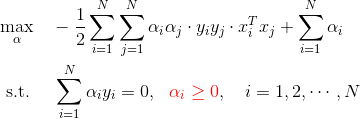](http://www.codecogs.com/eqnedit.php?latex=\begin{aligned}&space;&\underset{\alpha}{\max}&space;\quad&space;-\frac{1}{2}\sum_{i=1}^N\sum_{j=1}^N&space;\alpha_i\alpha_j\cdot&space;y_iy_j\cdot&space;x_i^Tx_j&plus;\sum_{i=1}^N&space;\alpha_i\\&space;&\&space;\mathrm{s.t.}\quad\;&space;\sum_{i=1}^N&space;\alpha_i&space;y_i=0,\&space;\&space;{\color{Red}&space;\alpha_i&space;\geq&space;0},\quad&space;i=1,2,\cdots,N&space;\end{aligned})
    
    该问题的对偶问题为：

    

    于是，标准问题最后等价于求解该**对偶问题**
    > 继续求解该优化问题，有 [SMO 方法](https://blog.csdn.net/ajianyingxiaoqinghan/article/details/73087304#t11)；因为《统计学习方法》也只讨论到这里，故推导也止于此

1. 设 `α` 的解为 `α*`，则存在下标`j`使`α_j > 0`，可得标准问题的解为：

    &space;\end{aligned})
    
    可得分离超平面及分类决策函数为：

    

    =\mathrm{sign}(w^*\cdot&space;x&plus;b^*))

# 决策树
- 决策树的训练通常由三部分组成：**特征选择**、**树的生成**、**剪枝**。

## 信息增益与信息增益比 TODO
## 分类树 - ID3 决策树与 C4.5 决策树 TODO
- ID3 决策树和 C4.5 决策树的**区别**在于：前者使用**信息增益**来进行特征选择，而后者使用**信息增益比**。

## 决策树如何避免过拟合 TODO

## 回归树 - CART 决策树
> 《统计学习方法》 5.5 CART 算法
- CART 算法是在给定输入随机变量 _`X`_ 条件下输出随机变量 _`Y`_ 的**条件概率分布**的学习方法。 
- CART 算法假设决策树是**二叉树**，内部节点特征的取值为“**是**”和“**否**”。

  这样的决策树等价于递归地二分每个特征，**将输入空间/特征空间划分为有限个单元**，然后在这些单元上确定在输入给定的条件下输出的**条件概率分布**。
- CART 决策树**既可以用于分类，也可以用于回归**；

  对回归树 CART 算法用**平方误差最小化**准则来选择特征，对分类树用**基尼指数最小化**准则选择特征

### CART 回归树算法推导
- 一个回归树对应着输入空间/**特征空间**的一个**划分**以及在划分单元上的**输出值**；
- 假设已将输入空间划分为 `M` 个单元：`{R_1,..,R_m,..,R_M}`，并在每个单元上对应有输出值 `c_m`，则该回归树可表示为
  

  > `I(x)` 为指示函数
- **如果已经划分好了输入空间**，通常使用**平方误差**作为损失函数来表示回归树对于训练数据的预测误差，通过最小化损失函数来求解每个划分单元的**最优输出值**。
- 如果使用**平方误差**，易知**最优输出值**即每个划分单元上所有实例的均值
  

  > 选用**平方误差**作为损失的原因

<h3>如何划分输入空间</h3>

- 一个启发式方法是：**以特征向量中的某一个特征为标准进行切分**。

  假设选择**特征向量中第 `j` 个变量**作为**切分变量**，然后选择**某个实例中第 `j` 个值 `s`** 作为**切分点**，则定义如下两个划分单元
  

  > 原书中这里表述不够清楚，需要结合 8.4.2 节中的示例一起看。
- 遍历**每个实例**的第`j`个值`s`，选择满足以下条件的作为**最优切分变量`j`和切分点`s`**
  

  其中输出值 `c1` 和 `c2` 分别为
  

  
  > 示例: [选择切分变量与切分点](#示例-选择切分变量与切分点)
- 接着，继续对两个子空间重复以上步骤，直到满足条件为止；得到将输入空间划分为`M`个区域的决策树
  

### 示例: 选择切分变量与切分点
> 《统计学习方法》 8.4.2
- 训练集

 x_i | 1 | 2 | 3 | 4 | 5 | 6 | 7 | 8 | 9 | 10
-----|---|---|---|---|---|---|---|---|---|---
 y_i |5.56|5.70|5.91|6.40|6.80|7.05|8.90|8.70|9.00|9.05
- 这里只有一个特征，即`j=1`；然后遍历每个实例的值作为**切分点**

  `s = {1, 2, 3, 4, 5, 6, 7, 8, 9}`
  > 原书使用的切分点为 `{1.5, 2.5, 3.5, 4.5, 5.5, 6.5, 7.5, 8.5, 9.5}`，即相邻两个点的均值；因为切分点并没有参与运算，所以我觉得两者没有区别；
  >
  > 最后一个点无法将数据划分为两个空间，所以不需要
- 以 `s=1` 为例
  
<a href="http://www.codecogs.com/eqnedit.php?latex=\begin{aligned}&space;&R_1(1,1)=\{x|x\le&space;1\}=\{1\}\\&space;&R_2(1,1)=\{x|x>1\}=\{2,3,4,5,6,7,8,9,10\}\\&space;&\&space;c_1=\frac{1}{|R_1|}=\frac{1}{1}\sum_{x_i\in&space;R_1}y_i=5.56\\&space;&\&space;c_2=\frac{1}{|R_2|}=\frac{1}{9}\sum_{x_i\in&space;R_2}y_i=7.50\\&space;&\&space;m(s)=\underset{c_1}{\min}\sum_{x_i\in&space;R_1}(y_i-c_1)^2&plus;\underset{c_2}{\min}\sum_{x_i\in&space;R_2}(y_i-c_2)^2=0&plus;15.72=15.72&space;\end{aligned}"></a>

  所有 `m(s)` 的计算结果如下

  s   | 1 | 2 | 3 | 4 | 5 | 6 | 7 | 8 | 9 
  ----|---|---|---|---|---|---|---|---|---
  m(s)|15.72|12.07|8.36|5.78|3.91|1.93|8.01|11.73|15.74

- 当 `s=6` 时 `m(s)` 达到最小值，此时
  
<a href="http://www.codecogs.com/eqnedit.php?latex=\begin{aligned}&space;&R_1(1,6)=\{x|x\le&space;6\}=\{1,2,3,4,5,6\}\\&space;&R_2(1,6)=\{x|x>6\}=\{7,8,9,10\}\\&space;&\&space;c_1=\frac{1}{|R_1|}=\frac{1}{6}\sum_{x_i\in&space;R_1}y_i=6.24\\&space;&\&space;c_2=\frac{1}{|R_2|}=\frac{1}{4}\sum_{x_i\in&space;R_2}y_i=8.91\\&space;\end{aligned}"></a>

- 所以第一棵决策树为
  

# 集成学习
- 基本思想：由多个学习器组合成一个性能更好的学习器
- **集成学习为什么有效？**——不同的模型通常会在测试集上产生不同的误差。平均上，集成模型能至少与其任一成员表现一致；并且**如果成员的误差是独立的**，集成模型将显著地比其成员表现更好。
> 《深度学习》 7.11 Bagging 和其他集成方法

## 集成学习的基本策略(3)
### 1. Boosting
- **Boosting**（提升）方法从某个**基学习器**出发，反复学习，得到一系列基学习器，然后组合它们构成一个强学习器。
- Boosting 基于**串行策略**：基学习器之间存在依赖关系，新的学习器需要依据旧的学习器生成。
- **代表算法/模型**：
  - [提升方法 AdaBoost](#提升方法-adaboost)
  - 提升树
  - 梯度提升树 GBDT
  
#### Boosting 策略要解决的两个基本问题
1. 每一轮如何改变数据的权值或概率分布？
1. 如何将弱分类器组合成一个强分类器？

### 2. Bagging
- Bagging 基于**并行策略**：基学习器之间不存在依赖关系，可同时生成。
- **代表算法/模型**：
  - [随机森林](#随机森林)
  - 神经网络的 **Dropout** 策略

### 3. Stacking
- 介绍不多，有时间再整理

## AdaBoost 算法
- AdaBoost 是 Boosting 策略的一种具体算法

**AdaBoost 算法解决 [Boosting 两个基本问题](#boosting-策略要解决的两个基本问题)的方法**
1. 每一轮如何改变数据的权值或概率分布？——开始时，每个样本的权值是一样的，AdaBoost 的做法是提高上一轮弱分类器错误分类样本的权值，同时降低那些被正确分类样本的权值。
1. 如何将弱分类器组合成一个强分类器？—— AdaBoost 采取加权表决的方法（[加法模型](#加法模型)）。具体的，AdaBoost 会加大分类误差率小的基学习器的权值，使其在表决中起到更大的作用，同时减小分类误差率大的基学习器的权值。

### AdaBoost 算法描述
- 输入：训练集 `T={(x1,y1),..,(xN,yN)}, xi ∈ R^n, yi ∈ {-1,+1}`，基学习器 `G1(x)`
- 输出：最终学习器 `G(x)`

1. 初始化训练数据的全职分布

    ,\quad&space;w_{1,i}=\frac{1}{N},\quad&space;i=1,2,\cdots,N)

1. 对 `m=1,2,..,M`
    1. 使用权值分布为`D_m`的训练集，得到基分类器：

        :\chi&space;\rightarrow&space;\{-1,&plus;1\})
    1. 计算 `G_m(x)` 在训练集上的分类误差率

        [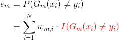](http://www.codecogs.com/eqnedit.php?latex=\begin{aligned}&space;e_m&=P(G_m(x_i)\neq&space;y_i)\\&=\sum_{i=1}^Nw_{m,i}\cdot&space;{\color{Red}&space;I(G_m(x_i)\neq&space;y_i)}&space;\end{aligned})
        > `I(x)` 为指示函数：若`G(x)!=y`为真，则`I(G(x)!=y)=1`，反之为 `0`
        >
        > 实际上分类误差率就等于所有**分类错误的数据的权值之和**
    1. 计算 `G_m(x)` 的系数

        
    1. 更新训练集的权值分布

        <!-- \\&space;w_{{\color{Red}m&plus;1},i}&=\frac{w_{{\color{Red}m},i}\cdot\exp(-\alpha_{\color{Red}m}\cdot{\color{Blue}y_iG_m(x_i)&space;})}{\sum_{i=1}^Nw_{{\color{Red}m},i}\cdot\exp(-\alpha_{\color{Red}m}\cdot{\color{Blue}y_iG_m(x_i)&space;})}&space;\end{aligned}) -->
        <!-- [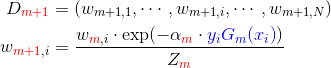](http://www.codecogs.com/eqnedit.php?latex=\begin{aligned}&space;D_{{\color{Red}m&plus;1}}&=(w_{m&plus;1,1},\cdots,w_{m&plus;1,i},\cdots,w_{m&plus;1,N})\\&space;w_{{\color{Red}m&plus;1},i}&=\frac{w_{{\color{Red}m},i}\cdot\exp(-\alpha_{\color{Red}m}\cdot{\color{Blue}y_iG_m(x_i)&space;})}{Z_{\color{Red}m}}&space;\end{aligned}) -->
        \\&space;w_{{\color{Red}m&plus;1},i}&=\frac{w_{{\color{Red}m},i}\cdot\exp(-\alpha_{\color{Red}m}\cdot{\color{Blue}y_iG_m(x_i)&space;})}{Z_{\color{Red}m}}&space;\end{aligned})

        其中 `Z_m` 为**规范化因子**，使 `D_m+1` 成为一个**概率分布**，类似 `Softmax` 函数

        <!-- &space;})) -->

        因为 `y, G(x) ∈ {-1, 1}`，所以实际上

        &space;}=\left\{\begin{matrix}&space;1,&&space;G_m(x_i)=y_i&space;\\&space;-1,&&space;G_m(x_i)\neq&space;y_i&space;\end{matrix}\right.)
        
        因此 `w_{m+1,i}` 也可以写作

        [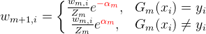](http://www.codecogs.com/eqnedit.php?latex=\dpi{120}&space;w_{m&plus;1,i}=\left\{\begin{matrix}&space;\frac{w_{m,i}}{Z_m}e^{\color{Red}&space;{-\alpha_m}},&space;&&space;G_m(x_i)=y_i&space;\\&space;\frac{w_{m,i}}{Z_m}e^{\color{Red}&space;{\alpha_m}},&&space;G_m(x_i)\neq&space;y_i&space;\end{matrix}\right.)
    
1. 构建基学习器的**线性组合**

    =\mathrm{sign}(\sum_{m=1}^M\alpha_mG_m(x)))

### AdaBoost 算法要点说明
- 开始时，训练集中所有数据具有均匀的权值分布
- 计算分类误差率，实际上就是计算所有分类错误的数据的权值之和
- `G_m(x)` 的系数 `α_m` 表示该学习器在最终学习器中的重要性；公式 
   表明当分类错误率 `e_m <= 1/2` 时，`α_m >= 0`，并且 `α_m` 随 `e_m` 的减小而增大
- 被基分类器分类错误的样本权值会扩大，而分类正确的权值会缩小——**不改变训练数据，而不断改变训练数据权值的分布，使训练数据在基学习器的学习中起到不同的作用**，这是 AdaBoost 的一个特点。

## 前向分步算法
### 加法模型
- 定义加法模型：

  =\sum_{m=1}^M\beta_m\,b(x;\gamma_m))

  其中`b(x;γ)`为基函数，`γ`为基函数的参数；`β`为基函数的系数
- 在给定训练数据和损失函数`L(y,f(x))`的情况下，学习加法模型相当于损失函数的最小化问题

  }&space;\right&space;))

### 前向分步算法描述
前向分步算法求解加法模型的想法是：如果能够从前向后，每一步只学习一个基函数及其系数，逐步优化目标函数
- 输入：训练集 `T={(x1,y1),..,(xN,yN)}`，损失函数 `L(y,f(x))`，基函数集 `{b(x;γ)}`
- 输出：加法模型 `f(x)`
1. 初始化 `f_0(x)=0`
1. 对 `m=1,2,..,M`
    1. 极小化损失函数，得到 `(β_m,γ_m)`

        [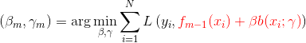](http://www.codecogs.com/eqnedit.php?latex=(\beta_m,\gamma_m)=\arg\underset{\beta,\gamma}{\min}\sum_{i=1}^NL\left&space;(&space;y_i,{\color{Red}&space;f_{m-1}(x_i)&plus;\beta&space;b(x_i;\gamma)}&space;\right&space;))

    1. 更新模型 `f_m(x)`

        ={\color{Red}&space;f_{m-1}(x)&plus;\beta&space;b(x;\gamma)})
1. 得到加法模型

    =f_M(x)={\color{Red}&space;\sum_{m=1}^M}{\color{Blue}&space;\beta_m}b(x;\gamma_m))

- 前向分步算法将**同时**求解`m=1,2,..,M`所有参数`(β_m,γ_m)`的问题**简化**为**逐次**求解各`(β_m,γ_m)`的优化问题——思想上有点像**梯度下降**

### 前向分步算法与 AdaBoost
- AdaBoost 算法是前向分步算法的特例。
- 此时，基函数为基分类器，损失函数为指数函数`L(y,f(x)) = exp(-y*f(x))`

# 梯度提升决策树 GBDT
- GBDT 是以**决策树**为基学习器、采用 Boosting 策略的一种集成学习模型
- **与提升树的区别**：残差的计算不同，提升树使用的是真正的残差，梯度提升树用当前模型的负梯度来拟合残差。

## 提升树 Boosting Tree
- 以**决策树**为基学习器，对分类问题使用二叉分类树，回归问题使用二叉回归树。
- 解决回归问题时，通过不断拟合残差得到新的树。
- 提升树模型可表示为**决策树的加法模型**：
  
<a href="http://www.codecogs.com/eqnedit.php?latex=f_M(x)=\sum_{m=1}^MT(x;\Theta_m)">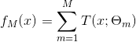</a>

- 首先初始化提升树 `f_0(x)=0`，则第 m 步的模型为
  

- 然后通过最小化损失函数决定下一个决策树的参数
  
<a href="http://www.codecogs.com/eqnedit.php?latex=\hat{\Theta}_m=\arg\underset{\Theta_m}{\min}\sum_{i=1}^NL(y_i,{\color{Red}&space;f_{m-1}(x_i)&plus;T(x_i;\Theta_m)})">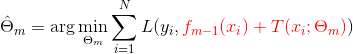</a>

- 对于二分类问题，提升树算法只需要将[AdaBoost 算法](#adaboost-算法描述)中的基学习器限制为二叉分类树即可

### 提升树算法描述
在回归问题中，新的树是通过不断拟合**残差**（residual）得到的。
- 输入：训练集 `T={(x1,y1),..,(xN,yN)}, xi ∈ R^n, yi ∈ R`
- 输出：回归提升树 `f_M(x)`
1. 初始化 `f_0(x)=0`  
1. 对 `m=1,2,..,M`
    1. 计算**残差**
        

    1. **拟合残差**学习下一个回归树的参数
        
<a href="http://www.codecogs.com/eqnedit.php?latex=\hat{\Theta}_m=\arg\underset{\Theta_m}{\min}\sum_{i=1}^N&space;L({\color{Red}&space;r_{m,i}},{\color{Blue}&space;T(x_i;\Theta_m)})">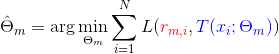</a>

        
        > [回归树算法推导](#回归树算法推导) TODO
    1. 更新 `f_m(x)`
        

1. 得到回归提升树
    

- 以平凡损失为例 TODO

## 梯度提升(GB)算法
- 当损失函数为平方损失或指数损失时，每一步的优化是很直观的；但对于一般的损失函数而言，不太容易——梯度提升正是针对这一问题提出的算法；
- 梯度提升是梯度下降的近似方法，其关键是利用损失函数的**负梯度作为残差的近似值**，来拟合下一个决策树。

## GBDT 算法描述
- 输入：训练集 `T={(x1,y1),..,(xN,yN)}, xi ∈ R^n, yi ∈ R`；损失函数 `L(y,f(x))`；
- 输出：回归树 `f_M(x)`
1. 初始化回归树
    

1. 对 `m=1,2,..,M`
    1. 对 `i=1,2,..,N`，计算残差/负梯度
        

    
    1. 对 `r_mi` 拟合一个回归树，得到第 `m` 棵树的叶节点区域
        

        > [CART 回归树算法推导](#cart-回归树算法推导)
    1. 对 `j=1,2,..,J`，计算
        

    1. 更新回归树
        

1. 得到回归树
    

- 说明：
  - 算法第 1 步初始化，估计使损失函数最小的常数值，得到一棵只有一个根节点的树
  - 第 2(i) 步计算损失函数的负梯度，将其作为残差的估计
    - 对平方损失而言，负梯度就是残差；对于一般的损失函数，它是残差的近似
  - 第 2(ii) 步估计回归树的节点区域，以拟合残差的近似值
  - 第 2(iii) 步利用线性搜索估计叶节点区域的值，使损失函数最小化

## XGBoost 算法
> [一步一步理解GB、GBDT、xgboost](https://www.cnblogs.com/wxquare/p/5541414.html) - wxquare - 博客园 
- XGBoost 是改进的[梯度提升(GB)算法](#梯度提升GB算法)；
- [XGBoost 库](https://github.com/dmlc/xgboost)是 XGBoost 算法的高效实现

### XGBoost 与 GB 的主要区别
> [Introduction to Boosted Trees](http://xgboost.readthedocs.io/en/latest/model.html) — xgboost 0.72 documentation 
- 首先，定义一棵树 `f(x)` 为
  

  > Here `w` is the vector of scores on leaves, `q` is a function assigning each data point to the corresponding leaf, and `T` is the number of leaves.

- 对损失函数加入**正则项**，包括 L2 权重衰减和对叶子数的限制
  
<a href="http://www.codecogs.com/eqnedit.php?latex=\begin{aligned}&space;&L(\theta)&space;=&space;\sum_{i=1}^n&space;l(y_i,&space;\hat{y}_i^{(t)})&space;&plus;&space;\sum_{i=1}^t\Omega(f_i)&space;\\&space;\text{where}\quad&space;&\Omega(f)&space;=&space;\gamma&space;T&space;&plus;&space;\frac{1}{2}\lambda&space;\sum_{j=1}^T&space;w_j^2&space;\end{aligned}">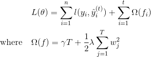</a>

- 使用**牛顿法**代替**梯度下降法**寻找最优解

  前者使用一阶+二阶导数作为残差，后者只使用了一阶导数
- 传统 CART树寻找最优切分点的标准是**最小化均方差**；

  XGBoost 通过最大化**得分公式**来寻找最优切分点：
  
<a href="http://www.codecogs.com/eqnedit.php?latex=Gain&space;=&space;\frac{1}{2}&space;\left[\frac{G_L^2}{H_L&plus;\lambda}&plus;\frac{G_R^2}{H_R&plus;\lambda}-\frac{(G_L&plus;G_R)^2}{H_L&plus;H_R&plus;\lambda}\right]&space;-&space;\gamma">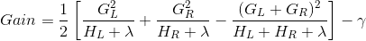</a>

  > This formula can be decomposed as 1). the score on the new left leaf 2). the score on the new right leaf 3). The score on the original leaf 4). regularization on the additional leaf.

  这同时也起到了“**剪枝**”的作用——如果分数小于`γ`，则不会增加分支；

### XGBoost 的一些内部优化
- 在寻找最佳分割点时，传统的方法会枚举每个特征的所有可能切分点。XGBoost 实现了一种近似的算法，大致的思想是根据百分位法列举几个可能成为分割点的候选者，然后从候选者中根据上面求分割点的公式计算找出最佳的分割点。
- XGBoost 考虑了训练数据为稀疏值的情况，可以为缺失值或者指定的值指定分支的默认方向，这能大大提升算法的效率，paper 提到能提高 50 倍。
- **特征列**排序后以块的形式存储在内存中，在迭代中可以重复使用；虽然 Boosting 算法迭代必须串行，但是在处理每个特征列时可以做到并行。
- 按照**特征列**方式存储能优化寻找最佳的分割点，但是当**以行计算梯度数据**时会导致内存的不连续访问，严重时会导致 **cache miss**，降低算法效率。Paper 中提到，可先将数据收集到线程内部的 buffer，然后再计算，提高算法的效率。
- XGBoost 还考虑了数据量比较大的情况，当内存不够时怎么有效的使用磁盘，主要是结合多线程、数据压缩、分片的方法，尽可能的提高算法的效率。

# 随机森林
TODO

# 机器学习实践

## Box–Muller 变换
> [Box-Muller变换原理详解](http://shishuai.org/index.php/2018/06/28/1-2/) – 史帅个人网站 
- Box–Muller 变换是一个从**均匀分布**中得到**正态分布**采样的算法

- Box–Muller 变换定理：

  假设随机变量`U1`和`U2`是 IID(独立同分布) 的，且 `U1,U2 ∽ U(0,1)`，令`Z1,Z2`满足
  

  <!-- \begin{aligned}Z_0&=\cos(2\pi U_1)\sqrt{-2\ln U_2}\\Z_1&=\sin(2\pi U_1)\sqrt{-2\ln U_2}\end{aligned} -->
  
  则 `Z1,Z2 ∽ N(0, 1)`，即 `Z1,Z2` 服从标准正态分布。

# 降维

TODO
## SVD

## PCA
- 

## t-SNE
- 在高维中接近，在低维中也接近
- 目标函数：KL 散度（非对称）

## Reference
- [Visualizing MNIST: An Exploration of Dimensionality Reduction](http://colah.github.io/posts/2014-10-Visualizing-MNIST/) - colah's blog 