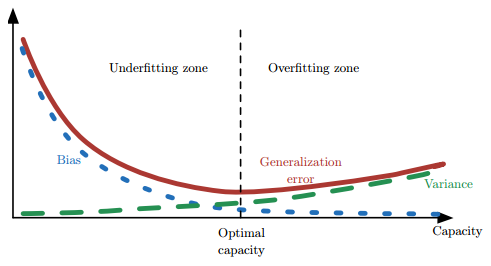

ML-专题-集成学习
===

Index
---
<!-- TOC -->

- [集成学习基本问题](#集成学习基本问题)
  - [集成学习的基本思想](#集成学习的基本思想)
  - [集成学习为什么有效？](#集成学习为什么有效)
  - [集成学习的基本策略](#集成学习的基本策略)
    - [Boosting 方法](#boosting-方法)
    - [Bagging 方法（Booststrap AGGregatING）](#bagging-方法booststrap-aggregating)
    - [Stacking 方法](#stacking-方法)
  - [为什么使用决策树作为基学习器？](#为什么使用决策树作为基学习器)
    - [为什么不稳定的学习器更适合作为基学习器？](#为什么不稳定的学习器更适合作为基学习器)
    - [还有哪些模型也适合作为基学习器？](#还有哪些模型也适合作为基学习器)
    - [Bagging 方法中能使用线性分类器作为基学习器吗？ Boosting 呢？](#bagging-方法中能使用线性分类器作为基学习器吗-boosting-呢)
  - [Boosting/Bagging 与 偏差/方差 的关系](#boostingbagging-与-偏差方差-的关系)
- [AdaBoost 算法](#adaboost-算法)
- [GBDT 算法](#gbdt-算法)

<!-- /TOC -->

## 集成学习基本问题
- 集成学习的核心是将多个

### 集成学习的基本思想
- 结合多个学习器组合成一个性能更好的学习器

### 集成学习为什么有效？
- 不同的模型通常会在**测试集**上产生不同的误差；如果成员的误差是独立的，集成模型将显著地比其成员表现更好。

### 集成学习的基本策略

#### Boosting 方法
- 基于**串行策略**：基学习器之间存在依赖关系，新的学习器需要根据上一个学习器生成。
- **基本思路**：
  - 先从**初始训练集**训练一个基学习器；初始训练集中各样本的权重是相同的；
  - 根据上一个基学习器的表现，**调整样本权重**，使分类错误的样本得到更多的关注；
  - 基于调整后的样本分布，训练下一个基学习器；
  - 测试时，对各基学习器**加权**得到最终结果
- **特点**：
  - 每次学习都会使用全部训练样本
- **代表算法**：
  - [AdaBoost 算法](#adaboost-算法)
  - [GBDT 算法](#gbdt-算法)

#### Bagging 方法（Booststrap AGGregatING）
- 基于**并行策略**：基学习器之间不存在依赖关系，可同时生成。
- **基本思路**：
  - 利用**自助采样法**对训练集随机采样，重复进行 `T` 次;
  - 基于每个采样集训练一个基学习器，并得到 `T` 个基学习器；
  - 预测时，集体**投票决策****。
    > **自助采样法**：对 m 个样本的训练集，有放回的采样 m 次；此时，样本在 m 次采样中始终没被采样的概率约为 `0.368`，即每次自助采样只能采样到全部样本的 `63%` 左右。
      <div align="center"><a href="http://www.codecogs.com/eqnedit.php?latex=\fn_jvn&space;\lim_{m\to\infty}\left&space;(&space;1-\frac{1}{m}&space;\right&space;)^m\rightarrow&space;\frac{1}{e}\approx&space;0.368"></a></div>

- **特点**：
  - 训练每个基学习器时只使用一部分样本；
  - 偏好**不稳定**的学习器作为基学习器；
    > 所谓不稳定的学习器，指的是对**样本分布**较为敏感的学习器。

#### Stacking 方法
- 基于**串行策略**：初级学习器与次级学习器之间存在依赖关系，初学习器的输出作为次级学习器的输入。
- **基本思路**：
  - 先从初始训练集训练 `T` 个**不同的初级学习器**;
  - 利用每个初级学习器的**输出**构建一个**次级数据集**，该数据集依然使用初始数据集的标签；
  - 根据新的数据集训练**次级学习器**；
  - **多级学习器**的构建过程类似。
> 周志华-《机器学习》中没有将 Stacking 方法当作一种集成策略，而是作为一种**结合策略**，比如**加权平均**和**投票**都属于结合策略。

- 为了降低过拟合的风险，一般会利用**交叉验证**的方法使不同的初级学习器在**不完全相同的子集**上训练
  ```tex
  以 k-折交叉验证为例：
  - 初始训练集 D={(x_i, y_i)} 被划分成 D1, D2, .., Dk；
  - 记 h_t 表示第 t 个学习器，并在除 Dj 外的数据上训练；
  - 当 h_t 训练完毕后，有 z_it = h_t(x_i)；
  - T 个初级学习器在 x_i 上共产生 T 个输出；
  - 这 T 个输出共同构成第 i 个次级训练数据 z_i = (z_i1, z_i2, ..., z_iT)，标签依然为 y_i；
  - 在 T 个初级学习器都训练完毕后，得到次级训练集 D'={(z_i, y_i)}
  ```

### 为什么使用决策树作为基学习器？
- **类似问题**
  - 基学习器有什么特点？
  - 基学习器有什么要求？

- 使用决策树作为基学习器的原因：
  ```tex
  (1). 决策树的表达能力和泛化能力，可以通过剪枝快速调整；
  (2). 决策树可以方便地将**样本的权重**整合到训练过程中；
  (3). 决策树是一种**不稳定**的学习器；
       所谓不稳定，指的是数据样本的扰动会对决策树的结果产生较大的影响；
  ```
  - 后两点分别适合 Boosting 策略和 Bagging 策略；所以它们一般都使用决策树作为基学习器。
  
#### 为什么不稳定的学习器更适合作为基学习器？
- 不稳定的学习器容易受到**样本分布**的影响（方差大），很好的引入了**随机性**；这有助于在集成学习（特别是采用 **Bagging** 策略）中提升模型的**泛化能力**。
- 为了更好的引入随机性，有时会随机选择一个**属性子集**中的最优分裂属性，而不是全局最优（**随机森林**）

#### 还有哪些模型也适合作为基学习器？
- **神经网络**
  - 神经网络也属于**不稳定**的学习器；
  - 此外，通过调整神经元的数量、网络层数，连接方式初始权重也能很好的引入随机性和改变模型的表达能力和泛化能力。

#### Bagging 方法中能使用线性分类器作为基学习器吗？ Boosting 呢？
- Bagging 方法中**不推荐**
  - 线性分类器都属于稳定的学习器（方差小），对数据不敏感；
  - 甚至可能因为 Bagging 的采样，导致在训练中难以收敛，增大集成分类器的**偏差**
- Boosting 方法中可以使用
  - Boosting 方法主要通过降低**偏差**的方式来提升模型的性能，而线性分类器本身具有方差小的特点，所以两者有一定相性
  - XGBoost 中就支持以线性分类器作为基学习器。

### Boosting/Bagging 与 偏差/方差 的关系
> ./机器学习基础/[偏差与方差](./ML-A-机器学习基础.md#偏差与方差)

- 简单来说，**Boosting** 能提升弱分类器性能的原因是降低了**偏差**；**Bagging** 则是降低了**方差**；
- **Boosting** 方法：
  - Boosting 的**基本思路**就是在不断减小模型的**训练误差**（拟合残差或者加大错类的权重），加强模型的学习能力，从而减小偏差；
  - 但 Boosting 不会显著降低方差，因为其训练过程中各基学习器是强相关的，缺少独立性。
- **Bagging** 方法：
  - 对 `n` 个**独立不相关的模型**预测结果取平均，方差是原来的 `1/n`；
  - 假设所有基分类器出错的概率是独立的，**超过半数**基分类器出错的概率会随着基分类器的数量增加而下降。
- 泛化误差、偏差、方差、过拟合、欠拟合、模型复杂度（模型容量）的关系图：
  <div align="center"></div>

## AdaBoost 算法

## GBDT 算法