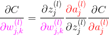
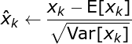
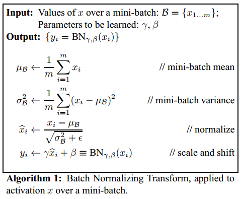
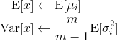
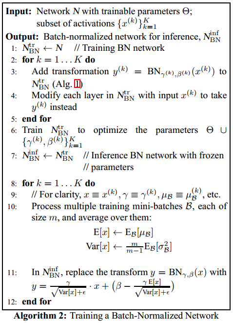

深度学习基础
===

相关专题
---
- [《深度学习》整理](./《深度学习》整理)
- [CNN 专题](./B-专题-CNN)
- [RNN 专题](./B-专题-RNN)
- [优化算法专题](./C-专题-优化算法)
    - **随机梯度下降**
    - **动量**算法
    - **自适应学习率**算法
    - 基于**二阶梯度**的优化算法

Index
---
<!-- TOC -->

- [过拟合与欠拟合](#过拟合与欠拟合)
    - [降低过拟合风险的方法](#降低过拟合风险的方法)
    - [降低欠拟合风险的方法](#降低欠拟合风险的方法)
- [反向传播算法](#反向传播算法)
    - [反向传播的作用/目的/本质](#反向传播的作用目的本质)
    - [反向传播的公式推导](#反向传播的公式推导)
- [激活函数](#激活函数)
    - [激活函数的作用——为什么要使用非线性激活函数？](#激活函数的作用为什么要使用非线性激活函数)
    - [常见的激活函数](#常见的激活函数)
        - [整流线性单元 `ReLU`](#整流线性单元-relu)
            - [`ReLU` 的拓展](#relu-的拓展)
        - [`sigmoid` 与 `tanh`](#sigmoid-与-tanh)
        - [其他激活函数](#其他激活函数)
    - [`ReLU` 相比 `sigmoid` 的优势 (3)](#relu-相比-sigmoid-的优势-3)
- [正则化](#正则化)
    - [Batch Normalization（批标准化）](#batch-normalization批标准化)
        - [动机](#动机)
        - [基本原理](#基本原理)
        - [BN 在训练和测试时分别是怎么做的？](#bn-在训练和测试时分别是怎么做的)
            - [为什么训练时不采用移动平均？](#为什么训练时不采用移动平均)
        - [相关阅读](#相关阅读)
    - [L1/L2 范数正则化](#l1l2-范数正则化)
        - [L1/L2 范数的作用、异同](#l1l2-范数的作用异同)
        - [为什么 L1 和 L2 正则化可以防止过拟合？](#为什么-l1-和-l2-正则化可以防止过拟合)
        - [为什么 L1 正则化可以产生稀疏权值，而 L2 不会？](#为什么-l1-正则化可以产生稀疏权值而-l2-不会)
    - [Dropout](#dropout)
        - [Bagging 集成方法](#bagging-集成方法)
        - [Dropout 策略](#dropout-策略)
            - [Dropout 与 Bagging 的不同](#dropout-与-bagging-的不同)
- [深度学习实践](#深度学习实践)
    - [参数初始化](#参数初始化)

<!-- /TOC -->

# 过拟合与欠拟合
> 《深度学习》 5.2 容量、过拟合和欠拟合

- **欠拟合**指模型不能在**训练集**上获得足够低的**训练误差**；
- **过拟合**指模型的**训练误差**与**测试误差**（泛化误差）之间差距过大；
  - 反映在**评价指标**上，就是模型在训练集上表现良好，但是在测试集和新数据上表现一般（**泛化能力差**）；

## 降低过拟合风险的方法
> 所有为了**减少测试误差**的策略统称为**正则化方法**，这些方法可能会以增大训练误差为代价。

- **数据增强**
  - 图像：平移、旋转、缩放
  - 利用**生成对抗网络**（GAN）生成新数据
  - NLP：利用机器翻译生成新数据
- **降低模型复杂度**
  - 神经网络：减少网络层、神经元个数
  - 决策树：降低树的深度、剪枝
  - ...
- **权值约束**（添加正则化项）
  - L1 正则化
  - L2 正则化
- **集成学习**
  - 神经网络：Dropout
  - 决策树：随机森林、GBDT
- **提前终止**

## 降低欠拟合风险的方法
- 加入新的特征
  - 交叉特征、多项式特征、...
  - 深度学习：因子分解机、Deep-Crossing、自编码器
- 增加模型复杂度
  - 线性模型：添加高次项
  - 神经网络：增加网络层数、神经元个数
- 减小正则化项的系数
  - 添加正则化项是为了限制模型的学习能力，减小正则化项的系数则可以放宽这个限制
  - 模型通常更倾向于更大的权重，更大的权重可以使模型更好的拟合数据


# 反向传播算法

## 反向传播的作用/目的/本质
- **反向传播概述**：

  **梯度下降法**中需要利用损失函数对所有参数的梯度来寻找局部最小值点；

  而**反向传播算法**就是用于计算该梯度的具体方法，其本质是利用**链式法则**对每个参数求偏导。

## 反向传播的公式推导
> 数学/深度学习的核心/[反向传播的 4 个基本公式](../C-数学/B-深度学习的核心#反向传播的-4-个基本公式)
- 可以用 4 个公式总结反向传播的过程

    **标量形式**：

    [](http://www.codecogs.com/eqnedit.php?latex=\begin{aligned}&space;\frac{\partial&space;C}{\partial&space;{\color{Red}&space;a_j^{(L)}}}=\frac{\partial&space;C({\color{Red}&space;a_j^{(L)}},y_j)}{\partial&space;{\color{Red}&space;a_j^{(L)}}}&space;\end{aligned})

    [](http://www.codecogs.com/eqnedit.php?latex=\begin{aligned}&space;\frac{\partial&space;C}{{\color{Red}&space;\partial&space;a_j^{(l)}}}={\color{Teal}\sum_{k=0}^{n_l-1}}&space;\frac{\partial&space;z_k^{(l&plus;1)}}{{\color{Red}&space;\partial&space;a_j^{(l)}}}&space;\frac{{\color{Blue}&space;\partial&space;a_k^{(l&plus;1)}}}{\partial&space;z_k^{(l&plus;1)}}&space;\frac{\partial&space;C}{{\color{Blue}&space;\partial&space;a_k^{(l&plus;1)}}}&space;\end{aligned})

    [](http://www.codecogs.com/eqnedit.php?latex=\begin{aligned}&space;\frac{\partial&space;C}{{\color{Magenta}&space;\partial&space;w_{j,k}^{(l)}}}=\frac{\partial&space;z_j^{(l)}}{{\color{Magenta}&space;\partial&space;w_{j,k}^{(l)}}}\frac{{\color{Red}\partial&space;a_j^{(l)}}}{\partial&space;z_j^{(l)}}\frac{\partial&space;C}{{\color{Red}\partial&space;a_j^{(l)}}}&space;\end{aligned})

    [](http://www.codecogs.com/eqnedit.php?latex=\begin{aligned}&space;\frac{\partial&space;C}{{\color{Magenta}&space;\partial&space;b_{j}^{(l)}}}=\frac{\partial&space;z_j^{(l)}}{{\color{Magenta}&space;\partial&space;b_{j}^{(l)}}}\frac{{\color{Red}\partial&space;a_j^{(l)}}}{\partial&space;z_j^{(l)}}\frac{\partial&space;C}{{\color{Red}\partial&space;a_j^{(l)}}}&space;\end{aligned})
    
    > 上标 `(l)` 表示网络的层，`(L)` 表示输出层（最后一层）；下标 `j` 和 `k` 指示神经元的位置；`w_jk` 表示 `l` 层的第 `j` 个神经元与`(l-1)`层第 `k` 个神经元连线上的权重

- **符号说明**，其中：
    - `(w,b)` 为网络参数：权值和偏置
    - `z` 表示上一层激活值的线性组合
    - `a` 即 "activation"，表示每一层的激活值，上标`(l)`表示所在隐藏层，`(L)`表示输出层
    - `C` 表示激活函数，其参数为神经网络输出层的激活值`a^(L)`，与样本的标签`y`

        

- 以 **均方误差（MSE）** 损失函数为例，有

    [](http://www.codecogs.com/eqnedit.php?latex=\begin{aligned}&space;\frac{\partial&space;C}{\partial&space;{\color{Red}&space;a_j^{(L)}}}&=\frac{\partial&space;C({\color{Red}&space;a_j^{(L)}},y_j)}{\partial&space;{\color{Red}&space;a_j^{(L)}}}&space;\\&space;&=\frac{\partial&space;\left&space;(&space;\frac{1}{2}({\color{Red}a_j^{(L)}}-y_j)^2&space;\right&space;)&space;}{\partial&space;{\color{Red}a_j^{(L)}}}={\color{Red}a_j^{(L)}}-y&space;\end{aligned})

- Nielsen 的课程中提供了另一种更利于计算的表述，本质上是一样的。

    

    > [The four fundamental equations behind backpropagation](http://neuralnetworksanddeeplearning.com/chap2.html#the_four_fundamental_equations_behind_backpropagation)


# 激活函数

## 激活函数的作用——为什么要使用非线性激活函数？
- 使用**激活函数**的目的是为了向网络中加入**非线性因素**；加强网络的表示能力，解决**线性模型**无法解决的问题
    > [神经网络激励函数的作用是什么？有没有形象的解释？](https://www.zhihu.com/question/22334626) - 知乎 
  
**为什么加入非线性因素能够加强网络的表示能力？——神经网络的万能近似定理**
- 神经网络的万能近似定理认为主要神经网络具有至少一个非线性隐藏层，那么只要给予网络足够数量的隐藏单元，它就可以以任意的精度来近似任何**从一个有限维空间到另一个有限维空间**的函数。
- 如果不使用非线性激活函数，那么每一层输出都是上层输入的**线性组合**；

  此时无论网络有多少层，其整体也将是线性的，这会导致失去万能近似的性质
  > 《深度学习》 6.4.1 万能近似性质和深度；
- 但仅**部分层是纯线性**是可以接受的，这有助于**减少网络中的参数**。
  > 《深度学习》 6.3.3 其他隐藏单元

## 常见的激活函数
> 《深度学习》 6.3 隐藏单元

### 整流线性单元 `ReLU`
- ReLU 通常是激活函数较好的默认选择

    <div align="center"><a href="http://www.codecogs.com/eqnedit.php?latex=g(z)=\max(0,z)"></a></div>
    <div align="center"></div>

#### `ReLU` 的拓展
- `ReLU` 及其扩展都基于以下公式：

    <div align="center"><a href="http://www.codecogs.com/eqnedit.php?latex=g(z;\alpha)&space;=\max(0,z)&plus;\alpha\min(0,z)"></a></div>

    当 `α=0` 时，即标准的线性整流单元
- **绝对值整流**（absolute value rectification）
    
  固定 `α = -1`，此时整流函数即**绝对值函数** `g(z)=|z|`
  
- **渗漏整流线性单元**（Leaky ReLU, Maas et al., 2013）
    
  固定 `α` 为一个小值，比如 0.01

- **参数化整流线性单元**（parametric ReLU, PReLU, He et al., 2015）

  将 `α` 作为一个可学习的参数
  
- **`maxout` 单元** (Goodfellow et al., 2013a)

  `maxout` 单元 进一步扩展了 `ReLU`，它是一个可学习的 `k` 段函数
  
  **Keras 简单实现**
  ```
  # input shape:  [n, input_dim]
  # output shape: [n, output_dim]
  W = init(shape=[k, input_dim, output_dim])
  b = zeros(shape=[k, output_dim])
  output = K.max(K.dot(x, W) + b, axis=1)
  ```
  > 参数数量是普通全连接层的 k 倍
  >> [深度学习（二十三）Maxout网络学习](https://blog.csdn.net/hjimce/article/details/50414467) - CSDN博客

### `sigmoid` 与 `tanh`
- `sigmoid(z)`，常记作 `σ(z)`；
- `tanh(z)` 的图像与 `sigmoid(z)` 大致相同，区别是**值域**为 `(-1, 1)`
  
    <div align="center"><a href="http://www.codecogs.com/eqnedit.php?latex=\sigma(z)=\frac{1}{1&plus;\exp(-z)}"></a></div>
    <div align="center"></div>

### 其他激活函数
> 很多未发布的非线性激活函数也能表现的很好，但没有比流行的激活函数表现的更好。比如使用 `cos` 也能在 MNIST 任务上得到小于 1% 的误差。通常新的隐藏单元类型只有在被明确证明能够提供显著改进时才会被发布。

- **线性激活函数**：

  如果神经网络的每一层都由线性变换组成，那么网络作为一个整体也将是线性的，这会导致失去万能近似的性质。但是，仅**部分层是纯线性**是可以接受的，这可以帮助**减少网络中的参数**。

- **softmax**：

  softmax 单元常作为网络的输出层，它很自然地表示了具有 k 个可能值的离散型随机变量的概率分布。

- **径向基函数（radial basis function, RBF）**：

    <div align="center"><a href="http://www.codecogs.com/eqnedit.php?latex=h_i=\exp(-\frac{1}{\sigma_i^2}\left&space;\|&space;W_{:,i}-x&space;\right&space;\|^2)"></a></div>

  在神经网络中很少使用 RBF 作为激活函数，因为它对大部分 x 都饱和到 0，所以很难优化。

- **softplus**：

    `softplus` 是 `ReLU` 的平滑版本。

    <div align="center"><a href="http://www.codecogs.com/eqnedit.php?latex=g(z)=\zeta(z)=\log(1&plus;\exp(z))"></a></div>
    <div align="center"></div>

  通常不鼓励使用 softplus 函数，大家可能希望它具有优于整流线性单元的性质，但根据经验来看，它并没有。
  > (Glorot et al., 2011a) 比较了这两者，发现 ReLU 的结果更好。

- **硬双曲正切函数（hard tanh）**：

    <div align="center"><a href="http://www.codecogs.com/eqnedit.php?latex=g(a)=\max(-1,\min(1,a))"></a></div>

  它的形状和 tanh 以及整流线性单元类似，但是不同于后者，它是有界的。
  
## `ReLU` 相比 `sigmoid` 的优势 (3)

1. **避免梯度消失*****
    - `sigmoid`函数在输入取绝对值非常大的正值或负值时会出现**饱和**现象——在图像上表现为变得很平，此时函数会对输入的微小变化不敏感——从而造成梯度消失；
    - `ReLU` 的导数始终是一个常数——负半区为 0，正半区为 1——所以不会发生梯度消失现象
2. **减缓过拟合****
    - `ReLU` 在负半区的输出为 0。一旦神经元的激活值进入负半区，那么该激活值就不会产生梯度/不会被训练，造成了网络的稀疏性——**稀疏激活**
    - 这有助于减少参数的相互依赖，缓解过拟合问题的发生
3. **加速计算***
    - `ReLU` 的求导不涉及浮点运算，所以速度更快

> 总结自知乎两个答案 [Ans1](https://www.zhihu.com/question/52020211/answer/152378276) & [Ans2](https://www.zhihu.com/question/29021768/answer/43488153)

**为什么 ReLU 不是全程可微/可导也能用于基于梯度的学习？**
- 虽然从数学的角度看 ReLU 在 0 点不可导，因为它的左导数和右导数不相等；
- 但是在实现时通常会返回左导数或右导数的其中一个，而不是报告一个导数不存在的错误。从而避免了这个问题


# 正则化

## Batch Normalization（批标准化）
- BN 是一种**正则化**方法（减少泛化误差），主要作用有：
    - **加速网络的训练**（缓解梯度消失，支持更大的学习率）
    - **防止过拟合**
    - 降低了**参数初始化**的要求。

### 动机
- **训练的本质是学习数据分布**。如果训练数据与测试数据的分布不同会**降低**模型的**泛化能力**。因此，应该在开始训练前对所有输入数据做归一化处理。
- 而在神经网络中，因为**每个隐层**的参数不同，会使下一层的输入发生变化，从而导致每一批数据的分布也发生改变；**致使**网络在每次迭代中都需要拟合不同的数据分布，增大了网络的训练难度与**过拟合**的风险。

### 基本原理
- BN 方法会针对**每一批数据**，在**网络的每一层输入**之前增加**归一化**处理，使输入的均值为 `0`，标准差为 `1`。**目的**是将数据限制在统一的分布下。
- 具体来说，针对每层的第 `k` 个神经元，计算**这一批数据**在第 `k` 个神经元的均值与标准差，然后将归一化后的值作为该神经元的激活值。
    <div align="center"><a href="http://www.codecogs.com/eqnedit.php?latex=\fn_jvn&space;\large&space;\hat{x}_k\leftarrow&space;\frac{x_k-\mathrm{E}[x_k]&space;}{\sqrt{\mathrm{Var}[x_k]}}"></a></div>

- BN 可以看作在各层之间加入了一个新的计算层，**对数据分布进行额外的约束**，从而增强模型的泛化能力；
- 但同时 BN 也降低了模型的拟合能力，破坏了之前学到的**特征分布**；
- 为了**恢复数据的原始分布**，BN 引入了一个**重构变换**来还原最优的输入数据分布
    <div align="center"><a href="http://www.codecogs.com/eqnedit.php?latex=\fn_jvn&space;\large&space;y_k\leftarrow&space;\gamma&space;\hat{x}_k&plus;\beta"></a></div>

  其中 `γ` 和 `β` 为可训练参数。

**小结**
- 以上过程可归纳为一个 **`BN(x)` 函数**：
    <div align="center"><a href="http://www.codecogs.com/eqnedit.php?latex=\large&space;\boldsymbol{y_i}=\mathrm{BN}(\boldsymbol{x_i})"></a></div>

  其中
    <div align="center"><a href="http://www.codecogs.com/eqnedit.php?latex=\large&space;\begin{aligned}&space;\mathrm{BN}(\boldsymbol{x_i})&=\gamma\boldsymbol{\hat{x}_i}&plus;\beta\\&space;&=\gamma\frac{\boldsymbol{x_i}-\boldsymbol{\mathrm{E}[x_i]}}{\sqrt{\boldsymbol{\mathrm{Var}[x_i]}&plus;\epsilon}}&plus;\beta&space;\end{aligned}"></a></div>

- **完整算法**：
    <div align="center"></div>

### BN 在训练和测试时分别是怎么做的？
- **训练时**每次会传入一批数据，做法如前述；
- 当**测试**或**预测时**，每次可能只会传入**单个数据**，此时模型会使用**全局统计量**代替批统计量；
    - 训练每个 batch 时，都会得到一组`（均值，方差）`；
    - 所谓全局统计量，就是对这些均值和方差求其对应的数学期望；
    - 具体计算公式为：
    
        <div align="center"><a href="http://www.codecogs.com/eqnedit.php?latex=\fn_jvn&space;\large&space;y_k\leftarrow&space;\gamma&space;\hat{x}_k&plus;\beta"></a></div>
  
    > 其中 `μ_i` 和 `σ_i` 分别表示第 i 轮 batch 保存的均值和标准差；`m` 为 batch_size，系数 `m/(m-1)` 用于计算**无偏方差估计**
    >> 原文称该方法为**移动平均**（moving averages）

- 此时，`BN(x)` 调整为：

    <div align="center"><a href="http://www.codecogs.com/eqnedit.php?latex=\large&space;\begin{aligned}&space;\mathrm{BN}(\boldsymbol{x_i})&=\gamma\frac{\boldsymbol{x_i}-\boldsymbol{\mathrm{E}[x_i]}}{\sqrt{\boldsymbol{\mathrm{Var}[x_i]}&plus;\epsilon}}&plus;\beta\\&space;&=\frac{\gamma}{\sqrt{\boldsymbol{\mathrm{Var}[x_i]}&plus;\epsilon}}\boldsymbol{x_i}&plus;\left&space;(&space;\beta-\frac{\gamma\boldsymbol{\mathrm{E}[x_i]}}{\sqrt{\boldsymbol{\mathrm{Var}[x_i]}&plus;\epsilon}}&space;\right&space;)&space;\end{aligned}"></a></div>

- **完整算法**：
    <div align="center"></div>

#### 为什么训练时不采用移动平均？
> 群里一位同学的面试题
- 使用 BN 的目的就是为了保证每批数据的分布稳定，使用全局统计量反而违背了这个初衷；
- BN 的作者认为在训练时采用移动平均可能会与梯度优化存在冲突；
    > 【**原文**】"It is natural to ask whether we could simply **use the moving averages** µ, σ to perform the normalization **during training**, since this would remove the dependence of the normalized activations on the other example in the minibatch. This, however, has been observed to lead to the model blowing up. As argued in [6], such use of moving averages would cause the gradient optimization and the normalization to counteract each other. For example, the gradient step may increase a bias or scale the convolutional weights, in spite of the fact that the normalization would cancel the effect of these changes on the loss. This would result in unbounded growth of model parameters without actually improving the loss. It is thus crucial to use the minibatch moments, and to backpropagate through them."
    >> [1702.03275] [Batch Renormalization](https://arxiv.org/abs/1702.03275)

### 相关阅读
- [深入理解Batch Normalization批标准化 - 郭耀华](https://www.cnblogs.com/guoyaohua/p/8724433.html) - 博客园 
- [深度学习中批归一化的陷阱](http://ai.51cto.com/art/201705/540230.htm) - 51CTO


## L1/L2 范数正则化
> 《深度学习》 7.1.1 L2 参数正则化 & 7.1.2 - L1 参数正则化
>
> [机器学习中正则化项L1和L2的直观理解](https://blog.csdn.net/jinping_shi/article/details/52433975) - CSDN博客

### L1/L2 范数的作用、异同
**相同点**
- 限制模型的学习能力——通过限制参数的规模，使模型偏好于**权值较小**的目标函数，防止过拟合。

**不同点**
- **L1 正则化**可以产生更**稀疏**的权值矩阵，可以用于特征选择，同时一定程度上防止过拟合；**L2 正则化**主要用于防止模型过拟合
- **L1 正则化**适用于特征之间有关联的情况；**L2 正则化**适用于特征之间没有关联的情况。

### 为什么 L1 和 L2 正则化可以防止过拟合？
- L1 & L2 正则化会使模型偏好于更小的权值。
- 更小的权值意味着**更低的模型复杂度**；添加 L1 & L2 正则化相当于为模型添加了某种**先验**，限制了参数的分布，从而降低了模型的复杂度。
- 模型的复杂度降低，意味着模型对于噪声与异常点的抗干扰性的能力增强，从而提高模型的泛化能力。——直观来说，就是对训练数据的拟合刚刚好，不会过分拟合训练数据（比如异常点，噪声）——**奥卡姆剃刀原理**

### 为什么 L1 正则化可以产生稀疏权值，而 L2 不会？
- 对目标函数添加范数正则化，训练时相当于在范数的约束下求目标函数 `J` 的最小值
- 带有**L1 范数**（左）和**L2 范数**（右）约束的二维图示

    
    
    - 图中 `J` 与 `L1` 首次相交的点即是最优解。`L1` 在和每个坐标轴相交的地方都会有“**顶点**”出现，多维的情况下，这些顶点会更多；在顶点的位置就会产生稀疏的解。而 `J` 与这些“顶点”相交的机会远大于其他点，因此 `L1` 正则化会产生稀疏的解。
    - `L2` 不会产生“**顶点**”，因此 `J` 与 `L2` 相交的点具有稀疏性的概率就会变得非常小。

## Dropout
> 《深度学习》 7.12 Dropout
### Bagging 集成方法
- **集成方法**的主要想法是分别训练不同的模型，然后让所有模型**表决**最终的输出。

  集成方法奏效的原因是不同的模型**通常不会**在测试集上产生相同的误差。

  集成模型能至少与它的任一成员表现得一样好。**如果成员的误差是独立的**，集成将显著提升模型的性能。
  
- **Bagging** 是一种集成策略——具体来说，Bagging 涉及构造 k 个**不同的数据集**。

  每个数据集从原始数据集中**重复采样**构成，和原始数据集具有**相同数量**的样例——这意味着，每个数据集以高概率缺少一些来自原始数据集的例子，还包含若干重复的例子
  
  > 更具体的，如果采样所得的训练集与原始数据集大小相同，那所得数据集中大概有原始数据集 `2/3` 的实例
  
**集成方法与神经网络**：
- 神经网络能找到足够多的不同的解，意味着他们可以从模型平均中受益——即使所有模型都在同一数据集上训练。 

  神经网络中**随机初始化**的差异、**批训练数据**的随机选择、**超参数**的差异等**非确定性**实现往往足以使得集成中的不同成员具有**部分独立的误差**。

### Dropout 策略
- 简单来说，Dropout 通过**参数共享**提供了一种廉价的 Bagging 集成近似—— Dropout 策略相当于集成了包括所有从基础网络除去部分单元后形成的子网络。
- 通常，**隐藏层**的采样概率为 `0.5`，**输入**的采样概率为 `0.8`；超参数也可以采样，但其采样概率一般为 `1`
  
    <div align="center"></div>

**权重比例推断规则**
- 权重比例推断规则的目的是确保在测试时一个单元的期望总输入与在训练时该单元的期望总输入大致相同。
- 实践时，如果使用 `0.5` 的采样概率，**权重比例规则**相当于在训练结束后**将权重乘 `0.5`**，然后像平常一样使用模型；等价的，另一种方法是**在训练时**将单元的状态乘 2。
 
#### Dropout 与 Bagging 的不同
- 在 Bagging 的情况下，所有模型都是独立的；而在 Dropout 的情况下，所有模型**共享参数**，其中每个模型继承父神经网络参数的不同子集。
- 在 Bagging 的情况下，每一个模型都会在其相应训练集上训练到收敛。而在 Dropout 的情况下，通常大部分模型都没有显式地被训练；取而代之的是，在单个步骤中我们训练一小部分的子网络，参数共享会使得剩余的子网络也能有好的参数设定。


# 深度学习实践

## 参数初始化
- 一般使用服从的**高斯分布**（`mean=0, stddev=1`）或**均匀分布**的随机值作为**权重**的初始化参数；使用 `0` 作为**偏置**的初始化参数
- 一些**启发式**方法会根据**输入与输出的单元数**来决定初始值的范围
    
    比如 `glorot_uniform` 方法 (Glorot and Bengio, 2010)

    <div align="center"><a href="http://www.codecogs.com/eqnedit.php?latex=W_{i,j}\sim&space;U\left&space;(&space;-\sqrt&space;\frac{6}{n_{in}&plus;n_{out}},&space;\sqrt&space;\frac{6}{n_{in}&plus;n_{out}}&space;\right&space;)"></a></div>

    > Keras 全连接层默认的**权重**初始化方法
    
- **其他初始化方法**
    - 随机正交矩阵（Orthogonal）
    - 截断高斯分布（Truncated normal distribution）

- Keras 提供的参数初始化方法：Keras/[Initializers](https://keras.io/initializers/)
