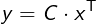
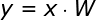
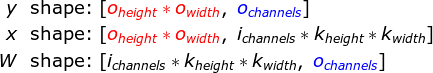
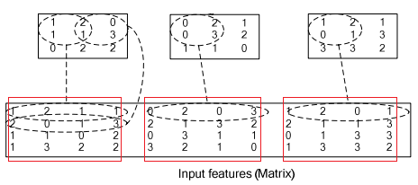
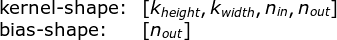

DL-专题-CNN
===

Index
---
<!-- TOC -->

- [CNN 的基本特征](#cnn-的基本特征)
  - [动机](#动机)
  - [意义](#意义)
- [卷积的内部实现](#卷积的内部实现)
  - [Theano 中的实现](#theano-中的实现)
  - [Caffe 中的实现](#caffe-中的实现)
- [卷积的反向传播](#卷积的反向传播)
- [卷积的结构](#卷积的结构)
  - [卷积核的结构及其数量](#卷积核的结构及其数量)
  - [基本卷积](#基本卷积)
  - [转置卷积](#转置卷积)
  - [空洞卷积](#空洞卷积)
  - [可分离卷积](#可分离卷积)
  - [Keras 实现](#keras-实现)
- [门卷积](#门卷积)
  - [门卷积的作用](#门卷积的作用)
  - [门卷积是如何防止梯度消失的](#门卷积是如何防止梯度消失的)
- [其他](#其他)
  - [为什么使用 CNN 代替 RNN？](#为什么使用-cnn-代替-rnn)
- [Reference](#reference)

<!-- /TOC -->

## CNN 的基本特征
- **稀疏交互**和**参数共享**

### 动机
- **局部特征**——卷积的核心思想
- 平移等变性

### 意义
- **提高统计效率**
  - 当处理一张图像时，输入的图像可能包含成千上万个像素点，但是我们可以通过只占用几十到上百个像素点的核来检测一些局部但有意义的特征，例如图像的边缘。
- **减少参数数量**
  - 减少存储需求
  - 加速计算


## 卷积的内部实现

### Theano 中的实现
> [Convolution as a matrix operation](http://deeplearning.net/software/theano/tutorial/conv_arithmetic.html#convolution-as-a-matrix-operation)

- 先把二维 `input` 展开成一维向量（`[in_h, in_w] -> [in_h * in_w]`）；如果是一批 `inputs`，则依次堆叠为一个矩阵 `[N, in_h * in_w]`；
- 然后将 `kernel` 按 stride **循环**展开成一个**稀疏矩阵**；
  <div align="center"><a href="http://www.codecogs.com/eqnedit.php?latex=\fn_cm&space;C=\begin{pmatrix}&space;w_{0,0}&space;&&space;w_{0,1}&space;&&space;w_{0,2}&space;&&space;0&space;&&space;w_{1,0}&space;&&space;w_{1,1}&space;&&space;w_{1,2}&space;&&space;0&space;&&space;w_{2,0}&space;&&space;w_{2,1}&space;&&space;w_{2,2}&space;&&space;0&space;&&space;0&space;&&space;0&space;&&space;0&space;&&space;0\\&space;0&space;&&space;w_{0,0}&space;&&space;w_{0,1}&space;&&space;w_{0,2}&space;&&space;0&space;&&space;w_{1,0}&space;&&space;w_{1,1}&space;&&space;w_{1,2}&space;&&space;0&space;&&space;w_{2,0}&space;&&space;w_{2,1}&space;&&space;w_{2,2}&space;&&space;0&space;&&space;0&space;&&space;0&space;&&space;0\\&space;0&space;&&space;0&space;&&space;0&space;&&space;0&space;&&space;w_{0,0}&space;&&space;w_{0,1}&space;&&space;w_{0,2}&space;&&space;0&space;&&space;w_{1,0}&space;&&space;w_{1,1}&space;&&space;w_{1,2}&space;&&space;0&space;&&space;w_{2,0}&space;&&space;w_{2,1}&space;&&space;w_{2,2}&space;&&space;0\\&space;0&space;&&space;0&space;&&space;0&space;&&space;0&space;&&space;0&space;&&space;w_{0,0}&space;&&space;w_{0,1}&space;&&space;w_{0,2}&space;&&space;0&space;&&space;w_{1,0}&space;&&space;w_{1,1}&space;&&space;w_{1,2}&space;&&space;0&space;&&space;w_{2,0}&space;&&space;w_{2,1}&space;&&space;w_{2,2}&space;\end{pmatrix}"></a></div>

- 然后将卷积的计算转化为**矩阵相乘**。
  <div align="center"><a href="http://www.codecogs.com/eqnedit.php?latex=\fn_cm&space;\large&space;y=C\cdot&space;x^\mathsf{T}"></a></div>

### Caffe 中的实现
> [High Performance Convolutional Neural Networks for Document Processing](https://hal.inria.fr/inria-00112631/document) (2006)

- 先对 `inputs` 做 **im2col** 操作得到**输入矩阵**，再将 `kernel` 转化为**权值矩阵**，然后将两个矩阵相乘得到输出矩阵：
  <div align="center"><a href="http://www.codecogs.com/eqnedit.php?latex=\fn_jvn&space;\large&space;y=x\cdot&space;W"></a></div>

  其中
    <div align="center"><a href="http://www.codecogs.com/eqnedit.php?latex=\fn_jvn&space;\begin{aligned}&space;y\&space;\&space;\text{shape:}\&space;&&space;[{\color{Red}o_{height}*o_{width}},\&space;{\color{Blue}o_{channels}}]\\&space;x\&space;\&space;\text{shape:}\&space;&&space;[{\color{Red}o_{height}*o_{width}},\&space;i_{channels}*k_{height}*k_{width}]\\&space;W\&space;\&space;\text{shape:}\&space;&&space;[i_{channels}*k_{height}*k_{width},\&space;{\color{Blue}o_{channels}}]\\&space;\end{aligned}"></a></div>

  - 其中 `o` 表示 out；`i` 表示 in；`k` 表示 kernel；
  - 不包括 `batch_size` 的维度；
  - `[o_height, o_width]` 的大小由 `[i_height, i_width]` 及 stride、padding 等参数共同决定。

- **im2col** 操作
  > 先将一个输入矩阵（图像），重叠地划分为多个**子矩阵**（子区域），对每个子矩阵序列化成向量，然后将所有子向量**纵向**拼接成另一个矩阵；如果存在多个输入矩阵，则进一步将新生成矩阵横向拼接，最终构成一个大矩阵
  <div align="center"></div>

  > 这里可以看作是三张**单通道**图像，也可以看作是一张**三通道**的图像
  >> 更直观的图示 > [caffe im2col 详解](https://blog.csdn.net/mrhiuser/article/details/52672824) - CSDN博客
  >>
  >> 具体的代码实现更复杂一些，因为这个图示中的操作并不能直接循环，具体请参考这篇 > [caffe源码深入学习6：超级详细的im2col绘图解析，分析caffe卷积操作的底层实现](https://blog.csdn.net/jiongnima/article/details/69736844) - CSDN博客 
- 完整的计算过程
  <div align="center"></div>

  - 上半部分是卷积的直观操作，下半部分转换为矩阵乘法的操作
  - 原文：“**输入为 `N=3` 个 `3*3` 的特征矩阵；输出为 `M=2` 个 `2*2` 的特征矩阵；kernel 的形状为 `2*2`，数量为 `N*M = 6` 个**”；
    > **个人认为原文的表述不正确**：如果把 `N` 看作 batch_size 的话，输出 `M` 也应该是 3 才对。
    >
    > 更正确的说法应该是“**输入为 1 个 `3*3*3` 的三通道特征矩阵；输出为 1 个 `2*2*2` 的双通道特征矩阵；kernel 的形状为 `2*2*3`，数量为 `2` 个**”
    >> [卷积核的结构及其数量](#卷积核的结构及其数量)
  - **注意**：因为是按照 stride 来切“子矩阵”，所以可能存在重复。

## 卷积的反向传播
- 卷积的内部实现实际上是**矩阵相乘**，
- 因此，卷积的**反向传播**过程实际上跟普通的全连接是类似的
  <div align="center"><a href="http://www.codecogs.com/eqnedit.php?latex=\fn_jvn&space;\begin{array}{ll}&space;\text{Forward-prop:}&space;&&space;y=x\cdot&space;W\\&space;\text{Backward-prop:}&space;&&space;\nabla{x}=\nabla{y}\cdot&space;W^\mathsf{T}\\&space;\text{Weight-Gradient:}&space;&&space;\nabla{W}=x^\mathsf{T}\cdot&space;\nabla{y}\\&space;\text{Weight-Update:}&space;&&space;W_{new}=W_{old}-\eta\nabla{W}&space;\end{array}"></a></div>

  > [High Performance Convolutional Neural Networks for Document Processing](https://hal.inria.fr/inria-00112631/document) 

**相关阅读**
- [CNN的反向传播](http://jermmy.xyz/2017/12/16/2017-12-16-cnn-back-propagation/) | Jermmy's Lazy Blog 
- https://www.zhihu.com/question/56865789/answer/150785351

## 卷积的结构
> [一文了解各种卷积结构原理及优劣](https://zhuanlan.zhihu.com/p/28186857) - 知乎
>
> vdumoulin/[conv_arithmetic](https://github.com/vdumoulin/conv_arithmetic) - GitHUub

### 卷积核的结构及其数量

**以 Conv2D 为例**
- Tensorflow 中构造 conv2d 层的参数形状为：
  <div align="center"><a href="http://www.codecogs.com/eqnedit.php?latex=\fn_jvn&space;\begin{array}{ll}&space;\text{kernel-shape:}&space;&[k_{height},&space;k_{width},&space;n_{in},&space;n_{out}]&space;\\&space;\text{bias-shape:}&space;&&space;[n_{out}]\\&space;\end{array}"></a></div>
  
  > `[k_height, k_width]` 表示卷积核的大小；`n_in` 表示“输入的通道数”，`n_out` 表示“输出的通道数”
- 通常在描述卷积核的大小时，只会说 `[k_height, k_width]` 这一部分；比如 “这一层使用的是 `3*3` 的卷积核”。
- 但卷积核应该还包括**输入的通道数** `n_in`，即 `[k_height, k_width, n_in]` 这部分；从几何的角度来看，卷积核应该是一个“长方体”，而不是“长方形/矩形”
- 因此，卷积核的数量应该是 `n_out`，而不是 `n_in * n_out`

### 基本卷积
<table style="width:100%; table-layout:fixed;">
  <tr>
    <td>No padding, no strides</td>
    <td>Arbitrary padding, no strides</td>
    <td>Half padding, no strides</td>
    <td>Full padding, no strides</td>
  </tr>
  <tr>
    <td></td>
    <td></td>
    <td></td>
    <td></td>
  </tr>
  <tr>
    <td>No padding, strides</td>
    <td>Padding, strides</td>
    <td>Padding, strides (odd)</td>
  </tr>
  <tr>
    <td></td>
    <td></td>
    <td></td>
  </tr>
</table>

<!-- TODO: 更细的分类 -->

### 转置卷积
- 转置卷积（Transposed Convolution），又称反卷积（Deconvolution）、Fractionally Strided Convolution
  > 反卷积的说法不够准确，数学上有定义真正的反卷积，两者的操作是不同的
- 转置卷积是卷积的**逆过程**，如果把基本的卷积（+池化）看做“缩小分辨率”的过程，那么转置卷积就是“**扩充分辨率**”的过程。
  - 为了实现扩充的目的，需要对输入以某种方式进行**填充**。
- 转置卷积与数学上定义的反卷积不同——在数值上，它不能实现卷积操作的逆过程。其内部实际上执行的是常规的卷积操作。
  - 转置卷积只是为了**重建**先前的空间分辨率，执行了卷积操作。
- 虽然转置卷积并不能还原数值，但是用于**编码器-解码器结构**中，效果仍然很好。——这样，转置卷积可以同时实现图像的**粗粒化**和卷积操作，而不是通过两个单独过程来完成。

<table style="width:100%; table-layout:fixed;">
  <tr>
    <td>No padding, no strides, transposed</td>
    <td>Arbitrary padding, no strides, transposed</td>
    <td>Half padding, no strides, transposed</td>
    <td>Full padding, no strides, transposed</td>
  </tr>
  <tr>
    <td></td>
    <td></td>
    <td></td>
    <td></td>
  </tr>
  <tr>
    <td>No padding, strides, transposed</td>
    <td>Padding, strides, transposed</td>
    <td>Padding, strides, transposed (odd)</td>
  </tr>
  <tr>
    <td></td>
    <td></td>
    <td></td>
  </tr>
</table>

### 空洞卷积
- 空洞卷积（Atrous Convolutions）也称扩张卷积（Dilated Convolutions）、膨胀卷积。
  <div align="center"><br/>No padding, no strides.</div>

**空洞卷积的作用**
- 空洞卷积使 CNN 能够**捕捉更远的信息，获得更大的感受野**（NLP 中可理解为获取更长的上下文）；同时不增加参数的数量，也不影响训练的速度。
- 示例：Conv1D + 空洞卷积
  <div align="center"></div>

  <!-- - 普通卷积在第三层时，每个节点只能捕捉到前后3个输入 -->

### 可分离卷积
- 可分离卷积（separable convolution）
- TODO

### Keras 实现
- Keras 中通过在卷积层中加入参数 `dilation_rate`实现
  ```Python
  Conv1D(filters=config.filters,
        kernel_size=config.kernel_size,
        dilation_rate=2)
  ```
  TODO: 维度变化

## 门卷积
> [卷积新用之语言模型](https://blog.csdn.net/stdcoutzyx/article/details/55004458) - CSDN博客 

- 类似 LSTM 的过滤机制，实际上是卷积网络与**门限单元**（Gated Linear Unit）的组合
- 核心公式
  <div align="center"></div>
  <!-- \boldsymbol{Y}=\text{Conv1D}_{(1)}(\boldsymbol{X}) \otimes \sigma\Big(\text{Conv1D}_{(2)}(\boldsymbol{X})\Big)dsymbol{X})\Big) -->
  
  > 中间的运算符表示**逐位相乘**—— Tensorflow 中由 `tf.multiply(a, b)` 实现，其中 a 和 b 的 shape 要相同；后一个卷积使用`sigmoid`激活函数

- 一个门卷积 Block
  <div align="center"></div>

  > `W` 和 `V` 表明参数不共享
- 实践中，为了防止梯度消失，还会在每个 Block 中加入残差

### 门卷积的作用
- 减缓梯度消失
- 解决语言顺序依存问题（？ TODO）

### 门卷积是如何防止梯度消失的
- 因为公式中有一个卷积没有经过激活函数，所以对这部分求导是个常数，所以梯度消失的概率很小。
- 如果还是担心梯度消失，还可以加入**残差**——要求输入输出的 shape 一致
  <div align="center"></div>
  <!-- \boldsymbol{Y}={\color{Red} \boldsymbol{X} \,+\;} \text{Conv1D}_{(1)}(\boldsymbol{X}) \otimes \sigma\Big(\text{Conv1D}_{(2)}(\boldsymbol{X})\Big) -->

  更直观的理解：
  <div align="center"></div>
  <!-- \begin{aligned}\boldsymbol{Y}=&\,\boldsymbol{X} + {\color{Red}\text{Conv1D}_{(1)}(\boldsymbol{X})}\otimes \sigma\Big(\text{Conv1D}_{(2)}(\boldsymbol{X})\Big)\\=&\,\boldsymbol{X} + {\color{Red}\Big(\text{Conv1D}_{(1)}(\boldsymbol{X}) - \boldsymbol{X}\Big)}\otimes \sigma\Big(\text{Conv1D}_{(2)}(\boldsymbol{X})\Big)\\ =&\,\boldsymbol{X}\otimes \Big[1-\sigma\Big(\text{Conv1D}_{(2)}(\boldsymbol{X})\Big)\Big] + \text{Conv1D}_{(1)}(\boldsymbol{X}) \otimes \sigma\Big(\text{Conv1D}_{(2)}(\boldsymbol{X})\Big)\\ =&\,\boldsymbol{X}\otimes \Big(1-\boldsymbol{\sigma}\Big) + \text{Conv1D}_{(1)}(\boldsymbol{X}) \otimes \boldsymbol{\sigma} \end{aligned} -->

  即信息以 `1-σ` 的概率直接通过，以 `σ` 的概率经过变换后通过——类似 GRU
  > 因为`Conv1D(X)`没有经过激活函数，所以实际上它只是一个线性变化；因此与 `Conv1D(X) - X` 是等价的
  >
  > [基于CNN的阅读理解式问答模型：DGCNN](https://kexue.fm/archives/5409#门机制) - 科学空间|Scientific Spaces

## 其他

### 为什么使用 CNN 代替 RNN？
> [关于序列建模，是时候抛弃RNN和LSTM了](https://www.jiqizhixin.com/articles/041503) | 机器之心 [[原文]](https://towardsdatascience.com/the-fall-of-rnn-lstm-2d1594c74ce0)

**RNN/LSTM 存在的问题(3)**
1. RNN 与目前的硬件加速技术不匹配
    > 训练 RNN 和 LSTM 非常困难，因为计算能力受到内存和带宽等的约束。简单来说，每个 LSTM 单元需要四个仿射变换，且每一个时间步都需要运行一次，这样的仿射变换会要求非常多的内存带宽。**添加更多的计算单元很容易，但添加更多的内存带宽却很难**——这与目前的硬件加速技术不匹配，一个可能的解决方案就是让计算在存储器设备中完成。
1. RNN 容易发生**梯度消失**，包括 LSTM
    > 在长期信息访问当前处理单元之前，需要按顺序地通过所有之前的单元。这意味着它很容易遭遇梯度消失问题；LSTM 一定程度上解决了这个问题，但 LSTM 网络中依然存在顺序访问的序列路径；实际上，现在这些路径甚至变得更加复杂
1. **注意力机制模块**（记忆模块）的应用
    - 注意力机制模块可以同时**前向预测**和**后向回顾**。
    - **分层注意力编码器**（Hierarchical attention encoder）
    <div align="center"></div>

    - 分层注意力模块通过一个**层次结构**将过去编码向量**汇总**到一个**上下文向量**`C_t` ——这是一种更好的**观察过去信息**的方式（观点）
    - **分层结构**可以看做是一棵**树**，其路径长度为 `logN`，而 RNN/LSTM 则相当于一个**链表**，其路径长度为 `N`，如果序列足够长，那么可能 `N >> logN`
    > [放弃 RNN/LSTM 吧，因为真的不好用！望周知~](https://blog.csdn.net/heyc861221/article/details/80174475) - CSDN博客 

**任务角度(1)**
1. 从任务本身考虑，我认为也是 CNN 更有利，LSTM 因为能记忆比较长的信息，所以在推断方面有不错的表现（直觉）；但是在事实类问答中，并不需要复杂的推断，答案往往藏在一个 **n-gram 短语**中，而 CNN 能很好的对 n-gram 建模。


## Reference
- [首次超越LSTM : Facebook 门卷积网络新模型能否取代递归模型？](http://www.dataguru.cn/article-10314-1.html) - 炼数成金