DL-专题-RNN
===

Index
---
<!-- TOC -->

- [RNN 的基本结构](#rnn-的基本结构)
- [RNN 常见的几种设计模式（3）](#rnn-常见的几种设计模式3)
- [RNN 的反向传播（BPTT） TODO](#rnn-的反向传播bptt-todo)
- [RNN 相关问题](#rnn-相关问题)
    - [RNN 相比前馈网络/CNN 有什么特点？](#rnn-相比前馈网络cnn-有什么特点)
    - [RNN 为什么会出现梯度消失/梯度爆炸？](#rnn-为什么会出现梯度消失梯度爆炸)
        - [RNN 中能否使用 `ReLU` 作为激活函数？](#rnn-中能否使用-relu-作为激活函数)
        - [如果使用 `ReLU` 作为 RNN 的激活函数，应该注意什么？](#如果使用-relu-作为-rnn-的激活函数应该注意什么)
        - [梯度爆炸的解决方法](#梯度爆炸的解决方法)
        - [梯度消失的解决方法（针对 RNN）](#梯度消失的解决方法针对-rnn)
- [LSTM 相关问题](#lstm-相关问题)
    - [LSTM 的内部结构](#lstm-的内部结构)
        - [完整的 LSTM 前向传播公式](#完整的-lstm-前向传播公式)
    - [LSTM 是如何实现长短期记忆的？（遗忘门和输入门的作用）](#lstm-是如何实现长短期记忆的遗忘门和输入门的作用)
    - [LSTM 里各部分使用了不同的激活函数，为什么？可以使用其他激活函数吗？](#lstm-里各部分使用了不同的激活函数为什么可以使用其他激活函数吗)
    - [窥孔机制](#窥孔机制)
    - [GRU 与 LSTM 的关系](#gru-与-lstm-的关系)
        - [完整的 GRU 前向传播公式](#完整的-gru-前向传播公式)

<!-- /TOC -->

## RNN 的基本结构
- RNN 本质上是一个**递推函数**
    

- 考虑当前输入 `x(t)`
    

- 以上计算公式可展开为如下**计算图**（无输出单元）
    

- RNN 的**前向传播**公式
    
<a href="http://www.codecogs.com/eqnedit.php?latex=\dpi{120}&space;\fn_cs&space;\begin{aligned}&space;a^{(t)}&=W\cdot[h^{(t-1)};x^{(t)}]&plus;b\\&space;h^{(t)}&=f(a^{(t)})&space;\end{aligned}">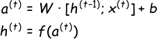</a>

    > 一般 `h(0)` 会初始化为 0 向量；并使用 `tanh` 作为激活函数 `f`  

## RNN 常见的几种设计模式（3）

**RNN 一般包括以下几种设计模式**
- **每个时间步都有输出，且隐藏单元之间有循环连接**
    - 即通常所说 RNN
    - 这种结构会在每个时间步产生一个输出，所以通常用于“**Seq2Seq**”任务中，比如序列标注、机器翻译等。这些任务通常都比较复杂。
    

- **每个时间步都有输出，但是隐藏单元之间没有循环连接，只有当前时刻的输出到下个时刻的隐藏单元之间有循环连接**
    - 这种模型的表示能力弱于第一种，但是它**更容易训练**
    - 因为每个时间步可以与其他时间步单独训练，从而实现**并行化**
    - 具体来说，就是使用 `y(t)` 代替 `o(t)` 输入下一个时间步。
    
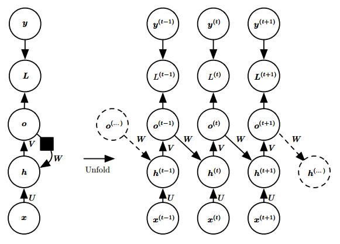

- **隐藏单元之间有循环连接，但只有最后一个时间步有输出**
    - 忽略模式 1 中的中间输出，即可得到这种网络；
    - 这种网络一般用于**概括序列**。具体来说，就是产生**固定大小的表示**，用于下一步处理；
    - 在一些“**Seq2One**”中简单任务中，这种网络用的比较多；因为这些任务只需要关注序列的全局特征。
    

> 其中前两种 RNN 分别被称为 Elman network 和 Jordan network；通常所说的 RNN 指的是前者
> 
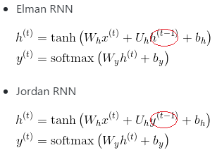

>
>> [Recurrent neural network](https://en.wikipedia.org/wiki/Recurrent_neural_network#Elman_networks_and_Jordan_networks) - Wikipedia 

## RNN 的反向传播（BPTT） TODO

## RNN 相关问题

### RNN 相比前馈网络/CNN 有什么特点？

- **前馈网络/CNN 处理序列数据时存在的问题：**
    - 一般的**前馈网络**，通常接受一个**定长**向量作为输入，然后输出一个定长的表示；它需要一次性接收所有的输入，因而忽略了序列中的顺序信息；
    - **CNN** 在处理**变长序列**时，通过**滑动窗口+池化**的方式将输入转化为一个**定长的向量表示**，这样做可以捕捉到序列中的一些**局部特征**，但是很难学习到序列间的**长距离依赖**。
  
- **RNN 处理时序数据时的优势：**
    - RNN 很适合处理序列数据，特别是带有**时序关系**的序列，比如文本数据；
    - RNN 把**每一个时间步**中的信息编码到**状态变量**中，使网络具有一定的记忆能力，从而更好的理解序列信息。
    - 由于 RNN 具有对序列中时序信息的刻画能力，因此在处理序列数据时往往能得到更准确的结果。

- **展开后的 RNN**（**无输出**）
    
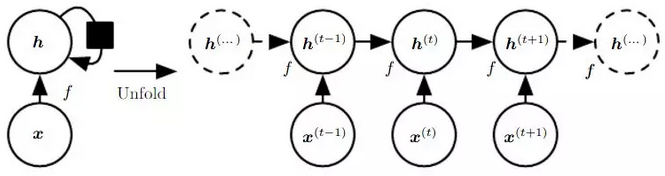

    - 一个长度为 `T` 的 RNN 展开后，可以看做是一个 **T 层的前馈网络**；同时每一层都可以有**新的输入**
    - 通过对当前输入 `x_t` 和上一层的隐状态 `h_{t-1}` 进行编码，**第 `t` 层的隐状态** `h_t` 记录了序列中前 `t` 个输入的信息。
        > 普通的前馈网络就像火车的**一节车厢**，只有一个入口，一个出口；而 RNN 相当于**一列火车**，有多节车厢接收**当前时间步**的输入信息并输出**编码后的状态信息**（包括**当前的状态和之前的所有状态**）。
    - **最后一层隐状态 `x_T`** 编码了整个序列的信息，因此可以看作**整个序列的压缩表示**。
    - 常见的文本分类任务中，将 `h_T` 通过一个 Softmax 层，即可获得作为每个类别的概率：

        
<a href="http://www.codecogs.com/eqnedit.php?latex=\fn_cs&space;\large&space;\begin{aligned}&space;a_t&=Ux_t&plus;Wh_{t-1}\\&space;h_t&=f(a_t)\\&space;y&=g(Vh_t)&space;\end{aligned}">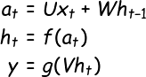</a>

    其中 
    - `U` 为输入层到隐藏层的权重矩阵
    - `W` 为隐藏层从上一时刻到下一时刻的状态转移权重矩阵
    - `f` 为隐藏层激活函数，通常可选 `tanh` 或 `ReLU`；
    - `g` 为输出层激活函数，可以采用 `Softmax`、`Sigmoid` 或线性函数（回归任务）
    - 通常 `h_{-1}` 初始化为 0 向量。

### RNN 为什么会出现梯度消失/梯度爆炸？
- 最大步长为 `T` 的 RNN 展开后相当于一个**共享参数**的 T 层前馈网络

    - RNN 的前向传播过程
        
<a href="http://www.codecogs.com/eqnedit.php?latex=\fn_cs&space;\large&space;\begin{aligned}&space;a_t&=Ux_t&plus;Wh_{t-1}\\&space;h_t&=f(a_t)&space;\end{aligned}">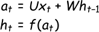</a>

    
    - 展开前一层
        
<a href="http://www.codecogs.com/eqnedit.php?latex=\fn_cs&space;\large&space;\begin{aligned}&space;a_t&=Ux_t&plus;Wh_{t-1}&space;\\&=Ux_t&plus;W\cdot&space;f(Ux_{t-1}&plus;Wh_{t-2})&space;\end{aligned}">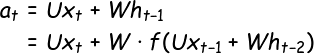</a>

    - RNN 的梯度计算公式
        

      其中
        
<a href="http://www.codecogs.com/eqnedit.php?latex=\dpi{120}&space;\fn_jvn&space;\begin{aligned}&space;\frac{\partial&space;a^{(t)}}{\partial&space;a^{(t-1)}}&=\frac{\partial&space;a^{(t)}}{\partial&space;h^{(t-1)}}\cdot\frac{\partial&space;h^{(t-1)}}{\partial&space;a^{(t-1)}}\\&space;&=W\cdot&space;\mathrm{diag}[f'(a^{(t-1)})]\\&space;&=\begin{pmatrix}&space;w_{11}\cdot&space;f'(a_1^{(t-1)})&space;&\cdots&space;&w_{1n}\cdot&space;f'(a_n^{(t-1)})&space;\\&space;\vdots&space;&&space;\ddots&space;&\vdots&space;\\&space;w_{n1}\cdot&space;f'(a_1^{(t-1)})&space;&\cdots&space;&w_{nn}\cdot&space;f'(a_n^{(t-1)})&space;\end{pmatrix}&space;\end{aligned}">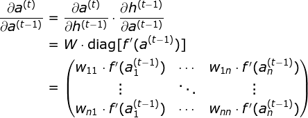</a>

      > 上标 `(t)` 表示时间步，下标 `n` 表示隐藏层的单元数（维度）；`diag()` 为对角矩阵

#### RNN 中能否使用 `ReLU` 作为激活函数？
> [RNN中为什么要采用tanh而不是ReLu作为激活函数？](https://www.zhihu.com/question/61265076) - 知乎

- 答案是肯定的。但是会存在一些问题。
    > 其实 ReLU 最早就是为了解决 RNN 中的**梯度消失**问题而设计的。
<!-- - 使用 ReLU 主要是为了解决**反向传播**时的**梯度消失**问题；
- 但是在 RNN 中使用 ReLU，反而可能在**前向传播**就时出现类似“梯度消失/爆炸”的**数值溢出问题**。 -->
- 假设使用 `ReLU` 并始终处于**激活状态**（`a_{t-1} > 0`），则 `f(x) = x`，即
    
<a href="http://www.codecogs.com/eqnedit.php?latex=\fn_cs&space;\large&space;\begin{aligned}&space;a_t&=Ux_t&plus;W\cdot&space;(Ux_{t-1}&plus;Wh_{t-2})\\&space;&=Ux_t&plus;W\cdot&space;Ux_{t-1}&plus;W^2h_{t-2}&space;\end{aligned}">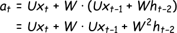</a>

    
    - 按照以上的步骤继续展开，最终结果中将包含 `t` 个 `W` 连乘，如果 `W` 不是单位矩阵，最终结果将趋于 `0` 或无穷。
    - 因此，在 RNN 中使用 ReLU 应该注意使用**单位矩阵**来初始化权重矩阵。

        > 为什么普通的前馈网络或 CNN 中不会出现这中现象？
        >> 因为他们每一层的 `W` 不同，且在初始化时是独立同分布的，因此可以在一定程度相互抵消。即使多层之后一般也不会出现数值问题。

- **使用 `ReLU` 也不能完全避免 RNN 中的梯度消失/爆炸问题**，问题依然在于存在 `t` 个 `W` 的连乘项。

  - 注意**最后一步**，假设所有神经元都处于**激活状态**，当 `ReLU` 作为 `f` 时，有
    
<a href="http://www.codecogs.com/eqnedit.php?latex=\fn_jvn&space;\large&space;\begin{aligned}&space;&&\frac{\partial&space;a^{(t)}}{\partial&space;a^{(t-1)}}&=W\\&space;&\Rightarrow&space;&\frac{\partial&space;a^{(t)}}{\partial&space;a^{(0)}}&=W^t&space;\end{aligned}">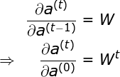</a>

    
  - 可见**只要 `W` 不是单位矩阵**，还是可能会出现梯度消失/爆炸。

#### 如果使用 `ReLU` 作为 RNN 的激活函数，应该注意什么？
- 综上所述，RNN 因为每一个时间步都**共享参数**的缘故，容易出现**数值溢出问题**
- 因此，推荐的做法是将 `W` 初始化为**单位矩阵**。
- 有实践证明，使用单位矩阵初始化 `W` 并使用 `ReLU` 作为激活函数在一些应用中，与 LSTM 有相似的结果
    > [RNN中为什么要采用tanh而不是ReLu作为激活函数？ - chaopig 的回答](https://www.zhihu.com/question/61265076/answer/260492479) - 知乎 

#### 梯度爆炸的解决方法
- 梯度截断

#### 梯度消失的解决方法（针对 RNN）
- 残差结构
- 门控机制（LSTM、GRU）

## LSTM 相关问题
> [Understanding LSTM Networks](http://colah.github.io/posts/2015-08-Understanding-LSTMs/) - colah's blog 

### LSTM 的内部结构

- LSTM 在传统 RNN 的基础上加入了**门控机制**来限制**信息的流动**。
- LSTM （上）与传统 RNN（下） 的内部结构对比
    

    

- 具体来说，LSTM 中加入了三个“门”：**遗忘门** `f`、**输入门** `i`、**输出门** `o`，以及一个内部记忆状态 `C`
    - “**遗忘门 `f`**”控制前一步记忆状态中的信息有多大程度被遗忘；
    

    - “**输入门 `i`**”控制当前计算的新状态以多大的程度更新到**记忆状态**中；
    

    - “**记忆状态 `C`**”间的**状态转移**由输入门和遗忘门共同决定
    

    - “**输出门 `o`**”控制当前的输出有多大程度取决于当前的记忆状态
    

#### 完整的 LSTM 前向传播公式

<a href="http://www.codecogs.com/eqnedit.php?latex=\fn_cm&space;\large&space;\begin{aligned}&space;f_t&=\sigma(W_f\cdot[h_{t-1};x_t]&plus;b_f)\\&space;i_t&=\sigma(W_i\cdot[h_{t-1};x_t]&plus;b_i)\\&space;\tilde{C}_t&=\tanh(W_C\cdot[h_{t-1};x_t]&plus;b_C)\\&space;C_t&=f_t\circ&space;C_{t-1}&plus;i_t\circ\tilde{C}_t\\&space;o_t&=\sigma(W_o\cdot[h_{t-1};x_t]&plus;b_o)\\&space;h_t&=o_t\circ\tanh(C_t)&space;\end{aligned}">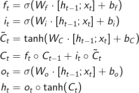</a>

> 其中运算符 `o`（`\circ`） 表示向量中的元素**按位相乘**；有的地方也使用符号 `⊙`（`\odot`）表示

### LSTM 是如何实现长短期记忆的？（遗忘门和输入门的作用）
- LSTM 主要通过**遗忘门**和**输入门**来实现长短期记忆。
    - 如果当前时间点的状态中没有重要信息，遗忘门 `f` 中各分量的值将接近 1（`f -> 1`）；输入门 `i` 中各分量的值将接近 0（`i -> 0`）；此时过去的记忆将会被保存，从而实现**长期记忆**；
    - 如果当前时间点的状态中出现了重要信息，且之前的记忆不再重要，则 `f -> 0`，`i -> 1`；此时过去的记忆被遗忘，新的重要信息被保存，从而实现**短期记忆**；
    - 如果当前时间点的状态中出现了重要信息，但旧的记忆也很重要，则 `f -> 1`，`i -> 1`。

### LSTM 里各部分使用了不同的激活函数，为什么？可以使用其他激活函数吗？
- 在 LSTM 中，所有**控制门**都使用 sigmoid 作为激活函数（遗忘门、输入门、输出门）；
- 在计算**候选记忆**或**隐藏状态**时，使用双曲正切函数 tanh 作为激活函数

**sigmoid 的“饱和”性**
- 所谓饱和性，即输入超过一定范围后，输出几乎不再发生明显变化了
- sigmoid 的值域为 `(0, 1)`，符合**门控**的定义：
    - 当输入较大或较小时，其输出会接近 1 或 0，从而保证门的开或关；
    - 如果使用非饱和的激活函数，将难以实现**门控/开关**的效果。
- sigmoid 是现代**门控单元**中的共同选择。

**为什么使用 tanh？**
- 使用 tanh 作为计算状态时的激活函数，主要是因为其**值域**为 `(-1, 1)`：
    - 一方面，这与多数场景下特征分布以 0 为中心相吻合；
    - 另一方面，可以避免在前向传播的时候发生**数值问题**（主要是上溢）
- 此外，tanh 比 sigmoid 在 0 附近有更大的梯度，通常会使模型收敛更快。
    > 早期，使用 `h(x) = 2*sigmoid(x) - 1` 作为激活函数，该激活函数的值域也是 `(-1, 1)`

**Hard gate**
- 在一些对计算能力有限制的设备中，可能会使用 hard gate
- 因为 sigmoid 求指数时需要一定的计算量，此时会使用 0/1 门（hard gate）让门控输出 0 或 1 的离散值。

### 窥孔机制
> Gers F A, Schmidhuber J. Recurrent nets that time and count[C]. 2000.
- LSTM 通常使用输入 `x_t` 和上一步的隐状态 `h_{t-1}` 参与门控计算；
    
<a href="http://www.codecogs.com/eqnedit.php?latex=\fn_cs&space;\large&space;g=\sigmoid(W\cdot[x_t;h_{t-1}]&plus;b)">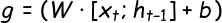</a>

- **窥孔机制**指让记忆状态也参与门控的计算中
    

### GRU 与 LSTM 的关系
- GRU 认为 LSTM 中的**遗忘门**和**输入门**的功能有一定的重合，于是将其合并为一个**更新门**。
    > 其实，早期的 LSTM 中本来就是没有**遗忘门**的 [1]，因为研究发现加入遗忘门能提升性能 [2]，从而演变为如今的 LSTM.
    >> [1] Hochreiter S, Schmidhuber J. Long short-term memory[J]. 1997. 
    >> [2] Gers F A, Schmidhuber J, Cummins F. Learning to forget: Continual prediction with LSTM[J]. 1999.
    
- GRU 相比 LSTM 的**改动**：
    - GRU 把遗忘门和输入门合并为**更新门（update）** `z`，并使用**重置门（reset）** `r` 代替输出门；
    - **合并**了记忆状态 `C` 和隐藏状态 `h`
    
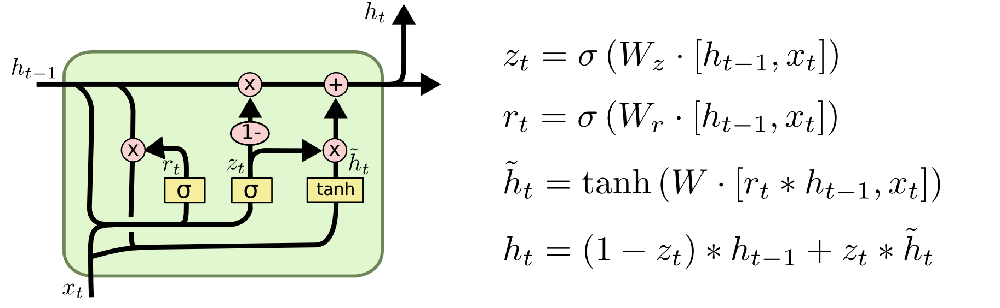

    其中
    - **更新门** `z`用于控制前一时刻的状态信息被**融合**到当前状态中的程度
    - **重置门** `r`用于控制忽略前一时刻的状态信息的程度

#### 完整的 GRU 前向传播公式

<a href="http://www.codecogs.com/eqnedit.php?latex=\fn_cm&space;\large&space;\begin{aligned}&space;z_t&=\sigma(W_z\cdot[h_{t-1};x_t])\\&space;r_t&=\sigma(W_r\cdot[h_{t-1};x_t])\\&space;\tilde{h}_t&=\tanh(W_h\cdot[r_t\odot&space;h_{t-1};x_t])\\&space;h_t&=(1-z_t)\odot&space;h_{t-1}&plus;z_t\odot\tilde{h}_t&space;\end{aligned}">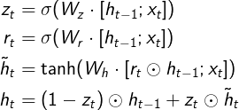</a>

> 遵从原文表示，没有加入偏置
