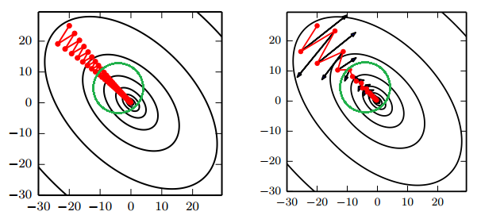
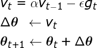
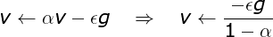
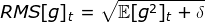

专题-优化算法
===

Reference
---
- 【**必读**】[An overview of gradient descent optimization algorithms](http://ruder.io/optimizing-gradient-descent/) - Sebastian Ruder

Index
---
<!-- TOC -->

- [梯度下降](#梯度下降)
- [随机梯度下降](#随机梯度下降)
    - [小批量随机梯度下降](#小批量随机梯度下降)
    - [小批量 SGD 的更新过程](#小批量-sgd-的更新过程)
    - [“批”的大小对优化效果的影响](#批的大小对优化效果的影响)
    - [随机梯度下降存在的问题](#随机梯度下降存在的问题)
- [随机梯度下降的改进方向](#随机梯度下降的改进方向)
- [动量（Momentum）算法](#动量momentum算法)
    - [带动量的 SGD](#带动量的-sgd)
    - [NAG 算法（Nesterov 动量）](#nag-算法nesterov-动量)
- [自适应学习率的优化算法](#自适应学习率的优化算法)
    - [AdaGrad](#adagrad)
    - [RMSProp](#rmsprop)
    - [AdaDelta](#adadelta)
    - [Adam](#adam)
    - [AdaMax](#adamax)
    - [Nadam](#nadam)
- [如何选择这些优化算法？](#如何选择这些优化算法)
    - [各优化算法的可视化](#各优化算法的可视化)
- [基于二阶梯度的优化算法](#基于二阶梯度的优化算法)
    - [牛顿法](#牛顿法)
        - [为什么牛顿法比梯度下降收敛更快？](#为什么牛顿法比梯度下降收敛更快)
        - [牛顿法的优缺点](#牛顿法的优缺点)
    - [拟牛顿法 TODO](#拟牛顿法-todo)

<!-- /TOC -->

## 梯度下降
> ../数学/[梯度下降法](../C-数学/B-深度学习的核心#梯度下降法)

- 梯度下降是一种**优化算法**，通过**迭代**的方式寻找模型的**最优参数**；
    - 所谓最优参数指的是使**目标函数**达到最小值时的参数；
    - 当目标函数是**凸函数**时，梯度下降的解是全局最优解；但在一般情况下，**梯度下降无法保证全局最优**。
- 微积分中使用**梯度**表示函数增长最快的方向；因此，神经网络中使用**负梯度**来指示目标函数下降最快的方向。
    - **梯度**实际上是损失函数对网络中每个参数的**偏导**所组成的向量；
    - **梯度**仅仅指示了对于每个参数各自增长最快的方向；因此，梯度无法保证**全局方向**就是函数为了达到最小值应该前进的方向。
    - **梯度**的具体计算方法即**反向传播**。
- **负梯度**中的每一项可以认为传达了**两个信息**：
    - 正负号在告诉输入向量应该调大还是调小（正调大，负调小）
    - 每一项的相对大小表明每个参数对函数值达到最值的**影响程度**；
        

## 随机梯度下降
- 基本的梯度下降法每次使用**所有训练样本**的**平均损失**来更新参数；
    - 因此，经典的梯度下降在每次对模型参数进行更新时，需要遍历所有数据；
    - 当训练样本的数量很大时，这需要消耗相当大的计算资源，在实际应用中基本不可行。
- **随机梯度下降**（SGD）每次使用单个样本的损失来近似平均损失

### 小批量随机梯度下降
- 为了降低随机梯度的**方差**，使模型迭代更加稳定，实践中会使用**一批**随机数据的损失来近似平均损失。
    > ../机器学习基础/[偏差与方差](../A-机器学习/A-机器学习基础#偏差与方差)
- 使用批训练的另一个主要目的，是为了利用高度优化的**矩阵运算**以及**并行计算框架**。

### 小批量 SGD 的更新过程
1. 在训练集上抽取指定大小（batch_size）的一批数据 `{(x,y)}`
1. 【**前向传播**】将这批数据送入网络，得到这批数据的预测值 `y_pred` 
1. 计算网络在这批数据上的损失，用于衡量 `y_pred` 和 `y` 之间的距离
1. 【**反向传播**】计算损失相对于所有网络中**可训练参数**的梯度 `g`
1. 将参数沿着**负梯度**的方向移动，即 `W -= lr * g`
    > `lr` 表示学习率 learning rate
    

### “批”的大小对优化效果的影响
> 《深度学习》 8.1.3 批量算法和小批量算法
- **较大的批能得到更精确的梯度估计**，但回报是小于线性的。
- **较小的批能带来更好的泛化误差**，泛化误差通常在批大小为 1 时最好。
    - 原因可能是由于小批量在学习过程中带来了**噪声**，使产生了一些正则化效果 (Wilson and Martinez, 2003)
    - 但是，因为梯度估计的高方差，小批量训练需要**较小的学习率**以保持稳定性，这意味着**更长的训练时间**。
- 当批的大小为 **2 的幂**时能充分利用矩阵运算操作，所以批的大小一般取 32、64、128、256 等。
<!-- - **内存消耗和批的大小成正比**，当批量处理中的所有样本可以并行处理时。
- 在某些硬件上使用特定大小可以减少运行时间。尤其是在使用 GPU 时，通常使用 **2 的幂数**作为批量大小可以获得更少的运行时间。一般，2 的幂数的**取值范围是 32 到 256**，16 有时在尝试大模型时使用。 -->

### 随机梯度下降存在的问题
- 随机梯度下降（SGD）放弃了**梯度的准确性**，仅采用一部分样本来估计当前的梯度；因此 SGD 对梯度的估计常常出现偏差，造成目标函数收敛不稳定，甚至不收敛的情况。
- 无论是经典的梯度下降还是随机梯度下降，都可能陷入**局部极值点**；除此之外，SGD 还可能遇到“**峡谷**”和“**鞍点**”两种情况
    - **峡谷**类似一个带有**坡度**的狭长小道，左右两侧是“**峭壁**”；在**峡谷**中，准确的梯度方向应该沿着坡的方向向下，但粗糙的梯度估计使其稍有偏离就撞向两侧的峭壁，然后在两个峭壁间来回**震荡**。
    - **鞍点**的形状类似一个马鞍，一个方向两头翘，一个方向两头垂，而**中间区域近似平地**；一旦优化的过程中不慎落入鞍点，优化很可能就会停滞下来。
    

## 随机梯度下降的改进方向
- SGD 的改进遵循两个方向：**惯性保持**和**环境感知**
    > 这两个提法来自《百面机器学习》
- **惯性保持**指的是加入**动量** SGD 算法；
    > [动量（Momentum）方法](#动量momentum方法)
- **环境感知**指的是根据不同参数的一些**经验性判断**，**自适应**地确定**每个参数的学习速率**
    > [自适应学习率的优化算法](#自适应学习率的优化算法)

**训练词向量的例子**
- 不同词出现的频率是不同的，**数据的稀疏性会影响其参数的稀疏性**；
- 具体来说，**对低频词如果不加措施**，其参数的梯度在多数情况下为 0；换言之，这些参数更新的频率很低，导致难以收敛。
- 在实践中，我们希望学习**低频词**的参数时具有**较大的学习率**，而高频词其参数的更新幅度可以小一些。

## 动量（Momentum）算法

### 带动量的 SGD
- 引入**动量**（Momentum）方法一方面是为了解决“峡谷”和“鞍点”问题；一方面也可以用于SGD 加速，特别是针对**高曲率**、小幅但是方向一致的梯度。
    - 如果把原始的 SGD 想象成一个**纸团**在重力作用向下滚动，由于**质量小**受到山壁弹力的干扰大，导致来回震荡；或者在鞍点处因为**质量小**速度很快减为 0，导致无法离开这块平地。
    - **动量**方法相当于把纸团换成了**铁球**；不容易受到外力的干扰，轨迹更加稳定；同时因为在鞍点处因为**惯性**的作用，更有可能离开平地。
    - 动量方法以一种廉价的方式模拟了二阶梯度（牛顿法）
    

- **参数更新公式**

    

    - 从形式上看， 动量算法引入了变量 `v` 充当速度角色，以及相相关的超参数 `α`。
    - 原始 SGD 每次更新的步长只是梯度乘以学习率；现在，步长还取决于**历史梯度序列**的大小和排列；当许多连续的梯度指向**相同的方向**时，步长会被不断增大；

- **动量算法描述**
    

    - 如果动量算法总是观测到梯度 `g`，那么它会在 `−g` 方向上不断加速，直到达到**最终速度**。

    

    - 在实践中， `α` 的一般取 `0.5, 0.9, 0.99`，分别对应**最大** `2` 倍、`10` 倍、`100` 倍的步长
    - 和学习率一样，`α` 也可以使用某种策略在训练时进行**自适应调整**；一般初始值是一个较小的值，随后会慢慢变大。
        > [自适应学习率的优化方法](#自适应学习率的优化方法)

### NAG 算法（Nesterov 动量）
- **NAG 把梯度计算放在对参数施加当前速度之后**。
- 这个“**提前量**”的设计让算法有了对前方环境“**预判**”的能力。Nesterov 动量可以解释为往标准动量方法中添加了一个**修正因子**。
- **NAG 算法描述**
    

## 自适应学习率的优化算法
> 《深度学习》 8.5 自适应学习率算法

### AdaGrad
> [Duchi et al., 2011](http://jmlr.org/papers/v12/duchi11a.html)
- 该算法的思想是独立地适应模型的每个参数：具有较大偏导的参数相应有一个较大的学习率，而具有小偏导的参数则对应一个较小的学习率
- 具体来说，每个参数的学习率会缩放各参数反比于其**历史梯度平方值总和的平方根**
- **AdaGrad 算法描述**
    

    - 注意：全局学习率 `ϵ` 并没有更新，而是每次应用时被缩放

**AdaGrad 存在的问题**
- 学习率是单调递减的，训练后期学习率过小会导致训练困难，甚至提前结束
- 需要设置一个全局的初始学习率

### RMSProp
> Hinton, 2012
- RMSProp 主要是为了解决 AdaGrad 方法中**学习率过度衰减**的问题—— AdaGrad 根据平方梯度的**整个历史**来收缩学习率，可能使得学习率在达到局部最小值之前就变得太小而难以继续训练；
- RMSProp 使用**指数衰减平均**（递归定义）以丢弃遥远的历史，使其能够在找到某个“凸”结构后快速收敛；此外，RMSProp 还加入了一个超参数 `ρ` 用于控制衰减速率。
    > ./术语表/[指数衰减平均](./备忘-术语表#指数加权平均指数衰减平均)
- 具体来说（对比 AdaGrad 的算法描述），即修改 `r` 为
    

    记
    

    则
    

    > 其中 `E` 表示期望，即平均；`δ` 为平滑项，具体为一个小常数，一般取 `1e-8 ~ 1e-10`（Tensorflow 中的默认值为 `1e-10`）
- **RMSProp** 建议的**初始值**：全局学习率 `ϵ=1e-3`，衰减速率 `ρ=0.9`
- **RMSProp 算法描述**
    

- 带 **Nesterov 动量**的 **RMSProp**
    

- 经验上，RMSProp 已被证明是一种有效且实用的深度神经网络优化算法。
- RMSProp 依然需要设置一个全局学习率，同时又多了一个超参数（推荐了默认值）。

### AdaDelta
- AdaDelta 和 RMSProp 都是为了解决 AdaGrad 对学习率过度衰减的问题而产生的。
- AdaDelta 和 RMSProp 是独立发现的，AdaDelta 的前半部分与 RMSProp 完全一致；
- AdaDelta 进一步解决了 AdaGrad 需要设置一个全局学习率的问题
- 具体来说，即
    

    
    此时，AdaDelta 已经不需要设置全局学习率了
    > 关于 `RMS` 的定义，见 [RMSProp](#rmsprop)

### Adam
> Kingma and Ba, 2014
- Adam 在 RMSProp 方法的基础上更进一步：
    - 除了加入**历史梯度平方的指数衰减平均**（`r`）外，
    - 还保留了**历史梯度的指数衰减平均**（`s`），相当于**动量**。
    - Adam 行为就像一个带有摩擦力的小球，在误差面上倾向于平坦的极小值。
    > ./术语表/[指数衰减平均](./备忘-术语表#指数加权平均指数衰减平均)
- **Adam 算法描述**
    

**偏差修正**
- 注意到，`s` 和 `r` 需要初始化为 `0`；且 `ρ1` 和 `ρ2` 推荐的初始值都很接近 `1`（`0.9` 和 `0.999`）
- 这将导致在训练初期 `s` 和 `r` 都很小（偏向于 0），从而训练缓慢。
- 因此，Adam 通过修正偏差来抵消这个倾向。

### AdaMax
- Adam 的一个变种，对梯度平方的处理由**指数衰减平均**改为**指数衰减求最大值**

### Nadam
- Nesterov 动量版本的 Adam

## 如何选择这些优化算法？
- 各自适应学习率的优化算法表现不分伯仲，没有哪个算法能在所有任务上脱颖而出；
- 目前，最流行并且使用很高的优化算法包括 SGD、带动量的 SGD、RMSProp、带动量的 RMSProp、AdaDelta 和 Adam。
- 具体使用哪个算法取决于使用者对算法的熟悉程度，以便调节超参数。

### 各优化算法的可视化
- SGD 各优化方法在损失曲面上的表现
    

- SGD 各优化方法在**鞍点**处上的表现
    

## 基于二阶梯度的优化算法

### 牛顿法
- 梯度下降使用的梯度信息实际上是**一阶导数**
- 牛顿法除了一阶导数外，还会使用**二阶导数**的信息
- 根据导数的定义，一阶导描述的是函数值的变化率，即**斜率**；二阶导描述的则是斜率的变化率，即曲线的弯曲程度——**曲率**
    > 数学/[泰勒级数](../C-数学/B-微积分的本质#泰勒级数)

**牛顿法更新过程** TODO
> 《统计学习方法》 附录 B

#### 为什么牛顿法比梯度下降收敛更快？
> [常见的几种最优化方法（梯度下降法、牛顿法、拟牛顿法、共轭梯度法等）](https://www.cnblogs.com/shixiangwan/p/7532830.html) - 蓝鲸王子 - 博客园 

**几何理解**
- 牛顿法就是用一个**二次曲面**去拟合你当前所处位置的局部曲面；而梯度下降法是用一个平面去拟合当前的局部曲面。
- 通常情况下，二次曲面的拟合会比平面更好，所以牛顿法选择的**下降路径**会更符合真实的最优下降路径。

**通俗理解**
- 比如你想找一条最短的路径走到一个盆地的最底部，
- 梯度下降法每次只从你当前所处位置选一个坡度最大的方向走一步；
- 牛顿法在选择方向时，不仅会考虑坡度是否够大，还会考虑你走了一步之后，坡度是否会变得更大。
- 所以，牛顿法比梯度下降法看得更远，能**更快**地走到最底部。

#### 牛顿法的优缺点
- **优点**
    - 收敛速度快，能用更少的迭代次数找到最优解
- **缺点**
    - 每一步都需要求解目标函数的 **Hessian 矩阵**的逆矩阵，计算复杂
        > Hessian 矩阵即由二阶偏导数构成的方阵

### 拟牛顿法 TODO
- 用其他近似方法代替求解 **Hessian 矩阵**的逆矩阵
