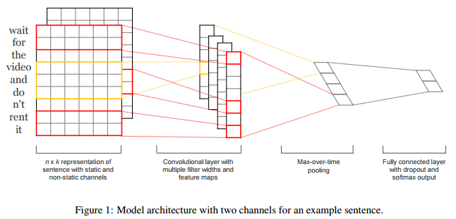
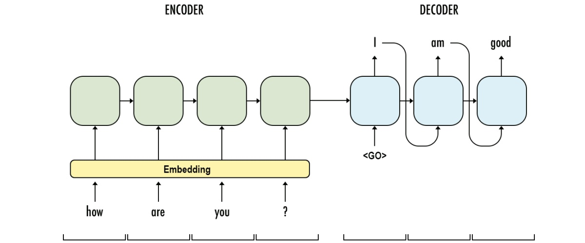
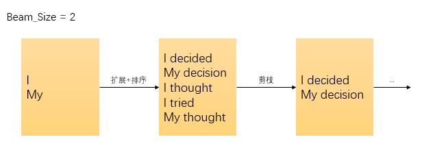

专题-序列建模
===

**相关专题**
- [专题-RNN](./B-专题-RNN.md)
- [专题-RNN](./B-专题-RNN.md)

Index
---
<!-- TOC -->

- [序列建模简述](#序列建模简述)
- [Seq2Seq](#seq2seq)
    - [解码方法（贪心、Beam Search、维特比算法）](#解码方法贪心beam-search维特比算法)
        - [Beam Search（集束搜索）](#beam-search集束搜索)
        - [维特比（Viterbi）算法 TODO](#维特比viterbi算法-todo)
        - [其他最短路径算法](#其他最短路径算法)
    - [构建 Seq2Seq 一般做法](#构建-seq2seq-一般做法)
- [序列的表示学习](#序列的表示学习)
    - [学习任务无关的 Sentence Embedding](#学习任务无关的-sentence-embedding)
- [CNN 与序列建模](#cnn-与序列建模)
    - [一维卷积](#一维卷积)
- [时间卷积网络（TCN）](#时间卷积网络tcn)
    - [WaveNet](#wavenet)
    - [因果卷积](#因果卷积)
    - [空洞卷积](#空洞卷积)
    - [Highway 网络](#highway-网络)
    - [残差模块](#残差模块)
- [Reference](#reference)

<!-- /TOC -->

## 序列建模简述
> [从循环到卷积，探索序列建模的奥秘](https://mp.weixin.qq.com/s/f0sv7c-H5o5L_wy2sUonUQ) - 机器之心
- 序列建模就是将一个**输入/观测**序列映射到一个**输出/标记**序列
    > 《统计学习方法》中称之为标注问题
- 在**传统机器学习**方法中，常用的模型有：隐马尔可夫模型（HMM），条件随机场（CRF）等
    > 机器学习专题 TODO
- 在**深度学习领域**的很长一段时间里，RNN/LSTM 都是序列建模的首选。
    > 《深度学习》 10 序列建模：循环和递归网络
- 最近，CNN 开始在序列建模领域流行，一个**关键想法**是——在一维时间序列上使用**一维卷积运算**
    

    > [CNN for Sentence Classification](https://arxiv.org/abs/1408.5882) (Kim, 2014)

## Seq2Seq
- Seq2Seq 的核心思想是把一个输出序列，通过**编码**（Encode）和**解码**（Decode）两个过程映射到一个新的输出序列。
    

    
    > [Translation with a Sequence to Sequence Network and Attention](https://pytorch.org/tutorials/intermediate/seq2seq_translation_tutorial.html) — PyTorch
- 经典的 Seq2Seq 模型中，**编码器**（Encoder）和**解码器**（Decoder）都使用 **RNN** 进行建模
    <!-- 

 -->
    

    
    > 上图是一次**机器翻译**的过程，输入是一个源语言的一个句子 "A B C"，Encoder 一次读入每个单词直到结束符 `<EOS>`（End of Sequence）； 
    > 在解码的第一步，Decoder 先读取 **Encoder 的最终状态**，生成目标语言的第一个词 'W'，接着 Decoder 读取第一步的输出 'W' 作为第二步的输入，进而生成第二个词 'X'，如此直到生成 `<EOS>` 或达到指定**最大长度**。
    >> Decoder 生成每个词还要结合当前时间步的隐状态（如果是 LSTM 还有 记忆状态），更深入的细节暂时略过。
- Seq2Seq 之所以流行，是因为它为不同的问题提供了一套**端到端**（End to End）的解决方案，免去了繁琐的中间步骤，从输入直接得到结果.
- 根据任务的输入输出差异，编码器和解码器的设计也不尽相同，但是“Encoder-Decoder”的结构都是一致的。
    - **机器翻译**：输入源语言的一个句子，输出目标语言的句子；
    - **机器问答**：输入问题/查询，输出答案；
    - **文本摘要**：输入一个长句或段落，输出一个摘要短句；
    - **语音识别**：输入是音频序列信号，输出为识别出的文本；
    - **图像描述**：输入是图像经过视觉网络的特征，输出是图像的描述文本。
    - ...

### 解码方法（贪心、Beam Search、维特比算法）

- Seq2Seq 中的解码方法主要有三种：**贪心**、**Beam Search**、**维特比算法**（动态规划）
- 这三种方法的思想本质上是一致的，假设选取相同的评价标准（比如概率最大、路径最短等）
    - **贪心**每到达一个节点，只选择当前状态的**最优结果**，其他都忽略，直到最后一个节点；贪心法只能得到某个局部最优解；
    - **Beam Search** 会在每个节点保存当前**最优的 k 个结果**（排序后），其他结果将被“剪枝”，因为每次都有 k 个分支进入下一个状态。Beam Search 也不能保证全局最优，但能以较大的概率得到全局最优解。
    - **维特比算法**利用**动态规划**的方法可以保证得到全局最优解，但是当候选状态极大时，需要消耗大量的时间和空间搜索和保存状态，因此维特比算法只适合状态集比较小的情况。

#### Beam Search（集束搜索）
- Beam Search 是一种启发式算法
- 该方法会保存前 `beam_size` 个最佳状态，每次解码时会根据所有保存的状态进行下一步**扩展**和**排序**，依然只保留前 `beam_size` 个最佳状态；循环迭代至最后一步，保存最佳选择。
- Beam Search 图示
    

- 当 `beam_size = 1` 时，Beam Search 即退化为贪心搜索
- 一般为了计算资源和性能的平衡，`beam_size` 会选择一个适中的范围；通常 `beam_size` 取 `8~12` 即可（机器翻译、文本摘要）

#### 维特比（Viterbi）算法 TODO
> [维特比算法通俗理解](http://www.hankcs.com/program/algorithm/%E7%BB%B4%E7%89%B9%E6%AF%94%E7%AE%97%E6%B3%95%E9%80%9A%E4%BF%97%E7%90%86%E8%A7%A3.html)-码农场 
- 利用**动态规划**可以求解任何图中的最短路径问题；
- **维特比算法**是针对一种特殊的图结构——“**篱笆网络**”——而提出的算法，用于在概率图模型中求解**概率最大路径**；

#### 其他最短路径算法
- Dijkstra 算法（迪杰斯特拉算法）
    - 基于贪心
    - 用于求解某个顶点到其他所有顶点之间的最短路径
    - 时间复杂度 `O(N^2)`
    - Dijkstra 算法的使用范围比 Viterbi 算法更广，可用于求解大部分图结构中的最短路径。
- Floyd 算法（弗洛伊德算法）
    - 求解的是每一对顶点之间的最短路径
    - 时间复杂度 `O(N^3)`

### 构建 Seq2Seq 一般做法
- 堆叠 RNN/CNN
    > [CNN 与序列建模](#cnn-与序列建模)
- Dropout 机制
- **残差**连接
- **Attention 机制**
  <!-- > [Attention 专题](./DL-C-专题-Attention.md) -->

## 序列的表示学习
- 序列的表示学习指学习单个序列的特征表示，通常作为另一个任务的子过程，或者用于迁移学习等。
- 整个学习的过程相当于 Seq2Seq 中的 Encoder 部分

### 学习任务无关的 Sentence Embedding
> [1703.03130] [A Structured Self-attentive Sentence Embedding](https://arxiv.org/abs/1703.03130)

**模型基本结构**，更多细节参考原文
- 待学习的句子
  

## CNN 与序列建模
- 一般认为 CNN 擅长处理**网格结构的数据**，比如图像（二维像素网络）
    - 卷积层试图将神经网络中的每一小块进行更加深入的分析，从而得出抽象程度更高的特征。
    - 一般来说通过卷积层处理的神经元结点矩阵会变得更深，即神经元的组织在第三个维度上会增加。
- **时序数据**同样可以认为是在时间轴上有规律地采样而形成的一维网格
    

    > [CNN for Sentence Classification](https://arxiv.org/abs/1408.5882) (Kim, 2014)

### 一维卷积
- 适用于序列建模的卷积网络一般就是采用的是一维卷积
    

    - 最下层的 `x_i` 可视为句子的输入序列
    - 最上层的 `g_j` 即输出序列
    - 流行的网络中一般使用 **embedding** 作为输入，也就说每个 `x_i` 其实是一个多维向量 `v(x_i)`
        > ../自然语言处理/[词向量](../B-自然语言处理/B-专题-词向量.md)

## 时间卷积网络（TCN）

### WaveNet

### 因果卷积

**Reference**
- [WaveNet: A Generative Model for Raw Audio](https://deepmind.com/blog/wavenet-generative-model-raw-audio/) | DeepMind
- ibab/[tensorflow-wavenet](https://github.com/ibab/tensorflow-wavenet) - GitHub

### 空洞卷积

### Highway 网络
- 一种门限机制

### 残差模块
> [Deep Residual Learning for Image Recognition](https://arxiv.org/abs/1512.03385) (He, et al., 2015)

## Reference
- 自然语言处理之序列模型 - 小象学院
- [从循环到卷积，探索序列建模的奥秘](https://mp.weixin.qq.com/s/f0sv7c-H5o5L_wy2sUonUQ) - 机器之心