**问题列表**
---
<!-- TOC -->

- [如何设置网络的初始值？*](#如何设置网络的初始值)
- [梯度爆炸的解决办法***](#梯度爆炸的解决办法)
- [神经网络（MLP）的万能近似定理*](#神经网络mlp的万能近似定理)
- [神经网络中，深度与宽度的关系，及其表示能力的差异**](#神经网络中深度与宽度的关系及其表示能力的差异)
- [在深度神经网络中，引入了隐藏层（非线性单元），放弃了训练问题的凸性，其意义何在？**](#在深度神经网络中引入了隐藏层非线性单元放弃了训练问题的凸性其意义何在)
- [稀疏表示，低维表示，独立表示*](#稀疏表示低维表示独立表示)
- [局部不变性（平滑先验）及其在基于梯度的学习上的局限性*](#局部不变性平滑先验及其在基于梯度的学习上的局限性)
- [为什么交叉熵损失相比均方误差损失能提高以 sigmoid 和 softmax 作为激活函数的层的性能？**](#为什么交叉熵损失相比均方误差损失能提高以-sigmoid-和-softmax-作为激活函数的层的性能)
- [分段线性单元（如 ReLU）代替 sigmoid 的利弊***](#分段线性单元如-relu代替-sigmoid-的利弊)
- [在做正则化过程中，为什么只对权重做正则惩罚，而不对偏置做权重惩罚*](#在做正则化过程中为什么只对权重做正则惩罚而不对偏置做权重惩罚)
- [列举常见的一些范数及其应用场景，如 L0、L1、L2、L∞、Frobenius等范数**](#列举常见的一些范数及其应用场景如-l0l1l2l∞frobenius等范数)
- [L1 和 L2 范数的异同***](#l1-和-l2-范数的异同)
- [为什么 L1 正则化可以产生稀疏权值，L2 正则化可以防止过拟合？**](#为什么-l1-正则化可以产生稀疏权值l2-正则化可以防止过拟合)
  - [为什么 L1 正则化可以产生稀疏权值，而 L2 不会？](#为什么-l1-正则化可以产生稀疏权值而-l2-不会)
  - [为什么 L1 和 L2 正则化可以防止过拟合？](#为什么-l1-和-l2-正则化可以防止过拟合)
- [简单介绍常用的激活函数，如 sigmoid、relu、softplus、tanh、RBF 及其应用场景***](#简单介绍常用的激活函数如-sigmoidrelusoftplustanhrbf-及其应用场景)
  - [整流线性单元（ReLU）](#整流线性单元relu)
  - [sigmoid 与 tanh（双曲正切函数）](#sigmoid-与-tanh双曲正切函数)
  - [其他激活函数（隐藏单元）](#其他激活函数隐藏单元)
  - [sigmoid 和 softplus 的一些性质](#sigmoid-和-softplus-的一些性质)
- [Jacobian 和 Hessian 矩阵及其在深度学习中的重要性*](#jacobian-和-hessian-矩阵及其在深度学习中的重要性)
- [信息熵、KL 散度（相对熵）与交叉熵**](#信息熵kl-散度相对熵与交叉熵)
  - [自信息与信息熵](#自信息与信息熵)
  - [相对熵（KL 散度）与交叉熵](#相对熵kl-散度与交叉熵)
- [如何避免数值计算中的上溢和下溢问题，以 softmax 为例*](#如何避免数值计算中的上溢和下溢问题以-softmax-为例)
- [训练误差、泛化误差；过拟合、欠拟合；模型容量，表示容量，有效容量，最优容量的概念； 奥卡姆剃刀原则*](#训练误差泛化误差过拟合欠拟合模型容量表示容量有效容量最优容量的概念-奥卡姆剃刀原则)
  - [过拟合的一些解决方案***](#过拟合的一些解决方案)
- [高斯分布的广泛应用的原因**](#高斯分布的广泛应用的原因)
  - [高斯分布（Gaussian distribution）](#高斯分布gaussian-distribution)
  - [为什么推荐使用高斯分布？](#为什么推荐使用高斯分布)
- [表示学习、自编码器与深度学习**](#表示学习自编码器与深度学习)
- [L1、L2 正则化与 MAP 贝叶斯推断的关系*](#l1l2-正则化与-map-贝叶斯推断的关系)
- [什么是欠约束，为什么大多数的正则化可以使欠约束下的欠定问题在迭代过程中收敛*](#什么是欠约束为什么大多数的正则化可以使欠约束下的欠定问题在迭代过程中收敛)
- [为什么考虑在模型训练时对输入 (隐藏单元或权重) 添加方差较小的噪声？*](#为什么考虑在模型训练时对输入-隐藏单元或权重-添加方差较小的噪声)
- [多任务学习、参数绑定和参数共享***](#多任务学习参数绑定和参数共享)
  - [多任务学习](#多任务学习)
  - [参数绑定和参数共享](#参数绑定和参数共享)
- [Dropout 与 Bagging 集成方法的关系，Dropout 带来的意义与其强大的原因***](#dropout-与-bagging-集成方法的关系dropout-带来的意义与其强大的原因)
  - [Bagging 集成方法](#bagging-集成方法)
  - [Dropout](#dropout)
- [批梯度下降法（Batch SGD）更新过程中，批的大小会带来怎样的影响**](#批梯度下降法batch-sgd更新过程中批的大小会带来怎样的影响)
- [如何避免深度学习中的病态，鞍点，梯度爆炸，梯度弥散？***](#如何避免深度学习中的病态鞍点梯度爆炸梯度弥散)
  - [病态（ill-conditioning）](#病态ill-conditioning)
  - [鞍点（saddle point）](#鞍点saddle-point)
  - [长期依赖与梯度爆炸、消失](#长期依赖与梯度爆炸消失)
- [SGD 以及学习率的选择方法、带动量的 SGD***](#sgd-以及学习率的选择方法带动量的-sgd)
  - [（批）随机梯度下降（SGD）与学习率](#批随机梯度下降sgd与学习率)
  - [带动量的 SGD](#带动量的-sgd)
- [自适应学习率算法：AdaGrad、RMSProp、Adam 等***](#自适应学习率算法adagradrmspropadam-等)
  - [AdaGrad](#adagrad)
  - [RMSProp](#rmsprop)
  - [Adam](#adam)
- [基于二阶梯度的优化方法：牛顿法、共轭梯度、BFGS 等的做法*](#基于二阶梯度的优化方法牛顿法共轭梯度bfgs-等的做法)
- [批标准化（Batch Normalization）的意义**](#批标准化batch-normalization的意义)
- [神经网络中的卷积，以及卷积的动机：稀疏连接、参数共享、等变表示（平移不变性）***](#神经网络中的卷积以及卷积的动机稀疏连接参数共享等变表示平移不变性)
  - [稀疏连接（sparse connectivity）](#稀疏连接sparse-connectivity)
  - [参数共享（parameter sharing）](#参数共享parameter-sharing)
  - [平移等变|不变性（translation invariant）](#平移等变不变性translation-invariant)
- [卷积中不同零填充的影响**](#卷积中不同零填充的影响)
- [基本卷积的变体：反卷积、空洞卷积***](#基本卷积的变体反卷积空洞卷积)
  - [转置卷积|反卷积（Transposed convolution）](#转置卷积反卷积transposed-convolution)
  - [空洞卷积|扩张卷积（Dilated convolution）](#空洞卷积扩张卷积dilated-convolution)
- [池化、池化（Pooling）的作用***](#池化池化pooling的作用)
- [卷积与池化的意义、影响（作为一种无限强的先验）**](#卷积与池化的意义影响作为一种无限强的先验)
- [RNN 的几种基本设计模式](#rnn-的几种基本设计模式)
- [RNN 更新方程（前向传播公式），包括 LSTM、GRU 等***](#rnn-更新方程前向传播公式包括-lstmgru-等)
- [BPTT（back-propagation through time，通过时间反向传播）**](#bpttback-propagation-through-time通过时间反向传播)
- [自编码器在深度学习中的意义*](#自编码器在深度学习中的意义)
- [自编码器一些常见的变形与应用：正则自编码器、稀疏自编码器、去噪自编码器*](#自编码器一些常见的变形与应用正则自编码器稀疏自编码器去噪自编码器)
- [半监督的思想以及在深度学习中的应用*](#半监督的思想以及在深度学习中的应用)
- [分布式表示的概念、应用，与符号表示（one-hot 表示）的区别***](#分布式表示的概念应用与符号表示one-hot-表示的区别)
  - [什么是分布式表示？](#什么是分布式表示)
  - [分布式表示为什么强大？——分布式表示与符号表示](#分布式表示为什么强大分布式表示与符号表示)
- [如何理解维数灾难？***](#如何理解维数灾难)
- [迁移学习相关概念：多任务学习、一次学习、零次学习、多模态学习**](#迁移学习相关概念多任务学习一次学习零次学习多模态学习)
- [图模型|结构化概率模型相关概念*](#图模型结构化概率模型相关概念)
- [深度生成模型、受限玻尔兹曼机（RBM）相关概念*](#深度生成模型受限玻尔兹曼机rbm相关概念)
- [深度学习在图像、语音、NLP等领域的常见作法与基本模型**](#深度学习在图像语音nlp等领域的常见作法与基本模型)
  - [计算机视觉（CV）](#计算机视觉cv)
  - [语音识别](#语音识别)
  - [自然语言处理](#自然语言处理)

<!-- /TOC -->

# 如何设置网络的初始值？*
> 《深度学习》 8.4 参数初始化策略

一般总是使用服从（截断）高斯或均匀分布的随机值，具体是高斯还是均匀分布影响不大，但是也没有详细的研究。

但是，**初始值的大小**会对优化结果和网络的泛化能力产生较大的影响。

<!-- 更大的初始值有助于避免冗余的单元；但如果初始值太大，又会造成梯度爆炸。 -->

一些启发式初始化策略通常是根据输入与输出的单元数来决定初始权重的大小，比如 Glorot and Bengio (2010) 中建议建议使用的标准初始化，其中 m 为输入数，n 为输出数

[](http://www.codecogs.com/eqnedit.php?latex=W_{i,j}&space;\sim&space;U(-\sqrt{\frac{6}{m&plus;n}},\sqrt{\frac{6}{m&plus;n}}))

还有一些方法推荐使用随机正交矩阵来初始化权重 (Saxe et al., 2013)。

> 常用的初始化策略可以参考 Keras 中文文档：[初始化方法Initializers](http://keras-cn.readthedocs.io/en/latest/other/initializations/)


# 梯度爆炸的解决办法***
> [27. 如何避免深度学习中的病态，鞍点，梯度爆炸，梯度弥散？***](#27-如何避免深度学习中的病态鞍点梯度爆炸梯度弥散)

**梯度爆炸**：

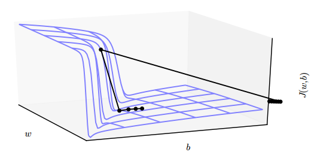
    
1. **梯度截断**（gradient clipping）——如果梯度超过某个阈值，就对其进行限制

    > 《深度学习》 10.11.1 截断梯度
    
    下面是 Tensorflow 提供的几种方法：

    - `tf.clip_by_value(t, clip_value_min, clip_value_max)`
    - `tf.clip_by_norm(t, clip_norm)`
    - `tf.clip_by_average_norm(t, clip_norm)`
    - `tf.clip_by_global_norm(t_list, clip_norm)`

    这里以`tf.clip_by_global_norm`为例：

    ```
    To perform the clipping, the values `t_list[i]` are set to:

        t_list[i] * clip_norm / max(global_norm, clip_norm)

    where:

        global_norm = sqrt(sum([l2norm(t)**2 for t in t_list]))
    ```

    用法：

    ```
    train_op = tf.train.AdamOptimizer()
    params = tf.trainable_variables()
    gradients = tf.gradients(loss, params)

    clip_norm = 100
    clipped_gradients, global_norm = tf.clip_by_global_norm(gradients, clip_norm)

    optimizer_op = train_op.apply_gradients(zip(clipped_gradients, params))
    ```

    > clip_norm 的设置视 loss 的大小而定，如果比较大，那么可以设为 100 或以上，如果比较小，可以设为 10 或以下。

2. 良好的参数初始化策略也能缓解梯度爆炸问题（权重正则化）

    > [1. 如何设置网络的初始值？*](#1-如何设置网络的初始值)

3. 使用线性整流激活函数，如 ReLU 等


# 神经网络（MLP）的万能近似定理*
> 《深度学习》 6.4.1 万能近似性质和深度

一个前馈神经网络如果具有至少一个非线性输出层，那么只要给予网络足够数量的隐藏单元，它就可以以任意的精度来近似任何从一个有限维空间到另一个有限维空间的函数。


# 神经网络中，深度与宽度的关系，及其表示能力的差异**
> 《深度学习》 6.4 - 架构设计；这一节的内容比较分散，想要更好的回答这个问题，需要理解深度学习的本质——学习多层次组合（ch1.2），这才是现代深度学习的基本原理。
    
隐藏层的数量称为模型的**深度**，隐藏层的维数（单元数）称为该层的**宽度**。

**万能近似定理**表明一个单层的网络就足以表达任意函数，但是该层的维数可能非常大，且几乎没有泛化能力；此时，使用更深的模型能够减少所需的单元数，同时增强泛化能力（减少泛化误差）。参数数量相同的情况下，浅层网络比深层网络更容易过拟合。


# 在深度神经网络中，引入了隐藏层（非线性单元），放弃了训练问题的凸性，其意义何在？**
> 《深度学习》 6 深度前馈网络（引言） & 6.3 隐藏单元

放弃训练问题的凸性，简单来说，就是放弃寻求问题的最优解。

**非线性单元**的加入，使训练问题不再是一个**凸优化**问题。这意味着神经网络很难得到最优解，即使一个只有两层和三个节点的简单神经网络，其训练优化问题仍然是 NP-hard 问题 (Blum & Rivest, 1993).

> [深度学习的核心问题——NP-hard问题](http://baijiahao.baidu.com/s?id=1561255903377484&wfr=spider&for=pc%EF%BC%89) - 百家号

但即使如此，使用神经网络也是利大于弊的：
- 人类设计者只需要寻找正确的**函数族**即可，而不需要去寻找精确的函数。
- 使用简单的梯度下降优化方法就可以高效地找到足够好的局部最小值
- 增强了模型的学习/拟合能力，如原书中所说“ maxout 单元可以以任意精度近似任何凸函数”。至于放弃凸性后的优化问题可以在结合工程实践来不断改进。 “似乎传统的优化理论结果是残酷的，但我们可以通过**工程方法**和**数学技巧**来尽量规避这些问题，例如启发式方法、增加更多的机器和使用新的硬件（如GPU）。”

> [Issue #1](https://github.com/elviswf/DeepLearningBookQA_cn/issues/1#issuecomment-396061806) · elviswf/DeepLearningBookQA_cn 


# 稀疏表示，低维表示，独立表示*
> 《深度学习》 5.8 无监督学习算法

无监督学习任务的目的是找到数据的“最佳”表示。“最佳”可以有不同的表示，但是一般来说，是指该表示在比本身表示的信息更简单的情况下，尽可能地保存关于 x 更多的信息。

低维表示、稀疏表示和独立表示是最常见的三种“简单”表示：1）低维表示尝试将 x 中的信息尽可能压缩在一个较小的表示中；2）稀疏表示将数据集嵌入到输入项大多数为零的表示中；3）独立表示试图分开数据分布中变化的来源，使得表示的维度是统计独立的。

这三种表示不是互斥的，比如主成分分析（PCA）就试图同时学习低维表示和独立表示。

表示的概念是深度学习的核心主题之一。
    

# 局部不变性（平滑先验）及其在基于梯度的学习上的局限性*
> 《深度学习》 5.11.2 局部不变性与平滑正则化

局部不变性：函数在局部小区域内不会发生较大的变化。

为了更好地**泛化**，机器学习算法需要由一些先验来引导应该学习什么类型的函数。

其中最广泛使用的“隐式先验”是平滑先验（smoothness prior），也称局部不变性先验（local constancy prior）。许多简单算法完全依赖于此先验达到良好的（局部）泛化，一个极端例子是 k-最近邻系列的学习算法。

但是仅依靠平滑先验**不足以**应对人工智能级别的任务。简单来说，区分输入空间中 O(k) 个区间，需要 O(k) 个样本，通常也会有 O(k) 个参数。最近邻算法中，每个训练样本至多用于定义一个区间。类似的，决策树也有平滑学习的局限性。

以上问题可以总结为：是否可以有效地表示复杂的函数，以及所估计的函数是否可以很好地泛化到新的输入。该问题的一个关键观点是，只要我们通过额外假设生成数据的分布来建立区域间的依赖关系，那么 O(k) 个样本足以描述多如 O(2^k) 的大量区间。通过这种方式，能够做到**非局部的泛化**。

> 一些其他的机器学习方法往往会提出更强的，针对特定问题的假设，例如周期性。通常，神经网络不会包含这些很强的针对性假设——深度学习的核心思想是假设数据由因素或特征组合产生，这些因素或特征可能来自一个层次结构的多个层级。许多其他类似的通用假设进一步提高了深度学习算法。这些很温和的假设允许了样本数目和可区分区间数目之间的**指数增益**。深度的分布式表示带来的指数增益有效地解决了维数灾难带来的挑战
>> 指数增益：《深度学习》 ch6.4.1、ch15.4、ch15.5


# 为什么交叉熵损失相比均方误差损失能提高以 sigmoid 和 softmax 作为激活函数的层的性能？**
> 《深度学习》 6.6 小结 中提到了这个结论，但是没有给出具体原因（可能在前文）。

简单来说，就是使用均方误差（MSE）作为损失函数时，会导致大部分情况下**梯度偏小**，其结果就是权重的更新很慢，且容易造成“梯度消失”现象。而交叉熵损失克服了这个缺点，当误差大的时候，权重更新就快，当误差小的时候，权重的更新才慢。

具体推导过程如下：

> https://blog.csdn.net/guoyunfei20/article/details/78247263 - CSDN 博客
>
> 这里给出了一个具体的[例子](https://blog.csdn.net/shmily_skx/article/details/53053870)
    

# 分段线性单元（如 ReLU）代替 sigmoid 的利弊***
> 《深度学习》 6.6 小结

- 当神经网络比较小时，sigmoid 表现更好；
- 在深度学习早期，人们认为应该避免具有不可导点的激活函数，而 ReLU 不是全程可导/可微的
- sigmoid 和 tanh 的输出是有界的，适合作为下一层的输入，以及整个网络的输出。实际上，目前大多数网络的输出层依然使用的 sigmoid（单输出） 或 softmax（多输出）。

    > 为什么 ReLU 不是全程可微也能用于基于梯度的学习？——虽然 ReLU 在 0 点不可导，但是它依然存在左导数和右导数，只是它们不相等（相等的话就可导了），于是在实现时通常会返回左导数或右导数的其中一个，而不是报告一个导数不存在的错误。
    >> 一阶函数：可微==可导

- 对于小数据集，使用整流非线性甚至比学习隐藏层的权重值更加重要 (Jarrett et al., 2009b)
- 当数据增多时，在深度整流网络中的学习比在激活函数具有曲率或两侧**饱和**的深度网络中的学习更容易 (Glorot et al., 2011a)：传统的 sigmoid 函数，由于两端饱和，在传播过程中容易丢弃信息
- ReLU 的过程更接近生物神经元的作用过程

    > 饱和（saturate）现象：在函数图像上表现为变得很平，对输入的微小改变会变得不敏感。

> https://blog.csdn.net/code_lr/article/details/51836153 - CSDN博客
>> 答案总结自该知乎问题：https://www.zhihu.com/question/29021768
    

# 在做正则化过程中，为什么只对权重做正则惩罚，而不对偏置做权重惩罚*
> 《深度学习》 7.1 参数范数惩罚

在神经网络中，参数包括每一层仿射变换的**权重**和**偏置**，我们通常只对权重做惩罚而不对偏置做正则惩罚。

精确拟合偏置所需的数据通常比拟合权重少得多。每个权重会指定两个变量如何相互作用。我们需要在各种条件下观察这两个变量才能良好地拟合权重。而每个偏置仅控制一个单变量。这意味着，我们不对其进行正则化也不会导致太大的方差。另外，正则化偏置参数可能会导致明显的欠拟合。


# 列举常见的一些范数及其应用场景，如 L0、L1、L2、L∞、Frobenius等范数**
> 《深度学习》 2.5 范数（介绍）

L0: 向量中非零元素的个数

L1: 向量中所有元素的绝对值之和

[](http://www.codecogs.com/eqnedit.php?latex=\left&space;\|&space;x&space;\right&space;\|_1=\sum_i{\left&space;|&space;x_i&space;\right&space;|})

L2: 向量中所有元素平方和的开放

[](http://www.codecogs.com/eqnedit.php?latex=\left&space;\|&space;x&space;\right&space;\|_2=\sqrt{\sum_i{\left&space;|&space;x_i&space;\right&space;|^2}})

其中 L1 和 L2 范数分别是 Lp (p>=1) 范数的特例：

[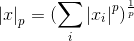](http://www.codecogs.com/eqnedit.php?latex=\left&space;\|&space;x&space;\right&space;\|_p=(\sum_i{\left&space;|&space;x_i&space;\right&space;|^2})^{\frac{1}{p}})

L∞: 向量中最大元素的绝对值，也称最大范数

[](http://www.codecogs.com/eqnedit.php?latex=\left&space;\|&space;x&space;\right&space;\|_\infty=\max_i\left&space;|&space;x&space;\right&space;|)

Frobenius 范数：相当于作用于矩阵的 L2 范数

[](http://www.codecogs.com/eqnedit.php?latex=\left&space;\|&space;A&space;\right&space;\|_F=\sqrt{\sum_{i,j}A_{i,j}^2})

**范数的应用**：正则化——权重衰减/参数范数惩罚

**权重衰减的目的**

限制模型的学习能力，通过限制参数 θ 的规模（主要是权重 w 的规模，偏置 b 不参与惩罚），使模型偏好于权值较小的目标函数，防止过拟合。

> 《深度学习》 7.1 参数范数惩罚


# L1 和 L2 范数的异同***
> 《深度学习》 7.1.1 L2 参数正则化 & 7.1.2 - L1 参数正则化

**相同点**
- 限制模型的学习能力，通过限制参数的规模，使模型偏好于权值较小的目标函数，防止过拟合。

**不同点**
- L1 正则化可以产生稀疏权值矩阵，即产生一个稀疏模型，可以用于特征选择；一定程度上防止过拟合
- L2 正则化主要用于防止模型过拟合
- L1 适用于特征之间有关联的情况；L2 适用于特征之间没有关联的情况

> [机器学习中正则化项L1和L2的直观理解](https://blog.csdn.net/jinping_shi/article/details/52433975) - CSDN博客


# 为什么 L1 正则化可以产生稀疏权值，L2 正则化可以防止过拟合？**

## 为什么 L1 正则化可以产生稀疏权值，而 L2 不会？

添加 L1 正则化，相当于在 L1范数的约束下求目标函数 J 的最小值，下图展示了二维的情况：


图中 J 与 L 首次相交的点就是最优解。L1 在和每个坐标轴相交的地方都会有“角”出现（多维的情况下，这些角会更多），在角的位置就会产生稀疏的解。而 J 与这些“角”相交的机会远大于其他点，因此 L1 正则化会产生稀疏的权值。

类似的，可以得到带有 L2正则化的目标函数在二维平面上的图形，如下：


相比 L1，L2 不会产生“角”，因此 J 与 L2 相交的点具有稀疏性的概率就会变得非常小。

> [机器学习中正则化项L1和L2的直观理解](https://blog.csdn.net/jinping_shi/article/details/52433975) - CSDN博客

## 为什么 L1 和 L2 正则化可以防止过拟合？

L1 & L2 正则化会使模型偏好于更小的权值。

简单来说，更小的权值意味着更低的模型复杂度，也就是对训练数据的拟合刚刚好（奥卡姆剃刀），不会过分拟合训练数据（比如异常点，噪声），以提高模型的泛化能力。

此外，添加正则化相当于为模型添加了某种**先验**（限制），规定了参数的分布，从而降低了模型的复杂度。模型的复杂度降低，意味着模型对于噪声与异常点的抗干扰性的能力增强，从而提高模型的泛化能力。

> [机器学习中防止过拟合的处理方法](https://blog.csdn.net/heyongluoyao8/article/details/49429629) - CSDN博客


# 简单介绍常用的激活函数，如 sigmoid、relu、softplus、tanh、RBF 及其应用场景***
> 《深度学习》 6.3 隐藏单元

## 整流线性单元（ReLU）

[](http://www.codecogs.com/eqnedit.php?latex=g(z)=\max(0,z))


整流线性单元（ReLU）通常是激活函数较好的默认选择。

整流线性单元易于优化，因为它们和线性单元非常类似。线性单元和整流线性单元的唯一区别在于整流线性单元在其一半的定义域上输出为零。这使得只要整流线性单元处于激活状态，它的导数都能保持较大。它的梯度不仅大而且一致。整流操作的二阶导数几乎处处为 0，并且在整流线性单元处于激活状态时，它的一阶导数处处为 1。这意味着相比于引入二阶效应的激活函数来说，它的梯度方向对于学习来说更加有用。

**ReLU 的拓展**

ReLU 的三种拓展都是基于以下变型：

[](http://www.codecogs.com/eqnedit.php?latex=g(z,\alpha)&space;=\max(0,z)&plus;\alpha\min(0,z))

ReLU 及其扩展都是基于一个原则，那就是如果它们的行为更接近线性，那么模型更容易优化。

- 绝对值整流（absolute value rectification）
    
    固定 α == -1，此时整流函数即一个绝对值函数
    
    [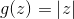](http://www.codecogs.com/eqnedit.php?latex=g(z)&space;=\left&space;|&space;z&space;\right&space;|)

    绝对值整流被用于图像中的对象识别 (Jarrett et al., 2009a)，其中寻找在输入照明极性反转下不变的特征是有意义的。

- 渗漏整流线性单元（Leaky ReLU, Maas et al., 2013）
    
    固定 α 为一个类似于 0.01 的小值

- 参数化整流线性单元（parametric ReLU, PReLU, He et al., 2015）

    将 α 作为一个参数学习

- maxout 单元 (Goodfellow et al., 2013a)

    maxout 单元 进一步扩展了 ReLU，它是一个可学习的多达 k 段的分段函数

    关于 maxout 网络的分析可以参考论文或网上的众多分析，下面是 Keras 中的实现：
    ```
    # input shape:  [n, input_dim]
    # output shape: [n, output_dim]
    W = init(shape=[k, input_dim, output_dim])
    b = zeros(shape=[k, output_dim])
    output = K.max(K.dot(x, W) + b, axis=1)
    ```
    > [深度学习（二十三）Maxout网络学习](https://blog.csdn.net/hjimce/article/details/50414467) - CSDN博客

## sigmoid 与 tanh（双曲正切函数）

在引入 ReLU 之前，大多数神经网络使用 sigmoid 激活函数：

[](http://www.codecogs.com/eqnedit.php?latex=g(z)=\sigma(z)=\frac{1}{1&plus;\exp(-z)})


或者 tanh（双曲正切函数）：

[](http://www.codecogs.com/eqnedit.php?latex=g(z)&space;=&space;\tanh(z))

tanh 的图像类似于 sigmoid，区别在其值域为 (-1, 1).

这两个函数有如下关系：

[](http://www.codecogs.com/eqnedit.php?latex=\tanh(z)=2\sigma&space;(2z)-1)

**sigmoid 函数要点**：
- sigmoid 常作为输出单元用来预测二值型变量取值为 1 的概率
    > 换言之，sigmoid 函数可以用来产生**伯努利分布**中的参数 ϕ，因为它的值域为 (0, 1).
- sigmoid 函数在输入取绝对值非常大的正值或负值时会出现**饱和**（saturate）现象，在图像上表现为开始变得很平，此时函数会对输入的微小改变会变得不敏感。仅当输入接近 0 时才会变得敏感。
    > 饱和现象会导致基于梯度的学习变得困难，并在传播过程中丢失信息。——[为什么用ReLU代替sigmoid？](#8.-分段线性单元（如-ReLU）代替-sigmoid-的利弊)
- 如果要使用 sigmoid 作为激活函数时（浅层网络），tanh 通常要比 sigmoid 函数表现更好。
    > tanh 在 0 附近与单位函数类似，这使得训练 tanh 网络更容易些。

## 其他激活函数（隐藏单元）

很多未发布的非线性激活函数也能表现的很好，但没有比流行的激活函数表现的更好。比如使用 cos 也能在 MNIST 任务上得到小于 1% 的误差。通常新的隐藏单元类型只有在被明确证明能够提供显著改进时才会被发布。

**线性激活函数**：

如果神经网络的每一层都由线性变换组成，那么网络作为一个整体也将是线性的，这会导致失去万能近似的性质。但是，仅**部分层是纯线性**是可以接受的，这可以帮助**减少网络中的参数**。

**softmax**：

softmax 单元常作为网络的输出层，它很自然地表示了具有 k 个可能值的离散型随机变量的概率分布。

**径向基函数（radial basis function, RBF）**：

[](http://www.codecogs.com/eqnedit.php?latex=h_i=\exp(-\frac{1}{\sigma_i^2}\left&space;\|&space;W_{:,i}-x&space;\right&space;\|^2))

在神经网络中很少使用 RBF 作为激活函数，因为它对大部分 x 都饱和到 0，所以很难优化。

**softplus**：

[](http://www.codecogs.com/eqnedit.php?latex=g(z)=\zeta(z)=\log(1&plus;\exp(z)))


softplus 是 ReLU 的平滑版本。通常不鼓励使用 softplus 函数，大家可能希望它具有优于整流线性单元的点，但根据经验来看，它并没有。
> (Glorot et al., 2011a) 比较了这两者，发现 ReLU 的结果更好。

**硬双曲正切函数（hard tanh）**：

[](http://www.codecogs.com/eqnedit.php?latex=g(z)=\max(-1,\min(1,a)))

它的形状和 tanh 以及整流线性单元类似，但是不同于后者，它是有界的。
> Collobert, 2004

## sigmoid 和 softplus 的一些性质


> 《深度学习》 3.10 常用函数的有用性质


# Jacobian 和 Hessian 矩阵及其在深度学习中的重要性*
> 《深度学习》 4.3.1 梯度之上：Jacobian 和 Hessian 矩阵


# 信息熵、KL 散度（相对熵）与交叉熵**
> 《深度学习》 3.13 信息论

信息论的基本想法是一个不太可能的事件居然发生了，要比一个非常可能的事件发生，能提供更多的信息。

该想法可描述为以下性质：
1. 非常可能发生的事件信息量要比较少，并且极端情况下，确保能够发生的事件应该没有信息量。
2. 比较不可能发生的事件具有更高的信息量。
3. 独立事件应具有增量的信息。例如，投掷的硬币两次正面朝上传递的信息量，应该是投掷一次硬币正面朝上的信息量的两倍。

## 自信息与信息熵

自信息（self-information）是一种量化以上性质的函数，定义一个事件 x 的自信息为：

[](http://www.codecogs.com/eqnedit.php?latex=I(x)=-\log&space;P(x))

> 当该对数的底数为 e 时，单位为奈特（nats，本书标准）；当以 2 为底数时，单位为比特（bit）或香农（shannons）

自信息只处理单个的输出。此时，用信息熵（Information-entropy）来对整个概率分布中的不确定性总量进行量化：

[](http://www.codecogs.com/eqnedit.php?latex=H(\mathrm{X})=\mathbb{E}_{\mathrm{X}&space;\sim&space;P}[I(x)]=-\sum_{x&space;\in&space;\mathrm{X}}P(x)\log&space;P(x))

> 信息熵也称香农熵（Shannon entropy）
>
> 信息论中，记 `0log0 = 0`

## 相对熵（KL 散度）与交叉熵

P 对 Q 的 **KL散度**（Kullback-Leibler divergence）：

[](http://www.codecogs.com/eqnedit.php?latex=D_P(Q)=\mathbb{E}_{\mathrm{X}\sim&space;P}\left&space;[&space;\log&space;\frac{P(x)}{Q(x)}&space;\right&space;]=\sum_{x&space;\in&space;\mathrm{X}}P(x)\left&space;[&space;\log&space;P(x)-\log&space;Q(x)&space;\right&space;])

**KL 散度在信息论中度量的是那个直观量**：

在离散型变量的情况下， KL 散度衡量的是，当我们使用一种被设计成能够使得概率分布 Q 产生的消息的长度最小的编码，发送包含由概率分布 P 产生的符号的消息时，所需要的额外信息量。

**KL 散度的性质**：
- 非负；KL 散度为 0 当且仅当P 和 Q 在离散型变量的情况下是相同的分布，或者在连续型变量的情况下是“几乎处处”相同的
- 不对称；D_p(q) != D_q(p)

**交叉熵**（cross-entropy）：

[](http://www.codecogs.com/eqnedit.php?latex=H_P(Q)=-\mathbb{E}_{\mathrm{X}\sim&space;P}\log&space;Q(x)=-\sum_{x&space;\in&space;\mathrm{X}}P(x)\log&space;Q(x))

> [信息量，信息熵，交叉熵，KL散度和互信息（信息增益）](https://blog.csdn.net/haolexiao/article/details/70142571) - CSDN博客

**交叉熵与 KL 散度的关系**：

[](http://www.codecogs.com/eqnedit.php?latex=H_P(Q)=H(P)&plus;D_P(Q))

**针对 Q 最小化交叉熵等价于最小化 P 对 Q 的 KL 散度**，因为 Q 并不参与被省略的那一项。

最大似然估计中，最小化 KL 散度其实就是在最小化分布之间的交叉熵。

> 《深度学习》 ch5.5 - 最大似然估计


# 如何避免数值计算中的上溢和下溢问题，以 softmax 为例*
> 《深度学习》 4.1 上溢与下溢

- **上溢**：一个很大的数被近似为 ∞ 或 -∞；
- **下溢**：一个很小的数被近似为 0

必须对上溢和下溢进行**数值稳定**的一个例子是 **softmax 函数**：

[](http://www.codecogs.com/eqnedit.php?latex=\mathrm{softmax}(x)=\frac{\exp(x_i)}{\sum_{j=1}^n&space;\exp(x_j)})

因为 softmax 解析上的函数值不会因为从输入向量减去或加上**标量**而改变，
于是一个简单的解决办法是对 x：

[](http://www.codecogs.com/eqnedit.php?latex=x=x-\max_ix_i)

减去 `max(x_i)` 导致 `exp` 的最大参数为 `0`，这排除了上溢的可能性。同样地，分母中至少有一个值为 `1=exp(0)` 的项，这就排除了因分母下溢而导致被零除的可能性。

**注意**：虽然解决了分母中的上溢与下溢问题，但是分子中的下溢仍可以导致整体表达式被计算为零。此时如果计算 log softmax(x) 时，依然要注意可能造成的上溢或下溢问题，处理方法同上。

当然，大多数情况下，这是底层库开发人员才需要注意的问题。


# 训练误差、泛化误差；过拟合、欠拟合；模型容量，表示容量，有效容量，最优容量的概念； 奥卡姆剃刀原则*
> 《深度学习》 5.2 容量、过拟合和欠拟合

## 过拟合的一些解决方案***
- 参数范数惩罚（Parameter Norm Penalties）
- 数据增强（Dataset Augmentation）
- 提前终止（Early Stopping）
- 参数绑定与参数共享（Parameter Tying and Parameter Sharing）
- Bagging 和其他集成方法
- Dropout
- 批标准化（Batch Normalization）

# 高斯分布的广泛应用的原因**
> 《深度学习》 3.9.3 高斯分布

## 高斯分布（Gaussian distribution）

高斯分布，即正态分布（normal distribution）：

[](http://www.codecogs.com/eqnedit.php?latex=N(x;\mu,\sigma^2)=\sqrt\frac{1}{2\pi\sigma^2}\exp\left&space;(&space;-\frac{1}{2\sigma^2}(x-\mu)^2&space;\right&space;))

概率密度函数图像：


其中峰的 `x` 坐标由 `µ` 给出，峰的宽度受 `σ` 控制；特别的，当 `µ = 0, σ = 1`时，称为标准正态分布

正态分布的均值 `E = µ`；标准差 `std = σ`，方差为其平方

## 为什么推荐使用高斯分布？
当我们由于缺乏关于某个实数上分布的先验知识而不知道该选择怎样的形式时，正态分布是默认的比较好的选择，其中有两个原因：
1. 我们想要建模的很多分布的真实情况是比较接近正态分布的。**中心极限定理**（central limit theorem）说明很多独立随机变量的和近似服从正态分布。这意味着在实际中，很多复杂系统都可以被成功地建模成正态分布的噪声，即使系统可以被分解成一些更结构化的部分。
2. 第二，在具有相同方差的所有可能的概率分布中，正态分布在实数上具有最大的不确定性。因此，我们可以认为正态分布是对模型加入的先验知识量最少的分布。
    > 关于这一点的证明：《深度学习》 ch19.4.2 - 变分推断和变分学习

**多维正态分布**

正态分布可以推广到 n 维空间，这种情况下被称为**多维正态分布**。


参数 `µ` 仍然表示分布的均值，只不过现在是一个向量。参数 Σ 给出了分布的协方差矩阵（一个正定对称矩阵）。


# 表示学习、自编码器与深度学习**
> 《深度学习》 1 引言

**表示学习**：

对于许多任务来说，我们很难知道应该提取哪些特征。解决这个问题的途径之一是使用机器学习来发掘表示本身，而不仅仅把表示映射到输出。这种方法我们称之为**表示学习**（representation learning）。学习到的表示往往比手动设计的表示表现得更好。并且它们只需最少的人工干预，就能让AI系统迅速适应新的任务。 

**自编码器**：

表示学习算法的典型例子是 自编码器（autoencoder）。自编码器由一个**编码器**（encoder）函数和一个**解码器**（decoder）函数组合而成。
- 编码器函数将输入数据转换为一种不同的表示;
- 解码器函数则将这个新的表示转换到原来的形式。

我们期望当输入数据经过编码器和解码器之后**尽可能多地保留信息**，同时希望新的表示有一些好的特性，这也是自编码器的训练目标。

**深度学习**：

深度学习（deep learning）通过简单的表示来表达复杂的表示，以解决表示学习中的核心问题。


深度学习模型的示意图

计算机难以理解原始感观输入数据的含义，如表示为像素值集合的图像，将一组像素映射到对象标识的函数非常复杂。深度学习将所需的复杂映射分解为一系列嵌套的简单映射（每个由模型的不同层描述）来解决这一难题。

输入展示在**可见层**（visible layer），这样命名的原因是因为它包含我们能观察到的变量。然后是一系列从图像中提取越来越多抽象特征的**隐藏层**（hidden layer），称为“隐藏”的原因是因为它们的值不在数据中给出。

模型必须确定哪些概念有利于解释观察数据中的关系。这里的图像是每个隐藏单元表示的特征的可视化。给定像素，**第一隐藏层**可以轻易地通过比较相邻像素的亮度来**识别边缘**。有了第一隐藏层描述的边缘，**第二隐藏层**可以容易地**搜索轮廓和角**。给定第二隐藏层中关于角和轮廓的图像描述，**第三隐藏层**可以找到轮廓和角的特定集合来**检测整个特定对象**。最后，根据图像描述中包含的对象部分，可以识别图像中存在的对象。

> 实际任务中并不一定具有这么清晰的可解释性，很多时候你并不知道每个隐藏层到底识别出了哪些特征。

学习数据的正确表示的想法是**解释深度学习**的一个视角。

> 另一个视角是深度促使计算机学习一个多步骤的计算机程序。——《深度学习》 ch1 - 引言
>
> 早期的深度学习称为神经网络，因为其主要指导思想来源于生物神经学。从神经网络向深度学习的术语转变也是因为指导思想的改变。


# L1、L2 正则化与 MAP 贝叶斯推断的关系*
> 《深度学习》 5.6.1 最大后验 (MAP) 估计

许多正则化策略可以被解释为 MAP 贝叶斯推断：
- L2 正则化相当于权重是高斯先验的 MAP 贝叶斯推断
- 对于 L1正则化，用于正则化代价函数的惩罚项与通过 MAP 贝叶斯推断最大化的**对数先验项**是等价的


# 什么是欠约束，为什么大多数的正则化可以使欠约束下的欠定问题在迭代过程中收敛*
> 《深度学习》 7.3 正则化与欠约束问题


# 为什么考虑在模型训练时对输入 (隐藏单元或权重) 添加方差较小的噪声？*
> 《深度学习》 7.5 噪声鲁棒性

对于某些模型而言，向输入添加方差极小的噪声等价于对权重施加范数惩罚 (Bishop, 1995a,b)。

在一般情况下，**注入噪声比简单地收缩参数强大**。特别是噪声被添加到**隐藏单元**时会更加强大，**Dropout** 方法正是这种做法的主要发展方向。

另一种正则化模型的噪声使用方式是将其加到**权重**。这项技术主要用于循环神经网络 (Jim et al., 1996; Graves, 2011)。这可以被解释为关于权重的贝叶斯推断的随机实现。贝叶斯学习过程将权重视为不确定的，并且可以**通过概率分布表示这种不确定性**。向权重添加噪声是反映这种不确定性的一种实用的随机方法。


# 多任务学习、参数绑定和参数共享***
> [45. 迁移学习相关概念](#45-迁移学习相关概念)

## 多任务学习
> 《深度学习》 7.7 多任务学习

多任务学习 (Caruana, 1993) 是通过**合并多个任务中的样例**（可以视为对参数施加软约束）来提高泛化的一种方式。

正如额外的训练样本能够将模型参数推向具有更好泛化能力的值一样，当**模型的一部分被多个额外的任务共享**时，这部分将被约束为良好的值（如果共享合理），通常会带来更好的泛化能力。

**多任务学习中一种普遍形式**：


多任务学习在深度学习框架中可以以多种方式进行，该图展示了一种普遍形式：任务共享相同输入但涉及不同语义的输出。

在该示例中，额外假设顶层隐藏单元 h(1) 和 h(2) 专用于不同的任务——分别预测 y(1) 和 y(2)，而一些**中间层表示** h(shared) 在所有任务之间共享；h(3) 表示无监督学习的情况。

这里的基本假设是存在解释输入 x 变化的**共同因素池**，而每个任务与这些因素的**子集**相关联。

该模型通常可以分为两类相关的参数：
1. 具体任务的参数（只能从各自任务的样本中实现良好的泛化）
2. 所有任务共享的通用参数（从所有任务的汇集数据中获益）——参数共享

因为**共享参数**，其统计强度可大大提高（共享参数的样本数量相对于单任务模式增加的比例），并能改善泛化和泛化误差的范围 (Baxter, 1995)。

参数共享仅当不同的任务之间存在某些统计关系的假设是合理（意味着某些参数能通过不同任务共享）时才会发生这种情况

## 参数绑定和参数共享
> 《深度学习》 7.9 参数绑定和参数共享

**参数绑定**：

有时，我们可能无法准确地知道应该使用什么样的参数，但我们根据相关领域和模型结构方面的知识得知模型参数之间应该存在一些相关性。

考虑以下情形：我们有两个模型执行相同的分类任务（具有相同类别），但输入分布稍有不同。

形式地，我们有参数为 w(A) 的模型 A 和参数为 w(B) 的模型 B。这两种模型将输入映射到两个不同但相关的输出： y(A) = f(x;w(A)) 和 y(B) = f(x;w(B))

可以想象，这些任务会足够相似（或许具有相似的输入和输出分布），因此我们认为模型参数 w(A) 和 w(B) 应彼此靠近。具体来说，我们可以使用以下形式的参数范数惩罚（这里使用的是 L2 惩罚，也可以使用其他选择）：

[](http://www.codecogs.com/eqnedit.php?latex=\Omega&space;(w^{(A)},w^{(B)})=\left&space;\|&space;w^{(A)}-w^{(B)}&space;\right&space;\|^2_2)

**参数共享**是这个思路下更流行的做法——强迫部分参数相等

和正则化参数使其接近（通过范数惩罚）相比，参数共享的一个显著优点是能够“减少内存”——只有参数（唯一一个集合）的子集需要被存储在内存中，特别是在 CNN 中。


# Dropout 与 Bagging 集成方法的关系，Dropout 带来的意义与其强大的原因***

## Bagging 集成方法
> 《深度学习》 7.11 Bagging 和其他集成方法

**集成方法**：

其主要想法是分别训练几个不同的模型，然后让所有模型表决测试样例的输出。这是机器学习中常规策略的一个例子，被称为**模型平均**（model averaging）。采用这种策略的技术被称为**集成方法**。

模型平均（model averaging）**奏效的原因**是不同的模型通常不会在测试集上产生完全相同的误差。平均上， 集成至少与它的任何成员表现得一样好，并且**如果成员的误差是独立的**，集成将显著地比其成员表现得更好。

**Bagging**：

Bagging（bootstrap aggregating）是通过结合几个模型降低泛化误差的技术 (Breiman, 1994)。

具体来说，Bagging 涉及构造 k 个**不同的数据集**。每个数据集从原始数据集中**重复采样**构成，和原始数据集具有**相同数量**的样例。这意味着，每个数据集以高概率缺少一些来自原始数据集的例子，还包含若干重复的例子（更具体的，如果采样所得的训练集与原始数据集大小相同，那所得数据集中大概有原始数据集 **2/3** 的实例）


**图像说明**：该图描述了 Bagging 如何工作。假设我们在上述数据集（包含一个 8、一个 6 和一个 9）上**训练数字 8** 的检测器。假设我们制作了两个不同的重采样数据集。 Bagging 训练程序通过有放回采样构建这些数据集。第一个数据集忽略 9 并重复 8。在这个数据集上，检测器得知数字**顶部有一个环就对应于一个 8**。第二个数据集中，我们忽略 6 并重复 9。在这种情况下，检测器得知数字**底部有一个环就对应于一个 8**。这些单独的分类规则中的每一个都是不可靠的，但如果我们平均它们的输出，就能得到鲁棒的检测器，**只有当 8 的两个环都存在时才能实现最大置信度**。


## Dropout
> 《深度学习》 7.12 Dropout

**Dropout 的意义与强大的原因**：

简单来说，Dropout (Srivastava et al., 2014) 通过**参数共享**提供了一种廉价的 **Bagging** 集成近似，能够训练和评估**指数级数量**的神经网络。


Dropout 训练的集成包括所有从基础网络除去部分单元后形成的子网络。具体而言，只需将一些单元的**输出乘零**就能有效地删除一个单元。

通常，**隐藏层**的采样概率为 0.5，**输入**的采样概率为 0.8；超参数也可以采样，但其采样概率一般为 1

**Dropout与Bagging的不同点**：
- 在 Bagging 的情况下，所有模型都是独立的；而在 Dropout 的情况下，所有模型**共享参数**，其中每个模型继承父神经网络参数的不同子集。
- 在 Bagging 的情况下，每一个模型都会在其相应训练集上训练到收敛。而在 Dropout 的情况下，通常大部分模型都没有显式地被训练；取而代之的是，在单个步骤中我们训练一小部分的子网络，参数共享会使得剩余的子网络也能有好的参数设定。

**权重比例推断规则**：

简单来说，如果我们使用 0.5 的包含概率（keep prob），权重比例规则相当于在训练结束后**将权重除 2**，然后像平常一样使用模型；等价的，另一种方法是在训练期间将单元的状态乘 2。

无论哪种方式，我们的目标是确保在测试时一个单元的期望总输入与在训练时该单元的期望总输入是大致相同的（即使近半单位在训练时丢失）。


# 批梯度下降法（Batch SGD）更新过程中，批的大小会带来怎样的影响**
> 《深度学习》 8.1.3 批量算法和小批量算法

特别说明：本书中，“**批量**”指使用使用全部训练集；“**小批量**”才用来描述小批量随机梯度下降算法中用到的小批量样本；而**随机梯度下降**（SGD）通常指每次只使用单个样本

**批的大小**通常由以下几个因素决定：
- **较大的批能得到更精确的梯度估计**，但回报是小于线性的。
- **较小的批能带来更好的泛化误差**，泛化误差通常在批大小为 1 时最好。但是，因为梯度估计的高方差，小批量训练需要**较小的学习率**以保持稳定性，这意味着**更长的训练时间**。
    > 可能是由于小批量在学习过程中加入了噪声，它们会有一些正则化效果 (Wilson and Martinez, 2003)
- **内存消耗和批的大小成正比**，如果批量处理中的所有样本可以并行地处理（通常确是如此）。
- 在某些硬件上使用特定大小可以减少运行时间。尤其是在使用 GPU 时，通常使用 **2 的幂数**作为批量大小可以获得更少的运行时间。一般，2 的幂数的**取值范围是 32 到 256**，16 有时在尝试大模型时使用。
- 小批量更容易利用**多核架构**，但是太小的批并不会减少计算时间，这促使我们使用一些**绝对最小批量**

很多机器学习上的优化问题都可以分解成并行地计算不同样本上单独的更新。换言之，我们在计算小批量样本 X 上最小化 J(X) 的更新时，同时可以计算其他小批量样本上的更新。
> 异步并行分布式方法 -> 《深度学习》 12.1.3 大规模的分布式实现


# 如何避免深度学习中的病态，鞍点，梯度爆炸，梯度弥散？***
> 《深度学习》 8.2 神经网络优化中的挑战

## 病态（ill-conditioning）
> 《深度学习》 8.2.1 病态

**什么是病态？** 
> [神经网络优化中的病态问题](https://blog.csdn.net/foolsnowman/article/details/51614862) - CSDN博客
>
> [什么是 ill-conditioning 对SGD有什么影响？](https://www.zhihu.com/question/56977045) - 知乎 

简单来说，深度学习中的病态问题指的就是学习/优化变的困难，需要更多的迭代次数才能达到相同的精度。

> 病态问题普遍存在于数值优化、凸优化或其他形式的优化中 -> ch4.3.1 - 梯度之上：Jacobian 和 Hessian 矩阵

更具体的，导致病态的原因是问题的**条件数**（condition number）非常大，其中`条件数 = 函数梯度最大变化速度 / 梯度最小变化速度`（对于二阶可导函数，条件数的严格定义是：Hessian矩阵最大特征值的上界 / 最小特征值的下界）。

**条件数大**意味着目标函数在有的地方（或有的方向）变化很快、有的地方很慢，比较不规律，从而很难用当前的局部信息（梯度）去比较准确地预测最优点所在的位置，只能一步步缓慢的逼近最优点，从而优化时需要更多的迭代次数。

**如何避免病态？**

知道了什么是病态，那么所有有利于**加速训练**的方法都属于在避免病态，其中最主要的还是优化算法。

深度学习主要使用的优化算法是**梯度下降**，所以避免病态问题的关键是改进梯度下降算法：
- 随机梯度下降（SGD）、批量随机梯度下降
- 动态的学习率
- **带动量的 SGD**
> [28. SGD 以及学习率的选择方法，带动量的 SGD 对于 Hessian 矩阵病态条件及随机梯度方差的影响***](#28-sgd-以及学习率的选择方法带动量的-sgd-对于-hessian-矩阵病态条件及随机梯度方差的影响)

## 鞍点（saddle point）

对于很多高维非凸函数（神经网络）而言，局部极小值/极大值事实上都**远少于**另一类梯度为零的点：鞍点

**什么是鞍点？**

二维和三维中的鞍点：

 
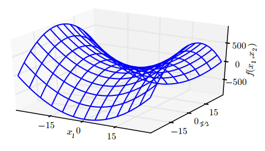
> 《深度学习》 4.3 基于梯度的优化方法

**鞍点激增对于训练算法来说有哪些影响？**

对于只使用梯度信息的一阶优化算法（随机梯度下降）而言，目前情况还不清楚。不过，虽然鞍点附近的梯度通常会非常小，但是 Goodfellow et al. (2015) 认为连续的梯度下降**会逃离而不是吸引到鞍点**。

对于牛顿法（二阶梯度）而言，鞍点问题会比较明显。不过神经网络中很少使用二阶梯度进行优化。

## 长期依赖与梯度爆炸、消失
> 《深度学习》 10.11 优化长期依赖

当计算图变得很深时（循环神经网络），神经网络优化算法会面临的另外一个难题就是**长期依赖**，由于变深的结构使模型丧失了学习到先前信息的能力，让优化变得极其困难；具体来说，就是会出现**梯度消失**和**梯度爆炸**问题。

**如何避免梯度爆炸？**
> [2. 梯度爆炸的解决办法***](#2-梯度爆炸的解决办法)

**如何缓解梯度消失？**

梯度截断有助于处理爆炸的梯度，但它无助于梯度消失。

一个想法是：在展开循环架构的计算图中，沿着与弧边相关联的梯度乘积接近 1 的部分创建路径——LSTM, GRU 等**门控机制**正是该想法的实现。
> 《深度学习》 10.10 长短期记忆和其他门控 RNN

另一个想法是：正则化或约束参数，以引导“信息流”；或者说，希望**梯度向量**在反向传播时能维持其幅度。形式上，我们要使

[](http://www.codecogs.com/eqnedit.php?latex=(\nabla_{h^{(t)}}L)\frac{\partial&space;h^{(t)}}{\partial&space;h^{(t-1)}})

与梯度向量

[](http://www.codecogs.com/eqnedit.php?latex=\nabla_{h^{(t)}}L)

一样大。

**一些具体措施**：
1. 批标准化（Batch Normalization）
    > [31. 批标准化（Batch Normalization）的意义**](#31-批标准化batch-normalization的意义)

2. 在这个目标下， Pascanu et al. (2013a) 提出了以下正则项：

    

    这种方法的一个主要弱点是，在处理数据冗余的任务时如语言模型，它并不像 LSTM 一样有效。


# SGD 以及学习率的选择方法、带动量的 SGD***
> 《深度学习》 8.3 基本算法

## （批）随机梯度下降（SGD）与学习率


SGD 及相关的小批量亦或更广义的基于梯度优化的在线学习算法，一个重要的性质是每一步更新的计算时间不依赖训练样本数目的多寡。因为它每个 step 的样本数是固定的。

所以即使训练样本数目非常大时，它们也能收敛。对于足够大的数据集， SGD 可能会在处理整个训练集之前就收敛到最终测试集误差的某个固定容差范围内。

**SGD 与学习率**

SGD 算法中的一个关键参数是学习率。在实践中，有必要**随着时间的推移逐渐降低学习率**。

实践中，一般会线性衰减学习率直到第 τ 次迭代：

[](http://www.codecogs.com/eqnedit.php?latex=\epsilon_k=(1-\alpha)\epsilon_0&plus;\alpha\epsilon_\tau)

其中 α=k/τ。在 τ 步迭代之后，一般使 ϵ 保持常数。

使用线性策略时，需要选择的参数有 ϵ_0, ϵ_τ 和 τ
- 通常 τ 被设为需要反复遍历训练集几百次的迭代次数（？）
- 通常 ϵ_τ 应设为大约 ϵ_0 的 1%

**如何设置 ϵ_0？**

若 ϵ_0 太大，学习曲线将会剧烈振荡，代价函数值通常会明显增加。温和的振荡是良好的，容易在训练随机代价函数（例如使用 Dropout 的代价函数）时出现。**如果学习率太小**，那么学习过程会很缓慢。**如果初始学习率太低**，那么学习可能会卡在一个相当高的代价值。通常，就总训练时间和最终代价值而言，最优初始学习率会高于大约迭代 100 次左右后达到最佳效果的学习率。**因此，通常最好是检测最早的几轮迭代，选择一个比在效果上表现最佳的学习率更大的学习率，但又不能太大导致严重的震荡。**

学习率可通过试验和误差来选取，通常最好的选择方法是**监测目标函数值随时间变化的学习曲线**——与**其说是科学，这更像是一门艺术**。
> [29. 自适应学习率算法: AdaGrad，RMSProp，Adam 等***](#29-自适应学习率算法-adagradrmspropadam-等)

## 带动量的 SGD

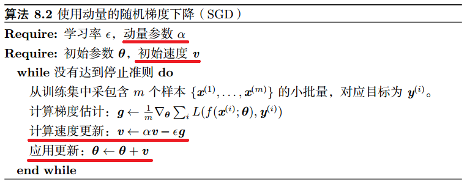

从形式上看， 动量算法引入了变量 v 充当速度角色——它代表参数在参数空间移动的方向和速率。速度被设为负梯度的指数衰减平均。

之前，步长只是梯度范数乘以学习率。现在，步长取决于梯度序列的大小和排列。当许多连续的梯度指向相同的方向时，步长最大。如果动量算法总是观测到梯度 g，那么它会在方向 −g 上不停加速，直到达到最终速度，其中步长大小为

[](http://www.codecogs.com/eqnedit.php?latex=\frac{\epsilon\left\|g\right\|}{1-\alpha})

在实践中，α 的一般取值为 0.5, 0.9 和 0.99，分别对应**最大速度** 2倍，10倍和100倍于普通的 SGD 算法。和学习率一样， α 也应该随着时间不断调整（变大），但没有收缩 ϵ 重要。

**为什么要加入动量？**

加入的动量主要目的是解决两个问题： Hessian 矩阵的**病态**条件和**随机梯度的方差**。简单来说，就是为了加速学习。

虽然动量的加入有助于缓解这些问题，但其代价是引入了另一个超参数。
> [29. 自适应学习率算法: AdaGrad，RMSProp，Adam 等***](#29-自适应学习率算法-adagradrmspropadam-等)

带有动量的 SGD（左/上） 和不带动量的 SGD（右/下）：


> 《深度学习》 4.3.1 梯度之上： Jacobian 和 Hessian 矩阵

此图说明动量如何克服病态的问题：等高线描绘了一个二次损失函数（具有病态条件的 Hessian 矩阵）。一个病态条件的二次目标函数看起来像一个长而窄的山谷或具有陡峭边的峡谷。带动量的 SGD 能比较正确地纵向穿过峡谷；而普通的梯度步骤则会浪费时间在峡谷的窄轴上来回移动，因为梯度下降无法利用包含在 Hessian 矩阵中的曲率信息。

**Nesterov 动量**

受 Nesterov 加速梯度算法 (Nesterov, 1983, 2004) 启发， Sutskever et al. (2013) 提出了动量算法的一个变种。其更新规则如下：


其中参数 α 和 ϵ 发挥了和标准动量方法中类似的作用。Nesterov 动量和标准动量之间的**区别体现在梯度计算**上。下面是完整的 Nesterov 动量算法：

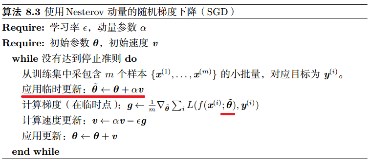

Nesterov 动量中，梯度计算在施加当前速度之后。因此，Nesterov 动量可以解释为往标准动量方法中添加了一个校正因子。

在凸批量梯度的情况下， Nesterov 动量将额外误差收敛率从 O(1/k) 改进到 O(1/k^2)。可惜，在随机梯度的情况下， Nesterov 动量没有改进收敛率。


# 自适应学习率算法：AdaGrad、RMSProp、Adam 等***
> 《深度学习》 8.5 自适应学习率算法

Delta-bar-delta (Jacobs, 1988) 是一个早期的自适应学习率算法。该方法基于一个很简单的想法，如果损失对于某个给定模型参数的偏导保持相同的符号，那么学习率应该增加。如果对于该参数的偏导变化了符号，那么学习率应减小。当然，这种方法只能应用于全批量优化中（？）。

最近，提出了一些增量（或者基于小批量）的算法来自适应模型参数的学习率。

## AdaGrad


AdaGrad 会独立地适应所有模型参数的学习率。具体来说，就是缩放每个参数反比于其所有梯度历史平方值总和的平方根 (Duchi et al., 2011)。效果上具有损失最大偏导的参数相应地有一个快速下降的学习率，而具有小偏导的参数在学习率上有相对较小的下降。

**不过**，对于训练深度神经网络模型而言，**从训练开始时**就积累梯度平方会导致有效学习率过早和过量的减小。AdaGrad 在某些深度学习模型上效果不错，但不是全部。

## RMSProp


RMSProp 修改自 AdaGrad。AdaGrad 旨在应用于**凸问题**时快速收敛，而 RMSProp 在**非凸**设定下效果更好，改变梯度积累为指数加权的移动平均。

RMSProp 使用指数衰减平均以丢弃遥远过去的历史，使其能够在找到凸碗状结构后快速收敛，它就像一个初始化于该碗状结构的 AdaGrad 算法实例。

相比于 AdaGrad，使用移动平均引入了一个**新的超参数 ρ**，用来控制移动平均的长度范围。

经验上， RMSProp 已被证明是一种有效且实用的深度神经网络优化算法。目前它是深度学习从业者经常采用的优化方法之一。

**结合 Nesterov 动量的 RMSProp**

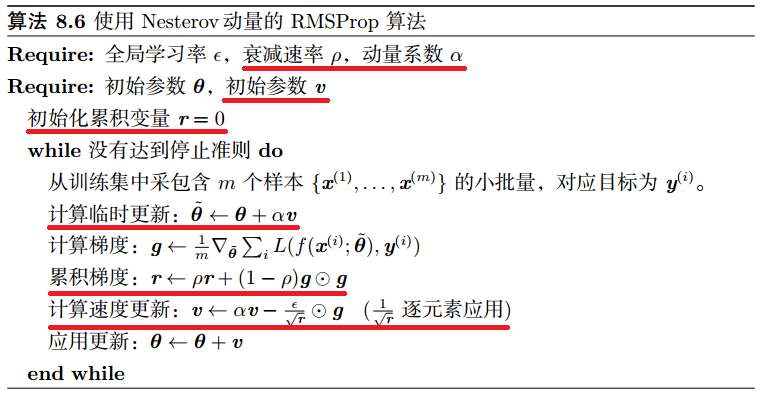

## Adam


Adam (Kingma and Ba, 2014) 是另一种学习率自适应的优化算法。

首先，在 Adam 中，动量直接并入了梯度一阶矩（指数加权）的估计。将动量加入 RMSProp 最直观的方法是将动量应用于缩放后的梯度。但是结合缩放的动量使用没有明确的理论动机。其次， Adam 包括偏置修正，修正从原点初始化的一阶矩（动量项）和（非中心的）二阶矩的估计。RMSProp 也采用了（非中心的）二阶矩估计，然而缺失了修正因子。因此，不像 Adam， RMSProp 二阶矩估计可能在训练初期有很高的偏置。Adam 通常被认为对超参数的选择相当鲁棒，尽管学习率有时需要从建议的默认修改。

**如何选择自适应学习率算法？**

目前在这一点上没有明确的共识。选择哪一个算法似乎主要取决于使用者对算法的熟悉程度（以便调节超参数）。

如果不知道选哪个，就用 AdamSGD 吧。


# 基于二阶梯度的优化方法：牛顿法、共轭梯度、BFGS 等的做法*
> 《深度学习》 8.6 二阶近似方法：8.6.1 牛顿法，8.6.2 共轭梯度，8.6.3 BFGS

推导很难实际上也很少用，如果你不是数学系的，可以跳过这部分。


# 批标准化（Batch Normalization）的意义**
> 《深度学习》 8.7.1 批标准化

批标准化（Batch Normalization, BN, Ioffe and Szegedy, 2015）是为了克服神经网络**层数加深导致难以训练**而出现的一个算法。

说到底，BN 还是为了解决**梯度消失/梯度爆炸**问题，特别是梯度消失。

**BN 算法**：


BN 算法需要学习两个参数 γ 和 β.
> Ioffe and Szegedy, 2015, Batch Normalization: Accelerating Deep Network Training by Reducing Internal Covariate Shift

**批标准化为什么有用？**
> [深度学习（二十九）Batch Normalization 学习笔记](https://blog.csdn.net/hjimce/article/details/50866313) - CSDN博客
>
> [深度学习中 Batch Normalization为什么效果好？](https://www.zhihu.com/question/38102762/answer/85238569) - 知乎 


# 神经网络中的卷积，以及卷积的动机：稀疏连接、参数共享、等变表示（平移不变性）***
> 《深度学习》 9.2 动机

注意：本书所谈的卷积，是包括卷积层、激活层和池化层的统称

**神经网络中的卷积**：

当我们在神经网络中提到卷积时，通常是指由**多个并行卷积**组成的运算。一般而言，每个核只用于提取一种类型的特征，尽管它作用在多个空间位置上。而我们通常希望网络的每一层能够在多个位置提取多种类型的特征。

> 《深度学习》 9.5 基本卷积函数的变体

卷积的一些基本概念：通道（channel）、卷积核（kernel、filter）、步幅（stride，下采样）、填充（padding）
> [33. 卷积中零填充的影响，基本卷积的变体](#33-卷积中零填充的影响基本卷积的变体)

**为什么使用卷积？（卷积的动机）**

卷积运算通过三个重要的思想来帮助改进机器学习系统：**稀疏交互**（sparseinteractions）、**参数共享**（parameter sharing）、**等变表示**（equivariant representations）。

## 稀疏连接（sparse connectivity）

稀疏连接，也称稀疏交互、稀疏权重。

传统的神经网络中每一个输出单元会与每一个输入单元都产生交互。卷积网络改进了这一点，使具有稀疏交互的特征。CNN 通过使核（kernel、filter）的大小远小于输入的大小来达到的这个目的。


举个例子，当处理一张图像时，输入的图像可能包含成千上万个像素点，但是我们可以通过只占用几十到上百个像素点的核来**检测一些小的、有意义的特征**，例如图像的边缘。

**稀疏交互的好处**：
- 提高了模型的统计效率：原本一幅图像只能提供少量特征，现在每一块像素区域都可以提供一部分特征
- 减少了模型的存储需求和计算量，因为参数更少

如果有 m 个输入和 n 个输出，那么矩阵乘法需要 `m × n` 个参数并且相应算法的时间复杂度为 `O(m × n)`；如果限制每一个输出拥有的连接数为 k，那么稀疏的连接方法只需要 `k × n` 个参数以及 `O(k × n)` 的运行时间。而在实际应用中，**k 要比 m 小几个数量级**。

虽然看似减少了隐藏单元之间的交互，但实际上处在深层的单元可以间接地连接到全部或者大部分输入。


## 参数共享（parameter sharing）

参数共享是指在一个模型的多个函数中使用相同的参数。作为参数共享的同义词，我们可以说
一个网络含有**绑定的权重**（tied weights）

在传统的神经网络中，当计算一层的输出时，权重矩阵的每一个元素只使用一次，当它乘以输入的一个元素后就再也不会用到了。卷积运算中的参数共享保证了我们只需要学习一个参数集合，而不是对于每一位置都需要学习一个单独的参数集合。

考虑一个具体的例子——**边缘检测**——来体会稀疏连接+参数共享带来的效率提升：

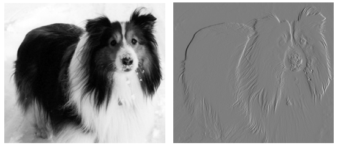

两个图像的高度均为 280 个像素。输入图像的宽度为 320 个像素，而输出图像的宽度为 319 个像素（padding='VALID'）。对于边缘检测任务而言，只需要一个包含**两个元素的卷积核**就能完成；而为了用矩阵乘法描述相同的变换，需要一个包含 320 × 280 × 319 × 280 ≈ 80亿个元素的矩阵（40亿倍）。

同样，使用卷积只需要 319 × 280 × 3 = 267,960 次浮点运算（每个输出像素需要两次乘法和一次加法）；而直接运行矩阵乘法的算法将执行超过 160 亿次浮点运算（60000倍）

## 平移等变|不变性（translation invariant）

（局部）平移不变性是一个很有用的性质，尤其是当我们关心某个特征**是否出现**而不关心它出现的具体位置时。

**参数共享**（和池化）使卷积神经网络具有一定的**平移不变性**。这就意味着即使图像经历了一个小的平移，依然会产生相同的特征。例如，分类一个 MNIST 数据集的数字，对它进行任意方向的**平移**（不是旋转），无论最终的位置在哪里，都能正确分类。
> 池化操作也能够帮助加强网络的平移不变性 > [35. 池化、池化（Pooling）的作用***](#35-池化池化pooling的作用)

**什么是等变性？**
- 如果一个函数满足**输入改变，输出也以同样的方式改变**这一性质，我们就说它是等变 (equivariant) 的。
- 对于卷积来说，如果令 g 是输入的任意平移函数，那么卷积函数对于 g 具有等变性。

当处理**时间序列数据**时，这意味着通过卷积可以得到一个由输入中出现不同特征的时刻所组成的时间轴。如果我们把输入中的一个事件向后延时，在输出中仍然会有完全相同的表示，只是时间延后了。

图像与之类似，卷积产生了一个 2 维映射来表明某些特征在输入中出现的位置。如果我们移动输入中的对象，它的表示也会在输出中移动同样的量。

卷积对其他的一些变换并不是天然等变的，例如对于图像的**放缩**或者**旋转**变换，需要其他的一些机制来处理这些变换。

> [池化的不变性](http://ufldl.stanford.edu/wiki/index.php/%E6%B1%A0%E5%8C%96#.E6.B1.A0.E5.8C.96.E7.9A.84.E4.B8.8D.E5.8F.98.E6.80.A7) - Ufldl 


# 卷积中不同零填充的影响**
> 《深度学习》 9.5 基本卷积函数的变体

在任何卷积网络的实现中都有一个重要性质，那就是能够隐含地**对输入用零进行填充**使得它加宽。如果没有这个性质，会极大得限制网络的表示能力。

三种零填充设定，其中 `m` 和 `k` 分别为图像的宽度和卷积核的宽度（高度类似）：
1. 有效（valid）卷积——不使用零填充，卷积核只允许访问那些图像中能够**完全包含整个核**的位置，输出的宽度为 `m − k + 1`.
    - 在这种情况下，输出的所有像素都是输入中相同数量像素的函数，这使得输出像素的表示更加规范。
    - 然而，输出的大小在每一层都会缩减，这限制了网络中能够包含的卷积层的层数。（一般情况下，影响不大，除非是上百层的网络）
2. 相同（same）卷积——只进行足够的零填充来**保持输出和输入具有相同的大小**，即输出的宽度为 `m`.
    - 在这种情况下，只要硬件支持，网络就能包含任意多的卷积层。
    - 然而，输入像素中靠近边界的部分相比于中间部分对于输出像素的影响更小。这可能会导致边界像素存在一定程度的欠表示。
3. 全（full）卷积——进行足够多的零填充使得每个像素都能被访问 k 次（非全卷积只有中间的像素能被访问 k 次），最终输出图像的宽度为 `m + k − 1`.
    - 因为 same 卷积可能导致边界像素欠表示，从而出现了 Full 卷积；
    - 但是在这种情况下，输出像素中靠近边界的部分相比于中间部分是更少像素的函数。这将导致学得的卷积核不能再所有所有位置表现一致。
    - 事实上，很少使用 Full 卷积
    > 注意：如果以“全卷积”作为关键词搜索，返回的是一个称为 FCN（Fully Convolutional Networks）的卷积结构，而不是这里描述的填充方式。

通常**零填充的最优数量**（对于测试集的分类正确率）处于 “有效卷积”和 “相同卷积” 之间。


# 基本卷积的变体：反卷积、空洞卷积***

原书中也描述一些基本卷积的变体：局部卷积、平铺卷积；


> 从上到下一次为局部卷积、平铺卷积和标准卷积；
>
> 《深度学习》 9.5 基本卷积函数的变体

不过这跟我想的“变体”不太一样（百度都搜不到这两种卷积），下面介绍的是一些我认识中比较流行的卷积变体：

## 转置卷积|反卷积（Transposed convolution）


> No padding, no strides, transposed

> [如何理解深度学习中的deconvolution networks？](https://www.zhihu.com/question/43609045) - 知乎 

## 空洞卷积|扩张卷积（Dilated convolution）


> No padding, no stride, dilation

> [如何理解空洞卷积（dilated convolution）？](https://www.zhihu.com/question/54149221) - 知乎 

> 卷积、转置卷积、空洞卷积动图演示：vdumoulin/[conv_arithmetic](https://github.com/vdumoulin/conv_arithmetic): A technical report on convolution arithmetic in the context of deep learning 


# 池化、池化（Pooling）的作用***
> 《深度学习》 9.3 池化

一次典型的卷积包含三层：第一层并行地计算多个卷积产生一组线性激活响应；第二层中每一个线性激活响应将会通过一个非线性的激活函数；第三层使用**池化函数**（pooling function）来进一步调整这一层的输出。

```
# Keras
from keras.layers import Input, Conv2D, Activation, MaxPooling2D

net = Input([in_w, in_h, input_dim])
net = Conv2D(output_dim, kernel_size=(3, 3))(net)
net = Activation('relu')(net)
net = MaxPooling2D(pool_size=(2, 2))(net)
"""
卷积层中，一般 strides=1, padding='valid'
池化层中，一般 strides=pool_size, padding='valid'
"""
```

池化函数使用某一位置的相邻输出的**总体统计特征**来代替网络在该位置的输出。

常见的池化函数：
- *最大池化（Max pooling）
- *平均值池化（Mean pooling）
- L2 范数
- 基于中心像素距离的加权平均

池化操作有助于卷积网络的平移不变性
> [32.3. 平移等变/不变性（translation invariant）](#323-平移等变不变性translation-invariant)

**使用池化可以看作是增加了一个无限强的先验**：这一层学得的函数必须具有对少量平移的不变性。当这个假设成立时，池化可以极大地提高网络的统计效率。

（最大）池化对平移是天然不变的，但池化也能用于学习其他不变性：


这三个过滤器都旨在检测手写的数字 5。每个过滤器尝试匹配稍微**不同方向**的 5。当输入中出现 5 时，无论哪个探测单元被激活，最大池化单元都将产生较大的响应。

这种多通道方法只在学习其他变换时是必要的。这个原则在 maxout 网络 (Goodfellow et al., 2013b) 和其他卷积网络中更有影响。

池化综合了区域内的 k 个像素的统计特征而不是单个像素，这种方法提高了网络的计算效率，因为下一层少了约 k 倍的输入。

在很多任务中，池化还有助于对于处理不同大小的输入：例如我们想对不同大小的图像进行分类时，分类层的输入必须是固定的大小，而这通常通过调整池化区域的偏置大小来实现。

其他参考：
- 一些理论工作对于在不同情况下应当使用哪种池化函数给出了一些指导 (Boureau et al., 2010)
- 将特征一起动态地池化：对于感兴趣特征的位置运行聚类算法 (Boureau et al., 2011)、先学习一个单独的池化结构，再应用到全部的图像中 (Jia et al., 2012)
- 《深度学习》 20.6 卷积玻尔兹曼机、20.10.6 卷积生成网络


# 卷积与池化的意义、影响（作为一种无限强的先验）**
> 《深度学习》 9.4 卷积与池化作为一种无限强的先验

一个无限强的先验需要对一些参数的概率置零并且完全禁止对这些参数赋值，无论数据对于这些参数的值给出了多大的支持。

如果把卷积网络类比成全连接网络，那么对于这个全连接网络的权重有一个无限强的先验：隐藏单元的权重必须和它邻居的权重相同，但可以在空间上移动；同时要求除了那些处在“感受野”内的权重以外，其余的权重都为零。

类似的，使用**池化**也是一个无限强的先验：每一个单元都具有对少量平移的不变性。

**卷积与池化作为一种无限强先验的影响**：
1. 卷积和池化可能导致**欠拟合**
    - 与任何其他先验类似，卷积和池化只有当先验的假设合理且正确时才有用。
    - 如果一项任务涉及到要**对输入中相隔较远的信息进行合并**时，那么卷积所利用的先验可能就不正确了。
    - 如果一项任务依赖于保存**精确的空间信息**，那么在所有的特征上使用池化将会增大训练误差。
    > 因此，一些卷积网络结构 (Szegedy et al., 2014a) 为了既获得具有较高不变性的特征又获得当平移不变性不合理时不会导致欠拟合的特征，被设计成在一些通道上使用池化而在另一些通道上不使用。
2. 当我们比较卷积模型的统计学习表现时，只能以基准中的其他卷积模型作为比较的对象

> 《深度学习》 5.6 贝叶斯统计（先验概率分布）


# RNN 的几种基本设计模式
> 《深度学习》 10.2 循环神经网络

循环神经网络中一些重要的设计模式包括以下几种：
1. （*）每个时间步都有输出，并且隐藏单元之间有循环连接的循环网络

    

    - 将 x 值的输入序列映射到输出值 o 的对应序列
    - 损失 L 衡量每个 o 与相应的训练目标 y 的距离
    - 损失 L 内部计算 y^ = softmax(o)，并将其与目标 y 比较
    - 输入 x 到隐藏 h 的连接由权重矩阵 U 参数化
    - 隐藏 h(t-1) 到隐藏 h(t) 的循环连接由权重矩阵 W 参数化
    - 隐藏到输出的连接由权重矩阵 V 参数化

2. 每个时间步都产生一个输出，只有当前时刻的输出到下个时刻的隐藏单元之间有循环连接的循环网络

    

    - 此类 RNN 的唯一循环是从输出 o 到隐藏层 h 的反馈连接
    - 表示能力弱于 RNN_1，单更容易训练

3. 隐藏单元之间存在循环连接，但读取整个序列后产生单个输出的循环网络

    

    这样的网络可以用于概括序列并产生用于进一步处理的固定大小的表示

一般所说的 RNN（循环神经网络）指的是**第一种**设计模式

这些循环网络都将一个输入序列映射到**相同长度**的输出序列

# RNN 更新方程（前向传播公式），包括 LSTM、GRU 等***
> 《深度学习》 10 序列建模：循环和递归网络
>
> [RNN, LSTM, GRU 公式总结](https://blog.csdn.net/zhangxb35/article/details/70060295) - CSDN博客 

**基本 RNN**
> [Recurrent neural network](https://en.wikipedia.org/wiki/Recurrent_neural_network#Elman_networks_and_Jordan_networks) - Wikipedia 

根据隐层 h(t) 接受的是上时刻的隐层 h(t−1) 还是上时刻的输出 y(t−1)，分为两种 RNN：
- Elman RNN

    [](http://www.codecogs.com/eqnedit.php?latex=\begin{aligned}&space;h^{(t)}&=\tanh\left(&space;W_hx^{(t)}&plus;U_hh^{(t-1)}&plus;b_h&space;\right)\\&space;y^{(t)}&={\rm&space;softmax}\left(&space;W_yh^{(t)}&plus;b_y&space;\right)\\&space;\end{aligned})

- Jordan RNN

    [](http://www.codecogs.com/eqnedit.php?latex={\displaystyle&space;{\begin{aligned}&space;h^{(t)}&=\tanh\left(&space;W_hx^{(t)}&plus;U_hy^{(t-1)}&plus;b_h&space;\right)\\&space;y^{(t)}&={\rm&space;softmax}\left(&space;W_yh^{(t)}&plus;b_y&space;\right)\&space;\end{aligned}}})

> 《深度学习》 默认的 RNN 是 Elman RNN > [37. RNN（循环神经网络） 的几种基本设计模式**](#37-rnn循环神经网络-的几种基本设计模式)

**门限 RNN**（LSTM、GRU）与基本 RNN 的主要区别在于 Cell 部分

**LSTM**
> [Long short-term memory](https://en.wikipedia.org/wiki/Long_short-term_memory#Variants) - Wikipedia

[](http://www.codecogs.com/eqnedit.php?latex={\displaystyle&space;{\begin{aligned}&space;f_{t}&=\sigma(W_{f}x_{t}&plus;U_{f}h_{t-1}&plus;b_{f})\\&space;i_{t}&=\sigma(W_{i}x_{t}&plus;U_{i}h_{t-1}&plus;b_{i})\\&space;\tilde{c}_{t}&=\tanh(W_{c}x_{t}&plus;U_{c}h_{t-1}&plus;b_{c})\\&space;c_{t}&=f_{t}\circ&space;c_{t-1}&plus;i_{t}\circ&space;\tilde{c}_{t}\\&space;o_{t}&=\sigma(W_{o}x_{t}&plus;U_{o}h_{t-1}&plus;b_{o})\\&space;h_{t}&=o_{t}\circ&space;\tanh(c_{t})&space;\end{aligned}}})

- 其中 f 为遗忘门（forget），i 为输入门（input），o 为输出门（output）。
- 每个门的输入都是 x 和 h，但是参数都是独立的（参数数量是基本 RNN 的 4 倍）
- c 表示 cell state（如果用过 tensorflow 中的 RNN，会比较熟悉）
- 如果遗忘门 f 取 0 的话，那么上一时刻的状态就会全部被清空，只关注此时刻的输入
- 输入门 i 决定是否接收此时刻的输入
- 输出门 o 决定是否输出 cell state

类似基本 RNN，LSTM 也有另一个版本，将公式中所有 h(t-1) 替换为 c(t-1)，但不常见

**GRU**
> [Gated recurrent unit](https://en.wikipedia.org/wiki/Gated_recurrent_unit#Architecture) - Wikipedia 

[](http://www.codecogs.com/eqnedit.php?latex={\displaystyle&space;{\begin{aligned}&space;z_{t}&=\sigma(W_{z}x_{t}&plus;U_{z}h_{t-1}&plus;b_{z})\\&space;r_{t}&=\sigma(W_{r}x_{t}&plus;U_{r}h_{t-1}&plus;b_{r})\\&space;\tilde{h}_t&=\tanh(W_{h}x_{t}&plus;U_{h}(r_{t}\circ&space;h_{t-1})&plus;b_{h})\\&space;h_{t}&=(1-z_{t})\circ&space;h_{t-1}&plus;z_{t}\circ&space;\tilde{h}_t&space;\end{aligned}}})

- 其中 z 为更新门（update），r 为重置门（reset）
- GRU 可以看作是将 LSTM 中的遗忘门和输入门合二为一了

# BPTT（back-propagation through time，通过时间反向传播）**
> 《深度学习》 10.2.2 计算循环神经网络的梯度


# 自编码器在深度学习中的意义*

**自编码器的意义**：
- 传统自编码器被用于降维或特征学习
- 近年来，自编码器与潜变量模型理论的联系将自编码器带到了生成式建模的前沿
    - 几乎任何带有潜变量并配有一个推断过程（计算给定输入的潜在表示）的生成模型，都可以看作是自编码器的一种特殊形式。
    > 《深度学习》 20 深度生成模型，20.10.3 变分自编码器，20.12 生成随机网络

**自编码器的一般结构**


- 自编码器有两个组件：**编码器** f（将 x 映射到 h）和**解码器** g（将 h 映射到 r）
- 一个简单的自编码器试图学习 `g(f(x)) = x`；换言之，自编码器尝试将输入复制到输出
- 单纯将输入复制到输出没什么用，相反，训练自编码器的目标是获得有用的特征 h。

自编码器的学习过程就是最小化一个损失函数：

[](http://www.codecogs.com/eqnedit.php?latex=L(\boldsymbol{x},g(f(\boldsymbol{x}))))


# 自编码器一些常见的变形与应用：正则自编码器、稀疏自编码器、去噪自编码器*
> [40. 自编码器在深度学习中的意义](#40-自编码器在深度学习中的意义)
>
> 《深度学习》 14.2 正则自编码器

**欠完备自编码器**
- 从自编码器获得有用特征的一种方法是**限制 h 的维度比 x 小**，这种编码维度小于输入维度的自编码器称为**欠完备**（undercomplete）自编码器；
- 相反，如果 h 的维度大于 x，此时称为过完备自编码器。
- **学习欠完备的表示将强制自编码器捕捉训练数据中最显著的特征**
- 当解码器是线性的且 L 是均方误差，欠完备的自编码器会学习出与 PCA 相同的生成子空间
- 而拥有**非线性**编码器函数 f 和**非线性**解码器函数 g 的自编码器能够学习出更强大的 PCA 非线性推广
- 但如果编码器和解码器被赋予**过大的容量**，自编码器会执行复制任务而捕捉不到任何有关**数据分布**的有用信息。
    - 过完备自编码器就可以看作是被赋予过大容量的情况
 
**正则自编码器**
- 通过加入正则项到损失函数可以限制模型的容量，同时鼓励模型学习除了复制外的其他特性。
- 这些特性包括稀疏表示、表示的小导数、以及对噪声或输入缺失的鲁棒性。
- 即使模型的容量依然大到足以学习一个无意义的恒等函数，正则自编码器仍然能够从数据中学到一些关于数据分布的信息。

**稀疏自编码器**
- 稀疏自编码器一般用来学习特征
- 稀疏自编码器简单地在训练时结合编码层的**稀疏惩罚** Ω(h) 和重构误差：

    [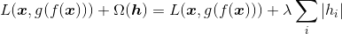](http://www.codecogs.com/eqnedit.php?latex=L(\boldsymbol{x},g(f(\boldsymbol{x})))&plus;\Omega(\boldsymbol{h})&space;=&space;L(\boldsymbol{x},g(f(\boldsymbol{x})))&plus;\lambda\sum_i\left|h_i\right|)

- 稀疏惩罚不算是一个正则项。这仅仅影响模型关于潜变量的分布。这个观点提供了训练自编码器的另一个动机：这是近似训练生成模型的一种途径。这也给出了为什么自编码器学到的特征是有用的另一个解释：它们描述的潜变量可以解释输入。
    > 《深度学习》 14.2.1 稀疏自编码器

**去噪自编码器（DAE）**
- 去噪自编码器试图学习**更具鲁棒性的**特征
- 与传统自编码器不同，去噪自编码器（denoising autoencoder, DAE）最小化：

    [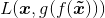](http://www.codecogs.com/eqnedit.php?latex=L(\boldsymbol{x},g(f(\boldsymbol{\tilde{x}}))))

- 这里的 x~ 是**被某种噪声损坏**的 x 的副本，去噪自编码器需要预测原始未被损坏数据
- 破坏的过程一般是以某种概率分布（通常是二项分布）将一些值置 0.

    
    > 《深度学习》 14.2.2 去噪自编码器，14.5 去噪自编码器

**为什么DAE有用？**
- 对比使用非破损数据进行训练，破损数据训练出来的权重噪声比较小——在破坏数据的过程中去除了真正的噪声
- 破损数据一定程度上减轻了训练数据与测试数据的代沟——使训练数据更接近测试数据
    > [降噪自动编码器（Denoising Autoencoder)](https://www.cnblogs.com/neopenx/p/4370350.html) - Physcal - 博客园
    >> 感觉这两个理由很牵强，但是从数据分布的角度讲太难了


# 半监督的思想以及在深度学习中的应用*
> 《深度学习》 15.3 半监督解释因果关系


# 分布式表示的概念、应用，与符号表示（one-hot 表示）的区别***
> 《深度学习》 15.4 分布式表示

## 什么是分布式表示？
- 所谓分布式表示就是用不同的特征，通过**组合**来表示不同的概念

    
    

    （左）是 one-hot 表示（一种稀疏表示），（右）为分布式表示
    > [神经网络如何学习分布式表示](http://baijiahao.baidu.com/s?id=1593632865778730392) - 百家号

## 分布式表示为什么强大？——分布式表示与符号表示

分布式表示之所以强大，是因为它能用具有 `d` 个值的 `n` 个**线性阀值特征**去描述 `d^n` 个不同的概念——换言之，在输入维度是 d 的一般情况下，具有 n 个特征的分布式表示可以给 O(n^d) 个不同区域分配唯一的编码
> **线性阀值特征**：本身是一个**连续值**，通过划分阈值空间来获得对应的离散特征

**符号表示**
- 如果我们没有对数据做任何假设，并且每个区域使用唯一的符号来表示，每个符号使用单独的参数去识别空间中的对应区域，那么指定 `O(n^d)` 个区域需要 `O(n^d)` 个样本/参数。

- 举个例子：作为纯符号，“猫”和“狗”之间的距离和任意其他两种符号的距离是一样。

  然而，如果将它们与**有意义的分布式表示**相关联，那么关于猫的很多特点可以推广到狗，反之亦然——比如，某个分布式表示可能会包含诸如“具有皮毛”或“腿的数目”这类在猫和的**嵌入/向量**上具有相同值的项

**分布式表示与符号表示**（最近邻）：


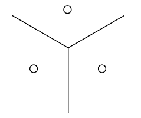

- 两者都在学习如何将输入空间分割成多个区域
- 在输入维度相同的情况下，分布式表示能够比非分布式表示多分配指数级的区域——这一特性可用于解决**维度灾难**问题
    > [44. 如何理解维数灾难？](#44-如何理解维数灾难)

**非线性特征**：

上面假设了**线性阀值特征**，然而更一般的，分布式表示的优势还体现在其中的每个特征可以用非线性算法——**神经网络**——来提取。简单来说，表示能力又提升了一个级别。

一般来说，无论我们使用什么算法，需要学习的空间区域数量是固定的；但是使用分布式表示有效的减少了参数的数量——从 `O(n^d)` 到 `O(nd)`——这意味着我们需要拟合参数更少，因此只需要更少的训练样本就能获得良好的泛化。

**一些非分布式表示算法**：
- 聚类算法，比如 k-means 算法
- k-最近邻算法
- 决策树
- 支持向量机
- 基于 n-gram 的语言模型

**什么时候应该使用分布式表示能带来统计优势？**
当一个明显复杂的结构可以**用较少参数紧致地表示**时，使用分布式表示就会具有统计上的优势（避免维数灾难）。
> [44. 如何理解维数灾难？](#44-如何理解维数灾难)

一些传统的非分布式学习算法仅仅在**平滑先验**的情况下能够泛化。


# 如何理解维数灾难？***
> 《深度学习》 5.11.1 维数灾难

概括来说，就是当数据维数很高时，会导致学习变得困难。

这里的“困难”体现在两方面：
1. 当数据较多时，会使训练的周期变得更长
2. 当数据较少时，对新数据的泛化能力会更弱，甚至失去泛化能力
> 这两点对于任何机器学习算法都是成立的；但在维数灾难的背景下，会加剧这两个影响

对于第二点，书中使用了另一种描述：“由维数灾难带来的一个问题是统计挑战，所谓统计挑战指的是 **x 的可能配置数目远大于训练样本的数目**”。

为了充分理解这个问题，我们假设输入空间如图所示被分成单元格。


- 当数据的维度增大时（从左向右），我们感兴趣的配置数目会随指数级增长。
- 当空间是低维时，我们可以用由少量单元格去描述这个空间。泛化到新数据点时，通过检测和单元格中的训练样本的相似度，我们可以判断如何处理新数据点。
- 当空间的维数很大时，很可能发生大量单元格中没有训练样本的情况。此时，基于“**平滑先验**”的简单算法将无力处理这些新的数据。
    > [7. 局部不变性（平滑先验）及其在基于梯度的学习上的局限性*](#7-局部不变性平滑先验及其在基于梯度的学习上的局限性)
- 更一般的，O(nd) 个参数（d 个特征，每个特征有 n 种表示）能够明确表示输入空间中 O(n^d) 个不同区域。如果我们没有对数据做任何假设，并且**每个区域使用唯一的符号来表示**，每个符号使用单独的参数去识别空间中的对应区域，那么指定 O(n^d) 个区域将需要 O(n^d) 个样本。
    > 《深度学习》 15.4 分布式表示

**如何解决维数灾难？**
> [43.3. 什么时候应该使用分布式表示能带来统计优势？](#433-什么时候应该使用分布式表示能带来统计优势)


# 迁移学习相关概念：多任务学习、一次学习、零次学习、多模态学习**
> 《深度学习》 15.2 迁移学习和领域自适应

**什么是迁移学习？**
- 迁移学习和领域自适应指的是利用一个任务（例如，分布 P1）中已经学到的内容去改善另一个任务（比如分布 P2）中的泛化情况。
    - 例如，我们可能在第一个任务中学习了一组视觉类别，比如猫和狗，然后在第二种情景中学习一组不同的视觉类别，比如蚂蚁和黄蜂。
- 除了共享**输出语义**（上面这个例子），有时也会共享**输出语义**
    - 例如，语音识别系统需要**在输出层产生有效的句子**，但是输入附近的较低层可能需要识别相同音素或子音素发音的不同版本（这取决于说话人）

**迁移学习与多任务学习**
- 因为目前迁移学习更流行，因此不少博客简介上，会将多任务学习归属于迁移学习的子类或者迁移学习的相关领域。

- 迁移学习与多任务学习的一些结构：

    
    
    > （左）> 《深度学习》 15.2 迁移学习和领域自适应；（右）> 《深度学习》 7.7 多任务学习

- 这两种都可能是迁移学习或者多任务学习的结构。~~迁移学习的输入在每个任务上具有不同的意义（甚至不同的维度），但是输出在所有的任务上具有**相同的语义**；多任务学习则相反~~

**迁移学习与领域自适应**
- 相比于迁移学习和多任务学习，领域自适应的提法比较少，也更简单一些，其在每个情景之间任务（和最优的输入到输出的映射）都是相同的，但是**输入分布**稍有不同。
- 例如，考虑情感分析的任务：网上的评论有许多类别。在书、视频和音乐等媒体内容上训练的顾客评论情感预测器，被用于分析诸如电视机或智能电话的消费电子产品的评论时，领域自适应情景可能会出现。可以想象，存在一个潜在的函数可以判断任何语句是正面的、中性的还是负面的，但是词汇和风格可能会因领域而有差异

**one-shot learning 和 zero-shot learning**
- 迁移学习的两种极端形式是**一次学习**（one-shot learning）和**零次学习**（zero-shot learning）
    - 只有少量标注样本的迁移任务被称为 one-shot learning；没有标注样本的迁移任务被称为 zero-shot learning.
- **one-shot learning**
    - one-shot learning 稍微简单一点：在大数据上学习 general knowledge，然后在特定任务的小数据上有技巧的 fine tuning。
- **zero-shot learning**
    - 相比 one-shot，zero-shot learning 要更复杂。
    - 先来看一个 zero-shot 的例子：假设学习器已经学会了关于动物、腿和耳朵的概念。如果已知猫有四条腿和尖尖的耳朵，那么学习器可以在没有见过猫的情况下猜测该图像中的动物是猫。
    - (TODO)

**多模态学习（multi-modal learning）**
- 与 zero-shot learning 相同的原理可以解释如何能执行**多模态学习**（multimodal learning）

    

    > 《深度学习》 15.2 迁移学习和领域自适应 图 15.3


# 图模型|结构化概率模型相关概念*
> 《深度学习》 16 深度学习中的结构化概率模型
>
> 答案不完整，更多相关概念请阅读本章

**有向图模型**
- 有向图模型（directed graphical model）是一种结构化概率模型，也被称为**信念网络**（belief network）或者**贝叶斯网络**（Bayesian network）
- 描述接力赛例子的有向图模型

    
    - Alice 在 Bob 之前开始，所以 Alice 的完成时间 t0 影响了 Bob 的完成时间 t1。
    - Carol 只会在 Bob 完成之后才开始，所以 Bob 的完成时间 t1 直接影响了 Carol 的完成时间 t2。

- 正式地说，变量 x 的有向概率模型是通过有向无环图 G（每个结点都是模型中的随机变量）和一系列**局部条件概率分布**（local conditional probability distribution）来定义的，x 的概率分布可以表示为：

    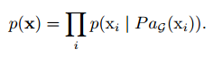
    - 其中 大P 表示结点 xi 的所有父结点

- 上述接力赛例子的概率分布可表示为：

    

**无向图模型**
- 无向图模型（undirected graphical Model），也被称为**马尔可夫随机场**（Markov random field, MRF）或者是**马尔可夫网络**（Markov network）
- 当相互的作用并没有本质性的指向，或者是明确的双向相互作用时，使用无向模型更加合适。

**图模型的优点**
1. 减少参数的规模
    - 通常意义上说，对每个变量都能取 k 个值的 n 个变量建模，**基于查表的**方法需要的复杂度是 `O(k^n)`，如果 m 代表图模型的单个条件概率分布中最大的变量数目，那么对这个有向模型建表的复杂度大致为 `O(k^m)`。只要我们在设计模型时使其满足 `m ≪ n`，那么复杂度就会被大大地减小；换一句话说，只要图中的每个变量都只有少量的父结点，那么这个分布就可以用较少的参数来表示。
1. 统计的高效性
    - 相比图模型，**基于查表的**模型拥有天文数字级别的参数，为了准确地拟合，相应的训练集的大小也是相同级别的。
1. 减少运行时间
    - 推断的开销：计算分布时，避免对整个表的操作，比如求和
    - 采样的开销：类似推断，避免读取整个表格
    > 《深度学习》 16.3 从图模型中采样

**图模型如何用于深度学习**
- 受限玻尔兹曼机（RBM）
    - RBM 是图模型如何用于深度学习的典型例子
    - RBM 本身不是一个深层模型，它有一层潜变量，可用于学习输入的表示。但是它可以被用来构建许多的深层模型。

**其他相关名词**：
- 信念网络（有向图模型）
- 马尔可夫网络（无向图模型）
- 配分函数
- 能量模型（无向图模型）
- 分离（separation）/d-分离
- 道德图（moralized graph）、弦图（chordal graph）
- 因子图（factor graph）
- Gibbs 采样
- 结构学习（structure learning）


# 深度生成模型、受限玻尔兹曼机（RBM）相关概念*
> 《深度学习》 16.7.1 实例：受限玻尔兹曼机、20.1 玻尔兹曼机、20.2 受限玻尔兹曼机


# 深度学习在图像、语音、NLP等领域的常见作法与基本模型**
> 《深度学习》 12 应用

## 计算机视觉（CV）
> 12.2 计算机视觉

**预处理**
许多应用领域需要复杂精细的预处理，但是 CV 通常只需要相对少的预处理。

通常，**标准化**是图像唯一必要的预处理——将图像格式化为具有相同的比例，比如 [0,1] 或者 [-1,1].

许多框架需要图像缩放到标准的尺寸。但这不是必须的，一些卷积模型接受可变大小的输入并动态地调整它们的池化区域大小以保持输出大小恒定。

其他预处理操作：

**对比度归一化**
- 在许多任务中，对比度是能够安全移除的最为明显的变化源之一。简单地说，对比度指的是图像中亮像素和暗像素之间差异的大小。
- 整个图像的对比度可以表示为：

    ，其中
    
    ，整个图片的平均强度

**全局对比度归一化**（Global contrast normalization, GCN）
- GCN 旨在通过从每个图像中减去其平均值，然后重新缩放其使得其像素上的标准差等于某个常数 s 来防止图像具有变化的对比度。定义为：

    
    - 从大图像中剪切感兴趣的对象所组成的数据集不可能包含任何强度几乎恒定的图像。此时，设置 λ = 0 来忽略小分母问题是安全的。(Goodfellow et al. 2013c)
    - 随机剪裁的小图像更可能具有几乎恒定的强度，使得激进的正则化更有用。此时可以加大 λ (ϵ = 0, λ = 10; Coates et al. 2011)
    - 尺度参数 s 通常可以设置为 1 (Coates et al. 2011)，或选择使所有样本上每个像素的标准差接近 1 (Goodfellow et al. 2013c)

- **GCN 的意义**
    - 式中的标准差可以看作是对图片 L2 范数的重新缩放（假设移除了均值），但我们倾向于标准差而不是 L2 范数来定义 GCN，是因为标准差包括除以像素数量这一步，从而基于标准差的 GCN 能够使用与图像大小无关的固定的 s.
    - 而将标准差视为 L2 范数的缩放，可以将 GCN 理解成到球壳的一种映射。这可能是一个有用的属性，因为神经网络往往更好地响应空间方向，而不是精确的位置。

        
        - (左) 原始的输入数据可能拥有任意的范数。
        - (中) λ = 0 时候的 GCN 可以完美地将所有的非零样本投影到球上。这里我们令 s = 1， ϵ = 10−8。由于我们使用的 GCN 是基于归一化标准差而不是 L2 范数，所得到的球并不是单位球。
        - (右) λ > 0 的正则化 GCN 将样本投影到球上，但是并没有完全地丢弃其范数中变化。 s 和 ϵ 的取值与之前一样。

- GCN 的问题：
    - 全局对比度归一化常常不能突出我们想要突出的图像特征，例如边缘和角。
    - 例子：如果我们有一个场景，包含了一个大的黑暗区域和一个大的明亮的区域（例如一个城市广场有一半的区域处于建筑物的阴影之中），则全局对比度归一化将确保暗区域的亮度与亮区域的亮度之间存在大的差异。然而，它不能确保暗区内的边缘突出。

**局部对比度归一化**（local contrast normalization, LCN）
- GCN 存在的问题催生了 LCN
- LCN 确保对比度在每个小窗口上被归一化，而不是作为整体在图像上被归一化。

    

- LCN 通常可以通过使用可分离卷积来计算特征映射的局部平均值和局部标准差，然后在不同的特征映射上使用逐元素的减法和除法。
- LCN 是可微分的操作，并且还可以作为一种非线性作用应用于网
络隐藏层，以及应用于输入的预处理操作。

**数据集增强**
数据集增强可以被看作是一种**只对训练集**做预处理的方式。

## 语音识别
> 12.3 语音识别
>
> 本章没什么实际内容，主要介绍了各阶段的主流模型

自动语音识别（Automatic Speech Recognition, ASR）任务指的是构造一个函数 f*，使得它能够在给定声学序列 X 的情况下计算最有可能的语言序列 y.

令 X = (x(1), x(2), ..., x(T)) 表示语音的输入向量，传统做法以 20ms 左右为一帧分割信号；y = (y1, y2, ..., yN) 表示目标的输出序列（通常是一个词或者字符的序列。

许多语音识别的系统通过特殊的手工设计方法预处理输入信号，从而提取声学特征；也有一些深度学习系统 (Jaitly and Hinton, 2011) 直接从原始输入中学习特征。

## 自然语言处理
> 12.4 自然语言处理

相关术语：
- n-gram 语言模型
- 神经语言模型（Neural Language Model, NLM）
    - 结合 n-gram 和神经语言模型
    - 分层 Softmax
- 神经机器翻译
    - 注意力机制

**n-gram 语言模型**
- 语言模型（language model）定义了自然语言中**标记序列**的概率分布。根据模型的设计，标记可以是词、字符、甚至是字节。标记总是离散的实体。
- n-gram 是最早成功的语言模型
    - 一个 n-gram 是一个包含 n 个**标记**的序列。
    - 基于 n-gram 的模型定义一个条件概率——给定前 n − 1 个标记后的第 n 个标记的条件概率：

        
    
    - 训练 n-gram 模型很简单，因为最大似然估计可以通过简单地统计每个可能的 n-gram 在训练集中**出现的频数**来获得。
    - 通常我们同时训练 n-gram 模型和 n − 1 gram 模型。这使得下式可以简单地通过查找两个存储的概率来计算。

        
- n-gram 模型的缺点：
    - **稀疏问题**——n-gram 模型最大似然的基本限制是，在许多情况下从训练集计数估计得到的 Pn 很可能为零。由此产生了各种**平滑算法**。
    - **维数灾难**——经典的 n-gram 模型特别容易引起维数灾难。因为存在 |V|^n 可能的 n-gram，而且 |V| 通常很大。

**神经语言模型**（Neural Language Model, NLM）
- NLM 是一类用来克服维数灾难的语言模型，它使用词的**分布式表示**对自然语言序列建模
- NLM 能在识别两个相似词的同时，不丧失将词编码为不同的能力。神经语言模型共享一个词（及其上下文）和其他类似词的统计强度。模型为每个词学习的分布式表示，允许模型处理具有类似共同特征的词来实现这种共享。因为这样的属性很多，所以存在许多泛化的方式，可以将信息从每个训练语句传递到指数数量的语义相关语句。
    - 例如，如果词 dog 和词 cat 映射到具有许多属性的表示，则包含词 cat 的句子可以告知模型对包含词 dog 的句子做出预测，反之亦然。
- 使用分布式表示来改进自然语言处理模型的基本思想不必局限于神经网络。它还可以用于图模型，其中分布式表示是多个潜变量的形式 (Mnih and Hinton, 2007)。

**词嵌入**（word embedding）
- 词的分布时表示称为词嵌入，在这个解释下，我们将原始符号视为维度等于词表大小的空间中的点。词表示将这些点**嵌入到较低维的特征空间**中。
- 在原始空间中，每个词由一个one-hot向量表示，因此每对词彼此之间的欧氏距离都是 √2。
- 在**嵌入空间**中，经常出现在类似上下文中的词彼此接近。这通常导致具有相似含义的词变得邻近。
    
    
    - 这些嵌入是为了可视化才表示为 2 维。在实际应用中，嵌入通常具有更高的维度并且可以同时捕获词之间多种相似性。

**高维输出**
- 对于大词汇表，由于词汇量很大，在词的选择上表示输出分布的计算和存储成本可能非常高。
- 表示这种分布的朴素方法是应用一个仿射变换，将隐藏表示转换到输出空间，然后应用 softmax 函数。因为 softmax 要在所有输出之间归一化，所以需要执行全矩阵乘法，这是高计算成本的原因。因此，输出层的高计算成本在训练期间（计算似然性及其梯度）和测试期间（计算所有或所选词的概率）都有出现。
- **一些解决方案**
    - 使用**短列表**——简单来说，就是限制词表的大小
    - **分层 Softmax**
    - **重要采样**——负采样就是一种简单的重要采样方式

**分层 Softmax**
- 减少大词汇表 V 上高维输出层计算负担的经典方法 (Goodman, 2001) 是**分层地分解概率**。|V| 因子可以降低到 log|V| 一样低，而无需执行与 |V| 成比例数量（并且也与隐藏单元数量成比例）的计算。
- 我们可以认为这种层次结构是先建立词的类别，然后是词类别的类别，然后是词类别的类别的类别等等。这些嵌套类别构成一棵树，其叶子为词。
- 选择一个词的概率是由路径（从树根到包含该词叶子的路径）上的每个节点通向该词分支概率的乘积给出。

**重要采样**/负采样
- 加速神经语言模型训练的一种方式是，避免明确地计算所有未出现在下一位置的词对梯度的贡献。
- 每个不正确的词在此模型下具有低概率。枚举所有这些词的计算成本可能会很高。相反，我们可以仅采样词的子集。

**结合 n-gram 和神经语言模型**
- n-gram 模型相对神经网络的主要优点是具有更高的模型容量（通过存储非常多的元组的频率），并且处理样本只需非常少的计算量。
- 相比之下，将神经网络的参数数目加倍通常也大致加倍计算时间。
- 增加神经语言模型容量的一种简单方法是将之与 n-gram 方法结合，集成两个模型

**神经机器翻译**（NMT）
- 编码器和解码器的想法 (Allen 1987; Chrisman 1991; Forcada and Ñeco 1997)很早就应用到了 NMT 中。

    

- 基于 MLP 方法的缺点是需要将序列预处理为固定长度。为了使翻译更加灵活，我们希望模型允许可变的输入长度和输出长度。所以大量的 NMT 模型使用 RNN 作为基本单元。

**注意力（Attention）机制**
- 使用固定大小的表示概括非常长的句子（例如 60 个词）的所有语义细节是非常困难的。这需要使用足够大的 RNN。这会带来一些列训练问题。
- 更高效的方法是先读取整个句子或段落（以获得正在表达的上下文和焦点），然后一次翻译一个词，每次聚焦于输入句子的不同部分来收集产生下一个输出词所需的语义细节 (Bahdanau et al., 2015)——**Attention** 机制

    
    - 由 Bahdanau et al. (2015) 引入的现代注意力机制，本质上是**加权平均**。

**其他应用**：
- 推荐系统
- 知识表示、推理和回答

