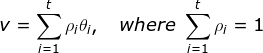
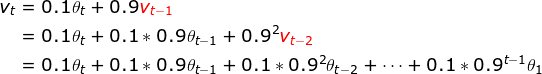
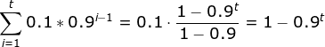
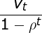

术语表
===

Index
---
<!-- TOC -->

- [指数加权平均（指数衰减平均）](#指数加权平均指数衰减平均)
    - [偏差修正](#偏差修正)

<!-- /TOC -->

## 指数加权平均（指数衰减平均）
> [什么是指数加权平均、偏差修正？ - 郭耀华](http://www.cnblogs.com/guoyaohua/p/8544835.html) - 博客园 
- **加权平均**
    - 假设 `θi` 的权重分别为 `ρi`，则 `θi` 的加权平均为：
    

- **指数加权平均**
    

    > 注意到越久前的记录其权重呈**指数衰减**，因此指数加权平均也称**指数衰减平均**
- **示例**：设 `ρ=0.9, v0=0`

    

    
    > 其中 `v_t` 可以**近似**认为是最近 `1/1-ρ` 个值的滑动平均（`ρ=0.9`时，`0.1 * 0.9^9 ≈ 0.038`），更久前的记录其权重已近似为 0。

### 偏差修正
- 指数加权平均在前期会存在较大的**误差**
    

    
    - 注意到只有当 `t -> ∞` 时，所有权重的和才接近 1，当 `t` 比较小时，并不是标准的加权平均
- **示例**：设 `ρ=0.9, v0=0`
    

    - 当 `t` 较小时，与希望的加权平均结果差距较大
- **引入偏差修正**
    

    - 偏差修正只对**前期**的有修正效果，**后期**当 `t` 逐渐增大时 `1-ρ^t -> 1`，将不再影响 `v_t`，与期望相符