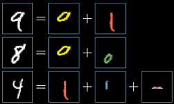
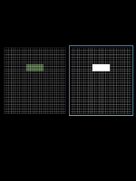
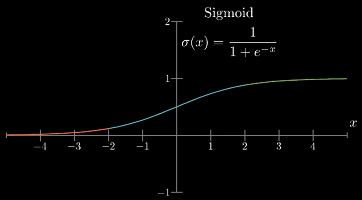
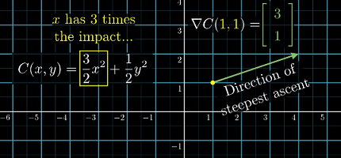
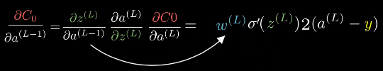

**说明**
---
该文档为“**3Blue1Brown - 深度学习系列视频**”的整理，主要包括三个视频
- [神经网络的结构](https://www.bilibili.com/video/av15532370)
- [梯度下降法](https://www.bilibili.com/video/av16144388)
- [反向传播算法](https://www.bilibili.com/video/av16577449)

让我们跟着 3Blue1Brown 从偏数学的角度来理解神经网络（原视频假设观众对神经网络没有任何背景知识）

**目录**
---
<!-- TOC -->

- [神经网络的结构](#神经网络的结构)
  - [神经元（隐藏单元）与隐藏层](#神经元隐藏单元与隐藏层)
  - [神经网络的运作机制](#神经网络的运作机制)
    - [权重和偏置](#权重和偏置)
  - [非线性激活函数](#非线性激活函数)
- [梯度下降法](#梯度下降法)
  - [损失函数（Loss Function）](#损失函数loss-function)
  - [梯度下降法（Gradient Descent）](#梯度下降法gradient-descent)
    - [理解梯度下降法的另一种思路](#理解梯度下降法的另一种思路)
    - [随机梯度下降（Stochastic Gradient Descent）](#随机梯度下降stochastic-gradient-descent)
  - [再谈神经网络的运作机制](#再谈神经网络的运作机制)
  - [推荐阅读](#推荐阅读)
- [反向传播算法（Backpropagation Algorithm, BP）](#反向传播算法backpropagation-algorithm-bp)
  - [反向传播的直观理解](#反向传播的直观理解)
    - [BP 算法小结](#bp-算法小结)
    - [相关代码](#相关代码)
  - [反向传播的微积分原理](#反向传播的微积分原理)
    - [示例：每层只有一个神经元的网络](#示例每层只有一个神经元的网络)
    - [更复杂的示例](#更复杂的示例)
    - [反向传播的 4 个基本公式](#反向传播的-4-个基本公式)

<!-- /TOC -->

# 神经网络的结构

内容：
- 神经网络是什么？
- 神经网络的结构
- 神经网络的工作机制
- 深度学习中的“学习”指的是什么？
- 神经网络的不足

**示例：一个用于数字手写识别的神经网络**

> 这个示例相当于深度学习领域中的 "Hello World".

## 神经元（隐藏单元）与隐藏层

**神经元（隐藏单元）**
- 简单来说，神经元可以理解为一个用来装数字的容器，而这个数称为激活值

  需要强调的是，激活值的值域取决于使用的激活函数，大多数激活函数的值域都是**正值**

    
    > 如果使用 sigmoid 激活函数，那么这个数字就在 0 到 1 之间；但通常来说，无论你使用哪种激活函数，这个数字都比较小

- 输入层也可以看做是一组神经元，它的激活值就是输入本身

    
    
    > 基本的神经网络只能处理向量型的输入，所以需要将这个 28*28 的像素图（矩阵），重排成长为 784 的向量
    >
    > 如果使用卷积神经网络，则可以直接处理矩阵型的输入
    
- 对于分类问题，**输出层**中的激活值代表这个类别正确的可能性
  > 如果使用了 `softmax` 函数，那么整个输出层可以看作每个类别的概率分布
- 所谓的“**神经元被激活**”实际上就是它获得了一个较大的激活值

    

**隐藏层**
- 包含于输入层与输出层之间的网络层统称为“隐藏层”

    
    > 在这个简单的网络中，有两个隐藏层，每层有 16 个神经元
    >
    > 为什么是两层和 16 个？——层数的大小与问题的复杂度有关，而神经元的数量目前来看是随机的——网络的结构在实验时有很大的调整余地

## 神经网络的运作机制
- 神经网络在运作的时候，隐藏层可以视为一个“黑箱”
- 每一层的激活值将通过某种方式计算出下一层的激活值——神经网络处理信息的核心机制

    
    > 每一层被激活的神经元不同，（可能）会导致下一层被激活的神经元也不同

**为什么神经网络的分层结构能起作用？**
---
- 人在初识数字时是如何区分的？——**组合**数字的各个部分

    

- **在理想情况下**，我们希望神经网络倒数第二层中的各隐藏单元能对应上每个**基本笔画**（pattern）

    
    - 当输入是 9 或 8 这种**顶部带有圆圈**的数字时，某个神经元将被激活（激活值接近 1）
    - 不光是 9 和 8，所有顶部带有圆圈的图案都能激活这个隐藏单元
    - 这样从倒数第二层到输出层，我们的问题就简化成了“学习哪些部件能组合哪些数字”

- 类似的，基本笔画也可以由更基础的部件构成

    
    
- **理想情况下**，神经网络的处理过程

    
    > 从输入层到输出层，**网络的抽象程度越来越高**

**深度学习的本质：通过组合简单的概念来表达复杂的事物**
---
- 神经网络是不是这么做的，我们不得而知（所以是一个“黑箱”），但大量实验表明：神经网络确实在做类似的工作——**通过组合简单的概念来表达复杂的事物**

    
    > 语音识别：原始音频 → 音素 → 音节 → 单词

**隐藏单元是如何被激活的？**
---
- 我们需要设计一个机制，这个机制能够把像素拼成边，把边拼成基本图像，把基本图像拼成数字
- 这个机制的基本处理方式是：通过上一层的单元激活下一层的单元

**示例：如何使第二层的单个神经元识别出图像中的某块区域是否存在一条边**
- 根据激活的含义，当激活值接近 1 时，表示该区域存在一条边，反之不存在
- **怎样的数学公式能够表达出这个含义？**

    
    
    
    - 考虑对所有输入单元加权求和
    - 图中每条连线关联一个权值：绿色表示正值，红色表示负值，颜色越暗表示越接近 0
    - 此时，只需将需要关注的像素区域对应的权值设为正，其余为 0
    - 这样对所有像素的加权求和就只会累计我们关注区域的像素值
    - 为了使隐藏单元真正被“激活”，加权和还需要经过某个**非线性函数**，也就是“激活函数”
    - 早期最常用的激活函数是 `sigmoid` 函数（又称 logistic/逻辑斯蒂曲线）

        
        > 从 `sigmoid` 的角度看，它实际上在对加权和到底有多“正”进行打分
        
    - 但有时，可能加权和大于 10 时激活才有意义；
    - 此时，需要加上“偏置”，保证不能随便激发，比如 -10。然后再传入激活函数

### 权重和偏置
- 每个隐藏单元都会和**上一层的所有单元**相连，每条连线上都关联着一个**权重**；
- 每个隐藏单元又会各自带有一个**偏置**
  > 偏置和权重统称为网络参数

    
    
    > 每一层都带有自己的权重与偏置，这样一个小小的网络，就有 13002 个参数

**权重与偏置的实际意义**
---
- 宏观来看，**权重**在告诉你当前神经元应该更关注来自上一层的哪些单元；或者说**权重指示了连接的强弱**

- **偏置**则告诉你加权和应该多大才能使神经元的激发变得有意义；或者说**当前神经元是否更容易被激活**

**矢量化编程**
---
- 把一层中所有的激活值作为一列**向量** `a`
- 层与层之间的权重放在一个**矩阵** `W` 中：第 n 行就是上层所有神经元与下层第 n 个神经元的权重
- 类似的，所有偏置也作为一列**向量** `b`
- 最后，将 `Wa + b` 一起传入激活函数

    
    > `sigmoid`会对结果向量中的每个值都取一次`sigmoid`

- 所谓“矢量化编程”，实际上就是将向量作为基本处理单元，避免使用 for 循环处理标量
- 通过定制处理单元（GPU运算），可以大幅加快计算速度

**机器“学习”的实质**
---
当我们在讨论机器如何“学习”时，实际上指的是机器如何正确设置这些参数

## 非线性激活函数
**神经网络本质上是一个函数**
- 每个神经元可以看作是一个函数，其输入是上一层所有单元的输出，然后输出一个激活值
- 宏观来看，神经网络也是一个函数

    
    > 一个输入 784 个值，输出 10 个值的函数；其中有 13000 个参数

- 早期最常用的激活函数是 `sigmoid` 函数，它是一个**非线性函数**
- 暂不考虑它其他优秀的性质（使其长期作为激活函数的首选）以及缺点（使其逐渐被弃用）；

  而只考虑其**非线性**

**为什么要使用非线性激活函数？——神经网络的万能近似定理**
---
> 视频中没有提到为什么使用非线性激活函数，但这确实是神经网络能够具有如此强大**表示能力**的关键
- 使用**非线性激活函数**的目的是为了向网络中加入**非线性因素**，从而加强网络的表示能力

**为什么加入非线性因素能够加强网络的表示能力？**
- 首先要有这样一个认识，非线性函数具有比线性函数更强的表示能力。
- 如果不使用非线性激活函数，那么每一层输出都是上层输入的线性组合；

  容易验证，此时无论有多少层，神经网络都只是一个线性函数。

**万能近似定理**
- 神经网络如果具有至少一个非线性输出层，那么只要给予网络足够数量的隐藏单元，它就可以以任意的精度来近似任何从一个有限维空间到另一个有限维空间的函数。
- 这极大的扩展了神经网络的表示空间
    > 《深度学习》 6.4.1 万能近似性质和深度

**新时代的激活函数——线性整流单元 ReLU**
---
这里简单说下 sigmoid 的问题：
- `sigmoid` 函数在输入取绝对值非常大的正值或负值时会出现**饱和现象**，此时函数会对输入的微小改变会变得不敏感

    
    > 饱和现象：在图像上表现为函数值随自变量的变化区域平缓（斜率接近 0）

- 饱和现象会导致**基于梯度的学习**变得困难，并在传播过程中丢失信息（**梯度消失**）

**线性整流单元 ReLU**

- =\max(0,a))

    

- `ReLU` 取代 `sigmoid` 的主要原因就是：使神经网络更容易训练（**减缓梯度消失**）
- 此外，一种玄学的说法是，早期引入 `sigmoid` 的原因之一就是为了模仿生物学上神经元的激发

  而 `ReLU` 比 `sigmoid` 更接近这一过程。

# 梯度下降法

内容：
- 梯度下降的思想
- 网络的能力分析
- 隐层神经元的真实目的

网络示例依然是那个手写识别的例子：

**神经网络是怎样学习的？**
---
- 我们需要一种算法：通过喂给这个网络大量的**训练数据**——不同的手写数字图像以及对应的数字标签

  算法会调整所有网络参数（权重和偏置）来提高网络对训练数据的表现

  此外，我们还希望这种分层结构能够举一反三，识别训练数据之外的图像——**泛化能力**

- 虽然使用了“学习”的说法，但实际上训练的过程更像在解一道**微积分问题**

  训练的过程实际上在寻找某个函数的（局部）最小值

- 在训练开始前，这些参数是随机初始化的
  > 确实存在一些随机初始化的策略，但目前来看，都只是“锦上添花”

## 损失函数（Loss Function）
- 显然，随机初始化不会有多好的表现
- 此时需要定义一个“**损失函数**”来告诉计算机：正确的输出应该只有标签对应的那个神经元是被激活的
- 比如这样定义单个样本的损失：

  
  
  - 当网络分类正确时，这个值就越小
  - 这里使用的损失函数为“均方误差”（mean-square error, MSE）
  
- 现在，我们就可以用**所有训练样本**的平均损失来评价整个网络在这个任务上的“**糟糕程度**”
  > 在实践中，并不会每次都使用所有训练样本的平均损失来调整梯度，这样计算量太大了
  >
  > 随机梯度下降

  实际上，**神经网络学习的过程，就是最小化损失函数的过程**

**神经网络与损失函数的关系**
- 神经网络本身相当于一个函数

  
  > 输入是一个向量，输出是一个向量，参数是所有权重和偏置

- 损失函数在神经网络的基础上，还要再抽象一层：

  所有权重和偏置作为它的输入，输出是单个数值，表示当前网络的性能；参数是所有训练样例（？）

  
  
- 从这个角度看，损失函数并不是神经网络的一部分，而是训练神经网络时需要用到的工具

## 梯度下降法（Gradient Descent）

**如何优化这些网络参数？**
- 能够判断网络的“糟糕程度”并不重要，关键是如何利用它来**优化**网络参数

**示例 1：考虑只有一个参数的情况**
- 如果函数只有一个极值点，那么直接利用微积分即可

  如果函数很复杂的话，问题就不那么直接了，更遑论上万个参数的情况

  
  

- **一个启发式的思路是**：先随机选择一个值，然后考虑向左还是向右，函数值会减小；

  准确的说，如果你找到了函数在该点的斜率，**斜率为正就向左移动一小步，反之向右**；

  然后每新到一个点就重复上述过程——计算新的斜率，根据斜率更新位置；

  最后，就可能逼近函数的某个**局部极小值**点

  

- 这个想法最明显的问题是：由于无法预知最开始的值在什么位置，导致最终会到达不同的局部极小值；

  关键是无法保证落入的局部极小值就是损失函数可能达到的全局最小值；

  这也是神经网络最大的问题：

  

**示例 2：考虑两个参数的情况**
- 输入空间是一个 XY 平面，代价函数是平面上方的曲面

  此时的问题是：在输入空间沿哪个方向移动，能使输出结果下降得最快
  
  
  
- 如果你熟悉**多元微积分**，那么应该已经有了答案：

  函数的**梯度**指出了函数的“**最陡**”增长方向，即沿着梯度的方向走，函数增长最快；

  换言之，**沿梯度的负方向走，函数值也就下降得最快**；
  
  此外，梯度向量的长度还代表了斜坡的“陡”的程度。

- 处理更多的参数也是同样的办法，

  这种**按照负梯度的倍数**，不断调整函数输入值的过程，就叫作梯度下降法

- 直观来看，梯度下降法能够让函数值收敛到损失函数图像中的某一个“坑”中

  

### 理解梯度下降法的另一种思路
- 梯度下降法的一般处理方式：
  - 将所有网络参数放在一个列向量中，那么损失函数的负梯度也是一个向量

    

- 负梯度中的每一项实际传达了两个信息

  1. 正负号在告诉输入向量应该调大还是调小——因为是**负梯度**，所以正好对应调大，负号调小
  1. 每一项的相对大小表明每个输入值对函数值的影响程度；换言之，也就是调整各权重对于网络的影响
  
     
     

- 宏观来看，可以把梯度向量中的每个值理解为各参数（权重和偏置）的相对重要度，

  同时指出了改变其中哪些参数的**性价比**最高

- 这个理解思路同样可以反馈到图像中

  
  - 一种思路是在点 `(1,1)` 处沿着 `[3,1]` 方向移动，函数值增长最快
  - 另一种解读就是变量 `x` 的重要性是 `y` 的三倍；
  
    也就是说，至少在这个点附近，改变 `x` 会造成更大的影响

**梯度下降法**描述：
---
1. 计算损失函数对所有参数的（负）梯度
1. 按梯度的负方向下降一定步长（直接加上负梯度）
1. 重复以上步骤，直到满足精度要求

- 其中计算梯度的算法——[反向传播算法](#3-反向传播算法backpropagation-algorithm)——是整个神经网络的核心

**梯度下降法**与**反向传播算法**
- 梯度下降法是寻找局部最小值的一种**策略**

  其中最核心的部分利用**损失函数 `L(θ)` 的梯度**来更新所有参数 `θ`

- **反向传播算法**是求解函数梯度的一种方法；

  其本质上是利用**链式法则**对每个参数求偏导

**损失函数的平滑性**
- 为了能达到函数的局部最小值，损失函数有必要是**平滑**的

  只有如此，损失函数才能基于梯度下降的方法，找到一个局部最小值

- 这也解释了为什么要求神经元的激活值是连续的
  > 生物学中的神经元是二元式的

### 随机梯度下降（Stochastic Gradient Descent）
- 基本的梯度下降法要求每次使用**所有训练样本**的平均损失来更新参数，也称为“**批量梯度下降**”

  原则上是这样，但是为了**计算效率**，实践中并不会这么做

- 一种常用的方法是每次只随机选取**单个样本**的损失来计算梯度，该方法称为“**随机梯度下降**”（Stochastic Gradient Descent, SGD），它比批量梯度下降法要快得多

- 但更常用的方法是**小批量梯度下降**，它每次随机选取**一批样本**，然后基于它们的平均损失来更新参数

- SGD 与 小批量梯度下降的优势在于：它们的计算复杂度与训练样本的数量无关
  > 很多情况下，并不区分 SGD 和小批量梯度下降；有时默认 SGD 就是小批量梯度下降，比如本视频

**批大小的影响**：
- **较大的批能得到更精确的梯度估计**，但回报是小于线性的。
- **较小的批能带来更好的泛化误差**，泛化误差通常在批大小为 1 时最好。但是，因为梯度估计的高方差，小批量训练需要**较小的学习率**以保持稳定性，这意味着**更长的训练时间**。
  > 原因可能是由于小批量在学习过程中加入了噪声，它们会有一些正则化效果 (Wilson and Martinez, 2003)
- **内存消耗和批的大小成正比**，当批量处理中的所有样本可以并行处理时。
- 在某些硬件上使用特定大小可以减少运行时间。尤其是在使用 GPU 时，通常使用 **2 的幂数**作为批量大小可以获得更少的运行时间。一般，2 的幂数的**取值范围是 32 到 256**，16 有时在尝试大模型时使用。

  > 《深度学习》 8.1.3 批量算法和小批量算法

**神经网络的优化难题**
---
- 有一个策略可以保证最终解**至少**能到达一个局部极小值点：使每次**移动的步幅和斜率成正比**；

  因为在最小值附近的斜率会趋于平缓，这将导致每次移动步幅越来越小，防止跳出极值点

  **但是**，这对于现代各种巨大的神经网络而言，是一个**负优化策略**——它反而会**限制网络的学习**，导致其陷入某个局部极小值点

- 当参数数量非常庞大时，可能存在**无数个极值点**，而其中某些极值点的结果可能非常差。
  > 优化问题是深度学习最核心的两个问题之一，另一个是正则化

- 也不要太过担心因为局部最小值点太多而无法优化；

  事实上，只要你使用的数据不是完全随机，或者说有一定结构，那么最终网络倾向收敛到的各个局部最小值点，实际上都差不多

  你可以认为如果数据集已经**结构化**了，那么你可以更轻松的找到局部最小值点
  > [1412.0233] The Loss Surfaces of Multilayer Networks https://arxiv.org/abs/1412.0233

## 再谈神经网络的运作机制
- 在第一章介绍[神经网络的运作机制](#12-神经网络的运作机制权重偏置激活函数)时，我们对神经网络的**期望**是：

  第一个隐藏层能够识别短边，第二个隐藏层能够将短边拼成圆圈等基本笔画，最后将这些部件拼成数字

  

- 利用**权重与所有输入像素对应相乘**的方法，可以还原每个神经元对应的图案

  
  
  > 期望（左）与现实（右）

- 事实上，与其说它们能识别各种散落的短边，它们不过都是一些松散的图案

  就像“在如深海般的 13000 维参数空间中，找到了一个不错的局部最小值位置住了下来”

  尽管它们能成功识别大部分手写数字，但它不像我们期望的能识别各种图案的基本部件

- 一个明显的例子：传入一张随机的图案

  如果神经网络真的很“智能”，它应该对这个输入感到困惑——10个输出单元都没有明确的激活值

  但实际上，它总会会给出一个确切的答案

  
  > 它能将一张真正的 "5" 识别成 5，也能把一张随机的噪声识别成 5

- 或者说，这个神经网络**知道怎么识别数字，但它不知道怎么写数字**

  原因可能是，很大程度上它的训练被限制在了一个很窄的框架内；

  “从神经网络的视角来看，整个世界都是由网络内清晰定义的静止数字组成的，它的损失函数只会促使它对最后的判断有绝对的自信。”

- 有一些观点认为，神经网络/深度学习并没有那么智能，它只是**记住了所有正确分类的数据**，然后**尽量**把那些跟训练数据类似的数据分类正确

- 但是，有些观点认为神经网络确实学到了某些更智能的东西：

  如果训练时使用的是随机的数据，那么损失函数的下降会很慢，而且是接近线性的过程；也就是说网络很难找到可能存在的局部最小值点；
  
  但如果你使用了**结构化**的数据，虽然一开始的损失会上下浮动，但接下来会快速下降；也就是很容易就找到了某个局部最小值——这表明神经网络能更快学习**结构化的数据**。

  

## 推荐阅读
- Neural Networks and Deep Learning: http://neuralnetworksanddeeplearning.com/
- Chris Olah's blog: http://colah.github.io/
  - [Neural Networks, Manifolds, and Topology](http://colah.github.io/posts/2014-03-NN-Manifolds-Topology/)
  - [Understanding LSTM Networks](http://colah.github.io/posts/2015-08-Understanding-LSTMs/)
- Distill — Latest articles about machine learning https://distill.pub/
- Videos on machine learning:
  - Learning To See [Part 1: Introduction] - YouTube https://www.youtube.com/watch?v=i8D90DkCLhI
  - Neural Networks Demystified [Part 1: Data and Architecture] - YouTube https://www.youtube.com/watch?v=bxe2T-V8XRs

# 反向传播算法（Backpropagation Algorithm, BP）

## 反向传播的直观理解

- 梯度下降法中需要用到损失函数的梯度来决定下降的方向，

  其中 BP 算法正是用于求解这个复杂梯度的一种方法

- 在阐述 BP 算法之前，记住[梯度的另一种理解方式](#221-理解梯度下降法的另一种思路不借助空间图像)——

  **梯度向量中的每一项不光告诉我们每个参数应该增大还是减小，还指示了调整每个参数的“性价比”**

  

**示例：单个训练样本对参数调整的影响**
---
- 假设现在的网络还没有训练好，那么输出层的激活值看起来会很随机

  而我们希望的输出应该是正确类别对应的输出值最大，其他尽可能接近 0

  因此，我们希望正确类别对应的激活值应该增大，而其他都减小
  > 需要注意的是，激活值是由输入值和权重及偏置决定的；网络不会调整激活值本身，只能改变权重和偏置

- 一个简单的**直觉**是：激活值**变动的幅度**应该与**当前值和目标值之间的误差**成正比

  
  
  > 我们希望第三个输出值增大，其他减小
  >
  > 显然，这里增加 "2" 的激活值比减少 "8" 的激活值更重要；因为后者已经接近它的目标了

- 激活值的计算公式指明了调整的方向

  
  
- 以 "2" 对应的神经元为例，如果需要**增大当前激活值**，可以：
  1. 增大偏置
  1. 增大权重
  1. 调整上一层的激活值
  > 如果使用的是 `sigmoid` 或 `ReLU` 作为激活函数，那么激活值都 `≥ 0`；但无论激活值正负，都是类似的调整方法

**如何调整权重和偏置？**
- 偏置只关注当前神经元，因此，可以正比于当前值和目标值之间的差来调整偏置
- 权重指示了连接的强弱；换言之，与之相连的上层激活值越大，那么该权重对当前神经元的影响也越大。显然，着重调整这个参数的性价比更高

  因此，可以正比于与之关联的上层激活值来调整权重

- 这种学习的**偏好**将导致这样一个结果——**一同激活的神经元被关联在一起**；生物学中，称之为“赫布理论”（Hebbian theory）

  这在深度学习中，并不是一个广泛的结论，只是一个粗略的对照；事实上，早期的神经网络确实在模仿生物学上大脑的工作；但深度学习兴起之后，其指导思想已经发生了重要转变——**组合表示**

**如何改变上层激活值？**
- 因为权重带有正负，所以如果希望增大当前激活值，应该使所有通过**正权**连接的上层激活值增大，所有通过**负权**连接的上层激活值减小

- 类似的，与修改权重时类似，如果想造成更大的影响，应该对应权重的大小来对激活值做出**成比例**的改变；

  但需要注意的是，上层激活值的大小也是由上层的权重和偏置决定的，
  
- 所以更准确的说法是，每层的权重和偏置会根据下一层的权重和偏置来做出成比例的改变，而最后一层的权重个偏置会根据**当前值和目标值之间的误差**来成比例调整

**反向传播**
- 除了需要增大正确的激活值，同时还要减小错误的。而这些神经元对于如何改变上一层的激活值都有各自的想法；

  因此，需要将这些神经元的期待全部相加，作为改变上层神经元的指示；

  这些期待变化，不仅对应权重的倍数，也是每个神经元激活值改变量的倍数。

  

- 这其实就是在实现“反向传播”的理念了——

  将所有期待的改变相加，就得到了希望对上层改动的变化量；然后就可以重复这个过程，直到第一层

- 上面只是讨论了单个样本对所有参数的影响，实践时，需要同时考虑每个样本对权重与偏置的修改，然后将它们期望的平均作为每个参数的变化量；

  不严格的来说，这就是梯度下降中的需要的“**负梯度**”

  
  
  > `η` 表示倍数

### BP 算法小结
- 反向传播算法计算的是**单个训练样本**对所有权重和偏置的调整——包括每个参数的正负变化以及**变化的比例**——使其能最快的降低损失。
- 真正的梯度下降需要对训练集中的每个样本都做一次反向传播，然后计算平均变化值，继而更新参数。

  但这么操作会导致算法的复杂度与训练样本的数量相关。

- 实践时，会采用“**随机梯度下降**”的策略：
  1. 首先打乱所有样本；
  1. 然后将所有样本分发到各个 mini-batch 中；
  1. 计算每个 mini-batch 的梯度，调整参数
  1. 循环至 Loss 值基本不再变化

  最终神经网络将会收敛到某个局部最小值上

### 相关代码
- mnielsen/neural-networks-and-deep-learning/[network.py](https://github.com/mnielsen/neural-networks-and-deep-learning/blob/master/src/network.py)

## 反向传播的微积分原理

从数学的角度看，反向传播本质上就是**利用链式法则求导**的过程；

本节的目标是展示机器学习领域是如何理解链式法则的。

### 示例：每层只有一个神经元的网络

- 从最后两个神经元开始：

  记最后一个神经元的激活值为 `a^(L)` 表示在第 L 层，上层的激活值为 `a^(L-1)`；

  给定一个训练样本，其目标值记为 `y`；

  则该网络对于单个训练样本的损失，可以表示为：

  
  
  <!-- =(a^{(L)}-y)^2)
  >`θ` 为代价函数的参数，表示网络中所有权值和偏置 -->

  其中

  

  <!-- }=\sigma(w^{(L)}a^{(L-1)}&plus;b^{(L)})) -->

  为了方便，记加权和为 `z`，于是有

  

  <!-- }=w^{(L)}a^{(L-1)}&plus;b^{(L)}) -->

- 整个流程可以概括为：

  
  - 先使用前一个激活值和权重 `w` 以及偏置 `b` 计算出 `z`
  - 再将 `z` 传入激活函数计算出 `a`
  - 最后利用 `a` 和目标值 `y` 计算出损失

- 我们的目标是理解**代价函数对于参数的变化有多敏感**；

  从微积分的角度来看，这实际上就是在**求损失函数对参数的导数**。

- 以 `w^(L)` 为例，求 `C` 对 `w^(L)`的（偏）导数，记作：

  
  > 把 `∂w^(L)` 看作对 `w` 的微小扰动，比如 0.001；把 `∂C` 看作“**改变 `w` 对 `C` 造成的变化**”

  <!-- }}) -->
  
  这实际上就是在计算 `C` 对 `w^(L)` 的微小变化有多敏感；
  > 3B1B - [微积分系列视频](./微积分的本质.md)

- 根据链式法则，有

  
  
  <!-- }}=\frac{\partial&space;C_0}{\partial&space;a^{(L)}}\frac{\partial&space;a^{(L)}}{\partial&space;z^{(L)}}\frac{\partial&space;z^{(L)}}{\partial&space;w^{(L)}}) -->

- 进一步分解到每个比值，有

  

  <!-- }}&space;&=\frac{\partial&space;C_0}{\partial&space;a^{(L)}}\frac{\partial&space;a^{(L)}}{\partial&space;z^{(L)}}\frac{\partial&space;z^{(L)}}{\partial&space;w^{(L)}}\\&space;&=2(a^{(L)}-y)\cdot&space;\sigma%27(z^{(L)})\cdot&space;a^{(L-1)}&space;\end{aligned}) -->

- 类似的，对偏置的偏导：

  

  对上层激活值的偏导：

  

  <!-- }}&space;&=\frac{\partial&space;C_0}{\partial&space;a^{(L)}}\frac{\partial&space;a^{(L)}}{\partial&space;z^{(L)}}\frac{\partial&space;z^{(L)}}{\partial&space;b^{(L)}}\\&space;&=2(a^{(L)}-y)\cdot&space;\sigma%27(z^{(L)})\cdot&space;1&space;\end{aligned}) -->
  
  <!-- }}&space;&=\frac{\partial&space;C_0}{\partial&space;a^{(L)}}\frac{\partial&space;a^{(L)}}{\partial&space;z^{(L)}}\frac{\partial&space;z^{(L)}}{\partial&space;a^{(L-1)}}\\&space;&=2(a^{(L)}-y)\cdot&space;\sigma%27(z^{(L)})\cdot&space;w^{(L)}&space;\end{aligned}) -->

- 更上层的权重与偏置也是类似的方法，只是链的长度会更长而已

  

- 一个直观的理解，考虑将它们分别对应到一个数轴上；
  
  
  - `w^(L)` 的微小变化会导致 `z^(L)` 的微小变化
  - `z^(L)` 的微小变化会导致 `a^(L)` 的微小变化
  - `a^(L)` 的微小变化最终会影响到损失值 `C`
  - 反向传播的过程就是将 `C` 的微小变化传回去

- 以上只是单个训练的损失对 `w^(L)` 的导数，实践中需要求出一个 mini-batch 中所有样本的平均损失

  

  <!-- }}=\frac{1}{n}\sum^{n-1}_{k=0}\frac{\partial&space;C_k}{\partial&space;w^{(L)}}&space;\end{aligned}) -->
  
- 进一步的，`∂C/∂w^(L)` 只是梯度向量 `▽C` 的一个分量；

  而梯度向量本身有损失函数对每个参数的偏导构成：

  

> 本系列视频称损失函数为“代价函数”，所以使用 `C` 表示代价（Cost）；更多会用 `L` 表示损失（Loss）；二者没有区别，但这里已经使用 L 表示网络的层数，所以使用 `C` 表示损失函数

### 更复杂的示例
- 更复杂的神经网络在公式上并没有复杂很多，只有少量符号的变化
- 首先，利用**下标**来区分同一层不同的神经元和权重

  

  以下的推导过程几乎只是符号的改变：

  

  然后求偏导：

  
  
  唯一改变的是，对 `(L-1)` 层的偏导：

  
  > 此时激活值可以通过不同的途径影响损失函数

  只要计算出倒数第二层损失函数对激活值的敏感度，就可以重复以上过程，计算喂给倒数第二层的权重和偏置。

- 事实上，如果都使用矢量表示，那么整个推导公式跟单神经元的网络几乎是完全一样的

- 链式法则给出了决定梯度每个分量的偏导，使我们能不断下探，最小化神经网络的损失。

### 反向传播的 4 个基本公式

- **问题描述**：

  反向传播算法的目标是求出损失函数**对所有参数的梯度**，具体可分解为**对每个权重和偏置的偏导**

  可以用 4 个公式总结反向传播的过程

- **标量形式**：

  }}}=\frac{\partial&space;C({\color{Red}&space;a_j^{(L)}},y_j)}{\partial&space;{\color{Red}&space;a_j^{(L)}}}&space;\end{aligned})

  }}}={\color{Teal}\sum_{k=0}^{n_l-1}}&space;\frac{\partial&space;z_k^{(l&plus;1)}}{{\color{Red}&space;\partial&space;a_j^{(l)}}}&space;\frac{{\color{Blue}&space;\partial&space;a_k^{(l&plus;1)}}}{\partial&space;z_k^{(l&plus;1)}}&space;\frac{\partial&space;C}{{\color{Blue}&space;\partial&space;a_k^{(l&plus;1)}}}&space;\end{aligned})

  }}}=\frac{\partial&space;z_j^{(l)}}{{\color{Magenta}&space;\partial&space;w_{j,k}^{(l)}}}\frac{{\color{Red}\partial&space;a_j^{(l)}}}{\partial&space;z_j^{(l)}}\frac{\partial&space;C}{{\color{Red}\partial&space;a_j^{(l)}}}&space;\end{aligned})

  }}}=\frac{\partial&space;z_j^{(l)}}{{\color{Magenta}&space;\partial&space;b_{j}^{(l)}}}\frac{{\color{Red}\partial&space;a_j^{(l)}}}{\partial&space;z_j^{(l)}}\frac{\partial&space;C}{{\color{Red}\partial&space;a_j^{(l)}}}&space;\end{aligned})

  > 其中，上标 `(l)` 表示网络的层次，`(L)` 表示输出层（最后一层）；下标 `j` 和 `k` 指示神经元的位置；
  >
  > `w_jk` 表示 `l` 层的第 `j` 个神经元与`(l-1)`层第 `k` 个神经元连线上的权重
  
  以 **均方误差（MSE）** 损失函数为例，有

  }}}&=\frac{\partial&space;C({\color{Red}&space;a_j^{(L)}},y_j)}{\partial&space;{\color{Red}&space;a_j^{(L)}}}&space;\\&space;&=\frac{\partial&space;\left&space;(&space;\frac{1}{2}({\color{Red}a_j^{(L)}}-y_j)^2&space;\right&space;)&space;}{\partial&space;{\color{Red}a_j^{(L)}}}={\color{Red}a_j^{(L)}}-y&space;\end{aligned})
  
  根据以上公式，就可以反向求出所有损失函数对所有参数的偏导了

- **矢量形式**：

  在标量形式的基础上，修改下标即可

  }}}=\frac{\partial&space;C({\color{Red}&space;a_j^{(L)}},y_j)}{\partial&space;{\color{Red}&space;a_j^{(L)}}}&space;\end{aligned})
  
  }}}=\frac{\partial&space;z^{(l&plus;1)}}{{\color{Red}&space;\partial&space;a^{(l)}}}&space;\frac{{\color{Blue}&space;\partial&space;a^{(l&plus;1)}}}{\partial&space;z^{(l&plus;1)}}&space;\frac{\partial&space;C}{{\color{Blue}&space;\partial&space;a^{(l&plus;1)}}}&space;\end{aligned})
  
  }}}=\frac{\partial&space;z^{(l)}}{{\color{Magenta}&space;\partial&space;w_{j}^{(l)}}}\frac{{\color{Red}\partial&space;a^{(l)}}}{\partial&space;z^{(l)}}\frac{\partial&space;C}{{\color{Red}\partial&space;a^{(l)}}}&space;\end{aligned})
  
  }}}=\frac{\partial&space;z^{(l)}}{{\color{Magenta}&space;\partial&space;b^{(l)}}}\frac{{\color{Red}\partial&space;a^{(l)}}}{\partial&space;z^{(l)}}\frac{\partial&space;C}{{\color{Red}\partial&space;a^{(l)}}}&space;\end{aligned})

  **注意**：其中向量相乘都是以**按元素相乘**的形式，一般用 `⊙` 符号表示。

- 以上是纯微积分形式的表达，一些机器学习相关书籍上总结了更简洁的形式，比如：

  
  > [The four fundamental equations behind backpropagation](http://neuralnetworksanddeeplearning.com/chap2.html#the_four_fundamental_equations_behind_backpropagation)

  **注意**：前两个公式为**矢量形式**，后两个具体到单个参数的是**标量形式**。

  其中，符号 `⊙` 按元素相乘：

  