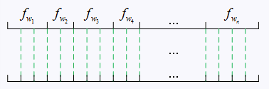

专题-洗牌、采样、随机数
===

Reference
---
- [关于乱序（shuffle）与随机采样（sample）的一点探究](https://www.cnblogs.com/xybaby/p/8280936.html) - xybaby - 博客园

Index
---
<!-- TOC -->

- [洗牌算法](#洗牌算法)
  - [Knuth-Durstenfeld Shuffle（Fisher–Yates Shuffle 改进版）](#knuth-durstenfeld-shufflefisheryates-shuffle-改进版)
  - [Inside-Out Shuffle](#inside-out-shuffle)
  - [Inside-Out Shuffle 无穷版](#inside-out-shuffle-无穷版)
- [采样（等概率）](#采样等概率)
  - [无放回思路](#无放回思路)
  - [有放回思路](#有放回思路)
  - [蓄水池采样](#蓄水池采样)
- [采样（不等概率）](#采样不等概率)
  - [查表法（有放回）](#查表法有放回)
    - [如何采样，使 `n-1` 被采样 n 次？](#如何采样使-n-1-被采样-n-次)
  - [无放回 TODO](#无放回-todo)
- [随机数](#随机数)
  - [用 `rand_m()` 生成 `rand_n()`](#用-rand_m-生成-rand_n)
    - [`m > n` 时](#m--n-时)
    - [`m < n` 时](#m--n-时)
  - [利用不等概率方法等概率产生随机数](#利用不等概率方法等概率产生随机数)

<!-- /TOC -->

## 洗牌算法
> [Fisher–Yates shuffle](https://en.wikipedia.org/wiki/Fisher%E2%80%93Yates_shuffle) - Wikipedia 

### Knuth-Durstenfeld Shuffle（Fisher–Yates Shuffle 改进版）
- Knuth-Durstenfeld Shuffle 是一个“原地”(in-place)算法
- 伪代码<br/>
  `To shuffle an array a of n elements (indices 0..n-1):`
  ```Python
  for i from n−1 downto 1 do
      j ← random integer such that 0 ≤ j ≤ i
      exchange(a[i], a[j])
  ```
- Python 实现
  ```Python
  def Knuth_Durstenfeld_shuffle(a):
      """Fisher–Yates Shuffle

      Args:
          a(list):
      """
      for i in range(len(a) - 1, 0, -1):
          j = random.randint(0, i)
          a[i], a[j] = a[j], a[i]

      # return a
  ```
- **正确性证明**：
  - 即证明：任何一个元素 shuffle 之后出现在任意位置的概率都是 `1/N`
  - 证明：
    ```
    第1次：`i == n-1`
      在 `[0, n-1]` 这 `n` 个数中随机选取一个数 `j`，
        此时每个数**第1次**被抽到的概率为 `1/n`
      交换`(a[j], a[n-1])`
      该操作表明任何一个元素有 `1/n` 的概率被放在 `n-1` 位置
    第2次：`i == n-2`
      在 `[0, n-2]` 这 `n-1` 个数中随机选取一个数 `j`，
        此时每个数**第2次**被抽到的概率为 `(n-1)/n * 1/(n-1) = 1/n`
        （其中 `(n-1)/n` 是第1次没被抽到的概率）
      交换`(a[j], a[n-2])`
      该操作表明任何一个元素有 `1/n` 的概率被放在 `n-2` 位置
    第3次：`i == n-3`
      在 `[0, n-3]` 这 `n-3` 个数中随机选取一个数 `j`，
        此时每个数**第3次**被抽到的概率为  `(n-1)/n * (n-2)/(n-1) * 1/(n-2) = 1/n`
        （其中 `(n-1)/n` 是第1次没被抽到的概率，`(n-2)/(n-1)` 是第2次没被抽到的概率）
      交换`(a[j], a[n-3])`
      该操作表明任何一个元素有 `1/n` 的概率被放在 `n-3` 位置
    ...
    ```
  
### Inside-Out Shuffle
- Inside-Out Shuffle 算法会返回一个打乱的副本
- 伪代码<br/>
  ```Python
  Input: source
  for i from 0 to n − 1 do
      j ← random integer such that 0 ≤ j ≤ i
      if j ≠ i
          a[i] ← a[j]
      a[j] ← source[i]
  ```
- Python 实现
  ```Python
  def Inside_Out_shuffle(src):
      """"""
      a = src[:]  # copy
      for i in range(len(a)):
          j = random.randint(0, i)
          if j != i:  # 比较的判断可以省略，有时赋值操作比比较更快
              a[i] = a[j]
          a[j] = src[i]

      return a
  ```
  ```Python
  # 无比较版本
  def Inside_Out_shuffle(src):
    """"""
    a = src[:]  # copy
    for i in range(len(a)):
        j = random.randint(0, i)
        a[i] = a[j]
        a[j] = src[i]
        # src[i] == 被赋值前的 a[i]
        #   可以看到 Inside_Out_shuffle 本质上就是 Knuth-Durstenfeld Shuffle 的拷贝版本

    return a
  ```
- 正确性证明 TODO


### Inside-Out Shuffle 无穷版
- 所谓无限，指的是 `n=len(src)` 未知的情况
  > [蓄水池采样](#蓄水池采样)
- Python 实现
  ```Python
  def Inside_Out_shuffle_inf(src):
      """"""
      ret = []
      while True:
          try:
              j = random.randint(0, len(ret))
              if j == len(ret):
                  ret.append(next(src))
              else:
                  ret.append(ret[j])
                  ret[j] = next(src)
          except StopIteration:
              break

      return ret
  ```


## 采样（等概率）
**问题描述**
```
从 n 个数中等概率的抽取 m 个数（m < n），每个数被抽取的概率为 `m/n`
```

### 无放回思路
- 无放回会改变原始数据，如果不想修改原始数据，需要额外复制一份

**思路 1**：类似 [Knuth-Durstenfeld Shuffle](#knuth-durstenfeld-shufflefisheryates-shuffle-改进版)
- 跟洗牌一样，随机从序列中取出一个元素，同时**从原序列中删除**
- 该方法需要修改原数据
- 如果不能修改原数据，可以考虑复制一份数据（仅当 n 比较小时）
  ```Python
  def sample(src):
      """"""
      n = len(src)
      ret = []
      for i in range(n):
          j = random.randrange(n - i)  # 0 <= j < n-i
          ret.append(src[j])
          src.pop(j)
      
      return ret
  ```
- 证明 TODO
  <!-- ```
  第1次采样：
    每个数有 `m/n` 的概率被抽到
  第2次采样：
    每个数有 `m/n * (m-1)/(n-1) + (n-m)/n * m/(n-1) = m/n` 的概率被抽到
      这里第一部分 `m/n * (m-1)/(n-1)` 
  ``` -->

**思路 2**：类似 [Inside-Out Shuffle](#inside-out-shuffle)
- Python `random.sample()` 中**当 `n <= 4**ceil(log(3*m, 4))` 时**的采用的方法
- 类似 Inside-Out 算法的方式从原数组中抽取 m 个数
  ```Python
  def sample(arr, m):
      """"""
      src = list(arr)  # 为了防止修改原数据，拷贝一个副本
      n = len(src)

      ret = [None] * m
      for i in range(m):
          j = random.randrange(n - i)  # 0 <= j < n-i
          ret[i] = src[j]  
          src[j], src[n - i - 1] = src[n - i - 1], src[j]  # 保证每个值都可能被抽到
          # src[j] = src[n - i - 1]  # 因为使用的是副本，所以直接覆盖也可以

      return ret
  ```

### 有放回思路
**思路**
- Python `random.sample()` 中**当 `n > 4**ceil(log(3*m, 4))` 时**采用的策略
- 使用一个 `set` 记录已经被抽到的位置，如果该位置已经存在，则继续
  ```Python
  def sample(arr, m):
      """"""
      n = len(arr)
      selected = set()
      
      ret = [None] * m
      for i in range(m):
          j = random.randrange(n)  # 0 <= j < n
          while j in selected:
              j = random.randrange(n)
          selected.add(j)
          ret[i] = arr[j]

      return ret
  ```
- 如果 `n < 4**ceil(log(3*m, 4))` 时采用这个策略，可能会产生类似 Hash 冲突的问题，导致调用随机数方法的次数过多
  > 求解调用`rangd()`的次数是一个期望问题 
  >> [蓄水池抽样及实现](https://www.cnblogs.com/hrlnw/archive/2012/11/27/2777337.html) - handspeaker - 博客园 


### 蓄水池采样

**问题描述**
```
给出一个数据流，这个数据流的长度为`n`，`n`很大或者未知（在不断增加），并且对该数据流中每个数据只能访问一次。
请写出一个抽样算法，从该数据流中抽取`m`个数据，使得所有数据被选中的概率相等（以概率`m/n`被选中）。

PS: 假设提供一个能返回**大随机整数**的函数`rand()`
```
**基本思路** `->` [等概率采样](#等概率采样)

**蓄水池采样算法**
- 伪代码
  ```
  从`n`个元素中随机的等概率的抽取`m`个元素，其中`n`可能不确定

      1. 将第 1 到 m 个元素加入“蓄水池”（作为被选中的元素）
      2. 从第 m+i 个元素开始：
          每个元素有 m/(m+i) 的概率被选中，若选中则随机替换掉蓄水池中的一个元素
      3. 重复以上操作直到遍历完所有元素

  > 根据以上伪代码，似乎还是要得到全部数据才能完成采样，问题出在哪里？实际上第`m+i`个元素被选中的概率是`m/(m+i)`，与`n`无关；即使`n`在不断增加，你依然可以获得达到`n`之前每个状态的结果。
  ```
- Python 实现
  ```Python
  def Reservoir_sample(src, m):
      """"""
      ret = []
      for i, item in enumerate(src):
          if i < m:
              ret.append(item)
          else:
              j = random.randint(0, i)  # i == m+k
              if j < m:  # 只要 j < m 就能加入 ret 表明 i >= m 之后的元素被选中的概率为 m/i = m/(m+k)
                  ret[j] = src[i]

      return ret
  ```
- **证明**：该算法保证每个元素以 `m/n` 的概率被选中
  - `n <= m` 时，每个元素被 100% 选中
  - `n > m` 时，
      - `n=m+1`时，根据算法定义，第`m+1`个元素被选中的概率=`m/m+1`，而前`m`个元素被选中的概率=`1-被第m+1个元素替换的概率`=`1-(m/m+1)*(1/m)=m/m+1`；说明前`m+1`个元素被选中的概率相等。
      - `n=m+k`时，第`m+k`个元素被选中的概率=`m/m+k=m/n`，前`(n-1)`个元素被选中的概率=`1-被第n个元素替换的概率`=`1-(m/n)*(1/m)=m/n`；说明所有`n`个元素被选中的概率相等。
  > [蓄水池抽样及实现](https://www.cnblogs.com/hrlnw/archive/2012/11/27/2777337.html) - handspeaker - 博客园 


## 采样（不等概率）

### 查表法（有放回）
- 图示
  <div align="center"></div>

  - 上面的线段按频度进行分割，下面为等距分割
  - 往下方的线段随机打点(均匀分布)，根据点所落在的区间对应到上方的线段，来确定采样的对象
  > Word2Vec 中负采样使用的方法

- Python 实现
  ```Python
  import random
  from collections import Counter

  def sample_non_balance(src, m):
      """"""
      cnt = Counter(src)  # 样本计数
      # 维护一个反向字典
      table = dict()
      i = 0
      for k, v in cnt.items():
          for _ in range(v):
              table[i] = k
              i += 1

      # 采样 m 次，m 可能大于 n
      n = len(src)
      ret = []
      for _ in range(m):
          j = random.randrange(n)
          ret.append(table[j])

      return ret
  ```
- 测试
  ```Python
  src = [1] * 100 + [2] * 200 + [3] * 300
  ret = sample_non_balance(src, 100000)  # 采样 100000 次
  ret_r = Counter(ret)
  for k, v in ret_r.items():
      print(v / len(ret))

  '''
  0.49926
  0.33362
  0.16712
  '''
  ```

#### 如何采样，使 `n-1` 被采样 n 次？
- 0 被采样 1 次，1 被采样 2 次，2 被采样 3 次，...

**法 1**
- 类似查表法的思路
  ```Python
  def solve(n):
      table = dict()
      index = 0
      for i in range(0, n):
          for _ in range(i + 1):
              table[index] = i
              index += 1

      i = random.randrange((1 + n) * n / 2)
      return table[i]

  cnt = 1000000
  ret = Counter([solve(4) for _ in range(cnt)])
  for k, v in sorted(ret.items()):
      print(k, v / cnt)
  '''
  0 0.099951
  1 0.200028
  2 0.300225
  3 0.399796
  '''
  ```

**法 2**
- Python
  ```Python
  def foo(n):
      while True:
          i = random.randrange(n)
          j = random.randrange(n)
          if i + j < n:
              return i + j

  cnt = 1000000
  ret = Counter([foo(4) for _ in range(cnt)])
  for k, v in sorted(ret.items()):
      print(k, v / cnt)
  '''
  0 0.099849
  1 0.199983
  2 0.299922
  3 0.400246
  '''
  ```

### 无放回 TODO


## 随机数

### 用 `rand_m()` 生成 `rand_n()`
> [面试中随机数"等概率"vs"不等概率"生成问题](http://www.cnblogs.com/hellogiser/p/random-generator-with-equal-or-unequal-probability.html) - hellogiser - 博客园 

**说明：**
- `rand_n()` 能够等概率生成 `[0, n)` 内的整数，`rand_m()` 同理

**假设 `rand_m()` 由以下方式实现** 
```python
import random

def rand_m(m):
    """"""
    o = random.randrange(m)
    return o
```

#### `m > n` 时
- 这种情况比较简单
- 因为 `m >= n`，只要用 `rand_m()` 生成的数在 `[0, n)` 范围就返回，反之重新生成
  ```python
  def rand_n(n):
      o = rand_m(5)
      while o >= n:
          o = rand_m(5)

      return o

  # 测试代码
  cnt = 1000000
  d = Counter([rand_n(3) for _ in range(cnt)])
  for k, v in d.items():
      print(k, v / cnt)
  print()
  '''
  0 0.33439
  1 0.332293
  2 0.333317
  '''
  ```

#### `m < n` 时
- 以下方法要求 `n <= m*m`
- 先看代码再说思路（暂时忽略注释的代码）：
  ```python
  def rand_n(n, m):
      """"""
      o = rand_m(m) * m + rand_m(m)    # 错误写法: rand_m(m) * (m+1)
      # t = (m*m) // n * n             # t 为小于 m*m 的 n 的最大整数倍
      # while o >= t:
      while o >= n:
          o = rand_m(m) * m + rand_m(m)

      # o = o % n
      return o
  ```
- **思路**
  - `rand_m(m) * m + rand_m(m)` 的意思是先等概率生成 `0, m, 2m, .. (m-1)*m`，然后在加上 `rand_m(m)`；最终效果相当于等概率生成 `[0, m*m)` 之间的数
  - 然后再按照 [`m > n` 时](#m--n-时)的做法生成 `n`

- 注意到，如果 `n << m*m` 时，这个方法会产生大量废操作
- 一个优化方法就是等概率生成 `t*n` 中的数，然后对 `n` 取模
  ```python
  def rand_n(n, m):
      """"""
      o = rand_m(m) * m + rand_m(m)    # 错误写法: rand_m(m) * (m+1)
      t = (m*m) // n * n               # t 为小于 m*m 的 n 的最大整数倍
      while o >= t:
          o = rand_m(m) * m + rand_m(m)

      o = o % n
      return o
  
  # 测试代码
  cnt = 100000
  d = Counter([rand_n(7, 5) for _ in range(cnt)])
  for k, v in d.items():
      print(k, v / cnt)
  print()
  '''
  3 0.14584
  4 0.14105
  0 0.14178
  6 0.14287
  1 0.14273
  2 0.14088
  5 0.14485
  '''
  ```


### 利用不等概率方法等概率产生随机数

**问题 1**
```
non_rand_01() 能够以不同的概率的生成 0/1；
请利用 non_rand_01() 等概率产生 0/1。
```
- `non_rand_01()` 测试代码
  ```Python
  def non_rand_01(p=0.6):
      """以 p 的概率产生 1，1-p 的涵概率产生 0"""
      r = random.random()
      if r < p:
          return 1
      else:
          return 0
  ```
- Python
  ```Python
  // non_rand_01() 能以不同的概率生成 0/1
  // rand_01(): 利用 non_rand_01() 等概率产生 0/1
  def rand_01():
      """利用 non_rand_01() 等概率产生 0/1"""
      while True:
          i1 = non_rand_01()
          i2 = non_rand_01()
          if i1 == 1 and i2 == 0:
              return 1
          if i1 == 0 and i2 == 1:
              return 0

  # 测试代码
  cnt = 1000000
  ret = Counter([rand_01() for _ in range(cnt)])
  for k, v in ret.items():
      print(k, v / cnt)
  '''
  1 0.499732
  0 0.500268
  '''
  ```

**问题 2**
```
non_rand_01() 能够以不同的概率的生成 0/1；
给定 n，请利用 non_rand_01() 等概率产生 0~n 之间的数值。
```
- 计算 n 的二进制位数，记为 `k`；然后在**问题 1** 的基础上，产生长度为 k 的随机 0/1 数列
- 注意，产生的随机数可能大于 `n`，当大于 `n` 时，则丢弃并重新生成
  ```Python
  def rand_n(n):
      """利用 rand_01 等概率产生 [0, n) 中的随机数"""
      while True:
          k = int(math.log2(n)) + 1
          ans = 0
          for i in range(k):
              ans <<= 1
              ans += rand_01()

          if ans < n:
              return ans

  # 测试代码
  cnt = 1000000
  ret = Counter([rand_n(10) for _ in range(cnt)])
  for k, v in sorted(ret.items()):
      print(k, v / cnt)
  '''
  0 0.099953
  1 0.100131
  2 0.100158
  3 0.100509
  4 0.099724
  5 0.099857
  6 0.099917
  7 0.099585
  8 0.10014
  9 0.100026
  '''
  ```
  