专题-句向量（Sentence Embedding）
===

Reference
---
- [The Current Best of Universal Word Embeddings and Sentence Embeddings](https://medium.com/huggingface/universal-word-sentence-embeddings-ce48ddc8fc3a) 

Index
---
<!-- TOC -->

- [基线模型](#基线模型)
    - [基于统计的词袋模型（BoW）](#基于统计的词袋模型bow)
    - [基于词向量的词袋模型](#基于词向量的词袋模型)
        - [均值模型](#均值模型)
        - [加权模型](#加权模型)
    - [基于 RNN（任务相关）](#基于-rnn任务相关)
    - [基于 CNN（任务相关）](#基于-cnn任务相关)
- [词袋模型](#词袋模型)
    - [[2018] Power Mean 均值模型](#2018-power-mean-均值模型)
    - [[2017] SIF 加权模型](#2017-sif-加权模型)
- [无监督模型](#无监督模型)
    - [[2015] Skip-Thought Vector](#2015-skip-thought-vector)
    - [[2018] Quick-Thought Vectors](#2018-quick-thought-vectors)
- [有监督模型](#有监督模型)
    - [[2017] InferSent](#2017-infersent)
    - [[2017] Self-Attention](#2017-self-attention)
    - [[2015] DAN & RecNN](#2015-dan--recnn)
- [多任务学习](#多任务学习)
    - [[2018] 基于多任务的 Sentence Embedding（微软）](#2018-基于多任务的-sentence-embedding微软)
    - [[2018] Universal Sentence Encoder（谷歌）](#2018-universal-sentence-encoder谷歌)
- [参考文献](#参考文献)

<!-- /TOC -->


## 基线模型

### 基于统计的词袋模型（BoW）
- 单个词的 One-Hot 表示
- 基于频数的词袋模型
- 基于 TF-IDF 的词袋模型
- ...

### 基于词向量的词袋模型
#### 均值模型
<div align="center"><a href="http://www.codecogs.com/eqnedit.php?latex=\fn_jvn&space;s=\frac{1}{N}\sum_{i=1}^N&space;v_i">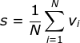</a></div>

> 其中 `v_i` 表示维度为 `d` 的词向量，均值指的是对所有词向量**按位求和**后计算每一维的均值，最后 `s` 的维度与 `v` 相同。

#### 加权模型
<div align="center"><a href="http://www.codecogs.com/eqnedit.php?latex=\fn_jvn&space;s=\sum_{i=1}^N&space;\alpha_i\cdot&space;v_i"></a></div>

> 其中 `α` 可以有不同的选择，但一般应该遵循这样一个准则：**越常见的词权重越小**
>> [[2017] SIF 加权模型](#2017-sif-加权模型)

### 基于 RNN（任务相关）
- 以最后一个隐状态作为整个句子的 Embedding
    <div align="center">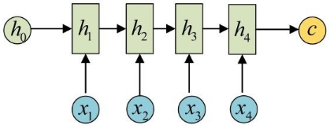</div>

- 基于 RNN 的 Sentence Embedding 往往用于特定的有监督任务中，**缺乏可迁移性**，在新的任务中需要重新训练；
- 此外，由于 RNN 难以并行训练的缺陷，导致开销较大。


### 基于 CNN（任务相关）
- 卷积的优势在于提取**局部特征**，利用 CNN 可以提取句子中类似 n-gram 的局部信息；
- 通过整合不同大小的 n-gram 特征作为整个句子的表示。

    <div align="center">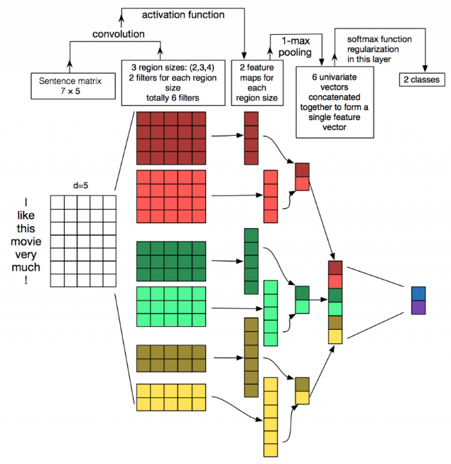</div>


## 词袋模型

### [2018] Power Mean 均值模型
> [4]
- 本文是均值模型的一种推广；通过引入“幂均值”（Power Mean）来捕捉序列中的其他信息；
- 记句子 `s=(x_1, x_2, ..., x_n)`
    <div align="center"><a href="http://www.codecogs.com/eqnedit.php?latex=\fn_cm&space;\large&space;s_p=\left&space;(&space;\frac{x_1^p&plus;\cdots&plus;x_n^p}{n}&space;\right&space;)^{\frac{1}{p}},\quad&space;p\in\mathbb{R}\cup\{\pm\infty\}">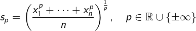</a></div>

    - `x_i` 为每个词的词向量，维度为 `d`
    - 普通的均值模型即 `p=1` 时的特例；
    - 特别说明，`±∞` 实际上指的是 `max`/`min`，而不是绝对值最大/最小

- 本文通过**拼接**的方式来保留不同 `p` 的信息
    <div align="center"><a href="http://www.codecogs.com/eqnedit.php?latex=\fn_jvn&space;\large&space;s=[s_{p_1};s_{p_2};...;s_{p_k}]">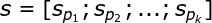</a></div>

    > 此时，Sentence Embedding 的维度应该是 **`K * d`**

- 进一步的，文本还加入了在**不同词嵌入空间**上的词向量，依然通过**拼接**的方式保留信息
    - 所谓**不同词嵌入空间**，指的就是使用不同算法在不同语料上训练得到的词向量
        <div align="center"><a href="http://www.codecogs.com/eqnedit.php?latex=\fn_jvn&space;\large&space;\begin{array}{ll}&space;s^{(i)}&space;&=[s_{p_1}^{(i)};s_{p_2}^{(i)};...;s_{p_k}^{(i)}]&space;\\&space;s&space;&=[s^{(1)};s^{(2)};...;s^{(L)}]&space;\\&space;\end{array}">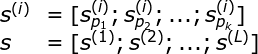</a></div>
        
        > 此时，Sentence Embedding 的维度应该是 **`K * L * d`**
    - 本文使用了如下 **4 种词向量**：
        - GloVe embeddings (GV) trained on Common Crawl
        - Word2Vec trained on GoogleNews (GN)
        - Attract-Repel (AR) (Mrksic et al., 2017)
        - MorphSpecialized (MS) (Vulic et al., 2017)


### [2017] SIF 加权模型
- **文献 [1]** 提出了一个简单但有效的**加权词袋模型 SIF** (**Smooth Inverse Frequency**)，其性能超过了简单的 RNN/CNN 模型

- **SIF** 的计算分为两步：<br/>
    **1）** 对句子中的每个词向量，乘以一个权重 `a/(a+p_w)`，其中 `a` 是一个常数（原文取 `0.0001`），`p_w` 为该词的词频；对于出现频率越高的词，其权重越小；<br/>
    **2）** 计算**句向量矩阵**的第一个主成分 `u`，让每个句向量减去它在 `u` 上的投影（类似 PCA）；
    
- **完整算法描述**
    <div align="center">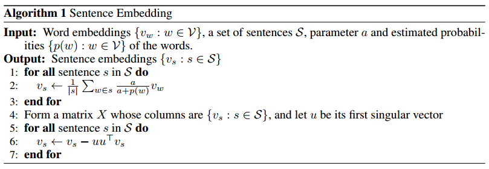</div>

<!--  

  <details><summary><b>Numpy 示例（点击展开）</b></summary>

  ```python
  
  ```
  
  </details>

-->


## 无监督模型

### [2015] Skip-Thought Vector
> [2]

- 类似 Word2Vec/语言模型 的思想，Sentence Embedding 作为模型的副产品。
- 给定一个三元组 `s_{i-1}, s_i, s_{i+1}` 表示 3 个连续的句子。
- 模型使用 Encoder-Decoder 框架；
- 训练时，由 Encoder 对 `s_i` 进行编码；然后分别使用两个 Decoder 生成前一句 `s_{i-1}` 和下一句 `s_{i+1}`
    <div align="center">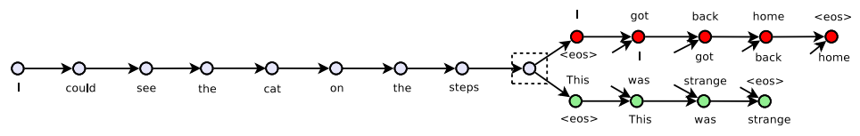</div>

    - **Encoder**（GRU）
        <div align="center">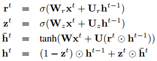</div>
    
    - **Decoder**（带窥孔的 GRU）
        <div align="center">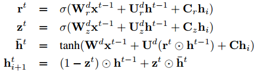</div>
        
        > 其中 `h_i` 为 Encoder 的输出，即表示 `s_i` 的 Sentence Embedding
    - **Decoder** 可以看作是以 **Encoder** 输出为条件的**神经语言模型**
        <div align="center">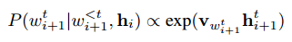</div>

        > 语言模型，`v` 表示词向量

    - **目标函数**
        <div align="center">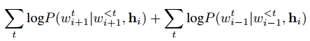</div>
    
- OOV 词的处理 TODO

### [2018] Quick-Thought Vectors
> [4]

- 本文是基于 Skip-Thought Vector 的改进
- Skip-Thought Vector 中给出前一句**生成**上一句和下一句的任务，被重新描述为一个**分类任务**：Decoder 作为分类器从一组候选句子中选择正确的上一个/下一个句子。
    - **生成模型**（Skip-Thought Vector）
        <div align="center">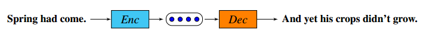</div>

    - **分类模型**（Quick-Thought Vectors）
        <div align="center">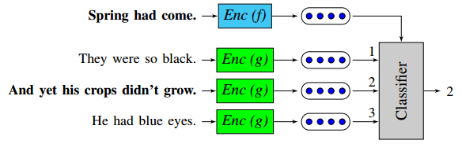</div>

- 该模型的一个主要优点是**训练速度**比 Skip-Thought Vector 快，后者需要训练 3 个 RNN 模块。
- **一些细节**：
    - `batch size = 400`，即一个 batch 为 400 个连续的句子；
    - `context size = 3`，即对给定句子，预测其上一句和下一句；
    - **负采样**：同一 batch 中除上下文句子，均作为 负例；
    - 开始训练时，词向量被初始化为 `[-0.1, 0.1]`，没有使用预训练的词向量；


## 有监督模型

### [2017] InferSent
> [5]

- 本文使用有监督的方法，在**自然语言推理**（NLI）数据集上训练 Sentence Embedding；
- 本文认为从 **NLI 数据集**（比如 **SNLI**）中训练得到的句向量也适合**迁移**到其他 NLP 任务中。
    - 就像在各种 **CV 任务**中使用基于 ImageNet 的模型（VGG, ResNet 等）来得到图像特征一样，在处理 **NLP 任务**之前可以先使用**本文公开的模型**来计算句子的特征。


- **基本模型**
    - 在 NLI 任务中，每个样本由三个元素构成 `(u, v, l)`——其中 `u` 表示前提（premise），`v` 表示假设（hypothesis），`l` 为类标（entailment 1, contradiction 2, neutral 3）
    - 本文比较了 7 种编码器：1）LSTM, 2）GRU, 3）bi-GRU, 4）bi-LSTM(mean pooling), 5）bi-LSTM(max pooling), 6）self-attention, 7）CNN

    <div align="center">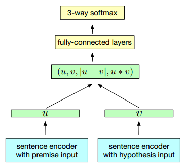</div>
    
    - 注意：在 NLI 数据集中，句子 `u` 和 `v` 的地位不是等价的


### [2017] Self-Attention
> [3]

- 本文提出使用**二维矩阵**作为句子表征，矩阵的行表示在句子不同位置的关注度，以解决句子被压缩成一维向量时的信息损失。

    <div align="center">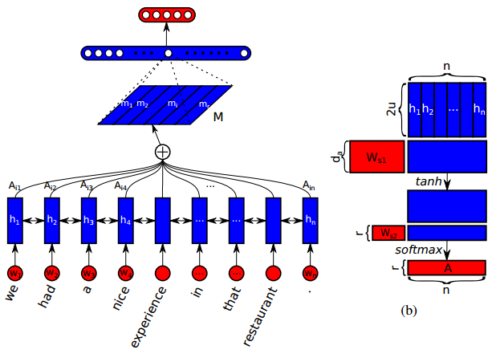</div>


### [2015] DAN & RecNN
> [9]

- 原文模型仅用于分类，但也可用于有监督的学习 Sentence Embedding
    > [Universal Sentence Encoder（谷歌）](#2018-universal-sentence-encoder谷歌)

- 基本模型，其中比较常用的是 DAN
    - DAN（Deep Averaging Network）
        <div align="center">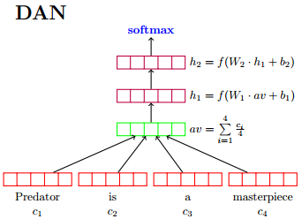</div>

    - RecNN
        <div align="center">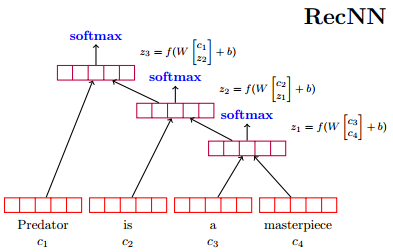</div>

    

## 多任务学习
- InferSent 模型的成功，使大家开始探索不同的有监督任务中得到的 Sentence Embedding 在下游任务中的效果。
- 多任务学习试图在一次训练中组合不同的训练目标。

### [2018] 基于多任务的 Sentence Embedding（微软）
> [6]

- 本文认为为了能够推广到各种不同的任务，需要对同一句话的多个方面进行编码。
- 简单来说，模型同时在**多个任务**和**多个数据源**上进行训练，但是**共享**相同的 Sentence Embedding。
- 任务及数据集包括：
    - Skip-Thought（预测上一句/下一句）——BookCorpus
    - 神经机器翻译（NMT）——En-Fr (WMT14) + En-De (WMT15)
    - 自然语言推理（NLI）——SNLI + MultiNLI
    - Constituency Parsing——PTB + 1-billion word

- 本文模型与 [Skip-Thought Vector](#2015-skip-thought-vector) 基本一致
    - **主要区别**在于本文的 Encoder 部分使用的是 **Bi-GRU**，而 Decoder 部分完全一致；
    - 使用 GRU 而非 LSTM 的原因主要是为了速度；

### [2018] Universal Sentence Encoder（谷歌）
> [7]

- 本文的目的是动态地适应各种的 NLP 任务，通过在不同的数据集和不同的任务上同时训练。
- 本文使用**类似的多任务框架**，区别在于使用的 Encoder 不同。
    > [[2018] 基于多任务的 Sentence Embedding（微软）](#2018-基于多任务的-sentence-embedding微软)
- 本文以两种模型作为 Encoder
    - **Transformer** [8]——更高的精度
    - **DAN** (Deep Averaging Network) [9]——更快的速度
  
- 一个可用的预训练版本
    ```python
    embed = hub.Module("https://tfhub.dev/google/universal-sentence-encoder/2")
    embeddings = embed([
        "The quick brown fox jumps over the lazy dog.",
        "I am a sentence for which I would like to get its embedding"])

    sess.run(embeddings)
    ```
    > TensorFlow Hub  |  [universal-sentence-encoder](https://www.tensorflow.org/hub/modules/google/universal-sentence-encoder/2) 


## 参考文献
- [1] A Simple but Tough-to-Beat Baseline for Sentence Embeddings, ICLR 2016.
- [2] Skip-Thought Vectors, NIPS 2015.
- [3] A Structured Self-attentive Sentence Embedding, ICLR 2017.
- [4] An efficient framework for learning sentence representations, ICLR 2018.
- [5] Supervised Learning of Universal Sentence Representations from Natural Language Inference Data, ACL 2017.
- [6] Learning General Purpose Distributed Sentence Representations via Large Scale Multi-task Learning, ICLR 2018.
- [7] Universal Sentence Encoder, arXiv 2018.
- [8] Attention is all you need, NIPS 2017.
- [9] Deep unordered composition rivals syntactic methods for text classification, 2015 ACL.