视觉问答（VQA）综述
===

**相关论文**
- [2016].Visual Question Answering
    - 本文从**数据集**、**评价方法**、**算法**等方面讨论了 VQA 的现状及存在的问题，以及 VQA 的未来发展方向；特别讨论了现有**数据集**在训练和评价方面的**局限性**。

Index
---
<!-- TOC -->

- [VQA 简述](#vqa-简述)
    - [VQA 与其他图像任务](#vqa-与其他图像任务)
        - [基于对象检测的任务](#基于对象检测的任务)
        - [图像描述任务](#图像描述任务)
            - [DenseCap](#densecap)
    - [VQA 中的数据集](#vqa-中的数据集)
        - [DAQUAR](#daquar)
        - [COCO-QA](#coco-qa)
        - [VQA Dataset](#vqa-dataset)
        - [FM-IQA](#fm-iqa)
        - [Visual Genome](#visual-genome)
        - [Visual7W](#visual7w)
        - [SHAPES](#shapes)
    - [VQA 的评价方法 TODO](#vqa-的评价方法-todo)
- [主流模型与方法](#主流模型与方法)
    - [基线模型](#基线模型)
        - [分类模型](#分类模型)
        - [生成模型](#生成模型)
    - [贝叶斯模型](#贝叶斯模型)
    - [基于 Attention 的模型](#基于-attention-的模型)
        - [基于 Edge Boxes 的方法](#基于-edge-boxes-的方法)
        - [基于 Uniform Grid 的方法](#基于-uniform-grid-的方法)
            - [[49] Stacked Attention Networks for Image Question Answering（SAN）](#49-stacked-attention-networks-for-image-question-answeringsan)
            - [[48] Ask, Attend and Answer: Exploring Question-Guided Spatial Attention for Visual Question Answering](#48-ask-attend-and-answer-exploring-question-guided-spatial-attention-for-visual-question-answering)
            - [[52] Dynamic memory networks for visual and textual question answering](#52-dynamic-memory-networks-for-visual-and-textual-question-answering)
            - [[54] Hierarchical Question-Image Co-Attention for Visual Question Answering](#54-hierarchical-question-image-co-attention-for-visual-question-answering)
            - [[56] Dual attention networks for multimodal reasoning and matching](#56-dual-attention-networks-for-multimodal-reasoning-and-matching)
    - [基于双线性池化的模型](#基于双线性池化的模型)
        - [[46] Multimodal compact bilinear pooling for visual question answering and visual grounding](#46-multimodal-compact-bilinear-pooling-for-visual-question-answering-and-visual-grounding)
        - [[57] Hadamard Product for Low-rank Bilinear Pooling](#57-hadamard-product-for-low-rank-bilinear-pooling)
    - [组合模型](#组合模型)
        - [[44] Deep Compositional Question Answering with Neural Module Networks](#44-deep-compositional-question-answering-with-neural-module-networks)
        - [[55] Training recurrent answering units with joint loss minimization for VQA](#55-training-recurrent-answering-units-with-joint-loss-minimization-for-vqa)
    - [其他模型 TODO](#其他模型-todo)
- [参考文献](#参考文献)

<!-- /TOC -->

# VQA 简述
**VQA 的难点**
- 目前大多数关于图像的任务并不需要完全理解图像包含的信息。比如图像分类、物体检测、动作识别等。而解决 VQA 问题需要完全理解图像。
- VQA 的问题可以使任意的，它实际上包含了一系列 CV 子问题：
  - Object recognition - What is in the image?
  - Object detection - Are there any cats in the image?
  - Attribute classification - What color is the cat?
  - Scene classification - Is it sunny?
  - Counting - How many cats are in the image?
- 除此之外，还可以提出更多复杂的问题，比如：
  - Spatial relationship - What is between the cat and the sofa?
  - Common sense reasoning questions - Why is the the girl crying?
  - ...
- 一个健壮的 VQA 系统应该能**同时**解决这些问题。
  > 显然，目前的技术还无法做到这一点；一个可行的办法是将一个 **Strong AI** 问题转化为多个 **Weak AI** 问题的集成。比如先对问题做一个分类，然后调用相应的图像模型去解答。

**VQA 系统的应用**
- 帮助弱视人群获取相关的图像信息；
- 改善人机交互
- 图像检索
- AI 基础问题：图灵测试

**本文结构**
- S2: VQA 与其他图像任务的比较
- S3: 现有数据集存在的问题；这些数据集中的偏差（Bias）如何限制了它们评价算法的能力
- S4: VQA 的评价指标
- S5: 对目前 VQA 建模方法的分析
- S6: VQA 未来可能的发展


## VQA 与其他图像任务
- VQA 的总体目标是从图像中提取与问题相关的语义信息，从细微物体的**检测**到抽象场景的**推理**。
- 大多数 CV 任务都需要从图像中提取信息，但与 VQA 相比都存在某些局限性。

### 基于对象检测的任务
- 对象识别、动作识别和场景分类都可以被定义为**图像分类任务**，现在最好的方法是使用 CNN 进行训练，将图像分类为特定的语义类别。
  - **对象识别**一般只需要对图像中的主要对象进行分类，而不用理解其在整个场景中的空间位置或作用。
  - **目标检测**通过对图像中每个对象实例放置一个边界框来定位特定的语义概念。
  - **语义分割**通过将每个**像素**分类为一个特定的语义类，使定位的任务更进一步。
  - **实例分割**（Instance segmentation）用于区分同一语义类的不同实例。


  > **相关论文**
  >> 对象识别：[2] ResNet<br/>
  >> 物体检测：[3]、[4] Faster R-CNN、[11]<br/>
  >> 语义分割：[12] FCN、[13]<br/>
  >> 实例分割：[14]、[15]、[16]

**标签歧义**
<div align="center"></div>

  > 【图1】目标检测 和 语义分割
- **语义分割**或**实例分割**都不足以全面理解整个场景；
- 其中主要的问题在于**标签歧义**（label ambiguity）
  - 比如上述图中“**黄叉**”的位置取 "**bag**"、"**black**"、"**person**" 之一都没有问题。
  - 一般来说，具体选取哪个标签，取决于具体的任务。
- 此外，目前的主流方法（CNN+标签）不足以理解物体在整个场景下的作用（role）
  - 比如，将“黄叉”位置标记为 "bag" 不足以了解该包与人的关系；或者标记为 "person" 也不能知道这个人的状态（跑、坐、...）
- 理想的 VQA 要求能够回答关于图像的任意问题，因此除了基本的检测问题，还需要理解对象彼此，以及和整个场景之间的关系。<!-- 具体使用什么标签由问题指定。 -->

### 图像描述任务
- 除了 VQA 外，**图像描述**（image captioning）是另一个比较主流的、需要结合 CV 和 NLP 的任务。图像描述任务的目标是对给定图像生成相关的自然语言描述。
- 结合 NLP 中的一些方法（RNN等），生成描述有不同的解决方案。
- 但是，图像描述的另一个难点是**评价**。
  - 一些自动评价方法：BLEU、ROUGE、METEOR、CIDEr
  - 这些方法中，除了 CIDEr，最初都是为了评价机器翻译的结果而提出的。
  - 这些方法每一个都存在一些局限性，它们常常将由机器生成的标题排在人工标题之前，但从人的角度看，这些结果并不够好，或者说**不是目标描述**。
- 评价的一个难点在于，给定图像可以存在许多有效的标题，这些标题可以比较宽泛，也可能很具体。
  - 比如【图1】既可以描述为"A busy town sidewalk next to street parking and intersections."；
  - 也可以使用 "A woman jogging with a dog on a leash."
- 如果不加限制，图像描述系统总是倾向于生成“得分”更高的表述。
  - 比如 "A person is walking down a street" 或 "Several cars are parked on the side of the road" 这些普适的描述总是会得到较高的排名（Rank）。
  - 事实上，一个简单图像描述系统，只要使用 KNN 等方法找到与给定图像比较**相似的图像**，并把它们的描述返回就能在部分评估指标下得到不错的分数。
  
> 相关论文：[5]、[17]、[18]、[19]、[20]

#### DenseCap
- DenseCap 全称为 Dense image captioning，它在一定程度上缓解了普适标题的问题；
- DenseCap 会在图像的不同局部位置生成密集的注释；
  <div align="center">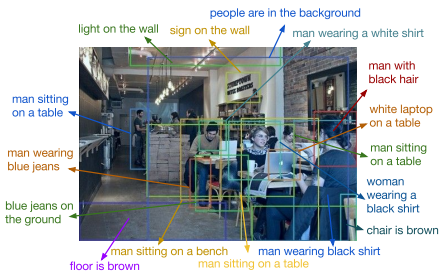</div>

- 即使如此，这些短描述也存在自动评价的问题；
- 此外，这些只针对局部信息的描述也不能提供空间信息或对象关系。

> 相关论文：[29]

**小结**
- 总的来说，虽然图像描述系统也存在不确定性，但其描述粒度可以人工设定；
- 这一点与 VQA 不同，VQA 中回答的粒度是由提出的问题决定的。
  - "What season is this?" 需要理解整个场景
  - "What is the color of dog standing behind the girl with white dress?" 需要关注场景中某一局部的细节
- 此外，因为**很多问题都具有明确的答案**，所以 VQA 的评价反而要简单一些。
- 当然也存在一些可能存在歧义的问题（S4）。但对于多数问题，VQA 系统产生的答案可以通过与真实答案一对一匹配的方式进行评估。


## VQA 中的数据集
- 几个主要数据集：
  - DAQUAR
  - COCO-QA
  - VQA Dataset
  - FM-IQA
  - Visual7W
  - Visual Genome

- 如果数据集在问题或答案（文本部分）的分布中包含**容易被利用的偏差**（Bias），那么算法可能在这份数据集上执行得很好，但不会真正解决 VQA 问题。
- 下面主要讨论各数据集的创建过程及其**局限性**

### DAQUAR
> Download: [Visual Turing Challenge](https://www.mpi-inf.mpg.de/departments/computer-vision-and-multimodal-computing/research/vision-and-language/visual-turing-challenge/) 
- DAtaset for QUestion Answering on Real-world images (DAQUAR) ——第一个发布的主要 VQA 数据集
- **数据规模**：6795 training and 5673 testing
- 只包含室内场景（indoor scenes），限制了问题的多样性；
- 部分图像比较混乱而且明暗比较极端，即使人类也仅做到 52.2% 的正确率。

### COCO-QA
> Download: [COCO-QA Dataset](http://www.cs.toronto.edu/~mren/imageqa/data/cocoqa/) 

- 该数据集中的 QA 对是使用一些 NLP 方法根据图像标题自动生成的；
  - 比如一副图像的标题为 "A boy is playing Frisbee"，那么可能的 Q 为 "What is the boy playing?"，而答案 A 为 "Frisbee".
- **数据规模**：78,736 training and 38,948 testing QA pairs.
- **问题分布**：**object** (69.84%), **color** (16.59%), **counting** (7.47%) and **location** (6.10%)
- 所有答案都是一个词，且只有 435 个不同的答案；因此在这个数据集上评价比较简单；
- COCO-QA 的一个问题是用于生成 QA 的 NLP 方法存在缺陷：
  - 为了便于处理，较长的句子被分解成较小的块，但在许多情况下，该算法不能很好地处理句子中存在的从句和语法变化。
  - 这导致一些 Q 存在语法错误甚至无法读懂
- 这个数据集另一个问题是，它**只有 4 种简单的问题**（因为这些问题是基于图像的标题生成的）；这些问题可能只需要捕捉到图像中的一些**局部信息**就能得出答案；
<!-- > 关于这一点缺陷，可以参考这篇论文中的解决办法：Making the V in VQA Matter: Elevating the Role of Image Understanding in Visual Question Answering -->

### VQA Dataset
> 这里的主要指该数据集的 1.0 版本（2015），目前已经发布了 2.0 版本（2017）
>> VQA: [Visual Question Answering](http://visualqa.org/)

- 该数据集由两部分组成：COCO-VQA 和 SYNTH-VQA；前者为真实图像，后者为合成卡通图像；
  - 其中 SYNTH-VQA 由 50,000 个不同的模拟场景组成，其中包含 100 多个不同的物体、30 个动物模型和 20 个人体模型。
- VQA Dataset 为为每幅图片提供了三个问题，每个问题有十个答案；
- 数据规模：
  - COCO-VQA: 614,163 total, with 248,349 for training, 121,512 for validation, and 244,302 for testing
  - SYNTH-VQA: 150,000 QA pairs

**对比**
- 通过使用合成图像，可以创建一个更加多样化和平衡的数据集。
- 自然图像数据集往往具有**更一致的上下文**和偏见，例如，街头场景比斑马更有可能有狗的图片。

**COCO-VQA 的问题** 
- 由于语言上的偏见，许多问题**无需使用图像**就能回答；
  <div align="center">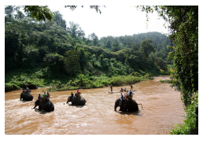</div>

  - Q: "What color are the trees?" —— A: "green."
  - 在数据集中，这个问题出现了 73 次，其中 70 个的答案都是 "green"
- 存在许多主观问题，没有准确的答案；
  <div align="center">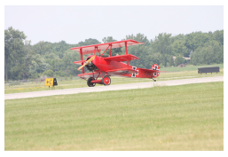</div>

  - Q: "Would you like to fly in that?" —— A: "yes"(4), "No"(6)
- 许多问题需要解释或冗长的描述，这类问题难以自动评价；
  <div align="center"></div>

  - Q: "Why would you say this woman is strong?" —— A: "yes"(5), can lift up on arms, headstand, handstand, can stand on her head, she is standing upside down on stool.

### FM-IQA
- Freestyle Multilingual Image Question Answering (FM-IQA) 
- 最初是中文数据集，现在也提供了英文版本；
- FM-IQA 允许回答是一个句子；
- 这加大了自动评价的难度；作者建议人类评价来判断生成的答案是否由人类提供；

### Visual Genome
- 同时使用了 YFCC100M 和 COCO 中的图像；
- 数据规模：108,249 images、1.7 million QA pairs；
- 本数据集包含六种 'W' 问题：What, Where, How, When, Who, and Why；
- 包含两种模式：
  - **free-form method**：可以针对图像提出任意问题；人类标注者通常会趋向于提出类似的问题。
  - **regionspecific method**：针对图像的指定区域提问；
    <div align="center">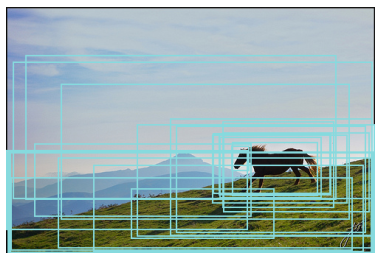</div>
  
    - Free form QA: What does the sky look like?
    - Region based QA: What color is the horse?
- 答案多样性
  - Visual Genome 中最常见的 1000 个答案仅占数据集中所有答案的 65%，而 COCO-VQA 占82%，DAQUAR COCO-QA 占100%
  - Visual Genome 只有 57% 的答案是**单个词**；而 COCO-VQA 中为 88%，COCO-QA 为100%，DAQUAR 为 90%。
  - Visual Genome 中没有是/否问题

### Visual7W
- Visual7W 是 Visual Genome 的一个子集
- 7W 指的是 "What, Where, How, When, Who, Why, Which."
- 两类问题
  - ‘telling’ questions：答案是基于文本的
  - ‘pointing’ questions：以 Which 开头的问题，对于这些问题，算法必须在备选方案中选择正确的边界框。
    <div align="center"></div>

    - Q: Which object can you stab food with?

### SHAPES
- “形状”数据集由图形的不同排列组成，问题涉及形状的属性、关系和位置；
- 这种方法可以快速生成大量数据，同时消除一些其他数据集的偏见；
- 该数据集包括 244 个不同的问题，每个问题都会对所有的 64 幅图提出，且答案都是 "yes/no"。
- 其中许多问题需要对形状的布局和属性进行位置推理。
- 如果某个算法不能在 SHAPES 上表现良好，那么说明它只能以有限的方式分析图像。


## VQA 的评价方法 TODO
<!--  
- 一般有两种方法来获得答案：
  - 生成方法（开放性 VQA）
  - 匹配方法（多选择 VQA）
- 如果是后者，可以使用常见的 PR（准确率、召回率） 指标来评估
- 下面主要讨论的是对于生成方法的评估
-->
- 目前主要的评价方法可以参考如下几篇论文：[30], [32], [40]
- 但这些方法或是针对特定的数据集，或是存在语义偏差，并不完美。

<!-- 
**Wu-Palmer Similarity**（WUPS）
- 该方法试图根据语义上的差异来衡量一个预测的答案与基本真理有多大的不同。
- 语义间的差异进一步转化为求**语义树节点间的距离**，并转化为 0~1 之间的一个值。
  ```
  比如“秃鹰”和“鹰”的相似性为0.96，“秃鹰”和“鸟类”的相似性为0.88。
  ```
- WUPS 本身的问题是对于两个完全不想关的概念给出了**相对**偏高的分数，
  ```
  比如，“乌鸦”和“写字台” 给出了 0.4 的分数；
  ```
  [30] 对其加入了一些改进，加入了阈值措施——如果低于阈值，分数将被进一步缩小；
- WUPS 的两个主要问题：
  - 由于语义树的限制，WUPS 的评价偏向于**词汇的相似**而非含义的相似
    - 比如，有关**对象属性**的问题，以**颜色**为例：WUPS 认为“白色”和“黑色”的分数为 0.91
  - 只能作用于“刚性语义概念”（rigid semantic concepts），基本都是单词会一些名词短语；无法应用于句子；
-->

# 主流模型与方法

- **基本流程**
  - **提取图像特征**（图像特征化）
    - VGGNet [1], ResNet [2], GoogLeNet [58]
  - **提取问题特征**（问题特征化）
    - LSTM, GRU, skip-thought vectors [61]
  - **特征整合，输出答案**
    - 目前主要有基于分类和生成两种方法

- **基于生成的基本框架**
  - Encoder-Decoder 框架

- **基于分类的基本框架**
  - **基于分类的 VQA 基本框架**
    <div align="center"></div>

- 不同做法的差异主要体现在**如何整合图像和文本的特征**
- **整合图像和问题特征的方法**
  - 简单机制
    - concatenation、elementwise multiplication、elementwise addition等
    - 相关论文：[36, 38, 32, 33]
  - 双线性池化（bilinear pooling）
    - 相关论文：[46, 53, 62]
  - Attention机制
    - 相关论文：[49, 51, 48, 63]
  - 贝叶斯模型：[36, 30]
  - 问题分解：[50, 44]

## 基线模型

### 分类模型
**[38]**
- BoW + GoogLeNet;
- concat + LR

**[32]**
- LSTM/BoW + VGGNet;
- multiply + MLP

<!-- **[36]**
- skip-thought vectors + ResNet-152 + Bayesian; -->

**[31]**
- LSTM + CNN + 概率模型；
- 本文**把图像特征当做 LSTM 的第一和最后一个时间步的输入**，中间则依然使用问题作为输入。

### 生成模型

**[40]**
- LSTM + GoogleNet;
- 本文将图像特征拼接到问题的每个词之后，共同作为 LSTM 的输入；问题结束后的时间步被用于生成答案。
  <div align="center"></div>

**[33]**
- Seq2Seq 生成模型，本文采用的是 Encoder-Decoder 框架
- Encoder 部分与 [31] 类似，但是图像特征只作为 LSTM 最后一个时间步的输入
- 此外，本文使用 LSTM 作为 Decoder 来生成答案。

## 贝叶斯模型

**[30]**
- 首次将贝叶斯框架用于 VQA；
- 使用**语义分割**来识别图像中的对象及其位置；
- 然后，利用贝叶斯算法对**目标的空间关系**进行建模，计算出每个答案的概率。
- 本文是较早的 VQA 解决方案，但其有效性不如简单的基线模型；部分原因在于其依赖语义分割的结果

**[36]**
- 本文基于这样一个直觉（insight），通过问题可以预测**答案的类型**。
- 基于此，将开放性问题转化为多选择问题；
- skip-thought vectors + ResNet-152
  <div align="center">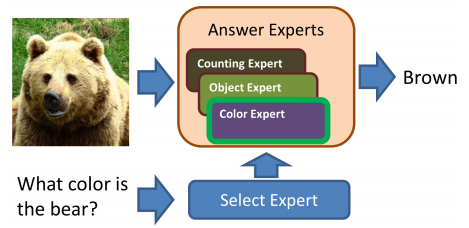</div>

## 基于 Attention 的模型
> 相关论文： [63, 49, 52, 48, 54, 51, 46, 55]
- 使用全局特征可能会模糊输入空间中与任务相关的区域；
- VQA 中，使用**基于空间的 Attention 机制**来创建**特定区域**的 CNN 特征，而不像基线模型中那样直接使用全局特征。
  > 因为问题一般比较短，所以很少有模型在 VQA 中将注意力纳入文本表征
- Attention 背后的基本思想是，图像中的某些视觉区域和问题中的某些单词对于回答给定的问题比其他区域或单词更能提供更多的信息。
  > The basic idea is that certain visual regions in an image and certain words in a question are more informative than others for answering a given question. 
- 因此，直接使用 CNN 网络的最后一层和 Sentence Embedding 就不太合适。

**分割图像区域的基本方法**
- 一般有两种方法对局部区域建模
- 一种是类似语义分割的方式，生成**边缘框**（Edge Boxes [68]），对每个框生成特征
- 一种是使用**均匀网格**（**Uniform Grid**）把图像分成若干区域，然后利用 CNN 生成每个网格区域的图像特征，然后计算每个区域与问题中每个词的相关度得到 Attention 权重矩阵。
  > 这个过程实际上跟**卷积**本身很像。
  <div align="center">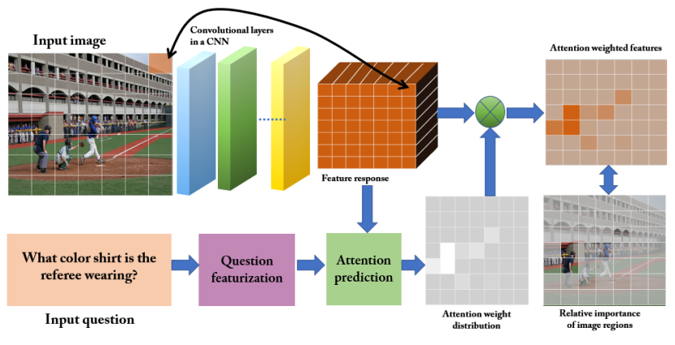</div>

<!-- **Attention 的作用** -->

### 基于 Edge Boxes 的方法
> [63, 51]

**[63]** Where to look: Focus regions for visual question answering
- 模型输入：所有 box 区域的 CNN 特征、问题特征、答案
- 模型对每个候选答案生成一个分数，经过**排序**后得到最终答案
- 打分部分由一个全连接层完成。
  <div align="center">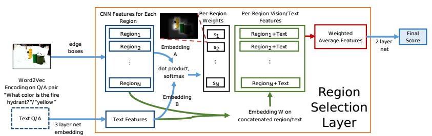</div>

**[51]** A focused dynamic attention model for visual question answering（FDA）
- 模型建议只使用与问题相关的 box 区域。
- 计算相关 box 的方法：
  - 首先对每个 box 添加标签：
    - 训练时，对象标签和包围框由 COCO 注释提供；
    - 测试时，使用 ResNet [2] 分类后得到每个 box 的标签；
  - 然后使用 Word2Vec 计算问题中的单词与对象标签之间的相似度。
  - 只要相似度大于 0.5 则认为是相关的。
- 问题和图像序列分别使用 LSTM 建模，得到特征后送入全连接层分类得到答案。
  <div align="center">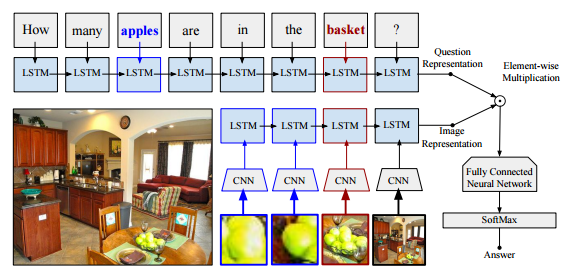</div>

  - 在最后一个时间步，模型还输入了图像的全局特征，用于访问全局以及局部特征。

### 基于 Uniform Grid 的方法
> [49, 48, 52, 54, 56]

#### [49] Stacked Attention Networks for Image Question Answering（SAN）
- 模型提取 VGG19 最后一个 Pooling 层的 feature map 作为区域特征，其大小为 `14*14*512`。
- 相当于把原始 `448*448` 的图像均匀划分为 `14*14` 个网格（grid），每个网格使用一个 `512` 维的向量表示其特征。
  <div align="center">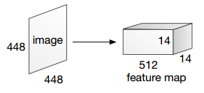</div>

- **Attention 层**
  - Attention 层的主要作用是计算每个网格与问题的相关度
  - 公式：
    <div align="center"><a href="http://www.codecogs.com/eqnedit.php?latex=\fn_cs&space;\begin{aligned}&space;h_A&=\tanh(W_I\cdot&space;v_I\oplus(W_Q\cdot&space;v_Q&plus;b_Q))\\&space;p_I&=\text{softmax}(W_p\cdot&space;h_A&plus;b_p)&space;\end{aligned}"></a></div>

    > 其中 `vI: [14*14,512]` 为图像特征，`vQ: [512]` 为问题特征；最后 `pI: [14*14]` 即问题在每个网格处的关注度

    <details><summary><b>Tensorflow 代码（点击展开）</b></summary>

    ```python
    # m = 14*14, d = 512, k = 
    v_I  # [N, d, m]
    W_I  # [k, d]
    v_Q  # [N, d]
    W_Q  # [k, d]
    b_Q  # [d]
    W_p  # [d]

    ```
    > `m`: grid 的数量，本文中即 14*14<br/>
    > `d`: 特征维度，本文为 512 <br/>
    > `k`: 隐藏单元的数量，本文为 1024

    </details>

  - 在得到每个网格与问题的相关度后，对所有网格进行加权求和，从而得到整个图像加权后的全局特征；
  - 整合图像特征与问题特征后进行分类（本文采用整合方法为按位求和）

    <div align="center"><a href="http://www.codecogs.com/eqnedit.php?latex=\fn_jvn&space;\begin{aligned}&space;\tilde{v}_I&=\sum_{i=1}^m&space;p_iv_i\\&space;u&=\tilde{v}_I&plus;v_Q&space;\end{aligned}"></a></div>
  
**Stacked Attention**（堆叠 Attention）
  - 对于复杂的问题，**单一的 Attention 层并不足以定位正确的答案预测区域**。
    <div align="center"></div>
  
  - 本文使用多个 Attention 层迭代上述过程
    <div align="center"><a href="http://www.codecogs.com/eqnedit.php?latex=\fn_jvn&space;\begin{aligned}&space;\text{set}\quad&space;{\color{Red}u^{(0)}}&=v_Q,\quad&space;k=1,2,...,K\\&space;\text{then}\quad&space;h^{(k)}&=\tanh(W_I^{(k)}\cdot&space;{\color{Red}v_I}\oplus(W_Q^{(k)}\cdot{\color{Red}u^{(k-1)}}&plus;b_Q^{(k)}))\\&space;p^{(k)}&=\text{softmax}(W_p^{(k)}\cdot&space;h^{(k)}&plus;b_p^{(k)})\\&space;\tilde{v}_I^{(k)}&=\sum_{i=1}^m&space;p_i^{(k)}v_i\\&space;{\color{Red}u^{(k)}}&=\tilde{v}_I^{(k)}&plus;u^{(k-1)}&space;\end{aligned}"></a></div>

    > 本文取 `K=2`

#### [48] Ask, Attend and Answer: Exploring Question-Guided Spatial Attention for Visual Question Answering
- 本文采用了与 [49] 类似的方法，区别在于本文计算的是**问题中的每个词**在每个网格的关注度
- 记：
  - `V = {v1, v2, .., vT}: [T, d_v]`，其中 v_i 为问题中每个词的词向量，`T` 表示问题的（最大）长度，不足该长度的补充全 0 词向量；
  - `S = {s1, s2, .., sL}: [L, d_s]`，其中 s_i 为每个网格的特征向量，`L` 表示网格数；
  - 则相关系数矩阵 `C: [T, L]` 为
    <div align="center"><a href="http://www.codecogs.com/eqnedit.php?latex=\fn_jvn&space;C=V\cdot&space;(S\cdot&space;W_A&plus;b_A)^\mathsf{T}"></a></div>

- 基于以上想法，本文提出了两种模型 "One-Hop Model" 和 "Two-Hop Model"
  - One-Hop Model 使用整合后的问题特征和加权视觉特征来预测答案；
  - Two-Hop Model 中将整合后的问题和加权视觉特征循环回注意力机制中，从而细化注意力分布。（做法与 [49] 类似）

#### [52] Dynamic memory networks for visual and textual question answering
- DMN 已经被一些论文用于文本问答，本文尝试将 Dynamic Memory Network (DMN) 应用于 VQA；
- DMN 主要由三个模块构成：输入模块、**情景记忆模块**（episodic memory module）、回答模块
  > 问答论文摘要/[Dynamic Memory Networks](./问答-A-摘要.md#2016-icmldynamic-memory-networks)
- **输入模块**
  - **文本问答**的输入为一系列**可能**与问题相关的**情景句子**（上下文）；
  - **视觉问答**的输入为**网格划分**后的图像，每一块网格作为**可能**与问题相关的**情景**
    <!-- <div align="center"></div> -->
- **情景记忆模块**用于提取输入中的相关事实；每次迭代时更新内部记忆单元；
- **回答模块**通过整合最终的记忆单元与问题的表示来生成答案（RNN）。
  
#### [54] Hierarchical Question-Image Co-Attention for Visual Question Answering
- 本文引入**层次协同注意模型**（Hierarchical Co-Attention model）来共同推理这两种不同的信息流。
  > Co-Attention 类似于 [48] 中的做法
- 本文进一步细化了问题，基于词、短语、句子三个层级分别构建 Attention 权重
- 本文提出了两种 Attenion 机制：parallel co-attention 和 alternative co-attention
  - **parallel co-attention** 同时关注问题和图像；
  - **alternative co-attention** 同时在关注问题或图像间交替进行；
- 最终的答案通过由低到高依次融合三个层级的特征来预测。
    <div align="center">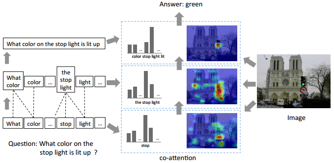</div>

#### [56] Dual attention networks for multimodal reasoning and matching
- 本文的主要思想是允许问题于图像互相 Attention，从而直接关注关键词或关键区域。
  > 思想跟 co-attention 类似，但是做法不同。
- 为了实现这一点，本文先将图像特征和问题特征整合为**记忆向量**（按位乘），然后利用该记忆向量**分别**对问题和图像构建 Attention 向量。
- 该过程可以递归的进行，下一轮的输入为上一轮得到两个 Attention 向量；
  <div align="center">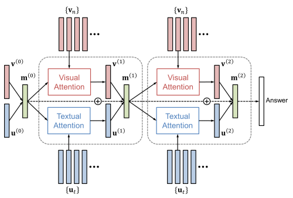</div>

  > 但是作者建议迭代 2 次即可。


## 基于双线性池化的模型
> [46, 57]

- VQA 需要对图像和问题的联合分析；
- 除了一些简单的基线方法外，还可以利用**外积**（outer-product）对两者进行更复杂的交互。该方法被称为双线性池化。
- **双线性池化**已经在图像识别领域取得了一定效果 [71].

### [46] Multimodal compact bilinear pooling for visual question answering and visual grounding
- 本文使用了 Multimodal Compact Bilinear pooling（MCB）作为整个图像与问题特征的新方法；
- 如果直接对图像和问题进行外积会导致特征维度不可控，因此 MCB 在一个**低维的空间**下进行外积运算；
- 文本计算 Attention 的做法类似 [[49]](#49-stacked-attention-networks-for-image-question-answeringsan)，区别在于使用 **MCB 操作**代替**双线性 Attention**
  > 双线性 Attention，即 `Q·W·V`——使用一个权重矩阵 `W` 作为两个向量 `Q` 和 `V` 的交互中介。
  <div align="center"></div>

- 本文模型是 2016 VQA 比赛的获胜模型

### [57] Hadamard Product for Low-rank Bilinear Pooling
- 本文认为 MCB 尽管只是使用了近似的外积，但计算代价依然比较高。
- 本文建议使用 Multi-modal Low-rank Bilinear pooling (MLB) 来近似 MCB；
- 具体来说，即使用 **Hadamard Product** 和**线性映射**来近似外积。
  > Hadamard Product 即按位相乘
- MLB 可以达到媲美 MCB 的效果，同时降低了计算复杂度和更少的参数。


## 组合模型
> [44, 50, 55]

- 一些复杂的问题可能需要多个**推理**步骤；
- Neural Module Network（神经模块网络）使用外部解析器来寻找问题中的子问题

### [44] Deep Compositional Question Answering with Neural Module Networks
- 本文提出使用神经模块网络（Neural Module Network, NMN）来解决 VQA 问题
- NMN 框架将 VQA 视为由**独立的子网络**执行的一系列子任务。
- 每个子网络执行一个定义良好的任务。
  - 比如 find [X], describe [X], measure [X], transform[X] 等模块。
- 这些模块必须组装成一个有意义的**布局**；
- 本文使用一个**自然语言解析器**来发现问题中的子问题，同时用于推断子任务需要的布局；
  - 比如 "What color is the tie?" 可能会执行 find[tie] 模块和 describe[color] 模块。

### [55] Training recurrent answering units with joint loss minimization for VQA
- 本文提出的 Recurrent Answering Units（RAU）模型可以在不依赖外部语言分析器的情况下隐式地执行组合推理。
- 本文将所有用于回答子问题的模块以 RNN 的方式顺序排列，利用类似门机制的方式来自动选择由哪些模块回答问题。
  <div align="center">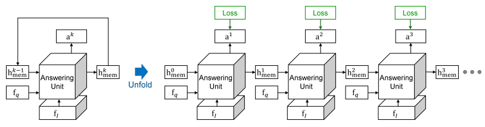</div>


## 其他模型 TODO


# 参考文献
- [1] Very deep convolutional networks for large-scale image recognition, ICLR 2015
- [2] Deep residual learning for image recognition, CVPR 2016.
- [3] You only look once: Unified, real-time object detection, CVPR 2016.
- [4] Faster R-CNN: Towards real-time object detection with region proposal networks, NIPS 2015.
- [5] Long-term recurrent convolutional networks for visual recognition and description, CVPR 2015.
- [11] Deep neural networks for object detection, NIPS 2013.
- [12] Fully convolutional networks for semantic segmentation, CVPR 2015.
- [13] Learning deconvolution network for semantic segmentation, CVPR 2015.
- [14] Instance segmentation of indoor scenes using a coverage loss. ECCV 2014.
- [15] Monocular object instance segmentation and depth ordering with CNNs, CVPR 2015.
- [16] Instance-level segmentation with deep densely connected MRFs, CVPR 2016.
- [17] Deep visual-semantic alignments for generating image descriptions, CVPR 2015.
- [18] Deep captioning with multimodal recurrent neural networks (m-rnn), ICLR 2015.
- [19] Show and tell: A neural image caption generator, CVPR 2015.
- [20] Show, attend and tell: Neural image caption generation with visual attention, ICML 2015.
- [29] Densecap: Fully convolutional localization networks for dense captioning, CVPR 2016.
- [30] A Multi-World Approach to Question Answering about Real-World Scenes based on Uncertain Input, NIPS 2014.
- [31] A multi-world approach to question answering about realworld scenes based on uncertain input, NIPS 2014.
- [32] VQA: Visual question answering, ICCV 2015.
- [33] Are you talking to a machine? Dataset and methods for multilingual image question answering, NIPS 2015.
- [36] Answer-type prediction for visual question answering, CVPR 2016.
- [38] Simple baseline for visual question answering, arXiv 2015.
- [40] Ask your neurons: A neural-based approach to answering questions about images, ICCV 2015.
- [44] Deep compositional question answering with neural module networks, CVPR 2016.
- [46] Multimodal compact bilinear pooling for visual question answering and visual grounding, EMNLP 2016.
- [48] Ask, attend and answer: Exploring question-guided spatial attention for visual question answering, ECCV 2016.
- [49] Stacked attention networks for image question answering, CVPR 2016.
- [50] Learning to Compose Neural Networks for Question Answering, NAACL 2016.
- [51] A focused dynamic attention model for visual question answering, arXiv 2016.
- [52] Dynamic memory networks for visual and textual question answering, ICML 2016.
- [53] Multimodal residual learning for visual qa, NIPS 2016.
- [54] Hierarchical Question-Image Co-Attention for Visual Question Answering, NIPS 2016.
- [55] Training recurrent answering units with joint loss minimization for VQA, arXiv 2016.
- [56] Dual attention networks for multimodal reasoning and matching, CVPR 2017.
- [57] Hadamard Product for Low-rank Bilinear Pooling, ICLR 2017.
- [58] Going deeper with convolutions, CVPR 2015.
- [61] Skip-thought vectors, NIPS 2015.
- [62] Dualnet: Domain-invariant network for visual question answering, IEEE 2017.
- [63] Where to look: Focus regions for visual question answering, CVPR 2016.
- [68] Edge boxes: Locating object proposals from edges, ECCV 2014.
- [71] Bilinear cnn models for fine-grained visual recognition, ICCV 2015.
