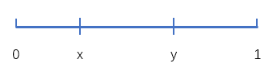
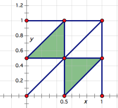

概率论
===
- 面试时如果被问了一个概率题，那就要小心了，面试官可能要刷人了！
- 面试概率题的特点：
    - 题面不复杂
    - 短时间可以解答
    - 会者不难

RoadMap
---
- [概率论基础](#概率论基础) TODO
- [常见面试题](#常见面试题)

Index
---
<!-- TOC -->

- [概率论基础](#概率论基础)
    - [古典概型](#古典概型)
    - [几何概型](#几何概型)
- [例题](#例题)
    - [例题-古典概型](#例题-古典概型)
        - [54 张牌，平均分成 6 份，...](#54-张牌平均分成-6-份)
    - [例题-几何概型](#例题-几何概型)
        - [一根棍子折成三段，求能组成 ...](#一根棍子折成三段求能组成-)

<!-- /TOC -->

# 概率论基础

## 古典概型
- 在一个有限的集合 S 中随机抽取一个元素，求该元素属于子集 T 的概率；
- 概率 `p = 子集 T 中元素的数量 / 集合 S 中元素的数量`
- 示例：
    ```
    一枚均匀的骰子掷到 1 的概率：
        S = {1,2,3,4,5,6}; 
        T = {1}; 
        p = |T|/|S| = 1/6
    一枚均匀的骰子掷到 1 的概率：
        S = {1,2,3,4,5,6}; 
        T = {1,3,5}; 
        p = |T|/|S| = 3/6 = 1/2
    ```
- [例题-古典概型](#例题-古典概型)

## 几何概型
- 在一个集合形状 S 中随机选取一点，求该点属于子形状 T 的概率；
- 概率 `p = T 的面积 / S 的面积`
- 示例：
    ```
    在边长为 2 的正方形内随机选取一点，求该点属于其内切圆的概率：
        S = 4
        T = π
        p = T/S = π/4
    ```
- [例题-几何概型](#例题-几何概型)

# 例题

## 例题-古典概型

### 54 张牌，平均分成 6 份，...

**问题描述**
```
54 张牌，平均分成 6 份，求大小王在一起的概率？
```

**朴素方法**
- 将 54 张牌放入 1-54 的方法数：`a = 54!`
- 每份 9 张牌，大小王在一起的方法数：`b = 6 * 9 * 8 * 52!`
    - 大小王同在一堆的概率：`9 * 8 * 52!`
    - 共 6 堆
- 概率 `p = b/a = 8/53`

**简单方法**
- 无论大王在哪个位置，此时小王与大王在一起的位置有 8 个，共 53 个位置可选
- 概率 `p = 8/53`


## 例题-几何概型

### 一根棍子折成三段，求能组成 ...

**问题描述**
```
一根棍子折成三段，求能组成三角形的概率？
```

**思路**
- 设棍子长度为 1，断点在 `x, y`，其中 `x, y` 服从 `[0,1]` 上的均匀分布，即 `(x, y)` 为单位正方形内随机一点；

    <div align="center"></div>

- 构成三角形的条件为每一段的长度都小于 `1/2`；
    - `x < y` 时，即 `x < 1/2 && y - x < 1/2`
    - `x > y` 时，即 `y < 1/2 && x - y < 1/2`

        <div align="center"></div>

- 概率 `p = (1/8 * 2) / 1 = 1/4`