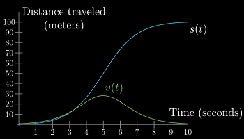
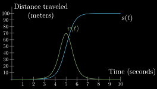
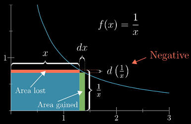
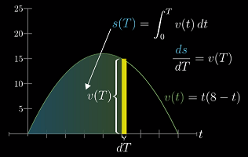
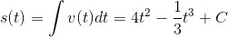
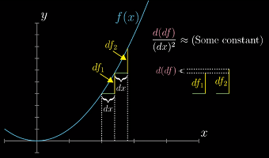

**说明**
---
- 整理自“[3Blue1Brown - 微积分的本质系列视频](https://www.bilibili.com/video/av24325548)”
- 本系列的视频**目的**在于帮助你建立关于**微积分的基本直觉**

**目录**
---
<!-- TOC -->

- [微积分（Calculus）引言](#微积分calculus引言)
  - [推导圆的面积 - 积分的直观理解](#推导圆的面积---积分的直观理解)
  - [积分与导数](#积分与导数)
- [导数（Derivative）的意义](#导数derivative的意义)
  - [“瞬时变化率”引起的歧义——导数的悖论](#瞬时变化率引起的歧义导数的悖论)
  - [导数的定义与计算](#导数的定义与计算)
- [用几何来求导](#用几何来求导)
- [直观理解链式法则](#直观理解链式法则)
  - [加法法则](#加法法则)
  - [乘法法则](#乘法法则)
  - [复合函数的求导法则——链式法则](#复合函数的求导法则链式法则)
- [指数函数的导数——自然常数 e 的定义](#指数函数的导数自然常数-e-的定义)
- [隐函数求导](#隐函数求导)
- [极限](#极限)
  - [导数的正式定义](#导数的正式定义)
  - [极限的 `(ϵ, δ)` 定义](#极限的-ϵ-δ-定义)
  - [利用导数来求极限——洛必达法则](#利用导数来求极限洛必达法则)
- [积分与微积分基本定理](#积分与微积分基本定理)
  - [积分与导数是一组互逆的运算](#积分与导数是一组互逆的运算)
  - [微积分基本定理](#微积分基本定理)
- [连续变量的平均值](#连续变量的平均值)
  - [适用“积分”的场景](#适用积分的场景)
- [泰勒级数](#泰勒级数)
  - [高阶导数](#高阶导数)
  - [泰勒多项式与泰勒级数](#泰勒多项式与泰勒级数)

<!-- /TOC -->

# 微积分（Calculus）引言

**微积分回忆**
- 求导公式
- 乘积法则
- 链式法则
- 隐函数求导
- 积分、微分的互逆关系
- 泰勒级数
- ...

**微积分的三个中心思想：**
1. 积分
1. 微分
1. 积分与微分（导数）的互逆

**（几位）微积分之父**
- 发现微积分：巴罗（Barrow）、牛顿（Newton）、莱布尼茨（Leibniz）
- 给出严格定义：柯西（Cauchy）、魏尔施特拉斯（Weierstrass）

本系列视频中，**微分的概念全部包含于导数之中**，所有导数都以 `df/dx` 的形式出现，也就是**微商**。

## 推导圆的面积 - 积分的直观理解

圆的面积公式：

**如何从积分的角度推导出圆的面积公式？**

不同的划分方法会带来不同的积分公式，下面考虑将圆划分为大量的同心圆环，这种方法保留了圆的对称性。

考虑其中一个环的面积，可以将其看做一个“类矩形”

虽然这不是标准的矩形，但只要`dr`越小，它就越接近。它的面积可表示为：

于是，圆的面积可以看作是这一系列矩形面积的叠加。

这部分面积的求和可以等价于求“**函数`y = 2πr`图像在区间`[0, R]`下的面积**”。

这个推导的过程其实可以看作是对函数`y = 2πr`在`[0, R]`下的积分。

## 积分与导数

直观来说，对函数`f(x)`在`[a, b]`上**积分**就是求函数`f(x)`在区间`[a,b]`下的图像与坐标轴包围的面积。记作：

dx)
> 这实际上是**定积分**的概念，此外还有不定积分。

如果是其他图像，比如抛物线，该怎么求这部分的面积呢？

能不能找到一个函数 `A(x)` 表示 `0` 到 `x` 之间函数图像下的面积？——这个函数 `A(x)` 就是该函数的**积分**（函数）。
> 这里强调 `0` 到 `x` 之间，是为了使问题具有实际意义

以抛物线 `f(x)=x^2` 为例。类似的，我们可以将这块区域划分成一系列细长的矩形。

将 `x` 增加 `dx`，增加的面积可以看做是一个长`f(x)`、宽`dx`的矩形，只要`dx`越小，这条窄带就越接近矩形。

把这部分面积记作 `dA`，表示面积的微小变化（difference in Area）

通过这个矩形，可以得到 `A`、`f(x)` 与 `dx` 之间的关系：

dx&space;\\&space;\Rightarrow&space;&&space;\frac{dA}{dx}\approx&space;f(x)&space;\\&space;\Rightarrow&space;&&space;\frac{A(x&plus;dx)-A(x)}{dx}&space;\approx&space;f(x)&space;\end{aligned}}})

这里引出了微积分中另一个重要的概念——**导数**。`dA/dx` 就是 "A 的导数"
> 更严格的说法是："A 的导数"是“当 `dx → 0` 时，`dA/dx` 所趋向的值”。（下一节会讨论导数的定义）
>
> 一般不会刻意区分**导数**和**导数函数**的区别，都统称为**导数**，具体含义视语境而定；同样，积分也是如此。

导数是解决积分问题的关键——积分需要还原出某个导数原本的函数——如果你能熟练的计算导数，那么你也能解决这个问题。

积分与导数之间的这种互相转化的关系，也就是“某个图像下方面积函数的导数能够还原出定义这个图像的函数”，就叫做**微积分基本定理**。该定理表明，“在某种意义上”，两者互为逆运算。

# 导数（Derivative）的意义

## “瞬时变化率”引起的歧义——导数的悖论

“瞬时变化率”的歧义——只有在不同的时间点之间，变化才能发生；而将时间限制在某个瞬间点的时候，变化也就不存在了。

考虑这个示例：一辆车从 A 点起，先加速，再减速，至 100 米外的 B 点停下，整个过程花费 10 秒。

把车速的图像加入其中，可以发现：两者存在着某种联系：其中之一改变的话，也会引起另一个发生变化。

<!-- 直觉上，速度越大，距离-时间函数的图像也越陡峭，意味着车在单位时间内移动的距离更长 -->

**速度的大小是如何随着距离-时间函数的变化而变化的？——“瞬时”速度的矛盾**：
- 在绘制速度图像的时候，需要给每个单独的时间点关联一个速度值，但是计算速度却需要两个时间点上的距离。
- 记时间差为 `dt`，距离差为 `ds`，那么这段时间内的速度就能用 `ds/dt` 表示

    
    > 当年的微积分创始人们也经历了同样的思维冲突。

- 换言之，速度只有在一段会时间内的才有意义；“瞬时”的说法会带来矛盾
- 实际的做法是：会选取一个很小的 `dt` 值，然后把 `ds/dt` 看做是这个瞬间的速度。

## 导数的定义与计算

**导数的定义**
- 在纯数学领域，**导数**不是 `dt` 为某个具体值时 `ds/dt` 的值 ，而是当 `dt` 的值**无限逼近 0 时**这个比值的**极限**。

    }{dt}=\underbrace{\frac{s(t&plus;dt)-s(t)}{dt}}_{dt\rightarrow&space;0}&space;\end{aligned})
    > 严格的定义在[[7. 极限](#7-极限)]一章给出

- 从图像的角度，（某一点的）导数有一个直观的含义：就是经过图像上该点切线的斜率。
- 注意：这里的 `dt` 不是“无穷小”，也不是 0；它永远是一个有限小的量，接近 0 而不是 0。
    > 这种说法在试图规避“瞬时”带来的矛盾，使“某个时间点的变化率”有意义。

**导数的计算**
- 抛开求导公式，先来看一下面对一个实际的问题，该如何求解（在某一点处的）导数。
- 对于 `s(t)=t^3` 在 `t=2` 处的导数，根据导数的定义，有

    }{dt}&space;&=\frac{s(t&plus;dt)-s(t)}{dt}\\&space;\Rightarrow&space;\frac{d(t^3)}{dt}&space;&=\frac{(t&plus;dt)^3-t^3}{dt}\\&space;&=\frac{t^3&plus;3t^2(dt)&plus;st(dt)^2&plus;(dt)^3-t^3}{dt}\\&space;&=3t^2&plus;3t(dt)&plus;(dt)^2&space;\end{aligned})

- 当 `dt` 趋向 0 时，后两项也会趋于 0，进而消去。代入 `t=2` 可以得到在该点处的导数为 12
- 更一般的，称 `s'(t) = 3*t^2` 为 `s(t) = t^3` 的**导函数**。

> 对于常见的函数，有一系列总结出的**求导公式**可以快速计算（下一节会演示如何从几何的角度来推导这些公式）

**导数的含义是“变化率的最佳近似”**
---
- 回顾之前关于距离-速度的示例，思考这个问题：当 `t=0` 时，车在不在移动？
- 一方面，利用导函数公式可以得到 `t=0` 时的速度为 0——这似乎在说“车没有移动”；另一方面，如果车在 0 时刻没有移动，那么它是何时开始移动的？——关键在于这个问题本身就是没有意义的。
- 因为**导数**并不是用来测量“瞬时变化”的。
- `t=0`点的导数为 0 的真正含义是指“在第 0 秒附近，车速的**最佳近似**为 0 米/秒”——换句话说，就是当时间间隔 `dt` 越来越小时，表示速度的比值 `ds/dt` 就越趋向于 0——这并不表示车在 0 时刻就是静止的，只能说它此时的速度近似于 0.

# 用几何来求导

为什么导数很重要？——当需要使用微积分来解决现实中的实际问题时，需要将其抽象成各种代表性的函数来描述；而如果能掌握这些抽象函数的变化率，那你就学会了这门可以精准描述事物变化率的语言。

**从几何的角度看“微小变化量”**
---
以 `f(x) = x^2` 为例：
- 从坐标轴上看，`x^2` 的图像是一条抛物线，我们已经知道，导数可以描述为切线的斜率
- 此外，`x^2` 还有另一个更直接的含义：长为 `x` 的正方形的面积。
- 假如给边长 `x` 一个微小的增量 `dx`，那么正方形的增量（变化量）是多少？

    

- 应该时刻记住的 `dx` 是一个微小的量——这意味着你可以**忽略所有次数高于 1 的 `dx` 项**——换言之，一个微小量的平方（或更高次方）是一个可以忽略的变化量
- 由此，可以得到：

    

- 上一节给出了 `f(x) = x^3` 导数的代数推导过程，这里也可以作为立方体体积来用几何的方式推导。
    
    

**负的变化量**
- 上述两个例子的变化量都是增量（正值），但实际上**变化量也可能是负值**，比如 `f(x) = 1/x`——考虑这样一个特殊的矩形，长 `x`，宽 `1/x`，它的面积恒为 1.

    
    > 注意：这里的变化量不再是矩形的面积了，而是**矩形的高**

- 通过简单的几何知识，可知矩形**高**的变化量为：

    =-(\frac{1}{x}-\frac{1}{x&plus;dx}))

- 从而得到 `1/x` 的导数为：

    =\frac{-dx}{x^2&plus;xdx}&space;\\&space;\Rightarrow&space;&&space;\frac{d(\frac{1}{x})}{dx}=\frac{-1}{x^2&plus;xdx}=-\frac{1}{x^2}&space;\end{aligned})
    
**幂函数的导数**
- 以上 `x^2`、`x^3` 和 `x^-1` 都遵循了幂函数的求导公式：

    }{dx}=nx^{n-1})
    
- 思考一下为什么这个公式也适用于 2 和 3 以外的指数——求导的一个关键点在于很大一部分项因为包含 `dx` 的高次幂，可以被忽略——因此有

    

- 当指数小于 0 时，会更复杂一些——比如 `x^-2` 可以考虑一个边长为 `√x` 的正方形。

大多数时候，我们都有合适的求导公式来使用，但是以上利用几何求导的过程能锻炼我们借助**微小变化量**来考虑的导数的能力。

**三角函数的导数**
- 正弦函数的定义

    
    
    - `θ=0.8` 表示单位圆弧长为 `0.8` 时对应的角度为 `θ`（单位圆的周长为 `2π`）
    - `sin(θ)` 表示此时该点距离 x 轴的高度（可能为负）
    - 当 `θ` 增加时，`sin(θ)` 的值会在 -1 到 1 之间上下摆动

- `sin(θ)` 当 `θ` 增加时的微小变化量

    
    - 在近似的观点下，应该有这样的直觉——可以把那一段微小的圆弧`dθ`看作是直线

- 根据三角函数的定义，有

    =\cos\theta\,d\theta\\\Rightarrow&space;&\frac{d(\sin\theta)}{d\theta}=\cos\theta&space;\end{aligned})

# 直观理解链式法则

**求导公式概览（3）**：
- 函数的和/差——加法法则
- 函数的积/商——乘法法则
- 复合函数的求导法则

## 加法法则

&plus;h(x))=\frac{dg}{dx}&plus;\frac{dh}{dx}\\&space;\end{aligned})

> 加法法则比较简单，可以在坐标轴中展示

## 乘法法则

“左乘**右导** + 右乘**左导**”：

h(x))=h(x)\frac{d\,g(x)}{dx}&plus;g(x)\frac{d\,h(x)}{dx}&space;\end{aligned})

> 在数学中，如果你要处理两项的乘积，用**面积**来理解会更方便

## 复合函数的求导法则——链式法则

**链式法则**：

)=\frac{dg(h(x))}{dh(x)}\frac{dh(x)}{dx}=\frac{dg}{dh}\frac{dh}{dx}&space;\end{aligned})

> 链式法则的表达式在说：看看输出值 g 的微小变化除以 h 的微小变化是多少（h 是要带入函数 g 中的值）；然后乘以 h 微小变化与 x 微小变化的比值

> 这些 `dh` 最终会被消去，结果就是输出值 g 的微小变化与输入值 x 的微小变化的比值
>
> `dh` 的消去并不只是符号上的技巧，而是真实反映出在求导时，各微小变化量发生了什么（？）

**了解这些求导法则 != 灵活的使用它们**

# 指数函数的导数——自然常数 e 的定义

**从`2^t`开始**：
- 根据导数的定义，有

    

- 当 `dt → 0` 时，`h` 趋向于一个常数 `0.6931...`
- 也就是说，`2^t` 图像上各点处**切线的斜率 = 该点的函数值 * 一个常数**

    
    > 原视频对 `2^t` 赋予了一些实际意义（质量）来说明其**变化量与自身成比例**

- 类似的，`3^t` 也存在这样一个 `h=1.0986...`；`8^t` 则是 `h=2.0794...`
- 注意到，`8^t` 的 `h` 大概是 `2^t` 的三倍，而 `8^t = 2^{3t}`

**是否存在某个数，使 `h` 恰为 `1`？——这个数就是自然常数 `e`**
- 不要问为什么当 `e^t` 时，`h=1`；因为 `e` 就是如此定义的。

    

    > 和“为什么 π 正好等于圆的周长比直径”一样，π 就是这么定义的。
    >
    > 自然常数不是完全这样发现的，但过程类似

**指数函数的导数**
- 有了自然常数 `e` 以及链式法则，就可以求出其他指数函数的导数了
- 根据指数函数的性质与链式法则，有

    }{dt}&space;&=\frac{d(e^{\ln(c)t})}{dt}\\&space;&=\ln(c)e^{\ln(c)t}=\ln(c)c^t&space;\end{aligned})

- 事实上，在微积分中，指数函数基本都是以 `e^ct` 的形式出现的，很少会直接使用 `c^t` 的形式

**为什么称 `e` 为自然常数？**
- 现实世界中，很多自然现象里的**变化率**与**变化量**是成正比的
- 比如：在室温环境下，热水变凉的速率与水和房间的温差成正比（或者说，温差的变化率与温差本身成正比）

    

- 尽管指数函数有多种写法，但是将其表达为以 `e` 为底的幂函数是非常自然的。
- 因为 `e` 有着非常自然的含义，它就是变化率与数量本身的比例系数。（？）

# 隐函数求导

**什么是隐函数？**
- 如果方程 `F(x,y)=0` 能确定 y 是 x 的函数，那么称这种方式表示的函数是隐函数；
- 直观来说，就是满足某种关于变量 x 和 y 的关系的、所有 `(x, y)` 点的集合，相应的曲线就是“隐函数曲线”。

**示例 1：圆上某一点切线的斜率**
---
- 圆的方程就是一个隐函数，比如 `x^2 + y^2 = 5^2`，下面需要求圆上一点的斜率（不考虑几何方法）

    

- 因为这里的曲线并不是一个函数图像，所以不能单纯对其求导——它不存在变量 x 的微小变化对函数值 y 的微小变化
- 当然，如果我们的目标只是求 `dy/dx`，那么对等式两边同时求导可以解决：

    =d(5^2)\\\Rightarrow&space;&2xdx&plus;2ydy=0\\\Rightarrow&space;&\frac{dy}{dx}=\frac{-x}{y}&space;\end{aligned})

- **为什么这么做？**

**示例 2：相关变化率**
---
- 这是一个更实际的例子：开始时，梯子上端距地面 4m(`y=4`)，下端距墙 3m(`x=3`)。如果梯子的上端以 `1 m/s` 的速度下滑，那么下端左滑的速度是多少？

    

- 等式的左边可以看做是一个关于时间 `t` 的函数，于是对**表达式左边**求导的含义相当于在问“经过短暂的时间 `dt`，`y` 会减少一点，`x` 会增加一点，那么整体的变化量是多少？”，而**表达式右边**告诉我们这个变化量为 `0`。
- 带入 `x(t)=3, y(t)=4, dy/dt=1`，就能求出 `dx/dt` 了。

**隐函数求导的含义**
- 从纯数学的角度看，示例 1 与示例 2 的做法没有区别。但是示例 2 求导时带有明确的物理意义——表达式随时间的变化率。但是求圆切线时似乎难以解释为什么这么做。
- 其实**隐函数的导数也是一个隐函数**，它对 `dx` 和 `dy` 的关系做了限制——在圆的例子上，它要求整体变化量 `dS = 2xdx + 2ydy` 为 0；也就是说为了让 `S = x^2 + y^2` 始终保持在 25，那么 `dS` 就需要为 0.
    > 严格来讲，这个条件实际上是保证每一步落在过该点的切线上，而不是落在圆本身。当 `dx` 和 `dy` 足够小时，这两者才没有区别。
    >
    > 在隐函数的导数中，原来的变量看做常数，比如这里 `2xdx + 2ydy = 0` 中的 `x` 和 `y`

    
    
    > 显然，（左）的正体变化量就不满足使 S 保持不变

**示例 3：`sin(x)y^2 = x`**
---
- 该函数的图像是一系列 U 型曲线

    
    > 有了这个等式，就能方便求出 `dy/dx` 了。

- 对表达式的两边求导，就可以得到导数的隐函数，它对 `x` 和 `y` 的整体微小变化量作出了限制。

**示例 4：`ln(x)`的导数——从已有的导函数推算出其他函数的导函数**
- 根据指数函数与对数函数的关系，有

    \\\Rightarrow&space;&e^y=x\\\Rightarrow&space;&e^ydy=dx\\\Rightarrow&space;&\frac{dy}{dx}=\frac{1}{e^y}=\frac{1}{e^{\ln(x)}}=\frac{1}{x}\\\Rightarrow&space;&\frac{d\ln(x)}{dx}=\frac{1}{x}&space;\end{aligned})

**多元微积分**
- 隐函数求导是**多元微积分**的入门。两者的要点是一样的，需要理解这多个变量是如何联系在一起变化的。

# 极限

简单来说，“极限”就是逼近/趋近更“洋气”的说法。

## 导数的正式定义
- 在[[2.2. 导数的定义与计算](#22-导数的定义与计算)]已经给出了导数的计算公式：

    }{dx}=\underbrace{\frac{f(x&plus;dx)-f(x)}{dx}}_{dx\rightarrow&space;0}&space;\end{aligned})

    导数的正式定义：

    }{dx}=\lim_{\Delta&space;x&space;\to&space;0}\frac{f(x&plus;\Delta&space;x)-f(x)}{\Delta&space;x}&space;\end{aligned})
    
    或

    }{dx}=\lim_{h&space;\to&space;0}\frac{f(x&plus;h)-f(x)}{h}&space;\end{aligned})
    
    > 为什么不用 `dx`？——`dx` 本身已经表达了求极限的含义——使用 `dx` 的表示容易将其理解成“无穷小的变化量”；**更正确的**解读应该是把它看做一个具体的、有限小的变化量，并时刻考虑 `dx → 0` 时的情况（[3. 用几何来求导](#3-用几何来求导)）。
    >
    > 为什么用一个新的变量 `h`？——明确变化量 `h` 只是一个普通的数，跟“无穷小”没有任何关系。

## 极限的 `(ϵ, δ)` 定义

所谓极限，指的是变量逼近 0 时的影响，而非无穷小变量的影响

导数由极限定义，而极限本身由 `(ϵ, δ)` 定义，下面是比较书面的说法：

> 设函数`f(x)`在点`x0`的某一**去心邻域**内有定义，如果存在常数`a`，对于任意给定的正数`ϵ`，都`∃δ>0`，使不等式`|f(x)-a| < ϵ`在`|x-x0| ∈ (0,δ)`恒成立，那么`a`就叫做函数`f(x)`当`x→x0`时的极限，记作
>
> =a&space;\end{aligned})

**极限存在与不存在的两个例子**

> 极限存在的前提是，你总能在距离极限点`x0`距离为`δ(>0)`的取值范围内，找到一系列取值点，使得范围内的任一取值点，它的函数值都在距离`f(x0)`为`ϵ(>0)`的范围内——关键在于这种情况对于任意`ϵ`都成立——无论`ϵ`多小，你总能找到与之对应的`δ`

## 利用导数来求极限——洛必达法则

如果函数在点`x0`处是有定义的，那么该点的极限值 == 函数值本身。

如果函数在该点没有定义呢？比如 `sin(πx)/(x^2-1)`，该函数在`x0=±1`处就没有定义。

**洛必达法则**
- 洛必达法则专门用于求解 `0/0` 型和 `∞/∞` 的极限值。
- 导数是由极限定义的，但反过来，也能利用导数来求极限
- 洛必达法则利用了这样一个性质——当`f(a)=0`时，在`a`的附近，有`f(a+dx)=f'(a+dx)`。如图所示：

    
    > 当 `dx` 越小，这个比值就越精确

- 洛必达法则：

    }{g(x)}=\lim_{x&space;\to&space;a}\frac{f%27(x)}{g%27(x)}=A&space;\end{aligned})
    > 条件：1）`f(x)`和`g(x)`在点`a`处的极限都为 0；2）`f(x)`和`g(x)`在点`a`的某去心领域内可导，且`g'(x)!=0`；3）`A`可以为实数，也可以为`±∞`
    >
    > 注意，只要满足以上条件，洛必达法则是可以继续进行的

    }{g(x)}=\lim_{x&space;\to&space;a}\frac{f%27(x)}{g%27(x)}=\lim_{x&space;\to&space;a}\frac{f%27%27(x)}{g%27%27(x)}=...&space;\end{aligned})
    

- 这么看，实际上，求解导数的过程也是在使用洛必达法则

    }{dx}=\lim_{h&space;\to&space;0}\frac{f(x&plus;h)-f(x)}{h}&space;\end{aligned})
    > 分子分母在 `h→0` 处的极限都为 `0`

# 积分与微积分基本定理

在[1.2. 积分与导数](#12-积分与导数)就提到过，积分其实就是求导的逆运算

**示例：距离是速度对时间的积分**
---
- 已知速度-时间的关系 `v(t)=t(8-t)`，求这段时间驶过的距离。
- 在[[2.1. 节](#21-瞬时变化率引起的歧义导数的悖论)]介绍这个例子时，是“已知距离函数`s(t)`，来推导速度函数`v(t)`”；现在“已知每个时间点的速度 `v(t)`，来求距离`s(t)`”
- 从数学的角度，前者的问题等价于求“`s(t)`的导数”，于是现在的问题也就是求“哪个函数的导数是`v(t)`”——这通常被称为“求函数的‘**原函数**’（或‘反导数’）”

    

- 类比[[1.1. 节](#11-推导圆的面积---积分的直观理解)]中推导圆面积的公式，这个问题可以转化成求解曲线下方的面积

    

- 这个过程可以表示为 `v(t)` 的“积分”：

    
    > 为什么不适用`∑`？——`∫`指的并不是具体的`dt`的加和，而是当`dt→0`时，加和逼近的值，这个逼近的值就是曲线下方的面积；当`dt`越趋近 0，加和就越趋近精确解。
    >
    > 积分的含义就是将所有小量“累积”在一起

- “求函数图像与横轴围成的面积”是许多不相干问题的共通之处——可以被拆成小量，然后近似为这些小量的和

## 积分与导数是一组互逆的运算
- 根据以上的分析，距离实际上是速度对时间的积分，而速度是距离对时间的导数——这表明**积分与导数是一组互逆的运算**

**面积函数的导数等于函数本身**
- 如果固定左端点，将右端点当做一个变量 `T`，那么这个积分可以看做以**上限为自变量**的函数 `s(T)`——这是距离关于时间的导数，同时也是图形下方的**面积函数**
- 这表明任一**函数图像下方面积函数的导函数等于该函数本身**

    
    <!-- > `v(t)` 图像下方的面积就代表 `T` 秒后经过的路程 -->
    - **从几何的角度看**，矩形的面积为 `ds`，宽为 `dT`，它的高为 `v(T)`，于是有 `ds/dT = v(T)`
    - 即**图像所表示的函数就是面积函数的导数**

- 因此，求解积分的过程就是求导的**逆过程**

    
    
    

**每个函数都有无数个原函数**
---
- 因为常数的导数为 0，所以在原函数的基础上加上任意常数，其导数不变——这意味着每个函数的原函数有无数个
- 所以`v(t) = 8t - t^2`正确的原函数应该是

    =\int&space;v(t)dt=4t^2-\frac{1}{3}t^3&plus;C&space;\end{aligned})

- 从图像上来看，曲线上下移动并不会影响其在每一点的斜率

    

- 在不同的问题中，一般会有额外的条件帮你决定该使用哪个原函数
    - 比如，在本问题中，`t=0` 时，`s(t)=0`，于是 `C=0`

## 微积分基本定理
- 在对任意函数求（定）积分时，你是在对 `x` 在**一定范围内**的所有 `f(x)*dx` 求和，而积分值就是 `dx → 0` 时，这个和趋近的值。
- 求积分的第一步是找出原函数 `F`，使其导数为积分内的函数。
- 积分值就等于原函数在上限时的值减去其在下限时的值。
- 这个过程就是“微积分基本定理”

    

- 积分异于常识的一点在于：它**连续地**遍历了从下限到上限中的每一个自变量的值，而我们在利用原函数求值时，只需要关注上限与下限两个自变量

**负面积**
---
- 如果图像有部分出现在横轴的下方，那么这部分就是**负面积**

    
    > 有符号的面积

- 积分计算的不是真正的面积，而是图像与横轴围城的带有正负的面积。

# 连续变量的平均值

结论：**区间上的平均斜率等于起点和终点连线的斜率**
---
**如何求连续变量的平均值？**
- 问题等价于求图像下方面积的平均高度
- 如果把面积作为一个整体来看，这是一个很简单的问题——`平均高度 = 积分面积 / 上下限宽度`

    

- 值得注意的是，`(F(b)-F(a))/(b-a)` 实际上也是原函数`F(x)`在 `x=a` 和 `x=b` 两点连线的斜率
- 这表明在某一区间上所有点处切线的**平均斜率**等于起点和终点连线的斜率
    > 根据定义，`f(x)`是其原函数`F(x)`的导函数，也就是说它给出了`F(x)`在每个点上切线的斜率，所以`f(x)`在`(a,b)`上的平均值也就是原函数从`x=a`到`x=b`上所有切线斜率的平均值。

- 换言之，求解连续函数的平均值，可以转化为求解其原函数在各点切线的平均斜率；而两点间的平均斜率等于这两点的斜率。

## 适用“积分”的场景
---
第[8章](#8-积分与微积分基本定理)和第[9章](#9-连续变量的平均值)给出了两个适用于**积分**的场景
- 可以通过细分然后相加的方式进行估算时
- 求解连续变量的均值时（特别在概率中）

# 泰勒级数

## 高阶导数

这里介绍高阶导数的目的是帮助得到函数的近似——泰勒级数

**二阶导数描述的是曲线的弯曲程度**
- 根据导数的定义，二阶导数也就是导数的微小变化率，即斜率的变化率——直观来看，也就是**曲线的弯曲程度**

    
    - 考虑函数的一个取值 `x`，然后向右连续的增加两个小量 `dx`
    - 第一个增量是函数产生了第一个变化量 `df1`，第二个同理，记 `df2`
    - 这两个变化量的差也就是**函数值变化量的变化量**，记 `d(df)`. 它和 `(dx)^2` 成正比
    - 所谓二阶导数，就是 `d(df)` 和 `(dx)^2` 当 `dx → 0` 时比值的极限

- 用符号表示为
    
    }{dx}=\frac{d(df)}{(dx)^2}=\frac{d^2f}{dx^2}}_{dx&space;\to&space;0}&space;\end{aligned})
    > 其实中间的写法才是最正确的，但为了书写方便，通常写成最右侧的形式
    
- 一个理解二阶导数的现实示例就是加速度

    
    > 二阶导数为正，说明车在加速；反之，为负，说明在减速

## 泰勒多项式与泰勒级数

泰勒级数的作用——函数近似工具。比如，在 `x=0` 附近，有：

泰勒级数利用**多项式函数**去近似复杂抽象的函数，从而化简问题
- 多项式函数的优势：易计算、易求导、易积分
- 深度学习中的梯度下降（一阶）、牛顿法（二阶）也是利用的泰勒级数

**示例：`cos(x)` 在 `x=0` 附近如何用二次多项式近似？**
---
- 问题等价于在所有可能的 `c0 + c1*x + c2*x^2` 中确定系数使其在 `x=0` 附近最近似 `cos(x)`
- 不考虑任何先验知识，看看只凭直觉应该怎么确定这三个系数
    - 首先，`cos(x)` 在 `x=0` 处等于 1，那么至少多项式这一点要满足，即 `c0=1`
    - 如果多项式在 `x=0` 处切线的斜率也与 `cos(x)` 相同，那么近似程度应该会更高，于是 `c1=0`
    - 二阶导数描述的是曲线的弯曲程度，那么让两个图像在 `x=0` 处的弯曲程度相同应该会更近似，`cos(x)` 的二阶导是 `-cos(x)`，于是 `2c2=-cos(0)=-1 -> c2=-1/2`
    - 还可以用更高次的多项式去近似，比如

        

    - 在非 0 点，有类似的结果，如 `x=π`

        
        > 带入 `x=π` 就能消去所有无关项

- “**泰勒多项式**”小结
    - 在对高阶多项式求导时，自然而然的出现了**阶乘**的形式
    - 当然，真正的系数需要除以这个阶乘

        

    - 在向近似多项式中添加更高次的项时，不会影响低次项
    - 因此，多项式任意 n 阶的导数在 `x=0` 时的值都由唯一的系数控制

        

    - 这样的多项式就称为“泰勒多项式”

**泰勒多项式**的本质
---
泰勒多项式实际上是利用函数在某点处的高阶导数，来近似该点附近的函数值

宏观来讲：泰勒级数把某一点处高阶导数的信息转化成了在那一点**附近**的函数值信息
- `x=0` 时，它的常数项能让它与 `f(0)` 的值相等

    

- 它的一次项让两者的斜率相等

    

- 二次项让两者斜率的变化率相同

    
    
- 以此类推，项数越多，近似就越精确

    
    
    

**从几何角度看二阶泰勒多项式**
- 考虑如何近似曲线下的面积函数 `f_area(x)`

    
    - 当 `dx → 0` 时，我们可以将增长的部分近似为矩形
    - 但如果想将面积的变化近似得更准确，就需要考虑那块**近似三角形**的部分
    
- 假设已知面积函数 `f` 在 `a` 点的导数信息，想要近似在 `x` 时的面积

    
    > 三角形的高 = `斜率 * 底`，斜率 = 曲线在 a 点的导数 = `f''(a)`

**任意函数的泰勒多项式**
---
- 函数`f(x)`在`x=0`处的泰勒多项式

    =f(0)&plus;\frac{f%27(0)}{1!}x&plus;\frac{f%27%27(0)}{2!}x^2&plus;\frac{f^{(3)}(0)}{3!}x^3&plus;\cdots&space;\end{aligned})

- 函数`f(x)`在`x=a`处的泰勒多项式

    =f(a)&plus;\frac{f%27(a)}{1!}(x-a)&plus;\frac{f%27%27(a)}{2!}(x-a)^2&plus;\frac{f^{(3)}(a)}{3!}(x-a)^3&plus;\cdots&space;\end{aligned})

**级数的概念**
---
**级数（series）的定义**——无限项的和
- 当泰勒多项式无限累加下去，就成了泰勒级数

**级数的一些重要概念**
---
- **级数的收敛（Converges）与发散（diverges）、收敛半径**

    
    > 无限累加下去的和就“等于”级数收敛到的值；这里 `x=1`

    - 一些级数无论你带入什么值，它的级数都会收敛，比如 `e^x` 在 `x=0` 处的泰勒级数

        
        
        > 无论 `x` 取何值，`e^x` 都等于该泰勒级数
    
    - 但有些级数就只会在一定取值范围内才会收敛，比如 `ln(x)` 在 `x=1` 处的泰勒级数

        
        
        - 只有当 `x∈(0,2]`时，该级数才会收敛
        - 换言之，在 `x=1` 处取得的导数信息无法拓展到更广的取值范围
        - 这个泰勒级数的**收敛半径**为 `1`，即`x∈(0, 2]`

**常见的泰勒级数**
> 泰勒级数_百度百科 https://baike.baidu.com/item/泰勒级数/7289427?fr=aladdin#6

**泰勒级数的更多内容**
- 拉格朗日余项
- 判断级数收敛——审敛法
- 求收敛半径
- ...

本系列的视频目的是帮你建立关于微积分的基本直觉，而微积分的道路才刚刚开始...
---

