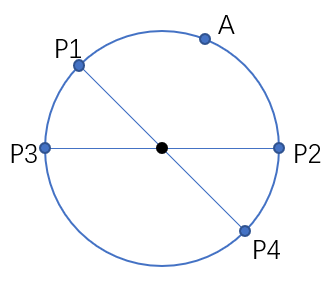
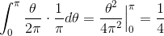

**知识回顾**
---
- [微积分的本质](./微积分的本质.md)
- [深度学习的核心-梯度下降与反向传播](./深度学习的核心.md)

**数学问题**
---
<!-- TOC -->

- [1. 在圆环上随机选取 3 个点，这 3 个点组成锐角三角形的概率](#1-在圆环上随机选取-3-个点这-3-个点组成锐角三角形的概率)

<!-- /TOC -->

### 1. 在圆环上随机选取 3 个点，这 3 个点组成锐角三角形的概率
> 今日头条-算法工程师-实习

- 答案：1/4

- 简单回答：易知，当A、B、C三点都在同一个半圆内时，三角形ABC必是直角或钝角三角形；只有当三点不在同一个半圆内，才可以组成锐角三角形。于是问题等价于“在圆周上任取三个不同的点，求它们不在同一半圆内的概率”。
    - 过圆心**任取**两条直线，并在圆上**任取**一点作为点 A；
        

    - 接着在候选的 P1~P4 中选择 B 和 C，有四种情况：`{P1, P2}、{P1, P2}, {P2, P3}, {P3, P4}`。当且仅当选中 `{P3, P4}` 时，能够成锐角三角形（或者说包含圆心），概率为 `1/4`.

- 积分计算

    

    > [在一圆周上任意取三个点构成锐角三角形的概率是多少](https://zhidao.baidu.com/question/1884315387170029428.html) - 百度知道 

- 拓展：球面上任取 4 个点，求这 4 个点构成的四面体包含球心的概率。
    > [【官方双语】如何优雅地解答最难数学竞赛的压轴题？](https://www.bilibili.com/video/av17275211) - bilibili 
    >> 关于圆上取三个点的情况在 1:50-4:25, 5:40-7:50
