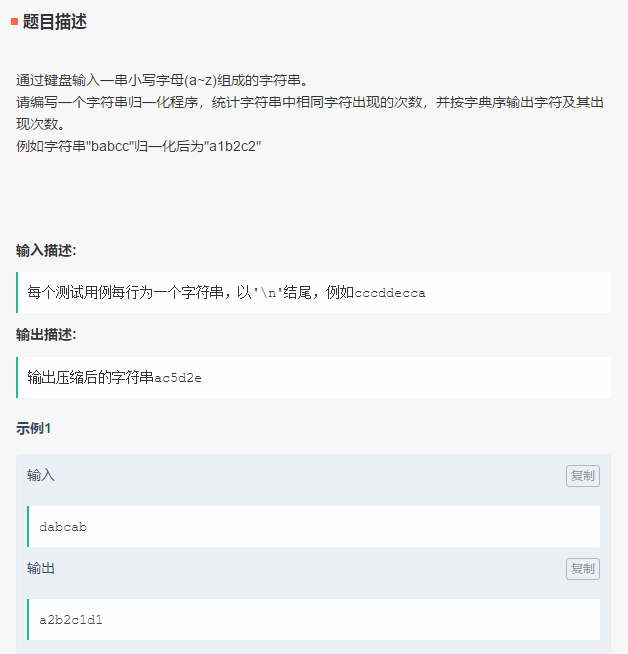
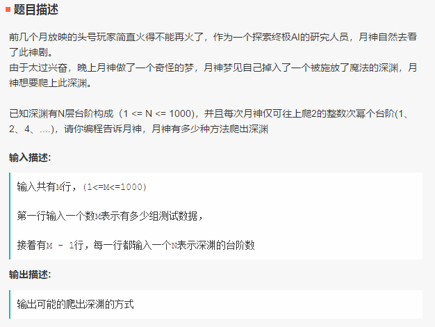
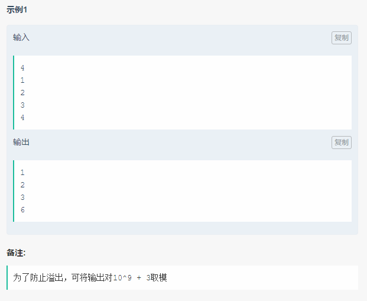
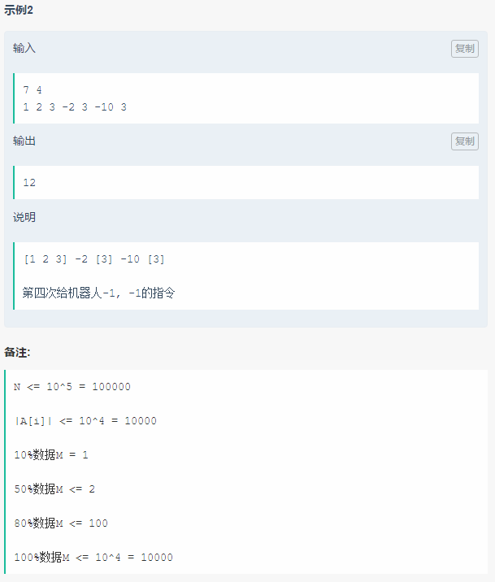

笔试-快手-180910
===
- 单选 20；编程 3


Index
---
<!-- TOC -->

- [字符串归一化](#字符串归一化)
- [魔法深渊](#魔法深渊)
- [善变的同伴](#善变的同伴)

<!-- /TOC -->


### 字符串归一化
<div align="center"></div>

**Python**（AC）
```
from collections import Counter

s = input()
c = Counter(s)

res = ""
for key in sorted(c.keys()):
    res += key
    res += str(c[key])

print(res)
```

### 魔法深渊
<div align="center"></div>
<div align="center"></div>

**Python**（AC）
```
def foo(n):
    dp = [0] * (n + 1)
    dp[0] = 1

    for i in range(1, n + 1):
        j = 1
        while j <= n:
            if i < j:
                break
            dp[i] = dp[i] + dp[i - j]
            j = j * 2
    return dp[n] % 1000000003


N = int(input())
for i in range(N):
    n = int(input())
    print(foo(n))
```

### 善变的同伴
<div align="center"></div>
<div align="center"></div>
<div align="center"></div>

**思路**
```
作者：n不正
链接：https://www.nowcoder.com/discuss/106768
来源：牛客网

1、先把整个数组改成正负交错的数组，去掉首尾的负数(相邻的正数合并成一个正数，负数合并成一个负数) 
2、如果正数个数<=M，输出所有的正数之和
3、如果正数个数>M，将数组中[正负正]合并，该负数为数组中负数的最大值并且三者之和>三者最大值
4、直到3不满足或者正数个数<=M,输出最大的M个正数之和 
```

**Python**（未测试）
- 按照上述思路实现的代码
```
# N, M = list(map(int, input().split()))
# ns = list(map(int, input().split()))
N, M = 7, 3
ns = [1, 2, 3, -2, 3, -10, 3]

new_ns = [ns[0]]

for i in ns[1:]:
    if i == 0:
        continue
    if (new_ns[-1] > 0) == (i > 0):
        new_ns[-1] += i
    else:
        new_ns.append(i)

# print(new_ns)  # [6, -2, 3, -10, 3]

# 去掉首尾的负数块
if len(new_ns) >= 1 and new_ns[0] < 0:
    new_ns.pop(0)

if len(new_ns) >= 1 and new_ns[-1] < 0:
    new_ns.pop(-1)

# print(new_ns)  # [6, -2, 3, -10, 3]

# 按奇偶划分奇数和偶数块
ns_pos = new_ns[0::2]
ns_neg = new_ns[1::2]
cnt_pos = len(ns_pos)
# print(cnt_pos)  # 3
# print(ns_pos)  # [6, 3, 3]
# print(ns_neg)  # [-2, -10]

# 如果 M 的值小于正数块的数量则进行合并
updated = True
while updated and M < cnt_pos:
    """"""
    updated = False

    mx_i = 0
    # mx = max(ns_pos[mx_i] + ns_pos[mx_i+1] + ns_neg[mx_i], ns_pos[mx_i], ns_pos[mx_i])
    mx = float("-inf")
    for i in range(len(ns_neg)):
        tmp = ns_pos[i] + ns_pos[i+1] + ns_neg[i]
        if tmp < max(ns_pos[i], ns_pos[i+1]):  # 如果合并后减小则不合并
            continue
        if tmp > mx:
            updated = True
            mx = tmp
            mx_i = i

    if updated:
        # 更新合并后的数组
        ns_neg.pop(mx_i)
        ns_pos[mx_i] = mx
        ns_pos.pop(mx_i+1)
        cnt_pos -= 1

    # print(ns_pos)
    # print(ns_neg)

ns_pos.sort(reverse=True)
print(sum(ns_pos[:M]))
```