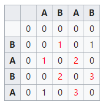
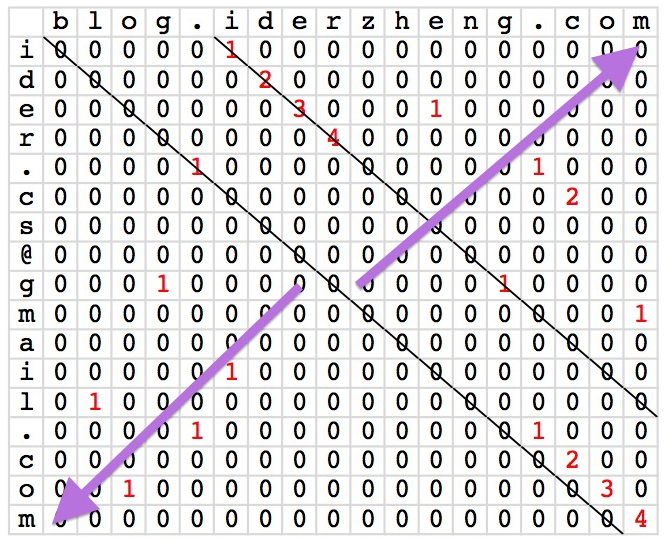

专题-动态规划
===

DP 问题的一般思路
---
- **DP 定义** ——有时 DP 的更新很难严格遵循定义，需要额外变量保存全局最优结果
- **初始化** ——初始值可以通过一个简单的特例来确定
- **递推公式** + **边界条件**
- **DP 优化** （可选）

<!-- 
DP 的理解 TODO
//---
- DP 实际上是一种复杂的“迭代”过程，而“迭代”与“递归”是可以互相转化的
  - 递归调用的是方法本身，用同样的过程去解一个规模更小的子问题，得到子问题的解
  - DP 调用的是子状态，子状态保存了一个子问题的解，子状态通过**递推公式**计算获得
  > 《计算机程序的构造与解释》 
-->

Reference
---
- [常见的动态规划问题分析与求解 - 五岳](https://www.cnblogs.com/wuyuegb2312/p/3281264.html) - 博客园
- [什么是动态规划？动态规划的意义是什么？](https://www.zhihu.com/question/23995189 ) - 知乎 

Index
---
<!-- TOC -->

- [背包问题](#背包问题)
    - [【注】关于“恰好装满”](#注关于恰好装满)
    - [01 背包](#01-背包)
        - [二维 DP（无优化）](#二维-dp无优化)
        - [二维 DP（滚动数组）](#二维-dp滚动数组)
        - [一维 DP](#一维-dp)
    - [完全背包](#完全背包)
        - [二维 DP（无优化）](#二维-dp无优化-1)
        - [二维 DP（滚动数组）](#二维-dp滚动数组-1)
        - [一维 DP](#一维-dp-1)
    - [多重背包 TODO](#多重背包-todo)
- [硬币问题](#硬币问题)
    - [硬币找零](#硬币找零)
    - [硬币组合](#硬币组合)
- [最长公共子序列（LCS）](#最长公共子序列lcs)
    - [最长公共子串](#最长公共子串)
- [最长递增子序列（LIS）](#最长递增子序列lis)
- [最长回文子序列](#最长回文子序列)
    - [最长回文子串](#最长回文子串)
- [最大连续子序列和](#最大连续子序列和)
- [编辑距离](#编辑距离)
- [矩阵中的最大正方形](#矩阵中的最大正方形)
- [鹰蛋问题](#鹰蛋问题)
- [矩阵链乘法 TODO](#矩阵链乘法-todo)
- [有代价的最短路径 TODO](#有代价的最短路径-todo)
- [瓷砖覆盖（状态压缩DP） TODO](#瓷砖覆盖状态压缩dp-todo)
- [工作量划分 TODO](#工作量划分-todo)
- [三路取苹果 TODO](#三路取苹果-todo)

<!-- /TOC -->

## 背包问题

### 【注】关于“恰好装满”
- **如果要求恰好装满背包**，可以在初始化时将 `dp[0] / dp[i][0]` 初始化 `0`，其他初始化为 `-INF`。这样即可保证最终得到的 `dp[N] / dp[N][M]` 是一种恰好装满背包的解；
- **如果不要求恰好装满**，则全部初始化为 `0` 即可。
- 可以这样理解：初始化的 dp 数组实际上就是在没有任何物品可以放入背包时的合法状态。
  - 如果要求背包恰好装满，那么此时只有**容量为 0** 的背包可能被**价值为 0** 的物品“**恰好装满**”，其它容量的背包均**没有合法的解**，属于未定义的状态，它们的值就都应该是 `-INF` 。
  - 如果背包并非必须被装满，那么任何容量的背包都有一个合法解，即“什么都不装”，这个解的价值为0，所以初始时状态的值也全部为 0 。

### 01 背包
> [HDOJ - 2602](http://acm.hdu.edu.cn/showproblem.php?pid=2602)

**问题描述**
```
有 n 个重量个价值分别为 w_i, v_i 的物品。
从这些物品中选出总重量不超过 W 的物品，使其总价值最大。

示例
1                // 用例数
5 10             // 物品数 背包容量 N <= 1000 , V <= 1000
1 2 3 4 5
5 4 3 2 1

14
```

#### 二维 DP（无优化） 

- **定义**：`dp[i][j] := 从前 i 个物品中选取总重量不超过 j 的物品时总价值的最大值`
    > `i` 从 1 开始计，包括第 `i` 个物品
- **初始化**
    ```
    dp[0][j] = 0
    ```
- **状态转移**
    ```
    dp[i][j] = dp[i-1][j]            if j < w[i] （当前剩余容量不够放下第 i 个物品）
             = max{                  else （取以下两种情况的最大值）
                    dp[i-1][j],             // 不拿第 i 个物品
                    dp[i-1][j-w[i]] + w[j]  // 拿第 i 个物品
                  }
    ```
```C++
// HDOJ 地址：http://acm.hdu.edu.cn/showproblem.php?pid=2602
int solve(int N, int V, vector<int>& v, vector<int>& w) {

    vector<vector<int> > dp(N + 1, vector<int>(V + 1, 0));  // 不要求装满，初始化为 0 即可

    // 核心代码
    for (int i = 1; i <= N; i++) {
        for (int j = 0; j <= V; j++) {  // 可能存在重量为 0，但有价值的物品
            if (w[i] > j)               // 如果当前物品的重量大于剩余容量
                dp[i][j] = dp[i - 1][j];
            else
                dp[i][j] = max(dp[i - 1][j], dp[i - 1][j - w[i]] + v[i]);
        }
    }
    return dp[N][V];
}

int main() {
    int T;      // 用例数
    scanf("%d", &T);
    while (T--) {
        int N, V;                   // N: 物品数量；V: 背包容量
        scanf("%d%d", &N, &V);
        vector<int> v(N + 1, 0);    // 保存每个物品的价值
        vector<int> w(N + 1, 0);    // 保存每个物品的重量
        for (int i = 1; i <= N; i++)
            scanf("%d", &v[i]);
        for (int i = 1; i <= N; i++)
            scanf("%d", &w[i]);

        int ans = solve(N, V, v, w);

        printf("%d\n", ans);
    }
    return 0;
}
```

#### 二维 DP（滚动数组）

- 在上述递推式中，`dp[i+1]` 的计算实际只用到了 `dp[i+1]` 和 `dp[i]`；
- 因此可以结合**奇偶**，通过两个数组滚动使用来实现重复利用。

```C++
// HDOJ 地址：http://acm.hdu.edu.cn/showproblem.php?pid=2602
int solve(int N, int V, vector<int>& v, vector<int>& w) {

    //vector<vector<int> > dp(N + 1, vector<int>(V + 1, 0));  // 不要求装满，初始化为 0 即可
    vector<vector<int> > dp(2, vector<int>(V + 1, 0));  // N+1 -> 2

    // 核心代码
    for (int i = 1; i <= N; i++) {
        for (int j = 0; j <= V; j++) {  // 可能存在重量为 0，但有价值的物品
            if (w[i] > j)               // 如果当前物品的重量大于剩余容量
                dp[i & 1][j] = dp[(i - 1) & 1][j];
            else
                dp[i & 1][j] = max(dp[(i - 1) & 1][j], dp[(i - 1) & 1][j - w[i]] + v[i]);
        }
    }
    return dp[N & 1][V];  // 这里别忘了 N & 1
}

// main 函数略
```

#### 一维 DP
- **定义**：`dp[j] := 重量不超过 j 公斤的最大价值`
- **递推公式**
    ```
    dp[j] = max{dp[j], dp[j-w[i]] + v[i]}     若 j > w[i]
    ```
  
```C++
// HDOJ 地址：http://acm.hdu.edu.cn/showproblem.php?pid=2602
// 一维 DP（滚动数组）
int solve(int N, int V, vector<int>& v, vector<int>& w) {

    vector<int> dp(V + 1, 0);

    // 核心代码
    for (int i = 1; i <= N; i++) {
        for (int j = V; j >= w[i]; j--) {           // 递推方向发生了改变
            dp[j] = max(dp[j], dp[j - w[i]] + v[i]);
        }
    }

    return dp[V];
}

// main 函数略
```

### 完全背包
> [NYOJ - 311](http://nyoj.top/problem/311)

**问题描述**
```
01 背包中每个物品只有一个，所以只存在选或不选；
完全背包中每个物品可以选取任意件。

注意：本题要求是背包恰好装满背包时，求出最大价值总和是多少。如果不能恰好装满背包，输出 NO
```

#### 二维 DP（无优化）

- **直观思路**：在 01 背包的基础上在加一层循环
- **递推关系**：
    ```
    dp[0][j] = 0
    dp[i][j] = max{dp[i - 1][j - k * w[i]] + k * v[i] | 0 <= k}
    ```
    ```
    for (int i = 1; i <= N; i++) {
        for (int j = 0; j <= V; j++) {  // 可能存在重量为 0 的物品
            for (int k = 0; k * w[i] <= j; k++)
                dp[i][j] = max(dp[i][j], dp[i-1][j - k*w[i]] + k*v[i]);
        }
    }
    ```
  - 关于 `k` 的循环最坏可能从 0 到 `V`，因此时间复杂度为 `O(N*V^2)` 
- **注意到**：
    ```
    dp[i][j] = max{dp[i - 1][j - k*w[i]] + k*v[i] | 0 <= k}
                                                    ------
             = max{dp[i - 1][j], max{dp[i - 1][j - k*w[i]] + k*v[i]} | 1 <= k}
                                                                       ------
             = max{dp[i - 1][j], max{dp[i - 1][(j-w[i]) - k*w[i]] + k*v[i] | 0 <= k} + v[i]}
                                               --------                      ------  ------
                                 ---------------------------------------------------
             = max{dp[i - 1][j], dp[i][j - w[i]] + v[i]}
                                 ---------------
    ```
    ```
    for (int i = 1; i <= N; i++) {
        for (int j = 0; j <= V; j++) {
            if (w[i] > j)
                dp[i][j] = dp[i - 1][j];
            else
                dp[i][j] = max(dp[i - 1][j], dp[i][j - w[i]] + v[i]);
            //  dp[i][j] = max(dp[i - 1][j], dp[i - 1][j - w[i]] + v[i]); // 对比 01 背包
            //                               ---------（唯一区别）
        }
    }
    ```
- **完整代码**
  - 注意，这里要求的是恰好装满时的情况，所以需要将 `dp[i][0]` 全部初始化为 0，其他初始化为 `-INF`
    > 以下代码因**超内存**无法通过 NYOJ 311；
    >
    > 可以 AC 的代码，请参考 [完全背包（一维 DP）](#完全背包一维-dp) 和 [完全背包（滚动数组）](#完全背包滚动数组)
    ```C++
    // NYOJ 311 会报超内存，所以无法测试
    #include <cstdio>
    #include <vector>
    #include <algorithm>
    using namespace std;

    const int inf = 0x80000000;

    void solve() {
        int T;
        scanf("%d", &T);
        while (T--) {
            int N, V;       // N 表示物品种类的数目，V 表示背包的总容量
            scanf("%d%d", &N, &V);
            vector<int> w(N + 1), v(N + 1);  // w 表示重量，v 表示价值
            for (int i = 1; i <= N; i++)
                scanf("%d%d", &w[i], &v[i]);

            vector<vector<int> > dp(N + 1, vector<int>(V + 1, inf));
            for (int i = 0; i <= N; i++)
                dp[i][0] = 0;

            for (int i = 1; i <= N; i++) {
                for (int j = 0; j <= V; j++) {
                    if (j < w[i])
                        dp[i][j] = dp[i - 1][j];
                    else
                        dp[i][j] = max(dp[i - 1][j], dp[i][j - w[i]] + v[i]);
                }
            }

            if (dp[N][V] > 0)
                printf("%d\n", dp[N][V]);
            else
                puts("NO");
        }
    }

    int main() {
        solve();
        return 0;
    }
    ```

#### 二维 DP（滚动数组）
```C++
// NYOJ 311-完全背包: http://nyoj.top/problem/311 （未通过测试，报运行时错误）
#include <cstdio>
#include <vector>
#include <algorithm>
using namespace std;

void solve3() {
    const int MAX_V = 50000 + 10;
    const int inf = 0x3f3f3f3f;

    int T;
    scanf("%d", &T);
    while (T--) {
        int N, V;       // M 表示物品种类的数目，V 表示背包的总容量
        scanf("%d%d", &N, &V);
        //vector<int> w(N + 1), v(N + 1);  // w 表示重量，v 表示价值
        //for (int i = 1; i <= N; i++)
        //    scanf("%d%d", &w[i], &v[i]);

        //vector<vector<int> > dp(2, vector<int>(V + 1, -inf));
        int dp[2][MAX_V];
        for (int i = 0; i < 2; i++) {
            fill(dp[i], dp[i] + MAX_V, -inf);
            dp[i][0] = 0;
        }

        for (int i = 1; i <= N; i++) {
            int w, v;
            scanf("%d%d", &w, &v);
            for (int j = 0; j <= V; j++) {
                if (j < w)
                    dp[i & 1][j] = dp[(i - 1) & 1][j];
                else
                    dp[i & 1][j] = max(dp[(i - 1) & 1][j], dp[i & 1][j - w] + v);
            }
        }

        if (dp[N][V] > 0)
            printf("%d\n", dp[N & 1][V]);
        else
            puts("NO");
    }
}

int main() {
    solve3();
    return 0;
}
```

#### 一维 DP
- 核心代码与 01 背包一致，只有第二层循环的**递推方向不同**
- **完整代码**
  ```C++
  // NYOJ 311-完全背包: http://nyoj.top/problem/311
  #include <cstdio>
  #include <cstring>
  #include <vector>
  #include <algorithm>
  using namespace std;

  const int MAX_V = 50000 + 10;
  const int inf = 0x80000000;

  void solve2() {
      int T;
      scanf("%d", &T);
      while (T--) {
          int N, V;       // M 表示物品种类的数目，V 表示背包的总容量
          scanf("%d%d", &N, &V);
          //vector<int> w(N + 1), v(N + 1);  // w 表示重量，v 表示价值
          //for (int i = 1; i <= N; i++)
          //    scanf("%d%d", &w[i], &v[i]);

          //vector<int> dp(V + 1, inf);   // 注意 NYOJ 的系统开辟稍大的 vector 就会导致超时
          int dp[MAX_V];
          fill(dp, dp + MAX_V, inf);
          dp[0] = 0;

          for (int i = 1; i <= N; i++) {
              int w, v;
              scanf("%d%d", &w, &v);      // 避免开辟新的内存 
              for (int j = w; j <= V; j++) {
                  dp[j] = max(dp[j], dp[j - w] + v);
              }
          }

          if (dp[V] > 0)
              printf("%d\n", dp[V]);
          else
              puts("NO");
      }
  }

  int main() {
      solve2();
      return 0;
  }
  ```

### 多重背包 TODO

## 硬币问题

### 硬币找零
> LeetCode - [322. 零钱兑换](https://leetcode-cn.com/problems/coin-change/description/)

**问题描述**
```
给定不同面额的硬币 coins 和一个总金额 amount。
编写一个函数来计算可以凑成总金额所需的最少的硬币个数。
如果没有任何一种硬币组合能组成总金额，返回 -1。

示例 1:

    输入: coins = [1, 2, 5], amount = 11
    输出: 3 
    解释: 11 = 5 + 5 + 1

示例 2:

    输入: coins = [2], amount = 3
    输出: -1
    
说明:
    你可以认为每种硬币的数量是无限的。
```

**思路**
- **定义**：`dp[i] := 组成总金额 i 时的最少硬币数`
- **初始化**：
    ```
    dp[i] = 0       若 i=0
          = INF     其他
    ```
- **状态转移**
    ```
    dp[j] = min{ dp[j-coins[i]] + 1 | i=0,..,n-1 }
        
    其中 coins[i] 表示硬币的币值，共 n 种硬币
    ```

**C++**
```C++
class Solution {
public:
    int coinChange(vector<int>& coins, int n) {
        int INF = n + 1;
        
        vector<int> dp(n+1, INF);
        dp[0] = 0;
        
        for (auto c: coins) {
            for (int i=c; i<=n; i++) {            //  i >= c
                dp[i] = min(dp[i], dp[i-c] + 1);
            }
        }
        
        return dp[n] < INF ? dp[n] : -1;
    }
};
```

### 硬币组合
> LeetCode - [518. 零钱兑换 II](https://leetcode-cn.com/problems/coin-change-2/description/)


**C++**
```C++
class Solution {
public:
    int change(int n, vector<int>& coins) {
        int m = coins.size();
        
        vector<int> dp(n+1, 0);
        dp[0] = 1;
        
        for (auto c: coins) {
            for (int i = c; i <= n; i++) {
                dp[i] += dp[i - c];
            }
        }
        
        return dp[n];
    }
};
```

## 最长公共子序列（LCS）
> [最长公共子序列](https://www.nowcoder.com/questionTerminal/c996bbb77dd447d681ec6907ccfb488a)_牛客网 
- 求两个序列的最长公共字序列
  - 示例：s1: "**B**D**C**A**BA**" 与 s2："A**BCB**D**A**B" 的**一个**最长公共字序列为 "BCBA"
  - 最长公共子序列不唯一，但是它们的长度是一致的
  - 子序列不要求连续

**思路**
- **DP 定义**
  - **记** `s[0:i] := s 长度为 i 的**前缀**`
  - **定义** `dp[i][j] := s1[0:i] 和 s2[0:j] 最长公共子序列的长度`
- **DP 初始化**
  ```
  dp[i][j] = 0    当 i=0 或 j=0 时
  ```
- **DP 更新**
  - 当 `s1[i] == s2[j]` 时
    ```
    dp[i][j] = dp[i-1][j-1] + 1
    ```
  - 当 `s1[i] != s2[j]` 时
    ```
    dp[i][j] = max(dp[i-1][j], dp[i][j-1])
    ```
- **完整递推公式**
  ```
  dp[i][j] = 0                              当 i=0 或 j=0 时
           = dp[i-1][j-1] + 1               当 `s1[i-1] == s2[j-1]` 时
           = max(dp[i-1][j], dp[i][j-1])    当 `s1[i-1] != s2[j-1]` 时
  ```
- **Code - C++**
  ```C++
  class LCS {
  public:
      int findLCS(string A, int n, string B, int m) {
          vector<vector<int> > dp(n+1, vector<int>(m+1, 0));
          // 已经初始化为全 0，就不必再手动初始化 DP 了
          
          for (int i=1; i<=n; i++)
              for (int j=1; j<=m; j++)
                  if (A[i-1] == B[j-1])  // 注意下标问题
                      dp[i][j] = dp[i-1][j-1] + 1;
                  else
                      dp[i][j] = max(dp[i][j-1], dp[i-1][j]);
          
          return dp[n][m];
      }
  };
  ```

### 最长公共子串
> [最长公共子串](https://www.nowcoder.com/questionTerminal/02e7cc263f8a49e8b1e1dc9c116f7602)_牛客网 

**题目描述**
```
对于两个字符串，请设计一个时间复杂度为`O(m*n)`的算法，求出两串的最长公共子串的长度。
（这里的 m 和 n 为两串的长度）
```

**思路 - 暴力求解**
<div align="center"></div>

  > [Longest common substring problem](https://en.wikipedia.org/wiki/Longest_common_substring_problem) - Wikipedia 
  
  暴力求解思路：每当找到一对元素相同时就**斜向比较**
  ```C++
  class LongestSubstring {
  public:
      int findLongest(string A, int n, string B, int m) {
          int ret = 0;
          for (int i = 0; i < n; i++) {
              for (int j = 0; j < m; j++) {
                  int tmp_ret = 0;
                  if (A[i] == B[j]) {  // 每当找到一对元素相同
                      tmp_ret += 1;    // 斜向比较
                      int tmp_i = i + 1;
                      int tmp_j = j + 1;
                      while (tmp_i < n && tmp_j < m && A[tmp_i++] == B[tmp_j++])  // 注意边界
                          tmp_ret++;
                  }
                  ret = max(ret, tmp_ret);  // 记录最大
              }
          }
          
          return ret;
      }
  };
  ```
  - 注意：如果两个串完全相同的话，时间复杂度将退化为 `O(N^3)`

**思路 - DP**
- **DP 定义**
  - **记** `s[0:i] := s 长度为 i 的**前缀**`
  - ~~**定义** `dp[i][j] := s1[0:i] 和 s2[0:j] 最长公共子串的长度`~~
  - `dp[i][j]` 只有当 `s1[i] == s2[j]` 的情况下才是 `s1[0:i] 和 s2[0:j] 最长公共子串的长度`
- **DP 初始化**
  ```
  dp[i][j] = 0    当 i=0 或 j=0 时
  ```
- **DP 更新**
  ```
  dp[i][j] = dp[i-1][j-1] + 1     if s[i] == s[j]
           = ;                    else pass
  ```
- **Code**
  ```C++
  class LongestSubstring {
  public:
      int findLongest(string A, int n, string B, int m) {
          vector<vector<int> > dp(n + 1, vector<int>(m + 1, 0));
          // 已经初始化为全 0，就不必再手动初始化 DP 了

          int ret = 0;
          for (int i = 1; i <= n; i++)
              for (int j = 1; j <= m; j++)
                  if (A[i - 1] == B[j - 1]) {
                      dp[i][j] = dp[i - 1][j - 1] + 1;
                      ret = max(ret, dp[i][j]);         // 相比最长公共子序列，增加了这行
                  }
                  else
                      ;                                 // 去掉了这行

          return ret;
      }
  };
  ```
- **DP 优化**：空间复杂度 `O(N)`
  - 好不容易找到的优化为 `O(N)` 的代码；多数优化直接优化到了 `O(1)`
  - 因为内层循环是逆序的，所以有点不好理解，可以画一个矩阵手推 DP 的更新过程，很巧妙
  ```C++
  class LongestSubstring {
  public:
      int findLongest(string A, int n, string B, int m) {
          if (n < m) {
              swap(n, m);
              swap(A, B);
          }

          vector<int> dp(m, 0);
          
          int ret = 0;
          for (int i = 0; i < n; i++) {
              for (int j = m - 1; j >= 0; j--) {
                  if (A[i] != B[j]) {
                      dp[j] = 0;
                  }
                  else {
                      if (i != 0) {
                          dp[j] = dp[j - 1] + 1;
                      }
                      else {
                          dp[j] = 1;
                      }
                  }
                  ret = max(ret, dp[j]);
              }
          }

          return ret;
      }
  };
  ```
- **DP 优化**：空间复杂度 `O(1)`
  - 两个字符串的比较总是按一行一行或一列一列来比较，因此至少要保存一行的数据
  - 而如果是按照斜向遍历，其实只要保存一个数据即可
  <div align="center"></div>

  斜向遍历的策略很多，下面的代码是从右上角（`row=0, col=m-1`）开始遍历
  ```C++
  class LongestSubstring {
  public:
      int findLongest(string A, int n, string B, int m) {
          int ret = 0;

          for (int row = 0, col = m - 1; row < n;) {
              int i = row;
              int j = col;
              int dp = 0;
              while (i < n && j < m) {
                  if (A[i++] == B[j++])  // 注意：无论走哪个分支，i 和 j 都会 ++ 一次
                      dp += 1;
                  else
                      dp = 0;

                  ret = max(ret, dp);
              }

              if (col > 0) 
                  col--;
              else 
                  row++;
          }

          return ret;
      }
  };
  ```

  上述代码其实就是把下面的两段循环合并了
  ```C++
  class LongestSubstring {
  public:
      int findLongest(string A, int n, string B, int m) {
          int ret = 0;
          int dp;

          for (int col = m-1; col >= 0; col--) {
              dp = 0;
              for (int i = 0, j = col; i < n && j < m; i++, j++) {
                  if (A[i] == B[j])
                      dp += 1;
                  else
                      dp = 0;

                  ret = max(ret, dp);
              }
          }

          for (int row = 0; row < n; row++) {
              dp = 0;
              for (int i = row, j = 0; i < n && j < m; i++, j++) {
                  if (A[i] == B[j])
                      dp += 1;
                  else
                      dp = 0;

                  ret = max(ret, dp);
              }
          }

          return ret;
      }
  };
  ```


## 最长递增子序列（LIS）
> [最长递增子序列](https://www.nowcoder.com/questionTerminal/585d46a1447b4064b749f08c2ab9ce66)_牛客网
>
> [最长上升子序列](https://leetcode-cn.com/problems/longest-increasing-subsequence/description/) - LeetCode
>> 牛客假设给定的数组中不存在重复元素，LeetCode 可能存在重复元素

**问题描述**
```
对于一个数字序列，请设计一个复杂度为O(nlogn)的算法，返回该序列的最长上升子序列的长度

测试样例：
  [2,1,4,3,1,5,6],7
返回：
  4
说明：
  [1,3,5,6] 是其中一个最长递增子序列
```

**思路0 - `O(N^2)`**
- LIS 可以转化成 LCS (最长公共子序列) 问题
- 用另一个序列保存给定序列的**排序**结果 - `O(NlogN)`
- 则问题转化为求这两个序列的 LCS 问题 - `O(N^2)`

**思路1 - `O(N^2)`解法**
- **DP 定义**
  - **记** `nums[0:i] := 序列 nums 的前 i 个元素构成的子序列`
  - **定义** `dp[i] := nums[0:i] 中 LIS 的长度`
  - 实际并没有严格按照这个定义，中间使用一个变量记录当前全局最长的 LIS
- **DP 初始化**
  ```
  dp[:] = 1  // 最长上升子序列的长度最短为 1
  ```
- **DP 更新 - `O(N^2)`的解法**
  ```
  dp[i] = max{dp[j]} + 1,  if nums[i] > nums[j]
        = max{dp[j]},      else
  where 0 <= j < i
  ```
  如果只看这个递推公式，很可能会写出如下的**错误代码**
  <details><summary><b>错误代码（点击展开）</b></summary> 

  ```C++
  // 牛客网
  class AscentSequence {
  public:
      int findLongest(vector<int> nums, int n) {
          vector<int> dp(n, 1);

          for (int i = 1; i < n; i++) {
              for (int j = 0; j < i; j++)
                  if (nums[i] > nums[j])
                      dp[i] = max(dp[i], dp[j] + 1);
                  else
                      dp[i] = max(dp[i], dp[j]);
          }

          return dp[n-1];
      }
  };
  ```
  - 这段代码的问题在于 `dp[i]` 应该等于 `max{dp[j]}` 对应的那个 `dp[j]+1`，且**只增加一次**
  - 这么写可能会导致 `dp[i]` 被增加多次
    > [动态规划求解最长递增子序列的长度 - hapjin](https://www.cnblogs.com/hapjin/p/5597658.html) - 博客园 

  </details>

- 下面是网上比较流行的一种**递推公式**
  ```
  dp[i] = dp[j] + 1,  if nums[i] > nums[j] && dp[i] < dp[j] + 1
        = pass,       else
  where 0 <= j < i
  ```
  - **注意**：此时并没有严格按照定义处理 dp，它只记录了当 `nums[i] > nums[j] && dp[i] < dp[j] + 1` 时的 LIS；不满足该条件的情况**跳过**了；所以需要额外一个变量记录当前已知全局的 LIS

- **Code**
  ```C++
  // 牛客网
  class AscentSequence {
  public:
      int findLongest(vector<int> nums, int n) {
          vector<int> dp(n, 1);

          int ret = 1;
          for (int i = 1; i < n; i++) {
              for (int j = 0; j < i; j++)
                  if (nums[i] > nums[j] && dp[i] < dp[j] + 1)
                      dp[i] = dp[j] + 1;

              ret = max(ret, dp[i]);
          }

          return ret;
      }
  };
  ```

**思路2 - `O(NlogN)`**
- 该解法的**思想**是：长度为 `i` 的 LIS 的**尾元素**应该大于长度为 `i-1` 的尾元素
- **DP 定义**
  - **定义** `dp[i] := 长度为 i 的 LIS 的最小尾元素`
- **DP 更新**
  - 二分查找 nums[j] 在 dp 中的 ~~upper_bound 位置~~ **lower_bound 位置**
    - upper_bound 位置指的是序列中第一个大于 nums[j] 的元素所在的位置
    - lower_bound 位置指的是序列中第一个大于等于 nums[j] 的元素所在的位置
    - C++ 中分别实现了 upper_bound 和 lower_bound，定义在 `<algorithm>` 中
    - 如果在末尾，则插入；反之则替换
  - upper_bound 只能用于不存在重复元素的情况；而 lower_bound 可以兼容两种情况

- **Code**
  ```C++
  // 牛客网
  class AscentSequence {
  public:
      int findLongest(const vector<int>& nums, int n) {
          vector<int> dp;

          for (int j = 0; j < n; j++) {
              // 这里用 upper_bound 也可以
              auto it = lower_bound(dp.begin(), dp.end(), nums[j]);
              if (it == dp.end())
                  dp.push_back(nums[j]);
              else
                  *it = nums[j];
          }

          return dp.size();
      }
  };

  // LeetCode
  class Solution {
  public:
      int lengthOfLIS(vector<int>& nums) {
          int n = nums.size();
          vector<int> dp;

          for (int j = 0; j < n; j++) {
              // 这里只能使用 lower_bound
              auto it_l = lower_bound(dp.begin(), dp.end(), nums[j]);
              // auto it_u = upper_bound(dp.begin(), dp.end(), nums[j]);
              
              if (it_l == dp.end())
                  dp.push_back(nums[j]);
              else
                  *it_l = nums[j];
          }

          return dp.size();
      }
  };
  ```


## 最长回文子序列
> [最长回文子序列](https://leetcode-cn.com/problems/longest-palindromic-subsequence/description/) - LeetCode

**问题描述**
```
给定一个字符串s，找到其中最长的回文子序列。可以假设s的最大长度为1000。

示例 1:
  输入:
    "bbbab"
  输出:
    4
  一个可能的最长回文子序列为 "bbbb"。
```

**思路**
- 相比最长回文子串，最长回文子序列更像**最长公共子序列**，只是改变了循环方向
- **DP 定义**
  - **记** `s[i:j] := 字符串 s 在区间 [i:j] 上的子串`
  - **定义** `dp[i][j] := s[i:j] 上回文序列的长度`
- **DP 初始化**
  ```
  dp[i][i]   = 1  // 单个字符也是一个回文序列
  ```
- **DP 更新**
  ```
  dp[i][j] = dp[i+1][j-1] + 2,              if s[i] == s[j]
           = max(dp[i+1][j], dp[i][j-1]),   else

  比较一下 LCS 的递推公式
  dp[i][j] = 0                              当 i=0 或 j=0 时
           = dp[i-1][j-1] + 1               当 `s1[i-1] == s2[j-1]` 时
           = max(dp[i-1][j], dp[i][j-1])    当 `s1[i-1] != s2[j-1]` 时
  ```
- **Code**
  ```C++
  class Solution {
  public:
      int longestPalindromeSubseq(string s) {
          int n = s.length();

          vector<vector<int>> dp(n, vector<int>(n, 0));
          
          for (int i = 0; i < n; i++)
              dp[i][i] = 1;
          
          for (int j = 1; j < n; j++)             // 子串结束位置
              for (int i = j-1; i >=0; i--) {     // 子串开始位置
                  if (s[i] == s[j])
                      dp[i][j] = dp[i + 1][j - 1] + 2;
                  else
                      dp[i][j] = max(dp[i + 1][j], dp[i][j - 1]);
              }

          return dp[0][n - 1];
      }
  };
  ```


### 最长回文子串
> [最长回文子串](https://www.nowcoder.com/questionTerminal/b4525d1d84934cf280439aeecc36f4af)_牛客网 
> 
> [最长回文子串](https://leetcode-cn.com/problems/longest-palindromic-substring/description/) - LeetCode
>> 牛客网只需要输出长度；LeetCode 还需要输出一个具体的回文串

**问题描述**
```
给定一个字符串 s，找到 s 中最长的回文子串。你可以假设 s 的最大长度为1000。

示例 1：
  输入: "babad"
  输出: "bab"
  注意: "aba"也是一个有效答案。
```

**思路 - `O(N^2)`**
- **DP 定义**
  - **记** `s[i:j] := 字符串 s 在区间 [i:j] 上的子串`
  - **定义** `dp[i][j] := s[i:j] 是否是一个回文串`
- **DP 初始化**
  ```
  dp[i][i]   = 1  // 单个字符也是一个回文串
  ```
- **DP 更新**
  ```
  dp[i][j] = dp[i+1][j-1],  if s[i] == s[j]
           = 0,             else

  注意到：如果 j - i < 2 的话（比如 j=2, i=1），dp[i+1][j-1]=dp[2][1] 会出现不符合 DP 定义的情况
  所以需要添加边界条件
    
    dp[i][i+1] = 1,  if s[i] == s[i+1]
               = 0,  else
    
  该边界条件可以放在初始化部分完成；但是建议放在递推过程中完成过更好（为了兼容牛客和LeetCode）
  ```
- **Code**
  ```C++
  // 牛客网 AC
  class Palindrome {
  public:
      int getLongestPalindrome(const string& s, int n) {
          vector<vector<int> > dp(n, vector<int>(n, 0));
          
          // 初始化
          for (int i=0; i<n-1; i++)
              dp[i][i] = 1;
          
          int len = 1;
          for (int j=1; j<n; j++) {         // 子串结束位置
              for (int i=j-1; i>=0; i--) {  // 子串开始位置
                  if (j-i < 2)
                      dp[i][j] = (s[i]==s[j]) ? 1 : 0;
                  else if (s[i]==s[j])
                      dp[i][j] = dp[i+1][j-1];
                  else
                      dp[i][j] = 0;  // 因为 dp 全局初始化就是 0，这里其实可以不写
                  
                  if (dp[i][j] && j-i+1 > len)
                      len = j-i+1;
              }
          }
          
          return len;
      }
  };

  // LeetCode - 只要添加一个记录开始位置的变量即可
  class Solution {
  public:
      string longestPalindrome(string s) {
          int n = s.length();

          vector<vector<int> > dp(n, vector<int>(n, 0));

          // 初始化
          for (int i=0; i<n-1; i++)
              dp[i][i] = 1;

          int len = 1;
          int beg = 0;    // 记录开始位置
          for (int j=1; j<n; j++) {         // 子串结束位置
              for (int i=j-1; i>=0; i--) {  // 子串开始位置
                  if (j-i < 2)
                      dp[i][j] = (s[i]==s[j]) ? 1 : 0;
                  else if (s[i]==s[j])
                      dp[i][j] = dp[i+1][j-1];
                  else
                      dp[i][j] = 0;  // 因为 dp 全局初始化就是 0，这里其实可以不写

                  if (dp[i][j] && j-i+1 > len) {
                      beg = i;  // 保存开始位置
                      len = j-i+1;
                  }

              }
          }

          return s.substr(beg, len);  // 截取子串
      }
  };
  ```

**Manacher 算法 - `O(N)`**
> [算法-最长回文子串(Manacher算法)](https://www.cnblogs.com/Stay-Hungry-Stay-Foolish/p/7622496.html) - 琼珶和予 - 博客园 


## 最大连续子序列和
> [最大连续子序列](https://www.nowcoder.com/questionTerminal/afe7c043f0644f60af98a0fba61af8e7)_牛客网 
>> 牛客网要求同时输出最大子序列的首尾元素

**思路 - 基本问题：只输出最大连续子序列和**
- **DP 定义**
  - **记** `a[0:i] := 序列 a 在区间 [0:i] 上的子序列`
  - **定义** `dp[i] := a[0:i] 上的最大子序列和`
  - 实际并没有严格按照上面的定义，中间使用一个变量记录当前全局的最大连续子序列和
- **DP 初始化**
  ```
  dp[0] = a[0]
  ```
- **DP 更新**
  ```
  // 只要 dp[i] > 0 就一直累加下去，一旦小于 0 就重新开始
  dp[i] = dp[i-1] + a[i],     if dp[i-1] > 0
        = a[i],               else

  ret = max{ret, dp[i]}       // 只要大于 0 就累加会导致 dp[i] 保存的并不是 a[0:i] 中的最大连续子序列和
                              // 所以需要一个变量保存当前全局的最大连续子序列和
  ```
  <details><summary><b>直观实现-无优化-空间复杂度`O(N)`（点击展开）</b></summary> 

  ```C++
  void foo() {
      int n;
      while (cin >> n) {
          vector<int> a(n);
          for (int i = 0; i<n; i++)
              cin >> a[i];

          vector<int> dp(n);
          dp[0] = a[0];

          int ret = a[0];
          for (int i = 1; i < n; i++) {
              if (dp[i - 1] > 0)
                  dp[i] = dp[i - 1] + a[i];
              else
                  dp[i] = a[i];

              ret = max(ret, dp[i]);
          }
          cout << ret << endl;
      }
  }
  /*
  输入
  5
  1 5 -3 2 4
  6
  1 -2 3 4 -10 6
  4
  -3 -1 -2 -5

  输出
  9
  7
  -1
  */
  ```

  </details>

- **DP 优化**

  注意到每次递归实际只用到了 `dp[i-1]`，实际只要用到一个变量，空间复杂度 `O(1)`
  ```C++
  void foo2() {
      int n;
      while (cin >> n) {
          vector<int> a(n);
          for (int i = 0; i<n; i++)
              cin >> a[i];

          int ret = INT_MIN;
          int max_cur = 0;

          for (int i = 0; i < n; i++) {
              if (max_cur > 0)       // 如果大于 0 就一直累加
                  max_cur += a[i];
              else                   // 一旦小于 0 就重新开始
                  max_cur = a[i];

              if (max_cur > ret)     // 保存找到的最大结果
                  ret = max_cur;

              // 以上可以简写成下面两行代码
              //max_cur = max(max_cur + a[i], a[i]);
              //ret = max(ret, max_cur);
          }
          cout << ret << endl;
      }
  }
  ```

**思路 - 输出区间/首尾**
- 增加两个变量即可
- 注意：题目要求，如果序列中全是负数，则输出 0，以及整个序列的首尾元素
  ```C++
  // 牛客网 AC
  #include <iostream>
  #include <cstdio>
  #include <vector>
  #include <climits>

  using namespace std;

  void foo3() {
      int n;
      while (cin >> n && n) {
          vector<int> a(n);
          for (int i = 0; i<n; i++)
              cin >> a[i];

          int ret = INT_MIN;
          int max_cur = 0;
          int beg = a[0], end = a[n-1];  // 输出首尾
          // int beg = 0, end = n-1;     // 输出区间

          int tmp_beg;  // 保存临时 beg
          for (int i = 0; i < n; i++) {
              if (max_cur > 0) {
                  max_cur += a[i];
              }
              else {
                  max_cur = a[i];
                  tmp_beg = a[i];
                  // tmp_beg = i;
              }

              if (max_cur > ret) {  // > 表明保存的是第一次出现的最大和，>= 则为最后一次（未验证）
                  ret = max_cur;
                  beg = tmp_beg;
                  end = a[i];  // 输出首尾
                  // end = i;  // 输出区间
              }
          }

          if (ret < 0) 
              printf("%d %d %d\n", 0, a[0], a[n-1]);
              // printf("%d %d %d\n", 0, 0, n-1);
          else
              printf("%d %d %d\n", ret, beg, end);
      }
  }

  int main() {
      foo3();
      return 0;
  }
  ```


## 编辑距离
> LeetCode-[编辑距离](https://leetcode-cn.com/problems/edit-distance/description/)

**问题描述**
```
给定两个单词 word1 和 word2，计算出将 word1 转换成 word2 所使用的最少操作数。

你可以对一个单词进行如下三种操作：
  插入一个字符
  删除一个字符
  替换一个字符

示例:
  输入: word1 = "horse", word2 = "ros"
  输出: 3
  解释: 
  horse -> rorse (将 'h' 替换为 'r')
  rorse -> rose (删除 'r')
  rose -> ros (删除 'e')
```
- **注意**：编辑距离指的是将 **word1 转换成 word2**

**思路**
- 用一个 dp 数组维护两个字符串的**前缀**编辑距离
- **DP 定义**
  - **记** `word[0:i] := word 长度为 i 的**前缀子串**`
  - **定义** `dp[i][j] := 将 word1[0:i] 转换为 word2[0:j] 的操作数`
- **初始化**
  ```
  dp[i][0] = i  // 每次从 word1 删除一个字符
  dp[0][j] = j  // 每次向 word1 插入一个字符
  ```
- **递推公式**
  - `word1[i] == word1[j]` 时
    ```
    dp[i][j] = dp[i-1][j-1]
    ```
  - `word1[i] != word1[j]` 时，有三种更新方式，**取最小**
    ```
    // word[1:i] 表示 word 长度为 i 的前缀子串
    dp[i][j] = min({ dp[i-1][j]   + 1 ,     // 将 word1[1:i-1] 转换为 word2[1:j] 的操作数 + 删除 word1[i] 的操作数(1)
                     dp[i][j-1]   + 1 ,     // 将 word1[0:i] 转换为 word2[0:j-1] 的操作数 + 将 word2[j] 插入到 word1[0:i] 之后的操作数(1)
                     dp[i-1][j-1] + 1 })    // 将 word1[0:i-1] 转换为 word2[0:j-1] 的操作数 + 将 word1[i] 替换为 word2[j] 的操作数(1)
    ```
  <!-- - **注意到** `dp[i][j]` 是单调的，因此可以将整个过程归纳为
    ```
    dp[i][j] = min({ dp[i-1][j]   + 1 ,
                     dp[i][j-1]   + 1 ,
                     dp[i-1][j-1] + (int)(word1[i] == word1[j]) })
    ``` -->
- **C++**
  ```C++
  class Solution {
  public:
      int minDistance(string word1, string word2) {
          int m = word1.length();
          int n = word2.length();
          vector<vector<int> > dp(m + 1, vector<int>(n + 1, 0));

          // 初始化 dp
          for (int i = 1; i <= m; i++)
              dp[i][0] = i;
          for (int j = 1; j <= n; j++)
              dp[0][j] = j;

          // 更新 dp
          for (int i = 1; i <=m; i++)
              for (int j = 1; j <= n; j++)
                  if (word1[i - 1] == word2[j - 1])
                      dp[i][j] = dp[i - 1][j - 1];
                  else
                      dp[i][j] = min({ dp[i - 1][j], dp[i][j - 1], dp[i - 1][j - 1] })  + 1;
              
          return dp[m][n];
      }
  };
  ```

- **DP 优化**
  - 注意到每次更新 `dp[i][j]` 只需要用到 `dp[i - 1][j - 1], dp[i][j - 1], dp[i - 1][j]`。因此实际上不需要用到二维 DP
  - 具体见下方代码

  <details><summary><b>Code - 优化为一维 DP（点击展开）</b></summary> 

  ```C++
  class Solution { 
  public:
      int minDistance(string word1, string word2) {
          int m = word1.length(), n = word2.length();
          
          vector<int> cur(m + 1, 0);
          for (int i = 1; i <= m; i++)
              cur[i] = i;
          
          for (int j = 1; j <= n; j++) {
              int pre = cur[0];
              cur[0] = j;
              
              for (int i = 1; i <= m; i++) {
                  int temp = cur[i];
                  if (word1[i - 1] == word2[j - 1])
                      cur[i] = pre;
                  else 
                      cur[i] = min(pre + 1, min(cur[i] + 1, cur[i - 1] + 1));
                  pre = temp;
              }
          }
          return cur[m]; 
      }
  };
  ```

  </details>


## 矩阵中的最大正方形
> LeetCode-[221. 最大正方形](https://leetcode-cn.com/problems/maximal-square/description/)

**问题描述**
```
在一个由 0 和 1 组成的二维矩阵 M 内，找到只包含 1 的最大正方形，并返回其面积。

示例:

输入: 
1 0 1 0 0
1 0 1 1 1
1 1 1 1 1
1 0 0 1 0

输出: 
4
```

**思路**
- **DP 定义**：`dp[i][j] := 以 M[i][j] 为正方形**右下角**所能找到的最大正方形的边长`
  - 注意保存的是边长
  - 因为 `dp` 保存的不是全局最大值，所以需要用一个额外变量更新结果
- **初始化**
  ```
  dp[i][0] = M[i][0]
  dp[0][j] = M[0][j]
  ```
- **递推公式**
  ```
  dp[i][j] = min{dp[i-1][j], 
                 dp[i][j-1], 
                 dp[i-1][j-1]} + 1  若 M[i][j] == 1
           = 0                      否则
  ```
  > 注意到，本题的递推公式与 [编辑距离](#编辑距离) 完全一致

**C++**
```C++
class Solution {
public:
    int maximalSquare(vector<vector<char>>& M) {
        if (M.empty() || M[0].empty())
            return 0;

        auto row = M.size();
        auto col = M[0].size();
        vector<vector<int> > dp(row, vector<int>(col, 0));

        int mx = 0;
        for (int i = 0; i < row; i++) {
            dp[i][0] = M[i][0] - '0';
            mx = max(mx, dp[i][0]);         // 别忘了这里也要更新 mx
        }
            
        for (int j = 0; j < col; j++) {
            dp[0][j] = M[0][j] - '0';
            mx = max(mx, dp[0][j]);         // 别忘了这里也要更新 mx
        }

        for (int i=1; i<row; i++)
            for (int j = 1; j < col; j++) {
                if (M[i][j] == '0')
                    dp[i][j] = 0;
                else {
                    dp[i][j] = min({ dp[i - 1][j], dp[i][j - 1], dp[i - 1][j - 1] }) + 1;
                    mx = max(mx, dp[i][j]); // 更新 mx
                }
            }

        return mx * mx;
    }
};
```

## 鹰蛋问题
> Power Eggs http://acm.zcmu.edu.cn/JudgeOnline/problem.php?id=1894

**问题描述**
```
教授手上有`M`个一模一样的鹰蛋，教授想研究这些蛋的硬度`E`，测试方法是将蛋从高为`N`层的楼上不断自由落下；
每个蛋在`E+1`层及以上掉下都会碎，而在`E`层及以下不会碎；每个蛋可以重复测试直到它碎了为止。

例如：蛋从第 1 层掉下碎了，则`E=0`；蛋从第`N`层掉下未碎，则`E=N`。

求在给定`M`和`N`下为了确定`E`在**最坏情况下**需要测试的最少次数。
如果比较的次数大于 32，输出 "Impossible"。

范围：1 ≤ N ≤ 2000000007，1 ≤ K ≤ 32

示例：`N=10, K=1`，则`ans=10`
说明：如果只有一个蛋，那么只能将这个蛋一层层往上尝试；
  因此在最坏情况下，它最少要测试 10 次才能确定 `E`
```

**分析**
- 如果只有 `M=1` 个蛋，那么只能从第一层开始一层一层往上尝试，最坏情况下的最少次数为 `N`
- 如果蛋的数量足够多，那么问题转变为二分查找，最坏情况下的最少次数为 **`logN` 上取整**

**思路**
- **DP 定义**：`dp[i][j] := i 个蛋比较 j 次所能确定的最高楼层`
- **DP 初始化**
  ```
  dp[i][1] = 1  // i 个蛋比较 1 次所能确定的最高楼层是 1
  dp[1][j] = j  // 1 个蛋比较 j 次所能确定的最高楼层为 j
  ```
- **DP 更新**
  ```
  dp[i][j] = dp[i][j-1] + dp[i-1][j-1] + 1
  ```
  **说明**：TODO（不理解是如何得到这个递推式的）

- **C++**
  ```C++
  // OJ 地址：http://acm.zcmu.edu.cn/JudgeOnline/problem.php?id=1894
  #include <cstdio>

  typedef long long LL;

  const int MAX_K = 32 + 1;
  const int MAX_T = 32 + 1;
  LL dp[MAX_K][MAX_T];          // 使用 LL 防止溢出，long 不保证比 int 更大
  // dp[i][j] := i 个蛋比较 j 次所能确定的最高楼层

  void init() {
      // 初始化
      for (int i = 1; i < MAX_K; i++)
          dp[i][1] = 1;
      for (int j = 1; j < MAX_T; j++)
          dp[1][j] = j;

      // 更新
      for (int i = 2; i < MAX_K; i++)
          for (int j = 2; j < MAX_T; j++)
              dp[i][j] = dp[i][j - 1] + dp[i - 1][j - 1] + 1;
  }

  void solve() {
      init();
      //printf("%lld", dp[32][32]);  // 4294967295 == 2^32 - 1，用 int 会溢出

      int T;          // 1 ≤ T ≤ 10000
      scanf("%d", &T);
      while (T--) {
          int N, K;   // 1 ≤ N ≤ 2000000007 < 2^31, 1 ≤ K ≤ 32
          scanf("%d %d", &N, &K);
          int ret = 0;
          for (int j = 1; j < MAX_T; j++) {
              // 注意：dp[i][j] 表示的是 i 个蛋比较 j 次所能确定的最高楼层
              if (dp[K][j] >= N) {
                  ret = j;
                  break;
              }
          }

          if (ret) printf("%d\n", ret);
          else puts("Impossible");
      }
  }

  int main() {
      solve();
      return 0;
  }
  ```

**Reference**
- [从《鹰蛋》一题浅析对动态规划算法的优化](https://wenku.baidu.com/view/7d57940ef12d2af90242e6ac.html)_百度文库 

## 矩阵链乘法 TODO

## 有代价的最短路径 TODO

## 瓷砖覆盖（状态压缩DP） TODO

## 工作量划分 TODO

## 三路取苹果 TODO
