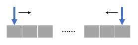
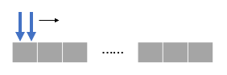
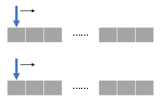
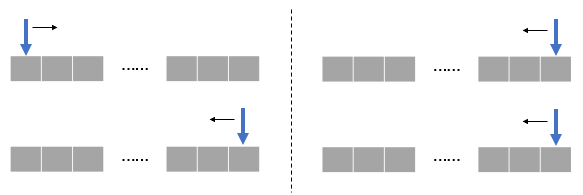
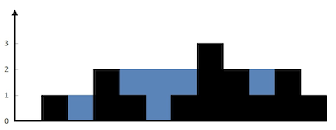
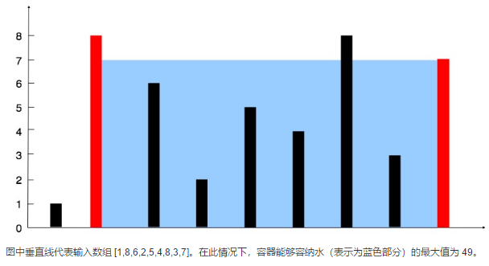

专题-双指针
===
- 双指针问题无论在笔试还是面试中出现的频率都非常高；是性价比非常高的一类问题。

模板小结
---
- **首尾双指针**
    <div align="center"></div>

    - 一般用于寻找数组/双向链表中满足条件的**两个节点**；如果是寻找多个数，则先固定前 n-2 个数；
    - 为了不遗漏所有可能情况，可能要求数组**有序**；
    - **典型问题**：[两数之和](#两数之和)、[三数之和](#三数之和)、[三角形计数](#三角形计数valid-triangle-number)
- **同向双指针**
    <div align="center"></div>

    - **数组**中，一般用于寻找满足某个条件的**连续区间**；
    - **链表**相关问题中经常会使用**快慢双指针**来寻找某个节点；
    - **典型问题**：[最小覆盖子串](#最小覆盖子串minimum-window-substring)、[数组中的最长山脉（同向双指针）](#数组中的最长山脉longest-mountain-in-array同向双指针)
- **反向双指针**
    <div align="center"></div>

    - 先依次遍历都某个节点，然后使用双指针从该节点反向判断是否满足条件。
    - **典型问题**：[最长回文子串](#最长回文子串longest-palindromic-substring)、[数组中的最长山脉（反向双指针）](#数组中的最长山脉longest-mountain-in-array反向双指针)
- **分离双指针**
    <div align="center"></div>

    - 输入是两个数组/链表，两个指针分别在两个容器中移动；
    - 根据问题的不同，初始位置可能都在头部，或者都在尾部，或一头一尾。

    <div align="center"></div>

    - **典型问题**：[两个数组的交集](#两个数组的交集intersection-of-two-arrays)、[合并两个有序数组](#合并两个有序数组merge-sorted-array)
    
RoadMap
---
- [首尾双指针](#首尾双指针)
- [同向双指针](#同向双指针)
- [反向双指针](#反向双指针)
- [分离双指针](#分离双指针)
- [链表相关](#链表相关)
- [其他](#其他)

Index
---
<!-- TOC -->

- [首尾双指针](#首尾双指针)
    - [两数之和](#两数之和)
    - [三数之和](#三数之和)
    - [N 数之和](#n-数之和)
    - [最接近的三数之和](#最接近的三数之和)
    - [两数之和 - 小于等于目标值的个数](#两数之和---小于等于目标值的个数)
    - [三数之和 - 小于等于目标值的个数](#三数之和---小于等于目标值的个数)
    - [三角形计数（Valid Triangle Number）](#三角形计数valid-triangle-number)
    - [接雨水（Trapping Rain Water）（一维）](#接雨水trapping-rain-water一维)
    - [盛最多水的容器（Container With Most Water）](#盛最多水的容器container-with-most-water)
    - [反转字符串（Reverse String）](#反转字符串reverse-string)
    - [颜色分类（Sort Colors）](#颜色分类sort-colors)
- [同向双指针](#同向双指针)
    - [数组中的最长山脉（Longest Mountain in Array）（同向双指针）](#数组中的最长山脉longest-mountain-in-array同向双指针)
    - [最小覆盖子串（Minimum Window Substring）](#最小覆盖子串minimum-window-substring)
    - [长度最小的子数组（Minimum Size Subarray Sum）](#长度最小的子数组minimum-size-subarray-sum)
    - [无重复字符的最长子串（Longest Substring Without Repeating Characters）](#无重复字符的最长子串longest-substring-without-repeating-characters)
    - [水果成篮（Fruit Into Baskets）](#水果成篮fruit-into-baskets)
- [反向双指针](#反向双指针)
    - [数组中的最长山脉（Longest Mountain in Array）（反向双指针）](#数组中的最长山脉longest-mountain-in-array反向双指针)
    - [最长回文子串（Longest Palindromic Substring）](#最长回文子串longest-palindromic-substring)
- [分离双指针](#分离双指针)
    - [实现 strstr()](#实现-strstr)
    - [两个数组的交集（Intersection of Two Arrays）](#两个数组的交集intersection-of-two-arrays)
        - [I](#i)
        - [II](#ii)
    - [合并两个有序数组（Merge Sorted Array）](#合并两个有序数组merge-sorted-array)
- [链表相关](#链表相关)
    - [分隔链表（Partition List）](#分隔链表partition-list)
    - [链表排序（Sort List）](#链表排序sort-list)
        - [链表快排](#链表快排)
        - [链表归并](#链表归并)
        - [链表插入排序](#链表插入排序)
        - [链表选择排序](#链表选择排序)
        - [链表冒泡排序](#链表冒泡排序)
    - [旋转链表（Rotate List）](#旋转链表rotate-list)
- [其他](#其他)
    - [最小区间（Smallest Range）](#最小区间smallest-range)

<!-- /TOC -->

# 首尾双指针

## 两数之和
> LeetCode/[167. 两数之和 II - 输入有序数组](https://leetcode-cn.com/problems/two-sum-ii-input-array-is-sorted/description/)

**问题描述**（167. 两数之和 II - 输入有序数组）
```python
给定一个已按照升序排列 的有序数组，找到两个数使得它们相加之和等于目标数。

函数应该返回这两个下标值 index1 和 index2，其中 index1 必须小于 index2。

说明:
    返回的下标值（index1 和 index2）不是从零开始的。
    你可以假设每个输入只对应唯一的答案，而且你不可以重复使用相同的元素。

示例:
    输入: numbers = [2, 7, 11, 15], target = 9
    输出: [1,2]
    解释: 2 与 7 之和等于目标数 9 。因此 index1 = 1, index2 = 2 。
```

**拓展**
- 如果存在多个答案，并要求输出所有不重复的可能
    > [三数之和](#三数之和)

**思路 1**
- 首尾双指针
- 因为是有序的，可以尝试使用首尾双指针解决该问题，时间复杂度为 `O(N)`
- **Python**（双指针）
    ```python
    class Solution:
        def twoSum(self, A, t):
            """
            :type A: List[int]
            :type t: int
            :rtype: List[int]
            """
            n = len(A)
            lo, hi = 0, n - 1
            
            ret = []
            while lo < hi:
                s = A[lo] + A[hi]
                if s > t:
                    hi -= 1
                elif s < t:
                    lo += 1
                else:
                    ret.append(lo + 1)
                    ret.append(hi + 1)
                    break
            
            return ret
    ```

**思路 2**
- 本题还可以利用 Hash 表解决，时间复杂度 `O(N)`，空间复杂度 `O(N)`
- 使用 Hash 表不要求数组有序
    > LeetCode/[1. 两数之和](https://leetcode-cn.com/problems/two-sum/description/)
- **Python**（Hash）
    ```python
    class Solution:
        def twoSum(self, A, t):
            """
            :type A: List[int]
            :type t: int
            :rtype: List[int]
            """
            
            d = dict()
            
            for i in range(len(A)):
                if A[i] not in d:
                    d[t - A[i]] = i
                else:
                    return [i, d[A[i]]]
    ```


## 三数之和
> LeetCode/[15. 三数之和](https://leetcode-cn.com/problems/3sum/description/)

**问题描述**
```
给定一个包含 n 个整数的数组 nums，
判断 nums 中是否存在三个元素 a，b，c ，使得 a + b + c = 0 ？
找出所有满足条件且不重复的三元组。

注意：答案中不可以包含重复的三元组。

例如, 给定数组 nums = [-1, 0, 1, 2, -1, -4]，

满足要求的三元组集合为：
[
  [-1, 0, 1],
  [-1, -1, 2]
]
```

**思路**
- 排序 + 首尾双指针
- 将第三个数当作前两个数的目标和，在两数之和的基础上套一层循环
- 难点在于如何**去重**（不借用 set）

**python**
```python
class Solution:
    def threeSum(self, A):
        """
        :type A: List[int]
        :rtype: List[List[int]]
        """
        
        A.sort()
        n = len(A)
        
        ret = []
        for i in range(n - 2):
            # 去重时注意判断条件
            if i > 0 and A[i] == A[i - 1]:  # 对第一个数去重
                continue
            
            t = -A[i]
            lo, hi = i + 1, n - 1
            
            while lo < hi:
                s = A[lo] + A[hi]
                
                if s < t:
                    lo += 1
                elif s > t:
                    hi -= 1
                else:
                    ret.append([A[i], A[lo], A[hi]])
                    
                    # 先移动指针再去重
                    lo += 1
                    # hi -= 1  # 不必要
                    
                    # 去重时注意判断条件
                    while lo < hi and A[lo] == A[lo - 1]:  # 对第二个数去重
                        lo += 1
                    #  while lo < hi and A[hi] == A[hi + 1]:  # 对第三个数去重（不必要）
                    #      hi -= 1
        
        return ret
```


## N 数之和
> LeetCode/[18. 四数之和](https://leetcode-cn.com/problems/4sum/description/)

**题目描述**（四数之和）
```
给定一个包含 n 个整数的数组 nums 和一个目标值 target，
判断 nums 中是否存在四个元素 a，b，c 和 d ，使得 a + b + c + d 的值与 target 相等？
找出所有满足条件且不重复的四元组。

注意：

答案中不可以包含重复的四元组。

示例：

给定数组 nums = [1, 0, -1, 0, -2, 2]，和 target = 0。

满足要求的四元组集合为：
[
  [-1,  0, 0, 1],
  [-2, -1, 1, 2],
  [-2,  0, 0, 2]
]
```

**Python**（N 数之和）
```python
def nSum(A, N, t, tmp, ret):
    if len(A) < N or N < 2 or t < A[0] * N or t > A[-1] * N:  # 结束条件
        return

    if N == 2:
        lo, hi = 0, len(A) - 1
        while lo < hi:
            s = A[lo] + A[hi]

            if s < t:
                lo += 1
            elif s > t:
                hi -= 1
            else:
                ret.append(tmp + [A[lo], A[hi]])
                lo += 1
                while lo < hi and A[lo] == A[lo - 1]:  # 去重
                    lo += 1
    else:
        for i in range(len(A) - N + 1):
            if i > 0 and A[i] == A[i - 1]:  # 去重
                continue

            nSum(A[i+1:], N-1, t-A[i], tmp + [A[i]], ret)
            
            
class Solution:
            
    def fourSum(self, A, t):
        """
        :type A: List[int]
        :type t: int
        :rtype: List[List[int]]
        """
        
        A.sort()
        ret = []
        
        nSum(A, 4, t, [], ret)
        
        return ret
```


## 最接近的三数之和
> LeetCode/[16. 最接近的三数之和](https://leetcode-cn.com/problems/3sum-closest/description/)

**问题描述**
```
给定一个包括 n 个整数的数组 nums 和 一个目标值 target。
找出 nums 中的三个整数，使得它们的和与 target 最接近。
返回这三个数的和。假定每组输入只存在唯一答案。

例如，给定数组 nums = [-1，2，1，-4], 和 target = 1.

与 target 最接近的三个数的和为 2. (-1 + 2 + 1 = 2).
```

**思路**
- 排序 + 双指针

**Python**
```python
class Solution:
    def threeSumClosest(self, A, t):
        """
        :type A: List[int]
        :type t: int
        :rtype: int
        """
        A.sort()  # 先排序
        n = len(A)
        
        ans = A[0] + A[1] + A[2]  # 用一个特殊的值初始化
        for i in range(n-2):
            
            lo, hi = i + 1, n - 1  # 首尾指针
            while lo < hi:
                s = A[i] + A[lo] + A[hi]
                if abs(s - t) < abs(ans - t):
                    ans = s
                    if ans == t:
                        return ans
                
                if s < t:
                    lo += 1
                else:
                    hi -= 1
        
        return ans
```


## 两数之和 - 小于等于目标值的个数
> LintCode/[609. 两数和-小于或等于目标值](https://www.lintcode.com/problem/two-sum-less-than-or-equal-to-target)
>> 此为收费问题：[LintCode 练习-609. 两数和-小于或等于目标值](https://blog.csdn.net/qq_36387683/article/details/81460276) - CSDN博客 

**问题描述**
```
给定一个整数数组，找出这个数组中有多少对的和是小于或等于目标值。返回对数。

样例

    给定数组为 [2,7,11,15]，目标值为 24
    返回 5。
    2+7<24
    2+11<24
    2+15<24
    7+11<24
    7+15<24
```

**思路**：
- 排序 + 首尾双指针

**python**
```python
class Solution:

    def twoSum5(self, A, t):
        """
        :type A: List[int]
        :type t: int
        :rtype: List[int]
        """
        n = len(A)
        lo, hi = 0, n - 1
        A.sort()  # 如果是首尾双指针，一般要求有序

        cnt = 0
        while lo < hi:
            s = A[lo] + A[hi]
            if s <= t:
                cnt += hi-lo
                lo += 1
            else:
                hi -= 1

        return cnt
```

**代码说明**
- 以 `[2,7,11,15]` 为例
```
第一轮：lo = 0, hi = 3
    s = A[lo] + A[hi] = 17 <= 24
    因此 [2, 15], [2, 11], [2, 7] 均满足，hi - lo = 3
    lo += 1
第二轮：lo = 1, hi = 3
    s = A[lo] + A[hi] = 22 <= 24
    因此 [7, 15], [7, 11] 均满足，hi - lo = 2
    lo += 1
第三轮：lo = 2, hi = 3
    s = A[lo] + A[hi] = 26 > 24
    hi -= 1
不满足 lo < hi，退出，因此总数量为 3 + 2 = 5
```

**时间复杂度**
- `O(NlogN) + O(N) = O(NlogN)`


## 三数之和 - 小于等于目标值的个数
> LintCode/[918. 三数之和](https://www.lintcode.com/problem/3sum-smaller/description)

**问题描述**
```
给定一个n个整数的数组和一个目标整数target，
找到下标为i、j、k的数组元素0 <= i < j < k < n，满足条件nums[i] + nums[j] + nums[k] < target.

样例
给定 nums = [-2,0,1,3], target = 2, 返回 2.

解释:
    因为有两种三个元素之和，它们的和小于2:
    [-2, 0, 1]
    [-2, 0, 3]
```

**思路**
- 排序 + 双指针

**Python**
```python
class Solution:

    def threeSumSmaller(self, A, t):
        """
        :type A: List[int]
        :type t: int
        :rtype: List[int]
        """
        A.sort()
        n = len(A)
        
        cnt = 0
        for i in range(n - 2):
            lo, hi = i + 1, n - 1
            
            while lo < hi:
                s = A[i] + A[lo] + A[hi]
                
                if s < t:
                    cnt += hi - lo
                    lo += 1
                else:
                    hi -= 1
            
        return cnt
```


## 三角形计数（Valid Triangle Number）
> LeetCode/[611. 有效三角形的个数](https://leetcode-cn.com/problems/valid-triangle-number/description/)

**问题描述**
```
给定一个包含非负整数的数组，你的任务是统计其中可以组成三角形三条边的三元组个数。

示例 1:
    输入: [2,2,3,4]
    输出: 3
解释:
    有效的组合是: 
    2,3,4 (使用第一个 2)
    2,3,4 (使用第二个 2)
    2,2,3
注意:
    数组长度不超过1000。
    数组里整数的范围为 [0, 1000]。
```

**思路**
- 排序 + 首尾双指针
- 相当于两数之和大于目标值的个数

**Python**
```python
class Solution:
    def triangleNumber(self, A):
        """
        :type A: List[int]
        :rtype: int
        """
        A.sort()
        n = len(A)
        
        cnt = 0
        for i in range(2, n):  # 注意：循环区间
            
            lo, hi = 0, i - 1
            while lo < hi:
                s = A[lo] + A[hi]
                
                if s > A[i]:
                    cnt += hi - lo
                    hi -= 1
                else:
                    lo += 1
                    
        return cnt
```


## 接雨水（Trapping Rain Water）（一维）
> LeetCode/[42. 接雨水](https://leetcode-cn.com/problems/trapping-rain-water/description/)

**问题描述**
```
给定 n 个非负整数表示每个宽度为 1 的柱子的高度图，计算按此排列的柱子，下雨之后能接多少雨水。

示例:
    输入: [0,1,0,2,1,0,1,3,2,1,2,1]
    输出: 6
```
<div align="center"></div>

**思路 1**
- 一个简单的方法是**遍历两次**数组，分别记录每个位置左侧的最高点和右侧的最低点
- **C++**
    ```C++
    class Solution {
    public:
        int trap(vector<int>& H) {
            int n = H.size();
            
            vector<int> l_max(H);
            vector<int> r_max(H);
            
            for(int i=1; i<n; i++)
                l_max[i] = max(l_max[i-1], l_max[i]);
            
            for(int i=n-2; i>=0; i--)
                r_max[i] = max(r_max[i+1], r_max[i]);
            
            int ret = 0;
            for (int i=1; i<n-1; i++)
                ret += min(l_max[i], r_max[i]) - H[i];
            
            return ret;
        }
    };
    ``` 

**思路 2**
- 双指针，遍历一次数组
- **Python**
    ```python
    class Solution:
        def trap(self, A):
            """
            :type A: List[int]
            :rtype: int
            """
            n = len(A)
            l, r = 0, n - 1
            
            ans = 0
            max_l = max_r = 0
            
            while l <= r:
                if A[l] <= A[r]:
                    if A[l] > max_l:
                        max_l = A[l]
                    else:
                        ans += max_l - A[l]
                    
                    l += 1
                else:
                    if A[r] > max_r:
                        max_r = A[r]
                    else:
                        ans += max_r - A[r]
                    
                    r -= 1
                    
            return ans
    ```


## 盛最多水的容器（Container With Most Water）
> LeetCode/[11. 盛最多水的容器](https://leetcode-cn.com/problems/container-with-most-water/description/)

**问题描述**
```
给定 n 个非负整数 a1，a2，...，an，每个数代表坐标中的一个点 (i, ai) 。在坐标内画 n 条垂直线，垂直线 i 的两个端点分别为 (i, ai) 和 (i, 0)。找出其中的两条线，使得它们与 x 轴共同构成的容器可以容纳最多的水。

说明：你不能倾斜容器，且 n 的值至少为 2。

示例:
    输入: [1,8,6,2,5,4,8,3,7]
    输出: 49
```
<div align="center"></div>

**思路**
- 首尾双指针

**Python**
```python
class Solution:
    def maxArea(self, A):
        """
        :type A: List[int]
        :rtype: int
        """
        n = len(A)
        
        l, r = 0, n - 1
        res = (r - l) * min(A[l], A[r])
        while l < r:
            if A[l] < A[r]:
                l += 1
            else:
                r -= 1
            
            tmp = (r - l) * min(A[l], A[r])
            res = max(res, tmp)
            
        return res
```


## 反转字符串（Reverse String）
> LeetCode/[344. 反转字符串](https://leetcode-cn.com/problems/reverse-string/description/)

**问题描述**
```
编写一个函数，其作用是将输入的字符串反转过来。

示例 1:
    输入: "hello"
    输出: "olleh"
示例 2:
    输入: "A man, a plan, a canal: Panama"
    输出: "amanaP :lanac a ,nalp a ,nam A"
```

**思路**
- 首尾双指针

**Python**
```python
class Solution:
    def reverseString(self, s):
        """
        :type s: str
        :rtype: str
        """
        n = len(s)
        s = list(s)  # python 不支持直接修改字符串中的字符
        
        l, r = 0, n - 1
        while l < r:
            s[l], s[r] = s[r], s[l]  # swap
            l += 1
            r -= 1
        
        return ''.join(s)
```


## 颜色分类（Sort Colors）
> LeetCode/[75. 颜色分类](https://leetcode-cn.com/problems/sort-colors/description/)

**问题描述**
```
给定一个包含红色、白色和蓝色，一共 n 个元素的数组，原地对它们进行排序，使得相同颜色的元素相邻，并按照红色、白色、蓝色顺序排列。

此题中，我们使用整数 0、 1 和 2 分别表示红色、白色和蓝色。

注意:
    不能使用代码库中的排序函数来解决这道题。

示例:
    输入: [2,0,2,1,1,0]
    输出: [0,0,1,1,2,2]

进阶：
    一个直观的解决方案是使用计数排序的两趟扫描算法。
    首先，迭代计算出0、1 和 2 元素的个数，然后按照0、1、2的排序，重写当前数组。
    你能想出一个仅使用常数空间的一趟扫描算法吗？
```

**思路**
- 首尾双指针
    - `l` 记录最后一个 0 的位置
    - `r` 记录第一个 2 的位置
    - `i` 表示当前遍历的元素

**Python**
```python
class Solution:
    def sortColors(self, A):
        """
        :type A: List[int]
        :rtype: void Do not return anything, modify A in-place instead.
        """
        n = len(A)
        
        l = 0  # l 指示最后一个 0
        r = n - 1  # r 指示第一个 2
        
        i = 0
        while i <= r:
            if A[i] == 0:
                A[i] = A[l]
                A[l] = 0  # 确定最后一个 0
                l += 1
            if A[i] == 2:
                A[i] = A[r]
                A[r] = 2  # 确定第一个 2
                r -= 1
                i -= 1  # 注意回退，因为不确定原 A[r] 处是什么
            i += 1
```


# 同向双指针

## 数组中的最长山脉（Longest Mountain in Array）（同向双指针）
> LeetCode/[845. 数组中的最长山脉](https://leetcode-cn.com/problems/longest-mountain-in-array/description/)

**问题描述**
```
我们把数组 A 中符合下列属性的任意连续子数组 B 称为 “山脉”：

B.length >= 3
存在 0 < i < B.length - 1 使得 B[0] < B[1] < ... B[i-1] < B[i] > B[i+1] > ... > B[B.length - 1]
（注意：B 可以是 A 的任意子数组，包括整个数组 A。）

给出一个整数数组 A，返回最长 “山脉” 的长度。

如果不含有 “山脉” 则返回 0。

示例 1：
    输入：[2,1,4,7,3,2,5]
    输出：5
    解释：最长的 “山脉” 是 [1,4,7,3,2]，长度为 5。

示例 2：
    输入：[2,2,2]
    输出：0
    解释：不含 “山脉”。

提示：
    0 <= A.length <= 10000
    0 <= A[i] <= 10000
```

**思路 - 同向双指针**
- 同向双指针（滑动窗口），只需遍历一遍数组

**Python**
```python
class Solution:
    def longestMountain(self, A):
        """
        :type A: List[int]
        :rtype: int
        """
        n = len(A)
        
        res = 0
        i = 1
        while i < n:
            l = i - 1  # 左山脚，注意 i 是从 1 开始的
            while i < n and A[i] > A[i - 1]:
                i += 1
            
            if l == i - 1:  # 不是山坡
                i += 1
                continue
            
            r = i - 1  # 右山脚
            while r < n - 1 and A[r] > A[r + 1]:
                r += 1
                
            if r == i - 1:  # 不是山坡
                i += 1
                continue
            else:
                res = max(res, r - l + 1)
                i = r + 1  # 
            
        return res
```


## 最小覆盖子串（Minimum Window Substring）
> LeetCode/[76. 最小覆盖子串](https://leetcode-cn.com/problems/minimum-window-substring/description/)

**问题描述**
```
给定一个字符串 S 和一个字符串 T，请在 S 中找出包含 T 所有字母的最小子串。

示例：
    输入: S = "ADOBECODEBANC", T = "ABC"
    输出: "BANC"
说明：
    如果 S 中不存这样的子串，则返回空字符串 ""。
    如果 S 中存在这样的子串，我们保证它是唯一的答案。
```

**思路**
- 同向双指针 + HaspMap

**Python**
```python
from collections import Counter

class Solution:
    def minWindow(self, s, t):
        """
        :type s: str
        :type t: str
        :rtype: str
        """
        map_t = Counter(t)  # 记录每个字符出现的次数
        
        found = dict()  # 保存滑动窗口 [i,j] 中出现的符号及其次数
        cnt_found = 0  # 记录已经匹配的数量
        min_len = len(s) + 1  # 记录最短结果
        
        res = ""
        l = 0
        for r in range(len(s)):
            if s[r] in map_t:
                found[s[r]] = found.get(s[r], 0) + 1
                if found[s[r]] <= map_t[s[r]]:
                    cnt_found += 1
            
            if cnt_found >= len(t):  # 如果存在这样的字串
                while (s[l] not in map_t) or (s[l] in found and found[s[l]] > map_t[s[l]]):
                    if s[l] in found and found[s[l]] > map_t[s[l]]:
                        found[s[l]] -= 1
                    l += 1
                    
                if r - l + 1 < min_len:  # 更新最小结果
                    min_len = r - l + 1
                    res = s[l: l + min_len]  # 等价于 s[l: r+1]
                    
        return res
```


## 长度最小的子数组（Minimum Size Subarray Sum）
> LeetCode/[209. 长度最小的子数组](https://leetcode-cn.com/problems/minimum-size-subarray-sum/description/)

**问题描述**
```
给定一个含有 n 个正整数的数组和一个正整数 s ，找出该数组中满足其和 ≥ s 的长度最小的连续子数组。如果不存在符合条件的连续子数组，返回 0。

示例: 
    输入: s = 7, nums = [2,3,1,2,4,3]
    输出: 2

解释: 子数组 [4,3] 是该条件下的长度最小的连续子数组。

进阶: 如果你已经完成了O(n) 时间复杂度的解法, 请尝试 O(n log n) 时间复杂度的解法。
```

**思路**
- 同向双指针

**Python**
```python
class Solution:
    def minSubArrayLen(self, s, A):
        """
        :type s: int
        :type A: List[int]
        :rtype: int
        """
        n = len(A)
        
        res = n + 1
        l = -1
        cur_sum = 0
        for r in range(n):
            if A[r] > s:
                return 1
            
            cur_sum += A[r]
            
            if cur_sum >= s:
                while cur_sum >= s:  # 注意要使用 >=
                    l += 1  # 因为 l 初始化为 -1，所以要先 ++
                    cur_sum -= A[l]
                
                res = min(res, r - l + 1)
                    
        return res if res != n + 1 else 0  # 结果不存在时返回 0
```


## 无重复字符的最长子串（Longest Substring Without Repeating Characters）
> LeetCode/[3. 无重复字符的最长子串](https://leetcode-cn.com/problems/longest-substring-without-repeating-characters/description/)

**问题描述**
```
给定一个字符串，找出不含有重复字符的最长子串的长度。

示例 1:
    输入: "abcabcbb"
    输出: 3 
    解释: 无重复字符的最长子串是 "abc"，其长度为 3。
示例 2:
    输入: "bbbbb"
    输出: 1
    解释: 无重复字符的最长子串是 "b"，其长度为 1。
示例 3:
    输入: "pwwkew"
    输出: 3
    解释: 无重复字符的最长子串是 "wke"，其长度为 3。
        请注意，答案必须是一个子串，"pwke" 是一个子序列 而不是子串。
```

**思路**
- 同向双指针 + Hash 表

**Python**
```python
class Solution:
    def lengthOfLongestSubstring(self, s):
        """
        :type s: str
        :rtype: int
        """
        n = len(s)
        
        res = 0
        bok = dict()
        l, r = 0, 0
        while r < n:
            if s[r] not in bok:
                bok[s[r]] = r
            else:
                l = max(l, bok[s[r]] + 1)  # ERR: l = bok[s[r]] + 1
                bok[s[r]] = r
                
            res = max(res, r - l + 1)
            # print(res, '\t', r, l)
            r += 1
            
        return res
```


## 水果成篮（Fruit Into Baskets）
> LeetCode/[904. 水果成篮](https://leetcode-cn.com/problems/fruit-into-baskets/description/)

**问题描述**
```
在一排树中，第 i 棵树产生 tree[i] 型的水果。
你可以从你选择的任何树开始，然后重复执行以下步骤：

把这棵树上的水果放进你的篮子里。如果你做不到，就停下来。
移动到当前树右侧的下一棵树。如果右边没有树，就停下来。
请注意，在选择一颗树后，你没有任何选择：你必须执行步骤 1，然后执行步骤 2，然后返回步骤 1，然后执行步骤 2，依此类推，直至停止。

你有两个篮子，每个篮子可以携带任何数量的水果，但你希望每个篮子只携带一种类型的水果。
用这个程序你能收集的水果总量是多少？

示例 1：
    输入：[1,2,1]
    输出：3
    解释：我们可以收集 [1,2,1]。
示例 2：
    输入：[0,1,2,2]
    输出：3
    解释：我们可以收集 [1,2,2].
    如果我们从第一棵树开始，我们将只能收集到 [0, 1]。
示例 3：
    输入：[1,2,3,2,2]
    输出：4
    解释：我们可以收集 [2,3,2,2].
    如果我们从第一棵树开始，我们将只能收集到 [1, 2]。
示例 4：
    输入：[3,3,3,1,2,1,1,2,3,3,4]
    输出：5
    解释：我们可以收集 [1,2,1,1,2].
    如果我们从第一棵树或第八棵树开始，我们将只能收集到 4 个水果。

提示：
    1 <= tree.length <= 40000
    0 <= tree[i] < tree.length
```

**思路**
- 题目大意：寻找一个最大的子区间，该子区间中只包含两种元素（无顺序要求）
- 同向双指针

**Python**
```python
class Solution:
    def totalFruit(self, T):
        """
        :type T: List[int]
        :rtype: int
        """
        n = len(T)
        
        l, r = 0, 0
        res = 0
        q = []  # 模拟容量为 2 的队列
        t = dict()  # 记录每个种类最后出现的位置
        while r < n:
            t[T[r]] = r  # 更新位置
            
            if T[r] in q and q[-1] == T[r]:
                pass
            elif T[r] in q and q[0] == T[r]:
                q.pop(0)
                q.append(T[r])
            elif len(q) < 2 and T[r] not in q:
                q.append(T[r])
            elif len(q) >= 2 and T[r] not in q:
                l = t[q.pop(0)] + 1
                q.append(T[r])
            
            res = max(res, r - l + 1)
            # print(res, '\t', l, r)
            r += 1
        
        return res
```


# 反向双指针

## 数组中的最长山脉（Longest Mountain in Array）（反向双指针）
> LeetCode/[845. 数组中的最长山脉](https://leetcode-cn.com/problems/longest-mountain-in-array/description/)

**问题描述**
```
我们把数组 A 中符合下列属性的任意连续子数组 B 称为 “山脉”：

B.length >= 3
存在 0 < i < B.length - 1 使得 B[0] < B[1] < ... B[i-1] < B[i] > B[i+1] > ... > B[B.length - 1]
（注意：B 可以是 A 的任意子数组，包括整个数组 A。）

给出一个整数数组 A，返回最长 “山脉” 的长度。

如果不含有 “山脉” 则返回 0。

示例 1：
    输入：[2,1,4,7,3,2,5]
    输出：5
    解释：最长的 “山脉” 是 [1,4,7,3,2]，长度为 5。

示例 2：
    输入：[2,2,2]
    输出：0
    解释：不含 “山脉”。

提示：
    0 <= A.length <= 10000
    0 <= A[i] <= 10000
```

**思路 - 反向双指针**
- 先找到“山峰”，然后向两侧移动指针，寻找左右“山脚”
- 极端情况下，可能会遍历**两次数组**（左指针有一个回溯的过程）

**Python**
```python
class Solution:
    def longestMountain(self, A):
        """
        :type A: List[int]
        :rtype: int
        """
        n = len(A)
        
        res = 0
        i = 1
        while i < n - 1:
        # for i in range(1, n - 1):
            if A[i - 1] < A[i] > A[i + 1]:  # 先找“山峰”
                l = i - 1
                r = i + 1
                while l > 0 and A[l - 1] < A[l]:  # 找左侧山脚（回溯）
                    l -= 1
                while r < n - 1 and A[r + 1] < A[r]:  # 找右侧山脚
                    r += 1
                
                res = max(res, r - l + 1)
                
                i = r + 1  # 跳过右边的下坡，这一段一定不存在山脉
            else:
                i += 1
            
        return res
```


## 最长回文子串（Longest Palindromic Substring）
> LeetCode/[5. 最长回文子串](https://leetcode-cn.com/problems/longest-palindromic-substring/description/)

**问题描述**
```
给定一个字符串 s，找到 s 中最长的回文子串。你可以假设 s 的最大长度为1000。

示例 1：
    输入: "babad"
    输出: "bab"
    注意: "aba"也是一个有效答案。
示例 2：
    输入: "cbbd"
    输出: "bb"
```

**思路**
- 搜索最长回文子串的方法很多；最主要的是动态规划和双指针方法
    > 这两种方法的时间复杂度都不是最优的， `O(N^2)`；此外还存在 `O(NlogN)` 和 `O(N)` 方法，但是这些方法并不存在普适性
    >> ./动态规划/[最长回文子串](./专题-B-动态规划#最长回文子串)
- 这里介绍的使用**双指针**的方法；
- 值得注意的一点是，回文子串的长度可能为奇或偶：一个简单的处理方法是对每个位置都判断奇偶两种情况

**Python**
```python
class Solution:
    def longestPalindrome(self, s):
        """
        :type s: str
        :rtype: str
        """
        if not s:
            return ""
        
        self.b, self.l = 0, 0  # begin, length
        
        n = len(s)
        for mid in range(n):
            self.foo(s, mid, mid)  # 奇数情况
            self.foo(s, mid, mid + 1)  # 偶数的情况
            
        return s[self.b: self.b + self.l]
    
    def foo(self, s, l, r):
        n = len(s)
        while l >=0 and r < n and s[l] == s[r]:
            l -= 1
            r += 1
        
        if r - l - 1 > self.l:  # 注意这里是 r-l-1，因为退出循环时 s[l] != s[r]
            self.b = l + 1
            self.l = r - l - 1
```

# 分离双指针

## 实现 strstr()
> LeetCode/[28. 实现strStr()](https://leetcode-cn.com/problems/implement-strstr/description/)

**问题描述**
```
实现 strStr() 函数。

给定一个 haystack 字符串和一个 needle 字符串，在 haystack 字符串中找出 needle 字符串出现的第一个位置 (从0开始)。如果不存在，则返回  -1。

示例 1:
    输入: haystack = "hello", needle = "ll"
    输出: 2
示例 2:
    输入: haystack = "aaaaa", needle = "bba"
    输出: -1
说明:

当 needle 是空字符串时，我们应当返回什么值呢？这是一个在面试中很好的问题。

对于本题而言，当 needle 是空字符串时我们应当返回 0 。这与C语言的 strstr() 以及 Java的 indexOf() 定义相符。
```

**思路**
- 模式匹配，常见的高效算法有 KMP 算法和 Karp-Rabin（KR）算法
    > [字符串模式匹配算法——BM、Horspool、Sunday、KMP、KR、AC算法 - 单车博客园](https://www.cnblogs.com/dancheblog/p/3517338.html) - 博客园 
- 这里只介绍双指针方法 `O(nm)` 和 Karp-Rabin 算法 `O(n+m)`

**双指针**
```python
class Solution:
    def strStr(self, S, T):
        """
        :type S: str
        :type T: str
        :rtype: int
        """
        if not T:  # 如果 T 为空，返回 0，与 C++/Java 行为一致
            return 0
        
        n = len(S)
        m = len(T)
        
        ans = -1  # 不存在返回 -1
        found = 0
        for i in range(n - m + 1):
            for j in range(m):
                if S[i + j] != T[j]:
                    break
                    
                if j == m - 1:
                    ans = i
                    found = 1
            
            if found:
                break
        
        return ans
```

**KR 算法**
```python

```


## 两个数组的交集（Intersection of Two Arrays）

### I
> LeetCode/[349. 两个数组的交集](https://leetcode-cn.com/problems/intersection-of-two-arrays/description/)

**问题描述**
```
给定两个数组，编写一个函数来计算它们的交集。

示例 1:
    输入: nums1 = [1,2,2,1], nums2 = [2,2]
    输出: [2]

示例 2:
    输入: nums1 = [4,9,5], nums2 = [9,4,9,8,4]
    输出: [9,4]

说明:
    输出结果中的每个元素一定是唯一的。
    我们可以不考虑输出结果的顺序。
```

**思路**
- 1）排序 + 二分
- 2）Hash
- 3）排序 + 双指针

**Python**（双指针）
```python
class Solution:
    def intersection(self, A, B):
        """
        :type A: List[int]
        :type B: List[int]
        :rtype: List[int]
        """
        A.sort()
        B.sort()
        
        m = len(A)
        n = len(B)
        
        res = []
        i, j = 0, 0
        while i < m and j < n:
            if A[i] < B[j]:
                i += 1
            elif A[i] > B[j]:
                j += 1
            else:
                if (i > 0 and A[i - 1] == A[i]) or (j > 0 and B[j - 1] == B[j]):  # 去重
                    pass
                else:
                    res.append(A[i])
                    
                i += 1
                j += 1
                
                # i += 1
                # while i < m and A[i - 1] == A[i]:
                #     i += 1
                # j += 1
                # while j < n and B[j - 1] == B[j]:
                #     j += 1
        
        return res
```

### II
> LeetCode/[350. 两个数组的交集 II](https://leetcode-cn.com/problems/intersection-of-two-arrays-ii/description/)

**问题描述**
```
给定两个数组，编写一个函数来计算它们的交集。

示例 1:
    输入: nums1 = [1,2,2,1], nums2 = [2,2]
    输出: [2,2]
示例 2:
    输入: nums1 = [4,9,5], nums2 = [9,4,9,8,4]
    输出: [4,9]
说明：
    输出结果中每个元素出现的次数，应与元素在两个数组中出现的次数一致。
    我们可以不考虑输出结果的顺序。
进阶:
    如果给定的数组已经排好序呢？你将如何优化你的算法？
    如果 nums1 的大小比 nums2 小很多，哪种方法更优？
    如果 nums2 的元素存储在磁盘上，磁盘内存是有限的，并且你不能一次加载所有的元素到内存中，你该怎么办？
```

**思路**
- 相比 1 少了一个去重的步骤

**进阶**
- 相关谈论 > [Solution to 3rd follow-up question](https://leetcode.com/problems/intersection-of-two-arrays-ii/discuss/82243/Solution-to-3rd-follow-up-question)


**Python**
```python
class Solution:
    def intersect(self, A, B):
        """
        :type A: List[int]
        :type B: List[int]
        :rtype: List[int]
        """
        A.sort()
        B.sort()
        
        m = len(A)
        n = len(B)
        
        res = []
        l, r = 0, 0
        while l < m and r < n:
            if A[l] < B[r]:
                l += 1
            elif B[r] < A[l]:
                r += 1
            else:
                res.append(A[l])
                l += 1
                r += 1
        
        return res
```


## 合并两个有序数组（Merge Sorted Array）
> LeetCode/[88. 合并两个有序数组](https://leetcode-cn.com/problems/merge-sorted-array/description/)

**问题描述**
```
给定两个有序整数数组 nums1 和 nums2，将 nums2 合并到 nums1 中，使得 num1 成为一个有序数组。

说明:
    初始化 nums1 和 nums2 的元素数量分别为 m 和 n。
    你可以假设 nums1 有足够的空间（空间大小大于或等于 m + n）来保存 nums2 中的元素。

示例:
    输入:
        nums1 = [1,2,3,0,0,0], m = 3
        nums2 = [2,5,6],       n = 3
    输出: [1,2,2,3,5,6]
```

**思路**
- 从后往前遍历

**Python**
```python
class Solution:
    def merge(self, A, m, B, n):
        """
        :type A: List[int]
        :type m: int
        :type B: List[int]
        :type n: int
        :rtype: void Do not return anything, modify A in-place instead.
        """
        
        i = m - 1  # 指向 A 的末尾
        j = n - 1  # 指向 B 的末尾
        p = m + n - 1  # 指向总的末尾
        
        while i >= 0 and j >= 0:  # 注意结束条件
            if A[i] > B[j]:
                A[p] = A[i]
                p -= 1
                i -= 1
            else:
                A[p] = B[j]
                p -= 1
                j -= 1
                
        while j >= 0:  # 如果原 A 数组先排完，需要继续把 B 中的元素放进 A；如果 B 先排完，则不需要
            A[p] = B[j]
            p -= 1
            j -= 1
```


# 链表相关

## 分隔链表（Partition List）
> LeetCode/[86. 分隔链表](https://leetcode-cn.com/problems/partition-list/description/)

**问题描述**
```
给定一个链表和一个特定值 x，对链表进行分隔，使得所有小于 x 的节点都在大于或等于 x 的节点之前。

你应当保留两个分区中每个节点的初始相对位置。

示例:
    输入: head = 1->4->3->2->5->2, x = 3
    输出: 1->2->2->4->3->5
```

**思路**
- 链表快排的中间操作；
- 新建两个链表，分别保存小于 x 和大于等于 x 的，最后拼接；
- 因为要求节点的相对位置不变，所以这么写比较方便；
- 一般来说，链表快排有两种写法：一种是交换节点内的值，一种是交换节点；该写法适用于后者。
- ~~如果是用在链表快排中，可以把头节点作为 x，最后把 x 插进 lo 和 hi 链表的中间；~~
- ~~这种写法不适合用在链表快排中，因为这里有拼接操作；~~
- ~~在实际链表快排中 partition 操作只对中间一部分执行，如果需要拼接，容易出错。~~

**Python**
```python
# Definition for singly-linked list.
# class ListNode:
#     def __init__(self, x):
#         self.val = x
#         self.next = None

class Solution:
    def partition(self, h, x):
        """
        :type h: ListNode
        :type x: int
        :rtype: ListNode
        """
        l = lo = ListNode(0)
        r = hi = ListNode(0)
        
        while h:
            if h.val < x:
                l.next = h  # Python 中不支持 l = l.next = h 的写法，C++ 指针可以
                l = l.next
            else:
                r.next = h  # Python 中不支持 r = r.next = h 的写法，C++ 指针可以
                r = r.next
                
            h = h.next
        
        r.next = None  # 因为尾节点可能不小于 x，所以需要断开
        l.next = hi.next
        
        return lo.next
```

## 链表排序（Sort List）

### 链表快排
> ./数据结构/[链表快排](./专题-A-数据结构#链表快排)

### 链表归并
> ./数据结构/[链表归并](./专题-A-数据结构#链表归并)

### 链表插入排序
> ./数据结构/[链表插入排序](./专题-A-数据结构#链表插入排序)

### 链表选择排序
> ./数据结构/[链表选择排序](./专题-A-数据结构#链表选择排序)

### 链表冒泡排序
> ./数据结构/[链表冒泡排序](./专题-A-数据结构#链表冒泡排序)

## 旋转链表（Rotate List）
> ./数据结构/[旋转链表](./专题-A-数据结构#旋转链表rotate-list)


# 其他

## 最小区间（Smallest Range）
> LeetCode/[632. 最小区间](https://leetcode-cn.com/problems/smallest-range/)

**问题描述**
```
你有 k 个升序排列的整数数组。找到一个最小区间，使得 k 个列表中的每个列表至少有一个数包含在其中。

我们定义如果 b-a < d-c 或者在 b-a == d-c 时 a < c，则区间 [a,b] 比 [c,d] 小。

示例 1:
    输入:[[4,10,15,24,26], [0,9,12,20], [5,18,22,30]]
    输出: [20,24]
    解释: 
        列表 1：[4, 10, 15, 24, 26]，24 在区间 [20,24] 中。
        列表 2：[0, 9, 12, 20]，20 在区间 [20,24] 中。
        列表 3：[5, 18, 22, 30]，22 在区间 [20,24] 中。
注意:
    给定的列表可能包含重复元素，所以在这里升序表示 >= 。
    1 <= k <= 3500
    -10^5 <= 元素的值 <= 10^5
```

**思路**
- 最小堆

**Python**
- 其中 `l, r` 表示区间；`i, j` 表示 `A[i][j]`
```python
import heapq

class Solution:
    def smallestRange(self, A):
        """
        :type A: List[List[int]]
        :rtype: List[int]
        """
        pq = [(row[0], i, 0) for i, row in enumerate(A)]
        heapq.heapify(pq)  # 最小堆

        ans = -1e5, 1e5
        r = max(row[0] for row in A)
        while pq:
            l, i, j = heapq.heappop(pq)
            if r - l < ans[1] - ans[0]:
                ans = l, r
            if j + 1 == len(A[i]):
                break
            r = max(r, A[i][j+1])
            heapq.heappush(pq, (A[i][j+1], i, j+1))
        
        return ans
```