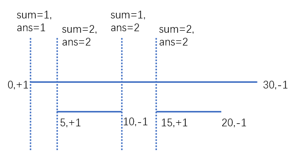

专题-区间问题
===

基本方法
---
- **双指针**（滑动窗口）
  - 定长滑动
  - 变长滑动
- **扫描线算法**

Index
---
<!-- TOC -->

- [会议室](#会议室)
- [会议室 II（扫描线算法）](#会议室-ii扫描线算法)
- [合并区间](#合并区间)
- [划分字母区间（双指针）](#划分字母区间双指针)

<!-- /TOC -->

### 会议室
> LintCode - [920. 会议室](https://www.lintcode.com/problem/meeting-rooms/description)

**问题描述**
```
给定一系列的会议时间间隔，包括起始和结束时间[[s1,e1]，[s2,e2]，…(si < ei)，
确定一个人是否可以参加所有会议。

样例
给定区间=[[0,30]，[5,10]，[15,20]]，返回false。
```

**思路**
- 排序后判断左右区间

**C++**
```C++
//class Interval {
//public:
//    int start, end;
//    Interval(int start, int end) {
//        this->start = start;
//        this->end = end;
//    }
//};

class Solution {
public:
    bool canAttendMeetings(vector<Interval> &I) {
        vector<pair<int, int> > tmp;
        for (auto i : I) {
            tmp.push_back({ i.start, i.end });  
            // 原题使用的是自定义结构，需要自定义排序，为了方便使用 pair 重新存储
        }

        sort(tmp.begin(), tmp.end());

        int end = 0;
        for (auto i : tmp) {
            if (i.first >= end) {
                end = i.second;
            }
            else {
                return false;
            }
        }

        return true;
    }
};
```


### 会议室 II（扫描线算法）
> LintCode - [919. 会议室 II](https://www.lintcode.com/problem/meeting-rooms-ii/description)

**问题描述**
```
给定一系列的会议时间间隔intervals，包括起始和结束时间[[s1,e1],[s2,e2],...] (si < ei)，找到所需的最小的会议室数量。

给出 intervals = [(0,30),(5,10),(15,20)], 返回 2.
```

**思路**
- 扫描线算法，这里应用了该算法的思想
  - 所有开始时间标记 `+1`，结束时间标记 `-1`；
  - 每当扫描线经过一个节点（开始或结束）时，就累计该节点的标记值；
  - 累计值的**最大值**即为答案；
  <div align="center"></div>

**C++**
```C++
class Solution {
public:
    int minMeetingRooms(vector<Interval> &I) {
        vector<pair<int, int> > tmp;
        for (auto i : I) {
            tmp.push_back({ i.start, 1 });
            tmp.push_back({ i.end, -1 });
        }

        sort(tmp.begin(), tmp.end());  // 别忘了排序，此时不再区分开始与结束

        int ret = 0;
        int sum = 0;
        for (auto i : tmp) {
            sum += i.second;
            ret = max(ret, sum);
        }

        return ret;
    }
};
```


### 合并区间
> LeetCode - [56. 合并区间](https://leetcode-cn.com/problems/merge-intervals/description/)
<br/>
LintCode - [156. 合并区间](https://www.lintcode.com/problem/merge-intervals/description)

**问题描述**
```
给出一个区间的集合，请合并所有重叠的区间。

示例 1:
输入: [[1,3],[2,6],[8,10],[15,18]]
输出: [[1,6],[8,10],[15,18]]
解释: 区间 [1,3] 和 [2,6] 重叠, 将它们合并为 [1,6].

示例 2:
输入: [[1,4],[4,5]]
输出: [[1,5]]
解释: 区间 [1,4] 和 [4,5] 可被视为重叠区间。
```

**C++**
```C++
class Solution {
public:
    vector<Interval> merge(vector<Interval>& I) {
        int n = I.size();
        if (n < 1) return vector<Interval>();

        sort(I.begin(), I.end(), [](const Interval& a, const Interval& b) {
            return a.start != b.start ? a.start < b.start : a.end < b.end;
        });

        vector<Interval> ret;
        ret.push_back(I[0]);
        for (int i = 1; i < n; i++) {
            if (I[i].start <= ret.back().end) {
                // ret.back().end = I[i].end;                    // err
                ret.back().end = max(ret.back().end, I[i].end);
            }
            else {
                ret.push_back(I[i]);
            }
        }

        return ret;
    }
};
```


### 划分字母区间（双指针）
> LeetCode - [763. 划分字母区间](https://leetcode-cn.com/problems/partition-labels/description/)
<br/>
LintCode - [1045. 分割标签](https://www.lintcode.com/problem/partition-labels/description)

**问题描述**
```
字符串 S 由小写字母组成。我们要把这个字符串划分为尽可能多的片段，同一个字母只会出现在其中的一个片段。返回一个表示每个字符串片段的长度的列表。

示例 1:
输入: S = "ababcbacadefegdehijhklij"
输出: [9,7,8]

解释:
划分结果为 "ababcbaca", "defegde", "hijhklij"。
每个字母最多出现在一个片段中。
像 "ababcbacadefegde", "hijhklij" 的划分是错误的，因为划分的片段数较少。

注意:
S的长度在[1, 500]之间。
S只包含小写字母'a'到'z'。
```

**思路**
- 双指针 + map
- 先遍历一次，记录每个字符最后出现的位置
- 再次遍历时不断更新高位指针的位置

**C++**
```C++
class Solution {
public:
    vector<int> partitionLabels(string S) {
        map<char, int> bok;

        for (int i = 0; i < S.length(); i++)
            bok[S[i]] = i;

        int lo = 0, hi = 0;
        vector<int> ret;
        for (int i = 0; i < S.length(); i++) {
            hi = max(hi, bok[S[i]]);
            if (hi == i) {
                ret.push_back(hi - lo + 1);
                lo = hi + 1;
            }
        }

        return ret;
    }
};
```
