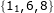

专题-排列组合
===

Index
---
<!-- TOC -->

- [排列](#排列)
  - [下一个排列](#下一个排列)
  - [上一个排列](#上一个排列)
  - [STL 提供的实现（下一个排列、上一个排列） TODO](#stl-提供的实现下一个排列上一个排列-todo)
  - [第 k 个排列](#第-k-个排列)
  - [全排列（无重复）](#全排列无重复)
    - [基于插入的写法](#基于插入的写法)
    - [基于交换的写法](#基于交换的写法)
  - [全排列（有重复）](#全排列有重复)
    - [基于插入的写法](#基于插入的写法-1)
    - [基于交换的写法](#基于交换的写法-1)
  - [【注】全排序的时间复杂度](#注全排序的时间复杂度)
- [组合](#组合)
  - [组合（n 选 k，无重复）](#组合n-选-k无重复)
  - [组合（n 选 k，有重复）](#组合n-选-k有重复)
  - [组合总和（数字不重复但可重复使用）](#组合总和数字不重复但可重复使用)
  - [组合总和 2（存在重复数字但每个数字只能使用一次）](#组合总和-2存在重复数字但每个数字只能使用一次)
  - [组合总和 3（数字不重复且指定数量）](#组合总和-3数字不重复且指定数量)
- [【说明】](#说明)
  - [字典序](#字典序)
  - [关于 `for(i=0;..)` 与 `for(i=step;..)` 的说明](#关于-fori0-与-foristep-的说明)
  - [【注】关于 `dfs(step+1)`、`dfs(i+1)`、`dfs(i)` 的说明](#注关于-dfsstep1dfsi1dfsi-的说明)
    - [`dfs(step+1)` 和 `dfs(i+1)`](#dfsstep1-和-dfsi1)
    - [`dfs(i+1)` 和 `dfs(i)`](#dfsi1-和-dfsi)

<!-- /TOC -->


## 排列

### 下一个排列
> LeetCode - [31. 下一个排列](https://leetcode-cn.com/problems/next-permutation/description/)

**题目描述**
```
实现获取下一个排列的函数，算法需要将给定数字序列重新排列成字典序中下一个更大的排列。

如果不存在下一个更大的排列，则将数字重新排列成最小的排列（即升序排列）。

必须原地修改，只允许使用额外常数空间。

以下是一些例子，输入位于左侧列，其相应输出位于右侧列。
1,2,3 → 1,3,2
3,2,1 → 1,2,3
1,1,5 → 1,5,1
```

**思路**
- **相邻的两个排列有最长公共前缀**，然后找到需要交换的**高位**和**低位**
- 根据字典序的定义，依照如下步骤寻找下一个排列
  > [字典序](#字典序)
1. 从后往前找需要改变的**高位** hi，即**第一个降序**元素的位置
   ```
   1 5 8 4 7 6 5 3 1
         ↑
         hi
   ```
2. 从后往前找需要交换的**低位** lo，即**第一个大于** nums[hi] 的位置
   ```
   1 5 8 4 7 6 5 3 1
         ↑     ↑
         hi    lo
   ```
3. 交换 nums[lo] 与 nums[hi]
   ```
   1 5 8 4 7 6 5 3 1
         ↓     ↓
   1 5 8 5 7 6 4 3 1
         ↑     ↑
         hi    lo     (hi 位置不变)
   ```
4. **反转** hi 之后的序列，即 nums[hi+1: n)
   ```
   1 5 8 5 7 6 4 3 1
           ↓ ↓ ↓ ↓ ↓
   1 5 8 5 1 3 4 6 7
         ↑     ↑
         hi    lo     (hi 位置不变)
   ```
**C++**
```C++
class Solution {
public:
    void nextPermutation(vector<int>& nums) {
        int n = nums.size();
        if (n <= 1) return;
    
        int hi = n - 2;
        // 1. 从后往前找需要改变的**高位** hi，即第一个降序元素的位置
        while (hi >= 0 && nums[hi + 1] <= nums[hi])
            hi--;

        if (hi >= 0) {
            // 2. 从后往前找需要交换的**低位** lo，即第一个大于 nums[hi] 的位置
            int lo = n - 1;
            while (lo >= 0 && nums[lo] <= nums[hi])
                lo--;
            // 3. 交换 nums[lo] 与 nums[hi]
            swap(nums[hi], nums[lo]);
        }

        // 4. 反转 hi 之后的序列，即 nums[hi+1: n)
        reverse(nums.begin() + hi + 1, nums.end());
        // 当 i == -1 时，该操作会使序列从字典序最大转为最小，这与 STL 中提供的 next_permutation 略有不同
    }
};
```

### 上一个排列
> LintCode - [51. 上一个排列](https://www.lintcode.com/problem/previous-permutation/description)

**问题描述**
```
给定一个整数数组来表示排列，找出其上一个排列。
排列中可能包含重复的整数

样例
给出排列[1,3,2,3]，其上一个排列是[1,2,3,3]

给出排列[1,2,3,4]，其上一个排列是[4,3,2,1]
```

**思路**
- 实际上就是[下一个排列](#下一个排列)的逆过程
1. 从右往左找**第一个升序**的位置 hi
1. 从右往左找**第一个小于** nums[hi] 的位置 lo
1. 交换 nums[lo] 和 nums[hi]
1. 反转 hi 之后的位置

**C++**
```C++
class Solution {
public:
    /*
    * @param nums: A list of integers
    * @return: A list of integers that's previous permuation
    */
    vector<int> previousPermuation(vector<int> &nums) {
        int n = nums.size();

        if (n <= 1) return nums;

        int hi = n - 2;
        // 1. 从右往左找**第一个升序**的位置 hi
        while (hi >= 0 && nums[hi] <= nums[hi + 1])
            hi--;

        if (hi >= 0) {
            int lo = n - 1;
            // 2. 从右往左找**第一个小于** nums[hi] 的位置 lo
            while (lo >= 0 && nums[lo] >= nums[hi])
                lo--;
            // 3. 交换 nums[lo] 和 nums[hi]
            swap(nums[lo], nums[hi]);
        }

        // 4. 反转 hi 之后的位置
        reverse(nums.begin() + hi + 1, nums.end());

        return nums;  // 注意这里要你返回一个值
    }
};
```

### STL 提供的实现（下一个排列、上一个排列） TODO
- STL 提供了两个函数用于生成排列
  ```C++
  bool next_permutation (BidirectionalIterator first,
                         BidirectionalIterator last);

  bool prev_permutation (BidirectionalIterator first,
                         BidirectionalIterator last );
  ```
- 这两个函数均以**字典序**比较函数 `lexicographical_compare()`为基础生成下一个或上一个排列
- 因此在使用这两个函数前，需要先对原序列进行**排序**

**C++**
```C++

```

### 第 k 个排列
> LeetCode - [60. 第k个排列](https://leetcode-cn.com/problems/permutation-sequence/description/)

**问题描述**
```C
给出集合 [1,2,3,…,n]，其所有元素共有 n! 种排列。

按大小顺序列出所有排列情况，并一一标记，当 n = 3 时, 所有排列如下：
"123"
"132"
"213"
"231"
"312"
"321"

给定 n 和 k，返回第 k 个排列。

说明：
  给定 n 的范围是 [1, 9]。
  给定 k 的范围是 [1, n!]。
示例 1:
  输入: n = 3, k = 3
  输出: "213"
示例 2:
  输入: n = 4, k = 9
  输出: "2314"
```

**思路**
- 因为字典序的性质，实际不需要求出前 k-1 个序列
- 整体思路有点像**桶排序**
- 以 `{1 2 3 4 5}` 为例，找出其中第 `14` 个序列
  ```
  首先，可以先按第一个位置的元素，把所有序列依次到对应的桶中
  在开始之前，先 k--，因为计算机计数是从 0 开始的，此时 k=13（下面会说明为什么需要减 1）
  第 1 轮：剩余 5 个元素，有 5 个桶
    第0个桶：以 1 开头，剩余元素 {2 3 4 5} 
    第1个桶：以 2 开头，剩余元素 {1 3 4 5} 
    第2个桶：以 3 开头，剩余元素 {1 2 4 5} 
    第3个桶：以 4 开头，剩余元素 {1 2 3 5}
    第4个桶：以 5 开头，剩余元素 {1 2 3 4}
  每个桶中有 4!=24 个序列，因为是有序的，显然第 k=13 个元素必然在第 `13/(4!) = 0` 个桶中
    换言之，第 14 个元素必然以 1 开头
  移除序列中的 1，剩余序列变为 {2 3 4 5}，k = 13 % 24 = 13

  第 2 轮：剩余 4 个元素，有 4 个桶
    第0个桶：以 2 开头，剩余元素 {3 4 5} 
    第1个桶：以 3 开头，剩余元素 {2 4 5} 
    第2个桶：以 4 开头，剩余元素 {2 3 5} 
    第3个桶：以 5 开头，剩余元素 {2 3 4}
  每个桶中有 3!=6 个元素。显然，第 k=13 个元素应该在第 `13/(3!) = 2` 个桶中
    即第 14 个元素的前缀为 14
  移除序列中的 4，剩余序列变为 {2 3 5}，k = 13 % 6 = 1

  第 3 轮：剩余 3 个元素，有 3 个桶
    第0个桶：以 2 开头，剩余元素 {3 5} 
    第1个桶：以 3 开头，剩余元素 {2 5} 
    第2个桶：以 5 开头，剩余元素 {3 5} 
  此时每个桶中有 2!=2 个元素。第 k=1 个元素应该在第 `1/(2!)=0` 个桶中（如果开始时 k 不减 1，这里就会出现问题）
    即第 14 个元素的前缀为 142
  移除序列中的 2，剩余序列变为 {3 5}，k = 1 % 2 = 1

  第 4 轮：剩余 2 个元素，有 2 个桶
    第0个桶：以 3 开头，剩余元素 {5} 
    第1个桶：以 5 开头，剩余元素 {3} 
  此时每个桶中有 1!=1 个元素。第 k=1 个元素应该在第 `1/(1!)=1` 个桶中
    即第 14 个元素的前缀为 1425
  移除序列中的 5，剩余序列变为 {3}，k = 1 % 1 = 0

  第 5 轮：剩余 1 个元素，有 1 个桶
    第0个桶：以 3 开头，无剩余元素
  此时每个桶中有 0!=1 个元素（实际上此时桶中没有元素）。
  第 k=0 个元素应该在第 `0/(0!)=0` 个桶中（最后一轮利用 0!=1 的性质不需要特别处理）
    即第 14 个元素为 14253
  ```

**C++**
```C++
class Solution {
public:
    string getPermutation(int n, int k) {

        // nums: {1, 2, 3, ..., n}
        // 换成其他字符，按字典序存放到对应位置即可
        vector<int> nums(n + 1, 0);
        for (int i = 0; i < n; i++) // 注意：桶的下标是从 0 开始的
            nums[i] = i + 1;

        // dp: {0!=1, 1!, 2!, ..., n!}
        vector<int> dp(n + 1, 1);  // 根据上面的推导，dp[0]=1 正好可以处理最后一轮
        for (int i = 1; i <= n; i++)
            dp[i] = dp[i - 1] * i;

        k--;
        stringstream ss;
        for (int i = 1; i <= n; i++) {  // 从 1 开始
            int index = k / dp[n - i];  // 实际上没有用到 dp[n] = n!
            ss << nums[index];
            nums.erase(nums.begin() + index);  // 注意，每轮删除已处理的元素
            k = k % dp[n - i];
        }

        return ss.str();
    }
};
```

### 全排列（无重复）
> LeetCode [46. 全排列](https://leetcode-cn.com/problems/permutations/description/)

**题目描述**
```
给定一个没有重复数字的序列，返回其所有可能的全排列。

示例:

输入: [1,2,3]
输出:
[
  [1,2,3],
  [1,3,2],
  [2,1,3],
  [2,3,1],
  [3,1,2],
  [3,2,1]
]
```

**思路 1**
- 利用下一个排列，先对数组排序，然后不断生成下一个排列

**思路 2**
- **深度优先搜索**
- 易知，当序列中的元素不重复时，存在 `n!` 种不同的排列；
- 考虑第一个位置，有 n 种可能
- 当选定了第一个位置，第二个位置有 n-1 种可能
- 因为**每次搜索的状态数**是递减的，所以这里的 dfs 是一个**循环递归**的过程

#### 基于插入的写法
- 代码量多一点，但比较好理解
```C++
class Solution {
    vector<vector<int> > ret;
    vector<int> tmp;
    vector<bool> used;
    int n = 0;

    void dfs(vector<int>& nums, int step) {
        if (tmp.size() == n) {
            ret.push_back(tmp);
            return;
        }

        for (int i = 0; i < n; i++) {   // i 每次从 0 开始，因为元素可以重复使用
            if (used[i]) continue;      // 但是在每一轮中，如果用过了需要跳过
                                        // 每一轮指的是生成一次排列的过程
            used[i] = 1;            // 标记使用
            tmp.push_back(nums[i]);
            dfs(nums, step + 1);
            tmp.pop_back();         // 回溯
            used[i] = 0;
        }
    }

public:
    vector<vector<int> > permute(vector<int>& nums) {
        n = nums.size();
        used.resize(n, 0);

        dfs(nums, 0);
        return ret;
    }
};
```
> [【注】关于 `for(i=0;..)` 与 `for(i=step;..)` 的说明](#注关于-fori0-与-foristep-的说明)

#### 基于交换的写法
- 基于交换的写法，代码比较简洁，但个人认为有一点不好理解
```C++
class Solution {
    vector<vector<int> > ret;

    //void dfs(vector<int> nums, int step) {  // 值传递
    void dfs(vector<int>& nums, int step) {   // 引用传递
        if (step >= nums.size()) {
            ret.push_back(nums);
            return;
        }

        for (int i = step; i < nums.size(); i++) { // 注意：这里 i 从 step 开始
            swap(nums[step], nums[i]);
            dfs(nums, step + 1);
            swap(nums[step], nums[i]);  // 如果 nums 是值传入，则不需要这步；否则不能省略
        }
    }

public:
    vector<vector<int> > permute(vector<int>& nums) {
        dfs(nums, 0);
        return ret;
    }
};
```

### 全排列（有重复）
> LeetCode - [47. 全排列 II](https://leetcode-cn.com/problems/permutations-ii/description/)

**题目描述**
```
给定一个可包含重复数字的序列，返回所有不重复的全排列。

示例:

输入: [1,1,2]
输出:
[
  [1,1,2],
  [1,2,1],
  [2,1,1]
]
```

**思路 1**
- 使用无重复时的方法，用 set 剔除重复（不推荐）

**思路 2**
- 先对原序列**排序**，使相同的元素相邻；此时**只处理第一个相同元素**，其余跳过；

#### 基于插入的写法
```C++
class Solution {
    vector<vector<int> > ret;
    vector<int> tmp;
    vector<bool> used;
    int n = 0;

    void dfs(vector<int>& nums, int step) {
        if (tmp.size() == n) {
            ret.push_back(tmp);
            return;
        }

        for (int i = 0; i < n; i++) {
            if (used[i] || (i > 0 && nums[i] == nums[i - 1] && !used[i - 1]))
                continue;  // 这里的 !used[i - 1] 稍难理解，可以配合 IDE 或者手推一下整个过程

            used[i] = 1;
            tmp.push_back(nums[i]);
            dfs(nums, step + 1);
            tmp.pop_back();
            used[i] = 0;
        }
    }

public:
    vector<vector<int> > permuteUnique(vector<int>& nums) {
        n = nums.size();
        used.resize(n, 0);
        sort(nums.begin(), nums.end());

        dfs(nums, 0);
        return ret;
    }
};
```

#### 基于交换的写法
```C++
class Solution {
    vector<vector<int> > ret;

    //void dfs(vector<int>& nums, int step) { // 传引用无法得出正确结果
    void dfs(vector<int> nums, int step) {    // 注意这里应该使用**值传递**
        int n = nums.size();
        if (step >= n - 1) {
            ret.push_back(nums);
            return;
        }

        for (int i = step; i < n; i++) {
            if (i != step && nums[i] == nums[step])
                continue;

            swap(nums[i], nums[step]);
            dfs(nums, step + 1);
            //swap(nums[i], nums[step]); // 传引用配合回溯无法得出正确结果，
                                         // 原因在于此时会破坏剩余数组的有序性
        }
    }
public:
    vector<vector<int> > permuteUnique(vector<int>& nums) {
        sort(nums.begin(), nums.end());
        dfs(nums, 0);

        return ret;
    }
};
```

### 【注】全排序的时间复杂度
- 不重复情况下，n 个元素的不同全排列为 `n!` 个，所以算法的时间复杂度至少为 `O(N!)`
- 因此，全排列算法对大型的数据是无法处理的


## 组合

### 组合（n 选 k，无重复）
> LeetCode - [77. 组合](https://leetcode-cn.com/problems/combinations/description/)

**问题描述**
```C
给定两个整数 n 和 k，返回 1 ... n 中所有可能的 k 个数的组合。

示例:

输入: n = 4, k = 2
输出:
  [
    [2,4],
    [3,4],
    [2,3],
    [1,2],
    [1,3],
    [1,4],
  ]
```

**思路**
- 带**回溯**的深度优先搜索，类似[全排列（无重复）](#全排列无重复)

**C++**
```C++
class Solution {
    vector<vector<int> > ret;
    vector<int> tmp;   // 保存中间结果
    int K;

    void dfs(vector<int>& nums, int step) {
        if (tmp.size() >= K) {
            ret.push_back(tmp);
            return;
        }

        for (int i = step; i < nums.size(); i++) {
            tmp.push_back(nums[i]);  // nums[i] == i，所以这里直接 push(i) 也可以
            dfs(nums, i + 1);
            tmp.pop_back();
        }
    }

public:
    vector<vector<int> > combine(int n, int k) {

        K = k;
        vector<int> nums;
        for (int i = 0; i < n; i++)
            nums.push_back(i + 1);

        dfs(nums, 0);
        return ret;
    }
};
```

### 组合（n 选 k，有重复）
（未验证）
- 如果要求每个组合中不重复，则可以先去重，再按照无重复的做法
- 如果不要求去重，则直接按照无重复的做法即可

### 组合总和（数字不重复但可重复使用）
> LeetCode - [39. 组合总和](https://leetcode-cn.com/problems/combination-sum/description/)

**思路**
- 深度优先搜索
- 关键在于每个数字可以重复使用

**C++**
```C++
class Solution {
    vector<vector<int> > ret;
    vector<int> tmp;
    int cur = 0;
    int target = 0;

    void dfs(vector<int>& nums, int step) {
        if (cur >= target) {
            if (cur == target)
                ret.push_back(tmp);
            return;
        }

        for (int i = step; i < nums.size(); i++) {
            cur += nums[i];
            tmp.push_back(nums[i]);
            dfs(nums, i);  // 因为每个数组可以重复使用，所以是 dfs(i) 而不是 dfs(i+1)
            cur -= nums[i];
            tmp.pop_back();
        }
    }

public:
    vector<vector<int> > combinationSum(vector<int>& candidates, int target) {
        this->target = target;

        //sort(candidates.begin(), candidates.end()); // 不需要
        dfs(candidates, 0);

        return ret;
    }
};
```
> [【注】关于 `dfs(step+1)`、`dfs(i+1)`、`dfs(i)` 的说明](#注关于-dfsstep1dfsi1dfsi-的说明)

### 组合总和 2（存在重复数字但每个数字只能使用一次）
> LeetCode - [40. 组合总和 II](https://leetcode-cn.com/problems/combination-sum-ii/description/)

**思路**
- DFS，关键是如何去除重复情况

**C++**
```C++
class Solution {
    vector<vector<int> > ret;
    vector<int> tmp;
    int cur = 0;
    int target;

    void dfs(vector<int>& nums, int step) {
        if (cur >= target) {
            if (cur == target)
                ret.push_back(tmp);
            return;
        }

        for (int i = step; i < nums.size(); i++) {
            if (i > step && nums[i] == nums[i - 1]) // 代码说明 1
                continue;

            cur += nums[i];
            tmp.push_back(nums[i]);
            dfs(nums, i + 1);       // i+1 而不是 i，因为不能重复使用
            tmp.pop_back();
            cur -= nums[i];
        }
    }
public:
    vector<vector<int> > combinationSum2(vector<int>& candidates, int target) {
        this->target = target;

        sort(candidates.begin(), candidates.end());  // 因为存在重复，需要先排序
        dfs(candidates, 0);

        return ret;
    }
};
```

**代码说明 1**
```
if (i > step && nums[i] == nums[i - 1])
```
- 以  为例
- 这段代码实际上并不会过滤  ——`i == step` 的情况
- 真正重复的情况是  和 ，而这段代码的目的是过滤  ——`i > step` 的情况

### 组合总和 3（数字不重复且指定数量）
> LeetCode - [216. 组合总和 III](https://leetcode-cn.com/problems/combination-sum-iii/description/)

**问题描述**
```C
找出所有相加之和为 n 的 k 个数的组合。组合中只允许含有 1 - 9 的正整数，并且每种组合中不存在重复的数字。

说明：

所有数字都是正整数。
解集不能包含重复的组合。 

示例 1:
输入: k = 3, n = 7
输出: [[1,2,4]]

示例 2:
输入: k = 3, n = 9
输出: [[1,2,6], [1,3,5], [2,3,4]]
```

**思路**
- 在[组合总和（数字不重复但可重复使用）](#组合总和数字不重复但可重复使用)上稍作修改即可

**C++**
```C++
class Solution {
    vector<vector<int> > ret;
    vector<int> tmp;
    int cur = 0;
    int K;

    void dfs(int n, int step) {
        if (cur >= n) {
            if (cur == n && tmp.size() == K)  // 同时满足才加入结果集
                ret.push_back(tmp);
            return;
        }

        for (int i = step; i <= 9; i++) {

            cur += i;
            tmp.push_back(i);
            dfs(n, i + 1);    // 因为数字不能重复使用，所以是 dfs(i+1)
            tmp.pop_back();
            cur -= i;
        }
    }

public:
    vector<vector<int> > combinationSum3(int k, int n) {
        K = k;

        dfs(n, 1);
        return ret;
    }
};
```

<!-- 
组合总和 4（动态规划）
> LeetCode - [377. 组合总和 Ⅳ](https://leetcode-cn.com/problems/combination-sum-iv/description/)

**问题描述**
```C
给定一个由正整数组成且不存在重复数字的数组，找出和为给定目标正整数的组合的个数。

示例:
nums = [1, 2, 3]
target = 4

所有可能的组合为：
(1, 1, 1, 1)
(1, 1, 2)
(1, 2, 1)
(1, 3)
(2, 1, 1)
(2, 2)
(3, 1)

请注意，顺序不同的序列被视作不同的组合。

因此输出为 7。

进阶：
  如果给定的数组中含有负数会怎么样？
  问题会产生什么变化？
  我们需要在题目中添加什么限制来允许负数的出现？
```

**思路**
- 这其实是一道**动态规划**问题

**C++**
- 简单贴一下来自讨论区的代码，没有深入研究
```C++
class Solution {
public:
    int combinationSum4(vector<int>& nums, int target) {
        vector<int> result(target + 1);
        result[0] = 1;
        for (int i = 1; i <= target; ++i) {
            for (int x : nums) {
                if (i >= x) {
                    result[i] += result[i - x];
                }
            }
        }
        
        return result[target];
    }
};
```
-->

## 【说明】

### 字典序
- 在处理排列问题时，通常时根据**字典序**来生成下一个排列
- 在字典序中，记序列的**升序**为第一个排列，**降序**为最后一个排列

**高位与低位**
- 对序列中任意两个位置而言，靠近左侧的为**高位**，靠近右侧的为低位
- 生成排列的过程就是不断增大**高位**，减小**低位**的过程
  ```
  1 2 3
  1 3 2
  2 1 3
  2 3 1
  3 1 2
  3 2 1
  ```

### 关于 `for(i=0;..)` 与 `for(i=step;..)` 的说明
- `for(i=0;..)` 需配合 `used` 标记使用
  - [全排列（无重复，基于插入的写法）](#基于插入的写法)
  - [全排列（有重复，基于插入的写法）](#基于插入的写法-1)
- `for(i=step;..)`
  - 所有组合问题
- 简单来说，以 `{1 2 3 4}` 为例
  - `for(i=0;..)` 用于以下情况
    ```
    1 + {2 3 4}
    2 + {1 3 4}
    ...
    ```
    - used 用于标记开头的 `1`、`2`等
  - `for(i=step;..)` 用于以下情况
    ```
    1 + {2 3 4}
    2 + {3 4}
    ...
    ```
    - 一般不需要 `used` 标记

### 【注】关于 `dfs(step+1)`、`dfs(i+1)`、`dfs(i)` 的说明
（以下均为个人小结，并没有严格验证）

#### `dfs(step+1)` 和 `dfs(i+1)`
- 简单来说，`dfs(step+1)` 指的是生成 `tmp` 序列中的第 `step+1` 个位置；`dfs(i+1)` 指的是使用 `nums` 中的第 `i+1` 个元素
  - 在[排列（无重复）](#全排列无重复)问题中，使用的是 `dfs(step+1)`
  - 在[组合（无重复）](#组合n-选-k无重复)问题中，使用的是 `dfs(i+1)`
  - 相关代码段
    ```C++
    // 排列
    for (int i = step; i < nums.size(); i++) {
        // ...
        dfs(nums, step + 1);
        // ...
    }

    // 组合
    for (int i = step; i < nums.size(); i++) {
        // ...
        dfs(nums, i + 1);
        // ...
    }
    ```
- 以不重复集合 `{1 2 3 4}` 为例说明：
  - 排列问题中用过的元素还可能被再次使用；
    ```
    step = 0 时，即第一个位置是 1
      所有的排列为 1 + {2 3 4} 
    step = 1 时，即第一个位置是 2
      所有的排列为 2 + {1 3 4}    # 1 又出现在了后序元素中
    ...
    ```
  - 而组合问题中使用过的元素，之后不再使用
    ```
    step = 0 时，即第一个位置是 1
      所有的组合为 1 + {2 3 4}
    step = 1 时，即第一个位置是 2
      所有的组合为 2 + {3 4}      # 1 不再使用了
    ```
  - 正是由于这个区别导致**排列**中应该使用 `dfs(step+1)`，而**组合**中应该使用 `dfs(i+1)`

#### `dfs(i+1)` 和 `dfs(i)`
- 在[组合总和](#组合总和)问题中，还用到了 `dfs(i)`
  ```
  for (int i = step; i < nums.size(); i++) {
      // ...
      dfs(nums, i);
      // ...
  }
  ```
  - 一方面，它跟组合问题类似，用过的数字不再使用；因此使用的是 `i` 而不是 `step`
  - 另一方面，每个数字可以重复使用，因此使用的是 `dfs(i)` 而不是 `dfs(i+1)`