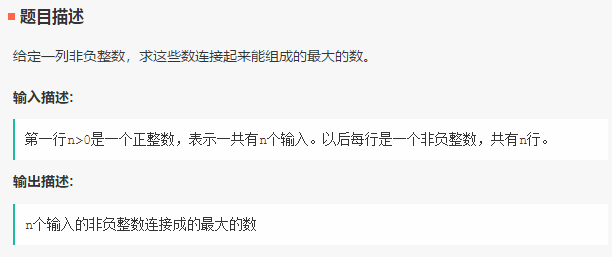
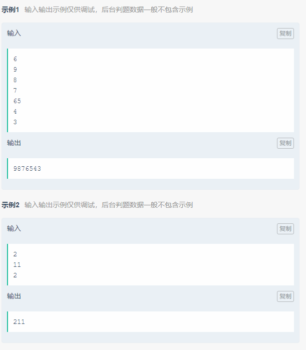

笔试-iHandy-180927
===
- 单项选择题 8 道，不定项选择题 5 道，问答题 2 道，编程题 1 道

Index
---
<!-- TOC -->

- [【问答】射击（概率题）](#问答射击概率题)
- [【编程】比大更大](#编程比大更大)

<!-- /TOC -->

## 【问答】射击（概率题）

**问题描述**
```
假设有一支手枪，每次扣动扳机，有 50% 的概率发射子弹；
现甲和乙轮流使用该手枪想对方射击，直到其中一方中弹；
问甲先射击，乙先中弹的概率？
```


## 【编程】比大更大
> 剑指 Offer：[把数组排成最小的数](https://www.nowcoder.com/practice/8fecd3f8ba334add803bf2a06af1b993?tpId=13&tqId=11185&tPage=2&rp=2&ru=/ta/coding-interviews&qru=/ta/coding-interviews/question-ranking)
<div align="center"></div>
<div align="center"></div>

**贪心**（80%）
```python
n = int(input())

s = []
for _ in range(n):
    s.append(input())

s.sort(reverse=True)
#print(s)

ans = ''.join(s)

print(int(ans))  # 转 int
```

**自定义排序**（80%）
- 代码应该没什么问题，最后把结果转成 `int/long long` 应该就能 AC 了——可能有一个用例是全 0
- 上面用贪心的时候还记得转 int，这里就忘了...
```C++
#include <iostream>
#include <string>
#include <vector>
#include <algorithm>
#include <sstream>

using namespace std;

string foo(vector<string> ns) {
    sort(ns.begin(), ns.end(), [](const string &l, const string &r){
        return r + l < l + r;
    });

    stringstream ss;
    for (auto i : ns) 
        ss << i;

    return ss.str();
}

int main() {
    
    int n;
    cin >> n;
    vector<string> ns(n);
    for (int i=0; i < n; i++)
        cin >> ns[i];
    
    cout << foo(ns);  // 这里把结果转成整型应该就行了
    return 0;
}
```