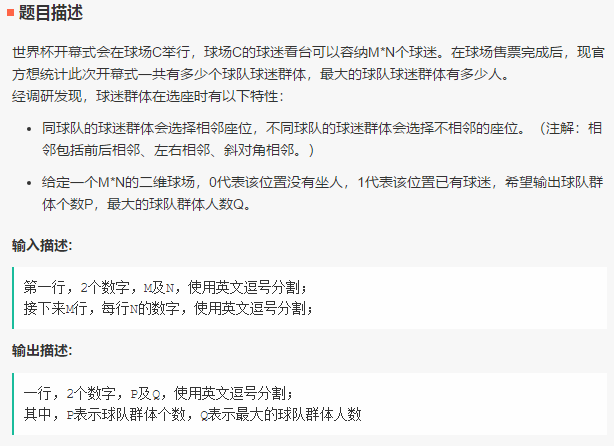
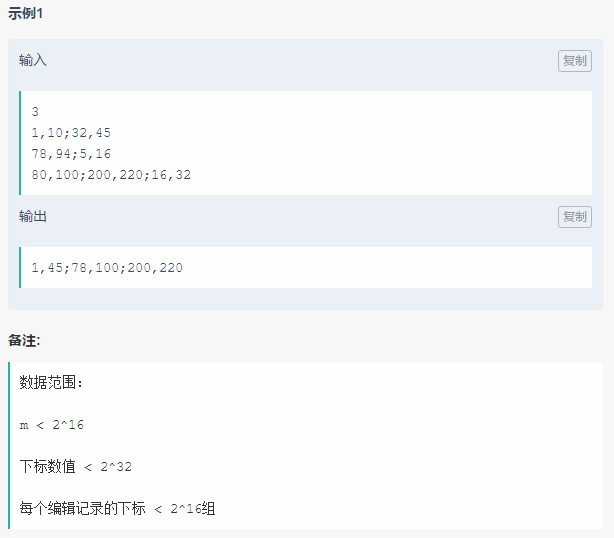
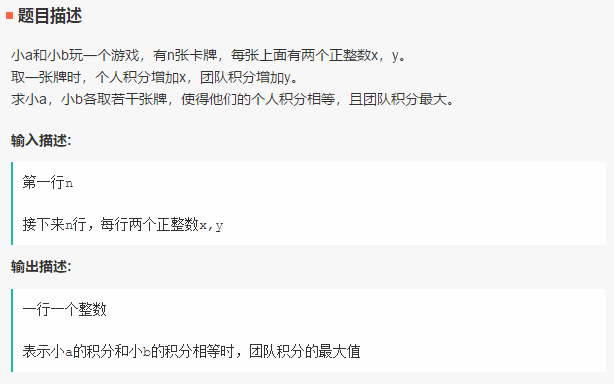
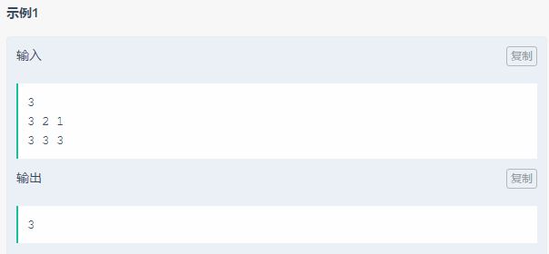
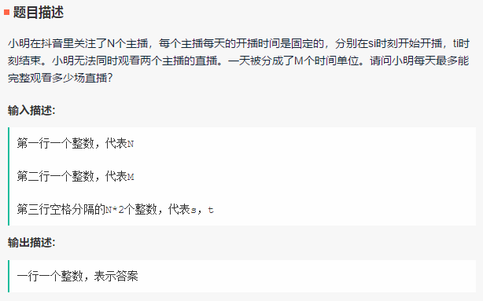
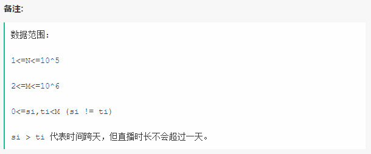

笔试-字节跳动-180812
===
共 5 道编程题

Reference
---
- [官方题解](https://m.toutiao.com/i6589920344075665928/?wxshare_count=2&pbid=6587230296797464068)（只有思路）

Index
---
<!-- TOC -->

- [1. 世界杯开幕式](#1-世界杯开幕式)
- [2. 文章病句标识](#2-文章病句标识)
- [3. 积分卡牌游戏](#3-积分卡牌游戏)
- [4. 区间最大最小值 TODO](#4-区间最大最小值-todo)
- [5. 直播爱好者](#5-直播爱好者)

<!-- /TOC -->

## 1. 世界杯开幕式
<div align="center"></div>
<div align="center"></div>

**思路**
- dfs 搜索联通区域
- 原题只要搜索 4 个方向，这里改为搜索 8 个方向

**Code(Python)**
```Python
M, N = list(map(int, input().split(',')))

book = []
for i in range(M):
    line = list(map(int, input().split(',')))
    book.append(line)


class Solution:
    def __init__(self, pos):
        self.pos = pos
        self.cnt = 0  # 记录当前区域的人数
        self.dp = []  # 保存所有区域的人数，返回其长度，及其中的最大值

    def dfs(self, i, j):
        if 0 <= i < M and 0 <= j < N:
            if self.pos[i][j] == 1:
                self.cnt += 1
                self.pos[i][j] = 0  # 遍历过的点就置 0，避免重复搜索
                # 八个方向搜索
                self.dfs(i - 1, j)
                self.dfs(i + 1, j)
                self.dfs(i, j - 1)
                self.dfs(i, j + 1)
                self.dfs(i - 1, j - 1)
                self.dfs(i + 1, j + 1)
                self.dfs(i + 1, j - 1)
                self.dfs(i - 1, j + 1)

    def solve(self):
        for i in range(M):
            for j in range(N):
                if self.pos[i][j] == 1:
                    self.cnt = 0  # 每新找到一个区域就清零人数，重新计数
                    self.dfs(i, j)  # 深度优先搜索每个点
                    if self.cnt > 0:
                        self.dp.append(self.cnt)
        return len(self.dp), max(self.dp)


s = Solution(book)
P, Q = s.solve()
print(str(P) + ',' + str(Q))
```

## 2. 文章病句标识
<div align="center"></div> 
<div align="center"></div>

**思路**
- 区间合并
- 排序 + 贪心
  ```
  对 [l1,r1], [l2,r2]，如果 r1 > l2，则 r1 = max(r1, r2)
  ```

**Code(Python)**
```Python
# 输入处理
m = int(input())

tmp = []
for _ in range(m):
    line = [list(map(int, item.split(','))) for item in input().split(';')]
    tmp.extend(line)  # 将所有病句存在一起

# 排序，按每段病句 [l, r] 的第一个位置 l 排序
tmp = sorted(tmp, key=lambda x: x[0])

ret = [tmp[0]]
for item in tmp[1:]:
    if ret[-1][1] >= item[0]:  # 贪心：对 [l1,r1], [l2,r2]，如果 r1 > l2，则 r1 = max(r1, r2)
        ret[-1][1] = max(ret[-1][1], item[1])
    else:
        ret.append(item)

# 输出处理
s = ''
for item in ret[:-1]:
    s += str(item[0]) + ',' + str(item[1]) + ';'
s += str(ret[-1][0]) + ',' + str(ret[-1][1])
print(s)
```

## 3. 积分卡牌游戏
<div align="center"></div> 
<div align="center"></div> 

**思路**
- 动态规划
- **DP 定义**：`d[i][j]​ := 前 i 张牌，两人所选择的牌的差值为 j 时的最大值`
- **转移方程**
  ```
  ​d[i][j] = max(d[i-1][j], d[i-1][j-x[i]] + y[i], d[i-1][j+x[i]] + y[i])​
  ```

**Code**（90%）
```Python
# 输入处理
n = int(input())
x, y = [], []
for i in range(n):
    _x, _y = list(map(int, input().split()))
    x.append(_x)
    y.append(_y)

xy = list(zip(x, y))
xy = sorted(xy, key=lambda t: t[1])

ret = 0
if sum(x) % 2 == 0:  # 如果所有 x 的和为偶数
    print(sum(y))    # 直接输出所有 y 的和
else:
    for i in range(len(xy)):
        if xy[i][0] % 2 == 1:  # 去掉 x 中为奇数的那一项
            ret = sum([xy[j][1] for j in range(len(xy)) if j != i])
            print(ret)
            break
```
- 这段代码能过 90% 真是运气

## 4. 区间最大最小值 TODO
<div align="center"></div> 
<div align="center"></div> 

**思路**
- max(a[l,r])<min(b[l,r])说明对任意l<=i<=r,均有a[i]<b[i]。
- 新建一个和a或者b等长对数组c
- 数组c中每个元素的计算方法：c[i] = a[i]<b[i] ? c[i-1]+1 : 0
- 对数组c中元素求和，得到满足题目要求对区间个数

## 5. 直播爱好者
<div align="center"></div> 
<div align="center"></div> 
<div align="center"></div> 

**思路**
- 贪心选择结束时间最早的直播

**Code**: 未测试
```C++
#include<bits/stdc++.h>
using namespace std;

int main() {
    int n, m;
    cin >> n >> m;
    
    vector<pair<int, int>> book;
    for(int i=0; i<n; i++){
        int l, r;
        scanf("%d%d", &l, &r);
        if(l > r)            // 坑点：可能存在第二天的情况
            r += m;
        book.push_back({r, l}); // 把结束时间存在首位，排序时避免重新定义比较方法
    }

    sort(book.begin(), book.end());  // 按结束时间排序
    
    int ret = 0;
    int r = 0;  // 保存当前结束时间
    for (int i=0; i<n; i++) {
        if (book[i].second > m)     // 只能在当天看完
            continue;
        if (r < book[i].second) {   // 如果当前直播在上一个直播结束之后开始
            ret += 1;
            r = book[i].first;      // 更新结束时间
        }
    }

    cout << ret << endl;
    return 0;
}
```
> 《挑战程序设计（第二版）》 2.2.2 区间问题

