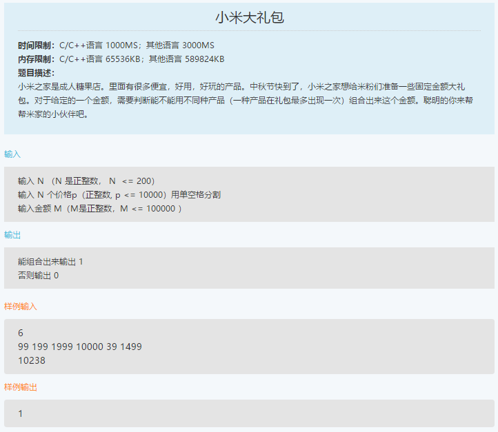
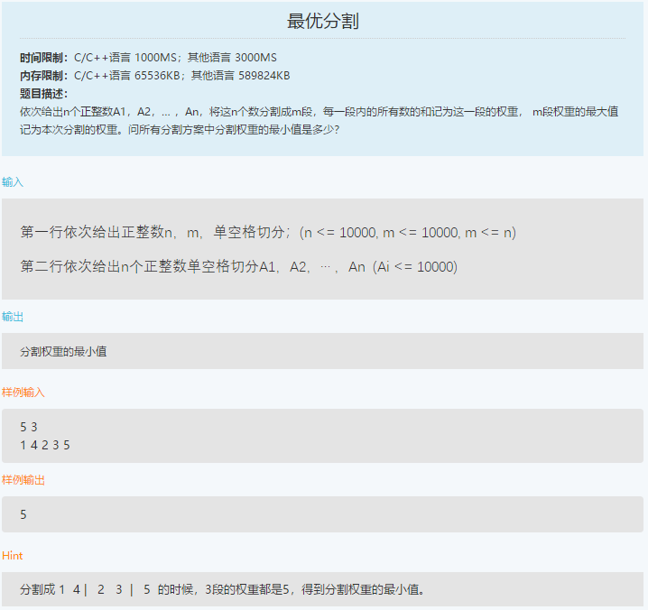

笔试-小米-180920
===
- 单选 10，多选 10，编程 2

Reference
---
- **小米大礼包**：https://blog.csdn.net/amusi1994/article/details/82793376
- **最优分割**：https://blog.csdn.net/amusi1994/article/details/82793562
    > [小米算法编程题_笔经面经](https://www.nowcoder.com/discuss/114667?toCommentId=1934155)_牛客网 
    >> 作者：[阿木寺-CSDN](https://blog.csdn.net/amusi1994)

Index
---
<!-- TOC -->

- [1. 小米大礼包](#1-小米大礼包)
- [2. 最优分割](#2-最优分割)

<!-- /TOC -->

## 1. 小米大礼包
<div align="center"></div>

**思路**
- DFS

**C++**（67%，TLE）
```C++
#include <stdio.h>
int n;
int p[210];
int m;

bool dfs(int i, int sum) {
    if (i == n) return sum == m;
    if (dfs(i + 1, sum + p[i])) return true;
    if (dfs(i + 1, sum)) return true;
    return false;
}

int main() {

    scanf("%d", &n);
    for (int i = 0; i < n; ++i)
        scanf("%d", &p[i]);
    scanf("%d", &m);

    if (dfs(0, 0)) 
        printf("1");
    else 
        printf("0");

    return 0;
}
```

**加入剪枝**（未测试）
> [【小米2018-09-20在线笔试】小米大礼包](https://blog.csdn.net/amusi1994/article/details/82793376) - CSDN博客 
```C++
#include <stdio.h>
int n;
int p[210];
int m;

bool dfs(int i, int sum) {
    if (sum > m) return false;  // 剪枝
    if (i == n) return sum == m;
    if (dfs(i + 1, sum + p[i])) return true;
    if (dfs(i + 1, sum)) return true;
    return false;
}

int main() {

    scanf("%d", &n);
    for (int i = 0; i < n; ++i)
        scanf("%d", &p[i]);
    scanf("%d", &m);

    if (dfs(0, 0)) 
        printf("1");
    else 
        printf("0");

    return 0;
}
```


## 2. 最优分割
<div align="center"></div>

**思路**
- 二分查找、动态规划
- LeetCode [410. 分割数组的最大值](https://leetcode-cn.com/problems/split-array-largest-sum/description/)

**低保**（18%）
```python
n, m = list(map(int, input().split()))

A = list(map(int, input().split()))

if sum(A) % m == 0:
    print(sum(A) // m)
```

**Python**（未测试）
```python
# 作者：Tercel818
# 链接：https://www.nowcoder.com/discuss/114578?type=2&order=0&pos=23&page=1
# 来源：牛客网

n, m = map(int, input().split())
nums = list(map(int, input().split()))
acc_sum = [0]
for item in nums:
    acc_sum.append(acc_sum[-1] + item)
dp = [[float("inf")] * (1 + len(nums)) for _ in range(m + 1)]
dp[0][0] = 0
for i in range(1, m + 1):
    for j in range(1, len(nums) + 1):
        for k in reversed(range(i - 1, j)):
            val = max(dp[i - 1][k], acc_sum[j] - acc_sum[k])
            dp[i][j] = min(val, dp[i][j])
print(dp[m][len(nums)])
```
