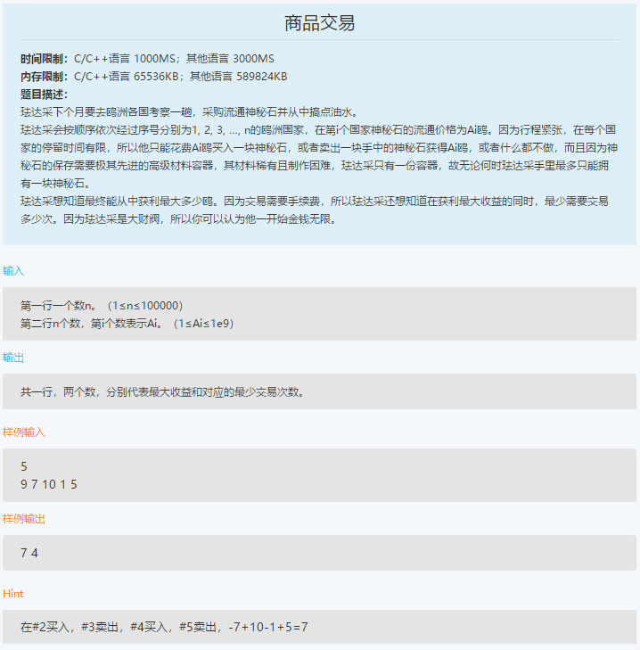

笔试-度小满-180913
===
- 机器学习研发
- 选择 30，编程 2

Index
---
<!-- TOC -->

- [火车站台](#火车站台)
- [商品交易](#商品交易)

<!-- /TOC -->

## 火车站台
<div align="center"></div>
<div align="center"></div>

**思路**
- 求区间最大重叠数

**暴力法**（36%）
```python
n = int(input())

tmp = dict()
mx = 0
for _ in range(n):
    x, y = list(map(int, input().split()))
    for i in range(x, y):
        if i in tmp:
            tmp[i] += 1
        else:
            tmp[i] = 1
        mx = max(tmp[i], mx)

print(mx)
```

**扫描线法**（AC）
```python
n = int(input())

tmp = []
mx = 0
for _ in range(n):
    x, y = list(map(int, input().split()))
    tmp.append((x, 1))
    tmp.append((y, -1))

tmp.sort()

mx = 0
t = 0
for i in tmp:
    if i[1] == 1:
        t += 1
    else:
        t -= 1

    mx = max(mx, t)

print(mx)
```

## 商品交易
<div align="center"></div>

**思路**
- LeetCode原题
- 因为这里要求输出最小交易次数，所以贪心不可行，改用双指针

**贪心**（9%）
```python
n = int(input())

nums = list(map(int, input().split()))

def foo(nums):
    ans = 0
    cnt = 0
    if len(nums) <= 1:
        return 0
    for x in range(1, len(nums)):
        if nums[x] - nums[x - 1] >= 0:
            ans += nums[x] - nums[x - 1]
            cnt += 2
    return ans, cnt

ans, cnt = foo(nums)
print(ans, cnt)
```

**双指针**（AC）
```python
n = int(input())

nums = list(map(int, input().split()))

def foo(nums):
    ans = i = 0
    cnt = 0
    while i < len(nums):
        while i < len(nums) - 1 and nums[i + 1] <= nums[i]:
            i += 1
        minima = nums[i]
        i += 1

        while i < len(nums) - 1 and nums[i + 1] >= nums[i]:
            i += 1
            
        if i < len(nums):
            ans += nums[i] - minima
            cnt += 2

    return ans, cnt

ans, cnt = foo(nums)
print(ans, cnt)
```