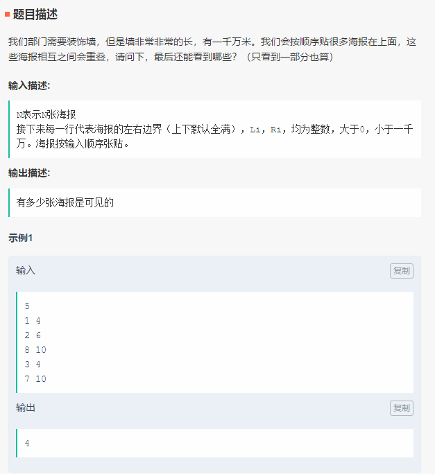

笔试-招行-180830
===
15道单选、5道多选、3道问答、2道编程

Index
---
<!-- TOC -->

- [重叠的装饰](#重叠的装饰)
- [推倒吧骨牌](#推倒吧骨牌)

<!-- /TOC -->

## 重叠的装饰

**题目描述**
  

**思路**
- 线段树
  > [统计颜色（线段树区间修改问题）](https://blog.csdn.net/bao___zi/article/details/80154839) - CSDN博客 

## 推倒吧骨牌
> LeetCode 原题：https://leetcode-cn.com/problems/push-dominoes/description/
>> **题解**：../算法/LeetCode题解/[838. 推多米诺](../算法/题解-LeetCode.md#838-推多米诺)
  

  

