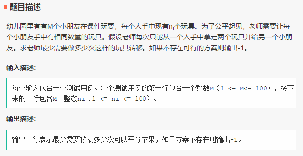
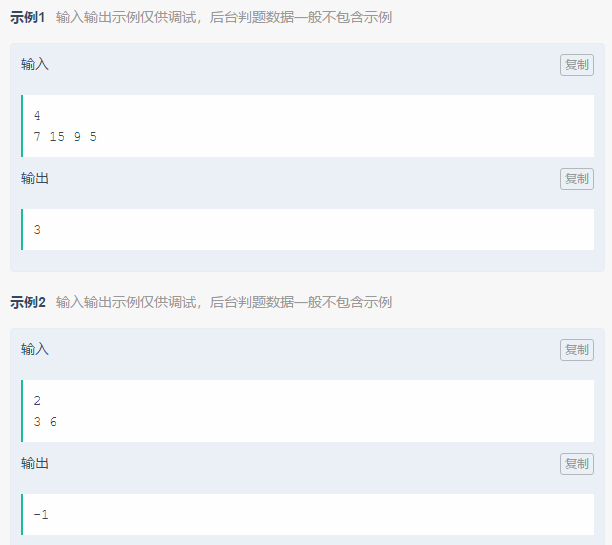
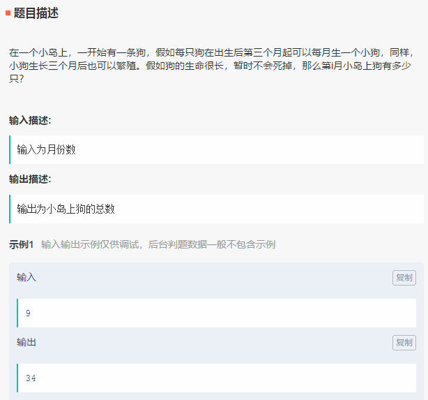

笔试-搜狐畅游-180915
===

- 考试题型：
  - 基础能力-单选题 10 道，
  - 基础能力-资料分析题一 5 道，
  - 基础能力-资料分析题二 5 道，
  - 专业能力-单选题 10 道，
  - 专业能力-多选题 5 道，
  - 专业能力-填空题 5 道，
  - 专业能力-问答题 2 道，
  - 专业能力-编程题 2 道


Index
---
<!-- TOC -->

- [分玩具](#分玩具)
- [多少个狗](#多少个狗)

<!-- /TOC -->


## 分玩具
<div align="center"></div>
<div align="center"></div>

**低保**（16.67%）
```python
m = int(input())
n = list(map(int, input().split()))

n_sum = sum(n)
n_len = len(n)
n_avg = n_sum // n_len

if n_sum / n_len != n_avg:
    print(-1)
```

**暴力**（83.33%）
```python
m = int(input())
n = list(map(int, input().split()))

n_sum = sum(n)
n_len = len(n)
n_avg = n_sum // n_len

if n_sum / n_len != n_avg:
    print(-1)

ret = 0
for i in n:
    if i > n_avg:
        ret += i - n_avg

print(ret // 2)
```

**Python**（AC）
```python
m = int(input())
n = list(map(int, input().split()))

def foo(n):
    n_sum = sum(n)
    n_len = len(n)
    n_avg = n_sum // n_len

    if n_sum / n_len != n_avg:
        return -1

    odd = 0
    eve = 0
    for i in n:
        if i % 2 == 1:
            odd = 1  # 存在奇数
        if i % 2 == 0:
            eve = 1  # 存在偶数

    if n_avg % 2 == 1 and eve:
        return -1
    if n_avg % 2 == 0 and odd:
        return -1

    ret = 0
    for i in n:
        if i > n_avg:
            ret += i - n_avg

    return ret // 2

print(foo(n))
```


## 多少个狗
<div align="center"></div>

**思路**
- 斐波那契数列

**Python**（AC）
```Python
n = int(input())

dp = [1, 1]

for i in range(2, n):
    dp.append(dp[i-1] + dp[i-2])

print(dp[n-1])
```