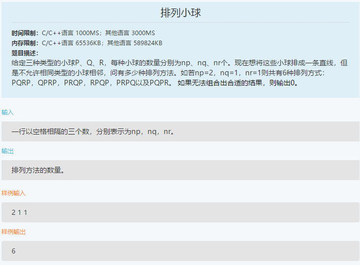
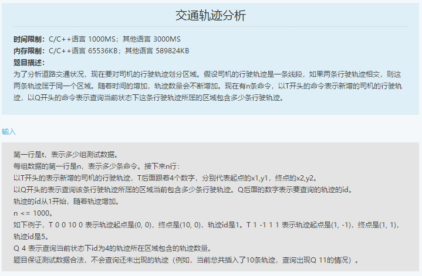
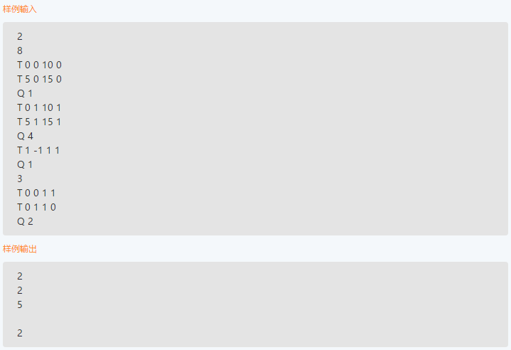

笔试-滴滴-180918
===
- 选择 30，编程 2


Index
---
<!-- TOC -->

- [排列小球](#排列小球)
- [交通轨迹分析](#交通轨迹分析)

<!-- /TOC -->

## 排列小球
<div align="center"></div>

**思路**
- DFS（会超时）
- 多维 DP
    > [Ways to arrange Balls such that adjacent balls are of different types](https://www.geeksforgeeks.org/ways-to-arrange-balls-such-that-adjacent-balls-are-of-different-types/) - GeeksforGeeks 

**C++**（67%，TLE）
```C++
#include <iostream>
#include <vector>

using namespace std;

int bs[3];
int n;
int ans;
vector<int> tmp;

void dfs(int step) {
    if (tmp.size() == n) {
        ans += 1;
        return;
    }

    for (int i = 0; i < 3; i++) {
        if (bs[i] > 0 && i != tmp.back()) {
            tmp.push_back(i);
            bs[i] -= 1;
            dfs(step + 1);
            bs[i] += 1;
            tmp.pop_back();
        }
    }
}

void solve() {
    cin >> bs[0] >> bs[1] >> bs[2];
    n = bs[0] + bs[1] + bs[2];
    ans = 0;

    for (int i = 0; i < 3; i++) {
        if (bs[i] > 0) {
            tmp.push_back(i);
            bs[i] -= 1;
            dfs(1);
            bs[i] += 1;
            tmp.pop_back();
        }
    }
    cout << ans;
}

int main() {

    solve();

    //cout << endl;
    //system("PAUSE");
    return 0;
}
```

**多维 DP**（未测试）
> [Ways to arrange Balls such that adjacent balls are of different types](https://www.geeksforgeeks.org/ways-to-arrange-balls-such-that-adjacent-balls-are-of-different-types/) - GeeksforGeeks 

```C++
#include<bits/stdc++.h> 
using namespace std; 
#define MAX 100 
  
// table to store to store results of subproblems 
int dp[MAX][MAX][MAX][3]; 
  
// Returns count of arrangements where last placed ball is 
// 'last'.  'last' is 0 for 'p', 1 for 'q' and 2 for 'r' 
int countWays(int p, int q, int r, int last) 
{ 
    // if number of balls of any color becomes less 
    // than 0 the number of ways arrangements is 0. 
    if (p<0 || q<0 || r<0) 
        return 0; 
  
    // If last ball required is of type P and the number 
    // of balls of P type is 1 while number of balls of 
    // other color is 0 the number of ways is 1. 
    if (p==1 && q==0 && r==0 && last==0) 
        return 1; 
  
    // Same case as above for 'q' and 'r' 
    if (p==0 && q==1 && r==0 && last==1) 
        return 1; 
    if (p==0 && q==0 && r==1 && last==2) 
        return 1; 
  
    // If this subproblem is already evaluated 
    if (dp[p][q][r][last] != -1) 
        return dp[p][q][r][last]; 
  
    // if last ball required is P and the number of ways is 
    // the sum of number of ways to form sequence with 'p-1' P 
    // balls, q Q Balls and r R balls ending with Q and R. 
    if (last==0) 
       dp[p][q][r][last] = countWays(p-1,q,r,1) + countWays(p-1,q,r,2); 
  
    // Same as above case for 'q' and 'r' 
    else if (last==1) 
       dp[p][q][r][last] = countWays(p,q-1,r,0) + countWays(p,q-1,r,2); 
    else //(last==2) 
       dp[p][q][r][last] =  countWays(p,q,r-1,0) + countWays(p,q,r-1,1); 
  
    return dp[p][q][r][last]; 
} 
  
// Returns count of required arrangements 
int countUtil(int p, int q, int r) 
{ 
   // Initialize 'dp' array 
   memset(dp, -1, sizeof(dp)); 
  
   // Three cases arise: 
   return countWays(p, q, r, 0) +  // Last required balls is type P 
          countWays(p, q, r, 1) +  // Last required balls is type Q 
          countWays(p, q, r, 2); // Last required balls is type R 
} 
  
// Driver code to test above 
int main() 
{ 
    int p = 1, q = 1, r = 1; 
    printf("%d", countUtil(p, q, r)); 
    return 0; 
} 
```

## 交通轨迹分析
<div align="center"></div>
<div align="center"></div>

**思路**
- 并查集/暴力枚举
- 判断相交
    ```python
    class Point(object):
        def __init__(self, x, y):
            self.x = x
            self.y = y


    def is_cross(a, b, c, d):
        fc = (c.y - a.y) * (a.x - b.x) - (c.x - a.x) * (a.y - b.y)
        fd = (d.y - a.y) * (a.x - b.x) - (d.x - a.x) * (a.y - b.y)
        
        if fc * fd > 0:
            return False
        return True
    ```

**暴力**（未测试）
```python
# 作者：牛客4807725号
# 链接：https://www.nowcoder.com/discuss/112681?toCommentId=1905196
# 来源：牛客网

class point():
    def __init__(self, x, y):
        self.x = x
        self.y = y


def isxiangjiao(a, b, c, d):
    fc = (c.y - a.y) * (a.x - b.x) - (c.x - a.x) * (a.y - b.y)
    fd = (d.y - a.y) * (a.x - b.x) - (d.x - a.x) * (a.y - b.y)
    if fc * fd > 0:
        return False
    return True


import sys
import collections

if __name__ == "__main__":
    t = int(sys.stdin.readline().strip())
    for i in range(t):
        n = int(sys.stdin.readline().strip())
        roaddict = collections.defaultdict(set)
        roadpos = []
        count = 1
        for j in range(n):
            line = sys.stdin.readline().strip().split()
            if line[0] == 'T':
                x1, y1, x2, y2 = int(line[1]), int(line[2]), int(line[3]), int(line[4])
                pointa = point(x1, y1)
                pointb = point(x2, y2)
                roadpos.append([pointa, pointb])
                if count == 1:
                    roaddict[count].add(count)
                    count += 1
                else:
                    visited = set()
                    for tmpi in range(1, len(roadpos) + 1):
                        pointc = roadpos[tmpi - 1][0]
                        pointd = roadpos[tmpi - 1][1]
                        if tmpi not in visited and isxiangjiao(pointa, pointb, pointc, pointd):
                            visited.add(tmpi)
                            roaddict[tmpi].add(count)
                            roaddict[count].add(count)
                            for tmp in roaddict[tmpi]:
                                visited.add(tmp)
                                roaddict[tmp].add(count)
                                roaddict[count].add(tmp)
                    for tmp in roaddict[count]:
                        roaddict[tmp] = roaddict[count]
                    count += 1
            if line[0] == 'Q':
                #                 print(roaddict)
                queryvale = int(line[1])
                print(len(roaddict[queryvale]))
        print()
```