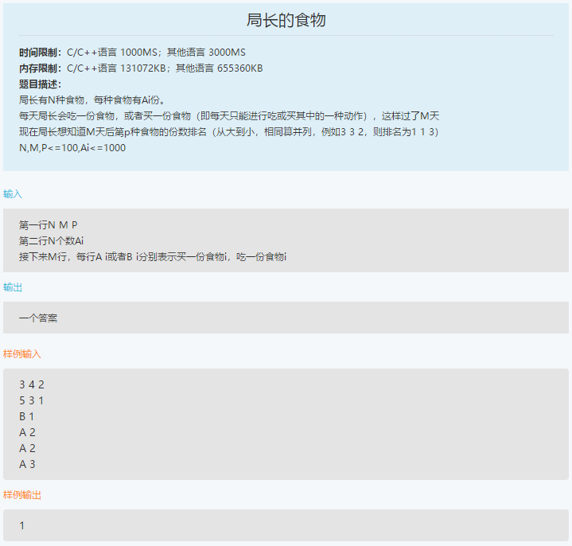
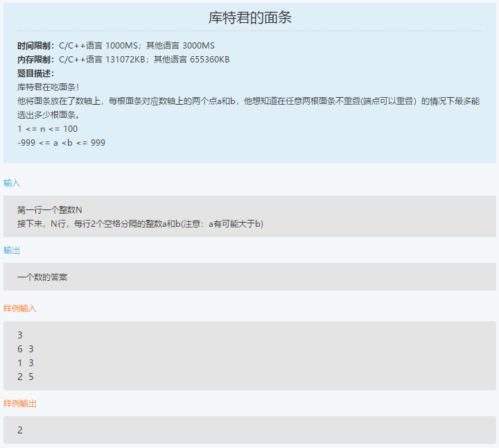

笔试-爱奇艺-180915
===
- 单选 20，编程 2

Index
---
<!-- TOC -->

- [局长的食物](#局长的食物)
- [库特君的面条](#库特君的面条)

<!-- /TOC -->

## 局长的食物
<div align="center"></div>

**思路**
- 排序

**暴力**（AC）
```python
N, M, P = list(map(int, input().split()))
A = list(map(int, input().split()))
for i in range(M):
    """"""
    flag, t = input().split()
    a = int(t)

    if flag == 'A':
        A[a - 1] += 1
    else:
        A[a - 1] -= 1

A = list(zip(A, range(1, len(A) + 1)))
# A = [(4, 1), (5, 2), (2, 3), (4, 4), (2, 5)]
# print(A)
A.sort(reverse=True)
# print(A)
ret = {A[0][1]: 1}  # {2: 1}

for i in range(1, len(A)):
    if A[i][0] == A[i - 1][0]:
        ret[A[i][1]] = ret[A[i-1][1]]
    else:
        ret[A[i][1]] = i + 1

# print(ret)
print(ret[P])
```

## 库特君的面条
<div align="center"></div>

**思路**
- 贪心
- 最大不重叠区间

**贪心**（AC）
```python
N = int(input())

line = []
for _ in range(N):
    a, b = sorted(list(map(int, input().split())))
    line.append([a, b])

# line.sort()
line.sort(key=lambda a: a[1])
# print(line)
ret = [line[0]]
for item in line[1:]:
    if item[0] < ret[-1][1]:
        pass
    else:
        ret.append(item)

print(len(ret))
```