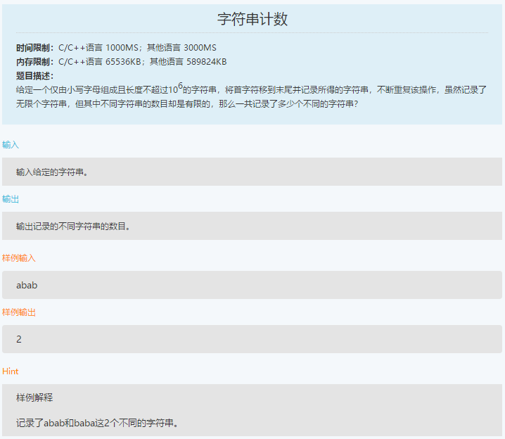
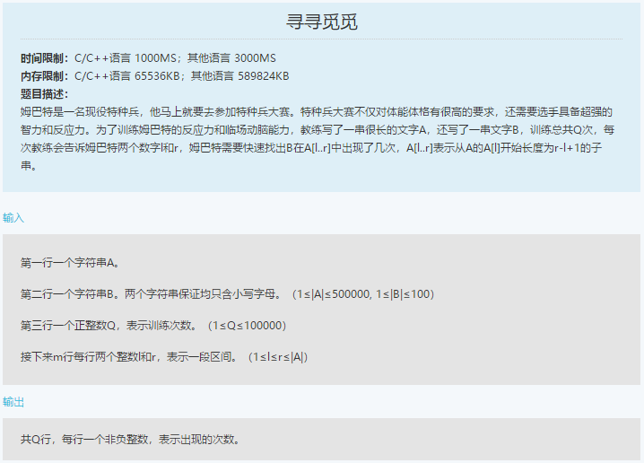

笔试-百度-180914
===
- 选择 30，简答 2，编程 2


Index
---
<!-- TOC -->

- [字符串计数](#字符串计数)
- [寻寻觅觅](#寻寻觅觅)

<!-- /TOC -->


## 字符串计数
<div align="center"></div>

**暴力 1**（9%，MLE）
```python
s = input()

tmp = set()
for i in range(len(s)):
    tmp.add(s)
    s = s[1:] + s[0]

print(len(tmp))
```

**暴力 2**（AC）
```python
s = input()

def foo(s):
    for i in range(1, len(s) + 1):
        if len(s) % i == 0:
            if s[:i] * (len(s) // i) == s:
                return i

print(foo(s))
```


## 寻寻觅觅
<div align="center"></div>
<div align="center"></div>

**暴力**（73%，TLE）
```python
A = input()
B = input()
Q = int(input())

for _ in range(Q):
    l, r = list(map(int, input().split()))
    print(A[l-1: r].count(B))
```

**前缀数组**（36%，TLE）
```
A = input()
B = input()
Q = int(input())

ret = [0] * len(A)
for i in range(len(A)):
    ret[i] = A[:i].count(B)

ret += [ret[-1]]

for _ in range(Q):
    l, r = list(map(int, input().split()))
    print(ret[r] - ret[l])
```