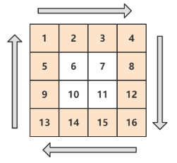
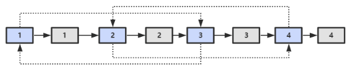

**说明**
---
- 主要编程语言为 C/C++
- 涉及**字符串**的问题可能会使用 Python
- 题目编号以原书为准，如“**面试题 3：数组中重复的数字**”
  - 因为题目不多，所以就不做分类了
- 所有代码均通过 OJ 测试
    > 在线 **OJ 地址**：[剑指Offer_编程题](https://www.nowcoder.com/ta/coding-interviews) - 牛客网 

**Reference**
---
- 《剑指 Offer（第二版）》 - 何海涛
- Interview-Notebook/[剑指 offer 题解.md](https://github.com/CyC2018/Interview-Notebook/blob/master/notes/%E5%89%91%E6%8C%87%20offer%20%E9%A2%98%E8%A7%A3.md) · CyC2018/Interview-Notebook
- 牛客网相关问题讨论区


**Index**
---
<!-- TOC -->

- [3.1 数组中重复的数字](#31-数组中重复的数字)
- [3.2 不修改数组找出重复的数字](#32-不修改数组找出重复的数字)
- [4. 二维数组中的查找](#4-二维数组中的查找)
- [5. 替换空格](#5-替换空格)
- [6. 从尾到头打印链表](#6-从尾到头打印链表)
- [7. 重建二叉树](#7-重建二叉树)
- [8. 二叉树的下一个结点](#8-二叉树的下一个结点)
- [9. 用两个栈实现队列](#9-用两个栈实现队列)
- [10.1 斐波那契数列](#101-斐波那契数列)
- [10.2 跳台阶（递归）](#102-跳台阶递归)
- [10.3 变态跳台阶（动态规划）](#103-变态跳台阶动态规划)
- [10.4 矩形覆盖（动态规划）](#104-矩形覆盖动态规划)
- [11. 旋转数组的最小数字（二分查找）](#11-旋转数组的最小数字二分查找)
- [12. 矩阵中的路径（DFS）](#12-矩阵中的路径dfs)
- [13. 机器人的运动范围（DFS） TODO](#13-机器人的运动范围dfs-todo)
- [14. 剪绳子（动态规划 | 贪心）](#14-剪绳子动态规划--贪心)
- [15. 二进制中 1 的个数（位运算）](#15-二进制中-1-的个数位运算)
- [16. 数值的整数次方（位运算）](#16-数值的整数次方位运算)
- [17. 打印从 1 到最大的 n 位数（字符串 + DFS）](#17-打印从-1-到最大的-n-位数字符串--dfs)
- [18.1 在 O(1) 时间内删除链表节点（链表）](#181-在-o1-时间内删除链表节点链表)
- [18.2 删除链表中重复的结点（链表）](#182-删除链表中重复的结点链表)
- [19. 正则表达式匹配（自动机：动态规划 | DFS）](#19-正则表达式匹配自动机动态规划--dfs)
- [20. 表示数值的字符串（自动机 | 正则）](#20-表示数值的字符串自动机--正则)
- [21. 调整数组顺序使奇数位于偶数前面（数组）](#21-调整数组顺序使奇数位于偶数前面数组)
- [22. 链表中倒数第 K 个结点（链表 + 双指针）](#22-链表中倒数第-k-个结点链表--双指针)
- [23. 链表中环的入口结点（链表 + 双指针）](#23-链表中环的入口结点链表--双指针)
- [24. 反转链表（链表）](#24-反转链表链表)
- [25. 合并两个排序的链表（链表）](#25-合并两个排序的链表链表)
- [26. 树的子结构（二叉树）](#26-树的子结构二叉树)
- [27. 二叉树的镜像（二叉树）](#27-二叉树的镜像二叉树)
- [28 对称的二叉树（二叉树）](#28-对称的二叉树二叉树)
- [29. 顺时针打印矩阵（二维数组）](#29-顺时针打印矩阵二维数组)
- [30. 包含 min 函数的栈（数据结构：栈）](#30-包含-min-函数的栈数据结构栈)
- [31. 栈的压入、弹出序列（数据结构：栈）](#31-栈的压入弹出序列数据结构栈)
- [32.1 从上往下打印二叉树（BFS）](#321-从上往下打印二叉树bfs)
- [32.2 分行从上到下打印二叉树（BFS）](#322-分行从上到下打印二叉树bfs)
- [32.3 按之字形顺序打印二叉树（BFS）](#323-按之字形顺序打印二叉树bfs)
- [33. 二叉搜索树的后序遍历序列（二叉树：递归）](#33-二叉搜索树的后序遍历序列二叉树递归)
- [34. 二叉树中和为某一值的路径（DFS）](#34-二叉树中和为某一值的路径dfs)
- [35. 复杂链表的复制（链表）](#35-复杂链表的复制链表)
- [36. 二叉搜索树与双向链表（DFS）](#36-二叉搜索树与双向链表dfs)
- [37. 序列化二叉树（DFS）***](#37-序列化二叉树dfs)
- [38. 字符串的排列（DFS）](#38-字符串的排列dfs)
- [39.1 数组中出现次数超过一半的数字（多数投票问题）](#391-数组中出现次数超过一半的数字多数投票问题)
- [40. 找出数组中第 k 大的数字（数据结构：堆）***](#40-找出数组中第-k-大的数字数据结构堆)
- [41. 数据流中的中位数（数据结构：堆）](#41-数据流中的中位数数据结构堆)
- [42. 连续子数组的最大和](#42-连续子数组的最大和)
- [43. 从 1 到 n 整数中 1 出现的次数（Trick）](#43-从-1-到-n-整数中-1-出现的次数trick)
- [44. 数字序列中的某一位数字（Trick）](#44-数字序列中的某一位数字trick)
- [45. 把数组排成最小的数（排序）](#45-把数组排成最小的数排序)
- [46. 把数字翻译成字符串（解码方法）（动态规划）](#46-把数字翻译成字符串解码方法动态规划)
- [47. 礼物的最大价值（年终奖）（动态规划）](#47-礼物的最大价值年终奖动态规划)
- [48. 最长不含重复字符的子字符串（动态规划）](#48-最长不含重复字符的子字符串动态规划)
- [49. 丑数（动态规划）](#49-丑数动态规划)
- [50.1 第一个只出现一次的字符位置（Hash）](#501-第一个只出现一次的字符位置hash)
- [50.2 字符流中第一个只出现一次的字符（数据结构：队列）](#502-字符流中第一个只出现一次的字符数据结构队列)
- [51. 数组中的逆序对](#51-数组中的逆序对)
- [](#)
- [](#-1)
- [](#-2)
- [](#-3)
- [](#-4)
- [](#-5)

<!-- /TOC -->


## 3.1 数组中重复的数字
> [数组中重复的数字](https://www.nowcoder.com/practice/623a5ac0ea5b4e5f95552655361ae0a8?tpId=13&tqId=11203&tPage=3&rp=3&ru=/ta/coding-interviews&qru=/ta/coding-interviews/question-ranking) - NowCoder

**题目描述**
```
在一个长度为 n 的数组里的所有数字都在 0 到 n-1 的范围内。
数组中某些数字是重复的，但不知道有几个数字是重复的，也不知道每个数字重复几次。
请找出数组中任意一个重复的数字。
```
- 要求：时间复杂度`O(N)`，空间复杂度`O(1)`
- 示例
  ```
  Input:
  {2, 3, 1, 0, 2, 5}

  Output:
  2
  ```

**思路**
- 复杂度要求表明**不能使用排序**，也不能使用 **map**/**set**
- 注意到 n 个数字的范围为 `0` 到 `n-1`，考虑类似**选择排序**的思路，通过一次遍历将每个数交换到排序后的位置，如果该位置已经存在相同的数字，那么该数就是重复的
- 示例
  ```
  position-0 : (2,3,1,0,2,5) // 2 <-> 1
               (1,3,2,0,2,5) // 1 <-> 3
               (3,1,2,0,2,5) // 3 <-> 0
               (0,1,2,3,2,5) // already in position
  position-1 : (0,1,2,3,2,5) // already in position
  position-2 : (0,1,2,3,2,5) // already in position
  position-3 : (0,1,2,3,2,5) // already in position
  position-4 : (0,1,2,3,2,5) // nums[i] == nums[nums[i]], exit
  ```
**Code**
```C++
class Solution {
public:
    bool duplicate(int numbers[], int length, int* duplication) {
        if(numbers == nullptr || length <= 0)
            return false;

        for(int i = 0; i < length; ++i) {
            while(numbers[i] != i) {
                if(numbers[i] == numbers[numbers[i]]) {
                    *duplication = numbers[i];
                    return true;
                }
                // 交换numbers[i]和numbers[numbers[i]]
                swap(numbers[i], numbers[numbers[i]]);
            }
        }
        return false;
    }
};
```


## 3.2 不修改数组找出重复的数字

**题目描述**
```
在一个长度为n+1的数组里的所有数字都在1到n的范围内，所以数组中至少有一个数字是重复的。
请找出数组中任意一个重复的数字，但不能修改输入的数组。
例如，如果输入长度为8的数组{2, 3, 5, 4, 3, 2, 6, 7}，那么对应的输出是重复的数字2或者3。
```
- 要求：时间复杂度`O(NlogN)`，空间复杂度`O(1)`

**思路**
- 二分查找
- 以长度为 8 的数组 `{2, 3, 5, 4, 3, 2, 6, 7}` 为例，那么所有数字都在 `1~7` 的范围内。中间的数字 `4` 将 `1~7` 分为 `1~4` 和 `5~7`。统计 `1~4` 内数字的出现次数，它们一共出现了 5 次，说明 `1~4` 内必要重复的数字；反之，若小于等于 4 次，则说明 `5~7` 内必有重复的数字。
- 因为不能使用额外的空间，所以每次统计次数都要重新遍历整个数组一次

**Code**
```C++
int countRange(const int* numbers, int length, int start, int end);

int getDuplication(const int* numbers, int length)
{
    if(numbers == nullptr || length <= 0)
        return -1;

    int start = 1;
    int end = length - 1;
    while(end >= start) {
        int middle = ((end - start) >> 1) + start;
        int count = countRange(numbers, length, start, middle);
        if(end == start) {
            if(count > 1)
                return start;
            else
                break;
        }

        if(count > (middle - start + 1))
            end = middle;
        else
            start = middle + 1;
    }
    return -1;
}

// 因为不能使用额外的空间，所以每次统计次数都要重新遍历整个数组一次
int countRange(const int* numbers, int length, int start, int end) {
    if(numbers == nullptr)
        return 0;

    int count = 0;
    for(int i = 0; i < length; i++)
        if(numbers[i] >= start && numbers[i] <= end)
            ++count;
    return count;
}
```


## 4. 二维数组中的查找
> [二维数组中的查找](https://www.nowcoder.com/practice/abc3fe2ce8e146608e868a70efebf62e?tpId=13&tqId=11154&tPage=1&rp=1&ru=/ta/coding-interviews&qru=/ta/coding-interviews/question-ranking) - NowCoder

**题目描述**
```
在一个二维数组中，每一行都按照从左到右递增的顺序排序，每一列都按照从上到下递增的顺序排序。
请完成一个函数，输入这样的一个二维数组和一个整数，判断数组中是否含有该整数。
```
- 示例
  ```html
  Consider the following matrix:
  [
    [1,   4,  7, 11, 15],
    [2,   5,  8, 12, 19],
    [3,   6,  9, 16, 22],
    [10, 13, 14, 17, 24],
    [18, 21, 23, 26, 30]
  ]

  Given target = 5, return true.
  Given target = 20, return false.
  ```

**思路**
- 从**左下角**开始查找，它左边的数都比它小，下边的数都比它大；因此可以根据 target 和当前元素的大小关系来**缩小查找区间**
- 同理，也可以从**右上角**开始查找
- 时间复杂度：`O(M + N)`

**Code**
```C++
class Solution {
public:
    bool Find(int target, vector<vector<int> > array) {
        int N = array.size();          // 行数
        int M = array[0].size();       // 列数
            
        int i = N - 1;
        int j = 0;
        while (i >= 0 && j < M) {
            if (array[i][j] > target)
                i--;
            else if (array[i][j] < target)
                j++;
            else
                return true;
        }
        return false;
    }
};
```


## 5. 替换空格
> [替换空格](https://www.nowcoder.com/practice/4060ac7e3e404ad1a894ef3e17650423?tpId=13&tqId=11155&tPage=1&rp=1&ru=%2Fta%2Fcoding-interviews&qru=%2Fta%2Fcoding-interviews%2Fquestion-ranking) - NowCoder 

**题目描述**
```
请实现一个函数，将一个字符串中的空格替换成“%20”。
例如，当字符串为 "We Are Happy". 则经过替换之后的字符串为 "We%20Are%20Happy"。
```

**思路**
- 先遍历一次，找出空格的数量，得到替换后的长度；然后从后往前替换

**Code**
```C++
class Solution {
public:
    void replaceSpace(char *str, int length) {
        if (str == nullptr || length < 0)
            return;

        int l_old = strlen(str);  // == length
        int n_space = count(str, str + l_old, ' ');  // <algorithm>
        int l_new = l_old + n_space * 2;
        str[l_new] = '\0';

        int p_old = l_old-1;
        int p_new = l_new-1;
        while (p_old >= 0) {
            if (str[p_old] != ' ') {
                str[p_new--] = str[p_old--];
            }
            else {
                p_old--;
                str[p_new--] = '0';
                str[p_new--] = '2';
                str[p_new--] = '%';
            }
        }
    }
};
```


## 6. 从尾到头打印链表
> [从尾到头打印链表](https://www.nowcoder.com/practice/d0267f7f55b3412ba93bd35cfa8e8035?tpId=13&tqId=11156&tPage=1&rp=1&ru=%2Fta%2Fcoding-interviews&qru=%2Fta%2Fcoding-interviews%2Fquestion-ranking) - NowCoder

**题目描述**
```
输入链表的第一个节点，从尾到头反过来打印出每个结点的值。
```

**思路**
- 栈
- 头插法（双端队列或数组）

**Code**
```C++
class Solution {
public:
    vector<int> printListFromTailToHead(ListNode* head) {
        vector<int> ret;

        ListNode *p = head;
        while (p != NULL) {
            ret.insert(ret.begin(), p->val);   // 头插
            p = p->next;
        }

        return ret;
    }
};
```


## 7. 重建二叉树
> [重建二叉树](https://www.nowcoder.com/practice/8a19cbe657394eeaac2f6ea9b0f6fcf6?tpId=13&tqId=11157&tPage=1&rp=1&ru=%2Fta%2Fcoding-interviews&qru=%2Fta%2Fcoding-interviews%2Fquestion-ranking) - NowCoder

**题目描述**
```
根据二叉树的前序遍历和中序遍历的结果，重建出该二叉树。
假设输入的前序遍历和中序遍历的结果中都不含重复的数字。
```

**思路**
- 涉及二叉树的问题，应该条件反射般的使用**递归**（无优化要求时）
- 前序遍历的第一个值为根节点的值，使用这个值将中序遍历结果分成两部分，左部分为左子树的中序遍历结果，右部分为右子树的中序遍历的结果。
- **示例**
  ```
  前序
    1,2,4,7,3,5,6,8
  中序
    4,7,2,1,5,3,8,6
  
  第一层
    根节点 1
    根据根节点的值（不重复），划分中序：
      {4,7,2} 和 {5,3,8,6}
    根据左右子树的长度，划分前序：
      {2,4,7} 和 {3,5,6,8}
    从而得到左右子树的前序和中序
      左子树的前序和中序：{2,4,7}、{4,7,2}
      右子树的前序和中序：{3,5,6,8}、{5,3,8,6}

  第二层
    左子树的根节点 2
    右子树的根节点 3
    ...
  ```

**Code - 无优化**
```C++
struct TreeNode {
    int val;
    TreeNode *left;
    TreeNode *right;
    TreeNode(int x) : val(x), left(NULL), right(NULL) {}
};

class Solution {
public:
    TreeNode * reConstructBinaryTree(vector<int> pre, vector<int> vin) {
        if (pre.size() <= 0)
            return NULL;

        TreeNode* root = new TreeNode{ pre[0] };
        for (auto i = 0; i < vin.size(); i++) {
            if (vin[i] == pre[0]) {
                root->left = reConstructBinaryTree(vector<int>(pre.begin() + 1, pre.begin() + 1 + i), vector<int>(vin.begin(), vin.begin() + i));
                root->right = reConstructBinaryTree(vector<int>(pre.begin() + 1 + i, pre.end()), vector<int>(vin.begin() + 1 + i, vin.end()));
            }
        }
        return root;
    }
};
```

**Code - 优化**
```C++
class Solution {
public:
    TreeNode * reConstructBinaryTree(vector<int> pre, vector<int> vin) {
        return reConstructCore(pre, 0, pre.size(), vin, 0, vin.size());
    }
    
    TreeNode * reConstructCore(vector<int> &pre, int pre_beg, int pre_end, vector<int> &vin, int vin_beg, int vin_end) {
        if (pre_end - pre_beg <= 0)
            return NULL;

        TreeNode* root = new TreeNode{ pre[pre_beg] };
        for (auto i = 0; i < vin_end-vin_beg; i++) {
            if (vin[i+vin_beg] == pre[pre_beg]) {
                root->left = reConstructCore(pre, pre_beg+1, pre_beg+1+i, vin, vin_beg, vin_beg+i);
                root->right = reConstructCore(pre, pre_beg+1+i, pre_end, vin, vin_beg+1+i, vin_end);
            }
        }
        return root;
    }
};
```


## 8. 二叉树的下一个结点
> [二叉树的下一个结点](https://www.nowcoder.com/practice/9023a0c988684a53960365b889ceaf5e?tpId=13&tqId=11210&tPage=3&rp=1&ru=%2Fta%2Fcoding-interviews&qru=%2Fta%2Fcoding-interviews%2Fquestion-ranking) - NowCoder

**题目描述**
```
给定一个二叉树和其中的一个结点，请找出中序遍历顺序的下一个结点并且返回。
注意，树中的结点不仅包含左右子结点，同时包含指向父结点的指针。
```

**思路**
- 回顾中序遍历的顺序
- 如果一个节点的右子树不为空，那么下一个节点是该节点右子树的最左叶子；
- 否则（右子树为空），沿父节点向上直到找到某个节点是其父节点的左孩子，那么该父节点就是下一个节点

**Code**
```C++
struct TreeLinkNode {
    int val;
    struct TreeLinkNode *left;
    struct TreeLinkNode *right;
    struct TreeLinkNode *next;
    TreeLinkNode(int x) :val(x), left(NULL), right(NULL), next(NULL) {
    }
};

class Solution {
public:
    TreeLinkNode * GetNext(TreeLinkNode* pNode) {
        if (pNode == nullptr)
            return nullptr;
        
        if(pNode->right != nullptr) {
            auto p = pNode->right;
            while(p->left != nullptr)
                p = p->left;
            return p;
        }
        else {
            auto p = pNode;               // 当前节点
            while(p->next != nullptr) {   // 当前节点的父节点不为空
                if (p->next->left == p)   // 当前节点是其父节点的左海子
                    return p->next;       // 那么下一个节点就是当前节点的父节点
                p = p->next;
            }
        }
        return nullptr;  // 当前节点是根节点且没有右孩子，即没有下一个节点
    }
};
```

## 9. 用两个栈实现队列
> [用两个栈实现队列](https://www.nowcoder.com/practice/54275ddae22f475981afa2244dd448c6?tpId=13&tqId=11158&tPage=1&rp=3&ru=%2Fta%2Fcoding-interviews&qru=%2Fta%2Fcoding-interviews%2Fquestion-ranking) - NowCoder

**题目描述**
```
用两个栈来实现一个队列，完成队列的 Push 和 Pop 操作。
```

**思路**
- 假设 `stack_in` 用于处理入栈操作，`stack_out`用于处理出栈操作
- `stack_in` 按栈的方式正常处理入栈数据；
- 关键在于出栈操作
  - 当`stack_out`为空时，需要先将每个`stack_in`中的数据出栈后压入`stack_out`
  - 反之，每次弹出`stack_out`栈顶元素即可

**Code**
```C++
class Solution {
    stack<int> stack_in;
    stack<int> stack_out;
public:
    void push(int node) {
        stack_in.push(node);
    }

    int pop() {
        if(stack_out.size() <= 0) {
            while (stack_in.size() > 0) {
                auto tmp = stack_in.top();
                stack_in.pop();
                stack_out.push(tmp);
            }
        }
        
        auto ret = stack_out.top();
        stack_out.pop();
        return ret;
    }
};
```


## 10.1 斐波那契数列
> [斐波那契数列](https://www.nowcoder.com/practice/c6c7742f5ba7442aada113136ddea0c3?tpId=13&tqId=11160&tPage=1&rp=3&ru=%2Fta%2Fcoding-interviews&qru=%2Fta%2Fcoding-interviews%2Fquestion-ranking) - NowCoder

**题目描述**
```
写一个函数，输入n，求斐波那契（Fibonacci）数列的第n项。
数列的前两项为 0 和 1
```

**思路**
- 递归
  - 递归可能会重复计算子问题——例如，计算 f(10) 需要计算 f(9) 和 f(8)，计算 f(9) 需要计算 f(8) 和 f(7)，可以看到 f(8) 被重复计算了
  - 可以利用额外空间将计算过的子问题存起来
- 查表
  - 因为只需要前 40 项，所以可以先将值都求出来

**Code - 递归**
```C++
// 该代码会因复杂度过大无法通过评测
class Solution {
public:
    int Fibonacci(int n) {
        if(n <= 0)
            return 0;
        if(n == 1)
            return 1;
        return Fibonacci(n - 1) + Fibonacci(n - 2);
    }
};
```

**Code - 循环**
```C++
class Solution {
public:
    int Fibonacci(int n) {
        int f = 0;
        int g = 1;
        while (n--) {
            g = g + f;
            f = g - f;
        }
        return f;
    }
};
```

**Code - 查表**
```C++
class Solution {
public:
    Solution(){
        fib = new int[40];
        fib[0] = 0;
        fib[1] = 1;
        for (int i = 2; i < 40; i++)
            fib[i] = fib[i - 1] + fib[i - 2];
    }
    int Fibonacci(int n) {
        return fib[n];
    }

private:
    int* fib;
};
```


## 10.2 跳台阶（递归）
> [跳台阶](https://www.nowcoder.com/practice/8c82a5b80378478f9484d87d1c5f12a4?tpId=13&tqId=11161&tPage=1&rp=3&ru=%2Fta%2Fcoding-interviews&qru=%2Fta%2Fcoding-interviews%2Fquestion-ranking) | [变态跳台阶](https://www.nowcoder.com/practice/22243d016f6b47f2a6928b4313c85387?tpId=13&tqId=11162&tPage=1&rp=3&ru=%2Fta%2Fcoding-interviews&qru=%2Fta%2Fcoding-interviews%2Fquestion-ranking) - NowCoder

**题目描述**
```
一只青蛙一次可以跳上1级台阶，也可以跳上2级。
求该青蛙跳上一个n级的台阶总共有多少种跳法（先后次序不同算不同的结果）。
```

**思路**
- 递归
- 记跳 n 级台阶有 `f(n)` 种方法
  - 如果第一次跳 1 级，那么之后的 n-1 级有 `f(n-1)` 种跳法
  - 如果第一次跳 2 级，那么之后的 n-2 级有 `f(n-2)` 种跳法
- 实际上就是首两项为 1 和 2 的斐波那契数列

**Code**
```C++
class Solution {
public:
    int jumpFloor(int number) {
        int f = 1;
        int g = 2;
        
        number--;
        while (number--) {
            g = g + f;
            f = g - f;
        }
        return f;
    }
};
```

## 10.3 变态跳台阶（动态规划）
> [变态跳台阶](https://www.nowcoder.com/practice/22243d016f6b47f2a6928b4313c85387?tpId=13&tqId=11162&tPage=1&rp=3&ru=%2Fta%2Fcoding-interviews&qru=%2Fta%2Fcoding-interviews%2Fquestion-ranking) - NowCoder

**题目描述**
```
一只青蛙一次可以跳上1级台阶，也可以跳上2级……它也可以跳上n级。
求该青蛙跳上一个n级的台阶总共有多少种跳法。
```

**思路**
- 动态规划
- 递推公式 
  ```
  f(1) = 1
  f(n) = 1 + f(1) + .. + f(n-1)
  ```

**Code - DP**
```C++
class Solution {
public:
    int jumpFloorII(int number) {
        vector<int> dp(number+1, 1);
        for (int i=2; i<=number; i++)
            for(int j=1; j<i; j++)
                dp[i] += dp[j];
        
        return dp[number];
    }
};
```

**Code - 空间优化**
```C++
class Solution {
public:
    int jumpFloorII(int number) {
        int f = 1;
        int sum = 1 + f;
        for (int i = 2; i <= number; i++) {
            f = sum;
            sum += f;
        }
        return f;
    }
};
```

## 10.4 矩形覆盖（动态规划）
> [矩形覆盖](https://www.nowcoder.com/practice/72a5a919508a4251859fb2cfb987a0e6?tpId=13&tqId=11163&tPage=1&rp=3&ru=%2Fta%2Fcoding-interviews&qru=%2Fta%2Fcoding-interviews%2Fquestion-ranking) - NowCoder

**题目描述**
```
我们可以用2*1的小矩形横着或者竖着去覆盖更大的矩形。
请问用n个2*1的小矩形无重叠地覆盖一个2*n的大矩形，总共有多少种方法？
```

**思路**
- 动态规划
- 递推公式
  ```
  f(1) = 1
  f(2) = 2
  f(n) = f(n-1) + f(n-2)
  ```
- 即前两项为 1 和 2 的斐波那契数列

**Code**
```C++
class Solution {
public:
    int rectCover(int number) {
        if (number == 0)
            return 0;

        int f = 1;
        int g = 2;
        for (int i = 2; i <= number; i++) {
            g = g + f;
            f = g - f;
        }
        return f;
    }
};
```

## 11. 旋转数组的最小数字（二分查找）
> [旋转数组的最小数字](https://www.nowcoder.com/practice/9f3231a991af4f55b95579b44b7a01ba?tpId=13&tqId=11159&tPage=1&rp=3&ru=%2Fta%2Fcoding-interviews&qru=%2Fta%2Fcoding-interviews%2Fquestion-ranking) - NowCoder

**题目描述**
```
把一个数组最开始的若干个元素搬到数组的末尾，我们称之为数组的旋转。
输入一个非递减排序的数组的一个旋转，输出旋转数组的最小元素。

例如数组 {3, 4, 5, 1, 2} 为 {1, 2, 3, 4, 5} 的一个旋转，该数组的最小值为 1。
NOTE：给出的所有元素都大于 0，若数组大小为 0，请返回 0。
```

**思路**
- 二分查找
- 二分查找需要有一个目标值 target，这里的 target 可以选 `nums[hi]` 或 `nums[lo]`，这里使用过的是 `nums[hi]`
- 注意有重复的情况，特别是 `{3, 4, 5, 1, 2, 3}`，这里有一个简单的处理方法

**Code**
```C++
class Solution {
public:
    int minNumberInRotateArray(vector<int> rotateArray) {
        if (rotateArray.empty())
            return 0;

        int lo = 0;
        int hi = rotateArray.size() - 1;

        // 完全旋转，或者说没有旋转（需要, e.g {1, 2}）
        if (rotateArray[lo] < rotateArray[hi])
           return rotateArray[lo];

        while (lo + 1 < hi) {
            int mid = lo + (hi - lo) / 2;

            if (rotateArray[mid] > rotateArray[hi])
                lo = mid;
            else if (rotateArray[mid] < rotateArray[hi])
                hi = mid;
            else
                hi--;         // 防止这种情况 {3,4,5,1,2,3}
        }
        
        return rotateArray[hi];
    }
};
```

**Code（改进）**
```C++
class Solution {
public:
    int minNumberInRotateArray(vector<int> rotateArray) {
        if (rotateArray.empty())
            return 0;

        int n = rotateArray.size();

        // 没有旋转的情况
        //if (rotateArray[0] < rotateArray[n-1])
        //    return rotateArray[lo];

        int lo = -1;    // 如果初始化为 0 将无法处理 n == 2 的情况，初始化为 -1 就可以了
        int hi = n - 1;

        while (lo + 1 < hi) {
            int mid = lo + (hi - lo) / 2;

            if (rotateArray[mid] > rotateArray[hi])
                lo = mid;
            else if (rotateArray[mid] < rotateArray[hi])
                hi = mid;
            else
                hi--;         // 防止这种情况 {3,4,5,1,2,3}
        }
        
        return rotateArray[hi];
    }
};
```

## 12. 矩阵中的路径（DFS）
> [矩阵中的路径](https://www.nowcoder.com/practice/c61c6999eecb4b8f88a98f66b273a3cc?tpId=13&tqId=11218&tPage=4&rp=3&ru=%2Fta%2Fcoding-interviews&qru=%2Fta%2Fcoding-interviews%2Fquestion-ranking) - NowCoder

**题目描述**
```
请设计一个函数，用来判断在一个矩阵中是否存在一条包含某字符串所有字符的路径。路径可以从矩阵中的任意一个格子开始，每一步可以在矩阵中向左，向右，向上，向下移动一个格子。如果一条路径经过了矩阵中的某一个格子，则该路径不能再进入该格子。
```
- 例如下面的矩阵包含了一条 bfce 路径。
  <div align="center"></div>

**思路**
- 深度优先搜索（DFS）
- 注意**边界判断**

**Code**
```C++
class Solution {
public:
    bool hasPath(char* matrix, int rows, int cols, char* str) {
        bool *visited = new bool[rows * cols]{false};
        for (int i=0; i<rows; i++) {
            for (int j=0; j<cols; j++) {
                if (dfs(matrix, rows, cols, str, visited, i, j, 0))
                    return true;
            }
        }
        return false;
    }

    bool dfs(char* matrix, int rows, int cols, char* str, bool* visited, int i, int j, int step) { // l 为当前已找到的长度
        // 结果存在
        if(step == strlen(str))
            return true;
        // 边界条件
        if(i<0 || i>=rows || j<0 || j>cols || matrix[i*cols+j]!=str[step] || visited[i*cols+j])
            return false;

        // 定义 4 个方向；
        int next[][2] = {{1, 0}, {-1, 0}, {0, 1}, {0, -1}};  
        // 最好的做法是作为成员变量，但是 C++ 成员变量的初始化比较麻烦，
        // 而且这还是个二维数组，更麻烦，所以每次都重新定义一次，所幸不大

        visited[i*cols+j] = true;   // 访问标记
        for (auto k : next)
            if (dfs(matrix, rows, cols, str, visited, i+k[0], j+k[1], step+1))
                return true;
        visited[i*cols+j] = false;  // 清除访问标记
        return false;
    }
};
```


## 13. 机器人的运动范围（DFS） TODO
> [机器人的运动范围](https://www.nowcoder.com/practice/6e5207314b5241fb83f2329e89fdecc8?tpId=13&tqId=11219&tPage=4&rp=3&ru=%2Fta%2Fcoding-interviews&qru=%2Fta%2Fcoding-interviews%2Fquestion-ranking) - NowCoder

**题目描述**
```
地上有一个 m 行和 n 列的方格。
一个机器人从坐标 (0, 0) 的格子开始移动，每一次只能向左右上下四个方向移动一格，
但是不能进入行坐标和列坐标的数位之和大于 k 的格子。

例如，当 k 为 18 时，机器人能够进入方格（35, 37），因为 3+5+3+7=18。
但是，它不能进入方格（35, 38），因为 3+5+3+8=19。请问该机器人能够达到多少个格子？
```

**思路**
- 深度优先搜索（DFS）
- 注意边界条件判断

**Code**


## 14. 剪绳子（动态规划 | 贪心）
> [整数拆分](https://leetcode-cn.com/problems/integer-break/description/) - LeetCode

**题目描述**
```
把一根长度为 n 的绳子剪成 m 段，并且使得每段的长度的乘积最大（n, m 均为整数）。
```

**思路**
- 动态规划
  - 递推公式
    ```
    f(n) = 0                     n = 1
    f(n) = 1                     n = 2
    f(n) = 2                     n = 3    
    f(n) = max{dp(i) * dp(n-i)}  n > 3, 1<=i<=n-1
    ```
  - 注意：当 `n <= 3` 时因为必须剪至少一次的缘故，导致 `f(1)=0, f(2)=1*1=1, f(3)=1*2=2`；但是当 `n>=4` 时，将`n<=3`的部分单独作为一段能提供更大的乘积

    因此，初始化时应该 `dp[1]=1≠f(1), dp[2]=2≠f(2), dp[3]=3≠f(3)`，同时将 `f(1), f(2), f(3)` 单独返回
  - 时间复杂度：`O(N^2)`，空间复杂度：`O(N)`
- 贪心
  - 当 `n>=5` 时，尽可能多剪长度为 3 的绳子；当 `n=4` 时，剪成两段长度为 2 的绳子
  - 证明
    ```
    当 n >= 5 时，可以证明： 3(n-3) > 2(n-2) > n
    当 n == 4 时，2*2 > 3*1
    ```
  - 时间复杂度：`O(1)`，空间复杂度：`O(1)`

**Code - 动态规划**
```C++
class Solution {
public:
    int integerBreak(int n) {
        if(n < 2) return 0;
        if(n == 2) return 1;
        if(n == 3) return 2;

        int dp[n+1]{0};     // 记得初始化为 0
        dp[1] = 1;
        dp[2] = 2;
        dp[3] = 3;
        for (int i=4; i<=n; i++) {
            for (int j=1; j<=i/2; j++) {
                int p = dp[j] * dp[i-j];
                if (dp[i] < p)
                    dp[i] = p;
            }
        }
        return dp[n];
    }
    
};
```

**Code - 贪心**
```C++
class Solution {
public:
    int integerBreak(int n) {
        if(n < 2) return 0;
        if(n == 2) return 1;
        if(n == 3) return 2;
        
        int n3 = n / 3;       // 切成 3 的数量
        
        if (n%3 == 1)         // 如果余下的长度为 4
            n3--;
        
        int n2 = (n - 3*n3) / 2;  // 切成 2 的数量
        return (int)pow(3, n3) * (int)pow(2, n2);
    }
};
```


## 15. 二进制中 1 的个数（位运算）
> [二进制中1的个数](https://www.nowcoder.com/practice/8ee967e43c2c4ec193b040ea7fbb10b8?tpId=13&tqId=11164&tPage=1&rp=3&ru=%2Fta%2Fcoding-interviews&qru=%2Fta%2Fcoding-interviews%2Fquestion-ranking) - NowCoder

**题目描述**
```
输入一个整数，输出该数二进制表示中1的个数。
其中负数用补码表示。
```

**思路**
- 位运算 - 移位计数
  - 时间复杂度：`O(N)`，N 为整型的二进制长度
  - 注意移位判断有两种方式：一是移动 n，一是移动"1"，后者更好
  - 当 n 为 负数时，移动 n 可能导致死循环
- 位运算 - 利用 `n&(n-1)`
  - 该运算的效果是每次除去 n 的二进制表示中**最后一个 1**
    ```
    n       : 10110100
    n-1     : 10110011
    n&(n-1) : 10110000
    ```
  - 时间复杂度：`O(M)`，M 为二进制中 1 的个数

**Code - 移位计数**
```C++
class Solution {
public:
     int NumberOf1(int n) {
         int ret = 0;
         int N = sizeof(int) * 8;
         while(N--) {
             if(n & 1)
                 ret++;
             n >>= 1;
         }
         return ret;
     }
};
```

**Code - 移位计数（改进）**
```C++
class Solution {
public:
     int NumberOf1(int n) {
         int ret = 0;
         int N = sizeof(int) * 8;
         int flag = 1;
         while(N--) {
             if(n & flag)
                 ret++;
             flag <<= 1;    // 移动 1 而不是 n
         }
         return ret;
     }
};
```

**Code - `n&(n-1)`**
```C++
class Solution {
public:
     int NumberOf1(int n) {
         int ret = 0;
         while(n) {
             ret++;
             n = (n-1)&n;
         }
         return ret;
     }
};
```


## 16. 数值的整数次方（位运算）
> [数值的整数次方](https://www.nowcoder.com/practice/1a834e5e3e1a4b7ba251417554e07c00?tpId=13&tqId=11165&tPage=1&rp=3&ru=%2Fta%2Fcoding-interviews&qru=%2Fta%2Fcoding-interviews%2Fquestion-ranking) - NowCoder 

**题目描述**
```
给定一个double类型的浮点数base和int类型的整数exponent。求base的exponent次方。
```

**思路**
- 位运算 - 快速幂
  <div align="center"></div>

- 示例
  ```
  求 `3^20 = 9^10 = 81^5 (= 81*81^4) = 81*6561^2 = 81*43046721`
  循环次数 = `bin(20)`的位数 = `len(10100)` = 5
  ```
- 时间复杂度 `O(logN)`

**Code**
```C++
class Solution {
public:
    double Power(double base, int exponent) {
        int p = abs(exponent);
        double ret = 1.0;
        while (p != 0) {
            if (p & 1)        // 如果是奇数
                ret *= base;
            base *= base;
            p >>= 1;
        }

        return exponent < 0 ? 1 / ret : ret;
    }
};
```


## 17. 打印从 1 到最大的 n 位数（字符串 + DFS）

**题目描述**
```
输入数字 n，按顺序打印出从 1 到最大的 n 位十进制数。
比如输入 3，则打印出 1、2、3 一直到最大的 3 位数即 999。
```

**思路**
- 由于 n 可能会非常大，因此不能直接用 `int` 表示数字，包括 `long`, `long long`
- 正确的做法是用 `char` 数组进行存储。
- 由于使用 `char` 存储数字，那么就不适合使用普通的运算操作了，此时可以使用 DFS 来获取所有的数字

**Code**
```C++
void printOneToMax(int n) {
    if (n <= 0) return;

    char* number = new char[n + 1];
    number[n] = '\0';

    dfs(number, n, 0);    // DFS

    delete[] number;
}

void dfs(char* number, int length, int index) {
    if (index == length) {    // 递归最重要的就是结束条件要正确
        PrintNumber(number);
        return;
    }

    for (int i = 0; i < 10; ++i) {
        number[index] = i + '0';
        dfs(number, length, index + 1);
    }
}

// 打印出这个数字，忽略开头的 0
void PrintNumber(char* number) {
    bool isBeginning0 = true;
    int nLength = strlen(number);

    for (int i = 0; i < nLength; ++i) {
        if (isBeginning0 && number[i] != '0')
            isBeginning0 = false;

        if (!isBeginning0) {
            printf("%c", number[i]);
        }
    }
    printf("\t");
}
```


## 18.1 在 O(1) 时间内删除链表节点（链表）

**题目描述**
```
给定单向链表的头指针和需要删除的指针，定义一个函数在 O(1) 时间内删除该节点
前提：该节点在链表中
```

**思路**
- 因为不能遍历，所以只能通过修改节点的值来实现这个操作
- 简单来说，就是将该节点的值修改为其下一个节点的值，**实际上删除的是该节点的下一个节点**（题目的描述可能会带来误导）
- 如果该节点不是尾节点，那么按上述操作即可——时间的复杂度为 `O(1)`
  <div align="center"></div>

- 如果该节点是尾节点，此时必须通过遍历来找到该节点的前一个节点，才能完成删除——时间复杂度为 `O(N)`
  <div align="center"></div>

- 如果是 C++，一定要注意 **delete 指针指向的内存后，必须将指针重新指向 nullptr**
  ```C++
  delete p;
  p = nullptr;
  ```
- 总的时间复杂度：`[(n-1)O(1) + O(n)] / n = O(1)`

**Code**
```C++
void DeleteNode(ListNode** pListHead, ListNode* pToBeDeleted) {
    if(!pListHead || !pToBeDeleted)
        return;

    if(pToBeDeleted->next != nullptr) {    // 要删除的结点不是尾结点
        ListNode* p = pToBeDeleted->next;
        pToBeDeleted->val = p->val;
        pToBeDeleted->next = p->next;
 
        delete p;       // delete 指针指向的内存后，必须将指针重新指向 nullptr
        p = nullptr;    
    }
    else if(*pListHead == pToBeDeleted) {     // 链表只有一个结点，删除头结点
        delete pToBeDeleted;
        pToBeDeleted = nullptr;   
        *pListHead = nullptr;
    }
    else {                                    // 链表中有多个结点，删除尾结点
        ListNode* p = *pListHead;
        while(p->next != pToBeDeleted)
            p = p->next;            
 
        p->next = nullptr;
        delete pToBeDeleted;
        pToBeDeleted = nullptr;
    }
}
```


## 18.2 删除链表中重复的结点（链表）
> [删除链表中重复的结点](https://www.nowcoder.com/practice/fc533c45b73a41b0b44ccba763f866ef?tpId=13&tqId=11209&tPage=3&rp=3&ru=%2Fta%2Fcoding-interviews&qru=%2Fta%2Fcoding-interviews%2Fquestion-ranking) - NowCoder

**题目描述**
```
在一个排序的链表中，存在重复的结点，请删除该链表中重复的结点；
重复的结点不保留，返回链表头指针。 
例如，链表1->2->3->3->4->4->5 处理后为 1->2->5
```

**思路**
- 注意重复的节点不保留，所以要特别注意头结点也重复的情况——最好的做法是新设一个头结点
- delete 指针指向的内存后，必须将指针重新指向 nullptr

**Code**
```C++
class Solution {
public:
    ListNode * deleteDuplication(ListNode* pHead)
    {   
        if (pHead == NULL) return pHead;

        ListNode* head = new ListNode{-1};  // 设置一个头结点
        head->next = pHead;

        ListNode* pre = head;
        ListNode* cur = pHead;
        while (cur != NULL && cur->next != NULL) {
            if (cur->val != cur->next->val) { // 不重复时向后遍历
                pre = cur;
                cur = cur->next;
            }
            else {                            // 发现重复
                int val = cur->val;
                while (cur != NULL && cur->val == val) {  // 循环删除重复
                    auto tmp = cur;
                    cur = cur->next;
                    
                    delete tmp;     // delete + nullptr
                    tmp = nullptr;
                }
                pre->next = cur;
            }
        }
        
        auto ret = head->next;
        
        delete head;               // delete + nullptr
        head = nullptr;
        
        return ret;
    }
};
```


## 19. 正则表达式匹配（自动机：动态规划 | DFS）
> [正则表达式匹配](https://www.nowcoder.com/practice/45327ae22b7b413ea21df13ee7d6429c?tpId=13&tqId=11205&tPage=3&rp=3&ru=%2Fta%2Fcoding-interviews&qru=%2Fta%2Fcoding-interviews%2Fquestion-ranking) - NowCoder

**题目描述**
```
请实现一个函数用来匹配包括'.'和'*'的正则表达式。
模式中的字符'.'表示任意一个字符，而'*'表示它前面的字符可以出现任意次（包含0次）。 
在本题中，匹配是指字符串的所有字符匹配整个模式。
例如，字符串"aaa"与模式"a.a"和"ab*ac*a"匹配，但是与"aa.a"和"ab*a"均不匹配
```

**思路**
- '.' 用于当做一个任意字符，'*' 用于重复前面的字符，注意两者区别
- 下面提供 `dfs(C++)` 和 `dp(Java)` 两种做法

**Code - dfs**
```C++
class Solution {
public:
    bool match(char* str, char* pattern) {
        if(str==NULL||pattern==NULL)
            return false;
        return dfs(str,pattern);
    }
    
    bool dfs(char* str, char* pattern) {
        if(*str=='\0'&&*pattern=='\0')
            return true;
        if(*str!='\0'&&*pattern=='\0')
            return false;
        if(*(pattern+1)=='*') {
            if(*pattern==*str||(*pattern=='.'&&*str!='\0'))
                /*
                dfs(str,pattern+2): 模式串不匹配
                dfs(str+1,pattern): 模式串已经匹配成功，尝试匹配下一个字符串
                dfs(str+1,pat+2)：  模式串已经成功匹配，并且不匹配下一个字符串内容  */
                return dfs(str+1,pattern)||dfs(str,pattern+2);
            else
                return dfs(str,pattern+2);
        }
        if(*str==*pattern||(*pattern=='.'&&*str!='\0'))
            return dfs(str+1,pattern+1);
        return false;
    }
};
```

**Code - dp**
```Java
public boolean match(char[] str, char[] pattern) {
    int m = str.length, n = pattern.length;
    boolean[][] dp = new boolean[m + 1][n + 1];

    dp[0][0] = true;
    for (int i = 1; i <= n; i++)
        if (pattern[i - 1] == '*')
            dp[0][i] = dp[0][i - 2];

    for (int i = 1; i <= m; i++)
        for (int j = 1; j <= n; j++)
            if (str[i - 1] == pattern[j - 1] || pattern[j - 1] == '.')
                dp[i][j] = dp[i - 1][j - 1];
            else if (pattern[j - 1] == '*')
                if (pattern[j - 2] == str[i - 1] || pattern[j - 2] == '.') {
                    dp[i][j] |= dp[i][j - 1]; // a* counts as single a
                    dp[i][j] |= dp[i - 1][j]; // a* counts as multiple a
                    dp[i][j] |= dp[i][j - 2]; // a* counts as empty
                } else
                    dp[i][j] = dp[i][j - 2];   // a* only counts as empty

    return dp[m][n];
}
```


## 20. 表示数值的字符串（自动机 | 正则）
> [表示数值的字符串](https://www.nowcoder.com/practice/6f8c901d091949a5837e24bb82a731f2?tpId=13&tqId=11206&tPage=3&rp=3&ru=%2Fta%2Fcoding-interviews&qru=%2Fta%2Fcoding-interviews%2Fquestion-ranking) - NowCoder

**题目描述**
```
请实现一个函数用来判断字符串是否表示数值（包括整数和小数）。
例如，字符串"+100","5e2","-123","3.1416"和"-1E-16"都表示数值。 
但是"12e","1a3.14","1.2.3","+-5"和"12e+4.3"都不是。
```

**思路**
- if 判断 - 自动机
- 正则表达式

**Code - 自动机**
```C++
class Solution {
public:
    // 数字的格式可以用A[.[B]][e|EC]或者.B[e|EC]表示，其中A和C都是
    // 整数（可以有正负号，也可以没有），而B是一个无符号整数
    bool isNumeric(const char* str) {
        if(str == nullptr)
            return false;

        bool numeric = scanInteger(&str);

        // 如果出现'.'，接下来是数字的小数部分
        if(*str == '.') {
            ++str;

            // 下面一行代码用||的原因：
            // 1. 小数可以没有整数部分，例如.123等于0.123；
            // 2. 小数点后面可以没有数字，例如233.等于233.0；
            // 3. 当然小数点前面和后面可以有数字，例如233.666
            numeric = scanUnsignedInteger(&str) || numeric;
        }

        // 如果出现'e'或者'E'，接下来跟着的是数字的指数部分
        if(*str == 'e' || *str == 'E') {
            ++str;
            // 下面一行代码用&&的原因：
            // 1. 当e或E前面没有数字时，整个字符串不能表示数字，例如.e1、e1；
            // 2. 当e或E后面没有整数时，整个字符串不能表示数字，例如12e、12e+5.4
            numeric = numeric && scanInteger(&str);
        }

        return numeric && *str == '\0';
    }

    bool scanUnsignedInteger(const char** str) {
        const char* before = *str;
        while(**str != '\0' && **str >= '0' && **str <= '9')
            ++(*str);

        // 当str中存在若干0-9的数字时，返回true
        return *str > before;
    }

    // 整数的格式可以用[+|-]B表示, 其中B为无符号整数
    bool scanInteger(const char** str) {
        if(**str == '+' || **str == '-')
            ++(*str);
        return scanUnsignedInteger(str);
    }
};
```

**Code - 正则（Python）**
```Python
import re
class Solution:
    # s字符串
    def isNumeric(self, s):
        # Python 中完全匹配需要以 ^ 开头，以 $ 结尾
        # r"" 表示不转义
        # if re.match("^[+-]?\\d*(\\.\\d+)?([eE][+-]?\\d+)?$", s):
        if re.match(r"^[+-]?\d*(\.\d+)?([eE][+-]?\d+)?$", s):
            return True
        else:
            return False
```

**Code - 正则（C++）**
```C++
#include <regex>

class Solution {
public:
    bool isNumeric(char* string) {
        regex reg("[+-]?\\d*(\\.\\d+)?([eE][+-]?\\d+)?");
        return regex_match(string, reg);
    }
};
```

**Code - 正则（Java）**
```Java
public class Solution {
    public boolean isNumeric(char[] str) {
        if (str == null)
            return false;
        return new String(str).matches("[+-]?\\d*(\\.\\d+)?([eE][+-]?\\d+)?");
    }
}
```


## 21. 调整数组顺序使奇数位于偶数前面（数组）
> [调整数组顺序使奇数位于偶数前面](https://www.nowcoder.com/practice/beb5aa231adc45b2a5dcc5b62c93f593?tpId=13&tqId=11166&tPage=1&rp=3&ru=%2Fta%2Fcoding-interviews&qru=%2Fta%2Fcoding-interviews%2Fquestion-ranking) - NowCoder

**题目描述**
```
输入一个整数数组，实现一个函数来调整该数组中数字的顺序，
使得所有的奇数位于数组的前半部分，所有的偶数位于数组的后半部分，
并保证奇数和奇数，偶数和偶数之间的相对位置不变。
```
- 要求：空间复杂度 `O(1)`
- 本题与原书不同，这里要求相对顺序不变，原书的侧重点在于函数指针

**思路**
- 如果可以使用额外空间，那么问题就很简单
- 如果不想使用额外空间，那么~~只能通过循环移位来达到避免覆盖的目的~~，时间复杂度 `O(N^2)`
  - 可以利用“冒泡排序”的思想避免循环位移

**Code - 使用额外空间**
```C++
class Solution {
public:
    void reOrderArray(vector<int> &array) {
        vector<int> odd;  // 存奇数
        vector<int> eve;  // 存偶数
        for (auto i : array) {
            if (i & 1)            // 是奇数
                odd.push_back(i);
            else
                eve.push_back(i);
        }

        array.swap(odd);
        array.insert(array.end(), eve.begin(), eve.end());
    }
};
```

**Code - 不使用额外空间**
> 讨论区第二个回答
```C++
class Solution {
public:
    void reOrderArray(vector<int> &array) {

        for(int i = 0; i < array.size() / 2; i++)
            for(int j = 0; j < array.size()-i; j++)
                if((array[j]%2 == 0) && (array[j+1]%2 == 1))
                    swap(array[j] ,array[j+1]);
    }
};
```


## 22. 链表中倒数第 K 个结点（链表 + 双指针）
> [链表中倒数第k个结点](https://www.nowcoder.com/practice/529d3ae5a407492994ad2a246518148a?tpId=13&tqId=11167&tPage=1&rp=3&ru=%2Fta%2Fcoding-interviews&qru=%2Fta%2Fcoding-interviews%2Fquestion-ranking) - NowCoder

**题目描述**
```
输入一个链表，输出该链表中倒数第k个结点。
```

**思路**
- 设置快慢指针快指针先走 `k-1` 步，然后慢指针开始走，当快指针到达链表尾时，慢指针即指向倒数第 `k` 个节点
- 健壮性检验：
  - 输入是一个空链表
  - 链表长度小于 k

**Code**
```C++
class Solution {
public:
    ListNode * FindKthToTail(ListNode* pListHead, unsigned int k) {
        if(pListHead == nullptr)
            return nullptr;

        ListNode * slow = pListHead;
        ListNode * fast = pListHead;

        //先让 fast 走 k-1 步
        while (k && fast) {
            fast = fast->next;
            k--;
        }

        // 如果 k > 0，说明 k 大于链表长度
        if (k > 0)
            return nullptr;

        // 接着让两个指针一起往后走，当 fast 到最后时，slow 即指向倒数第 k 个
        while (fast) {
            fast = fast->next;
            slow = slow->next;
        }
        
        return slow;
    }
};
```


## 23. 链表中环的入口结点（链表 + 双指针）
> [链表中环的入口结点](https://www.nowcoder.com/practice/253d2c59ec3e4bc68da16833f79a38e4?tpId=13&tqId=11208&tPage=3&rp=3&ru=%2Fta%2Fcoding-interviews&qru=%2Fta%2Fcoding-interviews%2Fquestion-ranking) - NowCoder

**题目描述**
```
给一个链表，若其中包含环，请找出该链表的环的入口结点，否则，输出null。
```
- 要求：不使用额外空间

**思路**
- 快慢双指针
- 快指针 fast 每次移动 2 步，慢指针 slow 每次 1 步；因为存在环，fast 和 slow 总会相遇，此时 fast 刚好比 slow 多走一圈（？）
  <div align="center"></div>

- 如图，假设他们相遇在 z1 点，此时将 fast/slow 之一重新指向头结点，继续每次一步移动，它们再次相遇的点就是入口

**Code**
```C++
class Solution {
public:
    ListNode * EntryNodeOfLoop(ListNode* pHead) {
        if (pHead == NULL) return nullptr;

        ListNode* slow = pHead;
        ListNode* fast = pHead;
        while (fast != NULL && fast->next != NULL) {
            slow = slow->next;
            fast = fast->next->next;
            if (slow == fast) {        // 找到环中相遇点
                slow = pHead;          // 将 fast/slow 中的任一个重新指向头指针
                while (slow != fast) { // 直到他们再次相遇，相遇的这个点就是入口
                    slow = slow->next;
                    fast = fast->next;
                }
                return slow;
            }
        }
        return nullptr;
    }
};
```


## 24. 反转链表（链表）
> [反转链表](https://www.nowcoder.com/practice/75e878df47f24fdc9dc3e400ec6058ca?tpId=13&tqId=11168&tPage=1&rp=3&ru=%2Fta%2Fcoding-interviews&qru=%2Fta%2Fcoding-interviews%2Fquestion-ranking) - NowCoder

**题目描述**
```
输入一个链表，反转链表后，输出新链表的表头。
```
- 要求：不使用额外空间

**思路**
- 辅助图示思考

**Code - 迭代**
```C++
class Solution {
public:
    ListNode * ReverseList(ListNode* head) {
        if (head == nullptr)
            return nullptr;

        ListNode* cur = head;        // 当前节点
        ListNode* pre = nullptr;     // 前一个节点
        ListNode* nxt = cur->next;   // 下一个节点
        cur->next = nullptr;         // 断开当前节点及下一个节点（容易忽略的一步）
        while (nxt != nullptr) {
            pre = cur;        // 把前一个节点指向当前节点
            cur = nxt;        // 当前节点向后移动
            nxt = nxt->next;  // 下一个节点向后移动
            cur->next = pre;  // 当前节点的下一个节点指向前一个节点
        }
        return cur;
    }
};
```

**Code - 递归**
```C++
class Solution {
public:
    ListNode * ReverseList(ListNode* head) {
        if (head == nullptr || head->next == nullptr)
            return head;
        
        auto nxt = head->next;
        head->next = nullptr;      // 断开当前节点及下一个节点
        auto new_head = ReverseList(nxt);
        nxt->next = head;
        return new_head;
    }
};
```


## 25. 合并两个排序的链表（链表）
> [合并两个排序的链表](https://www.nowcoder.com/practice/d8b6b4358f774294a89de2a6ac4d9337?tpId=13&tqId=11169&tPage=1&rp=3&ru=%2Fta%2Fcoding-interviews&qru=%2Fta%2Fcoding-interviews%2Fquestion-ranking) - NowCoder

**题目描述**
```
输入两个单调递增的链表，输出两个链表合成后的链表，当然我们需要合成后的链表满足单调不减规则。
```

**思路**
- 迭代
- 递归

**Code**（**迭代**）
```C++
class Solution {
public:
    ListNode* Merge(ListNode* p1, ListNode* p2) {
        if (p1 == nullptr) return p2;
        if (p2 == nullptr) return p1;
        
        // 选择头节点
        ListNode* head = nullptr;
        if (p1->val <= p2->val) {
            head = p1;
            p1 = p1->next;
        } else {
            head = p2;
            p2 = p2->next;
        }
        
        auto cur = head;
        while (p1 && p2) {
            if (p1->val <= p2->val) {
                cur->next = p1;
                p1 = p1->next;
            } else {
                cur->next = p2;
                p2 = p2->next;
            }
            cur = cur->next;
        }
        
        // 别忘了拼接剩余部分
        if (p1) cur->next = p1;
        if (p2) cur->next = p2;
        
        return head;
    }
};
```

**Code**（**递归**）
```C++
class Solution {
public:
    ListNode* Merge(ListNode* p1, ListNode* p2){
        if (!p1) return p2;
        if (!p2) return p1;
        
        if (p1->val <= p2->val) {
            p1->next = Merge(p1->next, p2);
            return p1;
        } else {
            p2->next = Merge(p1, p2->next);
            return p2;
        }
    }
};
```


## 26. 树的子结构（二叉树）
> [树的子结构](https://www.nowcoder.com/practice/6e196c44c7004d15b1610b9afca8bd88?tpId=13&tqId=11170&tPage=1&rp=1&ru=%2Fta%2Fcoding-interviews&qru=%2Fta%2Fcoding-interviews%2Fquestion-ranking) -NowCoder

**题目描述**
```
输入两棵二叉树A，B，判断B是不是A的子结构。
约定空树不是任意一个树的子结构。
```
- 图示
  <div align="center"></div>

**思路**
- 递归
- 有两个递归的点：一、递归寻找与子树根节点相同的点；二、递归判断子结构是否相同

**Code**
```C++
class Solution {
public:
    bool HasSubtree(TreeNode* pRoot1, TreeNode* pRoot2) {
        if (pRoot2 == NULL || pRoot1 == NULL)
            return false;

        // 递归寻找与子树根节点相同的点
        return isSubTree(pRoot1, pRoot2)
            || HasSubtree(pRoot1->left, pRoot2)
            || HasSubtree(pRoot1->right, pRoot2);
    }

    bool isSubTree(TreeNode* pRoot1, TreeNode* pRoot2) {
        if (pRoot2 == NULL) return true;
        if (pRoot1 == NULL) return false;

        // 递归判断子结构是否相同
        if (pRoot1->val == pRoot2->val)
            return isSubTree(pRoot1->left, pRoot2->left)
                && isSubTree(pRoot1->right, pRoot2->right);
        else
            return false;
    }
};
```


## 27. 二叉树的镜像（二叉树）
> [二叉树的镜像](https://www.nowcoder.com/practice/564f4c26aa584921bc75623e48ca3011?tpId=13&tqId=11171&tPage=1&rp=1&ru=%2Fta%2Fcoding-interviews&qru=%2Fta%2Fcoding-interviews%2Fquestion-ranking) - NowCoder

**题目描述**
```
操作给定的二叉树，将其变换为源二叉树的镜像。
```
- 图示
    <div align="center"></div>

**思路**
- 前序遍历，每次交换节点的左右子树；即必须先交换节点的左右子树后，才能继续遍历

**Code**
```C++
class Solution {
public:
    void Mirror(TreeNode *pRoot) {
        if (pRoot == nullptr) return;

        auto tmp = pRoot->left;
        pRoot->left = pRoot->right;
        pRoot->right = tmp;
        
        Mirror(pRoot->left);
        Mirror(pRoot->right);
    }
};
```


## 28 对称的二叉树（二叉树）
> [对称的二叉树](https://www.nowcoder.com/practice/ff05d44dfdb04e1d83bdbdab320efbcb?tpId=13&tqId=11211&tPage=3&rp=1&ru=%2Fta%2Fcoding-interviews&qru=%2Fta%2Fcoding-interviews%2Fquestion-ranking) NowCoder
 
**题目描述**
```
请实现一个函数，用来判断一颗二叉树是不是对称的。
注意，如果一个二叉树同此二叉树的镜像是同样的，定义其为对称的。
空树也认为是对称的
```

**思路**
- 递归
- 同时遍历左子树和右子树，然后是“左子树的左子树和右子树的右子树”，及左子树的右子树和右子树的左子树，递归以上步骤

**Code**
```C++
class Solution {
public:
    bool isSymmetrical(TreeNode* pRoot) {
        if (pRoot == nullptr) return true;
        
        return dfs(pRoot->left, pRoot->right);
    }
    
    bool dfs(TreeNode* l, TreeNode* r) {
        if (l == nullptr && r == nullptr)
            return true;
        if (l == nullptr || r == nullptr)   // 注意这个条件
            return false;
        
        if (l->val == r->val)
            return dfs(l->left, r->right)
                && dfs(l->right, r->left);
        else
            return false;
    }
};
```


## 29. 顺时针打印矩阵（二维数组）
> [顺时针打印矩阵](https://www.nowcoder.com/practice/9b4c81a02cd34f76be2659fa0d54342a?tpId=13&tqId=11172&tPage=1&rp=1&ru=/ta/coding-interviews&qru=/ta/coding-interviews/question-ranking) - NowCoder

**题目描述**
```
下图的矩阵顺时针打印结果为：1, 2, 3, 4, 8, 12, 16, 15, 14, 13, 9, 5, 6, 7, 11, 10
```
- 图示
  <div align="center"></div>

- 注意，不是蛇形打印，而是一层一层顺时针打印

**思路**
- 二维数组遍历

**Code**
```C++
class Solution {
public:
    vector<int> printMatrix(vector<vector<int> > matrix) {
        vector<int> ret;
        
        int rl = 0, rr = matrix.size()-1;
        int cl = 0, cr = matrix[0].size()-1;
        while(rl <= rr && cl <= cr) {
            for (int i = cl; i <= cr; i++)
                ret.push_back(matrix[rl][i]);
            for (int i = rl+1; i <= rr; i++)
                ret.push_back(matrix[i][cr]);
            if (rl != rr)
                for (int i = cr - 1; i >= cl; i--)
                    ret.push_back(matrix[rr][i]);
            if (cl != cr)
                for (int i = rr - 1; i > rl; i--)
                    ret.push_back(matrix[i][cl]);
            rl++; rr--; cl++; cr--;
        }
        return ret;
    }
};
```


## 30. 包含 min 函数的栈（数据结构：栈）
> [包含min函数的栈](https://www.nowcoder.com/practice/4c776177d2c04c2494f2555c9fcc1e49?tpId=13&tqId=11173&tPage=1&rp=1&ru=/ta/coding-interviews&qru=/ta/coding-interviews/question-ranking) - NowCoder

**题目描述**
```
定义栈的数据结构，请在该类型中实现一个能够得到栈中所含最小元素的min函数
```
- 要求：时间复杂度 `O(1)`

**思路**
- 因为要求在常数时间内完成所有操作，所以不能有排序操作
- 使用一个辅助栈保存最小、次小、...

**Code**
```C++
class Solution {
    stack<int> s;
    stack<int> s_min;
    
public:
    void push(int value) {
        s.push(value);
        
        if (s_min.empty())
            s_min.push(value);
        
        if (value <= s_min.top())  // 注意是小于等于
            s_min.push(value);
    }
    
    void pop() {
        if (s.top() == s_min.top())
            s_min.pop();
        s.pop();
    }
    
    int top() {
        return s.top();
    }
    
    int min() {
        return s_min.top();
    }

};
```


## 31. 栈的压入、弹出序列（数据结构：栈）
> [栈的压入、弹出序列](https://www.nowcoder.com/practice/d77d11405cc7470d82554cb392585106?tpId=13&tqId=11174&tPage=2&rp=1&ru=%2Fta%2Fcoding-interviews&qru=%2Fta%2Fcoding-interviews%2Fquestion-ranking) -NowCoder

**题目描述**
```
输入两个整数序列，第一个序列表示栈的压入顺序，请判断第二个序列是否为该栈的弹出顺序。
假设压入栈的所有数字均不相等。
例如序列 1,2,3,4,5 是某栈的压入顺序，序列 4,5,3,2,1 是该压栈序列对应的一个弹出序列，
但 4,3,5,1,2 就不可能是该压栈序列的弹出序列。
```

**思路**
- 使用一个辅助栈
- 依次将入栈序列入栈，如果栈顶元素等于出栈序列的栈顶元素，则弹出
- 当流程无法继续时，如果辅助栈是空的，则出栈序列是符合的

**Code**
```C++
class Solution {
public:
    bool IsPopOrder(vector<int> pushV, vector<int> popV) {
        if (pushV.empty()) return false;

        stack<int> tmp;
        int j = 0;
        for (int i = 0; i < pushV.size(); i++) {
            tmp.push(pushV[i]);
            while (!tmp.empty() && tmp.top() == popV[j]) {
                tmp.pop();
                j++;
            }
        }
        return tmp.empty();
    }
};
```


## 32.1 从上往下打印二叉树（BFS）
> [从上往下打印二叉树](https://www.nowcoder.com/practice/7fe2212963db4790b57431d9ed259701?tpId=13&tqId=11175&tPage=1&rp=1&ru=/ta/coding-interviews&qru=/ta/coding-interviews/question-ranking) - NowCoder

**题目描述**
```
从上往下打印出二叉树的每个节点，同层节点从左至右打印。
例如，以下二叉树层次遍历的结果为：1,2,3,4,5,6,7
```
- 图示
  <div align="center"></div>

**思路**
- 广度优先搜索 + 队列
- 注意入队时先左子节点，后右节点
- 注意不需要修改原二叉树

**Code**
```C++
class Solution {
    queue<TreeNode*> q;   // 辅助队列
public:
    vector<int> PrintFromTopToBottom(TreeNode* root) {
        if (root == nullptr) 
            return vector<int>();

        q.push(root);
        vector<int> ret;
        while (!q.empty()) {
            auto cur = q.front();
            q.pop();
            ret.push_back(cur->val);

            if (cur->left != nullptr)
                q.push(cur->left);
            if (cur->right != nullptr)
                q.push(cur->right);
        }

        return ret;
    }
};
```


## 32.2 分行从上到下打印二叉树（BFS）
> [把二叉树打印成多行](https://www.nowcoder.com/practice/445c44d982d04483b04a54f298796288?tpId=13&tqId=11213&tPage=1&rp=1&ru=/ta/coding-interviews&qru=/ta/coding-interviews/question-ranking) - NowCoder

**题目描述**
```
从上到下按层打印二叉树，同一层结点从左至右输出。每一层输出一行。
```

**思路**
- 除了利用队列和 BFS
- 为了分行输出，还需要两个变量：一个表示在当前层中还没有打印的节点数、一个表示下一层的节点数
- 注意根节点为空的情况

**Code**
```C++
class Solution {
    queue<TreeNode*> q;
public:
    vector<vector<int>> Print(TreeNode* pRoot) {
        if (pRoot == nullptr) 
            return vector<vector<int>>();
        
        q.push(pRoot);
        int curL = 1;    // 当前层的节点数，初始化为 1，根节点
        int nxtL = 0;    // 下一层的节点数

        vector<vector<int>> ret;
        vector<int> tmp;
        while (!q.empty()) {
            auto node = q.front();
            q.pop();
            curL--;

            tmp.push_back(node->val);

            if (node->left != nullptr) {
                q.push(node->left);
                nxtL++;
            }
            if (node->right != nullptr) {
                q.push(node->right);
                nxtL++;
            }

            if (curL == 0) {
                ret.push_back(tmp);
                tmp.clear();
                curL = nxtL;
                nxtL = 0;
            }
        }
        return ret;
    }
};
```


## 32.3 按之字形顺序打印二叉树（BFS）
> [按之字形顺序打印二叉树](https://www.nowcoder.com/practice/91b69814117f4e8097390d107d2efbe0?tpId=13&tqId=11212&tPage=1&rp=1&ru=/ta/coding-interviews&qru=/ta/coding-interviews/question-ranking) - NowCoder 

**题目描述**
```
请实现一个函数按照之字形打印二叉树，
即第一行按照从左到右的顺序打印，第二层按照从右至左的顺序打印，
第三行按照从左到右的顺序打印，其他行以此类推。
```

**思路**
1. ~~利用一个队列+一个栈，分奇偶讨论；~~
1. 使用两个栈，根据奇偶，改变左右子树的入栈/入队顺序
2. ~~利用双端队列，分奇偶改变入队/出队方向（C++ 不推荐，编码量大）~~（有坑，不好写）
3. 反转层结果：根据奇偶，判断是否反转中间结果（最直观的方法）

**Code - 两个栈**
```C++
class Solution {
public:
    vector<vector<int>> Print(TreeNode* pRoot) {
        if(pRoot == nullptr)
            return vector<vector<int>>();
        
        // 定义两个栈，s[0] 始终存放偶数层的节点，s[1] 始终存放奇数层的节点
        stack<TreeNode*> s[2];
        int cur = 0;    // 当前层（假设根节点所在的第0层是偶数层）

        s[cur & 1].push(pRoot);    // 第 0 层入栈
        vector<vector<int>> ret;
        vector<int> tmp;
        while(!s[0].empty() || !s[1].empty()) {
            auto pNode = s[cur & 1].top();
            s[cur & 1].pop();
            tmp.push_back(pNode->val);

            if(cur & 1) { // 当前是奇数层
                // 下一层是偶数层
                // 先压右节点
                if(pNode->right != nullptr)
                    s[0].push(pNode->right);
                if(pNode->left != nullptr)
                    s[0].push(pNode->left);
            }
            else {
                // 下一层是奇数层，压入 s1
                // 先压左节点
                if(pNode->left != nullptr)
                    s[1].push(pNode->left);
                if(pNode->right != nullptr)
                    s[1].push(pNode->right);
            }

            if(s[cur & 1].empty()) {
                ret.push_back(tmp);
                tmp.clear();
                cur++;        // 累计层数
            }
        }
        return ret;
    }
};
```

**Code - 层反转**
```C++
class Solution {
    queue<TreeNode*> q;
public:
    vector<vector<int>> Print(TreeNode* pRoot) {
        if (pRoot == nullptr) 
            return vector<vector<int>>();

        q.push(pRoot);
        int cur = 0;     // 当前层
        int curL = 1;    // 当前层的节点数，初始化为 1，根节点
        int nxtL = 0;    // 下一层的节点数

        vector<vector<int>> ret;
        vector<int> tmp;
        while (!q.empty()) {
            auto node = q.front();
            q.pop();
            curL--;
            
            tmp.push_back(node->val);
            
            if (node->left != nullptr) {
                q.push(node->left);
                nxtL++;
            }
            if (node->right != nullptr) {
                q.push(node->right);
                nxtL++;
            }
            
            if (curL == 0) {
                if (cur & 1)  // 如果是奇数层，就反转中间结果
                    reverse(tmp.begin(), tmp.end());
                cur++;
                ret.push_back(tmp);
                tmp.clear();
                curL = nxtL;
                nxtL = 0;
            }
        }
        return ret;
    }
};
```


## 33. 二叉搜索树的后序遍历序列（二叉树：递归）
> [二叉搜索树的后序遍历序列](https://www.nowcoder.com/practice/a861533d45854474ac791d90e447bafd?tpId=13&tqId=11176&tPage=1&rp=1&ru=/ta/coding-interviews&qru=/ta/coding-interviews/question-ranking) - NowCoder

**题目描述**
```
输入一个整数数组，判断该数组是不是某二叉搜索树的后序遍历的结果。
如果是则输出Yes，否则输出No。假设输入的数组的任意两个数字都互不相同。
```

**思路**
- 二叉搜索树：左子树都小于根节点，右子树都大于根节点，递归定义
- 后序遍历：会先输出整个左子树，再输出右子树，最后根节点；也就是说，数组可以被划分为三个部分
  - 示例：`1,2,3 | 5,6,7 | 4` 第一部分都小于最后的元素，第二部分都大于最后的元素——虽然这不是一颗二叉搜索树，但是它满足第一次判断的结果，后序再递归判断左右子树

**Code**
```C++
class Solution {
public:
    bool VerifySquenceOfBST(vector<int> s) {
        if (s.empty()) return false;
        
        return dfs(s, 0, s.size()-1);
    }
    
    bool dfs(vector<int> &s, int l, int r) {
        if (l >= r) return true;

        int base = s[r];         // 根节点
        
        int mid = 0;             // 寻找第一个大于根节点的元素
        for (; mid < r; mid++)
            if (s[mid] > base)
                break;
        
        bool flag = true;        // 如果第一个大于根节点的元素到根节点之间的元素都大于根节点
        for (int i = mid; i<r; i++)
            if (s[i] < base) {
                flag = false;
                break;
            }
        return flag && dfs(s, l, mid-1) && dfs(s, mid, r-1);  // 递归判断
    }
};
```


## 34. 二叉树中和为某一值的路径（DFS）
> [二叉树中和为某一值的路径](https://www.nowcoder.com/practice/b736e784e3e34731af99065031301bca?tpId=13&tqId=11177&tPage=1&rp=1&ru=/ta/coding-interviews&qru=/ta/coding-interviews/question-ranking) - NowCoder

**题目描述**
```
输入一颗二叉树的跟节点和一个整数，打印出二叉树中结点值的和为输入整数的所有路径。
路径定义为从树的根结点开始往下一直到叶结点所经过的结点形成一条路径。
(注意: 在返回值的list中，数组长度大的数组靠前)
```

**思路**
- 注意：必须要从根节点到叶子节点，才叫一条路径，中间结果都不算路径，这样的话问题的难度一下子降低了很多

**Code**
```C++
class Solution {
public:
    vector<vector<int>> ret;
    vector<int> trace;

    vector<vector<int> > FindPath(TreeNode* root, int expectNumber) {
        if (root != nullptr)
            dfs(root, expectNumber);
        return ret;
    }

    void dfs(TreeNode* cur, int n) {
        trace.push_back(cur->val);
        // 结束条件
        if (cur->left == nullptr && cur->right == nullptr) {
            if (cur->val == n)
                ret.push_back(trace);      // C++ 默认深拷贝
        }
        if (cur->left)
            dfs(cur->left, n - cur->val);  // 这里没有求和，而是用递减的方式
        if (cur->right)
            dfs(cur->right, n - cur->val);
        trace.pop_back();
    }
};
```


## 35. 复杂链表的复制（链表）
> [复杂链表的复制](https://www.nowcoder.com/practice/f836b2c43afc4b35ad6adc41ec941dba?tpId=13&tqId=11178&tPage=1&rp=1&ru=/ta/coding-interviews&qru=/ta/coding-interviews/question-ranking) - NowCoder

**题目描述**
```
输入一个复杂链表——
每个节点中有节点值，以及两个指针，一个指向下一个节点，另一个特殊指针指向任意一个节点，
返回结果为复制后链表的头节点。
（注意，输出结果中请不要返回参数中的节点引用，否则判题程序会直接返回空）
```
- 要求：时间复杂度 `O(N)`

**思路**
- 基本思路 `O(N^2)`
  - 第一步，依次复制每个节点
  - 第二步，对每个节点，寻找特殊指针指向的节点；因为特殊指针的位置不定，必须从头开始找
    - 假设经过 m 步找到了某个节点的特殊节点，那么在新链表中也走 m 步
- 问题的难点在于不知道特殊指针所指的节点在新链表中位置
- 一个**经典的方法**：
  - 第一步，复制每个节点，如：原来是 `A->B->C` 变成 `A->A'->B->B'->C->C'`；
    <div align="center"></div>
  - 第二步，遍历链表，使：`A'->random = A->random->next`；
    <div align="center"></div>
  - 第三步，拆分链表
    <div align="center"></div>

**Code**
```C++
class Solution {
public:
    RandomListNode * Clone(RandomListNode* pHead) {
        if (!pHead) return NULL;

        RandomListNode *cur = pHead;
        // 1. 复制每个节点，如：原来是A->B->C 变成A->A'->B->B'->C->C'
        while (cur) {
            RandomListNode* node = new RandomListNode(cur->label);
            node->next = cur->next;  // 注意顺序
            cur->next = node;
            cur = node->next;
        }

        // 2. 遍历链表，使：A'->random = A->random->next;
        cur = pHead;
        RandomListNode* tmp;
        while (cur) {
            tmp = cur->next;
            if (cur->random != nullptr) {
                tmp->random = cur->random->next;
            }
            cur = cur->next->next;  // 跳过复制的节点
        }

        // 3. 拆分链表
        cur = pHead;
        RandomListNode* ret = cur->next;
        while (cur->next) {
            tmp = cur->next;
            cur->next = tmp->next;
            cur = tmp;
        }
        return ret;
    }
};
```


## 36. 二叉搜索树与双向链表（DFS）
> [二叉搜索树与双向链表](https://www.nowcoder.com/practice/947f6eb80d944a84850b0538bf0ec3a5?tpId=13&tqId=11179&tPage=1&rp=1&ru=/ta/coding-interviews&qru=/ta/coding-interviews/question-ranking) - NowCoder

**题目描述**
```
输入一棵二叉搜索树，将该二叉搜索树转换成一个排序的双向链表。
要求不能创建任何新的结点，只能调整树中结点指针的指向。
```
  <div align="center"></div>

**思路**
- 因为要求是有序链表，因此考虑**中序遍历**
- 利用两个额外的指针保存前一个节点和头结点，具体见代码中注释

**Code**
```C++
class Solution {
public:
    TreeNode * pre;  // 记录上一个节点
    TreeNode * ret;  // 双向链表的头结点

    TreeNode * Convert(TreeNode* pRootOfTree) {
        // C++ 小坑，不能在类类初始化，默认初始化不为 NULL
        pre = nullptr;
        ret = nullptr;
        dfs(pRootOfTree);
        return ret;
    }
    
    // 中序遍历
    void dfs(TreeNode* node) {
        if (node == nullptr) return;

        dfs(node->left);
        if (ret == nullptr) // 到达最左叶子，即链表头；只会执行一次
            ret = node;
        // 第一次执行该语句时，pre == nullptr；这并不矛盾。
        // 因为头节点的前一个指针就是指向 nullptr 的
        node->left = pre;
        if (pre != nullptr)
            pre->right = node;
        pre = node;
        dfs(node->right);
    }
};
```


## 37. 序列化二叉树（DFS）***
> [序列化二叉树](https://www.nowcoder.com/practice/cf7e25aa97c04cc1a68c8f040e71fb84?tpId=13&tqId=11214&tPage=1&rp=1&ru=/ta/coding-interviews&qru=/ta/coding-interviews/question-ranking) - NowCoder

**题目描述**
```
请实现两个函数，分别用来序列化和反序列化二叉树。
接口如下：
  char* Serialize(TreeNode *root);
  TreeNode* Deserialize(char *str);
```
- 比如中序遍历就是一个二叉树序列化
- 反序列化要求能够通过序列化的结果还原二叉树
- 空节点用 '#' 表示，节点之间用空格分开

**思路**
- 一般在做树的遍历时，会以非空叶子节点作为最底层，此时还原二叉树必须要前序遍历+中序遍历或后序遍历
- 如果以空节点作为树的最底层，那么只需要前序遍历就能还原二叉树，而且能与反序列化同步进行（这是最关键的一点）

**Code**
```C++
class Solution {
    // 因为接口限制，所以需要使用了两个 ss
    stringstream ss;
    stringstream sd;
    char ret[1024];
    //char* ret;

    void dfs_s(TreeNode *node) {
        if (node == nullptr) {
            ss << "#";
            return;
        }
        ss << node->val;
        ss << " ";
        dfs_s(node->left);
        ss << " ";
        dfs_s(node->right);
    }

    TreeNode* dfs_d() {
        if (sd.eof())
            return nullptr;
        string val;            // 只能用 string 接收，用 int 或 char 都会有问题
        sd >> val;
        if (val == "#")
            return nullptr;
        TreeNode* node = new TreeNode{ stoi(val) }; // 
        node->left = dfs_d();
        node->right = dfs_d();
        return node;
    }

public:
    char* Serialize(TreeNode *root) {
        dfs_s(root);
        // 这里耗了很久
        // return (char*)ss.str().c_str();  // 会出问题，原因未知
        return strcpy(ret, ss.str().c_str());
    }

    TreeNode* Deserialize(char *str) {
        if (strlen(str) < 1) return nullptr;
        sd << str;
        return dfs_d();
    }
};
```


## 38. 字符串的排列（DFS）
> [字符串的排列](https://www.nowcoder.com/practice/fe6b651b66ae47d7acce78ffdd9a96c7?tpId=13&tqId=11180&tPage=1&rp=1&ru=/ta/coding-interviews&qru=/ta/coding-interviews/question-ranking) - NowCoder
>
> 排列组合专题 TODO

**题目描述**
```
输入一个字符串,按字典序打印出该字符串中字符的所有排列。
例如输入字符串 abc, 则打印出由字符 a,b,c 所能排列出来的所有字符串 abc, acb, bac, bca, cab 和 cba。
```

**思路**
- 深度优先搜索

**Code**
```C++
class Solution {
    string s;
    string tmp;
    int strlen;
    vector<string> ret;
    vector<int> used;

    void dfs(int step) {
        if (step == strlen) {
            ret.push_back(tmp);
            return;
        }
        for (int i = 0; i<strlen; i++) {
            if (used[i]) 
                continue;
            if (i > 0 && s[i] == s[i-1] && !used[i-1])
                continue;
            tmp[step] = s[i];
            used[i] = 1;
            dfs(step + 1);
            used[i] = 0;
        }
    }

public:
    vector<string> Permutation(string str) {
        if (str.empty()) return vector<string>();
        
        // 当做全局变量
        s = str;
        strlen = s.length();
        
        sort(s.begin(), s.end());  // 因为可能存在重复，所以需要先排序，将重复的字符集合在一起
        // 初始化
        tmp.resize(strlen, '\0');
        used.resize(strlen, 0);
        
        dfs(0);
        return ret;
    }
};
```


## 39.1 数组中出现次数超过一半的数字（多数投票问题）
> [数组中出现次数超过一半的数字](https://www.nowcoder.com/practice/e8a1b01a2df14cb2b228b30ee6a92163?tpId=13&tqId=11181&tPage=1&rp=1&ru=/ta/coding-interviews&qru=/ta/coding-interviews/question-ranking) - NowCoder

**题目描述**
```
数组中有一个数字出现的次数超过数组长度的一半，请找出这个数字。
例如输入一个长度为9的数组{1,2,3,2,2,2,5,4,2}。
由于数字2在数组中出现了5次，超过数组长度的一半，因此输出2。
如果不存在则输出0。
```
- 要求：时间复杂度 `O(N)`，空间复杂度 `O(1)`

**思路**
1. 多数投票问题（Majority Vote Algorithm）
    - 设置一个计数器 cnt 和保存最多元素的变量 majority
    - 如果 `cnt==0`，则将 majority 设为当前元素
    - 如果 majority 和当前元素值相同，则 `cnt++`，反之 `cnt--`
    - 重复以上两步，直到扫描完数组
    - cnt 赋值为 0，再次扫描数组，如果数组元素与 majority 相同，`cnt++`
    - 如果扫描结束后，`cnt > nums.size() / 2`，则返回 majority，否则返回 0。
2. [找出数组中第 k 大的数字](#392-找出数组中第-k-大的数字) 

**Code**
```C++
class Solution {
    int cnt;
    int majority;
public:
    int MoreThanHalfNum_Solution(vector<int> nums) {
        if (nums.empty()) return 0;
        
        cnt = 0;
        for (int i=0; i<nums.size(); i++) {
            if (cnt == 0)
                majority = nums[i];
            if (nums[i] == majority)
                cnt++;
            else
                cnt--;
        }
        
        cnt = 0;
        for (auto i : nums) {
            if (i == majority)
                cnt++;
        }
        return cnt > nums.size()/2 ? majority : 0;
    }
};
```


## 40. 找出数组中第 k 大的数字（数据结构：堆）***
> [数组中的第K个最大元素](https://leetcode-cn.com/problems/kth-largest-element-in-an-array/description/) - LeetCode
>
> [最小的K个数](https://www.nowcoder.com/practice/6a296eb82cf844ca8539b57c23e6e9bf?tpId=13&tqId=11182&tPage=1&rp=1&ru=/ta/coding-interviews&qru=/ta/coding-interviews/question-ranking) - NowCoder
>
> 海量数据 Top K 专题 TODO

**题目描述**
```
找出数组中第 k 大的数/前 k 大的数/第 k 个最大的数
```
- 正序找第 k 大的元素和逆序找第 k 大的元素方法是一致的；牛客是前者，LeetCode 是后者
- 可以改变原数组 
  - 要求：时间复杂度 `O(N)`，空间复杂度 `O(1)`
- 不可以改变原数组 
  - 要求：时间复杂度 `O(NlogK)`，空间复杂度 `O(K)`
- 实际上，[找出数组中出现次数超过一半的数字](#391-数组中出现次数超过一半的数字多数投票问题)可以看做是**找出数组中第 n/2 大的数字**

**思路**
- 可以改变原数组时：
  - 参考快速排序中的 `partition`(`[pɑ:ˈtɪʃn]`) 过程
  - 经过一次 partition 后，数组被 pivot 分成左右两部分：`l` 和 `r`。
    - 当 `|l| = k-1` 时，pivot 即是所找的第 k 大的数；
    - 当 `|l| < k-1`，所找的数位于 `r` 中；
    - 当 `|l| > k-1`，所找的数位于 `l` 中.
- 不可以改变原数组
  - 使用额外空间 - 优先队列（堆）或 multiset

**Code - 优先队列（无优化 `O(NlogN)`）（牛客）**
```C++
class Solution {
    vector<int> ret;
public:
    vector<int> GetLeastNumbers_Solution(vector<int>& nums, int k) {
        // 注意越界条件
        if (nums.empty() || k <= 0 || k > nums.size()) 
            return vector<int>();
        if (k == nums.size())
            return vector<int>(nums);

        // 构造最小堆，注意：priority_queue 默认是最小堆 
        priority_queue<int, vector<int>, greater<int>> p;
        for (auto i : nums)    // 缺点，需要完全放入数组，如果是从 100000 个中找前 2 个
            p.push(i);
        
        while (k--) {
            ret.push_back(p.top());
            p.pop();
        }

        return ret;
    }
};
```

**Code - 优先队列（优化 `O(NlogK)`）（牛客）**
```C++
class Solution {
    vector<int> ret;
public:
    vector<int> GetLeastNumbers_Solution(vector<int> &nums, int k) {
        // 注意越界条件
        if (nums.empty() || k <= 0 || k > nums.size()) 
            return vector<int>();
        if (k == nums.size())
            return vector<int>(nums);

        // 注意使用堆与无优化的方法不同，这里要使用最大堆
        priority_queue<int> p;

        // 先把前 K 个数压入
        int i = 0;
        for (; i < k; i++)
            p.push(nums[i]);
        // 判断后面的数
        for (; i < nums.size(); i++) {
            if (nums[i] < p.top()) {
                p.pop();
                p.push(nums[i]);
            }
        }
        
        // 导出结果
        while (!p.empty()) {
            ret.push_back(p.top());
            p.pop();
        }

        return ret;
    }
};
```

**Code - 可以改变数组（牛客）**
```C++
class Solution {
    int partition(vector<int> &nums, int lo, int hi) {
        // 随机选择切分元素
        // srand(time(0));
        int base = rand() % (hi - lo + 1) + lo;  // 随机选择 pivot
        swap(nums[base], nums[hi]);              // 把 pivot 交换到末尾
        auto& pivot = nums[hi];     // 注意是引用

        int i = lo, j = hi;  // j = hi-1; // err
        while (i < j) {
            while (nums[i] <= pivot && i < j)   // 这里是求正序
                i++;
            while (nums[j] >= pivot && i < j) 
                j--;
            if (i < j)
                swap(nums[i], nums[j]);
        }
        swap(nums[i], pivot);

        return i;
    }
public:
    vector<int> GetLeastNumbers_Solution(vector<int> &nums, int k) {
        // 注意越界条件
        if (nums.empty() || k <= 0 || k > nums.size()) 
            return vector<int>();
        if (k == nums.size())
            return vector<int>(nums);
        
        int lo = 0, hi = nums.size() - 1;
        int index = partition(nums, lo, hi);
        while(index != k-1) {
            if (index > k-1) {
                hi = index - 1;
                index = partition(nums, lo, hi);
            } else {
                lo = index + 1;
                index = partition(nums, lo, hi);
            }
        }
        
        return vector<int>(nums.begin(), nums.begin() + k);
    }
};
```

**Code - 第 k 个最大的数（LeetCode）**
```C++
class Solution {
    int partition(vector<int>& nums, int lo, int hi) {
        int base = rand() % (hi - lo + 1) + lo;     // 随机选择 pivot
        swap(nums[base], nums[hi]);                 // 把 pivot 交换到末尾
        auto& pivot = nums[hi];     // 注意是引用

        int i = lo, j = hi;  // j = hi-1; // err
        while (i < j) {
            while (nums[i] >= pivot && i < j)     // 这里是求逆序
                i++;
            while (nums[j] <= pivot && i < j)
                j--;
            if (i < j)
                swap(nums[i], nums[j]);
        }
        swap(nums[i], pivot);

        return i;
    }

public:
    int findKthLargest(vector<int>& nums, int k) {
        if (nums.empty() || k < 0) return 0;

        int lo = 0;
        int hi = nums.size() - 1;
        int index = partition(nums, lo, hi);
        while (index != k - 1) {
            if (index > k - 1) {
                hi = index - 1;
                index = partition(nums, lo, hi);
            }
            else {
                lo = index + 1;
                index = partition(nums, lo, hi);
            }

        }

        return nums[k - 1];
    }
};
```


## 41. 数据流中的中位数（数据结构：堆）
> [数据流中的中位数](https://www.nowcoder.com/practice/9be0172896bd43948f8a32fb954e1be1?tpId=13&tqId=11216&tPage=1&rp=1&ru=/ta/coding-interviews&qru=/ta/coding-interviews/question-ranking) - NowCoder

**题目描述**
```
如何得到一个数据流中的中位数？
如果从数据流中读出奇数个数值，那么中位数就是所有数值排序之后位于中间的数值。
如果从数据流中读出偶数个数值，那么中位数就是所有数值排序之后中间两个数的平均值。
我们使用Insert()方法读取数据流，使用GetMedian()方法获取当前读取数据的中位数。
```

**思路**
- 使用平衡二叉树 AVL
  - 不推荐，因为一般没有哪个语言会实现这个结构，它的综合性能不如红黑树
- 使用两个堆：一个最大堆，一个最小堆
- 保持两个堆的大小平衡

**Code - 使用\*_heap系列函数**
```C++
class Solution {
    // 用优先队列会更方便，这里试试使用 C++ 的 *_heap() 系列函数
    vector<int> left; // 最大堆
    vector<int> right; // 最小堆，最小堆中的元素都大于最大堆中的元素
    int N;  // 记录读入的元素数
public:
    Solution(): N(0) {} // 这一步不用也没关系，默认会初始化为 0
    void Insert(int num) {
        N++;  // 从 1 开始计数
        if (N & 1) { // 通过奇偶确保两个堆中的元素数是平衡的
            // 如果是第奇数个就加入到 right
            // 为了保证 right 永远大于 left，正确的添加方法是，
            // 先加入到 left，然后弹出 left 的堆顶元素加入到 right
            left.push_back(num);
            push_heap(left.begin(), left.end());  // push 后要重新调整堆，默认是最大堆
            
            num = left[0];  // 保存堆顶元素
            
            pop_heap(left.begin(), left.end());  // 在 pop 前，需要将堆顶元素移到末尾
            left.pop_back();
            
            right.push_back(num);
            push_heap(right.begin(), right.end(), greater<int>());  // 调整到最小堆，需要加入仿函数
        } else {
            // 如果是第偶数个就加入到左边
            right.push_back(num);
            push_heap(right.begin(), right.end(), greater<int>());
            
            num = right[0];
            
            pop_heap(right.begin(), right.end(), greater<int>());
            right.pop_back();
            
            left.push_back(num);
            push_heap(left.begin(), left.end());
        }
    }

    double GetMedian() { 
        if (N & 1) { // 如果是奇数，那么中位数就是 right 的堆顶
            return (double)right[0];
        } else {
            return (double)(left[0] + right[0]) / 2;
        }
    }
};
```

**Code - 使用优先队列**
```C++
class Solution {
    priority_queue<int> left;  // 最大堆
    priority_queue<int, vector<int>, greater<int>> right;  // 最小堆，最小堆中的元素都大于最大堆中的元素
    int N;  // 记录读入的元素数
public:
    Solution(): N(0) {}           // 这一步不用也没关系，默认会初始化为 0
    void Insert(int num) {
        N++;                      // 从 1 开始计数
        if(N & 1) { // 通过奇偶确保两个堆中的元素数是平衡的
            // 如果是第奇数个就加入到 right
            // 为了保证 right 永远大于 left，正确的添加方法是，
            // 先加入到 left，然后弹出 left 的堆顶元素加入到 right
            left.push(num);
            num = left.top();
            left.pop();
            right.push(num);
        } else {  // 如果是第偶数个就加入到左边
            right.push(num);
            num = right.top();
            right.pop();
            left.push(num);
        }
    }

    double GetMedian() { 
        if (N & 1) {  // 如果是奇数，那么中位数就是 right 的堆顶
            return (double)right.top();
        } else {
            return (double)(left.top() + right.top()) / 2;
        }
    }
};
```


## 42. 连续子数组的最大和
> [连续子数组的最大和](https://www.nowcoder.com/practice/459bd355da1549fa8a49e350bf3df484?tpId=13&tqId=11183&tPage=1&rp=1&ru=/ta/coding-interviews&qru=/ta/coding-interviews/question-ranking) - NowCoder

**题目描述**
```
{6,-3,-2,7,-15,1,2,2}，连续子数组的最大和为 8（从第 0 个开始，到第 3 个为止）
```

**思路**
- 因为不需要输出路径，所以不需要 DP
- 法1）暴力枚举-两层循环
- 法2）实际上，只要遍历一次即可，首先用一个变量保存当前的最大值
  - 如果当前和 sum 为负数，那么直接舍弃，用下一个值作为当前和
  - 否则，加上下一个值（无论正负）
  - 与当前最大值比较，保留最大的

**Code - 法1**
```C++
class Solution {
public:
    int FindGreatestSumOfSubArray(vector<int>& array) {

        int _max = array[0];  // 存在全为负数的情况
                           // 最安全的作法是赋值为数组的第一个数
        for (int i = 0; i < array.size(); i++) {
            int _sum = 0;
            for (int j = i; j < array.size(); j++) {
                _sum += array[j];
                _max = max(_max, _sum);
            }
        }
        return _max;
    }
};
```

**Code - 法2**
```Cpp
class Solution {
public:
    int FindGreatestSumOfSubArray(vector<int>& array) {
        if (array.empty()) return int();
        if (array.size() == 1) return array[0];

        int _max = array[0];  // 存在全为负数的情况
                           // 最安全的作法是赋值为数组的第一个数
        int _sum = array[0];
        for (int i = 1; i < array.size(); i++) {
            if (_sum < 0) {
                _sum = array[i];
            } else {
                _sum += array[i];
            }

            _max = max(_sum, _max);
        }
        return _max;
    }
};
```


## 43. 从 1 到 n 整数中 1 出现的次数（Trick）
> [整数中1出现的次数（从1到n整数中1出现的次数）](https://www.nowcoder.com/practice/bd7f978302044eee894445e244c7eee6?tpId=13&tqId=11184&tPage=1&rp=1&ru=/ta/coding-interviews&qru=/ta/coding-interviews/question-ranking) - NowCoder
>
> [数字 1 的个数](https://leetcode-cn.com/problems/number-of-digit-one/description/) - LeetCode

**题目描述**
```
给定一个整数 n，计算所有小于等于 n 的非负整数中数字 1 出现的个数。
```

**思路**
- 暴力枚举，时间复杂度 `O(NlogN)`
- 找规律 `O(logN)`

**Code - 暴力枚举**
```C++
class Solution {
    int numberOf1(int i) {
        int cnt = 0;
        while(i) {
            if(i % 10 == 1)
                cnt++;
            i /= 10;
        }

        return cnt;
    }
public:
    // int countDigitOne(int n) {  // LeetCode
    int NumberOf1Between1AndN_Solution(int n) {
        int cnt = 0;
        for (int i=1; i<=n; i++)
            cnt += numberOf1(i);

        return cnt;
    }
};
```
- LeetCode 会超时

**Code - 找规律**
```Cpp
class Solution {
public:
    // int countDigitOne(int n) {  // LeetCode
    int NumberOf1Between1AndN_Solution(int n) {
        int cnt = 0;
        for (long m=1; m<=n; m*=10) {   // 注意这里用 int m 在 LeetCode 会越界
            int a = n/m;
            int b = n%m;
            cnt += (a+8) / 10 * m + (a%10==1)*(b+1);
        }

        return cnt;
    }
};
```
> [LeetCode 讨论区](https://leetcode.com/problems/number-of-digit-one/discuss/64381/4+-lines-O(log-n)-C++JavaPython)


## 44. 数字序列中的某一位数字（Trick）

**题目描述**
```
数字以 0123456789101112131415... 的格式序列化到一个字符串中，求这个字符串的第 index 位。
在这个序列中，第 5 位是 5（从 0 计数），第 13 位是 1，第 19 位是 4.
```

**思路**
- 暴力求解
  - 累加每个数的长度
- Trick-类似二分的思想
  - 比如第 1001 位，
  - 0~9 的长度为 10——10 < 1001
  - 10~99 的长度为 180——10+180 < 1001
  - 100~999 的长度 为 2700——10+180+2700 > 1001
  - (1001 - 10 - 180) = 811 = 270*3 + 1
  - 100 + 270 = 370 的第 1 位（从 0 计数），即 7

**Code**
```C++
int countOfIntegers(int digits);
int digitAtIndex(int index, int digits);
int beginNumber(int digits);

int digitAtIndex(int index) {
    if(index < 0)
        return -1;

    int digits = 1;
    while(true) {
        int numbers = countOfIntegers(digits);
        if(index < numbers * digits)
            return digitAtIndex(index, digits);

        index -= digits * numbers;
        digits++;
    }

    return -1;
}

int countOfIntegers(int digits) {
    if(digits == 1)
        return 10;

    int count = (int) std::pow(10, digits - 1);
    return 9 * count;
}

int digitAtIndex(int index, int digits) {
    int number = beginNumber(digits) + index / digits;
    int indexFromRight = digits - index % digits;

    for(int i = 1; i < indexFromRight; ++i)
        number /= 10;
    return number % 10;
}

int beginNumber(int digits) {
    if(digits == 1)
        return 0;

    return (int) std::pow(10, digits - 1);
}
```


## 45. 把数组排成最小的数（排序）
> [把数组排成最小的数](https://www.nowcoder.com/practice/8fecd3f8ba334add803bf2a06af1b993?tpId=13&tqId=11185&tPage=1&rp=1&ru=/ta/coding-interviews&qru=/ta/coding-interviews/question-ranking) - NowCoder

**题目描述**
```
输入一个正整数数组，把数组里所有数字拼接起来排成一个数，打印能拼接出的所有数字中最小的一个。
例如输入数组{3，32，321}，则打印出这三个数字能排成的最小数字为321323。
```

**思路**
- 自定义排序
  - 在比较两个字符串 S1 和 S2 的大小时，应该比较的是 S1+S2 和 S2+S1 的大小，
  - 如果 S1+S2 < S2+S1，那么应该把 S1 排在前面，否则应该把 S2 排在前面。
- 利用 stringstream 拼接数字
- C++ 中 int 转 string 的函数
  - `to_string()`

**Code - 使用比较函数**
```C++
class Solution {
    static bool cmp(const int &l, const int &r) {
        string ll = to_string(l) + to_string(r);
        string rr = to_string(r) + to_string(l);
        return ll < rr;
    }
public:
    string PrintMinNumber(vector<int> numbers) {
        sort(numbers.begin(), numbers.end(), cmp);
        stringstream ss;

        for (auto i : numbers) 
            ss << to_string(i);

        return ss.str();
    }
};
```

**Code - 使用Lambda表达式**
```Cpp
class Solution {
public:
    string PrintMinNumber(vector<int> numbers) {
        sort(numbers.begin(), numbers.end(), [](const int &l, const int &r){
            return to_string(l) + to_string(r) < to_string(r) + to_string(l)
        });
        
        stringstream ss;
        for (auto i : numbers) 
            ss << to_string(i);

        return ss.str();
    }
};
```


## 46. 把数字翻译成字符串（解码方法）（动态规划）
> [解码方法](https://leetcode-cn.com/problems/decode-ways/description/) - LeetCode

**题目描述**
```
给定一个数字，按照如下规则翻译成字符串：1 翻译成“a”，2 翻译成“b”... 26 翻译成“z”。
给定一个只包含数字的非空字符串，请计算解码方法的总数。
```
- 剑指Offer 上是数字范围为 0~25，其他一致

**思路**
- 动态规划
- 递推公式
  ```
  dp[0] = 1
  dp[1] = 0   int(s[0]) == 0
        = 1   其他
  dp[i] += dp[i-1]            int(s[i-1: i]) != 0 && int(s[i-2: i]) >  26
        += dp[i-1] + dp[i-2]  int(s[i-1: i]) != 0 && int(s[i-2: i]) <= 26
  ```

**Code(Python)**
```Python
class Solution:
    def numDecodings(self, s):
        """
        :type s: str
        :rtype: int
        """
        if len(s) < 1: 
            return 0
        
        n = len(s)
        dp = [0] * (n + 1)
        dp[0] = 1  # 注意初始化 dp[0] = 1
        dp[1] = 1 if s[0] != '0' else 0
        
        for i in range(2, n+1):
            if int(s[i-1]) != 0:
                dp[i] += dp[i-1]
            if int(s[i-2]) == 0:
                continue
            if int(s[i-2: i]) <= 26:
                dp[i] += dp[i-2]
                
        return dp[n]
```


## 47. 礼物的最大价值（年终奖）（动态规划）
> [年终奖](https://www.nowcoder.com/questionTerminal/72a99e28381a407991f2c96d8cb238ab)_牛客网 

**题目描述**
```
在一个 m*n 的棋盘的每一个格都放有一个礼物，每个礼物都有一定价值（大于 0）。
从左上角开始拿礼物，每次向右或向下移动一格，直到右下角结束。
给定一个棋盘，求拿到礼物的最大价值。例如，对于如下棋盘
    1    10   3    8
    12   2    9    6
    5    7    4    11
    3    7    16   5
礼物的最大价值为 1+12+5+7+7+16+5=53。
```

**思路**
- 深度优先搜索-复杂度大
- 动态规划
- 二维递推公式
  ```
  初始化
  dp[0][0] = board[0][0]
  dp[i][0] = dp[i-1][0] + board[i][0]
  dp[0][j] = dp[0][j-1] + board[0][j]
  
  dp[i][j] = max(dp[i-1][j], dp[i][j-1]) + board[i][j]
  ```
  - 注意边界条件
- 一维递推公式（优化版）
  ```
  TODO
  ```

**Code - 二维DP**
```C++
class Bonus {
public:
    int getMost(vector<vector<int>>& board) {
        if (board.empty() || board[0].empty())
            return 0;

        int m = board.size();
        int n = board[0].size();
        vector<vector<int>> dp(m, vector<int>(n, 0));
        
        dp[0][0] = board[0][0];
        for (int i=1; i<m; i++)
            dp[i][0] = dp[i-1][0] + board[i][0];
        for (int j=1; j<n; j++)
            dp[0][j] = dp[0][j-1] + board[0][j];
        
        for (int i=1; i<m; i++) {
            for (int j=1; j<n; j++) {
                dp[i][j] = max(dp[i-1][j], dp[i][j-1]) + board[i][j];
            }
        }
        
        return dp[m-1][n-1];
    }
};
```

**Code - 一维DP**
```Cpp
class Bonus {
public:
    int getMost(vector<vector<int>>& board) {
        if (board.empty() || board[0].empty())
            return 0;
        
        int n = board[0].size();
        vector<int> dp(n, 0);     // 注意不是 dp(0, n)
        
        for (auto& v: board) {
            dp[0] += v[0];
            for (int i=1; i<n; i++)
                dp[i] = max(dp[i], dp[i-1]) + v[i];
        }
        
        return dp[n-1];
    }
};
```


## 48. 最长不含重复字符的子字符串（动态规划）

**题目描述**
```
输入一个字符串（只包含 a~z 的字符），求其最长不含重复字符的子字符串的长度。
例如对于 arabcacfr，最长不含重复字符的子字符串为 acfr，长度为 4。
```

**思路**
- 暴力枚举，时间复杂度 `O(N^3)`，如果使用 set 的结构，可以降到 `O(N^2)`
- 动态规划
- 递推思路
  ```
  记：
    dp[i] := 以 s[i] 结尾的最长不重复子串
    注意：这并不是全局最长的结果，全局最长用另一个变量保存
  递推公式：
    dp[i] = dp[i-1] + 1     s[i] 之前没有出现过
          = d               s[i] 出现过，d == 两次出现之间的距离，且 d <= dp[i-1]
          = dp[i-1] + 1     s[i] 出现过，d == 两次出现之间的距离，但 d > dp[i-1]
  ```

**Code - DP**
```Cpp
int longestSubstringWithoutDuplication(const string& s) {
    if (s.length() < 1) return 0;
    
    int n = s.length();
    
    int maxLen = 0;
    vector<int> dp(n, 1);        // 长度至少为 1
    vector<int> book(26, -1);    // 模拟字典

    // dp[0] = 1;
    book[s[0] - 'a'] = 0;
    for (int i=1; i < n; i++) {
        int pre = book[s[i] - 'a'];
        if (pre < 0 || i - pre > dp[i-1]) {
            dp[i] = dp[i-1] + 1;
            maxLen = max(dp[i], maxLen);
        }
        else {
            maxLen = max(dp[i-1], maxLen);
            dp[i] = i - pre;
        }
        book[s[i] - 'a'] = i;
    }
    
    return maxLen;
}

int main() {
    cout << longestSubstringWithoutDuplication("abcacfrar") << endl;  // 4
    cout << longestSubstringWithoutDuplication("acfrarabc") << endl;  // 4
    cout << longestSubstringWithoutDuplication("arabcacfr") << endl;  // 4
    cout << longestSubstringWithoutDuplication("aaaa") << endl;       // 1 
    cout << longestSubstringWithoutDuplication("abcdefg") << endl;    // 7 
    cout << longestSubstringWithoutDuplication("") << endl;           // 0
    cout << longestSubstringWithoutDuplication("aaabbbccc") << endl;  // 2
    cout << longestSubstringWithoutDuplication("abcdcba") << endl;    // 4
    cout << longestSubstringWithoutDuplication("abcdaef") << endl;    // 6
    
    return 0;
}
```

**Code - 优化**
```C++
int longestSubstringWithoutDuplication(const std::string& s) {
    if (s.length() < 1) return 0;

    int n = s.length();

    int curLen = 0;
    int maxLen = 0;
    vector<int> book(26, -1);    // 模拟字典

    for (int i=0; i < n; i++) {
        int pre = book[s[i] - 'a'];
        if (pre < 0 || i - pre > curLen) {
            curLen++;
            maxLen = max(curLen, maxLen);
        }
        else {
            maxLen = max(curLen, maxLen);
            curLen = i - pre;
        }
        book[s[i] - 'a'] = i;
    }
    
    return maxLen;
}
 
int main() {
    cout << longestSubstringWithoutDuplication("abcacfrar") << endl;  // 4
    cout << longestSubstringWithoutDuplication("acfrarabc") << endl;  // 4
    cout << longestSubstringWithoutDuplication("arabcacfr") << endl;  // 4
    cout << longestSubstringWithoutDuplication("aaaa") << endl;       // 1 
    cout << longestSubstringWithoutDuplication("abcdefg") << endl;    // 7 
    cout << longestSubstringWithoutDuplication("") << endl;           // 0
    cout << longestSubstringWithoutDuplication("aaabbbccc") << endl;  // 2
    cout << longestSubstringWithoutDuplication("abcdcba") << endl;    // 4
    cout << longestSubstringWithoutDuplication("abcdaef") << endl;    // 6
    
    return 0;
}
```


## 49. 丑数（动态规划）
> [丑数](https://www.nowcoder.com/practice/6aa9e04fc3794f68acf8778237ba065b?tpId=13&tqId=11186&tPage=1&rp=1&ru=/ta/coding-interviews&qru=/ta/coding-interviews/question-ranking) - NowCoder

**题目描述**
```
把只包含质因子2、3和5的数称作丑数（Ugly Number）。
例如6、8都是丑数，但14不是，因为它包含质因子7。 
习惯上我们把1当做是第一个丑数。求按从小到大的顺序的第N个丑数。
```

**思路**
- 动态规划

**Code**
```Cpp
class Solution {
public:
    int GetUglyNumber_Solution(int n) {
        // if (n <=6 ) return n;
        
        vector<int> dp(n+1, 0);    // dp[0] = 0;
        int i2=1, i3=1, i5=1;
        dp[1] = 1;
        for (int i=2; i<=n; i++) {
            int nxt2 = dp[i2] * 2;
            int nxt3 = dp[i3] * 3;
            int nxt5 = dp[i5] * 5;

            dp[i] = min({nxt2, nxt3, nxt5});
            
            // 注意以下不能使用 else 结构，因为可能存在 nxtM == nxtN 的情况
            if (dp[i] == nxt2) i2++;
            if (dp[i] == nxt3) i3++;
            if (dp[i] == nxt5) i5++;
        }
        
        return dp[n];
    }
};
```

## 50.1 第一个只出现一次的字符位置（Hash）
> [第一个只出现一次的字符](https://www.nowcoder.com/practice/1c82e8cf713b4bbeb2a5b31cf5b0417c?tpId=13&tqId=11187&tPage=1&rp=1&ru=/ta/coding-interviews&qru=/ta/coding-interviews/question-ranking) - NowCoder

**题目描述**
```
在一个字符串 (1 <= 字符串长度 <= 10000，全部由字母组成) 中找到第一个只出现一次的字符，并返回它的位置。
```

**思路**
- Hash 表
- 因为是字符，可以使用数组模拟哈希表

**Code - 数组**
```Cpp
class Solution {
public:
    int FirstNotRepeatingChar(const string& s) {
        vector<int> m(256, 0);
        
        for (auto c : s)
            if (m[c] < 1)
                m[c] = 1;
            else
                m[c] += 1;
        
        for (int i=0; i < s.length(); i++)
            if (m[s[i]] == 1)
                return i;
        
        return -1;
    }
};
```

**Code - Hash(C++ map)**
```Cpp
class Solution {
    map<char, int> m;
public:
    int FirstNotRepeatingChar(const string& s) {
        for (auto c : s)
            if (m.count(c) < 1)
                m[c] = 1;
            else
                m[c] += 1;
        
        for (int i=0; i < s.length(); i++)
            if (m[s[i]] == 1)
                return i;
        
        return -1;
    }
};
```

**Code - Hash(Python dict)**
```Python
class Solution:
    def FirstNotRepeatingChar(self, s):
        d = dict()
        for c in s:
            if c in d:
                d[c] += 1
            else:
                d[c] = 1
        
        for i in range(len(s)):
            if d[s[i]] == 1:
                return i
            
        return -1
```


## 50.2 字符流中第一个只出现一次的字符（数据结构：队列）
> [字符流中第一个不重复的字符](https://www.nowcoder.com/practice/00de97733b8e4f97a3fb5c680ee10720?tpId=13&tqId=11207&tPage=1&rp=1&ru=/ta/coding-interviews&qru=/ta/coding-interviews/question-ranking) - NowCoder

**题目描述**
```
请实现一个函数用来找出字符流中第一个只出现一次的字符。
例如，当从字符流中只读出前两个字符"go"时，第一个只出现一次的字符是"g"。
当从该字符流中读出前六个字符“google"时，第一个只出现一次的字符是"l"。
```

**思路**
- 计数排序——使用一个数组数组保存出现元素的次数
- 使用队列保存出现的元素

**Code - 队列**
```C++
class Solution {
    int book[256];
    queue<char> q;

public:
    Solution() {
        fill(book, book + 256, 0);  // 初始化，实际不需要这步，默认全部初始化为 0
    }

    void Insert(char ch) {
        book[ch] += 1;
        q.push(ch);
        while (!q.empty() && book[q.front()] > 1) {
            q.pop();
        }
    }
    
    char FirstAppearingOnce() {
        return q.empty() ? '#' : q.front();
    }
};
```


## 51. 数组中的逆序对
> [数组中的逆序对](https://www.nowcoder.com/practice/96bd6684e04a44eb80e6a68efc0ec6c5?tpId=13&tqId=11188&tPage=1&rp=1&ru=/ta/coding-interviews&qru=/ta/coding-interviews/question-ranking) - NowCoder

**题目描述**
```
在数组中的两个数字，如果前面一个数字大于后面的数字，则这两个数字组成一个逆序对。
输入一个数组,求出这个数组中的逆序对的总数P。并将P对1000000007取模的结果输出。 即输出P%1000000007
```

**思路**


**Code**
```Cpp

```


## 
> 

**题目描述**
```

```

**思路**


**Code**
```Cpp

```


## 
> 

**题目描述**
```

```

**思路**


**Code**
```Cpp

```


## 
> 

**题目描述**
```

```

**思路**


**Code**
```Cpp

```


## 
> 

**题目描述**
```

```

**思路**


**Code**
```Cpp

```


## 
> 

**题目描述**
```

```

**思路**


**Code**
```Cpp

```


## 
> 

**题目描述**
```

```

**思路**


**Code**
```Cpp

```
