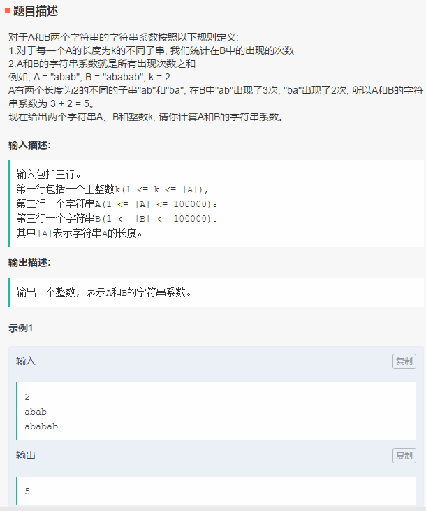
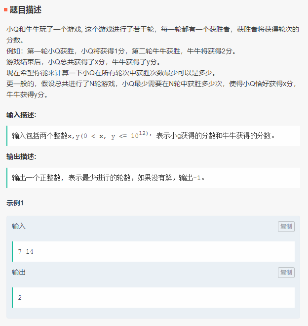
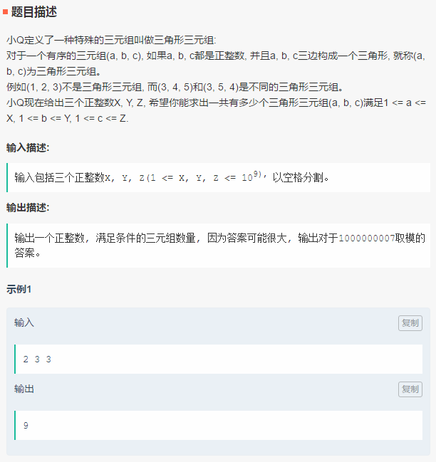

笔试-腾讯-180916
===
- 不定项 25，编程 3


Index
---
<!-- TOC -->

- [字符串系数](#字符串系数)
- [小Q与牛牛的游戏](#小q与牛牛的游戏)
- [三元组](#三元组)

<!-- /TOC -->


## 字符串系数

<div align="center"></div>


**暴力 KMP**（70%）
```python
def get_nxt(T):
    n = len(T)
    nxt = [0] * n
    max_len = 0

    for i in range(1, n):
        while max_len > 0 and T[max_len] != T[i]:
            max_len = nxt[max_len - 1]
        if T[i] == T[max_len]:
            max_len += 1
        nxt[i] = max_len

    return nxt


def kmp(S, T):
    pos = []
    nxt = get_nxt(T)

    cnt = 0
    for i in range(len(S)):
        while cnt > 0 and T[cnt] != S[i]:
            cnt = nxt[cnt - 1]

        if T[cnt] == S[i]:
            cnt += 1
        if cnt == len(T):
            pos.append(i - len(T) + 1)
            cnt = nxt[cnt - 1]
    return pos


k = int(input())
A = input()
B = input()

res = dict()
for i in range(len(A) - k + 1):
    p = A[i: i + k]
    # print(p)
    if p not in res:
        res[p] = len(kmp(B, p))

print(sum(res.values()))
```

**暴力-使用C++库函数**（AC）
> [腾讯-计算机视觉笔试题 ac](https://www.nowcoder.com/discuss/110869)_笔经面经_牛客网 
```C++
size_t str_count(const string& S, const string& T) {

    size_t cnt = 0;
    for (size_t i = 0; (i = S.find(T, i)) != string::npos; i++, cnt++);

    return cnt;
}

int main() {
    int k = 2;
    //cin >> k;
    string A{"abab"};
    //cin >> A;
    string B{"ababab"};
    //cin >> B;

    vector<string> tmp;
    for (int i = 0; i < A.length() - k + 1; i++)
        tmp.push_back(A.substr(i, k));

    cout << tmp.size() << endl;
    unique(tmp.begin(), tmp.end());  // 去重，这里直接使用 set 应该也可以

    size_t ans = 0;
    for (auto T : tmp) {
        ans += str_count(A, T);
    }

    cout << ans << endl;

    //system("PAUSE");
    return 0;
}
```

## 小Q与牛牛的游戏

<div align="center"></div>

**Python**（AC）
```python
def solve(x, y):
    """"""
    ts = int(((x + y) * 2) ** 0.5)

    if (ts * (ts + 1)) != (x + y) * 2:
        return -1

    cnt = 0
    if x < ts:
        return 1

    while x > 0:
        x -= ts
        ts -= 1
        cnt += 1

    return cnt


x, y = list(map(int, input().split()))

print(solve(x, y))
```


## 三元组

<div align="center"></div>

**Python**（50%）
```python
def solve(x, y, z):
    """"""
    cnt = 0
    for i in range(1, x + 1):
        for j in range(1, y + 1):
            m_min = abs(i - j) + 1
            m_max = min(i+j-1, z)
            cnt = (cnt + m_max - m_min + 1) % 1000000007

    return cnt


x, y, z = sorted(list(map(int, input().split())))

print(solve(x, y, z))
```

**C++**（60%）
```C++
int solve(int x, int y, int z)
{
    int cnt = 0;

    for (int i = 1; i <= x; ++i) {
        for (int j = 1; j <= y; ++j) {
            int m_min = abs(i - j) + 1;
            int m_max = min(i + j - 1, z);
            cnt = (cnt + m_max - m_min + 1) % 1000000007;
        }
    }
    return cnt;
}

int main()
{
    vector<int> xyz;
    int times = 3;
    while (times--) {
        int num;
        cin >> num;
        xyz.push_back(num);
    }
    sort(xyz.begin(), xyz.end());
    int x = xyz[0];
    int y = xyz[1];
    int z = xyz[2];
    cout << solve(x, y, z) << endl;
    return 0;
}
```