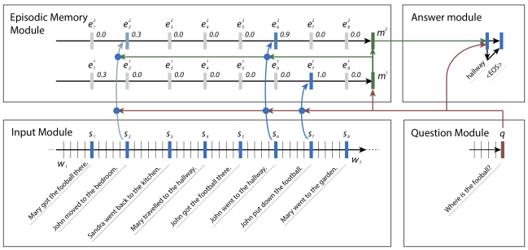

论文摘要-问答
===

Index
---
<!-- TOC -->

- [[2016-ICML].Dynamic Memory Networks](#2016-icmldynamic-memory-networks)

<!-- /TOC -->

## [2016-ICML].Dynamic Memory Networks
> Ask Me Anything: Dynamic Memory Networks for Natural Language Processing

- 本文将**动态记忆网络**（Dynamic Memory Networks, DMN）引入 QA 问题。
- DMN 主要分为四个模块：问题模块、输入模块、情景记忆模块、回答模块
  

  - 