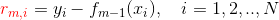

备忘-Markdown小技巧
===

Index
---
<!-- TOC -->

- [自动更新目录](#自动更新目录)
- [图片居中](#图片居中)
- [隐藏代码块](#隐藏代码块)

<!-- /TOC -->

## 自动更新目录
- VSCode 插件 [`Markdown TOC`](https://marketplace.visualstudio.com/items?itemName=AlanWalk.markdown-toc)

## 图片居中
- 不带链接
```
<div align="center"></div>
```
- 带链接
```
<div align="center"><a href=""></a></div>
```

## 隐藏代码块
```
<details><summary><b>示例：动态序列（点击展开）</b></summary> 

// 代码块，注意上下都要保留空行

</details>
```