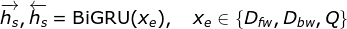

NLP-完形填空评测
===

Index
---
<!-- TOC -->

- [任务描述](#任务描述)
  - [数据格式](#数据格式)
  - [评价指标](#评价指标)
- [思路](#思路)
- [模型](#模型)
  - [Encoder](#encoder)
  - [Decoder + Attention](#decoder--attention)
- [模型细节](#模型细节)
  - [词向量是怎么做的？](#词向量是怎么做的)
  - [怎么处理未登录词？](#怎么处理未登录词)
  - [为什么使用双向 RNN 而不是单向？](#为什么使用双向-rnn-而不是单向)
  - [为什么使用 GRU 而不是 LSTM？](#为什么使用-gru-而不是-lstm)
    - [LSTM 和 GRU 的参数数量是多少？怎么算？](#lstm-和-gru-的参数数量是多少怎么算)
  - [从双向 RNN 得到的两个方向的向量是怎么处理的](#从双向-rnn-得到的两个方向的向量是怎么处理的)
  - [如果让你现在做这个项目，你会怎么改进？](#如果让你现在做这个项目你会怎么改进)
- [Reference](#reference)

<!-- /TOC -->

## 任务描述
- 以**单个词**为答案的填空类问题；**答案会在上下文中出现**。

### 数据格式
- 数据格式是一个**三元组** `(D, Q, A)` 分别表示：Document, Query, Answer
  ```
  D 篇章：由若干个连续的句子组成的一个文本段落，但文中缺少某一个词，标记为 XXXXX
  Q 问题：缺少的词 XXXXX 所在的句子
  A 答案：缺少的词 XXXXX
  ```
  - 所有答案均为**名词**，且在文中出现至少两次
  - 一篇相同的文档可能会被用于多个查询

- **示例**
  ```
  1 ||| 人民网 1月 1日 讯 据 《 纽约 时报 》 报道 ， 美国 华尔街 股市 在 2013年 的 最后 一 天 继续 上涨 ， 和 全球 股市 一样 ， 都 以 最高 纪录 或 接近 最高 纪录 结束 本年 的 交易 。
  2 ||| 《 纽约 时报 》 报道 说 ， 标普 500 指数 今年 上升 29.6% ， 为 1997年 以来 的 最 大 涨幅 ；
  3 ||| 道琼斯 工业 平均 指数 上升 26.5% ， 为 1996年 以来 的 最 大 涨幅 ；
  4 ||| 纳斯达克 上涨 38.3% 。
  5 ||| 就 12月 31日 来说 ， 由于 就业 前景 看好 和 经济 增长 明年 可能 加速 ， 消费者 信心 上升 。
  6 ||| 工商 协进会 报告 ， 12月 消费者 信心 上升 到 78.1 ， 明显 高于 11月 的 72 。
  7 ||| 另 据 《 华尔街 日报 》 报道 ， 2013年 是 1995年 以来 美国 股市 表现 最 好 的 一 年 。
  8 ||| 这 一 年 里 ， 投资 美国 股市 的 明智 做法 是 追 着 “ 傻钱 ” 跑 。
  9 ||| 所谓 的 “ 傻钱 ” XXXXX ， 其实 就 是 买 入 并 持有 美国 股票 这样 的 普通 组合 。
  10 ||| 这个 策略 要 比 对冲 基金 和 其它 专业 投资者 使用 的 更为 复杂 的 投资 方法 效果 好 得 多 。
  11 ||| 所谓 的 “ 傻钱 ” XXXXX ， 其实 就 是 买 入 并 持有 美国 股票 这样 的 普通 组合 。 ||| 策略
  ```
  - 其中最后一句为查询，最后用 `|||` 分隔的即为答案

- 具体数据包括两个领域：“**新闻**”和“**童话**”，其中“新闻”数据来源于人民日报语料

- **数据下载**
  - 新闻数据：ymcui/[Chinese-RC-Dataset](https://github.com/ymcui/Chinese-RC-Dataset)
  - 童话数据：ymcui/[cmrc2017](https://github.com/ymcui/cmrc2017)
  > 注意两份数据的格式略有不同，但都是按 `(D, Q, A)` 的要求构建的

### 评价指标
- **答案准确率**，即只存在“对”或“错”

## 思路
- 参考**语言模型**：利用前 n 个词预测下一个词；这里可以将所有上下文作为“前 n 个词”；也可以分别将 **XXXXX** 的前文和后文分别作为“前 n 个词”，各自编码后在合并为全局特征；
- 但是本问题的关注点与语言模型不同，语言模型需要从全部词表中预测下一个词，因此语言模型需要**来自大量语料的先验知识**降低预测下一个词的**困惑度**；
- 而这里因为答案就在上下文中，预测范围被大大缩小，因此模型更注重的是材料中每个词与问题的匹配度。这个问题可以交给 **Attention** 来解决。
- 具体模型可以采用 `seq2seq` 框架，这里相当于 `seq2word`
- 为了更好的捕捉**上下文**/**全局**信息，使用**双向 GRU**来对材料和问题编码。
  - [为什么使用双向 RNN 而不是单向？](#为什么使用双向-rnn-而不是单向)
  - [为什么使用 GRU 而不是 LSTM？](#为什么使用-gru-而不是-lstm)

## 模型

### Encoder
- 对文档`D`和查询`Q`使用相同的方式进行编码
  <div align="center"><a href="http://www.codecogs.com/eqnedit.php?latex=\fn_jvn&space;\overrightarrow{h_s},\overleftarrow{h_s}&=\mathrm{BiGRU}(x_e),\quad&space;x_e\in\{D,Q\}"></a></div>

  > [如果让你现在做这个项目，你会怎么改进？（改进一）](#如果让你现在做这个项目你会怎么改进)

- 然后对两个方向的特征做拼接得到**全局特征**
  <div align="center"><a href="http://www.codecogs.com/eqnedit.php?latex=\fn_jvn&space;h_s=[\overrightarrow{h_s};\overleftarrow{h_s}]"></a></div>

- 伪代码
  ```Python
  (h_d_fw, h_d_bw), _ = bi_gru(x_d)         # [?, N, d], [?, N, d]
  h_d = concat([h_d_fw, h_d_bw], axis=-1)   # [?, N, 2d]

  (h_q_fw, h_q_bw), _ = bi_gru(x_q)         # [?, M, d], [?, M, d]
  h_q = concat([h_q_fw, h_q_bw], axis=-1)   # [?, M, 2d]
  ```
- 如果数据规模比较大，可以多堆叠几层 **BiGRU**；但如果数据量不够的话，层数多了效果也不会增加，反而会使模型难以收敛。

### Decoder + Attention
- ~~Attention 部分模仿了机器翻译中的做法，这里把文档`D`作为源语言，查询`Q`作为目标语言；~~
- 首先计算文档特征矩阵`D`与查询特征矩阵`Q`的**相似度矩阵**，这里直接使用这两者的点积作为相似度矩阵
  > [如果让你现在做这个项目，你会怎么改进？（改进二）](#如果让你现在做这个项目你会怎么改进)
- 然后对相似度矩阵做 **`merge`**（混合/压缩/合并），得到文档`D`中每个词的 Attention，这里可选三种压缩方法：`avg/sum/max`
  > [如果让你现在做这个项目，你会怎么改进？（改进三）](#如果让你现在做这个项目你会怎么改进)
- 最后对 Attention 做一次 **`softmax`**，就能得到文档中每个词作为答案的概率分布了
- **注意**：因为文档中的每个词出现的次数可能不止一次，所以还需要随相同的词做**概率合并**
- **伪代码**
  ```Python
  # Input
  D = [?, N, d]
  Q = [?, M, d]

  # Similarity matrix
  S = mulmat(D, Q^T)  # [?, N, M]

  # Attention Merge
  # 使用启发式的方法决定全局的 Attention
  A = reduce_avg/sum/max(S, axis=-1)  # [?, N, 1]
  A = squeeze(A)  # [?, N]
  
  # Output
  o = softmax(A)  # [?, N]

  ans = prob_merge(x, o)  # x: [?, N]

  def prob_merge(x, o, top_k=1):
      ret = dict()
      for index, prob in zip(x, o):
          if index in ret:
              ret[index] += prob
          else:
              ret[index] = prob
      
      # ans: [(index, prob), ...]
      ans = sorted(ret.items(), key=lambda x: x[1], reverse=True)
      return ans[:top_k]
  ```

**模型示意图**
<div align="center"></div>

> [1607.02250] [CAS Reader](https://arxiv.org/abs/1607.02250)

## 模型细节

### 词向量是怎么做的？
- 因为是领域相关的任务，所以不适合直接使用在公共语料上预训练的词向量，特别是童话材料；
- 处理新闻数据时，没有使用预训练的词向量；因为训练集的规模足够（2G），所以词嵌入矩阵也作为参数加入训练。
- 处理童话数据时，为了提升在童话数据上的效果，利用爬虫爬取了额外的童话材料，用于预训练词向量作为模型的输入

### 怎么处理未登录词？
- 所有未登录词映射到一个特殊的符号 `UNK`（`index=0`），并开放训练

### 为什么使用双向 RNN 而不是单向？
- 阅读理解任务通常需要同时利用来自**上下文**的信息，
- 单向 LSTM 仅仅可以捕捉来自历史的信息，即上文；
- 双向 LSTM 除了可以保存历史的上下文信息，还可以捕获**未来**的上下文信息。
- 因此在这个问题上使用双向 LSTM 更合适。

### 为什么使用 GRU 而不是 LSTM？
- 首先，GRU 和 LSTM 在很多任务上是差不多的
- GRU 的参数比 LSTM 少（少一个门），因此 GRU 也**更容易收敛**，**速度也更快**
- 因此当数据集比较小时，GRU 的效果会更好（参数少）

#### LSTM 和 GRU 的参数数量是多少？怎么算？
- 基础 RNN
  ```
  (n_features + n_units + 1) * n_units
  ```
- LSTM
  ```
  (n_features + n_units + 1) * (n_units * 4)
  ```
- GRU
  ```
  (n_features + n_units + 1) * (n_units * 3)
  ```
  > 其中 `+1` 表示偏置的数量

- GRU 比 LSTM 少一个门，所以 GRU 的参数比 LSTM 少 1/4

### 从双向 RNN 得到的两个方向的向量是怎么处理的
- **拼接**
  <div align="center"><a href="http://www.codecogs.com/eqnedit.php?latex=\fn_jvn&space;h_s=[\overrightarrow{h_s};\overleftarrow{h_s}]"></a></div>

### 如果让你现在做这个项目，你会怎么改进？

**改进一**
- Encoder 部分：之前是直接对整个材料编码，不区分与答案的上下文关系；现在可以尝试对上文和下文分别进行编码；但**共享参数**
  <div align="center"><a href="http://www.codecogs.com/eqnedit.php?latex=\fn_jvn&space;\overrightarrow{h_s},\overleftarrow{h_s}&=\mathrm{BiGRU}(x_e),\quad&space;x_e\in\{D_{fw},D_{bw},Q\}"></a></div>

- 然后对两个方向的特征拼接后（最后一维），再对时间步拼接（最后第二维），保持维度一致
- **伪代码**
  ```Python
  # 上文： x_d_fw  [?, N1, d]
  
  (h_d_fw_fw, h_d_fw_bw), _ = bi_gru(x_d_fw)        # [?, N1, d], [?, N1, d]
  h_d_fw = concat([h_d_fw_fw, h_d_fw_bw], axis=-1)  # [?, N1, 2d]

  # 下文： x_d_bw  [?, N2, d]
  (h_d_bw_fw, h_d_bw_bw), _ = bi_gru(x_d_bw)        # [?, N2, d], [?, N2, d]
  h_d_bw = concat([h_d_bw_fw, h_d_bw_bw], axis=-1)  # [?, N2, 2d]

  # 时间步的拼接： N1 + N2 = N
  h_d = concat([h_d_fw, h_d_bw], axis=1)            # [?, N, 2d]

  (h_q_fw, h_q_bw), _ = bi_gru(x_q)                 # [?, M, d], [?, M, d]
  h_q = concat([h_q_fw, h_q_bw], axis=-1)           # [?, M, 2d]
  ```
  
  > 为什么共享参数？——人在做完形填空时，也不会把从上下文获得的信息分别存储在“左脑”和“右脑”，而是由整个大脑共享这份信息。
  >> [开学啦！咱们来做完形填空～（讯飞杯）](https://kexue.fm/archives/4564) - 科学空间|Scientific Spaces 

**改进二**
- Attention 部分：之前的做法是直接使用 cosine 相似度，没有额外的参数；可以考虑加入一个**调解矩阵** W
  > 为什么？——加入的**调解矩阵**（mediating matrix）为两个矩阵提供了更复杂的**交互**（interaction）
  >> Luong et al., 2015 & CS224n-L10
- **伪代码**
  ```Python
  # Input
  D = [?, N, d]
  Q = [?, M, d]

  # Similarity matrix
  W = get_w([d, d])  # [d, d]
  S = mulmat(mulmat(D, W), Q^T)  # [?, N, M]

  # 接下来的做法与之前一致
  ```

**改进三**
- Attention 部分：之前使用了**启发式**（`avg/sum/max`）的方法来决定最终的 Attention；
更好的方法是让它自动决定每一列 Attention 的重要性。
- 具体来说，之前的方法只使用了从 Document 到 Query 的 Attention，即 Query 中的每个词在 Document 中的重要性分布；这里加入从 Query 到 Document 的 Attention，然后用它来决定最终的 Attention。
- **伪代码**
  ```Python
  # Input
  D = [?, N, d]
  Q = [?, M, d]

  # Similarity matrix
  S = mulmat(D, Q^T)  # [?, N, M]

  # Attention over Attention
  A_d2q = softmax(S, axis=-2)  # [?, N, M]
  A_q2d = reduce_avg(softmax(S, axis=-1), axis=-2)  # [?, 1, M]
  A = mulmat(A_d2q, A_q2d^T)  # [?, N, 1]
  A = squeeze(A)  # [?, N]

  # Output
  o = softmax(A)  # [?, N]

  ans = prob_merge(x, o)  # x: [?, N]

  def prob_merge(x, o, top_k=1):
      ret = dict()
      for index, prob in zip(x, o):
          if index in ret:
              ret[index] += prob
          else:
              ret[index] = prob
      
      # ans: [(index, prob), ...]
      ans = sorted(ret.items(), key=lambda x: x[1], reverse=True)
      return ans[:top_k]
  ```

**模型示意图**
<div align="center"></div>

> [1607.04423] [AoA Reader](https://arxiv.org/abs/1607.04423) 

## Reference
- [1607.02250] [Consensus Attention-based Neural Networks for Chinese Reading Comprehension](https://arxiv.org/abs/1607.02250)
- [1607.04423] [Attention-over-Attention Neural Networks for Reading Comprehension](https://arxiv.org/abs/1607.04423) 