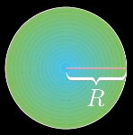
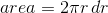
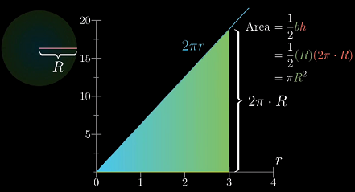
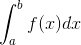
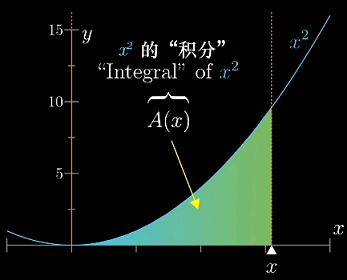
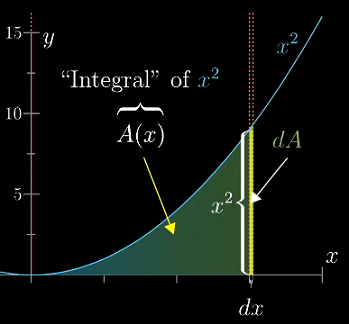
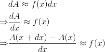

**说明**
---
该文档为“[3Blue1Brown - 微积分的本质系列视频](https://www.bilibili.com/video/av24325548)”的整理，用于快速回忆微积分的一些基本概念

**目录**
---
<!-- TOC -->

- [1. 微积分引言](#1-微积分引言)
    - [1.1. 推导**圆**的面积 - 积分的直观理解](#11-推导圆的面积---积分的直观理解)
    - [1.2. 积分与导数](#12-积分与导数)
- [2. 导数的意义](#2-导数的意义)
    - [2.1. 导数的悖论——“瞬时变化率”引起的歧义](#21-导数的悖论瞬时变化率引起的歧义)

<!-- /TOC -->

# 1. 微积分引言

**微积分回忆**
- 求导公式
- 乘积法则
- 链式法则
- 隐函数求导
- 积分、微分的互逆关系
- 泰勒级数
- ...

**微积分的三个中心思想：**
1. 积分
1. 微分
1. 积分与微分的互逆

## 1.1. 推导**圆**的面积 - 积分的直观理解

圆的面积公式：

**如何从积分的角度推导出圆的面积公式？**

不同的划分方法会带来不同的积分公式，下面考虑将圆划分为大量的同心圆环，这种方法保留了圆的对称性。

考虑其中一个环的面积，可以将其看做一个“类矩形”

虽然这不是标准的矩形，但只要`dr`越小，它就越接近。它的面积可表示为：

于是，圆的面积可以看作是这一系列矩形面积的叠加。

这部分面积的求和可以等价于求“**函数`y = 2πr`图像在区间`[0, R]`下的面积**”。

这个推导的过程其实可以看作是对函数`y = 2πr`在`[0, R]`下的积分。

## 1.2. 积分与导数

直观来说，对函数`f(x)`在`[a, b]`上**积分**就是求函数`f(x)`在区间`[a,b]`下的图像与坐标轴包围的面积。记作：

dx)
> 这实际上是**定积分**的概念，此外还有不定积分。

如果是其他图像，比如抛物线，该怎么求这部分的面积呢？

能不能找到一个函数 `A(x)` 表示 `0` 到 `x` 之间函数图像下的面积？——这个函数 `A(x)` 就是该函数的**积分**（函数）。
> 这里强调 `0` 到 `x` 之间，是为了使问题具有实际意义

以抛物线 `f(x)=x^2` 为例。类似的，我们可以将这块区域划分成一系列细长的矩形。

将 `x` 增加 `dx`，增加的面积可以看做是一个长`f(x)`、宽`dx`的矩形，只要`dx`越小，这条窄带就越接近矩形。

把这部分面积记作 `dA`，表示面积的微小变化（difference in Area）

通过这个矩形，可以得到 `A`、`f(x)` 与 `dx` 之间的关系：

dx&space;\\&space;\Rightarrow&space;&&space;\frac{dA}{dx}\approx&space;f(x)&space;\\&space;\Rightarrow&space;&&space;\frac{A(x&plus;dx)-A(x)}{dx}&space;\approx&space;f(x)&space;\end{aligned}}})

这里引出了微积分中另一个重要的概念——**导数**。`dA/dx` 就是 "A 的导数"
> 更严格的说法是："A 的导数"是“当 `dx → 0` 时，`dA/dx` 所趋向的值”。
>
> 一般不会刻意区分**导数**和**导数函数**的区别，都统称为**导数**，具体含义视语境而定；同样，积分也是如此。

导数是解决积分问题的关键——积分需要还原出某个导数原本的函数——如果你能熟练的计算导数，那么你也能解决这个问题。

积分与导数之间的这种互相转化的关系，也就是“某个图像下方面积函数的导数能够还原出定义这个图像的函数”，就叫做**微积分基本定理**。该定理表明，“在某种意义上”，两者互为逆运算。

# 2. 导数的意义

## 2.1. 导数的悖论——“瞬时变化率”引起的歧义

