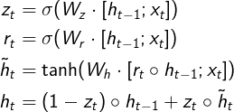

DL-专题-RNN
===

Index
---
<!-- TOC -->

- [RNN 的计算图（RNN 几种不同的设计模式） TODO](#rnn-的计算图rnn-几种不同的设计模式-todo)
- [RNN 的反向传播（BPTT）](#rnn-的反向传播bptt)
- [RNN 相关问题](#rnn-相关问题)
  - [RNN 相比前馈网络/CNN 有什么特点？](#rnn-相比前馈网络cnn-有什么特点)
  - [RNN 为什么会出现梯度消失或梯度爆炸？](#rnn-为什么会出现梯度消失或梯度爆炸)
    - [梯度爆炸的解决方法](#梯度爆炸的解决方法)
    - [梯度消失的解决方法（针对 RNN）](#梯度消失的解决方法针对-rnn)
  - [RNN 中能否使用 `ReLU` 作为激活函数？](#rnn-中能否使用-relu-作为激活函数)
    - [如果使用 `ReLU` 作为 RNN 的激活函数，应该注意什么？](#如果使用-relu-作为-rnn-的激活函数应该注意什么)
- [LSTM 相关问题](#lstm-相关问题)
  - [LSTM 的内部结构](#lstm-的内部结构)
    - [完整的 LSTM 前向传播公式](#完整的-lstm-前向传播公式)
  - [LSTM 是如何实现长短期记忆的？（遗忘门和输入门的作用）](#lstm-是如何实现长短期记忆的遗忘门和输入门的作用)
  - [LSTM 里各部分使用了不同的激活函数，为什么？](#lstm-里各部分使用了不同的激活函数为什么)
    - [可以使用其他激活函数吗？](#可以使用其他激活函数吗)
  - [GRU 与 LSTM 的关系](#gru-与-lstm-的关系)
    - [完整的 GRU 前向传播公式](#完整的-gru-前向传播公式)

<!-- /TOC -->

## RNN 的计算图（RNN 几种不同的设计模式） TODO

## RNN 的反向传播（BPTT）
TODO

## RNN 相关问题

### RNN 相比前馈网络/CNN 有什么特点？

- **前馈网络/CNN 处理序列数据时存在的问题：**
  - 一般的**前馈网络**，通常接受一个**定长**向量作为输入，然后输出一个定长的表示；
  - **CNN** 在处理**变长序列**时，通过**滑动窗口+池化**的方式将输入转化为一个**定长的向量表示**，这样做可以捕捉到序列中的一些**局部特征**，但是很难学习到序列间的**长距离依赖**。
  
- **RNN 处理时序数据时的优势：**
  - RNN 很适合处理序列数据，特别是带有**时序关系**的序列，比如文本数据；
  - RNN 把**每一个时间步**中的信息编码到**状态变量**中，使网络具有一定的记忆能力，从而更好的理解序列信息。
  - 由于 RNN 具有对序列中时序信息的刻画能力，因此在处理序列数据时往往能得到更准确的结果。

- **展开后的 RNN**（**无输出**）
  

  - 一个长度为 `T` 的 RNN 展开后，可以看做是一个 **T 层的前馈网络**；同时每一层都可以有**新的输入**
  - 通过对当前输入 `x_t` 和上一层的隐状态 `h_{t-1}` 进行编码，**第 `t` 层的隐状态** `h_t` 记录了序列中前 `t` 个输入的信息。
    > 普通的前馈网络就像火车的**一节车厢**，只有一个入口，一个出口；而 RNN 相当于**一列火车**，有多节车厢接收**当前时间步**的输入信息并输出**编码后的状态信息**（包括**当前的状态和之前的所有状态**）。
  - **最后一层隐状态 `x_T`** 编码了整个序列的信息，因此可以看作**整个序列的压缩表示**。
  - 常见的文本分类任务中，将 `h_T` 通过一个 Softmax 层，即可获得作为每个类别的概率：

    

    其中 
      - `U` 为输入层到隐藏层的权重矩阵
      - `W` 为隐藏层从上一时刻到下一时刻的状态转移权重矩阵
      - `f` 为隐藏层激活函数，通常可选 `tanh` 或 `ReLU`；
      - `g` 为输出层激活函数，可以采用 `Softmax`、`Sigmoid` 或线性函数（回归任务）
      - 通常 `h_{-1}` 初始化为 0 向量。

### RNN 为什么会出现梯度消失或梯度爆炸？
- 最大步长为 `T` 的 RNN 展开后相当于一个 T 层的前馈网络

#### 梯度爆炸的解决方法
- 梯度截断

#### 梯度消失的解决方法（针对 RNN）
- 残差结构
- 门控机制（LSTM、GRU）

### RNN 中能否使用 `ReLU` 作为激活函数？
> [RNN中为什么要采用tanh而不是ReLu作为激活函数？](https://www.zhihu.com/question/61265076) - 知乎
- 答案是肯定的。但是会存在一些问题。
  > 其实 ReLU 最早就是为了解决 RNN 中的**梯度消失**问题而设计的。
- 使用 ReLU 主要是为了解决**反向传播**时的**梯度消失**问题；
- 但是在 RNN 中使用 ReLU，反而可能在**前向传播**就时出现类似“梯度消失/爆炸”的**数值溢出问题**。
- **推导说明**：
  - RNN 的前向传播过程
    

  
  - 展开前一层
    

  - 假设使用 `ReLU` 并始终处于**激活状态**（`a_{t-1} > 0`），则 `f(x) = x`，即
    

    
  - 按照以上的步骤继续展开，最终结果中将包含 `t` 个 `W` 连乘，如果 `W` 不是单位矩阵，最终结果将趋于 `0` 或无穷。

  > 为什么普通的前馈网络或 CNN 中不会出现这中现象？
  >> 因为他们每一层的 `W` 不同，且在初始化时是独立同分布的，因此可以在一定程度相互抵消。即使多层之后一般也不会出现数值问题。

- 此外，**使用 `ReLU` 也不能完全避免 RNN 中的梯度消失/爆炸问题**，问题依然在于存在 `t` 个 `W` 的连乘项。
  - RNN 的梯度计算公式
    
<a href="http://www.codecogs.com/eqnedit.php?latex=\fn_jvn&space;\large&space;\begin{aligned}&space;\frac{\partial&space;a^{(t)}}{\partial&space;a^{(t-1)}}&=\frac{\partial&space;a^{(t)}}{\partial&space;h^{(t-1)}}\cdot\frac{\partial&space;h^{(t-1)}}{\partial&space;a^{(t-1)}}\\&=W\cdot&space;\mathrm{diag}[f'(a^{(t-1)})]\\&space;&=W\cdot&space;\begin{pmatrix}&space;f'(a_1^{(t-1)})&space;&\cdots&space;&0&space;\\&space;\vdots&space;&&space;\ddots&space;&\vdots&space;\\&space;0&space;&\cdots&space;&f'(a_n^{(t-1)})&space;\end{pmatrix}\\&space;\end{aligned}"></a>

    > 上标 `(t)` 表示时间步，下标 `n` 表示隐藏层的单元数（维度）
    
  - 注意**最后一步**，假设所有神经元都处于**激活状态**，当 `ReLU` 作为 `f` 时，有
    

    
  - 可见**只要 `W` 不是单位矩阵**，还是可能会出现梯度消失/爆炸现象。

#### 如果使用 `ReLU` 作为 RNN 的激活函数，应该注意什么？
- 综上所述，RNN 因为每一个时间步都**共享参数**的缘故，非常容易出现**数值溢出问题**
- 因此，推荐的做法是将 `W` 初始化为**单位矩阵**。
- 有实践证明，使用单位矩阵初始化 `W` 并使用 `ReLU` 作为激活函数在一些应用中，与 LSTM 有相似的结果
  > [RNN中为什么要采用tanh而不是ReLu作为激活函数？ - chaopig 的回答](https://www.zhihu.com/question/61265076/answer/260492479) - 知乎 

## LSTM 相关问题
> [Understanding LSTM Networks](http://colah.github.io/posts/2015-08-Understanding-LSTMs/) - colah's blog 

### LSTM 的内部结构

- LSTM 在传统 RNN 的基础上加入了**门控机制**来限制**信息的流动**。
- LSTM （上）与传统 RNN（下） 的内部结构对比
  

  

- 具体来说，LSTM 中加入了三个“门”：**遗忘门** `f`、**输入门** `i`、**输出门** `o`，以及一个内部记忆细胞 `C`
  - “**遗忘门 `f`**”控制前一步记忆细胞中的信息有多大程度被遗忘；
  

  - “**输入门 `i`**”控制当前计算的新状态以多大的程度更新到**记忆细胞**中；
  

  - “**记忆细胞 `C`**”间的**状态转移**由输入门和遗忘门共同决定
  

  - “**输出门 `o`**”控制当前的输出有多大程度取决于当前的记忆细胞
  

#### 完整的 LSTM 前向传播公式
  

  
  > 其中运算符 `o`（`\circ`） 表示向量中的元素**按位相乘**；有的地方也使用符号 `⊙`（`\odot`）表示

### LSTM 是如何实现长短期记忆的？（遗忘门和输入门的作用）
- LSTM 主要通过**遗忘门**和**输入门**来实现长短期记忆。
  - 如果当前时间点的状态中没有重要信息，遗忘门 `f` 中各分量的值将接近 1（`f -> 1`）；输入门 `i` 中各分量的值将接近 0（`i -> 0`）；此时过去的记忆将会被保存，从而实现**长期记忆**；
  - 如果当前时间点的状态中出现了重要信息，且之前的记忆不再重要，则 `f -> 0`，`i -> 1`；此时过去的记忆被遗忘，新的重要信息被保存，从而实现**短期记忆**；
  - 如果当前时间点的状态中出现了重要信息，但旧的记忆也很重要，则 `f -> 1`，`i -> 1`。

### LSTM 里各部分使用了不同的激活函数，为什么？

#### 可以使用其他激活函数吗？

### GRU 与 LSTM 的关系
- LSTM 中的**遗忘门**和**输入门**的功能有一定的重合；
- GRU 相比 LSTM 的**改动**：
  - GRU 把遗忘门和输入门合并为**更新门** `r`，并使用**重置门** `z` 代替输出门；
  - **合并**了记忆细胞 `C` 和隐藏状态 `h`
  

  其中
  - **更新门**用于控制前一时刻的状态信息被带入到当前状态中的程度
  - **重置门**用于控制忽略前一时刻的状态信息的程度

#### 完整的 GRU 前向传播公式
  

  
  > 遵从原文表示，没有加入偏置
