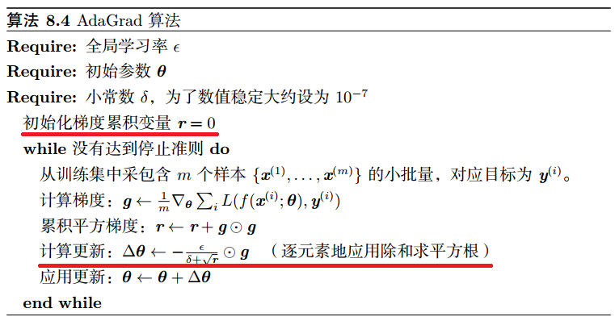
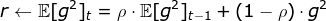
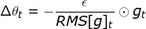
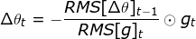
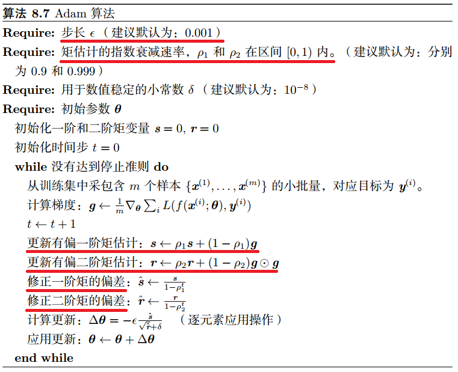

DL-专题-优化算法
===

Reference
---
- 【**必读**】[An overview of gradient descent optimization algorithms](http://ruder.io/optimizing-gradient-descent/) - Sebastian Ruder

Index
---
<!-- TOC -->

- [梯度下降法](#梯度下降法)
- [随机梯度下降](#随机梯度下降)
  - [SGD、小批量 SGD、批量梯度下降](#sgd小批量-sgd批量梯度下降)
  - [小批量 SGD 的更新过程](#小批量-sgd-的更新过程)
  - [批的大小对优化过程的影响](#批的大小对优化过程的影响)
- [带动量的 SGD 算法](#带动量的-sgd-算法)
  - [Nesterov 动量（NAG 优化算法）](#nesterov-动量nag-优化算法)
- [自适应学习率的优化方法](#自适应学习率的优化方法)
  - [AdaGrad](#adagrad)
  - [RMSProp](#rmsprop)
  - [AdaDelta](#adadelta)
  - [Adam](#adam)
- [优化方法的选择](#优化方法的选择)
  - [各优化算法的可视化](#各优化算法的可视化)
- [基于二阶梯度的优化方法 TODO](#基于二阶梯度的优化方法-todo)
  - [牛顿法](#牛顿法)
    - [为什么牛顿法比梯度下降收敛更快？](#为什么牛顿法比梯度下降收敛更快)
    - [牛顿法的优缺点](#牛顿法的优缺点)
  - [拟牛顿法 TODO](#拟牛顿法-todo)

<!-- /TOC -->

## 梯度下降法
> 数学/[梯度下降法](../数学/深度学习的核心.md#梯度下降法)
- 梯度下降法是神经网络最主要的、用于寻找**最优参数**的优化方法；
  > 所谓最优参数指的是使**目标函数/损失函数**达到最小值时的参数。
- 函数的**梯度**指出了函数**增长“最陡”的方向**，即沿着梯度的方向走，函数增长最快；
- 梯度下降法的核心想法就是沿着目标函数的**负梯度**方向，使函数值**尽可能**减小；
  > 注意：梯度表示的是各点处的函数值减小最多的方向；因此，无法保证梯度所指的方向就是函数的最小值或者真正应该前进的方向。
- 当目标函数是**凸函数**时，梯度下降的解是全局最优解；一般情况下，梯度下降无法保证全局最优；使用梯度下降时，越接近局部最小值的位置，步长越小，前进越慢。

## 随机梯度下降

### SGD、小批量 SGD、批量梯度下降
- SGD 每次从训练集中选取一个数据来更新参数
- 小批量 SGD 每次从训练集中选取一批数据来更新参数
- 批量梯度下降每次使用整个训练集更新参数，因此批量梯度下降也称**确定性**梯度算法

**随机**（stochastic）的含义：
- 每批数据都是从训练集中随机抽取的
  > stochastic 与 random 同义

### 小批量 SGD 的更新过程
1. 在训练集上抽取指定大小（batch_size）的一批数据 `{(x,y)}`
1. 【**前向传播**】将这批数据送入网络，得到这批数据的预测值 `y_pred` 
1. 计算网络在这批数据上的损失，用于衡量 `y_pred` 和 `y` 之间的距离
1. 【**反向传播**】计算损失相对于所有网络中**可训练参数**的梯度 `gradient`
1. 将参数沿着**负梯度**的方向移动，具体来说，即 `W -= lr * gradient`
   > `lr` 表示学习率 learning rate
   

### 批的大小对优化过程的影响
- **较大的批可以得到更精确的梯度估计**；但是越精确的梯度可能会带来更高的方差。
- **较小的批可能会带来一些正则化效果**；泛化误差通常在批量大小为 1 时最好；但是批较小时，也需要较小的学习率来保持稳定性；这意为这更长的训练时间。
- 批太小时，将无法充分利用**多核架构**；
  > **绝对最小批**：当批的数量小于该值时，批量处理不会减少计算时间
- 如果批量数据中的所有样本可以并行地处理，那么内存消耗和批的大小成正比
  > 对于很多硬件设施，这是批量大小的限制因素
- 使用 GPU 时，通常使用 2 的幂数作为批量大小可以获得更少的运行时间。通常 取值范围为 `32 ~ 256`，`16` 有时在尝试大模型时使用

## 带动量的 SGD 算法
> 《深度学习》 8.3.2 动量
- 引入**动量**的目的是为了**加速** SGD 的学习过程——特别是针对高曲率、小但一致的梯度，或是
带噪声的梯度
  

  - （左）SGD；（右）带动量的 SGD
  - 红线表示梯度下降的路径。这个非常细长的二次函数类似一个长峡谷。动量方法正确地纵向穿过峡谷，而普通的梯度方法则会浪费时间在峡谷的窄轴上来回移动。
  - 可以看到开始曲率不大时，加入动量改进并不明显；但是在后半段曲率变高时，加入动量明显减少了迭代次数
  - 动量方法以一种廉价的方式，在一定程度上模拟了牛顿法
  - 关于动量的物理学解释，请参考原书

- **带动量的 SGD 算法描述**
  

  - 从形式上看， 动量算法引入了变量 `v` 充当速度角色，以及相相关的超参数 `α`
  - 之前，每次更新的步长只是梯度乘以学习率；现在，步长还取决于**梯度序列**的大小和排列；当许多连续的梯度指向**相同的方向**时，步长会被不断增大；
  - 如果动量算法总是观测到梯度 `g`，那么它会在 `−g` 方向上不断加速，直到达到最终速度。
  - 具体来说，加入动量后的步长为
    

  
  - 也就是说，`α = 0.9` 对应着**最大** `10` 倍于 SGD 的步长
  - 在实践中， `α` 的一般取 `0.5, 0.9, 0.99`。和学习率一样，`α` 也可以使用某种策略在训练时进行自适应调整；一般初始值是一个较小的值，随后会慢慢变大。
    > [自适应学习率的优化方法](#自适应学习率的优化方法)

### Nesterov 动量（NAG 优化算法）
- 改进的动量算法，一般把使用 Nesterov 动量的优化算法称为 NAG (Nesterov accelerated gradient)
- 简单来说，**NAG 把梯度计算在施加当前速度之后。**
- 因此，Nesterov 动量可以解释为往标准动量方法中添加了一个**修正因子**。
  

## 自适应学习率的优化方法
> 《深度学习》 8.5 自适应学习率算法

### AdaGrad
> [Duchi et al., 2011](http://jmlr.org/papers/v12/duchi11a.html)
- 该算法的思想是独立地适应模型的每个参数：具有较大偏导的参数相应有一个较大的学习率，而具有小偏导的参数则对应一个较小的学习率
- 具体来说，每个参数的学习率会缩放各参数反比于其**历史梯度平方值总和的平方根**
- **AdaGrad 算法描述**
  

  - 注意：全局学习率 `ϵ` 并没有更新，而是每次应用时被缩放

**AdaGrad 存在的问题**
- 学习率是单调递减的，训练后期学习率过小会导致训练困难，甚至提前结束
- 需要设置一个全局的初始学习率

### RMSProp
> Hinton, 2012
- RMSProp 主要是为了解决 AdaGrad 方法中**学习率过度衰减**的问题—— AdaGrad 根据平方梯度的**整个历史**来收缩学习率，可能使得学习率在达到局部最小值之前就变得太小而难以继续训练；
- RMSProp 使用**指数衰减平均**（递归定义）以丢弃遥远的历史，使其能够在找到某个“盆地”结构后快速收敛；
- 此外，RMSProp 还加入了一个超参数 `ρ` 用于控制衰减速率。
- 具体来说（对比 AdaGrad 的算法描述），即修改 `r` 为
  

  记
  

  则
  

  > `δ` 为平滑项，具体为一个小常数，一般取 `1e-8`
- **RMSProp** 建议的**初始值**：全局学习率 `ϵ=1e-3`，衰减速率 `ρ=0.9`
- **RMSProp 算法描述**
  

- 带 **Nesterov 动量**的 **RMSProp**
  

- 经验上，RMSProp 已被证明是一种有效且实用的深度神经网络优化算法。
- RMSProp 依然需要设置一个全局学习率，同时又多了一个超参数（推荐了默认值）。

### AdaDelta
- AdaDelta 和 RMSProp 都是为了解决 AdaGrad 对学习率过度衰减的问题而产生的。
- AdaDelta 和 RMSProp 是独立发现的，AdaDelta 的前半部分与 RMSProp 完全一致；
- AdaDelta 进一步解决了 AdaGrad 需要设置一个全局学习率的问题
- 具体来说，即
  

  
  此时，AdaDelta 已经不需要设置全局学习率了
  > 关于 `RMS` 的定义，见 [RMSProp](#rmsprop)

### Adam
> Kingma and Ba, 2014

- Adam 在 RMSProp 方法的基础上更进一步：
  - 除了加入**历史梯度平方的指数衰减平均**（`r`）外，
  - 还保留了**历史梯度的指数衰减平均**（`s`），相当于**动量**。
  - Adam 行为就像一个带有摩擦力的小球，在误差面上倾向于平坦的极小值。
- **Adam 算法描述**
  

**偏差修正**
- 注意到，`s` 和 `r` 需要初始化为 `0`；且 `ρ1` 和 `ρ2` 推荐的初始值都很接近 `1`（`0.9` 和 `0.999`）
- 这将导致在训练初期 `s` 和 `r` 都很小（偏向于 0），从而训练缓慢。
- 因此，Adam 通过修正偏差来抵消这个倾向。

## 优化方法的选择
- 具有自适应学习率（以RMSProp 和 AdaDelta 为代表）的算法族表现不分伯仲，没有哪个算法能在所有任务上脱颖而出
- 目前，最流行并且使用很高的优化算法包括 SGD、带动量的 SGD、RMSProp、带动量的 RMSProp、AdaDelta 和 Adam。
- 具体使用哪个算法取决于使用者对算法的熟悉程度，以便调节超参数

### 各优化算法的可视化
- SGD各优化方法在损失曲面上的表现
  

- SGD各优化方法在损失曲面鞍点处上的表现
  

## 基于二阶梯度的优化方法 TODO

### 牛顿法
- 梯度下降使用的梯度信息实际上是**一阶导数**
- 牛顿法除了一阶导数外，还会使用**二阶导数**的信息
- 根据导数的定义，一阶导描述的是函数值的变化率，即**斜率**；二阶导描述的则是斜率的变化率，即曲线的弯曲程度——**曲率**
  > 数学/[泰勒级数](../数学/微积分的本质.md#泰勒级数)

**牛顿法更新过程** TODO
> 《统计学习方法》 附录 B

#### 为什么牛顿法比梯度下降收敛更快？
> [常见的几种最优化方法（梯度下降法、牛顿法、拟牛顿法、共轭梯度法等）](https://www.cnblogs.com/shixiangwan/p/7532830.html) - 蓝鲸王子 - 博客园 

**几何理解**
- 牛顿法就是用一个**二次曲面**去拟合你当前所处位置的局部曲面；而梯度下降法是用一个平面去拟合当前的局部曲面。
- 通常情况下，二次曲面的拟合会比平面更好，所以牛顿法选择的**下降路径**会更符合真实的最优下降路径。

**通俗理解**
- 比如你想找一条最短的路径走到一个盆地的最底部，
- 梯度下降法每次只从你当前所处位置选一个坡度最大的方向走一步；
- 牛顿法在选择方向时，不仅会考虑坡度是否够大，还会考虑你走了一步之后，坡度是否会变得更大。
- 所以，牛顿法比梯度下降法看得更远，能**更快**地走到最底部。

#### 牛顿法的优缺点
- **优点**
  - 收敛速度快，能用更少的迭代次数找到最优解
- **缺点**
  - 每一步都需要求解目标函数的 **Hessian 矩阵**的逆矩阵，计算复杂
    > Hessian 矩阵即由二阶偏导数构成的方阵

### 拟牛顿法 TODO
- 用其他近似方法代替求解 **Hessian 矩阵**的逆矩阵