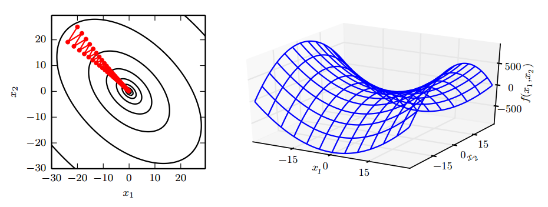
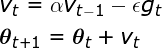
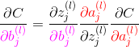
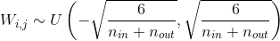

深度学习基础
===

相关专题
---
- [《深度学习》整理](./“花书”《深度学习》整理.md)
- [CNN 专题](./DL-专题-CNN.md)

Index
---
<!-- TOC -->

- [过拟合与欠拟合](#过拟合与欠拟合)
  - [降低过拟合风险的方法](#降低过拟合风险的方法)
  - [降低欠拟合风险的方法](#降低欠拟合风险的方法)
- [梯度下降](#梯度下降)
  - [随机梯度下降](#随机梯度下降)
    - [小批量随机梯度下降](#小批量随机梯度下降)
    - [小批量 SGD 的更新过程](#小批量-sgd-的更新过程)
    - [“批”的大小对优化效果的影响](#批的大小对优化效果的影响)
    - [随机梯度下降存在的问题](#随机梯度下降存在的问题)
  - [随机梯度下降的加速](#随机梯度下降的加速)
  - [动量（Momentum）方法](#动量momentum方法)
    - [带动量的 SGD](#带动量的-sgd)
    - [NAG 算法（Nesterov 动量）](#nag-算法nesterov-动量)
  - [自适应学习率的优化算法 TODO](#自适应学习率的优化算法-todo)
    - [AdaGrad](#adagrad)
    - [AdaDelta](#adadelta)
    - [RMSProp](#rmsprop)
    - [Adam](#adam)
    - [AdaMax](#adamax)
  - [梯度消失 TODO](#梯度消失-todo)
- [反向传播算法](#反向传播算法)
  - [反向传播的作用/目的/本质](#反向传播的作用目的本质)
  - [反向传播的公式推导](#反向传播的公式推导)
- [激活函数](#激活函数)
  - [激活函数的作用——为什么要使用非线性激活函数？](#激活函数的作用为什么要使用非线性激活函数)
  - [常见的激活函数](#常见的激活函数)
    - [整流线性单元 `ReLU`](#整流线性单元-relu)
      - [`ReLU` 的拓展](#relu-的拓展)
    - [`sigmoid` 与 `tanh`](#sigmoid-与-tanh)
    - [其他激活函数](#其他激活函数)
  - [`ReLU` 相比 `sigmoid` 的优势 (3)](#relu-相比-sigmoid-的优势-3)
- [正则化](#正则化)
  - [L1/L2 范数正则化](#l1l2-范数正则化)
    - [L1/L2 范数的作用、异同](#l1l2-范数的作用异同)
    - [为什么 L1 和 L2 正则化可以防止过拟合？](#为什么-l1-和-l2-正则化可以防止过拟合)
    - [为什么 L1 正则化可以产生稀疏权值，而 L2 不会？](#为什么-l1-正则化可以产生稀疏权值而-l2-不会)
  - [Dropout 与 Bagging 集成方法](#dropout-与-bagging-集成方法)
    - [Bagging 集成方法](#bagging-集成方法)
    - [Dropout 策略](#dropout-策略)
      - [Dropout 与 Bagging 的不同](#dropout-与-bagging-的不同)
- [深度学习实践](#深度学习实践)
  - [参数初始化](#参数初始化)
- [CNN 卷积神经网络](#cnn-卷积神经网络)
  - [CNN 与 LSTM 的区别](#cnn-与-lstm-的区别)

<!-- /TOC -->

# 过拟合与欠拟合
> 《深度学习》 5.2 容量、过拟合和欠拟合

- **欠拟合**指模型不能在**训练集**上获得足够低的**训练误差**；
- **过拟合**指模型的**训练误差**与**测试误差**（泛化误差）之间差距过大；
  - 反映在**评价指标**上，就是模型在训练集上表现良好，但是在测试集和新数据上表现一般（**泛化能力差**）；

## 降低过拟合风险的方法

- **数据增强**
  - 图像：平移、旋转、缩放
  - 利用**生成对抗网络**（GAN）生成新数据
  - NLP：利用机器翻译生成新数据
- **降低模型复杂度**
  - 神经网络：减少网络层、神经元个数
  - 决策树：降低树的深度、剪枝
  - ...
- **权值约束**（添加正则化项）
  - L1 正则化
  - L2 正则化
- **集成学习**
  - 神经网络：Dropout
  - 决策树：随机森林、GBDT
- **提前终止训练**

## 降低欠拟合风险的方法
- 加入新的特征
  - 交叉特征、多项式特征、...
  - 深度学习：因子分解机、Deep-Crossing、自编码器
- 增加模型复杂度
  - 线性模型：添加高次项
  - 神经网络：增加网络层数、神经元个数
- 减小正则化项的系数
  - 添加正则化项是为了限制模型的学习能力，减小正则化项的系数则可以放宽这个限制
  - 模型通常更倾向于更大的权重，更大的权重可以使模型更好的拟合数据

# 梯度下降
> 数学/深度学习的核心/[梯度下降法](../数学/深度学习的核心.md#梯度下降法)

- 梯度下降是一种**优化算法**，通过**迭代**的方式寻找模型的**最优参数**；
  - 所谓最优参数指的是使**目标函数**达到最小值时的参数；
  - 当目标函数是**凸函数**时，梯度下降的解是全局最优解；但在一般情况下，**梯度下降无法保证全局最优**。
- 微积分中使用**梯度**表示函数增长最快的方向；因此，神经网络中使用**负梯度**来指示目标函数下降最快的方向。
  - **梯度**实际上是损失函数对网络中每个参数的**偏导**所组成的向量；
  - **梯度**仅仅指示了对于每个参数各自增长最快的方向；因此，梯度无法保证**全局方向**就是函数为了达到最小值应该前进的方向。
  - **梯度**的具体计算方法即**反向传播**。
- **负梯度**中的每一项可以认为传达了**两个信息**：
  - 正负号在告诉输入向量应该调大还是调小（正调大，负调小）
  - 每一项的相对大小表明每个参数对函数值达到最值的**影响程度**；
    <div align="center"></div>

## 随机梯度下降
- 基本的梯度下降法每次使用**所有训练样本**的**平均损失**来更新参数；
  - 因此，经典的梯度下降在每次对模型参数进行更新时，需要遍历所有数据；
  - 当训练样本的数量很大时，这需要消耗相当大的计算资源，在实际应用中基本不可行。
- **随机梯度下降**（SGD）每次使用单个样本的损失来近似平均损失

### 小批量随机梯度下降
- 为了降低随机梯度的**方差**，使模型迭代更加稳定，实践中会使用**一批**随机数据的损失来近似平均损失。
  > ./机器学习基础/[偏差与方差](./ML-机器学习基础.md#偏差与方差)
- 使用批训练的另一个主要目的，是为了利用高度优化的**矩阵运算**以及**并行计算框架**。

### 小批量 SGD 的更新过程
1. 在训练集上抽取指定大小（batch_size）的一批数据 `{(x,y)}`
1. 【**前向传播**】将这批数据送入网络，得到这批数据的预测值 `y_pred` 
1. 计算网络在这批数据上的损失，用于衡量 `y_pred` 和 `y` 之间的距离
1. 【**反向传播**】计算损失相对于所有网络中**可训练参数**的梯度 `g`
1. 将参数沿着**负梯度**的方向移动，即 `W -= lr * g`
   > `lr` 表示学习率 learning rate
   <div align="center"></div>

### “批”的大小对优化效果的影响
> 《深度学习》 8.1.3 批量算法和小批量算法
- **较大的批能得到更精确的梯度估计**，但回报是小于线性的。
- **较小的批能带来更好的泛化误差**，泛化误差通常在批大小为 1 时最好。
  - 原因可能是由于小批量在学习过程中带来了**噪声**，使产生了一些正则化效果 (Wilson and Martinez, 2003)
  - 但是，因为梯度估计的高方差，小批量训练需要**较小的学习率**以保持稳定性，这意味着**更长的训练时间**。
- 当批的大小为 **2 的幂**时能充分利用矩阵运算操作，所以批的大小一般取 32、64、128、256 等。
<!-- - **内存消耗和批的大小成正比**，当批量处理中的所有样本可以并行处理时。
- 在某些硬件上使用特定大小可以减少运行时间。尤其是在使用 GPU 时，通常使用 **2 的幂数**作为批量大小可以获得更少的运行时间。一般，2 的幂数的**取值范围是 32 到 256**，16 有时在尝试大模型时使用。 -->

### 随机梯度下降存在的问题
- 随机梯度下降（SGD）放弃了**梯度的准确性**，仅采用一部分样本来估计当前的梯度；因此 SGD 对梯度的估计常常出现偏差，造成目标函数收敛不稳定，甚至不收敛的情况。
- 无论是经典的梯度下降还是随机梯度下降，都可能陷入**局部极值点**；除此之外，SGD 还可能遇到“**峡谷**”和“**鞍点**”两种情况
  - **峡谷**类似一个带有**坡度**的狭长小道，左右两侧是“**峭壁**”；在**峡谷**中，准确的梯度方向应该沿着坡的方向向下，但粗糙的梯度估计使其稍有偏离就撞向两侧的峭壁，然后在两个峭壁间来回**震荡**。
  - **鞍点**的形状类似一个马鞍，一个方向两头翘，一个方向两头垂，而**中间区域近似平地**；一旦优化的过程中不慎落入鞍点，优化很可能就会停滞下来。
  <div align="center"></div>


## 随机梯度下降的加速
- SGD 的改进遵循两个方向：**惯性保持**和**环境感知**
  > 这两个提法来自《百面机器学习》
- **惯性保持**指的是加入**动量** SGD 算法；
  > [动量（Momentum）方法](#动量momentum方法)
- **环境感知**指的是根据不同参数的一些**经验性判断**，**自适应**地确定**每个参数的学习速率**
  > [自适应学习率的优化算法](#自适应学习率的优化算法)

**训练词向量的例子**
- 不同词出现的频率是不同的，**数据的稀疏性会影响其参数的稀疏性**；
- 具体来说，**对低频词如果不加措施**，其参数的梯度在多数情况下为 0；换言之，这些参数更新的频率很低，导致难以收敛。
- 在实践中，我们希望学习**低频词**的参数时具有**较大的学习率**，而高频词其参数的更新幅度可以小一些。

## 动量（Momentum）方法

### 带动量的 SGD
- 引入**动量**（Momentum）方法一方面是为了解决“峡谷”和“鞍点”问题；一方面也可以用于SGD 加速，特别是针对**高曲率**、小幅但是方向一致的梯度。
  - 如果把原始的 SGD 想象成一个**纸团**在重力作用向下滚动，由于**质量小**受到山壁弹力的干扰大，导致来回震荡；或者在鞍点处因为**质量小**速度很快减为 0，导致无法离开这块平地。
  - **动量**方法相当于把纸团换成了**铁球**；不容易受到外力的干扰，轨迹更加稳定；同时因为在鞍点处因为**惯性**的作用，更有可能离开平地。
  - 动量方法以一种廉价的方式模拟了二阶梯度（牛顿法）
  <div align="center"></div>

- **参数更新公式**

  <div align="center"><a href="http://www.codecogs.com/eqnedit.php?latex=\fn_jvn&space;\large&space;\begin{aligned}&space;&v_t=\alpha&space;v_{t-1}-\epsilon&space;g_t\\&space;&\boldsymbol{\theta}_{t&plus;1}=\boldsymbol{\theta}_t&plus;v_t&space;\end{aligned}"></a></div>

  - 从形式上看， 动量算法引入了变量 `v` 充当速度角色，以及相相关的超参数 `α`。
  - 原始 SGD 每次更新的步长只是梯度乘以学习率；现在，步长还取决于**历史梯度序列**的大小和排列；当许多连续的梯度指向**相同的方向**时，步长会被不断增大；

- **算法描述**
  <div align="center"></div>

  - 如果动量算法总是观测到梯度 `g`，那么它会在 `−g` 方向上不断加速，直到达到**最终速度**。

    <div align="center"><a href="http://www.codecogs.com/eqnedit.php?latex=\fn_jvn&space;\large&space;v\leftarrow&space;\alpha&space;v-\epsilon&space;g\quad&space;\Rightarrow&space;\quad&space;v\leftarrow&space;\frac{-\epsilon&space;g}{1-\alpha}"></a></div>

  - 在实践中， `α` 的一般取 `0.5, 0.9, 0.99`，分别对应**最大** `2` 倍、`10` 倍、`100` 倍的步长
  - 和学习率一样，`α` 也可以使用某种策略在训练时进行**自适应调整**；一般初始值是一个较小的值，随后会慢慢变大。

### NAG 算法（Nesterov 动量）
- **NAG 把梯度计算放在对参数施加当前速度之后**。
- 这个“**提前量**”的设计让算法有了对前方环境“**预判**”的能力。Nesterov 动量可以解释为往标准动量方法中添加了一个**修正因子**。
  <div align="center"></div>

## 自适应学习率的优化算法 TODO
> 《深度学习》 8.5 自适应学习率算法

### AdaGrad

### AdaDelta

### RMSProp

### Adam

### AdaMax


## 梯度消失 TODO

# 反向传播算法

## 反向传播的作用/目的/本质
- **反向传播概述**：

  **梯度下降法**中需要利用损失函数对所有参数的梯度来寻找局部最小值点；

  而**反向传播算法**就是用于计算该梯度的具体方法，其本质是利用**链式法则**对每个参数求偏导。

## 反向传播的公式推导
> 数学/深度学习的核心/[反向传播的 4 个基本公式](../数学/深度学习的核心.md#323-反向传播的-4-个基本公式)
- 可以用 4 个公式总结反向传播的过程

  **标量形式**：

  [](http://www.codecogs.com/eqnedit.php?latex=\begin{aligned}&space;\frac{\partial&space;C}{\partial&space;{\color{Red}&space;a_j^{(L)}}}=\frac{\partial&space;C({\color{Red}&space;a_j^{(L)}},y_j)}{\partial&space;{\color{Red}&space;a_j^{(L)}}}&space;\end{aligned})

  [](http://www.codecogs.com/eqnedit.php?latex=\begin{aligned}&space;\frac{\partial&space;C}{{\color{Red}&space;\partial&space;a_j^{(l)}}}={\color{Teal}\sum_{k=0}^{n_l-1}}&space;\frac{\partial&space;z_k^{(l&plus;1)}}{{\color{Red}&space;\partial&space;a_j^{(l)}}}&space;\frac{{\color{Blue}&space;\partial&space;a_k^{(l&plus;1)}}}{\partial&space;z_k^{(l&plus;1)}}&space;\frac{\partial&space;C}{{\color{Blue}&space;\partial&space;a_k^{(l&plus;1)}}}&space;\end{aligned})

  [](http://www.codecogs.com/eqnedit.php?latex=\begin{aligned}&space;\frac{\partial&space;C}{{\color{Magenta}&space;\partial&space;w_{j,k}^{(l)}}}=\frac{\partial&space;z_j^{(l)}}{{\color{Magenta}&space;\partial&space;w_{j,k}^{(l)}}}\frac{{\color{Red}\partial&space;a_j^{(l)}}}{\partial&space;z_j^{(l)}}\frac{\partial&space;C}{{\color{Red}\partial&space;a_j^{(l)}}}&space;\end{aligned})

  [](http://www.codecogs.com/eqnedit.php?latex=\begin{aligned}&space;\frac{\partial&space;C}{{\color{Magenta}&space;\partial&space;b_{j}^{(l)}}}=\frac{\partial&space;z_j^{(l)}}{{\color{Magenta}&space;\partial&space;b_{j}^{(l)}}}\frac{{\color{Red}\partial&space;a_j^{(l)}}}{\partial&space;z_j^{(l)}}\frac{\partial&space;C}{{\color{Red}\partial&space;a_j^{(l)}}}&space;\end{aligned})
  > 上标 `(l)` 表示网络的层，`(L)` 表示输出层（最后一层）；下标 `j` 和 `k` 指示神经元的位置；`w_jk` 表示 `l` 层的第 `j` 个神经元与`(l-1)`层第 `k` 个神经元连线上的权重

- **符号说明**，其中：
  - `(w,b)` 为网络参数：权值和偏置
  - `z` 表示上一层激活值的线性组合
  - `a` 即 "activation"，表示每一层的激活值，上标`(l)`表示所在隐藏层，`(L)`表示输出层
  - `C` 表示激活函数，其参数为神经网络输出层的激活值`a^(L)`，与样本的标签`y`

    

- 以 **均方误差（MSE）** 损失函数为例，有

  [](http://www.codecogs.com/eqnedit.php?latex=\begin{aligned}&space;\frac{\partial&space;C}{\partial&space;{\color{Red}&space;a_j^{(L)}}}&=\frac{\partial&space;C({\color{Red}&space;a_j^{(L)}},y_j)}{\partial&space;{\color{Red}&space;a_j^{(L)}}}&space;\\&space;&=\frac{\partial&space;\left&space;(&space;\frac{1}{2}({\color{Red}a_j^{(L)}}-y_j)^2&space;\right&space;)&space;}{\partial&space;{\color{Red}a_j^{(L)}}}={\color{Red}a_j^{(L)}}-y&space;\end{aligned})

- Nielsen 的课程中提供了另一种更利于计算的表述，本质上是一样的。

  
  > [The four fundamental equations behind backpropagation](http://neuralnetworksanddeeplearning.com/chap2.html#the_four_fundamental_equations_behind_backpropagation)


# 激活函数

## 激活函数的作用——为什么要使用非线性激活函数？
- 使用**激活函数**的目的是为了向网络中加入**非线性因素**；

  从而加强网络的表示能力，解决**线性模型**无法解决的问题
  > [神经网络激励函数的作用是什么？有没有形象的解释？](https://www.zhihu.com/question/22334626) - 知乎 
  
**为什么加入非线性因素能够加强网络的表示能力？——神经网络的万能近似定理**
- 神经网络的万能近似定理认为主要神经网络具有至少一个非线性隐藏层，那么只要给予网络足够数量的隐藏单元，它就可以以任意的精度来近似任何**从一个有限维空间到另一个有限维空间**的函数。
- 如果不使用非线性激活函数，那么每一层输出都是上层输入的**线性组合**；

  此时无论网络有多少层，其整体也将是线性的，这会导致失去万能近似的性质
  > 《深度学习》 6.4.1 万能近似性质和深度；
- 但仅**部分层是纯线性**是可以接受的，这有助于**减少网络中的参数**。
  > 《深度学习》 6.3.3 其他隐藏单元

## 常见的激活函数
> 《深度学习》 6.3 隐藏单元
### 整流线性单元 `ReLU`
- 公式与图像

  [](http://www.codecogs.com/eqnedit.php?latex=g(z)=\max(0,z))

   
- ReLU 通常是激活函数较好的默认选择

#### `ReLU` 的拓展
- `ReLU` 及其扩展都基于以下公式：

  [](http://www.codecogs.com/eqnedit.php?latex=g(z;\alpha)&space;=\max(0,z)&plus;\alpha\min(0,z))

  当 `α=0` 时，即标准的线性整流单元
- **绝对值整流**（absolute value rectification）
    
  固定 `α = -1`，此时整流函数即**绝对值函数** `g(z)=|z|`
  
- **渗漏整流线性单元**（Leaky ReLU, Maas et al., 2013）
    
  固定 `α` 为一个小值，比如 0.01

- **参数化整流线性单元**（parametric ReLU, PReLU, He et al., 2015）

  将 `α` 作为一个可学习的参数
- **`maxout` 单元** (Goodfellow et al., 2013a)

  `maxout` 单元 进一步扩展了 `ReLU`，它是一个可学习的 `k` 段函数
  
  **Keras 简单实现**
  ```
  # input shape:  [n, input_dim]
  # output shape: [n, output_dim]
  W = init(shape=[k, input_dim, output_dim])
  b = zeros(shape=[k, output_dim])
  output = K.max(K.dot(x, W) + b, axis=1)
  ```
  > 参数数量是普通全连接层的 k 倍
  >
  > [深度学习（二十三）Maxout网络学习](https://blog.csdn.net/hjimce/article/details/50414467) - CSDN博客
### `sigmoid` 与 `tanh`
- `sigmoid(z)`，常记作 `σ(z)`:
  
  [](http://www.codecogs.com/eqnedit.php?latex=\sigma(z)=\frac{1}{1&plus;\exp(-z)})

  

- `tanh(z)` 的图像与 `sigmoid(z)` 大致相同，区别是**值域**为 `(-1, 1)`

### 其他激活函数
> 很多未发布的非线性激活函数也能表现的很好，但没有比流行的激活函数表现的更好。比如使用 `cos` 也能在 MNIST 任务上得到小于 1% 的误差。通常新的隐藏单元类型只有在被明确证明能够提供显著改进时才会被发布。

- **线性激活函数**：

  如果神经网络的每一层都由线性变换组成，那么网络作为一个整体也将是线性的，这会导致失去万能近似的性质。但是，仅**部分层是纯线性**是可以接受的，这可以帮助**减少网络中的参数**。

- **softmax**：

  softmax 单元常作为网络的输出层，它很自然地表示了具有 k 个可能值的离散型随机变量的概率分布。

- **径向基函数（radial basis function, RBF）**：

  [](http://www.codecogs.com/eqnedit.php?latex=h_i=\exp(-\frac{1}{\sigma_i^2}\left&space;\|&space;W_{:,i}-x&space;\right&space;\|^2))

  在神经网络中很少使用 RBF 作为激活函数，因为它对大部分 x 都饱和到 0，所以很难优化。

- **softplus**：

  `softplus` 是 `ReLU` 的平滑版本。

  [](http://www.codecogs.com/eqnedit.php?latex=g(z)=\zeta(z)=\log(1&plus;\exp(z)))

  

  通常不鼓励使用 softplus 函数，大家可能希望它具有优于整流线性单元的性质，但根据经验来看，它并没有。
  > (Glorot et al., 2011a) 比较了这两者，发现 ReLU 的结果更好。

- **硬双曲正切函数（hard tanh）**：

  [](http://www.codecogs.com/eqnedit.php?latex=g(a)=\max(-1,\min(1,a)))

  它的形状和 tanh 以及整流线性单元类似，但是不同于后者，它是有界的。
  
## `ReLU` 相比 `sigmoid` 的优势 (3)
1. **避免梯度消失*****
  - `sigmoid`函数在输入取绝对值非常大的正值或负值时会出现**饱和**现象——在图像上表现为变得很平，此时函数会对输入的微小变化不敏感——从而造成梯度消失；
  - `ReLU` 的导数始终是一个常数——负半区为 0，正半区为 1——所以不会发生梯度消失现象
2. **减缓过拟合****
  - `ReLU` 在负半区的输出为 0。一旦神经元的激活值进入负半区，那么该激活值就不会产生梯度/不会被训练，造成了网络的稀疏性——**稀疏激活**
  - 这有助于减少参数的相互依赖，缓解过拟合问题的发生
3. **加速计算***
  - `ReLU` 的求导不涉及浮点运算，所以速度更快

> 总结自知乎两个答案 [Ans1](https://www.zhihu.com/question/52020211/answer/152378276) & [Ans2](https://www.zhihu.com/question/29021768/answer/43488153)

**为什么 ReLU 不是全程可微/可导也能用于基于梯度的学习？**
- 虽然从数学的角度看 ReLU 在 0 点不可导，因为它的左导数和右导数不相等；
- 但是在实现时通常会返回左导数或右导数的其中一个，而不是报告一个导数不存在的错误。从而避免了这个问题


# 正则化

## L1/L2 范数正则化
> 《深度学习》 7.1.1 L2 参数正则化 & 7.1.2 - L1 参数正则化
>
> [机器学习中正则化项L1和L2的直观理解](https://blog.csdn.net/jinping_shi/article/details/52433975) - CSDN博客

### L1/L2 范数的作用、异同
**相同点**
- 限制模型的学习能力——通过限制参数的规模，使模型偏好于**权值较小**的目标函数，防止过拟合。

**不同点**
- **L1 正则化**可以产生更**稀疏**的权值矩阵，可以用于特征选择，同时一定程度上防止过拟合；**L2 正则化**主要用于防止模型过拟合
- **L1 正则化**适用于特征之间有关联的情况；**L2 正则化**适用于特征之间没有关联的情况。

### 为什么 L1 和 L2 正则化可以防止过拟合？
- L1 & L2 正则化会使模型偏好于更小的权值。
- 更小的权值意味着**更低的模型复杂度**；添加 L1 & L2 正则化相当于为模型添加了某种**先验**，限制了参数的分布，从而降低了模型的复杂度。
- 模型的复杂度降低，意味着模型对于噪声与异常点的抗干扰性的能力增强，从而提高模型的泛化能力。——直观来说，就是对训练数据的拟合刚刚好，不会过分拟合训练数据（比如异常点，噪声）——**奥卡姆剃刀原理**

### 为什么 L1 正则化可以产生稀疏权值，而 L2 不会？
- 对目标函数添加范数正则化，训练时相当于在范数的约束下求目标函数 `J` 的最小值
- 带有**L1 范数**（左）和**L2 范数**（右）约束的二维图示

  
  
  - 图中 `J` 与 `L1` 首次相交的点即是最优解。`L1` 在和每个坐标轴相交的地方都会有“**顶点**”出现，多维的情况下，这些顶点会更多；在顶点的位置就会产生稀疏的解。而 `J` 与这些“顶点”相交的机会远大于其他点，因此 `L1` 正则化会产生稀疏的解。
  - `L2` 不会产生“**顶点**”，因此 `J` 与 `L2` 相交的点具有稀疏性的概率就会变得非常小。

## Dropout 与 Bagging 集成方法
> 《深度学习》 7.12 Dropout
### Bagging 集成方法
- **集成方法**的主要想法是分别训练不同的模型，然后让所有模型**表决**最终的输出。

  集成方法奏效的原因是不同的模型**通常不会**在测试集上产生相同的误差。

  集成模型能至少与它的任一成员表现得一样好。**如果成员的误差是独立的**，集成将显著提升模型的性能。
- **Bagging** 是一种集成策略——具体来说，Bagging 涉及构造 k 个**不同的数据集**。

  每个数据集从原始数据集中**重复采样**构成，和原始数据集具有**相同数量**的样例——这意味着，每个数据集以高概率缺少一些来自原始数据集的例子，还包含若干重复的例子
  > 更具体的，如果采样所得的训练集与原始数据集大小相同，那所得数据集中大概有原始数据集 `2/3` 的实例
  
**集成方法与神经网络**：
- 神经网络能找到足够多的不同的解，意味着他们可以从模型平均中受益——即使所有模型都在同一数据集上训练。 

  神经网络中**随机初始化**的差异、**批训练数据**的随机选择、**超参数**的差异等**非确定性**实现往往足以使得集成中的不同成员具有**部分独立的误差**。

### Dropout 策略
- 简单来说，Dropout 通过**参数共享**提供了一种廉价的 Bagging 集成近似—— Dropout 策略相当于集成了包括所有从基础网络除去部分单元后形成的子网络。
- 通常，**隐藏层**的采样概率为 `0.5`，**输入**的采样概率为 `0.8`；超参数也可以采样，但其采样概率一般为 `1`
  
  

**权重比例推断规则**
- 权重比例推断规则的目的是确保在测试时一个单元的期望总输入与在训练时该单元的期望总输入大致相同。
- 实践时，如果使用 `0.5` 的采样概率，**权重比例规则**相当于在训练结束后**将权重除 2**，然后像平常一样使用模型；等价的，另一种方法是在训练期间将单元的状态乘 2。
 
#### Dropout 与 Bagging 的不同
- 在 Bagging 的情况下，所有模型都是独立的；而在 Dropout 的情况下，所有模型**共享参数**，其中每个模型继承父神经网络参数的不同子集。
- 在 Bagging 的情况下，每一个模型都会在其相应训练集上训练到收敛。而在 Dropout 的情况下，通常大部分模型都没有显式地被训练；取而代之的是，在单个步骤中我们训练一小部分的子网络，参数共享会使得剩余的子网络也能有好的参数设定。


# 深度学习实践

## 参数初始化
- 一般使用服从的**高斯分布**（`mean=0, stddev=1`）或**均匀分布**的随机值作为**权重**的初始化参数；使用 `0` 作为**偏置**的初始化参数
- 一些**启发式**方法会根据**输入与输出的单元数**来决定初始值的范围
  - 比如 `glorot_uniform` 方法 (Glorot and Bengio, 2010)

    [](http://www.codecogs.com/eqnedit.php?latex=W_{i,j}\sim&space;U\left&space;(&space;-\sqrt&space;\frac{6}{n_{in}&plus;n_{out}},&space;\sqrt&space;\frac{6}{n_{in}&plus;n_{out}}&space;\right&space;))
    > Keras 全连接层默认的**权重**初始化方法
- **其他初始化方法**
  - 随机正交矩阵（Orthogonal）
  - 截断高斯分布（Truncated normal distribution）
> Keras 提供的所有参数初始化方法：Keras/[Initializers](https://keras.io/initializers/)

# CNN 卷积神经网络

## CNN 与 LSTM 的区别
- CNN更像视觉，天然具有二维整体性；而LSTM更像听觉和语音，总是通过串行的方式来理解整体。
  > 