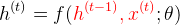
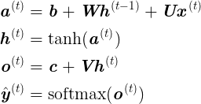
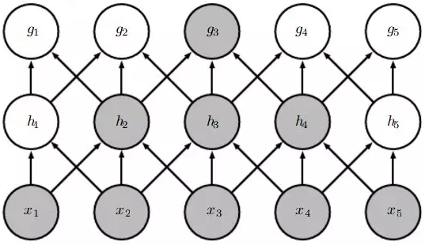

专题-序列建模
===

Reference
---
- 自然语言处理之序列模型 - 小象学院
- [从循环到卷积，探索序列建模的奥秘](https://mp.weixin.qq.com/s/f0sv7c-H5o5L_wy2sUonUQ) - 机器之心

Index
---
<!-- TOC -->

- [序列建模简述](#序列建模简述)
- [RNN 与序列建模](#rnn-与序列建模)
  - [RNN 的设计模式以及相应的递推公式（3） ToCompletion](#rnn-的设计模式以及相应的递推公式3-tocompletion)
  - [完整的 RNN 递推公式](#完整的-rnn-递推公式)
  - [LSTM ToCompletion](#lstm-tocompletion)
  - [GRU ToCompletion](#gru-tocompletion)
- [CNN 与序列建模](#cnn-与序列建模)
  - [一维卷积](#一维卷积)
- [时间卷积网络（TCN）](#时间卷积网络tcn)
  - [因果卷积](#因果卷积)
  - [空洞卷积](#空洞卷积)
  - [Highway 网络](#highway-网络)
  - [残差模块](#残差模块)

<!-- /TOC -->

## 序列建模简述
> [从循环到卷积，探索序列建模的奥秘](https://mp.weixin.qq.com/s/f0sv7c-H5o5L_wy2sUonUQ) - 机器之心
- 序列建模就是将一个**输入/观测**序列映射到一个**输出/标记**序列
  > 《统计学习方法》中称之为标注问题
- 在**传统机器学习**方法中，常用的模型有：隐马尔可夫模型（HMM），条件随机场（CRF）等
  > 机器学习专题 TODO
- 在**深度学习领域**的很长一段时间里，RNN/LSTM 都是序列建模的默认配置。
  > 《深度学习》中直接使用“序列建模：循环和递归网络”作为章节名
- 最近，CNN 开始在序列建模领域流行，一个关键想法是——在一维时间序列上使用**一维卷积**运算
  

  > [CNN for Sentence Classification](https://arxiv.org/abs/1408.5882) (Kim, 2014)

## RNN 与序列建模
- 循环神经网络本质上是一个递推函数
  

- 考虑隐藏状态和输入
  

- RNN 的计算图（无输出单元）
  

### RNN 的设计模式以及相应的递推公式（3） ToCompletion
> DL-RNN#[RNN 的几种设计模型（3）](./DL-RNN.md#rnn-的几种设计模型3)

### 完整的 RNN 递推公式
- 加入输出单元
  

- 完整的计算图
  

  
  > 一般来说，有两种 RNN 的基本结构：Elman network 和 Jordan network；目前深度学习领域通常所说的 RNN 指的是前者
  > 

  >
  >> [Recurrent neural network](https://en.wikipedia.org/wiki/Recurrent_neural_network#Elman_networks_and_Jordan_networks) - Wikipedia 
  

### LSTM ToCompletion
> DL-RNN

### GRU ToCompletion
> DL-RNN

## CNN 与序列建模
- 一般认为 CNN 擅长处理**网格结构的数据**，比如图像（二维像素网络）
  - 卷积层试图将神经网络中的每一小块进行更加深入的分析，从而得出抽象程度更高的特征。
  - 一般来说通过卷积层处理的神经元结点矩阵会变得更深，即神经元的组织在第三个维度上会增加。
- **时序数据**同样可以认为是在时间轴上有规律地采样而形成的一维网格
  

  > [CNN for Sentence Classification](https://arxiv.org/abs/1408.5882) (Kim, 2014)

### 一维卷积
- 适用于序列建模的卷积网络一般就是采用的是一维卷积
  

  - 最下层的 `x_i` 可视为句子的输入序列
  - 最上层的 `g_j` 即输出序列
  - 流行的网络中一般使用 **embedding** 作为输入，也就说每个 `x_i` 其实是一个多维向量 `v(x_i)`
    > [NLP-词向量](./NLP-词向量.md)

## 时间卷积网络（TCN）

### 因果卷积

**Reference**
- [WaveNet: A Generative Model for Raw Audio](https://deepmind.com/blog/wavenet-generative-model-raw-audio/) | DeepMind
- ibab/[tensorflow-wavenet](https://github.com/ibab/tensorflow-wavenet) - GitHub

### 空洞卷积

### Highway 网络
- 一种门限机制

### 残差模块
> [Deep Residual Learning for Image Recognition](https://arxiv.org/abs/1512.03385) (He, et al., 2015)

