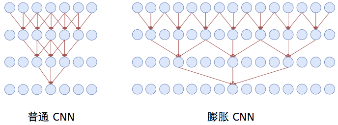
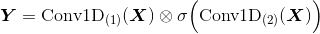
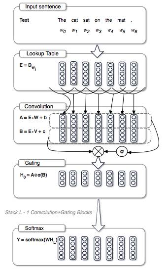
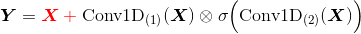
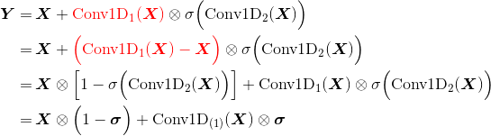

**RoadMap**
---
<!-- TOC -->

- [为什么使用 CNN 代替 RNN](#为什么使用-cnn-代替-rnn)
- [常见的卷积结构](#常见的卷积结构)
  - [基本卷积](#基本卷积)
  - [转置卷积](#转置卷积)
  - [空洞卷积](#空洞卷积)
  - [可分离卷积](#可分离卷积)
  - [Keras 实现](#keras-实现)
- [门卷积](#门卷积)
  - [门卷积的作用](#门卷积的作用)
  - [门卷积是如何防止梯度消失的](#门卷积是如何防止梯度消失的)

<!-- /TOC -->

# 为什么使用 CNN 代替 RNN
> [关于序列建模，是时候抛弃RNN和LSTM了](https://www.jiqizhixin.com/articles/041503) | 机器之心 [[英文原文]](https://towardsdatascience.com/the-fall-of-rnn-lstm-2d1594c74ce0)

**RNN/LSTM 本身的问题(3)**
1. RNN 需要更多的资源来训练，它和 硬件加速不匹配
    > 训练 RNN 和 LSTM 非常困难，因为计算能力受到内存和带宽等的约束。简单来说，每个 LSTM 单元需要四个仿射变换，且每一个时间步都需要运行一次，这样的仿射变换会要求非常多的内存带宽。**添加更多的计算单元很容易，但添加更多的内存带宽却很难**——这与目前的硬件加速技术不匹配，一个可能的解决方案就是让计算在存储器设备中完成。
1. RNN 容易发生**梯度消失**，即使是 LSTM
    > 在长期信息访问当前处理单元之前，需要按顺序地通过所有之前的单元。这意味着它很容易遭遇梯度消失问题；LSTM 一定程度上解决了这个问题，但 LSTM 网络中依然存在顺序访问的序列路径——直观来说，LSTM 能跳过一段信息中不太重要的部分，但如果整段信息都很重要，它依然需要完整的顺序访问，此时就跟 RNN 没有区别了。
1. **注意力机制模块**（记忆模块）的应用
    - 注意力机制模块可以同时**前向预测**和**后向回顾**。
    - **分层注意力编码器**（Hierarchical attention encoder）
    <div align="center"></div>

    - 分层注意力模块通过一个**层次结构**将过去编码向量**汇总**到一个**上下文向量**`C_t` ——这是一种更好的**观察过去信息**的方式（观点）
    - **分层结构**可以看做是一棵**树**，其路径长度为 `logN`，而 RNN/LSTM 则相当于一个**链表**，其路径长度为 `N`，如果序列足够长，那么可能 `N >> logN`
    > [放弃 RNN/LSTM 吧，因为真的不好用！望周知~](https://blog.csdn.net/heyc861221/article/details/80174475) - CSDN博客 

**任务角度(1)**
1. 从任务本身考虑，我认为也是 CNN 更有利，LSTM 因为能记忆比较长的信息，所以在推断方面有不错的表现（直觉）；但是在事实类问答中，并不需要复杂的推断，答案往往藏在一个 **n-gram 短语**中，而 CNN 能很好的对 n-gram 建模。


# 常见的卷积结构
> [一文了解各种卷积结构原理及优劣](https://zhuanlan.zhihu.com/p/28186857) - 知乎 &
  vdumoulin/[conv_arithmetic](https://github.com/vdumoulin/conv_arithmetic) - GitHUub

## 基本卷积
<table style="width:100%; table-layout:fixed;">
  <tr>
    <td>No padding, no strides</td>
    <td>Arbitrary padding, no strides</td>
    <td>Half padding, no strides</td>
    <td>Full padding, no strides</td>
  </tr>
  <tr>
    <td></td>
    <td></td>
    <td></td>
    <td></td>
  </tr>
  <tr>
    <td>No padding, strides</td>
    <td>Padding, strides</td>
    <td>Padding, strides (odd)</td>
  </tr>
  <tr>
    <td></td>
    <td></td>
    <td></td>
  </tr>
</table>

<!-- TODO: 更细的分类 -->

## 转置卷积
- 转置卷积（Transposed Convolution），又称反卷积（Deconvolution）、Fractionally Strided Convolution
  > 反卷积的说法不够准确，数学上有定义真正的反卷积，两者的操作是不同的
- 转置卷积是卷积的**逆过程**，如果把基本的卷积（+池化）看做“缩小分辨率”的过程，那么转置卷积就是“**扩充分辨率**”的过程。
  - 为了实现扩充的目的，需要对输入以某种方式进行**填充**。
- 转置卷积与数学上定义的反卷积不同——在数值上，它不能实现卷积操作的逆过程。其内部实际上执行的是常规的卷积操作。
  - 转置卷积只是为了**重建**先前的空间分辨率，执行了卷积操作。
- 虽然转置卷积并不能还原数值，但是用于**编码器-解码器结构**中，效果仍然很好。——这样，转置卷积可以同时实现图像的**粗粒化**和卷积操作，而不是通过两个单独过程来完成。

<table style="width:100%; table-layout:fixed;">
  <tr>
    <td>No padding, no strides, transposed</td>
    <td>Arbitrary padding, no strides, transposed</td>
    <td>Half padding, no strides, transposed</td>
    <td>Full padding, no strides, transposed</td>
  </tr>
  <tr>
    <td></td>
    <td></td>
    <td></td>
    <td></td>
  </tr>
  <tr>
    <td>No padding, strides, transposed</td>
    <td>Padding, strides, transposed</td>
    <td>Padding, strides, transposed (odd)</td>
  </tr>
  <tr>
    <td></td>
    <td></td>
    <td></td>
  </tr>
</table>

## 空洞卷积
- 空洞卷积（Atrous Convolutions）也称扩张卷积（Dilated Convolutions）、膨胀卷积。
  <div align="center"><br/>No padding, no strides.</div>

**空洞卷积的作用**
- 空洞卷积使 CNN 能够**捕捉更远的信息，获得更大的感受野**；同时不增加参数的数量，也不影响训练的速度。
- 示例：Conv1D + 空洞卷积
  <div align="center"></div>

  <!-- - 普通卷积在第三层时，每个节点只能捕捉到前后3个输入 -->

## 可分离卷积
- 可分离卷积（separable convolution）
- TODO

## Keras 实现
- Keras 中通过在卷积层中加入参数 `dilation_rate`实现
  ```Python
  Conv1D(filters=config.filters,
        kernel_size=config.kernel_size,
        dilation_rate=2)
  ```
  TODO: 维度变化

# 门卷积
> [卷积新用之语言模型](https://blog.csdn.net/stdcoutzyx/article/details/55004458) - CSDN博客 

- 类似 LSTM 的过滤机制，实际上是卷积网络与**门限单元**（Gated Linear Unit）的组合
- 核心公式
  <div align="center"></div>
  <!-- \boldsymbol{Y}=\text{Conv1D}_{(1)}(\boldsymbol{X}) \otimes \sigma\Big(\text{Conv1D}_{(2)}(\boldsymbol{X})\Big)dsymbol{X})\Big) -->
  
  > 中间的运算符表示**逐位相乘**—— Tensorflow 中由 `tf.multiply(a, b)` 实现，其中 a 和 b 的 shape 要相同；后一个卷积使用`sigmoid`激活函数

- 一个门卷积 Block
  <div align="center"></div>

  > `W` 和 `V` 表明参数不共享
- 实践中，为了防止梯度消失，还会在每个 Block 中加入残差

## 门卷积的作用
- 减缓梯度消失
- 解决语言顺序依存问题（？ TODO）
- 

## 门卷积是如何防止梯度消失的
- 因为公式中有一个卷积没有经过激活函数，所以对这部分求导是个常数，所以梯度消失的概率很小。
- 如果还是担心梯度消失，还可以加入**残差**——要求输入输出的 shape 一致
  <div align="center"></div>
  <!-- \boldsymbol{Y}={\color{Red} \boldsymbol{X} \,+\;} \text{Conv1D}_{(1)}(\boldsymbol{X}) \otimes \sigma\Big(\text{Conv1D}_{(2)}(\boldsymbol{X})\Big) -->

  更直观的理解：
  <div align="center"></div>
  <!-- \begin{aligned}\boldsymbol{Y}=&\,\boldsymbol{X} + {\color{Red}\text{Conv1D}_{(1)}(\boldsymbol{X})}\otimes \sigma\Big(\text{Conv1D}_{(2)}(\boldsymbol{X})\Big)\\=&\,\boldsymbol{X} + {\color{Red}\Big(\text{Conv1D}_{(1)}(\boldsymbol{X}) - \boldsymbol{X}\Big)}\otimes \sigma\Big(\text{Conv1D}_{(2)}(\boldsymbol{X})\Big)\\ =&\,\boldsymbol{X}\otimes \Big[1-\sigma\Big(\text{Conv1D}_{(2)}(\boldsymbol{X})\Big)\Big] + \text{Conv1D}_{(1)}(\boldsymbol{X}) \otimes \sigma\Big(\text{Conv1D}_{(2)}(\boldsymbol{X})\Big)\\ =&\,\boldsymbol{X}\otimes \Big(1-\boldsymbol{\sigma}\Big) + \text{Conv1D}_{(1)}(\boldsymbol{X}) \otimes \boldsymbol{\sigma} \end{aligned} -->

  即信息以 `1-σ` 的概率直接通过，以 `σ` 的概率经过变换后通过——类似 GRU
  > 因为`Conv1D(X)`没有经过激活函数，所以实际上它只是一个线性变化；因此与 `Conv1D(X) - X` 是等价的
  >
  > [基于CNN的阅读理解式问答模型：DGCNN](https://kexue.fm/archives/5409#门机制) - 科学空间|Scientific Spaces