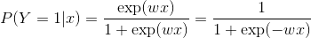
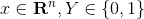
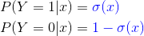
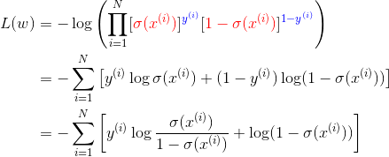
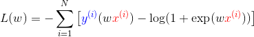
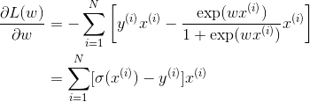
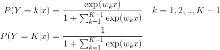
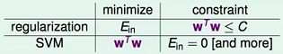

**问题分类**
---

- [基本算法](./基本算法.md)
- [理论知识](./理论知识.md)
- [项目实践](./项目实践.md)
- [数据挖掘](./数据挖掘.md)

**基本算法**
---
<!-- TOC -->

- [什么是推导](#什么是推导)
- [逻辑斯蒂回归](#逻辑斯蒂回归)
  - [逻辑斯蒂回归模型定义](#逻辑斯蒂回归模型定义)
  - [逻辑斯蒂回归推导](#逻辑斯蒂回归推导)
  - [多分类逻辑斯蒂回归模型（ToDo）](#多分类逻辑斯蒂回归模型todo)
- [支持向量机](#支持向量机)
  - [支持向量机简述](#支持向量机简述)
    - [支持向量的含义](#支持向量的含义)
    - [支持向量机的分类](#支持向量机的分类)
    - [核函数与核技巧](#核函数与核技巧)
    - [最大间隔超平面背后的原理](#最大间隔超平面背后的原理)
  - [线性支持向量机推导](#线性支持向量机推导)

<!-- /TOC -->

# 什么是推导
- 给出一个问题或模型的定义，然后求其最优解的过程

# 逻辑斯蒂回归

## 逻辑斯蒂回归模型定义
- **二项**逻辑斯蒂回归模型即如下的**条件概率分布**

  <!-- =\frac{\exp(z)}{1&plus;\exp(z)}=\frac{1}{1&plus;\exp(-z)}) -->
  =\frac{\exp(wx)}{1&plus;\exp(wx)}=\frac{1}{1&plus;\exp(-wx)})

  =1-P(Y=1|x))
  > 简洁起见，省略了偏置 `b`；也可以看做将偏置扩充到了权重中

  **其中** 
    
  <!-- =1-P(Y=1|x)) -->
  
  

- 通常会将以上两个分布记作：

  ={\color{Blue}&space;\sigma(x)}\\&space;&P(Y=0|x)={\color{Blue}&space;1-\sigma(x)}&space;\end{aligned})

> 《统计学习方法》 6.1 逻辑斯蒂回归模型
>> 原书中记作 `π(x)` 和 `1-π(x)`，这里为了跟神经网络中统一，使用 `σ`
  
## 逻辑斯蒂回归推导
> [逻辑回归推导](https://www.cnblogs.com/daguankele/p/6549891.html) - 罐装可乐 - 博客园 
- 推导的关键点 (3)
  1. 逻辑斯蒂回归的定义
  1. 损失函数（极大似然）
  1. 参数优化（梯度下降）

- 给定训练集 `T={(x1,y1),..,(xN,yN)}`，其中 `x ∈ R^n, y ∈ {0, 1}`
1. **逻辑斯蒂回归**的定义：

    ={\color{Blue}&space;\sigma(x)}\\&space;&P(Y=0|x)={\color{Blue}&space;1-\sigma(x)}&space;\end{aligned})
2. **负对数似然**作为损失函数：

    &=-\log\left&space;(&space;\prod_{i=1}^N&space;[{\color{Red}&space;\sigma(x^{(i)})}]^{{\color{Blue}&space;y^{(i)}}}&space;[{\color{Red}&space;1-&space;\sigma(x^{(i)})}]^{{\color{Blue}&space;1-y^{(i)}}}&space;\right&space;)\\&space;&=-\sum_{i=1}^N&space;\left&space;[&space;y^{(i)}\log\sigma(x^{(i)})&plus;(1-y^{(i)})\log(1-\sigma(x^{(i)}))&space;\right&space;]\\&space;&=-\sum_{i=1}^N&space;\left&space;[&space;y^{(i)}\log\frac{\sigma(x^{(i)})}{1-\sigma(x^{(i)})}&plus;\log(1-\sigma(x^{(i)}))&space;\right&space;]&space;\end{aligned})

    进一步带入 `σ(x)` 有：

    &=-\sum_{i=1}^N&space;\left&space;[&space;{\color{Blue}&space;y^{(i)}}(w{\color{Red}&space;x^{(i)}})-\log(1&plus;\exp(w{\color{Red}&space;x^{(i)}}))&space;\right&space;]&space;\end{aligned})
3. **求梯度**
    
    }{\partial&space;w}&=-\sum_{i=1}^N&space;\left&space;[&space;y^{(i)}x^{(i)}-\frac{\exp(wx^{(i)})}{1&plus;\exp(wx^{(i)})}x^{(i)}&space;\right&space;]\\&space;&=\sum_{i=1}^N&space;[\sigma&space;(x^{(i)})-y^{(i)}]x^{(i)}&space;\end{aligned})

    > 原书中使用 `x_i` 作为第 i 个样本，但这里的 `x` 也是一个矢量，为了避免将 `x_i` 视为 `x` 的分量，故改用上标 `(i)`.

## 多分类逻辑斯蒂回归模型（ToDo）
- 设 `Y ∈ {1,2,..K}`，则多项式逻辑斯蒂回归模型为：

    &=\frac{\exp(w_kx)}{1&plus;\sum_{k=1}^{K-1}&space;\exp(w_kx)}&space;\quad&space;k=1,2,..,K-1&space;\\&space;P(Y=K|x)&=\frac{1}{1&plus;\sum_{k=1}^{K-1}\exp(w_kx)}&space;\end{aligned})
  

# 支持向量机

## 支持向量机简述
- 支持向量机（Support Vector Machines, SVM）是一种二分类模型。它的**基本模型**是定义在特征空间上的**间隔最大**的线性分类器，间隔最大使它有别于感知机；支持向量机还包括**核技巧**，这使其成为实质上的非线性分类器。
- **SVM 的学习策略就是间隔最大化**，可形式化为一个求解**凸二次规划**的问题，也等价于正则化的**合页损失函数**的最小化问题。
- SVM 的最优化算法是求解凸二次规划的最优化算法。

### 支持向量的含义
- 决定最优分离超平面的样本点叫做支持向量
- 离最优分离超平面的样本点
- 更通俗的解释：
  - 数据集种的某些点，位置比较特殊。比如 `x+y-2=0` 这条直线，假设出现在直线上方的样本记为 A 类，下方的记为 B 类。
  - 在寻找找这条直线的时候，一般只需看两类数据，它们各自最靠近划分直线的那些点，而其他的点起不了决定作用。
  - 这些点就是所谓的“支持点”，在数学中，这些点称为**向量**，所以更正式的名称为“**支持向量**”。
  > [SVM中支持向量的通俗解释](https://blog.csdn.net/AerisIceBear/article/details/79588583) - CSDN博客 

### 支持向量机的分类
- 线性可分支持向量机
  - 当训练数据**线性可分**时，通过**硬间隔最大化**，学习一个线性分类器，即线性可分支持向量机，又称**硬间隔支持向量机**。
- 线性支持向量机
  - 当训练数据**接近线性可分**时，通过**软间隔最大化**，学习一个线性分类器，即线性支持向量机，又称**软间隔支持向量机**。
- 非线性支持向量机
  - 当训练数据**线性不可分**时，通过使用**核技巧**及软间隔最大化，学习非线性支持向量机。

### 核函数与核技巧
- **核函数**表示将输入从输入空间映射到特征空间后得到的特征向量之间的内积

### 最大间隔超平面背后的原理
> 机器学习技法 (1-5) - 林轩田
- 相当于在**最小化权重**时对训练误差进行了约束——对比 L2 范数正则化，则是在最小化训练误差时，对权重进行约束

  
  > 与 L2 正则化的区别
- 相当于**限制了模型复杂度**——在一定程度上防止过拟合，具有更强的泛化能力

## 线性支持向量机推导
- Linear SVM 的推导分为两部分
  1. 如何通过**间隔最大化**的定义推出线性支持向量机的**标准问题**；
  1. **带约束**优化问题的求解过程（拉格朗日乘子法）.

