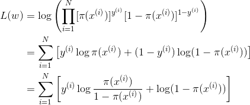

**问题分类**
---

- [基本算法](./基本算法.md)
- [理论知识](./理论知识.md)
- [项目实践](./项目实践.md)
- [数据挖掘](./数据挖掘.md)

**基本算法**
---
<!-- TOC -->

- [逻辑斯蒂回归](#逻辑斯蒂回归)
  - [逻辑斯蒂回归模型定义](#逻辑斯蒂回归模型定义)
  - [逻辑斯蒂回归推导](#逻辑斯蒂回归推导)
- [支持向量机](#支持向量机)
  - [线性支持向量机推导](#线性支持向量机推导)

<!-- /TOC -->

# 逻辑斯蒂回归

## 逻辑斯蒂回归模型定义
- **二项**逻辑斯蒂回归模型即如下的**条件概率分布**

  <!-- =\frac{\exp(z)}{1&plus;\exp(z)}=\frac{1}{1&plus;\exp(-z)}) -->
  =\frac{\exp(wx)}{1&plus;\exp(wx)}=\frac{1}{1&plus;\exp(-wx)})

  =1-P(Y=1|x))
  > 简洁起见，省略了偏置 `b`

  **其中** 
    
  <!-- =1-P(Y=1|x)) -->
  
  

- 通常会将以上两个分布记作：

  ={\color{Blue}&space;\sigma(x)}\\\\&space;&P(Y=0|x)={\color{Blue}&space;1-\sigma(x)}&space;\end{aligned})

> 《统计学习方法》 6.1 逻辑斯蒂回归模型
>> 原书中记作 `π(x)` 和 `1-π(x)`，这里为了跟神经网络中统一，使用 `σ`
  
## 逻辑斯蒂回归推导
- 推导的关键点 (3)
  1. 逻辑斯蒂回归的定义
  1. 损失函数（极大似然）
  1. 参数优化（梯度下降）

- 给定训练集 `T={(x1,y1),..,(xN,yN)}`，其中 `x ∈ R^n, y ∈ {0, 1}`
1. 逻辑斯蒂回归模型：

    ={\color{Blue}&space;\pi(x)}\\&space;&P(Y=0|x)={\color{Blue}&space;1-\pi(x)}&space;\end{aligned})
2. 对数似然作为损失函数：

    ={\color{Blue}&space;\pi(x)}\\&space;&P(Y=0|x)={\color{Blue}&space;1-\pi(x)}&space;\end{aligned})

    进一步带入 ``

  

# 支持向量机

## 线性支持向量机推导

