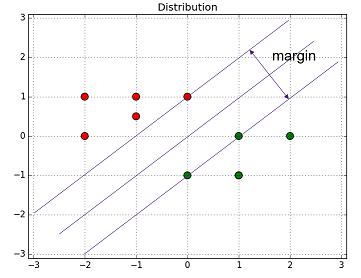

**算法列表**
---
<!-- TOC -->

- [1. 支持向量机（SVM）相关***](#1-支持向量机svm相关)
- [2. 朴素贝叶斯相关***](#2-朴素贝叶斯相关)

<!-- /TOC -->

# 1. 支持向量机（SVM）相关***

**支持向量机中的支持向量是什么意思？**

简单来说，就是指哪些对分类起决定作用的向量

在远离分割线的区域，即使增加大量的样本点，对于分割线的位置也是没有作用的；因为分割线是由几个关键点决定的（图上三个），**这几个关键点支撑起了一个分割超平面**，这些关键点就是**支持向量**。

> [支持向量机(SVM)是什么意思？](https://www.zhihu.com/question/21094489) - 知乎

**以下哪些点属于支持向量**
> geekcircle/machine-learning-interview-qa/[10.md](https://github.com/geekcircle/machine-learning-interview-qa/blob/master/questions/10.md)

    +：(−1,1),(1,−1),(−1,−1)
    −：(1,1),(2,0),(2,1)

    答：(−1,1),(1,−1) 和 (1,1),(2,0)

# 2. 朴素贝叶斯（Naive Bayes）相关***

**朴素贝叶斯分类某个类别概率为0怎么办？**
> geekcircle/machine-learning-interview-qa/[13.md](https://github.com/geekcircle/machine-learning-interview-qa/blob/master/questions/13.md)

