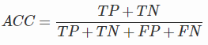
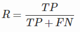

**问题列表**
---
<!-- TOC -->

- [1. 几种参数估计的区别于联系: MLE、MAP、贝叶斯***](#1-几种参数估计的区别于联系-mlemap贝叶斯)
- [2. 余弦相似度（Cos距离）与欧氏距离的区别和联系**](#2-余弦相似度cos距离与欧氏距离的区别和联系)
- [3. 监督学习和无监督学习*](#3-监督学习和无监督学习)
- [4. 熵，求投掷均匀正六面体骰子的熵***](#4-熵求投掷均匀正六面体骰子的熵)
- [6. 混淆矩阵、模型度量指标：准确率、精确率、召回率、F1 值等**](#6-混淆矩阵模型度量指标准确率精确率召回率f1-值等)

<!-- /TOC -->

# 1. 几种参数估计的区别于联系: MLE、MAP、贝叶斯***

# 2. 余弦相似度（Cos距离）与欧氏距离的区别和联系**
> geekcircle/machine-learning-interview-qa/[4.md](https://github.com/geekcircle/machine-learning-interview-qa/blob/master/questions/4.md)

- 欧式距离和余弦相似度都能度量 2 个向量之间的相似度
- 放到向量空间中看，欧式距离衡量两点之间的**直线距离**，而余弦相似度计算的是两个向量之间的**夹角**
- **没有归一化时**，欧式距离的范围是 (0, +∞]，而余弦相似度的范围是 (0, 1]；余弦距离是计算**相似程度**，而欧氏距离计算的是**相同程度**（对应值的相同程度）
- **归一化的情况下**，可以将空间想象成一个超球面（三维），欧氏距离就是球面上两点的直线距离，而向量余弦值等价于两点的球面距离，本质是一样。

> [欧氏距离和余弦相似度的区别是什么？](https://www.zhihu.com/question/19640394) - 知乎 

# 3. 监督学习和无监督学习*
> geekcircle/machine-learning-interview-qa/[6.md](https://github.com/geekcircle/machine-learning-interview-qa/blob/master/questions/6.md)

# 4. 熵，求投掷均匀正六面体骰子的熵***
> geekcircle/machine-learning-interview-qa/[7.md](https://github.com/geekcircle/machine-learning-interview-qa/blob/master/questions/7.md)

什么是熵？
> 深度学习/理论知识/[16. 信息熵、KL 散度（相对熵）与交叉熵**](../深度学习/README.md#16-信息熵kl-散度相对熵与交叉熵)

**求投掷均匀正六面体骰子的熵**

- 问题描述：向空中投掷硬币，落地后有两种可能的状态，一个是正面朝上，另一个是反面朝上，每个状态出现的概率为1/2。如投掷均匀的正六面体的骰子，则可能会出现的状态有6个，每一个状态出现的概率均为1/6。试通过计算来比较状态的不确定性与硬币状态的不确定性的大小。

- 答：

    硬币：\log&space;P(X_i)&space;=&space;-2*\frac{1}{2}*\log&space;P(\frac{1}{2})\approx&space;1&space;\text{bit})

    六面体：\log&space;P(X_i)&space;=&space;-6*\frac{1}{6}*\log&space;P(\frac{1}{6})\approx&space;2.6&space;\text{bit})

# 5. 混淆矩阵、模型度量指标：准确率、精确率、召回率、F1 值等**

**混淆矩阵**

- True Positive(TP)：将正类预测为正类的数量.
- True Negative(TN)：将负类预测为负类的数量.
- False Positive(FP)：将负类预测为正类数 → 误报 (Type I error).
- False Negative(FN)：将正类预测为负类数 → 漏报 (Type II error).

    

**准确率**（accuracy）

**精确率**（precision）

> 准确率与精确率的区别：
>> 在正负样本不平衡的情况下，**准确率**这个评价指标有很大的缺陷。比如在互联网广告里面，点击的数量是很少的，一般只有千分之几，如果用acc，即使全部预测成负类（不点击）acc 也有 99% 以上，没有意义。
    
**召回率**（recall, sensitivity, true positive rate）

**F1值**——精确率和召回率的调和均值

> 只有当精确率和召回率都很高时，F1值才会高
