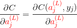
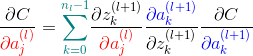
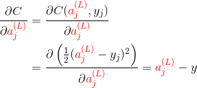
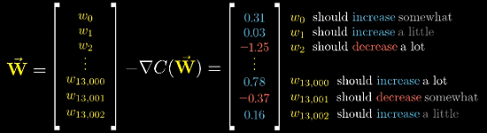

**深度学习**
---
- [“花书”-《深度学习》-问题整理](./“花书”《深度学习》整理.md)

**深度学习基本问题**
---
<!-- TOC -->

- [1. 反向传播算法](#1-反向传播算法)
  - [1.1. 反向传播的作用、目的、本质](#11-反向传播的作用目的本质)
  - [1.2. 反向传播的公式推导](#12-反向传播的公式推导)
- [2. 梯度下降法、随机梯度下降](#2-梯度下降法随机梯度下降)
  - [2.1. 梯度下降法的作用、目的、本质](#21-梯度下降法的作用目的本质)
  - [2.2. 随机梯度下降](#22-随机梯度下降)
  - [2.3. 随机梯度下降中“**批**”的大小对优化效果的影响](#23-随机梯度下降中批的大小对优化效果的影响)
- [3. 激活函数](#3-激活函数)
  - [3.1. 激活函数的作用——为什么要使用**非线性**激活函数？](#31-激活函数的作用为什么要使用非线性激活函数)
  - [3.2. 常见的激活函数](#32-常见的激活函数)

<!-- /TOC -->

# 1. 反向传播算法
> 数学相关/深度学习的核心/[反向传播的 4 个基本公式](../数学相关/深度学习的核心.md#323-反向传播的-4-个基本公式)

## 1.1. 反向传播的作用、目的、本质
- **反向传播概述**：

  **梯度下降法**中需要利用损失函数对所有参数的梯度来寻找局部最小值点；

  而**反向传播算法**就是用于计算该梯度的具体方法，其本质是利用**链式法则**对每个参数求偏导。

## 1.2. 反向传播的公式推导
- 可以用 4 个公式总结反向传播的过程

  **标量形式**：

  }}}=\frac{\partial&space;C({\color{Red}&space;a_j^{(L)}},y_j)}{\partial&space;{\color{Red}&space;a_j^{(L)}}}&space;\end{aligned})

  }}}={\color{Teal}\sum_{k=0}^{n_l-1}}&space;\frac{\partial&space;z_k^{(l&plus;1)}}{{\color{Red}&space;\partial&space;a_j^{(l)}}}&space;\frac{{\color{Blue}&space;\partial&space;a_k^{(l&plus;1)}}}{\partial&space;z_k^{(l&plus;1)}}&space;\frac{\partial&space;C}{{\color{Blue}&space;\partial&space;a_k^{(l&plus;1)}}}&space;\end{aligned})

  }}}=\frac{\partial&space;z_j^{(l)}}{{\color{Magenta}&space;\partial&space;w_{j,k}^{(l)}}}\frac{{\color{Red}\partial&space;a_j^{(l)}}}{\partial&space;z_j^{(l)}}\frac{\partial&space;C}{{\color{Red}\partial&space;a_j^{(l)}}}&space;\end{aligned})

  }}}=\frac{\partial&space;z_j^{(l)}}{{\color{Magenta}&space;\partial&space;b_{j}^{(l)}}}\frac{{\color{Red}\partial&space;a_j^{(l)}}}{\partial&space;z_j^{(l)}}\frac{\partial&space;C}{{\color{Red}\partial&space;a_j^{(l)}}}&space;\end{aligned})

  > 其中，上标 `(l)` 表示网络的层次，`(L)` 表示输出层（最后一层）；下标 `j` 和 `k` 指示神经元的位置；
  >
  > `w_jk` 表示 `l` 层的第 `j` 个神经元与`(l-1)`层第 `k` 个神经元连线上的权重
  
  以 **均方误差（MSE）** 损失函数为例，有

  }}}&=\frac{\partial&space;C({\color{Red}&space;a_j^{(L)}},y_j)}{\partial&space;{\color{Red}&space;a_j^{(L)}}}&space;\\&space;&=\frac{\partial&space;\left&space;(&space;\frac{1}{2}({\color{Red}a_j^{(L)}}-y_j)^2&space;\right&space;)&space;}{\partial&space;{\color{Red}a_j^{(L)}}}={\color{Red}a_j^{(L)}}-y&space;\end{aligned})

- Nielsen 的课程中提供了另一种表述，本质上是一样的。
  > [The four fundamental equations behind backpropagation](http://neuralnetworksanddeeplearning.com/chap2.html#the_four_fundamental_equations_behind_backpropagation)

# 2. 梯度下降法、随机梯度下降
> 数学相关/深度学习的核心/[梯度下降法](../数学相关/深度学习的核心.md#2-梯度下降法)

## 2.1. 梯度下降法的作用、目的、本质
- 寻找**局部最小值**
- 参数**优化**的一种策略
- 微积分中使用**梯度**指示函数“**最陡的**”增长方向，即沿着梯度的方向，函数增长最快；

  神经网络中使用**负梯度**来指示优化参数的方向
- **梯度**实际上是损失函数对网络中每个参数的偏导所组成的向量，其中计算各偏导的方法即**反向传播算法**
- 从另一个角度来理解**方向**这个概念，可以认为**负梯度**中的每一项实际传达了两个信息：

  1. 正负号在告诉输入向量应该调大还是调小——正调大，负调小
  1. 每一项的相对大小表明每个输入值对函数值的影响程度；换言之，也就是调整各权重对于网络的影响

      

## 2.2. 随机梯度下降
- 基本的梯度下降法要求每次使用**所有训练样本**的平均损失来更新参数
- 为了**加快计算效率**，一般的做法会首先**打乱**所有训练样本，每次计算梯度时会**随机**抽取其中一**批**(**Batch**)来计算平均损失——这就是“**随机梯度下降**”。
  > 也有地方将使用**全部**、**一个**、**一批**样本的方法分别称为“**批量梯度下降**”、“**随机梯度下降**”、“**小批量梯度下降**”

## 2.3. 随机梯度下降中“**批**”的大小对优化效果的影响
> 《深度学习》 8.1.3 批量算法和小批量算法
- **较大的批能得到更精确的梯度估计**，但回报是小于线性的。
- **较小的批能带来更好的泛化误差**，泛化误差通常在批大小为 1 时最好。但是，因为梯度估计的高方差，小批量训练需要**较小的学习率**以保持稳定性，这意味着**更长的训练时间**。
  > 原因可能是由于小批量在学习过程中带来了**噪声**，使产生了一些正则化效果 (Wilson and Martinez, 2003)
- **内存消耗和批的大小成正比**，当批量处理中的所有样本可以并行处理时。
- 在某些硬件上使用特定大小可以减少运行时间。尤其是在使用 GPU 时，通常使用 **2 的幂数**作为批量大小可以获得更少的运行时间。一般，2 的幂数的**取值范围是 32 到 256**，16 有时在尝试大模型时使用。

# 3. 激活函数

## 3.1. 激活函数的作用——为什么要使用**非线性**激活函数？
- 使用**激活函数**的目的是为了向网络中加入**非线性因素**；

  从而加强网络的表示能力，解决线性模型无法解决的问题
  
**为什么加入非线性因素能够加强网络的表示能力？——神经网络的万能近似定理**
- 神经网络的万能近似定理认为主要神经网络具有至少一个非线性隐藏层，那么只要给予网络足够数量的隐藏单元，它就可以以任意的精度来近似任何**从一个有限维空间到另一个有限维空间**的函数。
- 如果不使用非线性激活函数，那么每一层输出都是上层输入的**线性组合**；

  此时无论网络有多少层，其整体也将是线性的，这会导致失去万能近似的性质
  > 《深度学习》 6.4.1 万能近似性质和深度；
- 但仅**部分层是纯线性**是可以接受的，这有助于**减少网络中的参数**。
  > 《深度学习》 6.3.3 其他隐藏单元

## 3.2. 常见的激活函数
