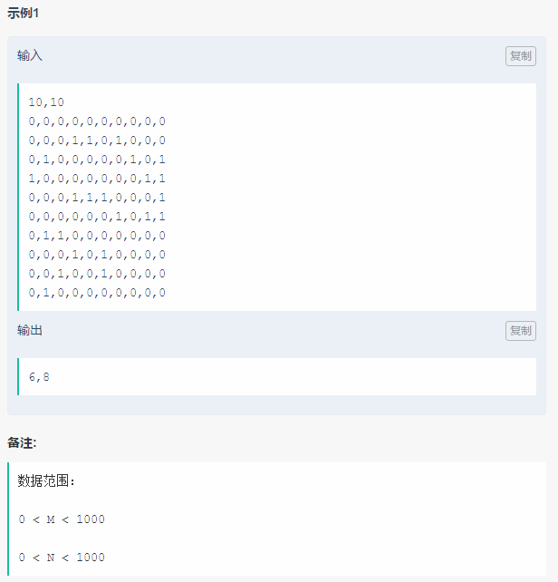
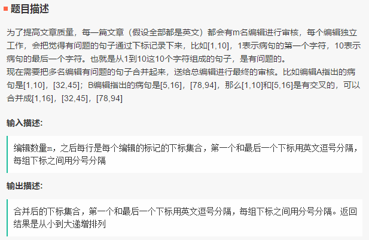
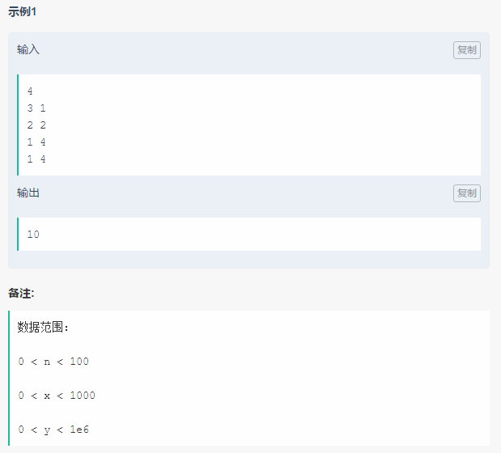
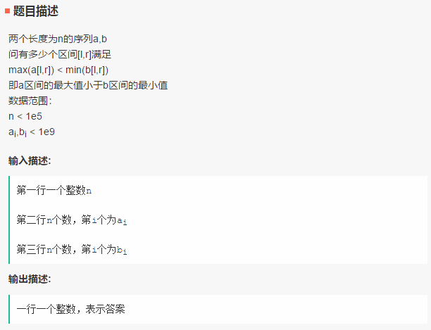
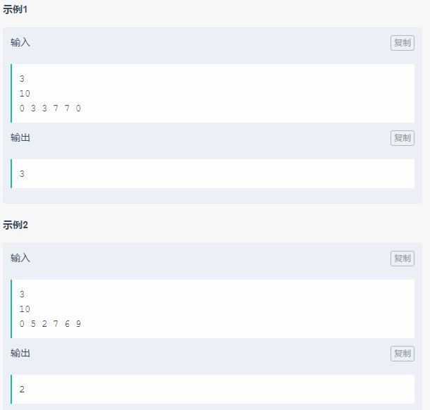

笔试面经
===

Reference
---
- [BAT机器学习面试1000题系列（第1~305题）](https://blog.csdn.net/v_JULY_v/article/details/78121924) - CSDN博客 

Index
---
<!-- TOC -->

- [今日头条-算法工程师-实习](#今日头条-算法工程师-实习)
  - [一面](#一面)
  - [二面](#二面)
  - [三面](#三面)
- [2019 美团 AI - NLP 提前批](#2019-美团-ai---nlp-提前批)
  - [一面（NLP平台）](#一面nlp平台)
  - [一面（广告平台）](#一面广告平台)
  - [二面（广告）](#二面广告)
- [拼多多 180722 笔试](#拼多多-180722-笔试)
  - [1. 数组中的最长山谷](#1-数组中的最长山谷)
  - [2. 字符串构造](#2-字符串构造)
  - [3. 到达指定位置](#3-到达指定位置)
  - [4. 靓号](#4-靓号)
- [[180812] 字节跳动笔试](#180812-字节跳动笔试)
  - [1. 世界杯开幕式](#1-世界杯开幕式)
  - [2. 文章病句标识](#2-文章病句标识)
  - [3. 积分卡牌游戏](#3-积分卡牌游戏)
  - [4. 区间最大最小值](#4-区间最大最小值)
  - [5. 直播爱好者](#5-直播爱好者)

<!-- /TOC -->

## 今日头条-算法工程师-实习
> [6.14今日头条算法工程师实习生](https://www.nowcoder.com/discuss/84462?type=2&order=0&pos=11&page=1)_笔经面经_牛客网 

### 一面
1. 自我介绍；
1. 二分查找；
    > Algorithm_for_Interview/常用子函数/[二分查找模板.hpp](https://github.com/imhuay/Algorithm_for_Interview-Chinese/blob/master/Algorithm_for_Interview/_utils工具函数/二分查找模板.hpp)
1. 判断链表是否有环；
    > Algorithm_for_Interview/链表/[链表中环的入口结点.hpp](https://github.com/imhuay/Algorithm_for_Interview-Chinese/blob/master/Algorithm_for_Interview/链表/链表中环的入口结点.hpp)
1. 将数组元素划分成两部分，使两部分和的差最小，数组顺序可变；
    > Algorithm_for_Interview/查找与排序/[暴力搜索_划分数组使和之差最小.hpp](https://github.com/imhuay/Algorithm_for_Interview-Chinese/blob/master/Algorithm_for_Interview/查找与排序/暴力搜索_划分数组使和之差最小.hpp)
1. 智力题，在一个圆环上随机添加3个点，三个点组成一个锐角三角形的概率；
    > ../数学问题/[#1](../数学/README.md#1-在圆环上随机选取-3-个点这-3-个点组成锐角三角形的概率)
1. 推导逻辑斯蒂回归、线性支持向量机算法；
    > ../机器学习/[逻辑斯蒂回归推导](../机器学习/README.md#逻辑斯蒂回归推导)
    >
    > ../机器学习/[线性支持向量机推导](../机器学习/README.md#线性支持向量机推导)

### 二面
1. 在一个圆环上随机添加3点，三个点组成一个锐角三角形的概率；
1. 用积分计算上述概率；
1. 用程序解决上述问题
    > 多次采样求概率，关键是如何判断采样的三个点能否构成锐角三角形，不同的抽象会带来不同的复杂度。
    
    > 最直接的想法是，根据边长关系，此时需要采样三个 x 坐标值，相应的 y 坐标通过计算得出，然后计算三边长度，再判断，循环以上过程，计算形成锐角的比例。

    > 更简单的，根据 [../数学/#1](../数学/README.md#1-在圆环上随机选取-3-个点这-3-个点组成锐角三角形的概率) 中提到的简单思路，原问题可以等价于“抛两次硬币，求两次均为正面的概率”——此时，只需要采样两个`(0, 1)`之间的值，当两个值都小于 0.5 意味着能构成锐角三角形。

1. 深度学习，推导反向传播算法，知道什么激活函数，不用激活函数会怎么样，ROC与precesion/recall评估模型的手段有何区别，什么情况下应该用哪一种？深度学习如何参数初始化？
    > ../深度学习/[反向传播算法](../深度学习/README.md#反向传播算法)
    >
    > ../深度学习/[激活函数](../深度学习/README.md#激活函数)
    >
    > ../深度学习/[参数初始化](../深度学习/README.md#参数初始化)
1. 介绍kaggle项目，titanic，用到了哪些框架，用到了哪些算法；

### 三面
1. 自我介绍；
1. 分层遍历二叉树，相邻层的遍历方向相反，如第一层从左到右遍历，下一层从右向左遍历；
1. 介绍AdaBoost算法；
1. 介绍梯度下降，随机梯度下降
    > ../深度学习/[梯度下降法](../深度学习/README.md#2-梯度下降法随机梯度下降)
1. 写出逻辑斯蒂回归的损失函数；
1. C++，虚函数，虚析构函数。


## 2019 美团 AI - NLP 提前批
> [2019美团AI算法提前批面试经验](https://www.nowcoder.com/discuss/85852?type=2&order=0&pos=7&page=1)_笔经面经_牛客网

### 一面（NLP平台）
**论文/项目相关**
- 意图识别数据怎么标注
- 怎么样做实体抽取
- 怎样进行 aspect-level 情感分析
- 模型中增强学习的 reward 如何设计的；为什么这样设计

### 一面（广告平台）
**论文/项目相关**
- seq2seq 中 scheduled sampling 如何做的
- RL部分训练过程中数据集如何构造
- 如何防止过拟合，你都采用了哪些方法，还有哪些你没有用到的方法
  > 深度学习/[正则化](../深度学习/README.md#正则化)
- 【**编程题**】给定整数n，求离根号n最近的整数。
  > [二分查找最优解模板](https://github.com/imhuay/Algorithm_for_Interview-Chinese/blob/master/Algorithm_for_Interview/_必背算法/二分查找最优解模板.hpp)

### 二面（广告）
**论文/项目相关**
- RL + Seq2seq相关问题
  - Seq2seq怎样和RL结合，这里的action与state都是什么
  - 如何设计reward，为什么选取这样的reward
  - 具体训练流程是怎样的
  
**深度学习相关**
- BiLSTM 相比 LSTM有哪些 case 上的提升
- Attention 是如何加的取得了哪些效果的提升
- 能介绍几个传统的机器学习模型吗，列举了：决策树，SVM, RF等
  - 具体说明一下决策树如何划分，写出相应的公式
  - 具体解释一下RF
- 【**编程题**】类似求一个旋转数组的拐点位置
  > 二分查找；[153. 寻找旋转排序数组中的最小值](https://leetcode-cn.com/problems/find-minimum-in-rotated-sorted-array/description/) - LeetCode

## 拼多多 180722 笔试
共 4 道编程题
### 1. 数组中的最长山谷
> 问题描述：LeetCode 845. [数组中的最长山脉](https://leetcode-cn.com/problems/longest-mountain-in-array/description/)
- 原题是找山脉，这里改成了山谷
  ```
  示例：
      输入：
          [4,3,2,5,3,1,4,8]
      输出：
          5
      说明：
          [5,3,1,4,8]
  ```
- **“坑”点说明**
  - 输入就是字符串 "[4,3,2,5,3,1,4,8]" 包括括号和标点
  - 问题是，直接返回 0 也有 20% 的正确率，导致我一直没想到是输入上的问题，直到最后都卡在 20%
- 建议所有需要处理字符串的问题，都使用 Python，这里只要 `A = eval(input())` 就完事了；而 C++ 如果不熟悉 STL 的话，处理输入都比题目本身难了
- **思路**：暴力枚举；看代码更直观 
- C++ 代码 [[code]](https://github.com/imhuay/Algorithm_for_Interview-Chinese/blob/master/Algorithm_for_Interview/_笔试/拼多多180722/1.数组中的最长山谷.hpp)（没做输入处理）

### 2. 字符串构造
- 问题描述
  ```
  一个长串由一个字串循环构成，即 s[i]=t[i%n]，比如 "abcabc" 由 "abc" 构成

  注意："abcabcab" 也是由 "abc" 构成的，答题时没注意这个又只过了一部分

  *建议使用 Python 解决字符串相关问题
  ```
- **思路**：暴力枚举前缀
- Python 代码 [[code]](https://github.com/imhuay/Algorithm_for_Interview-Chinese/blob/master/Algorithm_for_Interview/_笔试/拼多多180722/2.字符串构造.py)

### 3. 到达指定位置
- 题目描述：Leetcode 754. [到达终点数字](https://leetcode-cn.com/problems/reach-a-number/description/)
- 数学题
- 思路：[一道乐视网的面试题，求解答？](https://www.zhihu.com/question/50790221/answer/125213696) - 知乎 
- C++ 代码 [[code]](https://github.com/imhuay/Algorithm_for_Interview-Chinese/blob/master/Algorithm_for_Interview/_笔试/拼多多180722/3.到达指定位置.hpp)

### 4. 靓号
- 问题描述
  ```
  A 国的手机号码由且仅由 N 位十进制数(0-9)组成，可以有前导 0，比如 000123456。一个手机号码中至少有 K 位数相同则被定义为靓号（不要求连续）。
  如果想把自己的手机号修改为一个靓号，修改一个数字的金额为新数字与旧数字之间的差的绝对值，比如 1 修改为 6 或 6 修改为 1 都要花 5 块钱。
  求对给定手机号，修改为靓号最少要花的钱数以及新的号码（如果有多个，输出字典序最小的）。

  输入：
      第一行包含两个整数 N 和 K，分别表示 手机号码的位数和靓号要求的位数
      第二行为 N 个数字，数字之间没有空白符

      数据范围 2 <= K <= N <= 10000

  示例：
      输入：
          6 5
          785785
      输出：
          4
          777577
      说明: 777577 比 777775 字典序小
  ```
- **思路**：

  统计每个数字出现次数counter，以每个数字为基准，按照与基准差值对counter排序，优先替换差值小的数字；关于字典序的问题，如果替换的数比基准大则从前向后替换，如果替换的数比基准大，则从后向前替换，得到的就是字典序最小的字符串，时间复杂度O(n)
  > [拼多多算法岗笔试python解决方案](https://www.nowcoder.com/discuss/87694)_笔经面经_牛客网
- TODO 目前还没看到完全 AC 的代码


## [180812] 字节跳动笔试
5 道编程题

### 1. 世界杯开幕式
<div align="center"></div>
<div align="center"></div>

**思路**
- dfs

**Code(Python)**
```Python
m, n = list(map(int, input().strip().split(',')))

book = []
for i in range(m):
    line = input().strip().split(',')
    line = [int(x) for x in line]
    book.append(line)

class Solution:
    def __init__(self, pos):
        self.pos = pos
        self.cnt = 0
        self.dp = []

    def dfs(self, i, j):
        if 0 <= i < m and 0 <= j < n:
            if self.pos[i][j] == 1:
                self.cnt += 1
                self.pos[i][j] = 0
                self.dfs(i - 1, j)
                self.dfs(i + 1, j)
                self.dfs(i, j - 1)
                self.dfs(i, j + 1)
                self.dfs(i - 1, j - 1)
                self.dfs(i + 1, j + 1)
                self.dfs(i + 1, j - 1)
                self.dfs(i - 1, j + 1)
        return

    def solve(self):
        for i in range(m):
            for j in range(n):
                if self.pos[i][j] == 1:
                    self.cnt = 0
                    self.dfs(i, j)
                    if self.cnt > 0:
                        self.dp.append(self.cnt)
        return len(self.dp), max(self.dp)

so = Solution(book)
ret = so.solve()
print(str(ret[0]) + ',' + str(ret[1]))
```

### 2. 文章病句标识
<div align="center"></div> 
<div align="center"></div>

**Code(Python)**
```Python
m = int(input())

tmp = []
for _ in range(m):
    _line = input().strip().split(';')
    line = [list(map(int, be.split(','))) for be in _line]
    tmp.extend(line)

tmp = sorted(tmp, key=lambda x: x[0])

ret = [tmp[0]]
for item in tmp[1:]:
    if ret[-1][1] >= item[0]:
        ret[-1][1] = max(ret[-1][1], item[1])
    else:
        ret.append(item)

s = ''
for item in ret[:-1]:
    s += str(item[0])+','+str(item[1])+';'
s += str(ret[-1][0])+','+str(ret[-1][1])
print(s)
```

### 3. 积分卡牌游戏
<div align="center"></div> 
<div align="center"></div> 

### 4. 区间最大最小值
<div align="center"></div> 
<div align="center"></div> 

### 5. 直播爱好者
<div align="center"></div> 
<div align="center"></div> 
<div align="center"></div> 