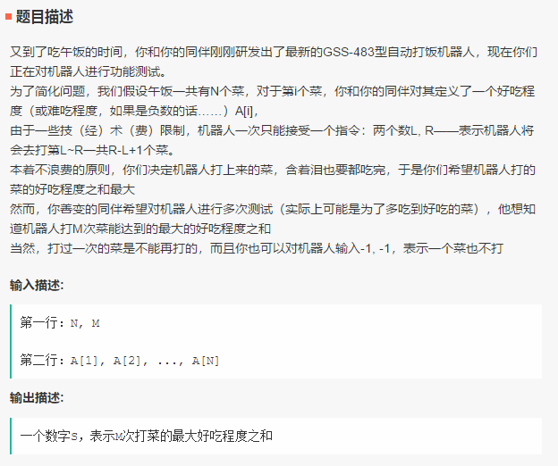
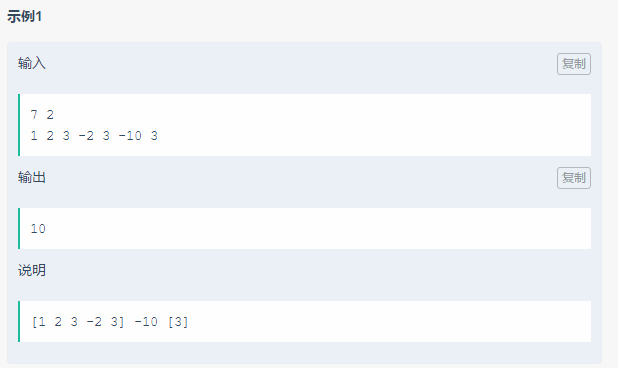

笔试-快手-180910
===
- 单选 20；编程 3


Index
---
<!-- TOC -->

- [字符串归一化](#字符串归一化)
- [魔法深渊](#魔法深渊)
- [善变的同伴](#善变的同伴)

<!-- /TOC -->


### 字符串归一化
<div align="center"></div>

**Python**（AC）
```
from collections import Counter

s = input()
c = Counter(s)

res = ""
for key in sorted(c.keys()):
    res += key
    res += str(c[key])

print(res)
```

### 魔法深渊
<div align="center"></div>
<div align="center"></div>

**Python**（AC）
```
def foo(n):
    dp = [0] * (n + 1)
    dp[0] = 1

    for i in range(1, n + 1):
        j = 1
        while j <= n:
            if i < j:
                break
            dp[i] = dp[i] + dp[i - j]
            j = j * 2
    return dp[n] % 1000000003


N = int(input())
for i in range(N):
    n = int(input())
    print(foo(n))
```

### 善变的同伴
<div align="center"></div>
<div align="center"></div>
<div align="center"></div>
