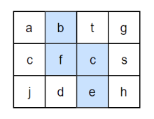
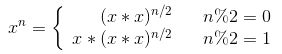
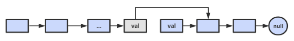
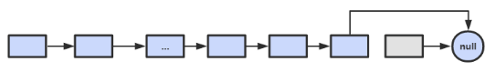

**说明**
---
- 主要编程语言为 C/C++
- 涉及**字符串**的问题可能会使用 Python
- 题目编号以原书为准，如“**面试题 3：数组中重复的数字**”
  - 因为题目不多，所以就不做分类了
- 所有代码均通过 OJ 测试
    > 在线 **OJ 地址**：[剑指Offer_编程题](https://www.nowcoder.com/ta/coding-interviews) - 牛客网 

**Reference**
---
- 《剑指 Offer（第二版）》 - 何海涛
- Interview-Notebook/[剑指 offer 题解.md](https://github.com/CyC2018/Interview-Notebook/blob/master/notes/%E5%89%91%E6%8C%87%20offer%20%E9%A2%98%E8%A7%A3.md) · CyC2018/Interview-Notebook
- 牛客网相关问题讨论区


**Index**
---
<!-- TOC -->

- [3.1 数组中重复的数字](#31-数组中重复的数字)
- [3.2 不修改数组找出重复的数字](#32-不修改数组找出重复的数字)
- [4. 二维数组中的查找](#4-二维数组中的查找)
- [5. 替换空格](#5-替换空格)
- [6. 从尾到头打印链表](#6-从尾到头打印链表)
- [7. 重建二叉树](#7-重建二叉树)
- [8. 二叉树的下一个结点](#8-二叉树的下一个结点)
- [9. 用两个栈实现队列](#9-用两个栈实现队列)
- [10.1 斐波那契数列](#101-斐波那契数列)
- [10.2 跳台阶（递归）](#102-跳台阶递归)
- [10.3 变态跳台阶（动态规划）](#103-变态跳台阶动态规划)
- [10.4 矩形覆盖（动态规划）](#104-矩形覆盖动态规划)
- [11. 旋转数组的最小数字（二分查找）](#11-旋转数组的最小数字二分查找)
- [12. 矩阵中的路径（DFS）](#12-矩阵中的路径dfs)
- [13. 机器人的运动范围（DFS） TODO](#13-机器人的运动范围dfs-todo)
- [14. 剪绳子（动态规划 | 贪心）](#14-剪绳子动态规划--贪心)
- [15. 二进制中 1 的个数（位运算）](#15-二进制中-1-的个数位运算)
- [16. 数值的整数次方（位运算）](#16-数值的整数次方位运算)
- [17. 打印从 1 到最大的 n 位数（字符串 + DFS）](#17-打印从-1-到最大的-n-位数字符串--dfs)
- [18.1 在 O(1) 时间内删除链表节点（链表）](#181-在-o1-时间内删除链表节点链表)
- [18.2 删除链表中重复的结点（链表）](#182-删除链表中重复的结点链表)
- [19. 正则表达式匹配（自动机：动态规划 | DFS）](#19-正则表达式匹配自动机动态规划--dfs)
- [20. 表示数值的字符串（自动机 | 正则）](#20-表示数值的字符串自动机--正则)
- [21. 调整数组顺序使奇数位于偶数前面（数组）](#21-调整数组顺序使奇数位于偶数前面数组)
- [22. 链表中倒数第 K 个结点（链表 + 双指针）](#22-链表中倒数第-k-个结点链表--双指针)
- [23. 链表中环的入口结点（链表 + 双指针）](#23-链表中环的入口结点链表--双指针)
- [24. 反转链表（链表）](#24-反转链表链表)
- [25. 合并两个排序的链表](#25-合并两个排序的链表)

<!-- /TOC -->


## 3.1 数组中重复的数字
> [数组中重复的数字](https://www.nowcoder.com/practice/623a5ac0ea5b4e5f95552655361ae0a8?tpId=13&tqId=11203&tPage=3&rp=3&ru=/ta/coding-interviews&qru=/ta/coding-interviews/question-ranking) - NowCoder

**题目描述**
```
在一个长度为 n 的数组里的所有数字都在 0 到 n-1 的范围内。
数组中某些数字是重复的，但不知道有几个数字是重复的，也不知道每个数字重复几次。
请找出数组中任意一个重复的数字。
```
- 要求：时间复杂度`O(N)`，空间复杂度`O(1)`
- 示例
  ```
  Input:
  {2, 3, 1, 0, 2, 5}

  Output:
  2
  ```

**思路**
- 复杂度要求表明**不能使用排序**，也不能使用 **map**/**set**
- 注意到 n 个数字的范围为 `0` 到 `n-1`，考虑类似**选择排序**的思路，通过一次遍历将每个数交换到排序后的位置，如果该位置已经存在相同的数字，那么该数就是重复的
- 示例
  ```
  position-0 : (2,3,1,0,2,5) // 2 <-> 1
               (1,3,2,0,2,5) // 1 <-> 3
               (3,1,2,0,2,5) // 3 <-> 0
               (0,1,2,3,2,5) // already in position
  position-1 : (0,1,2,3,2,5) // already in position
  position-2 : (0,1,2,3,2,5) // already in position
  position-3 : (0,1,2,3,2,5) // already in position
  position-4 : (0,1,2,3,2,5) // nums[i] == nums[nums[i]], exit
  ```
**Code**
```C++
class Solution {
public:
    bool duplicate(int numbers[], int length, int* duplication) {
        if(numbers == nullptr || length <= 0)
            return false;

        for(int i = 0; i < length; ++i) {
            while(numbers[i] != i) {
                if(numbers[i] == numbers[numbers[i]]) {
                    *duplication = numbers[i];
                    return true;
                }
                // 交换numbers[i]和numbers[numbers[i]]
                swap(numbers[i], numbers[numbers[i]]);
            }
        }
        return false;
    }
};
```


## 3.2 不修改数组找出重复的数字
> 未加入牛客网 OJ

**题目描述**
```
在一个长度为n+1的数组里的所有数字都在1到n的范围内，所以数组中至少有一个数字是重复的。
请找出数组中任意一个重复的数字，但不能修改输入的数组。
例如，如果输入长度为8的数组{2, 3, 5, 4, 3, 2, 6, 7}，那么对应的输出是重复的数字2或者3。
```
- 要求：时间复杂度`O(NlogN)`，空间复杂度`O(1)`

**思路**
- 二分查找
- 以长度为 8 的数组 `{2, 3, 5, 4, 3, 2, 6, 7}` 为例，那么所有数字都在 `1~7` 的范围内。中间的数字 `4` 将 `1~7` 分为 `1~4` 和 `5~7`。统计 `1~4` 内数字的出现次数，它们一共出现了 5 次，说明 `1~4` 内必要重复的数字；反之，若小于等于 4 次，则说明 `5~7` 内必有重复的数字。
- 因为不能使用额外的空间，所以每次统计次数都要重新遍历整个数组一次

**Code**
```C++
int countRange(const int* numbers, int length, int start, int end);

int getDuplication(const int* numbers, int length)
{
    if(numbers == nullptr || length <= 0)
        return -1;

    int start = 1;
    int end = length - 1;
    while(end >= start) {
        int middle = ((end - start) >> 1) + start;
        int count = countRange(numbers, length, start, middle);
        if(end == start) {
            if(count > 1)
                return start;
            else
                break;
        }

        if(count > (middle - start + 1))
            end = middle;
        else
            start = middle + 1;
    }
    return -1;
}

// 因为不能使用额外的空间，所以每次统计次数都要重新遍历整个数组一次
int countRange(const int* numbers, int length, int start, int end) {
    if(numbers == nullptr)
        return 0;

    int count = 0;
    for(int i = 0; i < length; i++)
        if(numbers[i] >= start && numbers[i] <= end)
            ++count;
    return count;
}
```


## 4. 二维数组中的查找
> [二维数组中的查找](https://www.nowcoder.com/practice/abc3fe2ce8e146608e868a70efebf62e?tpId=13&tqId=11154&tPage=1&rp=1&ru=/ta/coding-interviews&qru=/ta/coding-interviews/question-ranking) - NowCoder

**题目描述**
```
在一个二维数组中，每一行都按照从左到右递增的顺序排序，每一列都按照从上到下递增的顺序排序。
请完成一个函数，输入这样的一个二维数组和一个整数，判断数组中是否含有该整数。
```
- 示例
  ```html
  Consider the following matrix:
  [
    [1,   4,  7, 11, 15],
    [2,   5,  8, 12, 19],
    [3,   6,  9, 16, 22],
    [10, 13, 14, 17, 24],
    [18, 21, 23, 26, 30]
  ]

  Given target = 5, return true.
  Given target = 20, return false.
  ```

**思路**
- 从**左下角**开始查找，它左边的数都比它小，下边的数都比它大；因此可以根据 target 和当前元素的大小关系来**缩小查找区间**
- 同理，也可以从**右上角**开始查找
- 时间复杂度：`O(M + N)`

**Code**
```C++
class Solution {
public:
    bool Find(int target, vector<vector<int> > array) {
        int N = array.size();          // 行数
        int M = array[0].size();       // 列数
            
        int i = N - 1;
        int j = 0;
        while (i >= 0 && j < M) {
            if (array[i][j] > target)
                i--;
            else if (array[i][j] < target)
                j++;
            else
                return true;
        }
        return false;
    }
};
```


## 5. 替换空格
> [替换空格](https://www.nowcoder.com/practice/4060ac7e3e404ad1a894ef3e17650423?tpId=13&tqId=11155&tPage=1&rp=1&ru=%2Fta%2Fcoding-interviews&qru=%2Fta%2Fcoding-interviews%2Fquestion-ranking) - NowCoder 

**题目描述**
```
请实现一个函数，将一个字符串中的空格替换成“%20”。
例如，当字符串为 "We Are Happy". 则经过替换之后的字符串为 "We%20Are%20Happy"。
```

**思路**
- 先遍历一次，找出空格的数量，得到替换后的长度；然后从后往前替换

**Code**
```C++
class Solution {
public:
    void replaceSpace(char *str, int length) {
        if (str == nullptr || length < 0)
            return;

        int l_old = strlen(str);  // == length
        int n_space = count(str, str + l_old, ' ');  // <algorithm>
        int l_new = l_old + n_space * 2;
        str[l_new] = '\0';

        int p_old = l_old-1;
        int p_new = l_new-1;
        while (p_old >= 0) {
            if (str[p_old] != ' ') {
                str[p_new--] = str[p_old--];
            }
            else {
                p_old--;
                str[p_new--] = '0';
                str[p_new--] = '2';
                str[p_new--] = '%';
            }
        }
    }
};
```


## 6. 从尾到头打印链表
> [从尾到头打印链表](https://www.nowcoder.com/practice/d0267f7f55b3412ba93bd35cfa8e8035?tpId=13&tqId=11156&tPage=1&rp=1&ru=%2Fta%2Fcoding-interviews&qru=%2Fta%2Fcoding-interviews%2Fquestion-ranking) - NowCoder

**题目描述**
```
输入链表的第一个节点，从尾到头反过来打印出每个结点的值。
```

**思路**
- 栈
- 头插法

**Code**
```C++
class Solution {
public:
    vector<int> printListFromTailToHead(ListNode* head) {
        vector<int> ret;

        ListNode *p = head;
        while (p != NULL) {
            ret.insert(ret.begin(), p->val);   // 头插
            p = p->next;
        }

        return ret;
    }
};
```


## 7. 重建二叉树
> [重建二叉树](https://www.nowcoder.com/practice/8a19cbe657394eeaac2f6ea9b0f6fcf6?tpId=13&tqId=11157&tPage=1&rp=1&ru=%2Fta%2Fcoding-interviews&qru=%2Fta%2Fcoding-interviews%2Fquestion-ranking) - NowCoder

**题目描述**
```
根据二叉树的前序遍历和中序遍历的结果，重建出该二叉树。
假设输入的前序遍历和中序遍历的结果中都不含重复的数字。
```

**思路**
- 涉及二叉树的问题，应该条件反射般的使用**递归**（无优化要求时）
- 前序遍历的第一个值为根节点的值，使用这个值将中序遍历结果分成两部分，左部分为左子树的中序遍历结果，右部分为右子树的中序遍历的结果。

**Code 1 - 直观无优化**
```C++
struct TreeNode {
    int val;
    TreeNode *left;
    TreeNode *right;
    TreeNode(int x) : val(x), left(NULL), right(NULL) {}
};

class Solution {
public:
    TreeNode * reConstructBinaryTree(vector<int> pre, vector<int> vin) {
        if (pre.size() <= 0)
            return NULL;

        TreeNode* root = new TreeNode{ pre[0] };
        for (auto i = 0; i < vin.size(); i++) {
            if (vin[i] == pre[0]) {
                root->left = reConstructBinaryTree(vector<int>(pre.begin() + 1, pre.begin() + 1 + i), vector<int>(vin.begin(), vin.begin() + i));
                root->right = reConstructBinaryTree(vector<int>(pre.begin() + 1 + i, pre.end()), vector<int>(vin.begin() + 1 + i, vin.end()));
            }
        }
        return root;
    }
};
```

**Code 2 - 优化版**
```C++
class Solution {
public:
    TreeNode * reConstructBinaryTree(vector<int> pre, vector<int> vin) {
        return reConstructCore(pre, 0, pre.size(), vin, 0, vin.size());
    }
    
    TreeNode * reConstructCore(vector<int> &pre, int pre_beg, int pre_end, vector<int> &vin, int vin_beg, int vin_end) {
        if (pre_end - pre_beg <= 0)
            return NULL;

        TreeNode* root = new TreeNode{ pre[pre_beg] };
        for (auto i = 0; i < vin_end-vin_beg; i++) {
            if (vin[i+vin_beg] == pre[pre_beg]) {
                root->left = reConstructCore(pre, pre_beg+1, pre_beg+1+i, vin, vin_beg, vin_beg+i);
                root->right = reConstructCore(pre, pre_beg+1+i, pre_end, vin, vin_beg+1+i, vin_end);
            }
        }
        return root;
    }
};
```


## 8. 二叉树的下一个结点
> [二叉树的下一个结点](https://www.nowcoder.com/practice/9023a0c988684a53960365b889ceaf5e?tpId=13&tqId=11210&tPage=3&rp=1&ru=%2Fta%2Fcoding-interviews&qru=%2Fta%2Fcoding-interviews%2Fquestion-ranking) - NowCoder

**题目描述**
```
给定一个二叉树和其中的一个结点，请找出中序遍历顺序的下一个结点并且返回。
注意，树中的结点不仅包含左右子结点，同时包含指向父结点的指针。
```

**思路**
- 回顾中序遍历的顺序
- 如果一个节点的右子树不为空，那么下一个节点是该节点右子树的最左叶子；
- 否则（右子树为空），沿父节点向上直到找到某个节点是其父节点的左孩子，那么该父节点就是下一个节点

**Code**
```C++
struct TreeLinkNode {
    int val;
    struct TreeLinkNode *left;
    struct TreeLinkNode *right;
    struct TreeLinkNode *next;
    TreeLinkNode(int x) :val(x), left(NULL), right(NULL), next(NULL) {
    }
};

class Solution {
public:
    TreeLinkNode * GetNext(TreeLinkNode* pNode) {
        if (pNode == nullptr)
            return nullptr;
        
        if(pNode->right != nullptr) {
            auto p = pNode->right;
            while(p->left != nullptr)
                p = p->left;
            return p;
        }
        else {
            auto p = pNode;               // 当前节点
            while(p->next != nullptr) {   // 当前节点的父节点不为空
                if (p->next->left == p)   // 当前节点是其父节点的左海子
                    return p->next;       // 那么下一个节点就是当前节点的父节点
                p = p->next;
            }
        }
        return nullptr;  // 当前节点是根节点且没有右孩子，即没有下一个节点
    }
};
```

## 9. 用两个栈实现队列
> [用两个栈实现队列](https://www.nowcoder.com/practice/54275ddae22f475981afa2244dd448c6?tpId=13&tqId=11158&tPage=1&rp=3&ru=%2Fta%2Fcoding-interviews&qru=%2Fta%2Fcoding-interviews%2Fquestion-ranking) - NowCoder

**题目描述**
```
用两个栈来实现一个队列，完成队列的 Push 和 Pop 操作。
```

**思路**
- 假设 `stack_in` 用于处理入栈操作，`stack_out`用于处理出栈操作
- `stack_in` 按栈的方式正常处理入栈数据；
- 关键在于出栈操作
  - 当`stack_out`为空时，需要先将每个`stack_in`中的数据出栈后压入`stack_out`
  - 反之，每次弹出`stack_out`栈顶元素即可

**Code**
```C++
class Solution
{
public:
    void push(int node) {
        stack_in.push(node);
    }

    int pop() {
        if(stack_out.size() <= 0) {
            while (stack_in.size() > 0) {
                auto tmp = stack_in.top();
                stack_in.pop();
                stack_out.push(tmp);
            }
        }
        
        auto ret = stack_out.top();
        stack_out.pop();
        return ret;
    }

private:
    stack<int> stack_in;
    stack<int> stack_out;
};
```


## 10.1 斐波那契数列
> [斐波那契数列](https://www.nowcoder.com/practice/c6c7742f5ba7442aada113136ddea0c3?tpId=13&tqId=11160&tPage=1&rp=3&ru=%2Fta%2Fcoding-interviews&qru=%2Fta%2Fcoding-interviews%2Fquestion-ranking) - NowCoder

**题目描述**
```
写一个函数，输入n，求斐波那契（Fibonacci）数列的第n项。
数列的前两项为 0 和 1
```

**思路**
- 递归
  - 递归可能会重复计算子问题——例如，计算 f(10) 需要计算 f(9) 和 f(8)，计算 f(9) 需要计算 f(8) 和 f(7)，可以看到 f(8) 被重复计算了
  - 可以利用额外空间将计算过的子问题存起来
- 查表
  - 因为只需要前 40 项，所以可以先将值都求出来

**Code - 递归**
```C++
// 该代码会因复杂度过大无法通过评测
class Solution {
public:
    int Fibonacci(int n) {
        if(n <= 0)
            return 0;
        if(n == 1)
            return 1;
        return Fibonacci(n - 1) + Fibonacci(n - 2);
    }
};
```

**Code - 循环**
```C++
class Solution {
public:
    int Fibonacci(int n) {
        int f = 0;
        int g = 1;
        while (n--) {
            g = g + f;
            f = g - f;
        }
        return f;
    }
};
```

**Code - 查表**
```C++
class Solution {
public:
    Solution(){
        fib = new int[40];
        fib[0] = 0;
        fib[1] = 1;
        for (int i = 2; i < 40; i++)
            fib[i] = fib[i - 1] + fib[i - 2];
    }
    int Fibonacci(int n) {
        return fib[n];
    }

private:
    int* fib;
};
```


## 10.2 跳台阶（递归）
> [跳台阶](https://www.nowcoder.com/practice/8c82a5b80378478f9484d87d1c5f12a4?tpId=13&tqId=11161&tPage=1&rp=3&ru=%2Fta%2Fcoding-interviews&qru=%2Fta%2Fcoding-interviews%2Fquestion-ranking) | [变态跳台阶](https://www.nowcoder.com/practice/22243d016f6b47f2a6928b4313c85387?tpId=13&tqId=11162&tPage=1&rp=3&ru=%2Fta%2Fcoding-interviews&qru=%2Fta%2Fcoding-interviews%2Fquestion-ranking) - NowCoder

**题目描述**
```
一只青蛙一次可以跳上1级台阶，也可以跳上2级。
求该青蛙跳上一个n级的台阶总共有多少种跳法（先后次序不同算不同的结果）。
```

**思路**
- 递归
- 记跳 n 级台阶有 `f(n)` 种方法
  - 如果第一次跳 1 级，那么之后的 n-1 级有 `f(n-1)` 种跳法
  - 如果第一次跳 2 级，那么之后的 n-2 级有 `f(n-2)` 种跳法
- 实际上就是首两项为 1 和 2 的斐波那契数列

**Code**
```C++
class Solution {
public:
    int jumpFloor(int number) {
        int f = 1;
        int g = 2;
        
        number--;
        while (number--) {
            g = g + f;
            f = g - f;
        }
        return f;
    }
};
```

## 10.3 变态跳台阶（动态规划）
> [变态跳台阶](https://www.nowcoder.com/practice/22243d016f6b47f2a6928b4313c85387?tpId=13&tqId=11162&tPage=1&rp=3&ru=%2Fta%2Fcoding-interviews&qru=%2Fta%2Fcoding-interviews%2Fquestion-ranking) - NowCoder

**题目描述**
```
一只青蛙一次可以跳上1级台阶，也可以跳上2级……它也可以跳上n级。
求该青蛙跳上一个n级的台阶总共有多少种跳法。
```

**思路**
- 动态规划
- 递推公式 
  ```
  f(1) = 1
  f(n) = 1 + f(1) + .. + f(n-1)
  ```

**Code - DP**
```C++
class Solution {
public:
    int jumpFloorII(int number) {
        vector<int> dp(number+1, 1);
        for (int i=2; i<=number; i++)
            for(int j=1; j<i; j++)
                dp[i] += dp[j];
        
        return dp[number];
    }
};
```

**Code - 空间优化**
```C++
class Solution {
public:
    int jumpFloorII(int number) {
        int f = 1;
        int sum = 1 + f;
        for (int i = 2; i <= number; i++) {
            f = sum;
            sum += f;
        }
        return f;
    }
};
```

## 10.4 矩形覆盖（动态规划）
> [矩形覆盖](https://www.nowcoder.com/practice/72a5a919508a4251859fb2cfb987a0e6?tpId=13&tqId=11163&tPage=1&rp=3&ru=%2Fta%2Fcoding-interviews&qru=%2Fta%2Fcoding-interviews%2Fquestion-ranking) - NowCoder

**题目描述**
```
我们可以用2*1的小矩形横着或者竖着去覆盖更大的矩形。
请问用n个2*1的小矩形无重叠地覆盖一个2*n的大矩形，总共有多少种方法？
```

**思路**
- 动态规划
- 递推公式
  ```
  f(1) = 1
  f(2) = 2
  f(n) = f(n-1) + f(n-2)
  ```
- 即前两项为 1 和 2 的斐波那契数列

**Code**
```C++
class Solution {
public:
    int rectCover(int number) {
        if (number == 0)
            return 0;

        int f = 1;
        int g = 2;
        for (int i = 2; i <= number; i++) {
            g = g + f;
            f = g - f;
        }
        return f;
    }
};
```

## 11. 旋转数组的最小数字（二分查找）
> [旋转数组的最小数字](https://www.nowcoder.com/practice/9f3231a991af4f55b95579b44b7a01ba?tpId=13&tqId=11159&tPage=1&rp=3&ru=%2Fta%2Fcoding-interviews&qru=%2Fta%2Fcoding-interviews%2Fquestion-ranking) - NowCoder

**题目描述**
```
把一个数组最开始的若干个元素搬到数组的末尾，我们称之为数组的旋转。
输入一个非递减排序的数组的一个旋转，输出旋转数组的最小元素。

例如数组 {3, 4, 5, 1, 2} 为 {1, 2, 3, 4, 5} 的一个旋转，该数组的最小值为 1。
NOTE：给出的所有元素都大于 0，若数组大小为 0，请返回 0。
```

**思路**
- 二分查找
- 二分查找需要有一个目标值 target，这里的 target 可以选 `nums[hi]` 或 `nums[lo]`，这里使用过的是 `nums[hi]`
- 注意有重复的情况，特别是 `{3, 4, 5, 1, 2, 3}`，这里有一个简单的处理方法，具体看代码

**Code**
```C++
class Solution {
public:
    int minNumberInRotateArray(vector<int> rotateArray) {
        if (rotateArray.empty())
            return 0;

        int lo = 0;
        int hi = rotateArray.size() - 1;

        // 完全旋转，或者说没有旋转（不需要）
        //if (rotateArray[lo] < rotateArray[hi])
        //   return rotateArray[lo];

        while (lo + 1 < hi) {
            int mid = lo + (hi - lo) / 2;

            if (rotateArray[mid] > rotateArray[hi])
                lo = mid;
            else if (rotateArray[mid] < rotateArray[hi])
                hi = mid;
            else
                hi--;         // 防止这种情况 {3,4,5,1,2,3}
        }
        
        return rotateArray[hi];
    }
};
```

## 12. 矩阵中的路径（DFS）
> [矩阵中的路径](https://www.nowcoder.com/practice/c61c6999eecb4b8f88a98f66b273a3cc?tpId=13&tqId=11218&tPage=4&rp=3&ru=%2Fta%2Fcoding-interviews&qru=%2Fta%2Fcoding-interviews%2Fquestion-ranking) - NowCoder

**题目描述**
```
请设计一个函数，用来判断在一个矩阵中是否存在一条包含某字符串所有字符的路径。路径可以从矩阵中的任意一个格子开始，每一步可以在矩阵中向左，向右，向上，向下移动一个格子。如果一条路径经过了矩阵中的某一个格子，则该路径不能再进入该格子。
```
- 例如下面的矩阵包含了一条 bfce 路径。
  <div align="center"></div>

**思路**
- 深度优先搜索（DFS）
- 注意**边界判断**

**Code**
```C++
class Solution {
public:
    bool hasPath(char* matrix, int rows, int cols, char* str) {
        bool *visited = new bool[rows * cols]{false};
        for (int i=0; i<rows; i++) {
            for (int j=0; j<cols; j++) {
                if (dfs(matrix, rows, cols, str, visited, i, j, 0))
                    return true;
            }
        }
        return false;
    }

    bool dfs(char* matrix, int rows, int cols, char* str, bool* visited, int i, int j, int step) { // l 为当前已找到的长度
        // 结果存在
        if(step == strlen(str))
            return true;
        // 边界条件
        if(i<0 || i>=rows || j<0 || j>cols || matrix[i*cols+j]!=str[step] || visited[i*cols+j])
            return false;

        // 定义 4 个方向；
        int next[][2] = {{1, 0}, {-1, 0}, {0, 1}, {0, -1}};  
        // 最好的做法是作为成员变量，但是 C++ 成员变量的初始化比较麻烦，
        // 而且这还是个二维数组，更麻烦，所以每次都重新定义一次，所幸不大

        visited[i*cols+j] = true;   // 访问标记
        for (auto k : next)
            if (dfs(matrix, rows, cols, str, visited, i+k[0], j+k[1], step+1))
                return true;
        visited[i*cols+j] = false;  // 清除访问标记
        return false;
    }
};
```


## 13. 机器人的运动范围（DFS） TODO
> [机器人的运动范围](https://www.nowcoder.com/practice/6e5207314b5241fb83f2329e89fdecc8?tpId=13&tqId=11219&tPage=4&rp=3&ru=%2Fta%2Fcoding-interviews&qru=%2Fta%2Fcoding-interviews%2Fquestion-ranking) - NowCoder

**题目描述**
```
地上有一个 m 行和 n 列的方格。
一个机器人从坐标 (0, 0) 的格子开始移动，每一次只能向左右上下四个方向移动一格，
但是不能进入行坐标和列坐标的数位之和大于 k 的格子。

例如，当 k 为 18 时，机器人能够进入方格（35, 37），因为 3+5+3+7=18。
但是，它不能进入方格（35, 38），因为 3+5+3+8=19。请问该机器人能够达到多少个格子？
```

**思路**
- 深度优先搜索（DFS）
- 注意边界条件判断

**Code**


## 14. 剪绳子（动态规划 | 贪心）
> [整数拆分](https://leetcode-cn.com/problems/integer-break/description/) - LeetCode

**题目描述**
```
把一根长度为 n 的绳子剪成 m 段，并且使得每段的长度的乘积最大（n, m 均为整数）。
```

**思路**
- 动态规划
  - 递推公式
    ```
    f(n) = 0                     n = 1
    f(n) = 1                     n = 2
    f(n) = 2                     n = 3    
    f(n) = max{dp(i) * dp(n-i)}  n > 3, 1<=i<=n-1
    ```
  - 注意：当 `n <= 3` 时因为必须剪至少一次的缘故，导致 `f(1)=0, f(2)=1*1=1, f(3)=1*2=2`；但是当 `n>=4` 时，将`n<=3`的部分单独作为一段能提供更大的乘积

    因此，初始化时应该 `dp[1]=1≠f(1), dp[2]=2≠f(2), dp[3]=3≠f(3)`，同时将 `f(1), f(2), f(3)` 单独返回，具体看代码
  - 时间复杂度：`O(N^2)`，空间复杂度：`O(N)`
- 贪心
  - 当 `n>=5` 时，尽可能多剪长度为 3 的绳子；当 `n=4` 时，剪成两段长度为 2 的绳子
  - 证明
    ```
    当 n >= 5 时，可以证明： 3(n-3) > 2(n-2) > n
    当 n == 4 时，2*2 > 3*1
    ```
  - 时间复杂度：`O(1)`，空间复杂度：`O(1)`

**Code - 动态规划**
```C++
class Solution {
public:
    int integerBreak(int n) {
        if(n < 2) return 0;
        if(n == 2) return 1;
        if(n == 3) return 2;

        int dp[n+1]{0};     // 记得初始化为 0
        dp[1] = 1;
        dp[2] = 2;
        dp[3] = 3;
        for (int i=4; i<=n; i++) {
            for (int j=1; j<=i/2; j++) {
                int p = dp[j] * dp[i-j];
                if (dp[i] < p)
                    dp[i] = p;
            }
        }
        return dp[n];
    }
    
};
```

**Code - 贪心**
```C++
class Solution {
public:
    int integerBreak(int n) {
        if(n < 2) return 0;
        if(n == 2) return 1;
        if(n == 3) return 2;
        
        int n3 = n / 3;       // 切成 3 的数量
        
        if (n%3 == 1)         // 如果余下的长度为 4
            n3--;
        
        int n2 = (n - 3*n3) / 2;  // 切成 2 的数量
        return (int)pow(3, n3) * (int)pow(2, n2);
    }
};
```


## 15. 二进制中 1 的个数（位运算）
> [二进制中1的个数](https://www.nowcoder.com/practice/8ee967e43c2c4ec193b040ea7fbb10b8?tpId=13&tqId=11164&tPage=1&rp=3&ru=%2Fta%2Fcoding-interviews&qru=%2Fta%2Fcoding-interviews%2Fquestion-ranking) - NowCoder

**题目描述**
```
输入一个整数，输出该数二进制表示中1的个数。
其中负数用补码表示。
```

**思路**
- 位运算 - 移位计数
  - 时间复杂度：`O(N)`，N 为整型的二进制长度
  - 注意移位判断有两种方式：一是移动 n，一是移动"1"，后者更好
  - 当 n 为 负数时，移动 n 可能导致死循环
- 位运算 - 利用 `n&(n-1)`
  - 该运算的效果是每次除去 n 的二进制表示中**最后一个 1**
    ```
    n       : 10110100
    n-1     : 10110011
    n&(n-1) : 10110000
    ```
  - 时间复杂度：`O(M)`，M 为二进制中 1 的个数

**Code - 移位计数**
```C++
class Solution {
public:
     int NumberOf1(int n) {
         int ret = 0;
         int N = sizeof(int) * 8;
         while(N--) {
             if(n & 1)
                 ret++;
             n >>= 1;
         }
         return ret;
     }
};
```

**Code - 移位计数（改进）**
```C++
class Solution {
public:
     int NumberOf1(int n) {
         int ret = 0;
         int N = sizeof(int) * 8;
         int flag = 1;
         while(N--) {
             if(n & flag)
                 ret++;
             flag <<= 1;    // 移动 1 而不是 n
         }
         return ret;
     }
};
```

**Code - `n&(n-1)`**
```C++
class Solution {
public:
     int NumberOf1(int n) {
         int ret = 0;
         while(n) {
             ret++;
             n = (n-1)&n;
         }
         return ret;
     }
};
```


## 16. 数值的整数次方（位运算）
> [数值的整数次方](https://www.nowcoder.com/practice/1a834e5e3e1a4b7ba251417554e07c00?tpId=13&tqId=11165&tPage=1&rp=3&ru=%2Fta%2Fcoding-interviews&qru=%2Fta%2Fcoding-interviews%2Fquestion-ranking) - NowCoder 

**题目描述**
```
给定一个double类型的浮点数base和int类型的整数exponent。求base的exponent次方。
```

**思路**
- 位运算 - 快速幂
  <div align="center"></div>

- 示例
  ```
  求 `3^20 = 9^10 = 81^5 (= 81*81^4) = 81*6561^2 = 81*43046721`
  循环次数 = `bin(20)`的位数 = `len(10100)` = 5
  ```
- 时间复杂度 `O(logN)`

**Code**
```C++
class Solution {
public:
    double Power(double base, int exponent) {
        int p = abs(exponent);
        double ret = 1.0;
        while (p != 0) {
            if (p & 1)        // 如果是奇数
                ret *= base;
            base *= base;
            p >>= 1;
        }

        return exponent < 0 ? 1 / ret : ret;
    }
};
```


## 17. 打印从 1 到最大的 n 位数（字符串 + DFS）

**题目描述**
```
输入数字 n，按顺序打印出从 1 到最大的 n 位十进制数。
比如输入 3，则打印出 1、2、3 一直到最大的 3 位数即 999。
```

**思路**
- 由于 n 可能会非常大，因此不能直接用 `int` 表示数字，包括 `long`, `long long`
- 正确的做法是用 `char` 数组进行存储。
- 由于使用 `char` 存储数字，那么就不适合使用普通的运算操作了，此时可以使用 DFS 来获取所有的数字

**Code**
```C++
void printOneToMax(int n) {
    if (n <= 0) return;

    char* number = new char[n + 1];
    number[n] = '\0';

    dfs(number, n, 0);    // DFS

    delete[] number;
}

void dfs(char* number, int length, int index) {
    if (index == length) {    // 递归最重要的就是结束条件要正确
        PrintNumber(number);
        return;
    }

    for (int i = 0; i < 10; ++i) {
        number[index] = i + '0';
        dfs(number, length, index + 1);
    }
}

// 打印出这个数字，忽略开头的 0
void PrintNumber(char* number) {
    bool isBeginning0 = true;
    int nLength = strlen(number);

    for (int i = 0; i < nLength; ++i) {
        if (isBeginning0 && number[i] != '0')
            isBeginning0 = false;

        if (!isBeginning0) {
            printf("%c", number[i]);
        }
    }
    printf("\t");
}
```


## 18.1 在 O(1) 时间内删除链表节点（链表）

**题目描述**
```
给定单向链表的头指针和需要删除的指针，定义一个函数在 O(1) 时间内删除该节点
前提：该节点在链表中
```

**思路**
- 因为不能遍历，所以只能通过修改节点的值来实现这个操作
- 简单来说，就是将该节点的值修改为其下一个节点的值，**实际上删除的是该节点的下一个节点**（题目的描述可能会带来误导）
- 如果该节点不是尾节点，那么按上述操作即可——时间的复杂度为 `O(1)`
  <div align="center"></div>

- 如果该节点是尾节点，此时必须通过遍历来找到该节点的前一个节点，才能完成删除——时间复杂度为 `O(N)`
  <div align="center"></div>

- 如果是 C++，一定要注意 **delete 指针指向的内存后，必须将指针重新指向 nullptr**
  ```C++
  delete p;
  p = nullptr;
  ```
- 总的时间复杂度：`[(n-1)O(1) + O(n)] / n = O(1)`

**Code**
```C++
void DeleteNode(ListNode** pListHead, ListNode* pToBeDeleted) {
    if(!pListHead || !pToBeDeleted)
        return;

    if(pToBeDeleted->next != nullptr) {    // 要删除的结点不是尾结点
        ListNode* p = pToBeDeleted->next;
        pToBeDeleted->val = p->val;
        pToBeDeleted->next = p->next;
 
        delete p;       // delete 指针指向的内存后，必须将指针重新指向 nullptr
        p = nullptr;    
    }
    else if(*pListHead == pToBeDeleted) {     // 链表只有一个结点，删除头结点
        delete pToBeDeleted;
        pToBeDeleted = nullptr;   
        *pListHead = nullptr;
    }
    else {                                    // 链表中有多个结点，删除尾结点
        ListNode* p = *pListHead;
        while(p->next != pToBeDeleted)
            p = p->next;            
 
        p->next = nullptr;
        delete pToBeDeleted;
        pToBeDeleted = nullptr;
    }
}
```


## 18.2 删除链表中重复的结点（链表）
> [删除链表中重复的结点](https://www.nowcoder.com/practice/fc533c45b73a41b0b44ccba763f866ef?tpId=13&tqId=11209&tPage=3&rp=3&ru=%2Fta%2Fcoding-interviews&qru=%2Fta%2Fcoding-interviews%2Fquestion-ranking) - NowCoder

**题目描述**
```
在一个排序的链表中，存在重复的结点，请删除该链表中重复的结点；
重复的结点不保留，返回链表头指针。 
例如，链表1->2->3->3->4->4->5 处理后为 1->2->5
```

**思路**
- 注意重复的节点不保留，所以要特别注意头结点也重复的情况——最好的做法是新设一个头结点
- delete 指针指向的内存后，必须将指针重新指向 nullptr

**Code**
```C++
class Solution {
public:
    ListNode * deleteDuplication(ListNode* pHead)
    {   
        if (pHead == NULL) return pHead;

        ListNode* head = new ListNode{-1};  // 设置一个头结点
        head->next = pHead;

        ListNode* pre = head;
        ListNode* cur = pHead;
        while (cur != NULL && cur->next != NULL) {
            if (cur->val != cur->next->val) { // 不重复时向后遍历
                pre = cur;
                cur = cur->next;
            }
            else {                            // 发现重复
                int val = cur->val;
                while (cur != NULL && cur->val == val) {  // 循环删除重复
                    auto tmp = cur;
                    cur = cur->next;
                    
                    delete tmp;     // delete + nullptr
                    tmp = nullptr;
                }
                pre->next = cur;
            }
        }
        
        auto ret = head->next;
        
        delete head;               // delete + nullptr
        head = nullptr;
        
        return ret;
    }
};
```


## 19. 正则表达式匹配（自动机：动态规划 | DFS）
> [正则表达式匹配](https://www.nowcoder.com/practice/45327ae22b7b413ea21df13ee7d6429c?tpId=13&tqId=11205&tPage=3&rp=3&ru=%2Fta%2Fcoding-interviews&qru=%2Fta%2Fcoding-interviews%2Fquestion-ranking) - NowCoder

**题目描述**
```
请实现一个函数用来匹配包括'.'和'*'的正则表达式。
模式中的字符'.'表示任意一个字符，而'*'表示它前面的字符可以出现任意次（包含0次）。 
在本题中，匹配是指字符串的所有字符匹配整个模式。
例如，字符串"aaa"与模式"a.a"和"ab*ac*a"匹配，但是与"aa.a"和"ab*a"均不匹配
```

**思路**
- '.' 用于当做一个任意字符，'*' 用于重复前面的字符，注意两者区别
- 下面提供 `dfs(C++)` 和 `dp(Java)` 两种做法

**Code - dfs**
```C++
class Solution {
public:
    bool match(char* str, char* pattern) {
        if(str==NULL||pattern==NULL)
            return false;
        return dfs(str,pattern);
    }
    
    bool dfs(char* str, char* pattern) {
        if(*str=='\0'&&*pattern=='\0')
            return true;
        if(*str!='\0'&&*pattern=='\0')
            return false;
        if(*(pattern+1)=='*') {
            if(*pattern==*str||(*pattern=='.'&&*str!='\0'))
                /*
                dfs(str,pattern+2): 模式串不匹配
                dfs(str+1,pattern): 模式串已经匹配成功，尝试匹配下一个字符串
                dfs(str+1,pat+2)：  模式串已经成功匹配，并且不匹配下一个字符串内容  */
                return dfs(str+1,pattern)||dfs(str,pattern+2);
            else
                return dfs(str,pattern+2);
        }
        if(*str==*pattern||(*pattern=='.'&&*str!='\0'))
            return dfs(str+1,pattern+1);
        return false;
    }
};
```

**Code - dp**
```Java
public boolean match(char[] str, char[] pattern) {
    int m = str.length, n = pattern.length;
    boolean[][] dp = new boolean[m + 1][n + 1];

    dp[0][0] = true;
    for (int i = 1; i <= n; i++)
        if (pattern[i - 1] == '*')
            dp[0][i] = dp[0][i - 2];

    for (int i = 1; i <= m; i++)
        for (int j = 1; j <= n; j++)
            if (str[i - 1] == pattern[j - 1] || pattern[j - 1] == '.')
                dp[i][j] = dp[i - 1][j - 1];
            else if (pattern[j - 1] == '*')
                if (pattern[j - 2] == str[i - 1] || pattern[j - 2] == '.') {
                    dp[i][j] |= dp[i][j - 1]; // a* counts as single a
                    dp[i][j] |= dp[i - 1][j]; // a* counts as multiple a
                    dp[i][j] |= dp[i][j - 2]; // a* counts as empty
                } else
                    dp[i][j] = dp[i][j - 2];   // a* only counts as empty

    return dp[m][n];
}
```


## 20. 表示数值的字符串（自动机 | 正则）
> [表示数值的字符串](https://www.nowcoder.com/practice/6f8c901d091949a5837e24bb82a731f2?tpId=13&tqId=11206&tPage=3&rp=3&ru=%2Fta%2Fcoding-interviews&qru=%2Fta%2Fcoding-interviews%2Fquestion-ranking) - NowCoder

**题目描述**
```
请实现一个函数用来判断字符串是否表示数值（包括整数和小数）。
例如，字符串"+100","5e2","-123","3.1416"和"-1E-16"都表示数值。 
但是"12e","1a3.14","1.2.3","+-5"和"12e+4.3"都不是。
```

**思路**
- if 判断 - 自动机
- 正则表达式

**Code - 自动机**
```C++
class Solution {
public:
    // 数字的格式可以用A[.[B]][e|EC]或者.B[e|EC]表示，其中A和C都是
    // 整数（可以有正负号，也可以没有），而B是一个无符号整数
    bool isNumeric(const char* str) {
        if(str == nullptr)
            return false;

        bool numeric = scanInteger(&str);

        // 如果出现'.'，接下来是数字的小数部分
        if(*str == '.') {
            ++str;

            // 下面一行代码用||的原因：
            // 1. 小数可以没有整数部分，例如.123等于0.123；
            // 2. 小数点后面可以没有数字，例如233.等于233.0；
            // 3. 当然小数点前面和后面可以有数字，例如233.666
            numeric = scanUnsignedInteger(&str) || numeric;
        }

        // 如果出现'e'或者'E'，接下来跟着的是数字的指数部分
        if(*str == 'e' || *str == 'E') {
            ++str;
            // 下面一行代码用&&的原因：
            // 1. 当e或E前面没有数字时，整个字符串不能表示数字，例如.e1、e1；
            // 2. 当e或E后面没有整数时，整个字符串不能表示数字，例如12e、12e+5.4
            numeric = numeric && scanInteger(&str);
        }

        return numeric && *str == '\0';
    }

    bool scanUnsignedInteger(const char** str) {
        const char* before = *str;
        while(**str != '\0' && **str >= '0' && **str <= '9')
            ++(*str);

        // 当str中存在若干0-9的数字时，返回true
        return *str > before;
    }

    // 整数的格式可以用[+|-]B表示, 其中B为无符号整数
    bool scanInteger(const char** str) {
        if(**str == '+' || **str == '-')
            ++(*str);
        return scanUnsignedInteger(str);
    }
};
```

**Code - 正则（Python）**
```Python
import re
class Solution:
    # s字符串
    def isNumeric(self, s):
        # Python 中完全匹配需要以 ^ 开头，以 $ 结尾
        # r"" 表示不转义
        # if re.match("^[+-]?\\d*(\\.\\d+)?([eE][+-]?\\d+)?$", s):
        if re.match(r"^[+-]?\d*(\.\d+)?([eE][+-]?\d+)?$", s):
            return True
        else:
            return False
```

**Code - 正则（C++）**
```C++
#include <regex>

class Solution {
public:
    bool isNumeric(char* string) {
        regex reg("[+-]?\\d*(\\.\\d+)?([eE][+-]?\\d+)?");
        return regex_match(string, reg);
    }
};
```

**Code - 正则（Java）**
```Java
public class Solution {
    public boolean isNumeric(char[] str) {
        if (str == null)
            return false;
        return new String(str).matches("[+-]?\\d*(\\.\\d+)?([eE][+-]?\\d+)?");
    }
}
```


## 21. 调整数组顺序使奇数位于偶数前面（数组）
> [调整数组顺序使奇数位于偶数前面](https://www.nowcoder.com/practice/beb5aa231adc45b2a5dcc5b62c93f593?tpId=13&tqId=11166&tPage=1&rp=3&ru=%2Fta%2Fcoding-interviews&qru=%2Fta%2Fcoding-interviews%2Fquestion-ranking) - NowCoder

**题目描述**
```
输入一个整数数组，实现一个函数来调整该数组中数字的顺序，
使得所有的奇数位于数组的前半部分，所有的偶数位于数组的后半部分，
并保证奇数和奇数，偶数和偶数之间的相对位置不变。
```
- 要求：空间复杂度 `O(1)`
- 本题与原书不同，这里要求相对顺序不变，原书的侧重点在于函数指针

**思路**
- 如果可以使用额外空间，那么问题就很简单，具体看代码
- 如果不想使用额外空间，那么~~只能通过循环移位来达到避免覆盖的目的~~，时间复杂度 `O(N^2)`
  - 可以利用“冒泡排序”的思想避免循环位移，具体看代码

**Code - 使用额外空间**
```C++
class Solution {
public:
    void reOrderArray(vector<int> &array) {
        vector<int> odd;  // 存奇数
        vector<int> eve;  // 存偶数
        for (auto i : array) {
            if (i & 1)            // 是奇数
                odd.push_back(i);
            else
                eve.push_back(i);
        }

        array.swap(odd);
        array.insert(array.end(), eve.begin(), eve.end());
    }
};
```

**Code - 不使用额外空间**
> 讨论区第二个回答
```C++
class Solution {
public:
    void reOrderArray(vector<int> &array) {

        for(int i = 0; i < array.size() / 2; i++)
            for(int j = 0; j < array.size()-i; j++)
                if((array[j]%2 == 0) && (array[j+1]%2 == 1))
                    swap(array[j] ,array[j+1]);
    }
};
```


## 22. 链表中倒数第 K 个结点（链表 + 双指针）
> [链表中倒数第k个结点](https://www.nowcoder.com/practice/529d3ae5a407492994ad2a246518148a?tpId=13&tqId=11167&tPage=1&rp=3&ru=%2Fta%2Fcoding-interviews&qru=%2Fta%2Fcoding-interviews%2Fquestion-ranking) - NowCoder

**题目描述**
```
输入一个链表，输出该链表中倒数第k个结点。
```

**思路**
- 设置快慢指针快指针先走 `k-1` 步，然后慢指针开始走，当快指针到达链表尾时，慢指针即指向倒数第 `k` 个节点
- 健壮性检验：
  - 输入是一个空链表
  - 链表长度小于 k

**Code**
```C++
class Solution {
public:
    ListNode * FindKthToTail(ListNode* pListHead, unsigned int k) {
        if(pListHead == nullptr)
            return nullptr;

        ListNode * slow = pListHead;
        ListNode * fast = pListHead;

        //先让 fast 走 k-1 步
        while (k && fast) {
            fast = fast->next;
            k--;
        }

        // 如果 k > 0，说明 k 大于链表长度
        if (k > 0)
            return nullptr;

        // 接着让两个指针一起往后走，当 fast 到最后时，slow 即指向倒数第 k 个
        while (fast) {
            fast = fast->next;
            slow = slow->next;
        }
        
        return slow;
    }
};
```


## 23. 链表中环的入口结点（链表 + 双指针）
> [链表中环的入口结点](https://www.nowcoder.com/practice/253d2c59ec3e4bc68da16833f79a38e4?tpId=13&tqId=11208&tPage=3&rp=3&ru=%2Fta%2Fcoding-interviews&qru=%2Fta%2Fcoding-interviews%2Fquestion-ranking) - NowCoder

**题目描述**
```
给一个链表，若其中包含环，请找出该链表的环的入口结点，否则，输出null。
```
- 要求：不使用额外空间

**思路**
- 快慢双指针
- 快指针 fast 每次移动 2 步，慢指针 slow 每次 1 步；因为存在环，fast 和 slow 总会相遇，此时 fast 刚好比 slow 多走一圈（？）
  <div align="center"></div>

- 如图，假设他们相遇在 z1 点，此时将 fast/slow 之一重新指向头结点，继续每次一步移动，它们再次相遇的点就是入口

**Code**
```C++
class Solution {
public:
    ListNode * EntryNodeOfLoop(ListNode* pHead) {
        if (pHead == NULL) return nullptr;

        ListNode* slow = pHead;
        ListNode* fast = pHead;
        while (fast != NULL && fast->next != NULL) {
            slow = slow->next;
            fast = fast->next->next;
            if (slow == fast) {        // 找到环中相遇点
                slow = pHead;          // 将 fast/slow 中的任一个重新指向头指针
                while (slow != fast) { // 直到他们再次相遇，相遇的这个点就是入口
                    slow = slow->next;
                    fast = fast->next;
                }
                return slow;
            }
        }
        return nullptr;
    }
};
```


## 24. 反转链表（链表）
> [反转链表](https://www.nowcoder.com/practice/75e878df47f24fdc9dc3e400ec6058ca?tpId=13&tqId=11168&tPage=1&rp=3&ru=%2Fta%2Fcoding-interviews&qru=%2Fta%2Fcoding-interviews%2Fquestion-ranking) - NowCoder

**题目描述**
```
输入一个链表，反转链表后，输出新链表的表头。
```
- 要求：不使用额外空间

**思路**
- 可以辅助图示思考，具体看代码

**Code - 迭代**
```C++
class Solution {
public:
    ListNode * ReverseList(ListNode* pHead) {
        if (pHead == NULL)
            return NULL;

        ListNode* cur = pHead;
        ListNode* pre = NULL;
        ListNode* nxt = cur->next;
        cur->next = NULL;         // 断开当前节点及下一个节点
        while (nxt) {
            pre = cur;
            cur = nxt;
            nxt = nxt->next;
            cur->next = pre;
        }
        return cur;
    }
};
```

**Code - 递归**
```C++
class Solution {
public:
    ListNode * ReverseList(ListNode* pHead) {
        if (pHead == nullptr || pHead->next == nullptr)
            return pHead;
        
        auto nxt = pHead->next;
        pHead->next = nullptr;      // 断开当前节点及下一个节点
        auto newHead = ReverseList(nxt);
        nxt->next = pHead;
        return newHead;
    }
};
```


## 25. 合并两个排序的链表
> [合并两个排序的链表](https://www.nowcoder.com/practice/d8b6b4358f774294a89de2a6ac4d9337?tpId=13&tqId=11169&tPage=1&rp=3&ru=%2Fta%2Fcoding-interviews&qru=%2Fta%2Fcoding-interviews%2Fquestion-ranking) - NowCoder

**题目描述**
```

```

**思路**


**Code**
```C++
```