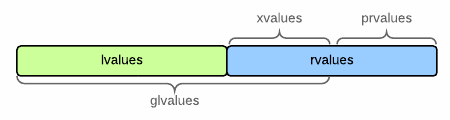

C++中的左值与右值
===

说明
---
- 这一部分内容只是帮助理解 C++(11) 中左值与右值的概念。
- 在编程实践中，因为**编译器优化**的存在，特别是其中的**返回值优化**（Return Value Optimization, RVO）使你不需要额外关注左值与右值的区别，像 C++(03) 一样编程即可。
  > [C++11 rvalues and move semantics confusion (return statement)](https://stackoverflow.com/questions/4986673/c11-rvalues-and-move-semantics-confusion-return-statement) - Stack Overflow 
- 除非你在进行库的开发，特别是涉及模板元编程等内容时，需要你手动编写**移动构造函数**（move constructor）。

Index
---
<!-- TOC -->

- [小结](#小结)
  - [左值引用类型 与 右值引用类型](#左值引用类型-与-右值引用类型)
  - [当发生自动类型推断时，`T&&` 也能绑定左值](#当发生自动类型推断时t-也能绑定左值)
  - [如何快速判断左值与右值](#如何快速判断左值与右值)
  - [引用折叠规则](#引用折叠规则)
- [左值与右值的本质](#左值与右值的本质)
  - [左值、消亡值、纯右值](#左值消亡值纯右值)
- [右值引用的特点](#右值引用的特点)
  - [右值引用延长了临时对象的生命周期](#右值引用延长了临时对象的生命周期)
  - [利用右值引用避免临时对象的拷贝和析构](#利用右值引用避免临时对象的拷贝和析构)
  - [右值引用类型绑定的一定是右值，但 `T&&` 可能不是右值引用类型](#右值引用类型绑定的一定是右值但-t-可能不是右值引用类型)
  - [当发生自动类型推断时，`T&&` 是未定的引用类型](#当发生自动类型推断时t-是未定的引用类型)
  - [引用折叠](#引用折叠)
- [常量（左值）引用](#常量左值引用)
- [返回值优化 RVO](#返回值优化-rvo)
- [`move()` 与 `forward()` 的作用](#move-与-forward-的作用)
- [Reference](#reference)

<!-- /TOC -->


## 小结
### 左值引用类型 与 右值引用类型
```Cpp
T   t1;         // 类型 T
T&  t2 = t1;    // T&  表示 T 的左值引用类型，t2 是左值引用类型的变量，它引用的是一个左值
T&& t3 = T();   // T&& 表示 T 的右值引用类型，t3 是右值引用类型的变量，它引用的是一个右值
                
T&  t4 = T();   // err: 左值引用 不能绑定一个 右值
T&& t5 = t1;    // err: 右值引用 不能绑定一个 左值

const T& t6 = t1;   // const T& 表示 T 的常量（左值）引用
const T& t7 = T();  // 常量引用类型是“万能”的引用类型

// 不能把 常量类型 绑定到 非常量引用类型 上
T&& t8 = t6;        // err: 不能把常量类型绑定到 右值引用类型
T&  t9 = t6;        // err: 也不能把常量类型绑定到 左值引用类型
```
> 这里的变量 t1~t9 都是左值，因为它们都有名字

### 当发生自动类型推断时，`T&&` 也能绑定左值
```Cpp
template<typename T>    // 模板元编程
void foo(T&& t) { }     // 此时 T&& 不是右值引用类型，而是未定引用类型

void bar(int&& v) { }   // 非模板编程，int&& 是明确的右值引用类型

foo(10);        // OK: 未定引用类型 t 绑定了一个右值
bar(10);        // OK: 右值引用类型 v 绑定了一个右值

int x = 10;
foo(x);         // OK:  未定引用类型 t 绑定了一个左值
bar(x);         // err: 右值引用类型 v 不能绑定一个左值

int&&  p = x;   // err
auto&& t = x;   // OK
```
- 此时，`T&&` 就不再是右值引用类型，而是**未定引用类型**

### 如何快速判断左值与右值
- **能被 `&` 取地址的就是左值**
  ```
  int foo;               // foo 是一个左值
  cout << &foo;          // 可以被取地址
  foo = foo + 5;         // foo + 5 是一个左值
  cout << &(foo+5);      // err
  cout << &1;            // err
  ```
  - 多数常数、字符等字面量都是右值，但**字符串是左值**
  - 虽然**字符串字面量**是左值；但它是 **const 左值**（只读对象），所以也不能对它赋值
    ```Cpp
    cout << &'a';     // err: lvalue required as unary '&' operand
    cout << &"abc";   // OK, 可以对字符串取地址
    "abc" = "cba";    // err: assignment of read-only location
    ```
    > 为什么字符串字面量是对象？——节省内存，同一份字符串字面量引用的是同一块内存
- 所有的具名变量或对象都是左值，而匿名变量/临时变量则是右值
  - 匿名变量/临时变量的特点是表达式结束后就销毁了
  ```Cpp
  int i = 5;               // int 型字面量
  auto f = []{return 5;};  // lambda 表达式
  ```

### 引用折叠规则
1. 所有的右值引用叠加到右值引用上仍然还是一个右值引用。（T&& && 变成 T&&） 
2. 所有的其他引用类型之间的叠加都将变成左值引用。 （T& &, T& &&, T&& & 都变成 T&）
- 示例 TODO
  ```Cpp
  ```


## 左值与右值的本质
- 左值表示是“**对象**”（object），右值表示“**值**”（value）——**“对象”内存储着“值”**
- 左值 `->` 右值的转换可看做“读取对象的值”（reading the value of an object）
- 其他说法：
  - 左值是可以作为内存单元**地址的值**；右值是可以作为内存单元**内容的值**
  - 左值是内存中持续存储数据的一个地址；右值是临时表达式结果

### 左值、消亡值、纯右值
- C++11 开始，表达式一般分为三类：左值（lvalue）、消亡值（xvalue）和纯右值（prvalue）；
- 其中左值和消亡值统称**泛左值**（glvalue）；

  消亡值和纯右值统称**右值**（rvalue）。
  <div align="center"></div>


## 右值引用的特点
### 右值引用延长了临时对象的生命周期
```
int i = getI();  // getI() 会返回一个 int 型的临时变量
T&& t = getT();  // t 是一个右值引用
                  // getT() 同样返回一个临时变量，但是该临时变量被“引用”了
                  // 因此生命周期得到了延长
```
- `getI()` 和 `getT()` 都返回一个临时变量，但是 `getT()` 产生的临时变量不会在表达式结束后就马上销毁，而是会被“续命”——它的声明周期将和它的**引用类型变量 `t`** 一样长。

### 利用右值引用避免临时对象的拷贝和析构
  ```Cpp
  int g_constructCount=0;
  int g_copyConstructCount=0;
  int g_destructCount=0;

  struct A {
      A(){              // 基本构造
          cout<<"construct: "<<++g_constructCount<<endl;    
      }
      
      A(const A& a) {   // 拷贝构造
          cout<<"copy construct: "<<++g_copyConstructCount <<endl;
      }
      
      ~A() {            // 析构
          cout<<"destruct: "<<++g_destructCount<<endl;
      }
  };

  A getA() {
      A a;            // 第一次构造
      return a;
      // return A();  // 等价，分开写是为了便于说明
  }

  int main() {
      A a2 = getA();    // 非右值引用
      A&& a3 = getA();  // 右值引用
      return 0;
  }
  ```
  - 非右值引用，关闭返回值优化
    ```Cpp
    construct: 1        // 第一次构造，getA() 中的局部变量 a
    copy construct: 1   // 第二次构造，将 a 复制给一个临时变量
    destruct: 1           // 析构局部变量 a
    copy construct: 2   // 第三次构造，将临时变量复制给 a2
    destruct: 2           // 析构临时变量
    destruct: 3           // 程序结束，析构变量 a2
    ```
  - 右值引用，关闭返回值优化
    ```Cpp
    construct: 1        // 第一次构造，getA() 中的局部变量 a
    copy construct: 1   // 第二次构造，将 a 复制给一个临时变量
                        // 右值引用 a3 延长了临时变量的声明周期，使其没有马上被析构
    destruct: 1           // 析构局部变量 a
    destruct: 2           // 程序结束，析构变量 a3
    ```
  > 利用常量引用也能避免临时对象的拷贝与析构 -> [常量（左值）引用](#常量左值引用)
  >
  > 返回值优化做的更彻底 -> [返回值优化 RVO](#返回值优化-rvo)

### 右值引用类型绑定的一定是右值，但 `T&&` 可能不是右值引用类型
```Cpp
int&& v1 = 1;   // OK: v1 是右值引用类型，且 1 是右值
int&& v2 = v1;  // err: v2 是右值引用类型，但 v1 是左值
```

### 当发生自动类型推断时，`T&&` 是未定的引用类型
- `T&& t` 在发生**自动类型推断**时，是未定的引用类型
  - 比如模板元编程，auto 关键字等
  - 如果 `t` 被一个左值初始化，它就是一个左值；如果 `t` 被一个右值初始化，它就是一个右值
  ```Cpp
  template<typename T>    // 模板元编程
  void foo(T&& t) { }     // 此时 T&& 不是右值引用类型，而是未定引用类型

  foo(10);        // OK: 未定引用类型 t 绑定了一个右值

  int x = 10;
  foo(x);         // OK:  未定引用类型 t 绑定了一个左值

  int&&  p = x;   // err
  auto&& t = x;   // OK
  ```
- 仅当发生自动类型推导时（模板编程，auto 关键字），`T&&` 才是未定引用类型
  ```Cpp
  void bar(int&& v) { }   // 非模板编程，int&& 是明确的右值引用类型

  bar(10);        // OK: 右值引用类型 v 绑定了一个右值

  int x = 10;
  bar(x);         // err: 右值引用类型 v 不能绑定一个左值
  ```

### 引用折叠


## 常量（左值）引用
- 右值引用是 C++11 引入的概念
- 在 C++11 前，是如何避免临时对象的拷贝和析构呢？——利用**常量左值引用**
  ```Cpp
  const A& a = getA();  // OK: 常量左值引用可以接受右值
  ```
- 常量左值引用是一个“万能”的引用类型，可以接受左值、右值、常量左值和常量右值
- 普通的左值引用不能接受右值
  ```Cpp
  A& a = getA();        // err: 非常量左值引用只能接受左值
  ```

## 返回值优化 RVO
- 利用右值引用可以避免临时对象的拷贝可析构
- 但编译器的返回值优化（Return Value Optimization, RVO）做得“更绝”，直接回避了所有拷贝构造
  ```Cpp
  int g_constructCount=0;
  int g_copyConstructCount=0;
  int g_destructCount=0;

  struct A {
      A(){              // 基本构造
          cout<<"construct: "<<++g_constructCount<<endl;    
      }
      
      A(const A& a) {   // 拷贝构造
          cout<<"copy construct: "<<++g_copyConstructCount <<endl;
      }
      
      ~A() {            // 析构
          cout<<"destruct: "<<++g_destructCount<<endl;
      }
  };

  A getA() {
      A a;            // 第一次构造
      return a;
      // return A();  // 等价，分开写是为了便于说明
  }

  int main() {
      A aa = getA();    // 第二次构造：把 a 复制给一个临时变量，
                        // 第三次构造：把临时变量复制给 aa
                        // 开启优化后，相当于直接把 a “改名”成 aa 了，所以只有一次构造
      return 0;
  }
  ```
  - 关闭编译器优化的结果
    ```Cpp
    construct: 1        // 第一次构造，getA() 中的局部变量 a    
    copy construct: 1   // 第二次构造，将 a 复制给一个临时变量
    destruct: 1           // 析构局部变量 a
    copy construct: 2   // 第三次构造，将临时变量复制给 aa
    destruct: 2           // 析构临时变量
    destruct: 3           // 程序结束，析构变量 aa
    ```
  - 开启编译器优化
    ```Cpp
    construct: 1        // 构造局部变量 a，在编译的优化下，相当于直接将 a “改名” aa
    destruct: 1         // 程序结束，析构变量 aa
    ```
  - 返回值优化并不是 C++ 的标志，是各编译器优化的结果，但是这项优化并不复杂，所以基本流行的编译器都提供

## `move()` 与 `forward()` 的作用
- `std::move()` 允许你把任何表达式当做**右值**处理
  - 把“对象”当做“值”来处理效率更高——比如在复制对象时，实际上在"move"内存中的内容，而不是"copy"它们
  ```Cpp
  widget foo() {  // 这里的返回值不是引用
      widget w;
      // ...
      return w;   // w 是一个左值，但会被当做右值处理，这里是隐式完成的（开启返回值优化）
  }
  ```
- `std::forward` 允许你在处理时，保留表达式作为“对象”（左值）或“值”（右值）的特性
  ```Cpp
  void wrapper(widget&& x) {
      some_op(std::forward<widget>(x));
  }
  ```
  - 如果传入的是左值，x 会被推断为 `widget&` 类型
  - 如果传入的是右值，x 会被推断为 `widget&&` 类型
  - 如果不使用 `forward()`，这两种情况下，x 都会被当做左值
  - 如果使用了 `forward()`，x 会被当做它原本的值类型（左值或右值）


## Reference
- [The lvalue/rvalue metaphor](https://josephmansfield.uk/articles/lvalue-rvalue-metaphor.html) — Joseph Mansfield
- [关于C++左值和右值区别有没有什么简单明了的规则可以一眼辨别？](https://www.zhihu.com/question/39846131/answer/85277628) - 知乎
- [从4行代码看右值引用 - qicosmos(江南)](https://www.cnblogs.com/qicosmos/p/4283455.html) - 博客园 
